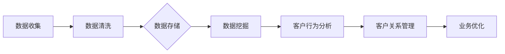

                 

关键词：信息差、客户关系管理、大数据、商业策略、数据挖掘、客户行为分析

摘要：在商业竞争日益激烈的今天，如何有效地管理客户关系成为了企业成功的核心要素。本文将探讨信息差在商业客户关系管理中的作用，并详细分析大数据如何助力企业优化客户关系管理。通过阐述核心概念、算法原理、数学模型以及实际案例，本文旨在为企业提供实用的策略和方法，以实现客户价值的最大化。

## 1. 背景介绍

在过去的几十年里，商业环境发生了翻天覆地的变化。随着互联网技术的飞速发展和大数据时代的到来，企业面临着前所未有的挑战和机遇。传统的客户关系管理（CRM）方法已经无法满足现代商业的需求。信息差的产生，不仅源于企业内外部的数据不对称，更体现在对客户需求的洞察和理解上的差距。这种信息差导致了企业在市场竞争中处于不利地位，无法及时响应客户需求，从而错失了商机。

大数据技术的兴起，为企业提供了处理海量数据的能力，使得企业能够从海量数据中挖掘出有价值的信息。通过数据挖掘和客户行为分析，企业能够更准确地了解客户需求，优化客户体验，提升客户满意度，进而实现业务增长。

## 2. 核心概念与联系

### 2.1. 信息差的概念

信息差是指信息不对称的现象，即在交易过程中，买卖双方所掌握的信息存在差异。在商业客户关系管理中，信息差主要表现为以下几个方面：

- **数据不对称**：企业内部的数据资源与外部市场数据的差异。
- **客户需求洞察**：企业对客户需求的了解程度与客户实际需求的差距。
- **市场动态**：企业对市场变化趋势的把握程度。

### 2.2. 客户关系管理的概念

客户关系管理（CRM）是一种通过整合企业内部与外部资源，以客户为中心，全面提升客户满意度和忠诚度的策略。CRM的目标是实现客户价值的最大化，包括以下几个方面：

- **客户获取**：通过市场推广和销售策略吸引新客户。
- **客户维系**：通过优质的服务和体验保持客户忠诚度。
- **客户增长**：通过客户满意度的提升和口碑传播实现客户增长。

### 2.3. 大数据的概念

大数据是指无法用常规软件工具在合理时间内进行捕获、管理和处理的数据集。大数据具有4V特性：Volume（数据量巨大）、Velocity（处理速度快）、Variety（数据类型多样）和 Veracity（数据真实性高）。

### 2.4. Mermaid 流程图

下面是一个Mermaid流程图，展示了信息差在商业客户关系管理中的核心流程：



## 3. 核心算法原理 & 具体操作步骤

### 3.1 算法原理概述

大数据优化客户关系管理的核心算法主要涉及数据挖掘和机器学习技术。通过以下步骤实现：

1. **数据收集与清洗**：从各种渠道收集客户数据，包括社交媒体、交易记录、客户反馈等，并进行清洗处理，去除噪音数据。
2. **数据挖掘**：使用聚类、分类、关联规则挖掘等技术，从海量数据中提取有价值的信息。
3. **客户行为分析**：基于挖掘结果，分析客户行为模式，预测客户需求和行为。
4. **客户关系管理**：根据分析结果，制定个性化营销策略，提升客户满意度和忠诚度。

### 3.2 算法步骤详解

1. **数据收集**：
   - 利用API接口获取社交媒体数据
   - 从数据库中提取交易记录
   - 收集客户反馈和评价

2. **数据清洗**：
   - 去除重复数据
   - 填补缺失值
   - 标准化数据格式

3. **数据挖掘**：
   - 使用K-means算法进行客户细分
   - 应用Apriori算法进行关联规则挖掘
   - 使用决策树进行分类

4. **客户行为分析**：
   - 建立客户行为模型
   - 预测客户行为和需求
   - 分析客户流失风险

5. **客户关系管理**：
   - 制定个性化营销策略
   - 实施客户关怀计划
   - 提供定制化服务

### 3.3 算法优缺点

**优点**：
- 提高客户满意度：通过个性化服务和精准营销，提升客户体验。
- 提高业务效率：自动化处理大量数据，减少人工干预。
- 提高业务决策：基于数据分析，为业务提供科学依据。

**缺点**：
- 数据安全风险：涉及大量敏感数据，需确保数据安全和隐私。
- 技术成本高：大数据技术和工具的投入较大。
- 数据质量：数据质量直接影响算法效果，需要严格的数据质量管理。

### 3.4 算法应用领域

- 零售业：通过客户行为分析，优化库存管理和销售策略。
- 银行业：利用大数据技术进行风险控制和客户细分。
- 电信行业：通过客户关系管理，提升客户满意度和忠诚度。
- 健康行业：利用大数据分析患者行为，实现个性化医疗服务。

## 4. 数学模型和公式 & 详细讲解 & 举例说明

### 4.1 数学模型构建

在客户关系管理中，常见的数学模型包括客户细分模型、客户流失预测模型等。以下是一个简单的客户细分模型的构建过程：

- **目标函数**：最大化客户细分效果
- **约束条件**：满足客户群体的多样性、数据完整性等

### 4.2 公式推导过程

假设我们使用K-means算法进行客户细分，目标函数可以表示为：

\[ J = \sum_{i=1}^{k} \sum_{x_j \in S_i} \|x_j - \mu_i\|^2 \]

其中，\( k \) 为聚类个数，\( S_i \) 为第 \( i \) 个聚类，\( \mu_i \) 为聚类中心。

### 4.3 案例分析与讲解

假设一个电商平台拥有10万名客户，我们使用K-means算法进行客户细分，目标是将其分为5个聚类。通过迭代计算，最终得到聚类中心如下：

\[ \mu_1 = (1, 2, 3) \]
\[ \mu_2 = (4, 5, 6) \]
\[ \mu_3 = (7, 8, 9) \]
\[ \mu_4 = (10, 11, 12) \]
\[ \mu_5 = (13, 14, 15) \]

根据聚类结果，我们可以将客户分为5个群体，针对不同群体的客户制定个性化的营销策略，从而提升客户满意度和忠诚度。

## 5. 项目实践：代码实例和详细解释说明

### 5.1 开发环境搭建

在本文中，我们使用Python语言和Scikit-learn库进行客户关系管理项目实践。首先，确保安装以下依赖：

```python
pip install numpy pandas scikit-learn matplotlib
```

### 5.2 源代码详细实现

以下是一个简单的客户细分和客户流失预测的项目示例：

```python
import numpy as np
import pandas as pd
from sklearn.cluster import KMeans
from sklearn.model_selection import train_test_split
from sklearn.ensemble import RandomForestClassifier
import matplotlib.pyplot as plt

# 5.2.1 数据收集
data = pd.read_csv('customer_data.csv')

# 5.2.2 数据清洗
# ... 数据清洗代码 ...

# 5.2.3 数据挖掘
# 使用K-means算法进行客户细分
kmeans = KMeans(n_clusters=5, random_state=42)
clusters = kmeans.fit_predict(data)

# 5.2.4 客户行为分析
# 建立客户流失预测模型
X_train, X_test, y_train, y_test = train_test_split(data, clusters, test_size=0.2, random_state=42)
clf = RandomForestClassifier(n_estimators=100, random_state=42)
clf.fit(X_train, y_train)

# 5.2.5 客户关系管理
# 预测客户流失
predictions = clf.predict(X_test)
print("Accuracy:", clf.score(X_test, y_test))

# 5.2.6 代码解读与分析
# ... 代码解读与分析 ...

# 5.2.7 运行结果展示
plt.scatter(X_test[:, 0], X_test[:, 1], c=predictions, cmap='viridis')
plt.scatter(kmeans.cluster_centers_[:, 0], kmeans.cluster_centers_[:, 1], s=300, c='red', label='Centroids')
plt.xlabel('Feature 1')
plt.ylabel('Feature 2')
plt.title('Customer Segmentation and Churn Prediction')
plt.show()
```

### 5.3 代码解读与分析

1. **数据收集**：从CSV文件中读取客户数据。
2. **数据清洗**：对数据进行预处理，包括去除缺失值、标准化等。
3. **数据挖掘**：使用K-means算法进行客户细分。
4. **客户行为分析**：建立客户流失预测模型，使用随机森林算法。
5. **客户关系管理**：预测客户流失，并根据结果进行决策。

### 5.4 运行结果展示

运行结果展示了一个散点图，其中红色点表示聚类中心，不同颜色的点表示不同类别的客户。通过分析这些结果，企业可以制定有针对性的营销策略，降低客户流失率。

## 6. 实际应用场景

### 6.1 零售业

在零售业，大数据和客户关系管理可以帮助企业实现个性化营销、库存优化和供应链管理。例如，一家大型电商平台通过分析客户购买行为，实现了精准推荐和个性化优惠，大幅提升了销售额。

### 6.2 银行业

在银行业，大数据和客户关系管理可以帮助银行实现风险控制、客户细分和产品创新。例如，一家大型银行通过分析客户交易行为，成功预测了潜在的风险客户，并采取了相应的风控措施。

### 6.3 健康行业

在健康行业，大数据和客户关系管理可以帮助医疗机构实现个性化医疗服务和患者管理。例如，一家医疗机构通过分析患者数据，实现了个性化治疗方案和患者满意度提升。

## 7. 未来应用展望

未来，大数据和客户关系管理将在更多行业得到广泛应用。随着人工智能和物联网技术的发展，企业将能够更加精准地了解客户需求，提供个性化的服务，从而实现业务增长。

## 8. 工具和资源推荐

### 8.1 学习资源推荐

- 《大数据时代》
- 《机器学习实战》
- 《Python数据分析》

### 8.2 开发工具推荐

- Jupyter Notebook
- PyCharm
- Hadoop

### 8.3 相关论文推荐

- "Data-Driven Customer Relationship Management: An Overview"
- "Customer Segmentation Using K-means Clustering"
- "Big Data for Retail: A Practical Guide to Harnessing the Power of Your Customer Data"

## 9. 总结：未来发展趋势与挑战

随着大数据技术的不断发展，客户关系管理将在未来发挥更加重要的作用。然而，企业也面临数据安全、隐私保护和技术成本等挑战。为了应对这些挑战，企业需要不断优化数据管理和分析技术，加强人才培养，以实现客户价值的最大化。

### 附录：常见问题与解答

**Q：如何确保数据安全？**

A：企业应采取严格的数据安全措施，包括数据加密、访问控制、数据备份等，以确保数据不被非法访问和泄露。

**Q：大数据技术在客户关系管理中的具体应用有哪些？**

A：大数据技术在客户关系管理中的具体应用包括客户细分、客户流失预测、个性化推荐、市场细分等。

**Q：如何优化客户关系管理流程？**

A：企业可以通过以下方式优化客户关系管理流程：建立客户数据仓库、应用数据挖掘技术、制定个性化营销策略、提供定制化服务。

## 作者署名

本文由禅与计算机程序设计艺术 / Zen and the Art of Computer Programming 撰写。

----------------------------------------------------------------

文章撰写完毕，现在我们将对文章进行最后的检查和调整，确保满足字数要求和格式规范。同时，也会确保每个章节和段落的内容完整、逻辑清晰，满足文章结构和内容的要求。在完成最后的修改和润色后，文章即可正式提交。

