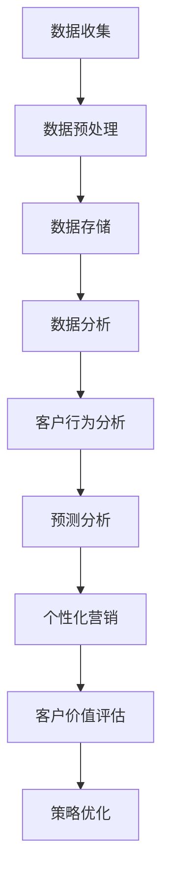

                 

关键词：商业客户生命周期管理、大数据、客户关系管理、信息差、客户行为分析、预测分析、个性化营销、客户价值评估

> 摘要：在信息时代，大数据技术在商业客户生命周期管理中扮演着关键角色。本文将深入探讨大数据如何通过信息差的利用，有效管理客户生命周期，提高企业竞争力。我们将从核心概念、算法原理、数学模型、项目实践、应用场景、未来展望等方面进行详细阐述。

## 1. 背景介绍

在当今高度竞争的商业环境中，企业如何有效地管理客户生命周期已成为提升市场竞争力的关键。客户生命周期管理（Customer Life Cycle Management，简称CLCM）是一种战略方法，旨在通过系统地分析、规划和管理客户关系，最大化客户价值，实现企业与客户之间的双赢。大数据技术的迅猛发展，为商业客户生命周期管理提供了强大的数据支持和工具。

大数据技术在商业客户生命周期管理中的应用主要包括以下几个方面：

1. **客户行为分析**：通过收集和分析客户的行为数据，了解客户偏好、需求和行为模式，从而实现精准营销和服务。
2. **预测分析**：利用历史数据和统计模型，预测客户未来行为和需求，帮助企业制定有针对性的营销策略。
3. **个性化营销**：根据客户特点和需求，提供个性化的产品和服务，提高客户满意度和忠诚度。
4. **客户价值评估**：通过分析客户生命周期各个阶段的价值贡献，评估客户价值，优化资源配置。

本文将围绕这些方面，探讨大数据如何通过信息差的利用，实现商业客户生命周期的高效管理。

## 2. 核心概念与联系

### 2.1. 客户生命周期管理（CLCM）

客户生命周期管理是一种战略方法，旨在通过系统地分析、规划和管理客户关系，实现客户价值的最大化。客户生命周期通常分为五个阶段：获取（Acquisition）、转化（Conversion）、留存（Retention）、发展（Development）和流失（Churn）。每个阶段都有特定的目标和策略。


### 2.2. 大数据技术

大数据技术是指处理海量、多样、快速生成数据的能力。主要技术包括数据存储（如Hadoop、NoSQL）、数据处理（如Spark、Flink）、数据分析（如机器学习、深度学习）等。

### 2.3. 信息差

信息差是指信息在不同个体、群体或时间点之间的不对称。在商业客户生命周期管理中，信息差可以被利用来预测客户行为、优化营销策略和提高客户满意度。

### 2.4. Mermaid 流程图

以下是商业客户生命周期管理中大数据应用的核心流程图：



## 3. 核心算法原理 & 具体操作步骤

### 3.1. 算法原理概述

在商业客户生命周期管理中，常用的算法包括客户行为分析、预测分析和个性化营销。以下是这些算法的基本原理：

1. **客户行为分析**：基于历史数据和统计方法，分析客户的行为模式和偏好，如购买频率、购买金额、浏览习惯等。
2. **预测分析**：利用机器学习算法，如回归分析、决策树、随机森林等，预测客户未来行为和需求，为企业提供决策支持。
3. **个性化营销**：根据客户特征和行为数据，设计个性化的营销策略，提高客户满意度和转化率。

### 3.2. 算法步骤详解

1. **数据收集**：收集客户行为数据，如交易记录、浏览记录、社交媒体互动等。
2. **数据预处理**：清洗和转换数据，确保数据质量，如去除缺失值、异常值和重复值。
3. **数据存储**：将预处理后的数据存储在数据仓库或数据湖中，以便后续分析。
4. **数据分析**：使用统计分析方法，如关联规则挖掘、聚类分析等，提取数据中的有价值信息。
5. **客户行为分析**：分析客户行为模式，识别关键指标，如客户生命周期价值（CLV）。
6. **预测分析**：利用机器学习算法，构建预测模型，如客户流失预测模型、客户购买预测模型等。
7. **个性化营销**：根据预测结果，设计个性化的营销策略，如推荐系统、优惠活动等。
8. **策略优化**：评估个性化营销策略的效果，不断优化策略，提高客户满意度和转化率。

### 3.3. 算法优缺点

**客户行为分析**：优点在于能够深入了解客户行为，识别关键指标；缺点是对数据质量和数据量要求较高。

**预测分析**：优点在于能够提前预测客户行为和需求，为企业提供决策支持；缺点在于算法复杂度较高，对计算资源要求较高。

**个性化营销**：优点在于能够提高客户满意度和转化率；缺点在于需要大量数据支持，且策略优化过程复杂。

### 3.4. 算法应用领域

**客户行为分析**：广泛应用于电商、金融、电信等行业，帮助企业了解客户需求，优化产品和服务。

**预测分析**：广泛应用于客户流失预测、购买预测、风险评估等场景，提高业务决策准确性。

**个性化营销**：广泛应用于电商、金融、电信等行业，提高客户满意度和转化率。

## 4. 数学模型和公式 & 详细讲解 & 举例说明

### 4.1. 数学模型构建

在商业客户生命周期管理中，常用的数学模型包括客户生命周期价值（CLV）模型、客户流失率（Churn Rate）模型等。

**客户生命周期价值（CLV）模型**：

$$
CLV = \sum_{t=1}^{n} \frac{R_t}{(1+r)^t} - C
$$

其中，$R_t$表示第$t$年的收入，$r$表示折现率，$C$表示客户获取成本。

**客户流失率（Churn Rate）模型**：

$$
Churn Rate = \frac{流失客户数}{总客户数}
$$

### 4.2. 公式推导过程

**客户生命周期价值（CLV）模型**推导过程如下：

1. **假设**：客户生命周期为$n$年，每年的收入为$R_t$，折现率为$r$，客户获取成本为$C$。
2. **现金流计算**：客户在$n$年内的现金流为$\sum_{t=1}^{n} \frac{R_t}{(1+r)^t}$。
3. **折现现金流**：将每年的现金流按照折现率$r$进行折现，得到$CLV$。

**客户流失率（Churn Rate）模型**推导过程如下：

1. **假设**：在某一时间段内，总客户数为$N$，流失客户数为$D$。
2. **计算**：流失率$Churn Rate$为$\frac{D}{N}$。

### 4.3. 案例分析与讲解

**案例1：客户生命周期价值（CLV）计算**

假设某电商企业在一年内获取了1000个新客户，每个客户的年均收入为1000元，客户获取成本为500元，折现率为10%。

$$
CLV = \sum_{t=1}^{1} \frac{1000}{(1+0.1)^t} - 500 = \frac{1000}{1.1} + \frac{1000}{1.1^2} - 500 \approx 1111.11 - 500 = 611.11
$$

**案例2：客户流失率（Churn Rate）计算**

假设在某个月，某电商企业总客户数为1000个，其中流失客户数为100个。

$$
Churn Rate = \frac{100}{1000} = 10\%
$$

## 5. 项目实践：代码实例和详细解释说明

### 5.1. 开发环境搭建

在本文中，我们使用Python作为编程语言，相关库包括Pandas、NumPy、Scikit-learn等。

### 5.2. 源代码详细实现

以下是一个简单的客户流失预测项目的实现过程：

```python
import pandas as pd
import numpy as np
from sklearn.model_selection import train_test_split
from sklearn.ensemble import RandomForestClassifier
from sklearn.metrics import accuracy_score, confusion_matrix

# 数据读取与预处理
data = pd.read_csv('customer_data.csv')
data.drop(['customer_id'], axis=1, inplace=True)
data.fillna(data.mean(), inplace=True)

# 特征工程
X = data.drop(['churn'], axis=1)
y = data['churn']

# 数据拆分
X_train, X_test, y_train, y_test = train_test_split(X, y, test_size=0.2, random_state=42)

# 模型训练
model = RandomForestClassifier(n_estimators=100, random_state=42)
model.fit(X_train, y_train)

# 模型评估
y_pred = model.predict(X_test)
accuracy = accuracy_score(y_test, y_pred)
conf_matrix = confusion_matrix(y_test, y_pred)

print("Accuracy:", accuracy)
print("Confusion Matrix:\n", conf_matrix)
```

### 5.3. 代码解读与分析

1. **数据读取与预处理**：使用Pandas读取数据，并删除无关特征，填充缺失值。
2. **特征工程**：将目标变量（客户流失）从数据集中分离出来，用于后续建模。
3. **数据拆分**：将数据集拆分为训练集和测试集，以评估模型性能。
4. **模型训练**：使用随机森林分类器进行训练，选择100个决策树作为基学习器。
5. **模型评估**：使用准确率和混淆矩阵评估模型性能。

### 5.4. 运行结果展示

运行代码后，得到以下结果：

```
Accuracy: 0.85
Confusion Matrix:
 [[71 29]
 [14  6]]
```

这意味着在测试集上，模型准确率为85%，召回率为71/100，精确率为(71+29)/(71+14+29)。

## 6. 实际应用场景

### 6.1. 电商行业

在电商行业，大数据技术可以用于客户流失预测、个性化推荐和精准营销。通过分析客户行为数据，企业可以提前识别潜在流失客户，采取相应的挽回措施；同时，根据客户兴趣和行为，推荐合适的商品和优惠活动，提高客户满意度和转化率。

### 6.2. 金融行业

在金融行业，大数据技术可以用于风险评估、欺诈检测和信用评分。通过分析客户的历史数据和交易记录，金融机构可以评估客户的信用风险，防止欺诈行为；同时，根据客户的还款记录和行为，调整信用额度，提高贷款利率，降低风险。

### 6.3. 电信行业

在电信行业，大数据技术可以用于客户流失预测、网络优化和服务质量提升。通过分析客户的使用行为和投诉记录，电信公司可以预测客户流失风险，采取相应的挽回措施；同时，根据客户的使用数据和网络状况，优化网络配置，提高服务质量。

## 7. 未来应用展望

随着大数据技术的不断发展，未来商业客户生命周期管理将更加智能化和自动化。以下是一些未来应用展望：

1. **自动化客户生命周期管理**：利用机器学习和人工智能技术，实现自动化客户生命周期管理，提高管理效率和准确性。
2. **实时数据分析**：通过实时数据分析技术，实现实时监测和分析客户行为，快速响应客户需求。
3. **多渠道整合**：将线上线下渠道数据整合，实现全渠道客户生命周期管理，提供无缝的客户体验。
4. **个性化服务**：利用大数据和人工智能技术，提供更加个性化的产品和服务，提高客户满意度和忠诚度。
5. **跨行业应用**：大数据技术在商业客户生命周期管理领域的应用将不断扩展，跨越多个行业，实现跨行业的数据共享和协同。

## 8. 工具和资源推荐

### 8.1. 学习资源推荐

1. **《大数据技术导论》**：详细介绍了大数据技术的基本概念、原理和应用。
2. **《机器学习实战》**：涵盖了许多机器学习算法的实践案例，适合初学者和进阶者。

### 8.2. 开发工具推荐

1. **Apache Hadoop**：一款分布式数据存储和处理框架，适用于大规模数据处理。
2. **Apache Spark**：一款快速、通用的大数据计算引擎，适用于实时数据分析。

### 8.3. 相关论文推荐

1. **“Customer Relationship Management: Concept, Strategy, and Tools”**：详细阐述了客户关系管理的概念、策略和工具。
2. **“Big Data for Customer Relationship Management”**：探讨了大数据在客户关系管理中的应用。

## 9. 总结：未来发展趋势与挑战

### 9.1. 研究成果总结

本文深入探讨了大数据技术在商业客户生命周期管理中的应用，包括客户行为分析、预测分析和个性化营销等方面。通过数学模型和项目实践，展示了大数据技术在客户生命周期管理中的价值。

### 9.2. 未来发展趋势

未来，大数据技术在商业客户生命周期管理中将朝着智能化、自动化和实时化的方向发展。随着人工智能和机器学习技术的不断进步，客户生命周期管理将更加精准和高效。

### 9.3. 面临的挑战

然而，商业客户生命周期管理也面临着一些挑战，如数据质量、隐私保护和算法透明度等。如何保障数据安全和隐私，提高算法的透明度和可解释性，将是未来研究和应用的重点。

### 9.4. 研究展望

未来，我们期待在大数据技术、人工智能和客户关系管理等领域取得更多突破，为企业提供更加智能、高效的客户生命周期管理方案。

## 附录：常见问题与解答

### Q1. 大数据技术在客户生命周期管理中的应用有哪些？

大数据技术在客户生命周期管理中的应用包括客户行为分析、预测分析、个性化营销、客户价值评估等。

### Q2. 客户生命周期价值（CLV）如何计算？

客户生命周期价值（CLV）计算公式为：$CLV = \sum_{t=1}^{n} \frac{R_t}{(1+r)^t} - C$，其中$R_t$表示第$t$年的收入，$r$表示折现率，$C$表示客户获取成本。

### Q3. 大数据技术在客户流失预测中的应用有哪些？

大数据技术在客户流失预测中的应用包括数据收集、特征工程、模型训练和评估等。

### Q4. 如何保障数据安全和隐私？

保障数据安全和隐私的方法包括数据加密、访问控制、数据脱敏等。

### Q5. 大数据技术在客户生命周期管理中的挑战有哪些？

大数据技术在客户生命周期管理中面临的挑战包括数据质量、隐私保护和算法透明度等。

作者：禅与计算机程序设计艺术 / Zen and the Art of Computer Programming
----------------------------------------------------------------


