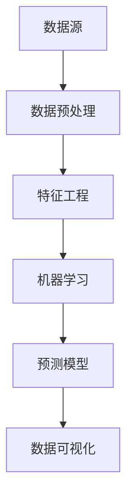

                 

关键词：大数据，信息差，商机发现，算法原理，应用领域

> 摘要：随着大数据技术的不断发展，如何从海量数据中发掘隐藏的商机成为众多企业关注的焦点。本文旨在探讨大数据在商机发现中的应用，分析其核心概念、算法原理、数学模型以及实际案例，为企业和创业者提供参考。

## 1. 背景介绍

在信息化时代，数据已成为一种重要的生产资料。随着互联网、物联网、移动通信等技术的快速发展，数据量呈现爆炸式增长。大数据技术的出现，为处理和分析海量数据提供了强大的工具和方法。然而，如何从这些数据中挖掘出有价值的商机，成为企业面临的重要课题。

### 1.1 大数据的定义与特点

大数据（Big Data）指的是无法使用常规软件工具在合理时间内捕捉、管理和处理的大量数据。它具有以下四个主要特点：

- **大量性（Volume）**：数据量大，通常在 TB、PB甚至EB级别。
- **多样性（Variety）**：数据来源广泛，包括结构化、半结构化和非结构化数据。
- **速度（Velocity）**：数据生成和处理速度快，需要实时或近实时分析。
- **真实性（Veracity）**：数据真实性难以保证，存在噪声、错误和虚假信息。

### 1.2 商机发现的意义

商机发现是指从大量数据中识别出潜在的市场机会，以实现商业价值。在竞争激烈的市场环境中，及时把握商机对企业发展至关重要。通过大数据技术进行商机发现，可以帮助企业：

- **优化决策**：基于数据分析和预测，提高决策的准确性和效率。
- **提升竞争力**：发掘潜在客户和市场需求，增强产品竞争力。
- **降低成本**：优化供应链、降低库存和营销成本，提高运营效率。

## 2. 核心概念与联系

### 2.1 商机发现的核心概念

商机发现涉及多个核心概念，包括数据源、数据预处理、特征工程、机器学习和预测模型等。

- **数据源**：包括企业内部数据（如销售数据、客户数据等）和外部数据（如社交媒体、市场调查等）。
- **数据预处理**：包括数据清洗、数据集成和数据转换，以提高数据质量。
- **特征工程**：从原始数据中提取有助于模型训练的特征，以提高预测准确率。
- **机器学习**：使用算法从数据中学习规律，构建预测模型。
- **预测模型**：基于历史数据和特征，预测未来的商机。

### 2.2 商机发现的技术架构

商机发现的技术架构通常包括数据采集、数据存储、数据处理、数据分析和数据可视化等模块。

- **数据采集**：通过API、爬虫等技术获取数据源。
- **数据存储**：使用分布式数据库和大数据存储技术（如Hadoop、Spark等）存储数据。
- **数据处理**：使用ETL（提取、转换、加载）工具处理数据。
- **数据分析**：使用数据挖掘和机器学习算法分析数据。
- **数据可视化**：通过图表和报表等形式展示分析结果。

### 2.3 Mermaid 流程图



## 3. 核心算法原理 & 具体操作步骤

### 3.1 算法原理概述

商机发现的核心算法通常包括聚类分析、分类算法、关联规则挖掘等。

- **聚类分析**：将相似的数据点归为一类，用于发现潜在的市场细分。
- **分类算法**：将数据划分为不同的类别，用于预测潜在商机。
- **关联规则挖掘**：发现数据之间的关联关系，用于识别市场需求。

### 3.2 算法步骤详解

1. **数据采集**：获取企业内部和外部数据源。
2. **数据预处理**：清洗、集成和转换数据，提高数据质量。
3. **特征工程**：从原始数据中提取特征，构建特征向量。
4. **机器学习模型训练**：选择合适的算法（如K-means、决策树、Apriori算法等），训练预测模型。
5. **模型评估**：使用交叉验证等方法评估模型性能。
6. **预测商机**：基于模型预测潜在商机，为决策提供支持。

### 3.3 算法优缺点

- **聚类分析**：优点是无需预先设定类别，可发现潜在的市场细分；缺点是聚类效果受初始值影响较大，且无法直接用于预测。
- **分类算法**：优点是预测准确，可应用于各种分类任务；缺点是需要大量训练数据和计算资源。
- **关联规则挖掘**：优点是可发现数据之间的关联关系，用于识别市场需求；缺点是规则数量庞大，难以处理。

### 3.4 算法应用领域

- **市场营销**：分析客户行为，发现潜在客户和市场细分。
- **供应链管理**：优化库存和供应链，降低运营成本。
- **金融风控**：识别潜在风险，提高风险管理能力。
- **医疗健康**：分析患者数据，发现疾病趋势和潜在商机。

## 4. 数学模型和公式 & 详细讲解 & 举例说明

### 4.1 数学模型构建

商机发现的数学模型通常包括聚类模型、分类模型和关联规则模型。

1. **聚类模型**（K-means算法）：

   $$ \text{Minimize} \sum_{i=1}^{k} \sum_{x \in S_i} \| x - \mu_i \|^2 $$

   其中，\( k \) 表示聚类个数，\( \mu_i \) 表示第 \( i \) 个聚类中心，\( S_i \) 表示第 \( i \) 个聚类。

2. **分类模型**（决策树算法）：

   $$ \text{Maximize} \text{Entropy}(X) - \text{Entropy}(Y|X) $$

   其中，\( X \) 表示特征空间，\( Y \) 表示目标变量。

3. **关联规则模型**（Apriori算法）：

   $$ \text{Support}(A \cup B) = \frac{|\{(x, y) \in D | x \cup y \in A \cup B\}|}{|D|} $$

   其中，\( A \) 和 \( B \) 表示两个项集，\( D \) 表示事务集。

### 4.2 公式推导过程

1. **K-means算法**：

   假设数据集为 \( X = \{x_1, x_2, ..., x_n\} \)，聚类中心为 \( \mu_i = \frac{1}{n} \sum_{x \in S_i} x \)。

   初始时，随机选择 \( k \) 个数据点作为初始聚类中心。然后，计算每个数据点到聚类中心的距离，并将其归为最近的聚类。

   更新聚类中心：

   $$ \mu_i = \frac{1}{n} \sum_{x \in S_i} x $$

   重复上述步骤，直至聚类中心不再发生变化。

2. **决策树算法**：

   设 \( X \) 为特征空间，\( Y \) 为目标变量，\( P(X) \) 为特征的概率分布，\( P(Y|X) \) 为条件概率分布。

   条件熵：

   $$ \text{Entropy}(Y|X) = - \sum_{x \in X} P(X=x) \sum_{y \in Y} P(Y=y|X=x) \log P(Y=y|X=x) $$

   信息增益：

   $$ \text{InformationGain}(X, Y) = \text{Entropy}(Y) - \text{Entropy}(Y|X) $$

   选择信息增益最大的特征作为分裂标准。

3. **Apriori算法**：

   设 \( D \) 为事务集，\( A \) 和 \( B \) 为两个项集。

   支持度：

   $$ \text{Support}(A) = \frac{|\{(x, y) \in D | x \in A\}|}{|D|} $$

   置信度：

   $$ \text{Confidence}(A \rightarrow B) = \frac{|\{(x, y) \in D | x \in A \land y \in B\}|}{|\{(x, y) \in D | x \in A\}|} $$

   根据支持度和置信度筛选出强关联规则。

### 4.3 案例分析与讲解

**案例1：市场营销**

某公司希望通过大数据分析，发现潜在客户并提升营销效果。数据包括客户购买历史、浏览行为、社交媒体活动等。

1. **数据预处理**：清洗、集成和转换数据，提高数据质量。
2. **特征工程**：提取客户年龄、性别、购买金额等特征，构建特征向量。
3. **机器学习模型训练**：使用K-means算法聚类，将客户划分为不同类别。选择分类算法（如决策树）训练预测模型，预测潜在客户。
4. **预测商机**：基于模型预测潜在客户，制定个性化的营销策略。

**案例2：供应链管理**

某公司希望通过大数据分析，优化库存和供应链，降低运营成本。数据包括库存水平、订单量、供应商信息等。

1. **数据预处理**：清洗、集成和转换数据，提高数据质量。
2. **特征工程**：提取库存水平、订单量、供应商交货周期等特征，构建特征向量。
3. **机器学习模型训练**：使用关联规则挖掘算法（如Apriori算法），发现库存和订单量之间的关联关系。
4. **预测商机**：基于关联规则，优化库存策略和供应链管理，降低运营成本。

## 5. 项目实践：代码实例和详细解释说明

### 5.1 开发环境搭建

1. 安装Python环境（版本3.8及以上）。
2. 安装NumPy、Pandas、Scikit-learn、Matplotlib等Python库。

### 5.2 源代码详细实现

```python
import numpy as np
import pandas as pd
from sklearn.cluster import KMeans
from sklearn.tree import DecisionTreeClassifier
from sklearn.model_selection import train_test_split
import matplotlib.pyplot as plt

# 5.2.1 数据预处理
# 加载数据
data = pd.read_csv('data.csv')
# 数据清洗
data = data.dropna()
# 特征工程
features = data[['age', 'gender', 'purchase_amount']]
labels = data['is_potential_customer']

# 5.2.2 机器学习模型训练
# 数据划分
X_train, X_test, y_train, y_test = train_test_split(features, labels, test_size=0.3, random_state=42)
# K-means算法聚类
kmeans = KMeans(n_clusters=3, random_state=42)
kmeans.fit(X_train)
# 决策树算法分类
clf = DecisionTreeClassifier(random_state=42)
clf.fit(X_train, y_train)

# 5.2.3 代码解读与分析
# 聚类结果
print("Cluster centers:\n", kmeans.cluster_centers_)
# 分类结果
print("Classification results:\n", clf.predict(X_test))

# 5.2.4 运行结果展示
# 可视化聚类结果
plt.scatter(X_train['age'], X_train['purchase_amount'], c=kmeans.labels_, cmap='viridis')
plt.scatter(kmeans.cluster_centers_['age'], kmeans.cluster_centers_['purchase_amount'], s=300, c='red', marker='s')
plt.xlabel('Age')
plt.ylabel('Purchase Amount')
plt.title('K-means Clustering')
plt.show()

# 可视化分类结果
plt.scatter(X_test['age'], X_test['purchase_amount'], c=clf.predict(X_test), cmap='viridis')
plt.xlabel('Age')
plt.ylabel('Purchase Amount')
plt.title('Decision Tree Classification')
plt.show()
```

### 5.3 代码解读与分析

- **数据预处理**：加载数据，并进行清洗和特征工程。
- **机器学习模型训练**：使用K-means算法聚类和决策树算法分类。
- **代码解读与分析**：聚类结果和分类结果的可视化展示。

## 6. 实际应用场景

### 6.1 市场营销

- **目标**：发现潜在客户，提升营销效果。
- **场景**：电商、金融、保险等行业的客户管理。

### 6.2 供应链管理

- **目标**：优化库存和供应链，降低运营成本。
- **场景**：制造、零售、物流等行业。

### 6.3 金融风控

- **目标**：识别潜在风险，提高风险管理能力。
- **场景**：银行、证券、保险等金融机构。

### 6.4 未来应用展望

- **个性化推荐**：基于大数据分析，实现个性化推荐，提升用户体验。
- **智能医疗**：利用大数据分析，提高疾病诊断和治疗效果。
- **智慧城市**：通过大数据分析，优化城市管理和公共服务。

## 7. 工具和资源推荐

### 7.1 学习资源推荐

- **书籍**：
  - 《大数据时代》
  - 《机器学习》
  - 《Python数据分析》
- **在线课程**：
  - Coursera《机器学习》
  - edX《数据科学》
  - Udacity《大数据分析》

### 7.2 开发工具推荐

- **Python库**：
  - NumPy、Pandas、Scikit-learn、Matplotlib
- **大数据平台**：
  - Hadoop、Spark、Flink

### 7.3 相关论文推荐

- **市场营销**：
  - "Customer Segmentation using Clustering Algorithms"
  - "Application of Machine Learning Algorithms in Customer Relationship Management"
- **供应链管理**：
  - "Data Mining Techniques for Supply Chain Management"
  - "An Overview of Big Data Analytics in Supply Chain Management"
- **金融风控**：
  - "Machine Learning for Financial Risk Management"
  - "Big Data and Its Applications in Finance"

## 8. 总结：未来发展趋势与挑战

### 8.1 研究成果总结

本文从大数据在商机发现中的应用出发，分析了核心概念、算法原理、数学模型以及实际案例，展示了大数据在市场营销、供应链管理和金融风控等领域的应用前景。

### 8.2 未来发展趋势

- **个性化推荐**：结合用户行为和大数据分析，实现更精准的个性化推荐。
- **智能医疗**：利用大数据分析，提高疾病诊断和治疗效果。
- **智慧城市**：通过大数据分析，优化城市管理和公共服务。

### 8.3 面临的挑战

- **数据质量**：确保数据质量，提高数据分析的准确性。
- **隐私保护**：保护用户隐私，遵守相关法律法规。
- **计算资源**：提高计算能力，满足大数据处理的性能需求。

### 8.4 研究展望

随着大数据技术的不断发展，商机发现将在更多领域发挥重要作用。未来研究方向包括：优化算法性能、提高数据分析的智能化水平、探索跨领域的大数据应用。

## 9. 附录：常见问题与解答

### 9.1 什么是大数据？

大数据（Big Data）指的是无法使用常规软件工具在合理时间内捕捉、管理和处理的大量数据。它具有大量性、多样性、速度和真实性等特点。

### 9.2 商机发现的核心算法有哪些？

商机发现的核心算法包括聚类分析、分类算法和关联规则挖掘等。

### 9.3 如何保障数据质量？

保障数据质量的方法包括数据清洗、数据集成和数据转换等。通过这些方法，可以提高数据的质量和准确性。

### 9.4 大数据在哪些领域有广泛应用？

大数据在市场营销、供应链管理、金融风控、医疗健康、智慧城市等领域有广泛应用。

----------------------------------------------------------------

作者：禅与计算机程序设计艺术 / Zen and the Art of Computer Programming
----------------------------------------------------------------

注意：本文内容仅供参考，实际应用中需根据具体情况进行调整。文中提到的技术和方法可能会随着时间推移而发生变化。在应用大数据技术时，请务必遵守相关法律法规和伦理规范。

