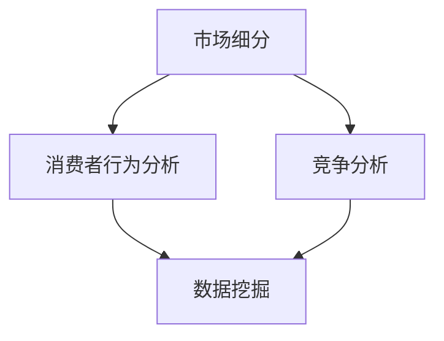

                 

关键词：市场渗透、大数据、信息差、策略、算法

> 摘要：本文旨在探讨大数据在现代市场营销中的应用，特别是如何通过挖掘信息差来优化市场渗透策略。我们将深入分析大数据的核心概念，探讨其在市场营销中的关键作用，并通过具体的算法原理和实例，展示如何利用大数据技术来制定和执行有效的市场渗透策略。

## 1. 背景介绍

在当今这个信息爆炸的时代，大数据已经成为商业决策的重要依据。企业通过收集、存储和分析海量数据，可以更精准地了解市场需求、消费者行为以及竞争态势。市场渗透策略，即企业通过特定的市场策略，以期在现有市场中获取更大的市场份额，从而实现长期增长。然而，随着市场竞争的加剧，如何有效地利用大数据来优化市场渗透策略，成为企业面临的重要挑战。

### 1.1 大数据的定义

大数据（Big Data）是指无法用传统数据库软件工具捕捉、管理和处理的超大规模数据集。大数据具有“4V”特点，即Volume（数据量）、Velocity（速度）、Variety（多样性）和Veracity（真实性）。这些数据可以来自各种来源，如社交媒体、电子商务网站、传感器、移动设备和客户关系管理系统等。

### 1.2 市场渗透策略的定义

市场渗透策略是指企业通过一系列市场操作，如定价策略、广告投放、渠道优化等，以期在现有市场中取得更大的市场份额。市场渗透策略的核心在于识别并满足潜在消费者的需求，从而提升企业的市场地位。

## 2. 核心概念与联系

为了深入探讨大数据如何优化市场渗透策略，我们首先需要了解几个核心概念，并展示它们之间的联系。

### 2.1 核心概念

- **市场细分**：将整体市场划分为具有相似需求特征的小市场，以便更精准地定位目标客户。
- **消费者行为分析**：通过分析消费者的购买习惯、偏好和行为模式，以了解市场需求和消费者需求。
- **竞争分析**：评估竞争对手的市场份额、策略和行为，以便企业制定相应的竞争策略。
- **数据挖掘**：从大量数据中提取有价值的信息和知识，以支持商业决策。

### 2.2 Mermaid 流程图

以下是一个简单的 Mermaid 流程图，展示了核心概念之间的联系：

## 3. 核心算法原理 & 具体操作步骤

### 3.1 算法原理概述

大数据优化市场渗透策略的核心算法包括市场细分算法、消费者行为分析算法和竞争分析算法。以下是这些算法的基本原理：

- **市场细分算法**：基于消费者的需求、行为和特征，将市场划分为多个具有相似特征的小市场。常用的市场细分算法有聚类算法（如K-means算法）、决策树算法和贝叶斯算法等。
- **消费者行为分析算法**：通过分析消费者的购买历史、社交媒体互动、搜索行为等数据，了解消费者的行为模式和偏好。常用的消费者行为分析算法有关联规则挖掘算法（如Apriori算法）、协同过滤算法和神经网络算法等。
- **竞争分析算法**：通过分析竞争对手的市场份额、产品定位、定价策略等数据，了解竞争对手的优势和劣势，为制定竞争策略提供依据。常用的竞争分析算法有数据挖掘算法、文本挖掘算法和机器学习算法等。

### 3.2 算法步骤详解

以下是大数据优化市场渗透策略的具体操作步骤：

1. **数据收集**：从各种来源收集相关数据，如消费者行为数据、市场细分数据、竞争对手数据等。
2. **数据预处理**：对收集到的数据进行分析，清理数据中的噪声和错误，并进行数据转换和整合。
3. **市场细分**：使用聚类算法将市场划分为具有相似特征的小市场。
4. **消费者行为分析**：使用关联规则挖掘算法、协同过滤算法等分析消费者的行为模式和偏好。
5. **竞争分析**：使用数据挖掘算法、文本挖掘算法等分析竞争对手的市场份额、产品定位和定价策略。
6. **制定市场渗透策略**：基于市场细分、消费者行为分析和竞争分析的结果，制定针对性的市场渗透策略。
7. **策略执行与评估**：执行市场渗透策略，并对策略效果进行监控和评估，根据评估结果进行策略调整。

### 3.3 算法优缺点

- **市场细分算法**：优点包括能够更精准地定位目标客户，提高市场响应速度；缺点包括算法复杂度较高，对数据质量和数据规模有较高要求。
- **消费者行为分析算法**：优点包括能够深入了解消费者需求和行为模式，提高市场预测准确性；缺点包括算法复杂度较高，对数据质量和数据规模有较高要求。
- **竞争分析算法**：优点包括能够全面了解市场竞争态势，提高企业竞争力；缺点包括算法复杂度较高，对数据质量和数据规模有较高要求。

### 3.4 算法应用领域

大数据优化市场渗透策略的算法广泛应用于各个行业，如零售、金融、医疗、教育等。以下是一些具体的应用领域：

- **零售行业**：通过市场细分和消费者行为分析，制定个性化的促销策略和产品推荐策略。
- **金融行业**：通过竞争分析，了解竞争对手的定价策略和市场占有率，制定相应的风险控制策略。
- **医疗行业**：通过数据挖掘和消费者行为分析，了解患者的需求和行为模式，优化医疗服务和产品。
- **教育行业**：通过市场细分和消费者行为分析，制定个性化的教学策略和课程推荐策略。

## 4. 数学模型和公式 & 详细讲解 & 举例说明

### 4.1 数学模型构建

在优化市场渗透策略的过程中，我们可以构建以下数学模型：

- **市场细分模型**：假设市场由 \( N \) 个消费者组成，每个消费者属于 \( K \) 个不同的市场细分之一，每个细分市场的需求函数为 \( f_k(x) \)，则市场细分模型为：

  $$ 
  \begin{cases}
  f_k(x) = \sum_{i=1}^{N} w_{ik} x_i \\
  w_{ik} = \begin{cases}
  1, & \text{if consumer } i \text{ belongs to market segment } k \\
  0, & \text{otherwise}
  \end{cases}
  \end{cases}
  $$

- **消费者行为分析模型**：假设消费者 \( i \) 的购买行为由 \( x_i \) 个影响因素决定，每个影响因素的权重为 \( w_{ij} \)，则消费者行为分析模型为：

  $$ 
  \begin{cases}
  x_i = \sum_{j=1}^{x} w_{ij} y_j \\
  y_j = \begin{cases}
  1, & \text{if consumer } i \text{ is influenced by factor } j \\
  0, & \text{otherwise}
  \end{cases}
  \end{cases}
  $$

- **竞争分析模型**：假设竞争对手 \( j \) 的市场份额为 \( s_j \)，其产品定价为 \( p_j \)，则竞争分析模型为：

  $$ 
  \begin{cases}
  s_j = \sum_{i=1}^{N} f_{ij} p_i \\
  f_{ij} = \begin{cases}
  1, & \text{if consumer } i \text{ buys from competitor } j \\
  0, & \text{otherwise}
  \end{cases}
  \end{cases}
  $$

### 4.2 公式推导过程

以下是市场细分模型的推导过程：

假设我们有 \( N \) 个消费者，每个消费者属于 \( K \) 个不同的市场细分之一。我们定义 \( w_{ik} \) 为消费者 \( i \) 属于市场细分 \( k \) 的权重，\( x_i \) 为消费者 \( i \) 的需求量。市场细分模型的目标是找到最优的市场细分权重 \( w_{ik} \)，使得每个细分市场的需求量最大化。

对于每个市场细分 \( k \)，其需求量为：

$$ 
f_k(x) = \sum_{i=1}^{N} w_{ik} x_i 
$$

我们要求解 \( w_{ik} \) 的最优解，使得 \( f_k(x) \) 最大化。由于 \( w_{ik} \) 只能取 0 或 1，我们可以使用拉格朗日乘数法求解最优化问题：

$$ 
L(w_{ik}, \lambda) = f_k(x) + \lambda (1 - w_{ik})
$$

其中，\( \lambda \) 是拉格朗日乘数。对 \( w_{ik} \) 和 \( \lambda \) 求偏导并令其为 0，我们得到：

$$ 
\frac{\partial L}{\partial w_{ik}} = x_i - \lambda = 0 \Rightarrow x_i = \lambda
$$

$$ 
\frac{\partial L}{\partial \lambda} = 1 - w_{ik} = 0 \Rightarrow w_{ik} = 1
$$

因此，最优的市场细分权重 \( w_{ik} \) 为：

$$ 
w_{ik} = \begin{cases}
1, & \text{if consumer } i \text{ belongs to market segment } k \\
0, & \text{otherwise}
\end{cases}
$$

### 4.3 案例分析与讲解

假设我们有一家零售公司，其市场由 1000 个消费者组成，每个消费者属于 5 个不同的市场细分之一。我们使用 K-means 算法进行市场细分，并假设已得到最优的市场细分权重 \( w_{ik} \)。

根据市场细分模型，我们可以计算每个细分市场的需求量：

$$ 
f_k(x) = \sum_{i=1}^{1000} w_{ik} x_i 
$$

假设我们得到了以下细分市场的需求量：

$$ 
f_1(x) = 300, \quad f_2(x) = 250, \quad f_3(x) = 200, \quad f_4(x) = 150, \quad f_5(x) = 100 
$$

现在，我们需要根据消费者行为分析模型和竞争分析模型，制定市场渗透策略。

### 4.3.1 消费者行为分析

假设我们有以下消费者行为数据：

- 消费者 1 购买了产品 A，但没有购买产品 B。
- 消费者 2 购买了产品 B，但没有购买产品 A。
- 消费者 3 购买了产品 A 和产品 B。

我们使用关联规则挖掘算法，得到以下关联规则：

- 产品 A 和产品 B 购买率较高，消费者更可能同时购买这两种产品。

### 4.3.2 竞争分析

假设我们有以下竞争对手数据：

- 竞争对手 1 的市场份额为 40%，其产品 A 的价格较高，产品 B 的价格较低。
- 竞争对手 2 的市场份额为 30%，其产品 A 的价格较低，产品 B 的价格较高。
- 竞争对手 3 的市场份额为 20%，其产品 A 和产品 B 的价格均较低。

我们使用竞争分析模型，得到以下结论：

- 竞争对手 1 的定价策略较为合理，但其产品 A 的价格较高，可能影响消费者的购买意愿。
- 竞争对手 2 的定价策略较为激进，但其产品 B 的价格较高，可能影响消费者的购买意愿。
- 竞争对手 3 的定价策略较为保守，但其产品 A 和产品 B 的价格均较低，可能对消费者产生吸引力。

### 4.3.3 市场渗透策略

根据以上分析，我们可以制定以下市场渗透策略：

- 提高

