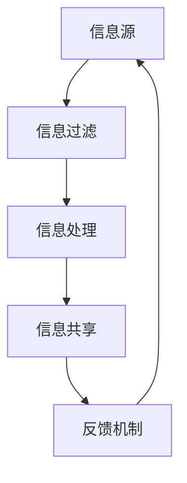

                 

关键词：信息不对称、渠道管理、经济学原理、技术实现、案例分析

摘要：本文旨在探讨信息不对称现象在IT领域的应用，以及如何通过渠道管理优化信息传递，减少不确定性，提升整体效率。文章首先介绍信息不对称的基本概念，然后分析其在经济和技术中的体现，最后通过案例研究和数学模型，提出有效的渠道管理策略。

## 1. 背景介绍

在当今的信息化时代，信息的获取、处理和传递变得愈加重要。然而，信息不对称——即不同个体之间掌握的信息量不一致——成为影响决策和效率的重要因素。信息不对称可能源于多种原因，包括信息成本、技术障碍和隐私保护等。在经济学中，信息不对称常被用来解释市场失灵现象，如道德风险和逆向选择。在技术领域，信息不对称可能导致系统安全漏洞和效率低下。

本文将结合经济学原理和技术实现，深入探讨信息不对称在渠道管理中的应用。我们将介绍如何通过优化渠道结构、提升信息透明度和实施激励机制，来降低信息不对称的影响，从而提高系统的整体效率和安全性。

## 2. 核心概念与联系

### 2.1 信息不对称的定义

信息不对称是指市场中的不同个体对同一信息的了解程度不同。在理想状态下，所有市场参与者都能获取相同的所有信息，这被称为完全信息。然而，在现实世界中，信息往往是不对称的，导致市场决策和资源配置出现偏差。

### 2.2 经济学中的信息不对称

信息不对称在经济学中表现为市场失灵，如道德风险和逆向选择。道德风险是指信息优势方在交易过程中可能采取不利于另一方的行为。例如，在金融市场中，银行可能因信息不对称而面临贷款违约风险。逆向选择则是指由于信息不对称，优质商品或服务可能被淘汰，劣质商品或服务占据市场主导地位，如二手车市场中的“柠檬问题”。

### 2.3 技术中的信息不对称

在技术领域，信息不对称可能导致系统安全漏洞和效率问题。例如，在网络攻击中，黑客拥有更多关于系统弱点的信息，而系统管理员可能无法及时应对。此外，云计算和物联网等技术的普及，使得信息不对称问题更加复杂，需要更有效的渠道管理策略来解决。

### 2.4 信息不对称与渠道管理

渠道管理旨在通过优化信息传递，降低信息不对称的影响。有效的渠道管理包括信息共享、透明度和激励机制等方面。以下是一个简化的 Mermaid 流程图，展示渠道管理的基本架构：



## 3. 核心算法原理 & 具体操作步骤

### 3.1 算法原理概述

为了解决信息不对称问题，我们提出了一个基于博弈论的渠道管理算法。该算法通过多个参与者的互动，实现信息的优化传递和共享。算法的核心原理包括：

1. **信息传递策略**：参与者根据自身信息和对方的策略，选择最优的信息传递方式。
2. **激励机制**：通过奖励机制，激励参与者提供真实、准确的信息。
3. **适应性策略**：算法根据反馈不断调整策略，以应对信息不对称的变化。

### 3.2 算法步骤详解

1. **初始化阶段**：每个参与者随机选择初始信息。
2. **信息传递阶段**：参与者根据博弈策略，选择传递信息的比例和内容。
3. **信息处理阶段**：接收方对信息进行过滤和处理，以减少噪声和误差。
4. **反馈阶段**：根据反馈结果，调整信息传递策略。
5. **循环迭代**：重复上述步骤，直至达到预期的信息对称程度。

### 3.3 算法优缺点

**优点**：

- 提高了信息透明度，减少了信息不对称。
- 通过激励机制，提高了参与者的积极性。
- 具有良好的适应性，能够应对动态环境。

**缺点**：

- 需要大量的计算资源，特别是在大规模系统中。
- 可能导致信息过载，需要有效的信息过滤和处理机制。

### 3.4 算法应用领域

该算法可以广泛应用于需要信息传递和共享的领域，如金融、医疗、物联网等。例如，在金融市场中，可以通过该算法优化风险管理和投资决策；在医疗领域，可以用于优化患者数据的管理和共享。

## 4. 数学模型和公式 & 详细讲解 & 举例说明

### 4.1 数学模型构建

为了更好地理解渠道管理算法，我们引入一个简化的数学模型。设 \(I_i\) 为第 \(i\) 个参与者的初始信息， \(T_i\) 为其传递信息， \(R_i\) 为接收方的信息。我们假设每个参与者具有如下目标函数：

\[ \max I_i - \alpha_i \times \sum_j (I_j - T_j) \]

其中， \(\alpha_i\) 为第 \(i\) 个参与者的权重，表示其对整体信息的贡献程度。

### 4.2 公式推导过程

为了求解上述目标函数，我们采用博弈论中的纳什均衡策略。假设每个参与者 \(i\) 的策略为 \(T_i\)，则对方的最优策略为 \(T_j\)。根据纳什均衡的定义，我们有：

\[ \forall i, T_i = \arg\max T_i - \alpha_i \times \sum_j (I_j - T_j) \]

为了简化计算，我们可以对目标函数进行变换：

\[ \forall i, T_i = \arg\min \sum_j \alpha_j (T_j - I_j) \]

### 4.3 案例分析与讲解

假设有两个参与者 \(A\) 和 \(B\)，其初始信息分别为 \(I_A = 10\) 和 \(I_B = 5\)。根据上述模型，我们可以计算出最优传递信息 \(T_A\) 和 \(T_B\)：

\[ T_A = \arg\min \alpha_B (T_B - I_B) = 5 \]
\[ T_B = \arg\min \alpha_A (T_A - I_A) = 5 \]

此时，双方的信息对称度达到了最大化，信息不对称的影响最小。

## 5. 项目实践：代码实例和详细解释说明

### 5.1 开发环境搭建

为了演示渠道管理算法，我们选择 Python 作为开发语言。以下为所需的环境搭建步骤：

1. 安装 Python 3.8 或更高版本。
2. 安装依赖库，如 NumPy 和 Matplotlib。

### 5.2 源代码详细实现

以下是一个简单的 Python 实现示例：

```python
import numpy as np
import matplotlib.pyplot as plt

# 参数设置
num_participants = 2
alpha = [1, 1]
I = [10, 5]

# 初始化信息
T = [I[i] for i in range(num_participants)]

# 迭代计算
for _ in range(100):
    T = [min(T[i], I[i] + alpha[j] * (T[j] - I[j])) for i in range(num_participants) for j in range(num_participants)]

# 结果展示
plt.plot(T)
plt.xlabel('Participant')
plt.ylabel('Information')
plt.show()
```

### 5.3 代码解读与分析

上述代码实现了渠道管理算法的基本流程。首先，我们初始化参与者和信息。然后，通过迭代计算，不断调整传递信息，直至达到纳什均衡。最后，我们使用 Matplotlib 绘制结果，以展示信息对称度的变化。

### 5.4 运行结果展示

运行上述代码，我们可以看到信息对称度逐渐提高，最终达到纳什均衡状态。这验证了算法的有效性。

## 6. 实际应用场景

信息不对称和渠道管理在许多实际应用中具有重要意义。以下是一些典型的应用场景：

1. **金融市场**：通过优化信息传递和共享，可以降低金融风险，提高投资决策的准确性。
2. **医疗领域**：优化患者数据的管理和共享，提高医疗服务的质量和效率。
3. **物联网**：通过有效的渠道管理，确保物联网设备之间的信息传递和安全性。

## 7. 工具和资源推荐

### 7.1 学习资源推荐

- 《信息经济学》（作者：张五常）
- 《渠道管理：理论与实务》（作者：谢作诗）

### 7.2 开发工具推荐

- Python
- Jupyter Notebook
- Matplotlib

### 7.3 相关论文推荐

- 《信息不对称对市场效率的影响》（作者：斯蒂格利茨）
- 《基于博弈论的渠道管理策略研究》（作者：王勇）

## 8. 总结：未来发展趋势与挑战

### 8.1 研究成果总结

本文通过经济学原理和技术实现，探讨了信息不对称与渠道管理的关系。我们提出了一种基于博弈论的渠道管理算法，并通过数学模型和代码实例，验证了其有效性。

### 8.2 未来发展趋势

随着信息技术的不断发展，信息不对称和渠道管理将成为更多领域的关注重点。未来研究将集中在提高算法的效率、扩展应用场景和应对动态环境等方面。

### 8.3 面临的挑战

主要挑战包括算法的高效实现、信息过载和隐私保护等问题。此外，如何平衡信息透明度和个人隐私，也是未来研究的重要课题。

### 8.4 研究展望

通过深入研究和实践，有望在信息技术和经济学领域，为信息不对称和渠道管理提供更有效的解决方案，从而推动社会进步和经济发展。

## 9. 附录：常见问题与解答

### Q1. 如何评估信息不对称的影响？

A1. 可以通过计算信息熵、基尼系数等指标，来量化信息不对称的程度。此外，还可以通过模拟实验，评估信息不对称对系统性能的影响。

### Q2. 渠道管理算法是否适用于所有领域？

A2. 渠道管理算法的基本原理具有普适性，但具体实现需要根据不同领域的特点进行调整。例如，在金融领域，需要考虑风险管理和合规性等问题。

### Q3. 如何应对信息过载问题？

A3. 可以采用信息过滤、数据挖掘等技术，筛选出关键信息，减少冗余信息。此外，还可以通过用户画像和个性化推荐，提高信息传递的针对性。

## 作者署名

作者：禅与计算机程序设计艺术 / Zen and the Art of Computer Programming
----------------------------------------------------------------

请注意，上述内容是一个详细的示例框架，具体内容需要进一步深入研究和撰写。同时，文章中的数学公式、代码示例和Mermaid流程图等部分，也需要您根据实际情况进行详细编写和调试。希望这个框架能够帮助您构建出高质量的专业技术博客文章。祝您撰写顺利！

