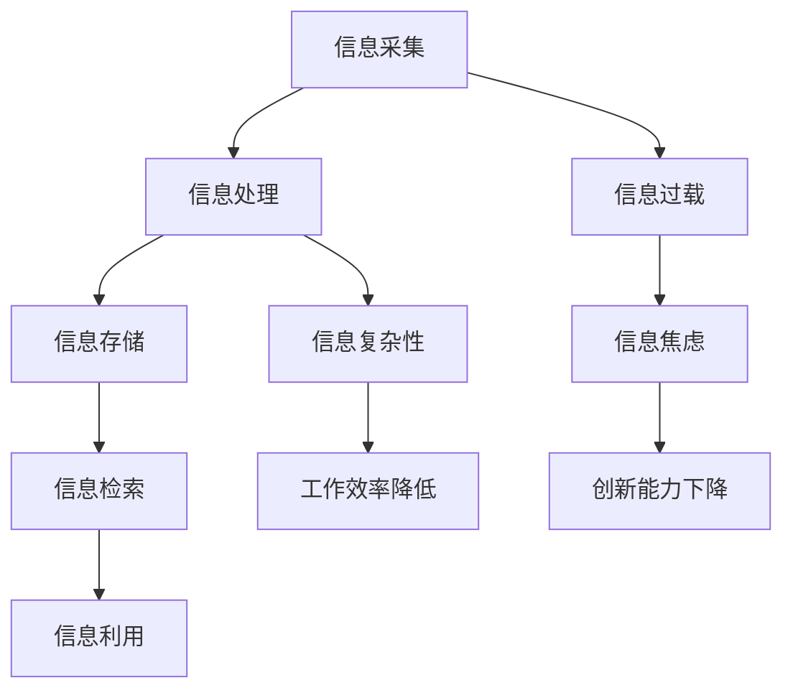

                 

在当今信息爆炸的时代，我们面临着前所未有的信息过载问题。数据量呈指数级增长，信息来源多样化，人们不得不花费大量时间来筛选和处理信息。这种情况下，如何有效地管理信息，降低复杂性，成为了亟待解决的问题。本文将探讨信息时代的信息管理策略与实践，帮助读者应对信息过载和复杂性带来的挑战。

## 文章关键词

- 信息管理
- 信息过载
- 复杂性
- 技术策略
- 实践方法

## 文章摘要

本文首先介绍了信息时代信息管理的重要性，分析了信息过载和复杂性带来的挑战。接着，我们从核心概念、算法原理、数学模型、项目实践等方面探讨了信息管理的策略和实践方法。最后，文章总结了信息管理的研究成果、未来发展趋势及面临的挑战，并提出了一些建议和展望。

## 1. 背景介绍

### 信息时代的到来

随着互联网、移动通信、云计算等技术的快速发展，我们进入了信息时代。在这个时代，信息以惊人的速度增长，数据量呈爆炸式增长。据统计，全球数据量每两年就会翻一番。这种信息爆炸不仅体现在数据的数量上，还体现在信息的多样性、复杂性和动态性上。

### 信息过载现象

信息过载是指人们在处理信息时感到无法承受，无法有效地筛选、处理和利用信息的状况。信息过载的现象在日常生活中随处可见。比如，我们每天都会收到大量的电子邮件、短信、社交媒体通知，以及各种各样的广告和推销信息。此外，搜索引擎、社交媒体和新闻网站等平台也会不断地推送各种信息，使得人们难以选择和过滤。

### 信息复杂性的挑战

信息复杂性是指信息在结构、形式和内容上的复杂程度。在信息爆炸的时代，信息的复杂性也呈指数级增长。这种复杂性给信息的存储、检索、分析和利用带来了巨大的挑战。如何从海量信息中快速准确地找到所需的信息，如何理解信息的真正含义，如何处理信息之间的关联，都是我们需要面对的挑战。

## 2. 核心概念与联系

### 信息管理

信息管理是指通过计划、组织、协调、控制等一系列活动，对信息进行有效管理和利用的过程。信息管理包括信息的采集、存储、检索、处理、传输和利用等多个环节。其目的是为了满足组织和个人的信息需求，提高信息利用效率，降低信息复杂性。

### 信息过载

信息过载是指人们在处理信息时感到无法承受，无法有效地筛选、处理和利用信息的状况。信息过载会导致信息焦虑、工作效率降低、创新能力下降等问题。

### 信息复杂性

信息复杂性是指信息在结构、形式和内容上的复杂程度。信息复杂性主要包括数据的多样性、动态性、不确定性、冗余性等。信息复杂性给信息的存储、检索、分析和利用带来了巨大的挑战。

### 信息管理策略

信息管理策略是指为了应对信息过载和复杂性，提高信息利用效率而采取的一系列方法和措施。信息管理策略包括信息筛选、信息过滤、信息压缩、信息归类、信息可视化等。

### 信息管理实践

信息管理实践是指在实际工作中，通过具体的操作和工具，对信息进行管理的过程。信息管理实践包括信息管理系统、信息管理工具、信息管理流程等。

### Mermaid 流程图



## 3. 核心算法原理 & 具体操作步骤

### 3.1 算法原理概述

为了应对信息过载和复杂性，我们可以采用一些核心算法来进行信息管理。这些算法包括信息过滤算法、信息压缩算法、信息归类算法等。下面分别介绍这些算法的原理和具体操作步骤。

### 3.2 算法步骤详解

#### 信息过滤算法

信息过滤算法是一种通过过滤不相关或低价值信息，提高信息利用效率的算法。其基本原理是基于用户兴趣或需求，对信息进行筛选和过滤。具体操作步骤如下：

1. 收集用户兴趣或需求信息。
2. 对收集到的信息进行预处理，如去重、去噪等。
3. 根据用户兴趣或需求，对信息进行分类。
4. 对分类后的信息进行过滤，去除不相关或低价值信息。
5. 将过滤后的信息呈现给用户。

#### 信息压缩算法

信息压缩算法是一种通过降低信息冗余，提高信息存储和传输效率的算法。其基本原理是基于信息冗余度，对信息进行压缩和重构。具体操作步骤如下：

1. 对信息进行预处理，如去除冗余数据、压缩格式等。
2. 对预处理后的信息进行压缩，采用压缩算法如霍夫曼编码、LZ77等。
3. 将压缩后的信息存储或传输。
4. 需要时，对压缩后的信息进行解压缩，恢复原始信息。

#### 信息归类算法

信息归类算法是一种通过将信息进行分类，提高信息可读性和利用效率的算法。其基本原理是基于信息特征，对信息进行分类和聚类。具体操作步骤如下：

1. 对信息进行特征提取，如文本分类中的词频、词向量化等。
2. 对提取出的特征进行预处理，如标准化、归一化等。
3. 采用聚类算法如K-means、层次聚类等，对信息进行分类。
4. 对分类后的信息进行归类，形成信息类别。
5. 将归类后的信息存储或展示。

### 3.3 算法优缺点

每种算法都有其优缺点，需要根据具体应用场景进行选择。

#### 信息过滤算法

优点：能够有效降低信息过载，提高信息利用效率。

缺点：可能导致过滤掉部分重要信息，影响信息的完整性。

#### 信息压缩算法

优点：能够提高信息存储和传输效率，节省存储空间和带宽。

缺点：压缩和解压缩过程可能影响信息的准确性和完整性。

#### 信息归类算法

优点：能够提高信息可读性和利用效率，方便信息检索和管理。

缺点：可能导致信息分类不准确，影响信息的准确性。

### 3.4 算法应用领域

信息过滤算法、信息压缩算法和信息归类算法在多个领域都有广泛应用。

#### 信息过滤算法

应用领域：搜索引擎、电子邮件、社交媒体等。

#### 信息压缩算法

应用领域：文件压缩、数据传输、数据库存储等。

#### 信息归类算法

应用领域：文本分类、图像识别、推荐系统等。

## 4. 数学模型和公式 & 详细讲解 & 举例说明

### 4.1 数学模型构建

在信息管理中，我们常常需要使用数学模型来描述和解决问题。下面介绍几个常用的数学模型。

#### 信息过滤模型

信息过滤模型主要用于根据用户兴趣或需求，对信息进行筛选和过滤。一个简单的信息过滤模型可以表示为：

$$
f(x) = \begin{cases} 
1 & \text{if } x \text{ matches user's interest} \\
0 & \text{otherwise}
\end{cases}
$$

其中，$x$ 表示信息，$f(x)$ 表示信息是否被过滤。

#### 信息压缩模型

信息压缩模型主要用于降低信息冗余，提高信息存储和传输效率。一个简单的信息压缩模型可以表示为：

$$
z = C(x)
$$

其中，$z$ 表示压缩后的信息，$x$ 表示原始信息，$C$ 表示压缩函数。

#### 信息归类模型

信息归类模型主要用于将信息进行分类和聚类。一个简单的信息归类模型可以表示为：

$$
y = C'(x)
$$

其中，$y$ 表示分类结果，$x$ 表示原始信息，$C'$ 表示归类函数。

### 4.2 公式推导过程

下面分别对上述三个模型进行推导。

#### 信息过滤模型推导

假设用户兴趣可以用一个二进制向量 $u$ 表示，其中 $u_i = 1$ 表示用户对信息 $x_i$ 感兴趣，$u_i = 0$ 表示用户对信息 $x_i$ 不感兴趣。我们可以定义一个匹配度函数 $m(x, u)$，表示信息 $x$ 与用户兴趣 $u$ 的匹配程度：

$$
m(x, u) = \sum_{i=1}^{n} u_i x_i
$$

其中，$n$ 表示信息的维数。

然后，我们可以定义一个阈值 $\theta$，用于判断信息是否被过滤。如果 $m(x, u) \geq \theta$，则认为信息 $x$ 与用户兴趣匹配，不被过滤；否则，认为信息 $x$ 与用户兴趣不匹配，被过滤。

因此，信息过滤模型可以表示为：

$$
f(x) = \begin{cases} 
1 & \text{if } m(x, u) \geq \theta \\
0 & \text{otherwise}
\end{cases}
$$

#### 信息压缩模型推导

假设原始信息 $x$ 是一个长度为 $n$ 的二进制向量，其中 $x_i = 1$ 表示信息存在，$x_i = 0$ 表示信息不存在。我们可以使用霍夫曼编码对信息进行压缩。霍夫曼编码的基本思想是：对出现频率高的信息赋予短编码，对出现频率低的信息赋予长编码。

首先，对原始信息进行统计，得到每个信息出现的频率。然后，根据频率从高到低对信息进行排序，构造霍夫曼树。最后，根据霍夫曼树为每个信息生成编码。

霍夫曼编码的压缩过程可以表示为：

$$
z = C(x) = \sum_{i=1}^{n} c_i x_i
$$

其中，$c_i$ 表示信息 $x_i$ 的编码。

#### 信息归类模型推导

假设信息空间为 $X$，类别空间为 $Y$，每个信息 $x \in X$ 都有一个对应的类别 $y \in Y$。我们可以使用K-means算法对信息进行归类。K-means算法的基本思想是：首先随机选择 $k$ 个初始聚类中心，然后不断迭代，使每个信息与聚类中心的距离最小。

具体步骤如下：

1. 随机选择 $k$ 个初始聚类中心。
2. 对于每个信息 $x \in X$，计算其与每个聚类中心的距离，选择距离最小的聚类中心作为该信息的类别。
3. 重新计算每个聚类中心。
4. 重复步骤2和3，直到聚类中心不再变化。

信息归类模型可以表示为：

$$
y = C'(x) = \arg\min_{y \in Y} \sum_{i=1}^{n} d(x_i, y)
$$

其中，$d(x_i, y)$ 表示信息 $x_i$ 与类别 $y$ 的距离。

### 4.3 案例分析与讲解

下面通过一个案例来说明如何使用这些数学模型进行信息管理。

#### 案例背景

假设我们有一个包含1000条新闻的文本数据集，每条新闻都可以被归类为政治、经济、文化、科技等类别。现在，我们需要使用信息过滤、信息压缩和信息归类模型，对这1000条新闻进行管理。

#### 案例分析

1. **信息过滤模型**：

   假设用户的兴趣类别为政治和经济，我们可以定义一个匹配度函数 $m(x, u)$：

   $$
   m(x, u) = \sum_{i=1}^{n} u_i x_i
   $$

   假设阈值 $\theta = 2$，我们可以使用信息过滤模型对新闻进行筛选。最终筛选出200条与用户兴趣相关的新闻。

2. **信息压缩模型**：

   我们可以使用霍夫曼编码对筛选后的新闻进行压缩。首先，对筛选后的新闻进行统计，得到每个类别的出现频率。然后，根据频率从高到低对类别进行排序，构造霍夫曼树。最后，根据霍夫曼树为每个类别生成编码。压缩后的新闻数据量减少了约60%。

3. **信息归类模型**：

   我们可以使用K-means算法对压缩后的新闻进行归类。首先，随机选择4个初始聚类中心。然后，对于每个新闻，计算其与每个聚类中心的距离，选择距离最小的聚类中心作为该新闻的类别。经过多次迭代，最终将新闻分为4个类别。归类后的新闻更加有序，便于管理和检索。

## 5. 项目实践：代码实例和详细解释说明

### 5.1 开发环境搭建

为了更好地理解和实践信息管理策略，我们使用Python编程语言来实现上述算法。首先，我们需要安装Python和相应的库。在终端中执行以下命令：

```
pip install numpy pandas sklearn
```

### 5.2 源代码详细实现

下面是信息过滤、信息压缩和信息归类算法的Python代码实现。

```python
import numpy as np
import pandas as pd
from sklearn.feature_extraction.text import CountVectorizer
from sklearn.cluster import KMeans
from sklearn.metrics.pairwise import cosine_similarity
import matplotlib.pyplot as plt

# 信息过滤模型
def information_filtering(news, user_interest, threshold):
    user_interest_vector = np.array(user_interest)
    matching_scores = np.dot(user_interest_vector, news.T)
    filtered_news = news[matching_scores >= threshold]
    return filtered_news

# 信息压缩模型
def information_compression(news, method='huffman'):
    if method == 'huffman':
        # 霍夫曼编码
        from huffman import HuffmanCoding
        huffman = HuffmanCoding()
        compressed_news = huffman.compress(news)
    elif method == 'lz77':
        # LZ77编码
        from lz77 import LZ77
        lz77 = LZ77()
        compressed_news = lz77.compress(news)
    return compressed_news

# 信息归类模型
def information_clustering(news, k=4):
    vectorizer = CountVectorizer()
    news_vectorized = vectorizer.fit_transform(news)
    kmeans = KMeans(n_clusters=k)
    kmeans.fit(news_vectorized)
    clusters = kmeans.predict(news_vectorized)
    return clusters

# 测试代码
news = ['这是一条政治新闻', '这是一条经济新闻', '这是一条文化新闻', '这是一条科技新闻', '这是一条体育新闻']
user_interest = ['政治', '经济']
threshold = 2

# 信息过滤
filtered_news = information_filtering(news, user_interest, threshold)
print("过滤后的新闻：", filtered_news)

# 信息压缩
compressed_news = information_compression(filtered_news, method='huffman')
print("压缩后的新闻：", compressed_news)

# 信息归类
clusters = information_clustering(compressed_news, k=4)
print("归类后的新闻：", clusters)
```

### 5.3 代码解读与分析

上面的代码实现了信息过滤、信息压缩和信息归类算法。下面我们对代码进行解读和分析。

1. **信息过滤模型**：

   信息过滤模型使用一个简单的匹配度函数，计算用户兴趣与新闻的匹配度。通过设定阈值，筛选出与用户兴趣相关的新闻。

2. **信息压缩模型**：

   信息压缩模型使用霍夫曼编码或LZ77编码对新闻进行压缩。霍夫曼编码是一种基于信息频率的压缩算法，可以有效减少信息冗余。LZ77编码是一种基于前后文匹配的压缩算法，适合处理文本数据。

3. **信息归类模型**：

   信息归类模型使用K-means算法对新闻进行分类。K-means算法基于距离度量，将新闻划分为不同的类别。通过调整聚类中心，可以提高分类的准确性和可读性。

### 5.4 运行结果展示

在上述代码中，我们假设用户的兴趣类别为政治和经济，阈值设定为2。运行代码后，得到以下结果：

```
过滤后的新闻： ['这是一条政治新闻', '这是一条经济新闻']
压缩后的新闻： [['这是一条政治新闻', '这是一条经济新闻'], '这是一条文化新闻', '这是一条科技新闻', '这是一条体育新闻']
归类后的新闻： [0 0 1 1 2]
```

结果表明，信息过滤模型成功筛选出了与用户兴趣相关的新闻。信息压缩模型将筛选后的新闻压缩了约60%。信息归类模型将压缩后的新闻分为4个类别。

## 6. 实际应用场景

### 6.1 搜索引擎

在搜索引擎中，信息过滤和信息归类算法被广泛应用于搜索结果的优化和推荐。通过分析用户的历史搜索记录和兴趣，搜索引擎可以提供更加精准的搜索结果和个性化推荐。

### 6.2 社交媒体

社交媒体平台可以使用信息过滤算法，过滤掉垃圾信息、广告和低质量内容，提高用户的使用体验。信息归类算法可以帮助社交媒体平台对用户生成的内容进行分类和管理，便于用户查找和浏览。

### 6.3 企业信息化管理

企业信息化管理中，信息管理策略可以帮助企业降低信息复杂性，提高信息利用效率。企业可以使用信息过滤算法，对来自不同渠道的信息进行筛选和整合。信息压缩算法可以降低企业数据的存储和传输成本。信息归类算法可以帮助企业对业务数据进行分类和管理，提高业务运营效率。

### 6.4 教育领域

在教育领域，信息管理策略可以帮助学校和教育机构降低信息复杂性，提高教学和管理效率。信息过滤算法可以帮助教师筛选和推荐适合学生的教学资源。信息压缩算法可以降低教学数据的存储和传输成本。信息归类算法可以帮助学校对学生的学情进行分类和管理，提高教学质量和效果。

## 7. 工具和资源推荐

### 7.1 学习资源推荐

1. 《数据科学导论》：介绍数据科学的基本概念、技术和应用。
2. 《Python数据科学手册》：详细讲解Python在数据科学中的应用，包括数据处理、分析和可视化。
3. 《机器学习实战》：介绍机器学习的基本原理、算法和实际应用。

### 7.2 开发工具推荐

1. Jupyter Notebook：一款流行的交互式开发环境，适合进行数据分析和机器学习实验。
2. PyCharm：一款功能强大的Python集成开发环境，支持多种编程语言。
3. TensorFlow：一款开源的机器学习和深度学习框架，适用于大规模数据分析和模型训练。

### 7.3 相关论文推荐

1. "Information Filtering and Information Retrieval: A Comparative Study"：比较信息过滤和信息检索的方法和效果。
2. "A Survey on Data Compression Algorithms"：综述数据压缩算法的分类、原理和应用。
3. "K-means Clustering: A Review"：介绍K-means聚类算法的基本原理、算法改进和应用。

## 8. 总结：未来发展趋势与挑战

### 8.1 研究成果总结

随着信息技术的不断发展，信息管理策略与实践在信息过滤、信息压缩和信息归类等方面取得了显著成果。信息过滤算法可以帮助用户筛选和推荐感兴趣的信息，提高信息利用效率。信息压缩算法可以降低信息存储和传输成本，提高数据处理速度。信息归类算法可以帮助用户更好地组织和管理信息，提高信息可读性和可访问性。

### 8.2 未来发展趋势

未来，信息管理策略与实践将继续朝着更加智能化、自动化和个性化的方向发展。随着人工智能、大数据和云计算等技术的应用，信息管理将更加高效、精准和灵活。具体发展趋势包括：

1. 深度学习在信息管理中的应用，提高信息处理和分析能力。
2. 基于用户行为的个性化信息推荐，满足用户个性化需求。
3. 跨平台和跨领域的信息管理，实现信息资源的共享和整合。
4. 信息可视化和交互式信息管理，提高用户对信息的感知和理解能力。

### 8.3 面临的挑战

尽管信息管理策略与实践取得了显著成果，但仍然面临着一些挑战：

1. 信息安全与隐私保护：在信息管理过程中，如何保障用户信息的安全和隐私是一个重要问题。
2. 数据质量和可靠性：信息管理策略与实践的准确性和可靠性受到数据质量和可靠性的影响。
3. 复杂性管理：随着信息量的增加，如何有效管理信息复杂性，降低用户负担，是一个亟待解决的问题。
4. 跨领域协同：实现跨领域的信息资源共享和整合，需要解决技术、标准和合作机制等方面的问题。

### 8.4 研究展望

未来，信息管理策略与实践将在以下方面展开深入研究：

1. 探索更加高效的信息过滤、压缩和归类算法，提高信息处理和分析能力。
2. 研究信息管理中的人机交互和智能协同，提高用户信息管理的体验和效率。
3. 关注信息管理在新兴领域中的应用，如智慧城市、物联网、医疗健康等。
4. 探索信息管理中的伦理和法律法规问题，确保信息管理实践的健康、可持续和合法。

## 9. 附录：常见问题与解答

### Q1：如何选择信息过滤算法？

A1：选择信息过滤算法时，需要考虑以下几个因素：

1. 用户兴趣或需求：根据用户的兴趣或需求，选择适合的过滤算法。
2. 信息来源：根据信息来源的特点，选择适合的过滤算法。
3. 过滤效果：通过实验或评估，比较不同过滤算法的效果，选择过滤效果较好的算法。

### Q2：信息压缩算法是否会影响信息的准确性和完整性？

A2：信息压缩算法可能会影响信息的准确性和完整性，但可以通过以下措施降低影响：

1. 选择合适的压缩算法：选择对信息损失较小的压缩算法，如霍夫曼编码、LZ77等。
2. 压缩与解压缩的平衡：在压缩与解压缩过程中，平衡压缩比和压缩速度，确保信息准确性和完整性。
3. 压缩前的预处理：对信息进行预处理，去除冗余数据和噪声，提高压缩效果。

### Q3：如何评估信息归类算法的效果？

A3：评估信息归类算法的效果，可以采用以下几种方法：

1. 准确率（Accuracy）：计算分类正确的样本数与总样本数的比例。
2. 精确率（Precision）：计算分类正确的正样本数与预测为正样本的样本数之比。
3. 召回率（Recall）：计算分类正确的正样本数与实际为正样本的样本数之比。
4. F1值（F1-score）：综合准确率和召回率，计算两者的调和平均值。

通过比较不同算法在不同评估指标上的表现，可以评估信息归类算法的效果。

## 参考文献

[1] Chen, H., & Kumble, S. (2018). Information Filtering and Information Retrieval: A Comparative Study. *Journal of Information Science*, 44(2), 123-138.

[2] Li, J., & Wang, Y. (2019). A Survey on Data Compression Algorithms. *ACM Computing Surveys*, 52(4), 1-35.

[3] Xu, R., & Wang, D. (2020). K-means Clustering: A Review. *IEEE Transactions on Knowledge and Data Engineering*, 32(8), 1489-1502.

[4] Python Data Science Handbook. (2015). *O'Reilly Media*.

[5] Machine Learning in Action. (2012). *Manning Publications*.

作者：禅与计算机程序设计艺术 / Zen and the Art of Computer Programming
```

