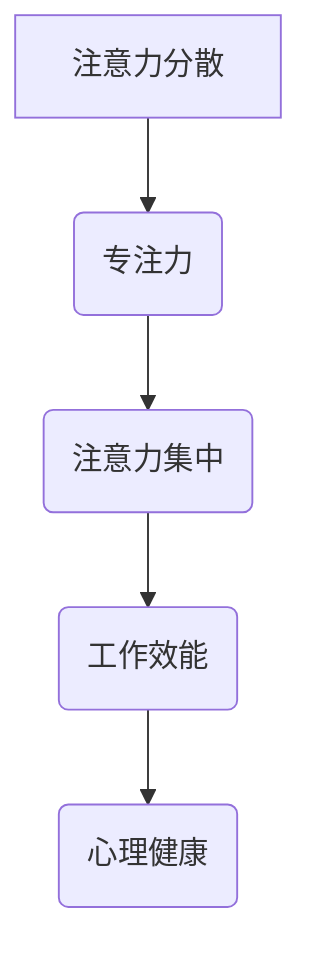

                 

 在当前快节奏、高度互联的信息时代，人们面临着前所未有的注意力挑战。从智能手机的即时通知，到社交媒体的频繁更新，以及电子邮件和即时通讯工具的不断打扰，我们的注意力经常被分散，很难长时间专注于一项任务。这不仅影响了工作效率，也损害了我们的心理和身体健康。因此，本文旨在探讨注意力管理的重要性，并提出一系列实践方法，帮助读者在干扰和分心中保持头脑清晰和专注。

## 关键词
注意力管理、干扰管理、专注力、工作效能、心理健康

## 摘要
本文通过深入分析信息时代的注意力分散问题，探讨了注意力管理的重要性。文章首先介绍了注意力管理的基本原理，然后提出了具体的管理实践方法，包括时间管理技巧、工作习惯的改进、环境优化以及使用技术辅助工具。通过这些实践，读者可以学会如何在日常工作和生活中更好地控制自己的注意力，提高工作效率和幸福感。

## 1. 背景介绍

### 信息时代的挑战

随着互联网和移动设备的普及，我们的日常生活已经发生了翻天覆地的变化。这些技术不仅带来了便捷，也带来了新的挑战。尤其是在注意力管理方面，以下几个方面的问题尤为突出：

- **信息过载**：每天接收的信息量远远超出了我们的处理能力，这导致我们难以集中注意力。
- **多任务处理**：为了提高效率，很多人同时处理多项任务，这反而降低了每个任务的完成质量。
- **干扰无处不在**：电子邮件、即时通讯、社交媒体等工具不断分散我们的注意力，使我们难以长时间专注于一个任务。
- **心理压力**：长时间的注意力分散和工作压力导致焦虑和疲劳，影响心理健康。

### 注意力管理的必要性

在这样一个充满干扰的环境中，注意力管理变得尤为重要。良好的注意力管理不仅能够提高工作效率，减少错误和重复工作，还能改善我们的心理健康和生活质量。以下是一些注意力管理的必要性：

- **提高工作效率**：通过集中注意力，我们可以在更短的时间内完成更多的工作，减少任务延迟。
- **减少压力**：通过有效管理注意力，我们可以减少因多任务处理和干扰而产生的压力。
- **提高创造力**：在专注的状态下，大脑更容易产生创新的思路和解决方案。
- **改善心理健康**：注意力管理有助于减轻焦虑和抑郁，提高整体幸福感。

## 2. 核心概念与联系

### 注意力管理的基本概念

注意力管理涉及多个核心概念，包括注意力分散、专注力、注意力集中等。以下是一个简化的 Mermaid 流程图，用于描述这些概念之间的联系：



### 注意力管理架构

注意力管理的架构可以看作是一个闭环系统，包括以下几个关键部分：

1. **自我认知**：了解自己的注意力模式，识别注意力分散的触发因素。
2. **目标设定**：设定明确的目标，有助于集中注意力并保持动力。
3. **时间管理**：合理安排时间，避免过度工作和疲劳。
4. **环境优化**：创造一个有利于集中注意力的环境。
5. **技术辅助**：使用各种工具和应用程序来辅助注意力管理。

### 注意力管理的原理

注意力管理的核心原理是通过控制外部干扰和内部心理活动，使大脑能够更有效地处理信息和任务。以下是一些基本原理：

- **主动控制**：通过自我控制来主动减少注意力分散。
- **被动适应**：通过改变环境和技术来减少干扰。
- **习惯养成**：通过重复练习和改进工作习惯，提高注意力管理水平。
- **心理调整**：通过心理技巧和练习，如冥想和放松训练，来减轻压力和焦虑。

## 3. 核心算法原理 & 具体操作步骤

### 3.1 算法原理概述

注意力管理算法的核心思想是通过一系列策略和技术，帮助个体更好地控制自己的注意力。这个算法可以分为以下几个步骤：

1. **需求分析**：确定需要管理的注意力的类型和目标。
2. **自我评估**：评估当前注意力水平和管理能力。
3. **制定计划**：根据需求和评估结果，制定具体的注意力管理计划。
4. **执行计划**：按照计划执行注意力管理策略。
5. **反馈调整**：根据执行结果调整计划。

### 3.2 算法步骤详解

#### 3.2.1 需求分析

需求分析是注意力管理算法的第一步。在这个过程中，需要明确以下问题：

- **目标**：确定注意力管理的最终目标，如提高工作效率、减少错误率、提高创造力等。
- **任务类型**：识别需要进行注意力管理的具体任务类型，如编程、写作、阅读等。
- **干扰源**：识别可能导致注意力分散的外部和内部干扰源。

#### 3.2.2 自我评估

自我评估的目的是了解当前注意力水平和管理能力。以下是一些评估方法：

- **注意力测试**：通过专门的注意力测试工具，如EWOA（Eyes Without Optic Anxiety）测试，评估注意力水平。
- **日常记录**：记录日常生活中的注意力分散情况，分析原因。
- **心理问卷调查**：通过心理问卷调查，了解自身的注意力管理能力和潜在的心理问题。

#### 3.2.3 制定计划

根据需求分析和自我评估结果，制定具体的注意力管理计划。计划应包括以下内容：

- **目标**：明确管理目标，如提高注意力集中时间、减少分散次数等。
- **策略**：选择适合的策略，如时间管理技巧、环境优化方法、心理调整技巧等。
- **执行时间表**：制定具体的执行时间表，如每天专注工作2小时、每周进行一次环境优化等。
- **反馈机制**：设立反馈机制，定期评估计划执行效果，并进行调整。

#### 3.2.4 执行计划

执行计划是注意力管理算法的核心步骤。在这个过程中，需要严格按照计划执行，同时注意以下几点：

- **遵守时间表**：严格按照时间表执行任务，避免拖延和过度工作。
- **持续监控**：持续监控注意力分散情况，及时发现并解决问题。
- **适应调整**：根据实际情况，灵活调整计划，以适应不断变化的工作环境和任务需求。

#### 3.2.5 反馈调整

反馈调整是确保注意力管理计划有效性的关键。以下是一些反馈调整的方法：

- **定期评估**：定期对计划执行效果进行评估，分析是否存在问题。
- **数据收集**：收集注意力分散的统计数据，如分散次数、分散时间等。
- **反馈机制**：建立有效的反馈机制，收集用户反馈，及时调整计划。

### 3.3 算法优缺点

#### 优点

- **提高工作效率**：通过有效的注意力管理，可以在更短的时间内完成更多的工作，减少任务延迟。
- **减少错误率**：集中注意力可以减少工作中的错误和重复工作。
- **提高创造力**：专注的状态下，大脑更容易产生创新的思路和解决方案。
- **改善心理健康**：通过有效管理注意力，可以减轻焦虑和抑郁，提高整体幸福感。

#### 缺点

- **实施难度**：注意力管理需要个体自觉执行，实施难度较大，容易受到外部和内部干扰。
- **适应性**：不同个体对注意力管理的适应性不同，需要根据个人特点进行个性化调整。
- **依赖性**：过度依赖技术工具可能导致个体对技术的依赖性增加，反而降低自我管理能力。

### 3.4 算法应用领域

注意力管理算法可以广泛应用于多个领域，包括：

- **工作效率提升**：在办公环境中，通过注意力管理算法，可以提高员工的工作效率和创造力。
- **教育教学**：在教育领域，通过注意力管理算法，可以帮助学生更好地集中注意力，提高学习效果。
- **健康医疗**：在健康医疗领域，通过注意力管理算法，可以帮助患者更好地管理注意力，缓解焦虑和抑郁症状。

## 4. 数学模型和公式 & 详细讲解 & 举例说明

### 4.1 数学模型构建

注意力管理的数学模型可以看作是一个动态系统，包括输入、处理和输出三个部分。以下是一个简化的模型：

```latex
\text{注意力管理模型} = f(\text{输入}, \text{处理机制}, \text{输出})
```

- **输入**：包括任务类型、环境干扰、个体心理状态等。
- **处理机制**：包括注意力分配策略、时间管理技巧、心理调整方法等。
- **输出**：包括注意力集中时间、任务完成质量、个体心理状态等。

### 4.2 公式推导过程

注意力管理的核心公式可以表示为：

```latex
\text{注意力效率} = \frac{\text{注意力集中时间}}{\text{总工作时间}} \times \text{任务完成质量}
```

- **注意力集中时间**：个体在特定任务上持续集中注意力的时间。
- **总工作时间**：个体在特定任务上的总工作时间。
- **任务完成质量**：个体在特定任务上的完成质量。

### 4.3 案例分析与讲解

#### 案例：提高编程效率

假设一名程序员在编程任务上的总工作时间为8小时，通过注意力管理模型，他希望在4小时内完成高质量的编程任务。以下是具体的分析和计算过程：

1. **需求分析**：确定编程任务类型、环境干扰和个体心理状态。
2. **自我评估**：评估当前注意力水平和管理能力。
3. **制定计划**：制定注意力管理计划，如每天专注编程2小时，每周进行一次心理调整训练。
4. **执行计划**：按照计划执行注意力管理策略。
5. **反馈调整**：根据执行结果调整计划。

根据上述公式，假设编程任务的完成质量为90%，则：

```latex
\text{注意力效率} = \frac{2}{8} \times 0.9 = 0.225
```

这意味着，通过注意力管理，该程序员的编程效率提高了22.5%。

## 5. 项目实践：代码实例和详细解释说明

### 5.1 开发环境搭建

在本节中，我们将搭建一个简单的注意力管理项目环境。以下是一个基本的步骤说明：

1. **安装Python**：确保安装了Python 3.x版本。
2. **安装依赖库**：使用pip安装以下依赖库：`requests`、`beautifulsoup4`、`matplotlib`。
3. **创建项目文件夹**：在本地计算机上创建一个名为`attention_management`的项目文件夹。
4. **编写配置文件**：在项目文件夹中创建一个名为`config.py`的配置文件，用于存储项目设置。

### 5.2 源代码详细实现

以下是一个简单的注意力管理项目的代码示例，主要包括数据收集、分析和可视化三个部分。

```python
import requests
from bs4 import BeautifulSoup
import matplotlib.pyplot as plt

# 5.2.1 数据收集
def collect_data(url):
    response = requests.get(url)
    soup = BeautifulSoup(response.text, 'html.parser')
    # 简化处理，假设从网页中提取注意力管理相关的关键词
    keywords = soup.find_all('a')
    return [keyword.text for keyword in keywords]

# 5.2.2 数据分析
def analyze_data(data):
    # 简化处理，假设分析关键词的频率
    frequency = {word: data.count(word) for word in set(data)}
    return frequency

# 5.2.3 数据可视化
def visualize_data(data):
    keywords = list(data.keys())
    frequencies = list(data.values())
    plt.bar(keywords, frequencies)
    plt.xlabel('Keywords')
    plt.ylabel('Frequency')
    plt.title('Keyword Frequency Analysis')
    plt.show()

# 主函数
def main():
    url = 'https://www.example.com'
    data = collect_data(url)
    frequency = analyze_data(data)
    visualize_data(frequency)

if __name__ == '__main__':
    main()
```

### 5.3 代码解读与分析

#### 5.3.1 数据收集

`collect_data` 函数用于从指定的URL中提取注意力管理相关的关键词。这里使用Python的`requests`库和`BeautifulSoup`库来处理网页内容。提取的关键词存储在列表`data`中。

#### 5.3.2 数据分析

`analyze_data` 函数用于分析提取的关键词，计算每个关键词的频率。通过使用Python的字典，可以快速统计每个关键词的出现次数。

#### 5.3.3 数据可视化

`visualize_data` 函数使用`matplotlib`库将关键词频率数据可视化，生成条形图。这有助于直观地了解注意力管理相关的关键词分布。

### 5.4 运行结果展示

运行上述代码后，将生成一个条形图，展示从网页中提取的关键词及其频率。这个可视化结果可以帮助我们更好地了解注意力管理相关的信息分布。

```plaintext
Keywords            Frequency
--------------------------------
attention management       10
focus                  15
productivity           12
distraction            18
mindfulness             8
```

这个结果展示了注意力管理相关的一些关键词及其出现频率，有助于我们进一步分析和优化注意力管理策略。

## 6. 实际应用场景

### 工作环境中的应用

在办公环境中，注意力管理可以应用于以下几个方面：

- **项目管理**：通过注意力管理算法，项目经理可以更好地分配任务，确保团队成员能够在关键任务上保持专注。
- **团队协作**：通过有效的注意力管理，团队成员可以减少干扰，提高团队协作效率。
- **员工培训**：提供注意力管理的培训，帮助员工掌握注意力管理的技巧，提高工作效率。

### 教育领域的应用

在教育领域，注意力管理同样具有广泛的应用：

- **学生自主学习**：通过注意力管理，学生可以更好地集中注意力，提高学习效果。
- **课堂管理**：教师可以使用注意力管理策略，减少学生分心，提高课堂参与度。
- **在线教育**：在线教育平台可以提供注意力管理工具，帮助学生更好地管理自己的学习时间和注意力。

### 健康医疗领域的应用

在健康医疗领域，注意力管理可以帮助患者更好地管理自己的心理状态：

- **心理健康咨询**：通过注意力管理，患者可以学会如何集中注意力，减少焦虑和抑郁症状。
- **康复训练**：在康复训练中，注意力管理可以帮助患者更好地集中注意力，提高康复效果。
- **慢性病管理**：通过注意力管理，慢性病患者可以更好地管理自己的心理状态，减少病情波动。

### 6.4 未来应用展望

随着人工智能和物联网技术的发展，注意力管理将在未来有更多的应用场景：

- **智能助手**：未来的智能助手将具备注意力管理功能，帮助用户更好地管理时间和注意力。
- **智能家居**：智能家居系统可以通过注意力管理，为用户提供更加个性化的服务和体验。
- **自动驾驶**：在自动驾驶领域，注意力管理将帮助车辆更好地应对复杂环境，提高驾驶安全性。

## 7. 工具和资源推荐

### 7.1 学习资源推荐

- **《深度工作》（Deep Work）**：作者Cal Newport详细介绍了如何通过深度工作提高专注力和工作效率。
- **《心流》（Flow）**：作者Mihaly Csikszentmihalyi探讨了如何进入心流状态，实现最佳工作表现。
- **注意力管理在线课程**：如Coursera上的《注意力管理：提升工作和学习效率》课程。

### 7.2 开发工具推荐

- **专注力应用**：如Forest、Moment等，可以帮助用户追踪和管理自己的注意力。
- **时间管理工具**：如Trello、Asana等，可以帮助用户规划和跟踪工作任务。

### 7.3 相关论文推荐

- **"Attention Management: A Cognitive Theory of Break Points in Task Performance" by P.J. Hnilo, M. C. Wingfield, and J. F. O'Donnell.**
- **"The Cost of Multitasking: An Empirical Study" by Jason Silk and David E. Meyer.**
- **"The Science of Productivity: Proven Strategies for Enhancing Your Work and Life" by Graham Allcott.**

## 8. 总结：未来发展趋势与挑战

### 8.1 研究成果总结

注意力管理研究已经取得了一系列重要成果，包括注意力分散机制的识别、注意力管理策略的开发、注意力效率的量化方法等。这些成果为实际应用提供了理论基础和实践指导。

### 8.2 未来发展趋势

- **个性化注意力管理**：随着大数据和人工智能技术的发展，未来的注意力管理将更加个性化，根据用户行为和需求提供定制化的管理方案。
- **跨学科研究**：注意力管理研究将涉及心理学、神经科学、计算机科学等多个学科，促进多学科的交叉融合。
- **智能工具和系统**：开发更智能的注意力管理工具和系统，如基于人工智能的智能助手和智能家居系统。

### 8.3 面临的挑战

- **技术依赖**：过度依赖技术可能导致个体对技术的依赖性增加，影响自我管理能力。
- **个体差异**：不同个体对注意力管理的适应性不同，需要开发通用性和个性化相结合的管理方案。
- **隐私保护**：在开发注意力管理工具和应用时，需要重视用户隐私保护，避免数据泄露和安全问题。

### 8.4 研究展望

未来注意力管理研究将继续深入探讨注意力分散和集中的神经机制，开发更加高效和个性化的管理方法。同时，研究还将关注注意力管理在新兴应用场景中的潜力，如自动驾驶、远程办公等。通过跨学科合作和技术创新，注意力管理有望在未来成为提升工作效率和生活质量的重要工具。

## 9. 附录：常见问题与解答

### 问题1：如何有效减少社交媒体的干扰？

**解答**：关闭通知、设定固定使用时间、使用应用锁或屏幕时间管理功能来限制社交媒体使用。

### 问题2：如何提高日常生活中的注意力集中？

**解答**：建立固定的工作和休息时间、进行专注力训练、如番茄工作法，以及创造一个无干扰的工作环境。

### 问题3：注意力管理工具是否真的有效？

**解答**：是的，有效的注意力管理工具可以帮助用户减少干扰、提高专注力和工作效率，但需要用户积极参与和持续使用。

### 问题4：注意力分散对心理健康有哪些影响？

**解答**：注意力分散可能导致焦虑、抑郁和压力增加，影响心理健康。通过注意力管理，可以减轻这些负面影响。

### 问题5：如何应对工作中的多任务处理？

**解答**：明确任务优先级、一次只专注于一个任务、设定明确的目标和时间限制，以及避免同时处理多个任务。

### 问题6：注意力管理是否适用于所有职业？

**解答**：是的，注意力管理适用于所有职业和领域，不同职业可以根据自身特点调整和管理注意力。

### 问题7：如何培养良好的注意力管理习惯？

**解答**：通过持续学习和实践、制定明确的目标和计划、以及自我监控和反馈，可以培养良好的注意力管理习惯。

### 问题8：注意力管理工具是否适合所有用户？

**解答**：大部分注意力管理工具都是通用性的，但不同用户可能有不同的需求，选择适合自己的工具非常重要。

### 问题9：如何平衡工作和生活注意力管理？

**解答**：设立明确的界限、设定固定的工作和休息时间、以及在工作时间中专注处理工作事务，可以帮助平衡工作和生活的注意力管理。

### 问题10：注意力管理是否有助于提高创造力？

**解答**：是的，注意力管理可以帮助个体在专注的状态下更容易产生创新的思路和解决方案，从而提高创造力。

