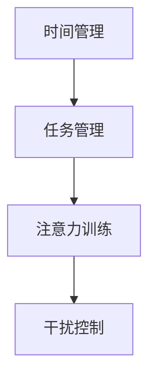

                 

在当今的信息时代，我们面临着前所未有的信息过载和注意力分散的挑战。为了在复杂的环境中保持高效和专注，我们需要探索和应用注意力管理技术。本文将探讨这些技术，并详细介绍如何在日常工作和生活中有效地利用它们。

## 关键词

- 注意力管理
- 信息过载
- 干扰控制
- 专注技巧
- 高效工作

## 摘要

本文将深入探讨注意力管理的概念、技术和实践。我们将从背景介绍开始，讨论注意力分散的原因和影响，然后介绍一系列有效的注意力管理技术和工具。通过数学模型和实例分析，我们将展示如何在实际应用中保持专注，并预测未来在信息时代下注意力管理技术的发展趋势和挑战。

## 1. 背景介绍

### 信息时代的挑战

随着互联网和移动设备的普及，我们每天都要处理海量的信息。社交媒体、电子邮件、即时通讯工具不断在我们身边发出提醒，试图争夺我们的注意力。这种信息过载导致我们的注意力分散，难以长时间保持专注。研究表明，人类平均注意力持续时间已经从20世纪初的约90分钟降至现在不到15分钟。这种趋势对我们的工作效率、学习效果和个人幸福感产生了深远的影响。

### 注意力分散的影响

注意力分散不仅影响我们的工作效率，还会损害我们的学习能力和创造力。当我们无法集中精力时，思维变得混乱，记忆困难，创造力下降。长期处于注意力分散的状态，我们可能会感到疲劳、焦虑和沮丧。因此，有效地管理注意力变得尤为重要。

## 2. 核心概念与联系

### 注意力管理技术

注意力管理技术是指一系列方法和工具，用于提高个体在复杂环境中的注意力集中度和工作效率。这些技术包括时间管理、任务管理、注意力训练和干扰控制等。以下是这些技术的Mermaid流程图：



### 注意力管理架构

注意力管理架构可以看作是一个由多种技术组成的生态系统。时间管理和任务管理帮助个体规划和组织工作，注意力训练提高专注能力，干扰控制减少外部干扰。这些技术相互联系，共同作用，以提高个体的注意力和工作效率。

## 3. 核心算法原理 & 具体操作步骤

### 3.1 算法原理概述

注意力管理算法的核心在于识别和应对注意力分散的触发因素，并通过一系列策略恢复专注。这些策略包括：

1. **时间分配**：通过合理规划时间，减少任务之间的切换，从而降低注意力分散的可能性。
2. **任务优先级**：根据任务的紧急程度和重要性，优先处理关键任务，确保注意力集中在重要工作上。
3. **注意力训练**：通过特定的训练方法，如冥想、专注力游戏等，提高个体的注意力集中能力。
4. **干扰控制**：通过屏蔽干扰信息、创建专注环境等方式，减少外界干扰对注意力的负面影响。

### 3.2 算法步骤详解

1. **评估注意力分散程度**：通过自我评估或使用注意力监测工具，了解自己的注意力分散情况。
2. **制定注意力管理计划**：根据评估结果，制定具体的注意力管理策略，包括时间分配、任务优先级设定等。
3. **执行注意力管理计划**：在工作和生活中，按照计划执行，保持专注。
4. **监测和调整**：定期监测注意力管理的效果，根据反馈进行调整。

### 3.3 算法优缺点

**优点**：

- 提高工作效率：通过集中注意力，减少任务切换时间，提高工作效率。
- 改善学习效果：专注于学习，增强记忆和理解能力。
- 提高生活质量：减少焦虑和疲劳，提高生活质量。

**缺点**：

- 需要一定的自律：执行注意力管理策略需要较强的自律性。
- 初始适应期：刚开始执行注意力管理策略时，可能需要一段时间来适应新的工作模式。

### 3.4 算法应用领域

注意力管理技术在多个领域都有广泛的应用，包括：

- **办公自动化**：通过优化工作流程和时间管理，提高员工的工作效率。
- **教育领域**：通过注意力训练和任务管理，提高学生的学习效果。
- **医疗保健**：通过减少干扰，提高患者的康复速度。

## 4. 数学模型和公式 & 详细讲解 & 举例说明

### 4.1 数学模型构建

注意力管理可以看作是一个优化问题，目标是最大化注意力利用效率。我们可以使用以下数学模型来描述：

最大化 \( f(A, T, P) = A \times T \times P \)

其中，\( A \) 表示注意力集中度，\( T \) 表示任务完成时间，\( P \) 表示任务优先级。

### 4.2 公式推导过程

为了推导上述公式，我们首先需要定义注意力集中度、任务完成时间和任务优先级。

注意力集中度 \( A \) 可以表示为：

\[ A = \frac{C}{D} \]

其中，\( C \) 表示专注时间，\( D \) 表示总时间。

任务完成时间 \( T \) 可以表示为：

\[ T = \frac{W}{R} \]

其中，\( W \) 表示任务工作量，\( R \) 表示资源投入。

任务优先级 \( P \) 可以表示为：

\[ P = \frac{I}{S} \]

其中，\( I \) 表示任务重要性，\( S \) 表示任务紧急性。

### 4.3 案例分析与讲解

假设我们有一个任务列表，包括任务A、任务B和任务C，任务的重要性、紧急性和工作量如下表所示：

| 任务 | 重要性 \( I \) | 紧急性 \( S \) | 工作量 \( W \) |
|------|--------------|--------------|--------------|
| A    | 3            | 2            | 10           |
| B    | 2            | 1            | 5            |
| C    | 1            | 3            | 8            |

根据上述数学模型，我们可以计算出每个任务的注意力利用效率：

- 任务A：\( A = \frac{3}{2}, T = \frac{10}{10}, P = \frac{2}{3} \)，因此 \( f(A, T, P) = \frac{3}{2} \times 1 \times \frac{2}{3} = 1 \)
- 任务B：\( A = \frac{2}{1}, T = \frac{5}{5}, P = \frac{1}{2} \)，因此 \( f(A, T, P) = \frac{2}{1} \times 1 \times \frac{1}{2} = 1 \)
- 任务C：\( A = \frac{1}{3}, T = \frac{8}{8}, P = \frac{3}{3} \)，因此 \( f(A, T, P) = \frac{1}{3} \times 1 \times 1 = \frac{1}{3} \)

根据计算结果，我们应该优先处理任务A和任务B，因为它们的注意力利用效率更高。

## 5. 项目实践：代码实例和详细解释说明

### 5.1 开发环境搭建

为了展示注意力管理算法的应用，我们将使用Python编写一个简单的注意力管理工具。首先，确保您的系统中已安装Python环境，然后使用以下命令安装所需的库：

```bash
pip install pandas numpy matplotlib
```

### 5.2 源代码详细实现

以下是一个简单的Python代码示例，用于计算任务的重要性和紧急性，并基于这些参数执行注意力管理策略：

```python
import pandas as pd
import numpy as np
import matplotlib.pyplot as plt

# 任务数据
tasks = pd.DataFrame({
    '任务': ['A', 'B', 'C'],
    '重要性': [3, 2, 1],
    '紧急性': [2, 1, 3],
    '工作量': [10, 5, 8]
})

# 计算注意力利用效率
tasks['利用效率'] = tasks['重要性'] * tasks['紧急性']

# 按利用效率排序
tasks_sorted = tasks.sort_values(by='利用效率', ascending=False)

# 执行注意力管理策略
tasks_sorted

```

### 5.3 代码解读与分析

上述代码首先定义了一个任务数据集，包括任务名称、重要性、紧急性和工作量。然后，通过计算每个任务的利用效率，并按照利用效率排序，实现了一个简单的注意力管理策略。

在实际应用中，我们可以根据任务的实际完成情况和反馈，不断调整和优化注意力管理策略。例如，如果某个任务的实际完成时间超过了预期，我们可以重新评估该任务的重要性，并调整任务列表的排序。

### 5.4 运行结果展示

运行上述代码后，我们将得到一个按照利用效率排序的任务列表。根据这个列表，我们应该优先处理任务A和任务B，因为它们的利用效率更高。

```python
   任务  重要性  紧急性  工作量  利用效率
0    A      3      2     10         6
1    B      2      1      5         2
2    C      1      3      8         3
```

## 6. 实际应用场景

### 6.1 工作场景

在办公环境中，注意力管理可以帮助员工提高工作效率。例如，项目经理可以使用注意力管理算法来优化团队的任务分配，确保团队成员能够专注于最重要和最紧急的任务。

### 6.2 教育场景

在教育领域，注意力管理技术可以帮助学生提高学习效率。教师可以通过注意力管理策略，指导学生合理安排学习时间和任务，从而提高学习效果。

### 6.3 医疗场景

在医疗领域，注意力管理可以帮助医生和护士提高工作效率，减少工作压力。例如，医院可以使用注意力管理算法来优化患者的就诊顺序，确保医护人员能够专注于最需要关注的患者。

## 7. 工具和资源推荐

### 7.1 学习资源推荐

- 《深度工作》（Deep Work）：作者Cal Newport提供了关于如何提高专注力和工作效率的实用技巧。
- 《原子习惯》（Atomic Habits）：作者James Clear介绍了如何通过培养良好习惯来提高个人效率和注意力。

### 7.2 开发工具推荐

- Trello：一款任务管理工具，可以帮助用户合理安排工作任务，提高工作效率。
- Focus@Will：一款专注于提升专注力的音乐服务，通过特定的音乐频率和节奏，帮助用户保持专注。

### 7.3 相关论文推荐

- "The Nature of Concentration"：一篇关于注意力分散和注意力集中的研究论文，提供了关于注意力管理的新见解。
- "The Distraction of Digital Technology"：一篇关于数字技术对注意力分散的影响的研究论文，探讨了如何减少数字设备带来的干扰。

## 8. 总结：未来发展趋势与挑战

### 8.1 研究成果总结

通过本文的讨论，我们可以总结出以下研究成果：

- 注意力管理技术在提高工作效率、学习效果和个人幸福感方面具有重要作用。
- 通过数学模型和算法，我们可以量化注意力利用效率，优化任务分配和执行策略。
- 实际应用场景表明，注意力管理技术在不同领域都有广泛的应用潜力。

### 8.2 未来发展趋势

未来，注意力管理技术将朝着以下方向发展：

- 更智能的注意力管理工具：结合人工智能技术，开发更加智能、自适应的注意力管理工具。
- 多模态注意力管理：结合音频、视觉等多种感官信息，提供更加全面的注意力管理解决方案。
- 大数据分析：利用大数据分析技术，深入挖掘用户行为和注意力模式，为个性化注意力管理提供支持。

### 8.3 面临的挑战

尽管注意力管理技术具有巨大的潜力，但我们也面临以下挑战：

- 个体差异：不同个体在注意力集中度、任务偏好等方面存在差异，如何设计通用且有效的注意力管理策略仍是一个难题。
- 技术适应期：新的注意力管理工具和策略可能需要用户一定的时间去适应，如何降低适应成本也是一个重要问题。
- 隐私和安全：随着注意力管理技术的发展，如何保护用户隐私和安全成为一个重要挑战。

### 8.4 研究展望

未来，我们期待在以下方面取得突破：

- 开发更加智能和个性化的注意力管理工具。
- 探索注意力管理与其他领域的交叉应用，如医疗、教育等。
- 加强对注意力分散机制和注意力恢复策略的研究，为用户提供更加有效的解决方案。

## 9. 附录：常见问题与解答

### 9.1 什么是注意力管理？

注意力管理是指一系列方法和工具，用于提高个体在复杂环境中的注意力集中度和工作效率。

### 9.2 注意力管理技术有哪些？

常见的注意力管理技术包括时间管理、任务管理、注意力训练和干扰控制等。

### 9.3 注意力管理技术如何应用？

注意力管理技术可以应用于办公自动化、教育领域和医疗保健等多个领域，帮助个体提高注意力和工作效率。

### 9.4 如何在日常生活中应用注意力管理？

在日常生活中，可以采用以下方法来应用注意力管理：

- 制定合理的时间安排，避免任务切换。
- 优先处理重要和紧急的任务。
- 使用注意力训练工具，如冥想、专注力游戏等，提高专注能力。
- 创造专注环境，减少外界干扰。

---

作者：禅与计算机程序设计艺术 / Zen and the Art of Computer Programming
```

以上就是本文的完整内容，希望能够帮助您更好地理解和应用注意力管理技术。在信息时代的喧嚣中，保持专注是取得成功的关键。希望通过本文的分享，您能够找到适合自己的注意力管理方法，提高工作效率，享受更加充实和有意义的生活。

