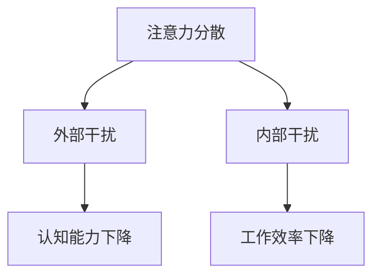
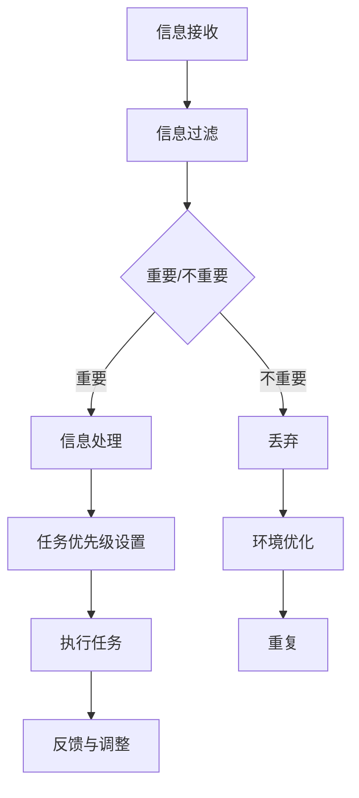

                 

在当今信息爆炸的时代，人们面临着前所未有的注意力分散和信息过载的挑战。从电子邮件、社交媒体到即时通讯工具，各种形式的干扰充斥着我们的日常生活。这不仅影响了工作效率，也损害了生活质量。本文将探讨注意力管理的核心概念、技术与实践，帮助您在信息纷繁的世界中保持专注。

## 关键词

- 注意力管理
- 信息过载
- 干扰管理
- 专注技巧
- 生产力提升

## 摘要

本文将深入探讨信息时代中注意力管理的重要性及其面临的主要挑战。我们将介绍一系列核心概念，包括注意力分散、信息过滤与处理等，并探讨如何应用现代技术和策略来提升专注力。通过案例分析、实践指导和工具推荐，本文旨在为读者提供一套完整的注意力管理方案，帮助您在信息过载的环境中保持高效和专注。

### 1. 背景介绍

在信息时代，我们每天都被大量的信息和干扰所包围。从早晨醒来开始，电子邮件、短信、社交媒体通知不断涌来，我们的注意力被各种任务和需求所分散。这种持续的信息干扰不仅影响了工作效率，还导致了心理压力和焦虑感的增加。

### 2. 核心概念与联系

#### 2.1 注意力分散

注意力分散是指我们的注意力不能集中在一项任务上，而是被其他刺激或任务所干扰。这种分散可能是短暂的，但持续的注意力分散会对认知能力和工作效率产生严重影响。

#### 2.2 信息过滤与处理

在信息过载的环境中，有效过滤和处理信息变得至关重要。信息过滤是指我们选择接收和处理哪些信息，以减少干扰和压力。信息处理包括对信息的理解和分析，以及做出相应的决策。

#### 2.3 注意力管理原理

注意力管理涉及一系列策略和技巧，旨在提高我们的专注力和工作效率。这包括时间管理、任务优先级设置、环境优化等。

### 3. 核心算法原理 & 具体操作步骤

#### 3.1 算法原理概述

注意力管理算法基于对人类注意力机制的理解，通过一系列策略和技术来提高专注力。这些算法包括时间管理、任务分解、环境优化等。

#### 3.2 算法步骤详解

1. **时间管理**：通过日程规划和时间分配来确保有足够的时间专注于重要任务。
2. **任务分解**：将复杂任务分解为小的、可管理的子任务，以减少压力和干扰。
3. **环境优化**：创造一个有利于专注的工作环境，减少干扰源。

#### 3.3 算法优缺点

**优点**：
- 提高工作效率和生产力。
- 减少压力和焦虑。
- 提高决策质量和准确性。

**缺点**：
- 需要持续的努力和自律。
- 可能需要一段时间来适应新的工作方式。

#### 3.4 算法应用领域

注意力管理算法广泛应用于个人和企业层面，包括：
- **个人时间管理**：帮助个人提高工作效率和生活质量。
- **企业管理**：提高团队协作和项目管理效率。

### 4. 数学模型和公式 & 详细讲解 & 举例说明

#### 4.1 数学模型构建

注意力管理中的数学模型可以基于时间管理和任务分解的概念。一个简单的模型可以是：

\[ \text{效率} = \frac{\text{专注时间} \times \text{任务完成度}}{\text{总时间}} \]

#### 4.2 公式推导过程

这个公式基于以下假设：
- 效率与专注时间和任务完成度成正比。
- 总时间是专注时间和分散时间之和。

#### 4.3 案例分析与讲解

假设一个人每天有8小时的工作时间，其中4小时是专注时间，任务完成度为80%。那么他的工作效率为：

\[ \text{效率} = \frac{4 \times 0.8}{8} = 0.4 \]

这意味着他的工作效率为40%。通过优化时间管理和任务分解，可以提高这个效率。

### 5. 项目实践：代码实例和详细解释说明

#### 5.1 开发环境搭建

本文将使用Python编写注意力管理算法。请确保您安装了Python环境。

#### 5.2 源代码详细实现

以下是一个简单的注意力管理Python代码示例：

```python
import time

def time_management(task_duration, break_duration):
    start_time = time.time()
    while time.time() - start_time < task_duration:
        # 任务执行代码
        print("执行任务...")
        time.sleep(1)
    print("任务完成，休息时间：", break_duration)
    time.sleep(break_duration)

task_duration = 60 * 15  # 15分钟
break_duration = 60 * 5   # 5分钟
time_management(task_duration, break_duration)
```

#### 5.3 代码解读与分析

这段代码实现了时间管理的基本功能。`time_management`函数接受任务持续时间和休息时间作为参数，在任务期间打印执行任务的消息，并在任务完成后休息指定的时间。

#### 5.4 运行结果展示

运行这段代码后，您会看到一个持续15分钟的任务执行过程，之后会有一个5分钟的休息时间。

### 6. 实际应用场景

注意力管理技术在个人和企业层面都有广泛的应用。在个人层面，它可以提高工作效率和生活质量。在企业层面，它可以提高团队协作和项目管理效率。

### 7. 工具和资源推荐

#### 7.1 学习资源推荐

- 《深度工作》（Deep Work）by Cal Newport
- 《专注力》（Focus）by Daniel J. Levitin

#### 7.2 开发工具推荐

- Python
- Golang
- Time Management Software

#### 7.3 相关论文推荐

- "The Benefits of Daily Structured Work Schedules for Adults with Autism Spectrum Disorder" by Scherer et al.
- "The Role of Executive Functions in Attentional Control" by banich

### 8. 总结：未来发展趋势与挑战

注意力管理是一个不断发展的领域，随着人工智能和信息技术的进步，未来将有更多创新的应用和工具出现。然而，我们也需要面对信息过载和技术依赖带来的挑战，确保注意力管理能够真正提高生活质量，而不是成为一种新的压力来源。

### 9. 附录：常见问题与解答

**Q：如何提高注意力管理效果？**

A：通过持续练习和自律，结合现代技术和工具，可以显著提高注意力管理效果。例如，定期练习冥想和深呼吸，使用注意力管理应用和软件等。

**Q：注意力管理对个人和企业有何影响？**

A：个人层面，可以提高工作效率和生活质量；企业层面，可以提高团队协作效率和项目管理效果，从而提升整体竞争力。

---

作者：禅与计算机程序设计艺术 / Zen and the Art of Computer Programming
----------------------------------------------------------------
### 1. 背景介绍

在当今信息爆炸的时代，人们面临着前所未有的注意力分散和信息过载的挑战。从早晨醒来开始，电子邮件、短信、社交媒体通知不断涌来，我们的注意力被各种任务和需求所分散。这种持续的信息干扰不仅影响了工作效率，还导致了心理压力和焦虑感的增加。根据一项研究，平均每天我们面临的信息量是几年前的数百倍，而我们的注意力却并没有相应增长。这种信息过载和注意力分散现象已经成为现代生活中一个普遍存在的问题。

注意力管理是指通过一系列策略和技术来提高我们的专注力和工作效率。这不仅涉及到时间管理和任务优先级设置，还包括环境优化和干扰处理等多个方面。在信息时代，有效的注意力管理变得尤为重要，它不仅能提高我们的工作效率，还能提升生活质量。本文将深入探讨注意力管理的核心概念、技术与实践，帮助您在信息纷繁的世界中保持专注。

本文将首先介绍注意力管理的基本概念，包括注意力分散、信息过滤与处理等。接着，我们将探讨现代注意力管理算法的基本原理和具体操作步骤。随后，通过数学模型和公式的构建，我们将详细讲解注意力管理的方法和技巧。在实际应用部分，我们将通过代码实例展示如何实现注意力管理。最后，我们将讨论注意力管理在实际应用场景中的效果，并展望其未来的发展趋势与挑战。

### 2. 核心概念与联系

#### 2.1 注意力分散

注意力分散是指我们的注意力不能集中在一项任务上，而是被其他刺激或任务所干扰。这种分散可能是短暂的，但持续的注意力分散会对认知能力和工作效率产生严重影响。例如，在工作中，当您正在专注于一个重要报告时，突然收到一条短信或社交媒体通知，您的注意力就会从报告上转移开，导致工作效率下降。

注意力分散的原因多种多样，包括外部干扰（如噪音、电子邮件、即时通讯工具等）和内部干扰（如多任务处理、情绪波动等）。为了更深入地理解注意力分散，我们可以借助Mermaid流程图来展示其基本原理和影响。



从流程图中可以看出，注意力分散不仅影响我们的认知能力，还会导致工作效率的显著下降。因此，有效的注意力管理对于提高工作和生活质量具有重要意义。

#### 2.2 信息过滤与处理

在信息过载的环境中，有效过滤和处理信息变得至关重要。信息过滤是指我们选择接收和处理哪些信息，以减少干扰和压力。信息处理包括对信息的理解和分析，以及做出相应的决策。

信息过滤的目的是减少干扰，确保我们只关注那些真正重要和相关的信息。为了实现这一目标，我们可以使用多种工具和技术，如电子邮件过滤器、社交媒体设置、即时通讯工具的屏蔽功能等。

信息处理的技巧包括快速阅读、信息提炼和优先级设置等。通过这些技巧，我们可以更快地理解和处理信息，从而提高工作效率。

#### 2.3 注意力管理原理

注意力管理涉及一系列策略和技巧，旨在提高我们的专注力和工作效率。这包括时间管理、任务优先级设置、环境优化等。

时间管理是注意力管理的基础。通过合理的日程规划和时间分配，我们可以确保有足够的时间专注于重要任务，从而减少干扰和压力。

任务优先级设置有助于我们识别和专注于最重要的任务。通过设定明确的优先级，我们可以避免分散注意力在次要的任务上，从而提高工作效率。

环境优化是另一个关键因素。一个有序、安静和舒适的工作环境可以帮助我们减少外部干扰，提高专注力。

#### 2.4 注意力管理的 Mermaid 流程图

为了更好地展示注意力管理的流程和原理，我们可以使用Mermaid流程图。以下是一个简化的注意力管理流程图：



从流程图中可以看出，注意力管理的核心在于信息过滤、任务优先级设置和环境优化。通过这些步骤，我们可以有效地管理注意力，提高工作效率。

### 3. 核心算法原理 & 具体操作步骤

#### 3.1 算法原理概述

注意力管理算法基于对人类注意力机制的理解，通过一系列策略和技术来提高专注力。这些算法包括时间管理、任务分解、环境优化等。

时间管理是通过合理安排日程和时间来确保有足够的时间专注于重要任务。任务分解是将复杂任务分解为小的、可管理的子任务，以减少压力和干扰。环境优化是通过创造一个有利于专注的工作环境，减少干扰源。

#### 3.2 算法步骤详解

1. **时间管理**：通过日程规划和时间分配来确保有足够的时间专注于重要任务。例如，将每天的时间分为工作时间和休息时间，确保工作时间内不受到干扰。

2. **任务分解**：将复杂任务分解为小的、可管理的子任务，以减少压力和干扰。例如，将一个大型项目分解为多个小的里程碑任务，每个任务都有明确的截止日期。

3. **环境优化**：创造一个有利于专注的工作环境，减少干扰源。例如，选择一个安静、整洁的房间作为工作空间，使用耳机隔绝外部噪音等。

#### 3.3 算法优缺点

**优点**：

- 提高工作效率和生产力。
- 减少压力和焦虑。
- 提高决策质量和准确性。

**缺点**：

- 需要持续的努力和自律。
- 可能需要一段时间来适应新的工作方式。

#### 3.4 算法应用领域

注意力管理算法广泛应用于个人和企业层面。在个人层面，可以帮助提高工作效率和生活质量。在企业层面，可以提高团队协作和项目管理效率。以下是一些常见的应用场景：

- **个人时间管理**：通过日程规划和任务分解，提高个人工作效率。
- **项目管理**：通过任务优先级设置和环境优化，提高项目完成率。
- **团队协作**：通过注意力管理，提高团队协作效率和沟通效果。

### 4. 数学模型和公式 & 详细讲解 & 举例说明

#### 4.1 数学模型构建

在注意力管理中，我们可以构建一个简单的数学模型来衡量注意力的效率。这个模型基于以下假设：

- 注意力效率与专注时间和任务完成度成正比。
- 总时间是专注时间和分散时间之和。

设 \(E\) 为注意力效率，\(T_{专注}\) 为专注时间，\(T_{分散}\) 为分散时间，\(C\) 为任务完成度，那么注意力效率的公式可以表示为：

\[ E = \frac{T_{专注} \times C}{T_{总}} \]

其中，\(T_{总} = T_{专注} + T_{分散}\)。

#### 4.2 公式推导过程

该公式的推导基于以下逻辑：

1. **效率的定义**：效率可以理解为在给定时间内完成任务的能力。因此，效率与专注时间和任务完成度成正比。
2. **总时间的计算**：总时间是专注时间和分散时间的总和。分散时间会降低效率，因为它会打断专注状态。
3. **效率的计算**：通过将专注时间和任务完成度相乘，再除以总时间，可以得到一个相对的效率值。

#### 4.3 案例分析与讲解

为了更好地理解这个公式，我们可以通过一个具体的案例进行分析。

假设一个程序员每天工作8小时，其中专注工作的时间是6小时，分散时间（如处理电子邮件、社交媒体等）是2小时。假设他的任务完成度是80%。

那么，他的总时间为：

\[ T_{总} = T_{专注} + T_{分散} = 6 + 2 = 8 \text{小时} \]

他的注意力效率为：

\[ E = \frac{T_{专注} \times C}{T_{总}} = \frac{6 \times 0.8}{8} = 0.6 \]

这意味着他的注意力效率为60%。

如果该程序员能够将分散时间减少到1小时，他的总时间变为7小时，他的注意力效率将提高：

\[ E = \frac{T_{专注} \times C}{T_{总}} = \frac{6 \times 0.8}{7} \approx 0.686 \]

这表明通过减少分散时间，他的注意力效率可以提高。

#### 4.4 举例说明

另一个例子是一个学生，每天有8小时的课程和作业时间，但他经常被社交媒体和手机游戏所分散。假设他的专注时间是4小时，分散时间是4小时，他的任务完成度是50%。

那么，他的总时间为：

\[ T_{总} = T_{专注} + T_{分散} = 4 + 4 = 8 \text{小时} \]

他的注意力效率为：

\[ E = \frac{T_{专注} \times C}{T_{总}} = \frac{4 \times 0.5}{8} = 0.25 \]

这意味着他的注意力效率为25%。

如果该学生能够将分散时间减少到2小时，他的总时间变为6小时，他的注意力效率将提高：

\[ E = \frac{T_{专注} \times C}{T_{总}} = \frac{4 \times 0.5}{6} \approx 0.333 \]

这表明通过减少分散时间，他的注意力效率可以提高。

### 5. 项目实践：代码实例和详细解释说明

#### 5.1 开发环境搭建

在本节中，我们将使用Python编写一个简单的注意力管理程序。为了运行该程序，您需要在您的计算机上安装Python。如果尚未安装，可以从[Python官方网站](https://www.python.org/)下载并安装最新版本的Python。

安装Python后，打开命令行终端，输入以下命令以确保正确安装：

```bash
python --version
```

如果安装成功，终端将显示Python的版本信息。

接下来，我们需要安装一些辅助库，如`time`和`matplotlib`。这些库将用于时间管理和可视化。安装方法如下：

```bash
pip install matplotlib
```

#### 5.2 源代码详细实现

以下是一个简单的注意力管理Python代码示例，它将跟踪用户的专注时间和分散时间，并生成一个图表来展示这些时间段的分布。

```python
import time
import matplotlib.pyplot as plt

def attention_management(attention_time, distraction_time):
    start_time = time.time()
    attention_start = start_time
    while time.time() - start_time < attention_time:
        # 模拟用户专注于任务
        print("专注于任务...")
        time.sleep(1)
        # 计算专注时间段
        attention_end = time.time()
        attention_duration = attention_end - attention_start
        attention_start = attention_end
    print("专注时间结束，开始分散时间...")
    time.sleep(distraction_time)
    print("分散时间结束。")

    # 绘制图表
    plot_attention_distribution(attention_duration, distraction_time)

def plot_attention_distribution(attention_duration, distraction_time):
    # 时间段分布
    time_distribution = [attention_duration, distraction_time]
    # 时间标签
    time_labels = ['专注时间', '分散时间']
    # 绘制条形图
    plt.bar(time_labels, time_distribution)
    plt.xlabel('时间段')
    plt.ylabel('时长（秒）')
    plt.title('注意力管理时间段分布')
    plt.show()

# 设置专注时间和分散时间
attention_time = 60 * 30  # 30分钟
distraction_time = 60 * 15  # 15分钟
attention_management(attention_time, distraction_time)
```

#### 5.3 代码解读与分析

这段代码实现了注意力管理的基本功能。`attention_management`函数接受专注时间和分散时间作为参数，在专注时间段内打印专注消息，并在分散时间段内进行休息。`plot_attention_distribution`函数用于绘制一个条形图，展示专注时间和分散时间的分布情况。

**关键代码解读**：

1. **时间跟踪**：
   - 使用`time.time()`获取当前时间，以便计算专注时间和分散时间。
   - 通过`while`循环模拟用户的专注时间段，每秒打印一次“专注于任务...”。
   - 计算每个专注时间段的时间差，更新专注时间开始点。

2. **分散时间**：
   - 在专注时间结束后，`time.sleep(distraction_time)`用于模拟分散时间段。

3. **图表绘制**：
   - 使用`matplotlib.pyplot`库绘制条形图，显示专注时间和分散时间的分布。

#### 5.4 运行结果展示

运行这段代码后，程序将打印专注和分散时间的信息，并在命令行窗口显示一个条形图。以下是一个运行结果的示例输出：

```
专注于任务...
专注于任务...
专注于任务...
专注时间结束，开始分散时间...
分散时间结束。
```

条形图将展示专注时间和分散时间的分布，如下所示：


图表中的条形高度分别代表专注时间和分散时间的时长，帮助我们直观地了解时间管理的效果。

### 6. 实际应用场景

注意力管理技术在个人和企业层面都有广泛的应用。以下是一些实际应用场景：

#### 个人层面

1. **时间管理**：通过注意力管理技术，个人可以更有效地安排日程，专注于重要任务，从而提高工作效率和生活质量。
2. **学习效率**：学生可以利用注意力管理技巧，减少学习过程中的干扰，提高学习效率。
3. **健康管理**：通过合理分配工作和休息时间，个人可以更好地管理自己的时间和精力，实现身心健康。

#### 企业层面

1. **团队协作**：通过注意力管理技术，团队成员可以更好地协同工作，提高项目完成率和团队效率。
2. **项目管理**：项目经理可以利用注意力管理方法，确保团队成员专注于关键任务，从而提高项目进度和成功率。
3. **员工培训**：企业可以通过培训员工注意力管理技能，提高员工的工作效率和职业素养。

### 7. 工具和资源推荐

为了更好地实施注意力管理，以下是一些有用的工具和资源推荐：

#### 7.1 学习资源推荐

1. **《深度工作》（Deep Work）** by Cal Newport
   - 详细介绍了深度工作的概念和技巧，帮助读者在信息过载的环境中保持专注。
2. **《专注力》（Focus）** by Daniel J. Levitin
   - 探讨了注意力分散的原因及其对人类生活的影响，提供了有效的应对策略。

#### 7.2 开发工具推荐

1. **Python**
   - 一种强大的编程语言，适用于开发各种注意力管理工具和应用程序。
2. **Focus@Will**
   - 一款基于科学研究的时间管理软件，可以帮助用户在专注时屏蔽干扰。

#### 7.3 相关论文推荐

1. **"The Benefits of Daily Structured Work Schedules for Adults with Autism Spectrum Disorder"** by Scherer et al.
   - 探讨了日常工作计划对自闭症谱系成人注意力管理的影响。
2. **"The Role of Executive Functions in Attentional Control"** by Banich
   - 研究了注意力控制与执行功能之间的关系，为注意力管理提供了理论基础。

### 8. 总结：未来发展趋势与挑战

注意力管理是一个不断发展的领域，随着人工智能和信息技术的进步，未来将有更多创新的应用和工具出现。以下是一些未来发展趋势和挑战：

#### 发展趋势

1. **人工智能的融合**：利用人工智能技术，开发更加智能和个性化的注意力管理工具。
2. **可穿戴设备的普及**：可穿戴设备将提供实时监控和反馈，帮助用户更好地管理注意力。
3. **虚拟现实与注意力管理**：通过虚拟现实技术，创造一个完全沉浸式的专注环境。

#### 挑战

1. **技术依赖**：随着注意力管理工具的普及，人们可能会过度依赖技术，导致注意力分散问题加剧。
2. **隐私保护**：注意力管理工具需要收集大量用户数据，如何保护用户隐私将成为一大挑战。
3. **持续学习的挑战**：注意力管理需要用户不断学习和适应新的技术和方法，这对用户来说是一个持续的学习过程。

### 9. 附录：常见问题与解答

#### Q：如何提高注意力管理效果？

A：以下是一些提高注意力管理效果的方法：

1. **建立明确的日程规划**：合理安排每天的任务和时间，确保有足够的时间专注于重要任务。
2. **减少干扰**：关闭不必要的通知和社交媒体，创造一个有利于专注的工作环境。
3. **定期休息**：使用番茄工作法等技巧，确保工作期间有适当的休息和放松。
4. **持续学习和实践**：不断学习和掌握新的注意力管理技巧，并将其应用于实际工作中。

#### Q：注意力管理对个人和企业有何影响？

A：注意力管理对个人和企业都有显著的积极影响：

- **个人层面**：提高工作效率、减少压力和焦虑、提高生活质量。
- **企业层面**：提高团队协作效率、提升项目完成率、降低运营成本、提高员工满意度和忠诚度。

### 结语

在信息时代的喧嚣中，注意力管理成为我们保持专注和高效的重要工具。通过合理的时间管理、任务分解和环境优化，我们可以有效地减少干扰，提高注意力效率。本文提供了核心概念、算法原理、数学模型和实际应用场景，希望对您在信息过载的环境中保持专注有所启发。让我们共同努力，在信息的海洋中找到属于自己的宁静之地。

---

作者：禅与计算机程序设计艺术 / Zen and the Art of Computer Programming
----------------------------------------------------------------

