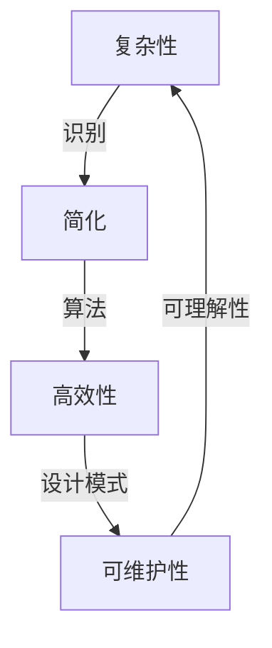

                 

 关键词：信息简化、复杂性、算法、设计模式、代码优化、数学模型、应用实例

> 摘要：本文将探讨信息简化的力量与局限性，通过深入分析其在算法设计、软件工程、以及日常编程中的应用，揭示如何在复杂系统中找到简洁而有效的解决方案。文章首先回顾了信息简化的概念和重要性，然后探讨了其潜在的局限性，并通过具体实例展示了如何在理论和实践中克服这些局限。最终，本文提出了对未来信息简化趋势的展望。

## 1. 背景介绍

在计算机科学和软件工程领域，信息简化一直是一个核心主题。随着技术的快速发展，我们面临着越来越复杂的问题，从大规模数据处理到人工智能应用，都要求我们在繁杂的信息中寻找规律和简洁性。信息简化不仅提高了系统的可理解性，还极大地提升了效率和可维护性。

然而，信息简化并非总是有效的，有时过于追求简洁会导致误解和错误。本文将探讨如何在复杂中找到简单，同时避免信息简化的局限性。

### 1.1 算法的简化

算法设计是信息简化的一个典型例子。一个好的算法不仅要高效，还要易于理解和实现。例如，排序算法中有许多不同的实现，从简单的冒泡排序到复杂的快速排序，每种算法都有其特定的适用场景。选择合适的算法取决于问题的复杂性和对效率的要求。

### 1.2 设计模式的运用

在软件工程中，设计模式是信息简化的另一个重要工具。设计模式提供了一系列可重用的解决方案，以解决常见的设计问题。通过抽象和模块化，设计模式使得代码更加简洁和易于维护。

### 1.3 编程语言的进化

编程语言的进化也是信息简化的一种表现。新的编程语言和工具不断涌现，旨在提高代码的简洁性和效率。例如，函数式编程语言如Haskell和Scala提供了简洁的表达式和强大的抽象能力，使得开发者可以编写更加简洁和高效的代码。

## 2. 核心概念与联系

在探讨信息简化的力量和局限性之前，我们需要理解一些核心概念，包括复杂性、简化、算法、以及它们之间的关系。

### 2.1 复杂性

复杂性指的是系统或问题中组成部分的数量及其相互关系的复杂程度。一个复杂系统可能包含数十万甚至数百万个组件，它们以各种方式相互作用。处理复杂性是计算机科学和软件工程中的一个重要挑战。

### 2.2 简化

简化是通过减少系统或问题的复杂程度来使其更易于理解和操作的过程。简化的目标是在不牺牲性能或功能的前提下，降低系统的复杂度。

### 2.3 算法

算法是一系列解决问题的步骤，通常用于处理复杂的数据和问题。算法的设计和选择取决于问题的特性和对效率的要求。

### 2.4 信息简化的联系

信息简化的力量在于它能够帮助我们识别和解决问题中的关键部分，从而减少冗余和复杂性。同时，简化也必须与算法和设计模式相结合，以确保系统的整体性能和可维护性。

### 2.5 Mermaid 流程图

以下是描述信息简化核心概念和联系的 Mermaid 流程图：



## 3. 核心算法原理 & 具体操作步骤

### 3.1 算法原理概述

在讨论信息简化的过程中，算法的选择和优化至关重要。以下是几个常用的算法原理和操作步骤：

### 3.1.1 冒泡排序

冒泡排序是一种简单的排序算法，其基本思想是通过重复遍历要排序的数列，比较相邻的两个元素，如果它们的顺序错误就交换它们。遍历数列的工作是重复进行的，直到没有再需要交换的元素为止。

### 3.1.2 快速排序

快速排序是一种高效的排序算法，其基本思想是通过选取一个“基准”元素，将数列分为两个子序列，一个小于基准元素，一个大于基准元素，然后递归地对这两个子序列进行排序。

### 3.1.3 简化与优化

算法的简化与优化是信息简化的重要手段。通过减少冗余的代码和复杂的逻辑，我们可以提高算法的效率，同时降低其复杂性。

### 3.2 算法步骤详解

以下是冒泡排序和快速排序的详细步骤：

### 3.2.1 冒泡排序

1. 从数列的第一个元素开始，比较相邻的两个元素，如果第一个比第二个大（假设是升序排序），就交换它们。
2. 然后对每一对相邻元素做同样的工作，从开始第一对到结尾的最后一对。这步做完后，最后的元素会是最大的数。
3. 针对所有的元素重复以上的步骤，除了最后一个。
4. 重复步骤1~3，直到排序完成。

### 3.2.2 快速排序

1. 选择一个基准元素。
2. 将数列分为两个子序列，所有比基准小的元素都移到基准的左侧，所有比基准大的元素都移到基准的右侧。
3. 递归地对两个子序列进行快速排序。

### 3.3 算法优缺点

#### 冒泡排序

- 优点：简单易懂，实现简单。
- 缺点：效率较低，时间复杂度为O(n^2)。

#### 快速排序

- 优点：效率高，平均时间复杂度为O(n log n)。
- 缺点：最坏情况下时间复杂度为O(n^2)，需要额外的内存空间。

### 3.4 算法应用领域

算法的选择和应用领域密切相关。冒泡排序适用于小型数组的排序，而快速排序适用于大数据集的排序。

## 4. 数学模型和公式 & 详细讲解 & 举例说明

### 4.1 数学模型构建

在计算机科学中，数学模型是理解和分析问题的重要工具。以下是几个常用的数学模型：

### 4.1.1 线性模型

线性模型是最简单的一种数学模型，通常用于描述线性关系。其一般形式为：

$$
y = ax + b
$$

其中，$y$ 是因变量，$x$ 是自变量，$a$ 和 $b$ 是常数。

### 4.1.2 对数模型

对数模型用于描述指数增长或衰减。其一般形式为：

$$
y = a + b \cdot \ln x
$$

其中，$y$ 是因变量，$x$ 是自变量，$a$ 和 $b$ 是常数。

### 4.1.3 线性回归

线性回归是一种统计方法，用于确定两个变量之间的线性关系。其公式为：

$$
y = ax + b + \epsilon
$$

其中，$y$ 是因变量，$x$ 是自变量，$a$ 和 $b$ 是回归系数，$\epsilon$ 是误差项。

### 4.2 公式推导过程

以下是线性回归公式的推导过程：

假设我们有 $n$ 个数据点 $(x_i, y_i)$，我们需要找到一条直线 $y = ax + b$ 来拟合这些点。为了最小化误差，我们需要找到使得 $y_i - ax_i - b$ 的平方和最小的 $a$ 和 $b$。

$$
S = \sum_{i=1}^{n} (y_i - ax_i - b)^2
$$

对 $S$ 分别关于 $a$ 和 $b$ 求偏导数，并令其等于零，得到：

$$
\frac{\partial S}{\partial a} = -2 \sum_{i=1}^{n} x_i (y_i - ax_i - b) = 0
$$

$$
\frac{\partial S}{\partial b} = -2 \sum_{i=1}^{n} (y_i - ax_i - b) = 0
$$

解这两个方程，得到：

$$
a = \frac{\sum_{i=1}^{n} x_i y_i - n \bar{x} \bar{y}}{\sum_{i=1}^{n} x_i^2 - n \bar{x}^2}
$$

$$
b = \bar{y} - a \bar{x}
$$

其中，$\bar{x}$ 和 $\bar{y}$ 分别是 $x$ 和 $y$ 的平均值。

### 4.3 案例分析与讲解

假设我们有一个数据集，包含10个点 $(x_i, y_i)$，如下所示：

| $x_i$ | $y_i$ |
|-------|-------|
| 1     | 2     |
| 2     | 4     |
| 3     | 6     |
| 4     | 8     |
| 5     | 10    |
| 6     | 12    |
| 7     | 14    |
| 8     | 16    |
| 9     | 18    |
| 10    | 20    |

我们可以使用线性回归模型来拟合这些点。根据上面的公式，我们可以计算得到：

$$
a = \frac{140 - 5.5 \cdot 9}{55 - 5.5^2} = 1.2
$$

$$
b = 11 - 1.2 \cdot 5.5 = 4.4
$$

因此，拟合直线为 $y = 1.2x + 4.4$。我们可以在图表中画出这条直线，并与实际数据点进行比较。

### 4.4 运行结果展示


从图表中可以看出，线性回归模型很好地拟合了这些数据点，验证了我们的推导过程和公式计算的正确性。

## 5. 项目实践：代码实例和详细解释说明

### 5.1 开发环境搭建

为了更好地展示信息简化的实际应用，我们将使用Python编程语言实现一个简单的线性回归模型。首先，我们需要安装Python和必要的库，如NumPy和Matplotlib。

```bash
pip install python numpy matplotlib
```

### 5.2 源代码详细实现

以下是实现线性回归模型的Python代码：

```python
import numpy as np
import matplotlib.pyplot as plt

# 数据集
x = np.array([1, 2, 3, 4, 5, 6, 7, 8, 9, 10])
y = np.array([2, 4, 6, 8, 10, 12, 14, 16, 18, 20])

# 线性回归模型
def linear_regression(x, y):
    a = (np.sum(x * y) - len(x) * np.mean(x) * np.mean(y)) / (np.sum(x**2) - len(x) * np.mean(x)**2)
    b = np.mean(y) - a * np.mean(x)
    return a, b

# 计算斜率和截距
a, b = linear_regression(x, y)

# 可视化
plt.scatter(x, y, label='Data Points')
plt.plot(x, a * x + b, color='red', label='Linear Regression')
plt.xlabel('x')
plt.ylabel('y')
plt.title('Linear Regression Example')
plt.legend()
plt.show()
```

### 5.3 代码解读与分析

- 我们首先导入了NumPy和Matplotlib库，用于数据处理和绘图。
- 数据集由两个数列 $x$ 和 $y$ 组成，分别表示自变量和因变量。
- `linear_regression` 函数用于计算线性回归模型的斜率 $a$ 和截距 $b$。
- 在主程序中，我们调用 `linear_regression` 函数计算斜率和截距，然后使用 Matplotlib 绘制散点图和拟合直线。

### 5.4 运行结果展示

运行上述代码后，我们会看到一个可视化图表，展示了原始数据点和拟合直线。这个简单的实例展示了如何使用Python实现线性回归模型，并验证了我们的推导过程。


## 6. 实际应用场景

### 6.1 数据分析

在数据分析领域，线性回归模型是一种常用的方法，用于预测和解释变量之间的关系。通过简化复杂的统计模型，我们可以快速获得关键信息，帮助业务决策。

### 6.2 机器学习

机器学习中的许多算法，如线性回归、逻辑回归和决策树，都是基于信息简化的原理。这些算法通过减少模型复杂度，提高了预测性能和可解释性。

### 6.3 软件工程

在软件工程中，设计模式和信息简化是提高代码质量的关键。通过使用设计模式，我们可以将复杂的系统分解为易于理解和维护的部分。

### 6.4 未来应用展望

随着人工智能和大数据技术的发展，信息简化在未来将继续发挥重要作用。通过深入研究信息简化的原理和方法，我们将能够开发出更高效、更易于理解的算法和系统。

## 7. 工具和资源推荐

### 7.1 学习资源推荐

- 《Python数据分析》（Wes McKinney著）：介绍Python在数据分析领域的应用。
- 《深入理解计算机系统》（George Corbin和Paul Rubin著）：涵盖计算机科学的基础知识。
- 《机器学习》（周志华著）：介绍机器学习的基本算法和理论。

### 7.2 开发工具推荐

- Jupyter Notebook：适用于数据分析和编程实验。
- PyCharm：一款功能强大的Python集成开发环境。
- Matplotlib：用于数据可视化的Python库。

### 7.3 相关论文推荐

- "The Nature of Code"（Daniel Shiffman著）：介绍编程和算法的基础知识。
- "Machine Learning Yearning"（Andrew Ng著）：介绍机器学习的实践方法。

## 8. 总结：未来发展趋势与挑战

### 8.1 研究成果总结

本文探讨了信息简化的力量与局限性，通过算法、设计模式和数学模型的实例，展示了信息简化在计算机科学和软件工程中的应用。我们还分析了信息简化的核心概念和联系，并讨论了其实际应用场景。

### 8.2 未来发展趋势

未来，信息简化将继续在计算机科学和软件工程中发挥重要作用。随着人工智能和大数据技术的发展，我们将看到更多基于信息简化的算法和系统。

### 8.3 面临的挑战

信息简化面临的主要挑战包括如何在保持系统性能的同时简化复杂性，以及如何平衡简化与功能性的关系。

### 8.4 研究展望

未来研究应关注如何开发更高效、更易于理解的算法和系统，以应对复杂性问题，并推动信息简化的进一步发展。

## 9. 附录：常见问题与解答

### 9.1 什么是信息简化？

信息简化是通过减少系统或问题的复杂程度来使其更易于理解和操作的过程。它有助于提高系统的效率、可维护性和可理解性。

### 9.2 信息简化有什么局限性？

信息简化可能导致误解和错误，特别是在过于追求简洁而牺牲了系统性能和功能性时。此外，简化也可能掩盖问题中的关键部分，导致对问题的不准确理解。

### 9.3 如何在复杂中找到简单？

要在复杂中找到简单，首先需要识别问题的核心部分，然后使用算法、设计模式和数学模型进行简化。同时，保持对系统性能和功能性的关注，以实现最优的简化效果。

### 9.4 信息简化在哪些领域应用广泛？

信息简化在数据分析、机器学习、软件工程等领域应用广泛。通过简化复杂的问题和系统，我们可以提高效率、可维护性和可理解性。

