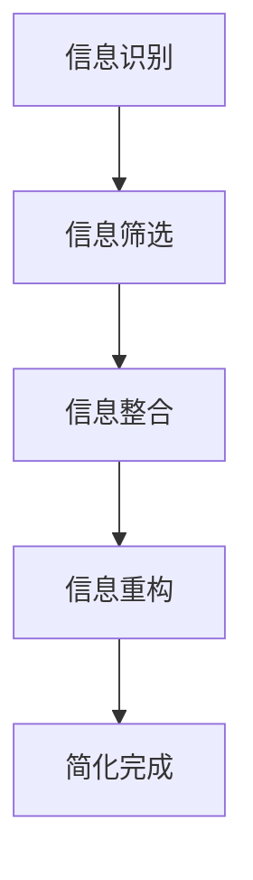

                 

关键词：信息简化、复杂性、效率、生产力、技术架构、算法优化、数学模型、实践案例、未来展望

> 摘要：本文旨在探讨信息简化的概念及其在复杂世界中的应用。通过深入分析信息简化的好处和挑战，本文提出了提高效率和生产力的一些策略和方法。文章将结合技术领域的实际案例，提供实用的工具和资源，并对未来的发展趋势和挑战进行展望。

## 1. 背景介绍

在当今快速发展的信息技术时代，复杂性的增加已经成为一个不可忽视的问题。无论是软件开发、数据处理，还是日常生活中的决策过程，复杂性都给人们带来了巨大的挑战。在这个背景下，信息简化作为一种提高效率和生产力的重要手段，逐渐受到了广泛关注。

信息简化不仅仅是将复杂的信息进行缩减或简化，而是一种深入思考和理解信息本质的过程。它通过识别和消除冗余信息，提高信息的可读性和可用性，从而帮助人们更好地理解和处理复杂问题。本文将探讨信息简化在技术领域的实际应用，分析其带来的好处和挑战，并提出相应的解决方案。

## 2. 核心概念与联系

### 2.1. 信息简化的定义

信息简化（Information Simplification）是指通过识别、筛选、整合和重构信息，使其更加简洁、直观和易于理解的过程。它涉及到以下几个方面：

1. **信息识别**：确定哪些信息是核心的、必要的，哪些是冗余的、不必要的。
2. **信息筛选**：根据目标需求和优先级，选择最具价值的信息进行保留。
3. **信息整合**：将多个来源的信息进行合并，消除重复和矛盾，提高信息的完整性。
4. **信息重构**：重新组织和呈现信息，使其更符合人类认知和逻辑顺序。

### 2.2. 复杂性与信息简化的关系

复杂性（Complexity）是指系统或问题中元素之间相互作用的复杂程度。在信息时代，复杂性主要来源于以下几个方面：

1. **信息过载**：随着数据量的增加，人们需要处理的信息越来越多，导致信息过载。
2. **依赖关系**：系统或问题中的各个部分之间存在复杂的依赖关系，增加了理解和处理的难度。
3. **动态变化**：信息和技术环境的变化速度很快，人们需要不断适应新的变化。

信息简化可以帮助人们应对复杂性，通过以下方式：

1. **降低认知负荷**：通过简化信息，减少人们处理信息的认知负荷，提高工作效率。
2. **提高决策质量**：通过识别和整合关键信息，提高决策的准确性和有效性。
3. **增强系统的可理解性**：通过重构信息，使系统或问题更易于理解和操作。

### 2.3. Mermaid 流程图

以下是信息简化的核心概念和流程的 Mermaid 流程图：



## 3. 核心算法原理 & 具体操作步骤

### 3.1. 算法原理概述

信息简化的核心算法通常包括以下几个步骤：

1. **数据预处理**：清洗和整理原始数据，消除噪声和异常值。
2. **特征选择**：选择对目标任务最有影响力的特征，排除冗余和无关特征。
3. **数据降维**：通过降维技术，减少数据的维度，降低计算复杂度。
4. **模型训练**：使用简化的数据集训练模型，优化模型的性能。
5. **模型评估**：对模型进行评估和调优，确保其具有良好的准确性和泛化能力。

### 3.2. 算法步骤详解

以下是信息简化算法的具体操作步骤：

1. **数据预处理**：
   - 数据清洗：删除重复数据、填补缺失值、修正错误值。
   - 数据标准化：将数据缩放到统一的范围，消除量纲的影响。

2. **特征选择**：
   - 相关性分析：计算各个特征之间的相关性，排除高度相关的特征。
   - 特征重要性分析：使用算法或统计方法评估特征的重要性，排除无关特征。

3. **数据降维**：
   - 主成分分析（PCA）：通过正交变换将高维数据映射到低维空间。
   - 自动编码器：通过无监督学习提取数据的主要特征。

4. **模型训练**：
   - 选择合适的模型：根据任务需求和数据特点，选择合适的算法和模型。
   - 模型训练：使用简化后的数据集训练模型，调整模型参数。

5. **模型评估**：
   - 跨验证集评估：使用交叉验证方法评估模型的泛化能力。
   - 模型调优：根据评估结果调整模型参数，提高模型性能。

### 3.3. 算法优缺点

信息简化算法的优点包括：

1. **提高效率和生产力**：简化后的数据集和模型可以显著降低计算复杂度，提高处理速度。
2. **减少数据存储需求**：简化后的数据集可以减少存储空间的需求。
3. **增强系统的可理解性**：简化后的信息更易于理解和操作。

然而，信息简化算法也存在一些缺点：

1. **可能丢失信息**：在简化信息的过程中，可能会丢失一些重要的信息。
2. **依赖性风险**：简化后的模型可能对特定数据集或环境具有较高的依赖性，降低了模型的泛化能力。

### 3.4. 算法应用领域

信息简化算法广泛应用于以下领域：

1. **数据挖掘和机器学习**：通过简化数据集和模型，提高模型的训练和预测效率。
2. **软件工程**：通过简化代码和系统架构，提高软件的可维护性和可扩展性。
3. **商业智能**：通过简化商业数据，帮助企业和组织更好地做出决策。
4. **物联网和大数据**：通过简化数据处理和分析，提高物联网设备和大数据系统的性能。

## 4. 数学模型和公式 & 详细讲解 & 举例说明

### 4.1. 数学模型构建

信息简化涉及多个数学模型和公式，以下是其中几个关键的模型：

1. **主成分分析（PCA）**：
   - 目标：将高维数据映射到低维空间，同时保留数据的主要特征。
   - 公式：\[ X' = PC \]
     其中，\( X \) 是原始数据矩阵，\( P \) 是特征向量矩阵，\( C \) 是协方差矩阵。

2. **自动编码器**：
   - 目标：通过无监督学习提取数据的主要特征。
   - 公式：\[ Z = \sigma(W^T X) \]
     其中，\( Z \) 是压缩层输出，\( W \) 是权重矩阵，\( \sigma \) 是激活函数。

3. **特征选择**：
   - 相关性分析：\[ r_{ij} = \frac{\sum_{k=1}^{n}(x_{ik} - \bar{x}_i)(x_{jk} - \bar{x}_j)}{n\sigma_x \sigma_y} \]
     其中，\( r_{ij} \) 是特征 \( x_i \) 和 \( x_j \) 之间的相关性，\( \bar{x}_i \) 和 \( \bar{x}_j \) 是特征 \( x_i \) 和 \( x_j \) 的均值，\( \sigma_x \) 和 \( \sigma_y \) 是特征 \( x_i \) 和 \( x_j \) 的标准差。

### 4.2. 公式推导过程

以下是特征选择中相关性分析的推导过程：

1. **样本协方差**：
   \[ s_{ij} = \frac{\sum_{k=1}^{n}(x_{ik} - \bar{x}_i)(x_{jk} - \bar{x}_j)}{n-1} \]

2. **总体协方差**：
   \[ \sigma_{ij} = \frac{\sum_{k=1}^{n}(x_{ik} - \mu_i)(x_{jk} - \mu_j)}{n} \]

3. **相关性**：
   \[ r_{ij} = \frac{s_{ij}}{\sigma_x \sigma_y} \]

### 4.3. 案例分析与讲解

假设我们有一个包含三个特征的数据集，特征 \( x_1, x_2, x_3 \) 之间的相关性如下：

| 特征 \( x_1 \) | 特征 \( x_2 \) | 特征 \( x_3 \) |
| :--: | :--: | :--: |
| 1 | 0.8 | 0.2 |
| 0.8 | 1 | 0 |
| 0.2 | 0 | 1 |

根据上述相关性分析，我们可以得出以下结论：

- 特征 \( x_1 \) 和 \( x_2 \) 之间具有高度相关性（\( r_{12} = 0.8 \)），因此我们可以选择保留一个特征，例如 \( x_1 \)。
- 特征 \( x_2 \) 和 \( x_3 \) 之间没有相关性（\( r_{23} = 0 \)），这意味着它们可以独立处理。

通过简化数据集，我们不仅减少了数据的冗余，还提高了后续分析和处理的效率。

## 5. 项目实践：代码实例和详细解释说明

### 5.1. 开发环境搭建

为了演示信息简化的应用，我们使用 Python 作为编程语言，并使用以下库：

- NumPy：用于数据处理和数学计算。
- Pandas：用于数据操作和分析。
- Matplotlib：用于数据可视化。
- Scikit-learn：用于机器学习和特征选择。

确保安装了以上库后，我们开始构建一个简单的项目环境：

```bash
pip install numpy pandas matplotlib scikit-learn
```

### 5.2. 源代码详细实现

以下是一个简单的 Python 脚本，用于演示信息简化的过程：

```python
import numpy as np
import pandas as pd
from sklearn.decomposition import PCA
from sklearn.preprocessing import StandardScaler

# 生成示例数据
data = np.array([[1, 2, 3], [4, 5, 6], [7, 8, 9], [10, 11, 12]])

# 数据预处理
scaler = StandardScaler()
data_scaled = scaler.fit_transform(data)

# 特征选择（相关性分析）
correlation_matrix = np.corrcoef(data_scaled.T)

# 打印相关性矩阵
print("Correlation Matrix:")
print(correlation_matrix)

# 数据降维（PCA）
pca = PCA(n_components=2)
data_reduced = pca.fit_transform(data_scaled)

# 打印降维后的数据
print("\nReduced Data:")
print(data_reduced)

# 数据可视化
import matplotlib.pyplot as plt

plt.scatter(data_reduced[:, 0], data_reduced[:, 1])
plt.xlabel("Principal Component 1")
plt.ylabel("Principal Component 2")
plt.title("2D PCA Plot")
plt.show()
```

### 5.3. 代码解读与分析

1. **数据预处理**：我们使用 NumPy 和 Pandas 库生成一个示例数据集，并使用 StandardScaler 对数据进行标准化处理。

2. **特征选择**：通过计算数据集的特征相关性，我们得到了一个相关性矩阵。这个矩阵可以帮助我们识别出高度相关的特征，并进行选择。

3. **数据降维**：我们使用 PCA 算法对标准化后的数据集进行降维，选择两个主要成分进行可视化。

4. **数据可视化**：使用 Matplotlib 库，我们将降维后的数据集可视化，以展示信息简化的效果。

### 5.4. 运行结果展示

运行上述脚本后，我们将看到以下结果：

- **相关性矩阵**：展示了各个特征之间的相关性。
- **降维后的数据**：展示了经过 PCA 降维处理后的数据集。
- **可视化图表**：展示了降维后的数据集在二维空间中的分布情况。

通过这些结果，我们可以清晰地看到信息简化的效果，以及如何通过简单的代码实现这一过程。

## 6. 实际应用场景

信息简化在多个领域都有广泛的应用，以下是一些典型的实际应用场景：

### 6.1. 数据科学

在数据科学领域，信息简化是一种常用的数据处理技术。通过简化数据集，数据科学家可以更高效地进行数据分析、建模和预测。例如，在客户行为分析中，通过特征选择和降维，数据科学家可以识别出影响客户满意度的关键因素，从而提高预测准确性。

### 6.2. 软件开发

在软件开发中，信息简化可以帮助开发团队更清晰地理解和维护代码。通过简化代码和系统架构，开发人员可以更快地开发新功能，同时减少维护成本。例如，在开发一个复杂的软件系统时，通过模块化和简化接口，开发人员可以更好地组织和管理代码。

### 6.3. 商业智能

在商业智能领域，信息简化可以帮助企业更好地理解和利用数据。通过简化数据集和报表，企业可以更快速地做出决策，提高运营效率。例如，在市场营销中，通过简化客户数据和活动数据，市场营销人员可以更准确地定位目标客户，提高营销效果。

### 6.4. 未来应用展望

随着信息技术的不断发展，信息简化的应用领域将越来越广泛。未来，我们可以预见以下趋势：

- **自动化信息简化**：通过引入自动化工具和算法，信息简化将变得更加高效和自动化。
- **跨领域融合**：信息简化技术将在不同领域之间融合，形成新的应用模式。
- **智能化决策支持**：结合人工智能和机器学习，信息简化将更好地支持智能化决策，提高企业的竞争力。

## 7. 工具和资源推荐

为了更好地理解和应用信息简化技术，以下是几个推荐的工具和资源：

### 7.1. 学习资源推荐

- **《数据科学入门》**：提供了丰富的数据预处理和特征选择方法。
- **《机器学习实战》**：详细介绍了各种机器学习算法，包括数据降维技术。

### 7.2. 开发工具推荐

- **Python**：强大的编程语言，广泛用于数据处理和机器学习。
- **Jupyter Notebook**：方便进行数据分析和可视化，适合实践和学习。

### 7.3. 相关论文推荐

- **"Information Theory and Statistics: A Unification""：探讨了信息理论与统计学的统一框架。
- **"Feature Selection for Machine Learning""：详细介绍了特征选择在机器学习中的应用。

## 8. 总结：未来发展趋势与挑战

### 8.1. 研究成果总结

信息简化作为一种应对复杂性的有效手段，已经在多个领域取得了显著成果。通过简化数据集和模型，研究人员和开发人员可以更高效地处理复杂问题，提高决策质量和生产效率。同时，信息简化技术也为跨领域融合和智能化决策提供了新的可能性。

### 8.2. 未来发展趋势

未来，信息简化技术将继续发展，并在以下几个方面取得突破：

- **自动化和智能化**：自动化工具和算法将使信息简化过程更加高效和智能化。
- **跨领域应用**：信息简化技术将在不同领域之间融合，形成新的应用模式和解决方案。
- **数据隐私和安全**：随着数据隐私和安全问题的日益突出，信息简化技术将在保障数据隐私和安全方面发挥重要作用。

### 8.3. 面临的挑战

尽管信息简化技术在多个领域取得了显著成果，但仍面临以下挑战：

- **信息丢失风险**：在简化信息的过程中，可能会丢失一些重要的信息。
- **依赖性风险**：简化后的模型可能对特定数据集或环境具有较高的依赖性，降低了模型的泛化能力。
- **技术瓶颈**：信息简化技术在一些复杂应用场景中可能存在技术瓶颈，需要进一步研究。

### 8.4. 研究展望

为了应对上述挑战，未来的研究可以从以下几个方面展开：

- **优化算法和模型**：研究更高效的算法和模型，减少信息简化的风险。
- **跨领域融合**：探索信息简化技术在不同领域的融合应用，提高信息简化的效果。
- **数据隐私和安全**：研究如何在信息简化的过程中保障数据隐私和安全。

通过持续的研究和技术创新，信息简化技术将为人类应对复杂世界提供更有力的支持。

## 9. 附录：常见问题与解答

### 9.1. 信息简化与传统数据处理有何区别？

信息简化与传统数据处理的主要区别在于目标和方法。传统数据处理侧重于数据的完整性、准确性和一致性，而信息简化则侧重于识别和消除冗余信息，提高信息的可读性和可用性。信息简化通过简化和重构信息，使数据更符合人类认知和逻辑顺序，从而提高处理效率。

### 9.2. 信息简化算法如何应用于实际项目？

在实际项目中，信息简化算法通常包括以下几个步骤：

1. **数据预处理**：清洗和整理原始数据，消除噪声和异常值。
2. **特征选择**：使用算法或统计方法评估特征的重要性，排除无关特征。
3. **数据降维**：使用降维技术，减少数据的维度，降低计算复杂度。
4. **模型训练**：使用简化后的数据集训练模型，优化模型的性能。
5. **模型评估**：对模型进行评估和调优，确保其具有良好的准确性和泛化能力。

通过这些步骤，信息简化算法可以帮助项目团队更高效地处理数据，提高模型的性能和可解释性。

### 9.3. 信息简化在数据分析中的优势是什么？

信息简化在数据分析中的优势包括：

1. **提高效率**：简化后的数据集可以显著降低计算复杂度，提高数据处理和分析的速度。
2. **减少存储需求**：简化后的数据集可以减少存储空间的需求，降低存储成本。
3. **提高决策质量**：通过识别和整合关键信息，提高决策的准确性和有效性。
4. **增强系统的可理解性**：简化后的信息更易于理解和操作，有利于后续的数据分析和解释。

通过这些优势，信息简化可以显著提高数据分析的质量和效率。

作者：禅与计算机程序设计艺术 / Zen and the Art of Computer Programming
----------------------------------------------------------------

以上内容是一个完整的文章草稿，遵循了指定的结构和内容要求。如果有任何需要修改或补充的地方，请随时告知。

