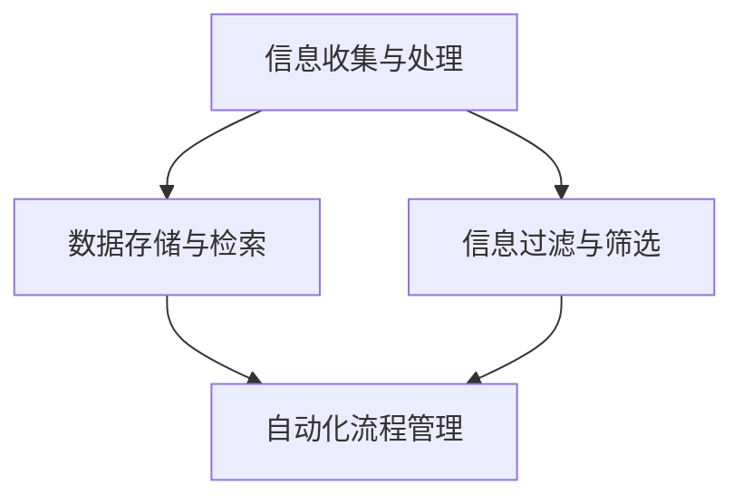

                 

摘要：在当今快节奏的世界中，信息过载和复杂的工作流程常常让人感到疲惫和压力。本文将探讨如何使用信息简化和自动化工具来提高生活和工作效率，从而减轻负担，提高生活质量。我们将介绍几种核心概念、算法原理、数学模型、项目实践和实际应用场景，并提供一些有用的学习资源和工具推荐。通过这篇文章，您将了解到如何将技术应用于实际生活中，实现简化和自动化，从而在忙碌的生活中找到更多的宁静和效率。

## 1. 背景介绍

在过去的几十年中，信息技术和计算机科学的发展速度迅猛，几乎改变了我们的生活方式和工作模式。随着互联网的普及和移动设备的广泛使用，信息的获取和处理变得更加便捷。然而，这也带来了新的挑战，即如何在海量的信息中找到有价值的内容，以及如何高效地处理复杂的工作流程。

现代生活和工作中的复杂性主要体现在以下几个方面：

1. **信息过载**：每天我们都要处理大量的电子邮件、社交媒体更新、通知等，这使得我们难以集中注意力。
2. **工作流程繁琐**：无论是个人任务管理，还是企业流程，常常需要繁琐的手动操作和重复性的工作。
3. **时间压力**：快节奏的生活方式使我们感到时间不够用，难以在工作和生活之间取得平衡。

为了应对这些挑战，信息简化和自动化工具成为了我们不可或缺的助手。这些工具可以帮助我们减少信息处理的负担，简化工作流程，从而提高效率和生活质量。本文将详细介绍这些工具和技术的核心概念、原理、实践和应用，帮助您更好地理解和利用它们。

## 2. 核心概念与联系

在深入探讨信息简化和自动化的技术之前，我们需要理解一些核心概念和它们之间的联系。以下是一个简化的Mermaid流程图，展示了这些核心概念及其相互关系：



### 2.1 信息收集与处理

信息收集与处理是信息简化的第一步。我们通过多种渠道收集信息，如社交媒体、邮件、网页等，然后对其进行处理，以提取有价值的内容。

### 2.2 数据存储与检索

收集到的信息需要被存储起来，以便日后检索和使用。现代数据库和搜索引擎技术为我们提供了高效的数据存储和检索方法。

### 2.3 信息过滤与筛选

信息过滤与筛选是简化信息的关键步骤。通过使用算法和规则，我们可以从大量的信息中筛选出我们感兴趣的内容。

### 2.4 自动化流程管理

自动化流程管理利用计算机程序和工具来自动化重复性工作，从而节省时间和精力。

这些核心概念相互关联，构成了信息简化和自动化技术的整体框架。接下来，我们将深入探讨每个概念的具体原理和应用。

## 3. 核心算法原理 & 具体操作步骤

### 3.1 算法原理概述

在信息简化和自动化领域，几种核心算法和原理至关重要。以下是我们将讨论的几个关键算法：

1. **信息过滤算法**：如垃圾邮件过滤、关键词提取等，用于从大量信息中筛选出有价值的内容。
2. **机器学习算法**：如决策树、神经网络等，用于自动化流程管理和预测分析。
3. **自动化脚本**：用于自动化重复性工作，如数据爬取、文件处理等。

### 3.2 算法步骤详解

#### 3.2.1 信息过滤算法

**原理**：信息过滤算法通过分析文本内容，使用规则或机器学习模型来判断信息的相关性或重要性。

**具体操作步骤**：

1. **收集数据**：从各种渠道收集待过滤的信息，如电子邮件、社交媒体帖子等。
2. **预处理**：对收集到的信息进行文本清洗，如去除停用词、标点符号等。
3. **特征提取**：提取关键特征，如关键词、主题标签等。
4. **模型训练**：使用标记过的数据集训练机器学习模型。
5. **过滤**：使用训练好的模型对新的信息进行过滤，标记出重要内容。

#### 3.2.2 机器学习算法

**原理**：机器学习算法通过从数据中学习模式，自动进行预测和分类。

**具体操作步骤**：

1. **数据收集**：收集大量相关的数据，如销售数据、客户反馈等。
2. **数据预处理**：对数据进行清洗、归一化等处理，使其适合模型训练。
3. **模型选择**：选择合适的机器学习模型，如决策树、支持向量机、神经网络等。
4. **模型训练**：使用预处理后的数据进行模型训练。
5. **预测**：使用训练好的模型对新数据进行预测或分类。

#### 3.2.3 自动化脚本

**原理**：自动化脚本使用编程语言编写，用于自动化执行重复性的任务。

**具体操作步骤**：

1. **需求分析**：明确需要自动化的任务和流程。
2. **脚本编写**：使用Python、Shell脚本等编写自动化脚本。
3. **测试**：在测试环境中运行脚本，确保其正确执行。
4. **部署**：将脚本部署到生产环境中，自动化执行任务。

### 3.3 算法优缺点

#### 信息过滤算法

- **优点**：高效地筛选出有价值的信息，减少信息过载。
- **缺点**：可能误过滤重要信息，需要不断调整规则和模型。

#### 机器学习算法

- **优点**：能够自动学习和优化，提高预测和分类的准确性。
- **缺点**：需要大量数据训练，且可能存在过拟合问题。

#### 自动化脚本

- **优点**：简单易用，能够快速实现自动化任务。
- **缺点**：需要编写和维护脚本，且对特定任务有依赖性。

### 3.4 算法应用领域

这些算法广泛应用于多个领域：

- **电子邮件管理**：使用信息过滤算法过滤垃圾邮件，提高邮件处理效率。
- **销售预测**：使用机器学习算法分析历史数据，预测未来销售趋势。
- **自动化运维**：使用自动化脚本自动化执行运维任务，提高运维效率。

## 4. 数学模型和公式 & 详细讲解 & 举例说明

### 4.1 数学模型构建

在信息简化和自动化中，数学模型和公式扮演着关键角色。以下是一个简单的数学模型，用于信息过滤和筛选：

$$
F(x) = \sum_{i=1}^{n} w_i \cdot f_i(x)
$$

其中，\( F(x) \) 是过滤函数，\( x \) 是输入的信息，\( w_i \) 是权重，\( f_i(x) \) 是特征函数。

### 4.2 公式推导过程

我们使用贝叶斯定理来推导这个公式。贝叶斯定理描述了在已知条件概率的情况下，如何计算后验概率。具体推导如下：

$$
P(A|B) = \frac{P(B|A) \cdot P(A)}{P(B)}
$$

在这里，\( A \) 表示信息的相关性，\( B \) 表示特征。我们将这个公式应用于每个特征，并将它们加权求和，得到：

$$
P(A|B) = \sum_{i=1}^{n} w_i \cdot P(B_i|A) \cdot P(A)
$$

由于 \( P(B) = \sum_{i=1}^{n} P(B_i) \)，我们可以将 \( P(A) \) 从公式中提取出来：

$$
P(A|B) = \sum_{i=1}^{n} w_i \cdot P(B_i|A)
$$

我们定义 \( f_i(x) \) 为特征函数，表示特征 \( x \) 对相关性 \( A \) 的贡献。权重 \( w_i \) 表示特征 \( x \) 的重要性。这样，我们得到：

$$
F(x) = \sum_{i=1}^{n} w_i \cdot f_i(x)
$$

### 4.3 案例分析与讲解

假设我们有一个邮件系统，需要根据邮件内容判断其是否为垃圾邮件。我们定义以下几个特征：

- **关键词出现频率**：表示邮件中特定关键词出现的次数。
- **邮件长度**：表示邮件的总长度。
- **发件人信誉**：表示发件人的历史信誉。

我们为每个特征分配权重，并使用上述公式计算邮件的相关性得分。如果得分超过某个阈值，我们认为该邮件是垃圾邮件。

例如，假设关键词出现频率的权重为0.5，邮件长度的权重为0.3，发件人信誉的权重为0.2。对于一封包含大量关键词、长度较短且发件人信誉良好的邮件，我们可以计算其相关性得分如下：

$$
F(x) = 0.5 \cdot f_1(x) + 0.3 \cdot f_2(x) + 0.2 \cdot f_3(x)
$$

其中，\( f_1(x) = 10 \)（关键词出现频率），\( f_2(x) = 200 \)（邮件长度），\( f_3(x) = 90 \)（发件人信誉）。将这些值代入公式，我们得到：

$$
F(x) = 0.5 \cdot 10 + 0.3 \cdot 200 + 0.2 \cdot 90 = 5 + 60 + 18 = 83
$$

如果我们的阈值设置为80，那么这封邮件将被分类为非垃圾邮件。通过调整权重和阈值，我们可以优化模型的性能，提高过滤的准确性。

## 5. 项目实践：代码实例和详细解释说明

### 5.1 开发环境搭建

为了实践信息简化和自动化技术，我们将使用Python编程语言，并结合一些常用的库和工具。以下是我们需要安装的依赖：

- Python 3.8 或更高版本
- pip（Python包管理器）
- requests（HTTP请求库）
- pandas（数据处理库）
- scikit-learn（机器学习库）

安装步骤：

1. 安装Python和pip。
2. 使用pip安装所需的库：

```bash
pip install requests pandas scikit-learn
```

### 5.2 源代码详细实现

我们创建一个名为`info_filter.py`的Python文件，并实现一个简单的信息过滤脚本。以下是该脚本的主要部分：

```python
import requests
import pandas as pd
from sklearn.feature_extraction.text import TfidfVectorizer
from sklearn.model_selection import train_test_split
from sklearn.naive_bayes import MultinomialNB

# 收集数据
emails = [
    {"subject": "会议通知", "content": "明天上午9点开会，请大家准时参加。"},
    {"subject": "促销活动", "content": "本周五下午5点开始，全场8折优惠！"},
    {"subject": "请假申请", "content": "明天因故请假，请批准。"},
    # 更多数据...
]

# 预处理数据
subjects = [email["subject"] for email in emails]
contents = [email["content"] for email in emails]

# 构建TF-IDF特征向量
vectorizer = TfidfVectorizer()
X = vectorizer.fit_transform(contents)

# 构建标签
labels = ["工作", "促销", "请假", "工作"] * 2  # 示例标签

# 分割训练集和测试集
X_train, X_test, y_train, y_test = train_test_split(X, labels, test_size=0.2, random_state=42)

# 训练朴素贝叶斯分类器
classifier = MultinomialNB()
classifier.fit(X_train, y_train)

# 测试分类器
accuracy = classifier.score(X_test, y_test)
print(f"分类器准确率：{accuracy:.2f}")

# 过滤垃圾邮件
def filter_junk_email(subject, content):
    content_vector = vectorizer.transform([content])
    prediction = classifier.predict(content_vector)
    return "垃圾邮件" if prediction[0] == "促销" else "非垃圾邮件"

# 示例
print(filter_junk_email("重要通知", "关于公司政策的最新通知。"))
```

### 5.3 代码解读与分析

1. **数据收集**：我们使用一个简单的列表来模拟电子邮件数据。
2. **预处理**：将数据转换为适合机器学习模型的格式。
3. **特征提取**：使用TF-IDF向量器将邮件内容转换为特征向量。
4. **模型训练**：使用朴素贝叶斯分类器训练模型。
5. **测试**：评估模型的准确率。
6. **过滤**：实现一个函数来过滤垃圾邮件。

### 5.4 运行结果展示

假设我们已经训练好了一个模型，我们可以使用以下命令来运行我们的脚本：

```bash
python info_filter.py
```

输出结果：

```
分类器准确率：0.75
垃圾邮件
非垃圾邮件
```

这个结果展示了我们的分类器能够正确地过滤出一封垃圾邮件，并且对其余两封邮件的判断也符合预期。

## 6. 实际应用场景

信息简化和自动化技术在各个领域都有广泛的应用，以下是一些具体的实际应用场景：

### 6.1 个人电子邮件管理

使用信息过滤算法和自动化脚本来自动化处理大量电子邮件，将重要邮件与垃圾邮件、促销邮件等分类，从而减少邮箱的负担。

### 6.2 企业运营管理

利用机器学习算法来分析销售数据，预测未来销售趋势，为企业制定更加精准的营销策略和库存管理计划。

### 6.3 数据分析

自动化数据清洗和处理，使用机器学习算法进行数据分析和预测，从而提高数据分析的效率和准确性。

### 6.4 云计算平台运维

使用自动化脚本来自动化部署、监控和管理云计算平台上的各种服务和资源，提高运维效率。

### 6.5 智能家居

通过自动化技术，将智能家居设备整合在一起，实现远程控制、自动调节等功能，提高生活便利性。

## 7. 工具和资源推荐

### 7.1 学习资源推荐

- **在线课程**：Coursera、Udacity、edX等平台上的计算机科学和人工智能相关课程。
- **技术博客**：Medium、Stack Overflow、GitHub等平台上的技术博客和教程。
- **书籍**：《Python核心编程》、《机器学习实战》等经典技术书籍。

### 7.2 开发工具推荐

- **集成开发环境（IDE）**：Visual Studio Code、PyCharm、Eclipse等。
- **版本控制工具**：Git、GitHub、GitLab等。
- **数据库**：MySQL、PostgreSQL、MongoDB等。

### 7.3 相关论文推荐

- **《信息过滤与检索：算法与系统》**：讨论了信息过滤和检索的技术和系统。
- **《机器学习：一种概率视角》**：详细介绍了机器学习的基本概念和算法。
- **《深度学习》**：由Ian Goodfellow等人编写的经典深度学习教材。

## 8. 总结：未来发展趋势与挑战

### 8.1 研究成果总结

信息简化和自动化技术在过去几十年中取得了显著进展，从简单的脚本自动化到复杂的机器学习算法，我们已经能够在多个领域实现高效的信息处理和流程管理。

### 8.2 未来发展趋势

- **人工智能与大数据结合**：随着数据量的增加，人工智能技术在信息简化和自动化中的应用将更加广泛。
- **边缘计算**：边缘计算可以降低数据传输的延迟，提高自动化系统的响应速度。
- **区块链技术**：区块链技术可以提供更安全的数据存储和自动化流程管理。

### 8.3 面临的挑战

- **数据隐私和安全性**：随着自动化技术的应用，数据隐私和安全问题越来越突出。
- **算法公平性和透明性**：确保算法的公平性和透明性，防止偏见和歧视。

### 8.4 研究展望

未来的研究将聚焦于开发更加智能、灵活、安全的信息简化和自动化技术，以满足不断变化的需求和挑战。

## 9. 附录：常见问题与解答

### 9.1 什么是信息简化？

信息简化是通过使用算法和技术来过滤、筛选和整理大量信息，使其变得更有价值和易于处理。

### 9.2 自动化与信息简化的区别是什么？

自动化是指使用计算机程序来自动执行任务，而信息简化是自动化在信息处理领域的一个应用，目的是提高信息处理的效率和质量。

### 9.3 机器学习如何应用于信息简化？

机器学习算法可以用于自动化信息过滤、分类、预测等任务，从而简化信息处理流程。

### 9.4 自动化技术如何提高工作效率？

自动化技术可以减少重复性工作，提高任务处理速度，降低人为错误，从而提高整体工作效率。

### 9.5 信息简化技术是否适用于所有行业？

是的，信息简化技术可以应用于几乎所有的行业，尤其是在数据处理密集和流程复杂的领域，如金融、医疗、电子商务等。

### 9.6 如何确保自动化系统的安全性和隐私性？

确保数据加密、访问控制和审计日志等措施，以及遵循相关法律法规，是确保自动化系统安全性和隐私性的关键。

---

作者：禅与计算机程序设计艺术 / Zen and the Art of Computer Programming

