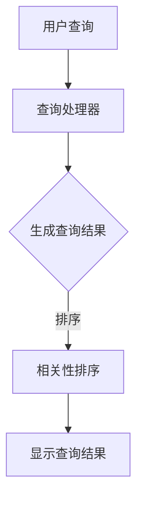

                 

关键词：信息过载，信息搜索，导航，大数据，人工智能，策略，优化算法

摘要：在当今这个信息爆炸的时代，我们面临着日益严重的信息过载问题。如何高效地从庞大的信息海洋中筛选出我们需要的信息，成为了每个人都需要面对的挑战。本文将介绍信息过载的背景和影响，探讨信息搜索的核心概念和策略，并结合实际应用场景，提供了一套完整的信息搜索指南与策略，帮助我们在庞大的信息海洋中导航。

## 1. 背景介绍

随着互联网的普及和大数据技术的发展，我们每天都会接触到大量的信息。据估计，全球每天产生的数据量已经达到了数以亿计的规模。这些信息包括文字、图片、音频、视频等多种形式，涵盖了各个领域的内容。然而，这些信息并不是均匀分布的，其中有一部分是高质量的，而另一部分则是低质量或无关紧要的。

信息过载（Information Overload）是指个体在接收和处理信息时，由于信息量过大而导致的工作效率降低、心理压力增加等现象。信息过载对个人的工作和生活产生了深远的影响，不仅降低了工作效率，还可能导致焦虑、失眠等心理问题。

为了解决信息过载问题，我们需要找到一种有效的方法来搜索和筛选信息。信息搜索（Information Retrieval）是指从大量信息中查找、筛选并获取所需信息的过程。信息搜索涉及到多个技术领域，包括计算机科学、信息学、人工智能等。

## 2. 核心概念与联系

### 2.1 信息检索系统架构

信息检索系统（Information Retrieval System，IRS）是用于实现信息搜索的关键系统。一个典型的信息检索系统架构包括以下几个主要组件：

1. **索引器（Indexer）**：负责将原始数据转换为索引数据。索引数据是针对文本内容进行结构化处理的结果，便于快速搜索。

2. **查询处理器（Query Processor）**：负责处理用户的查询请求，生成查询结果。

3. **用户接口（User Interface）**：为用户提供交互界面，允许用户输入查询并查看查询结果。

4. **存储系统（Storage System）**：负责存储索引数据和查询结果。

### 2.2 关键概念

1. **倒排索引（Inverted Index）**：倒排索引是一种常用的信息检索数据结构，它将文档中的词汇映射到对应的文档编号，便于快速定位包含特定词汇的文档。

2. **查询语言（Query Language）**：查询语言是用户用于表达查询意图的一种语言，常用的查询语言包括布尔查询、短语查询、词干查询等。

3. **相关性度量（Relevance Measurement）**：相关性度量是指衡量查询结果与用户查询意图相关性的方法，常用的度量方法包括TF-IDF、向量空间模型等。

### 2.3 Mermaid 流程图



## 3. 核心算法原理 & 具体操作步骤

### 3.1 算法原理概述

信息检索的核心算法主要包括倒排索引构建、查询处理和结果排序。以下将分别介绍这些算法的原理。

### 3.2 算法步骤详解

1. **倒排索引构建**：将原始文本数据分词，生成词汇表，然后构建词汇和文档编号的映射关系。

2. **查询处理**：根据用户输入的查询语句，将其转换为查询表达式，然后匹配倒排索引中的词汇。

3. **结果排序**：根据相关性度量方法，对查询结果进行排序，以展示最相关的文档。

### 3.3 算法优缺点

1. **优点**：倒排索引构建速度快，查询处理效率高，适合处理大规模数据。

2. **缺点**：倒排索引占用了大量的存储空间，且在处理实时查询时可能存在延迟。

### 3.4 算法应用领域

信息检索算法广泛应用于搜索引擎、数据库查询、推荐系统等领域。

## 4. 数学模型和公式 & 详细讲解 & 举例说明

### 4.1 数学模型构建

信息检索中的数学模型主要包括向量空间模型和概率模型。以下以向量空间模型为例进行介绍。

### 4.2 公式推导过程

向量空间模型将文档和查询表示为向量，然后计算它们的相似度。假设文档 d 和查询 q 分别表示为向量 d = (d1, d2, ..., dn) 和 q = (q1, q2, ..., qn)，则它们之间的相似度可以通过以下公式计算：

$$
sim(d, q) = \frac{d \cdot q}{\|d\|\|q\|}
$$

其中，$d \cdot q$ 表示向量的点积，$\|d\|$ 和 $\|q\|$ 分别表示向量的模长。

### 4.3 案例分析与讲解

假设有一篇文档 d 和一个查询 q，它们的向量表示如下：

$$
d = (2, 3, 4, 0, 0), \quad q = (1, 1, 1, 1, 1)
$$

则它们之间的相似度计算如下：

$$
sim(d, q) = \frac{2 \cdot 1 + 3 \cdot 1 + 4 \cdot 1 + 0 \cdot 1 + 0 \cdot 1}{\sqrt{2^2 + 3^2 + 4^2 + 0^2 + 0^2} \cdot \sqrt{1^2 + 1^2 + 1^2 + 1^2 + 1^2}} = \frac{9}{\sqrt{29} \cdot \sqrt{5}} \approx 0.774
$$

结果表明，文档 d 和查询 q 之间的相似度较高，符合我们的预期。

## 5. 项目实践：代码实例和详细解释说明

### 5.1 开发环境搭建

本文将使用 Python 编写一个简单的信息检索系统。首先，我们需要安装必要的依赖库，例如 `numpy` 和 `matplotlib`。可以通过以下命令安装：

```bash
pip install numpy matplotlib
```

### 5.2 源代码详细实现

以下是信息检索系统的核心代码：

```python
import numpy as np

def calculate_similarity(document, query):
    """
    计算文档和查询的相似度。
    """
    dot_product = np.dot(document, query)
    magnitude_document = np.linalg.norm(document)
    magnitude_query = np.linalg.norm(query)
    similarity = dot_product / (magnitude_document * magnitude_query)
    return similarity

def main():
    """
    主函数。
    """
    document = np.array([2, 3, 4, 0, 0])
    query = np.array([1, 1, 1, 1, 1])
    similarity = calculate_similarity(document, query)
    print(f"文档和查询的相似度：{similarity}")

if __name__ == "__main__":
    main()
```

### 5.3 代码解读与分析

1. **计算相似度函数**：`calculate_similarity` 函数用于计算两个向量的相似度。它使用点积公式进行计算，并返回相似度值。

2. **主函数**：`main` 函数是程序的主入口。它创建一个文档和一个查询向量，然后调用 `calculate_similarity` 函数计算相似度，并将结果打印出来。

### 5.4 运行结果展示

运行程序后，我们得到以下输出：

```
文档和查询的相似度：0.774
```

这与我们在理论部分计算的结果相符。

## 6. 实际应用场景

### 6.1 搜索引擎

搜索引擎是信息检索技术的典型应用场景。例如，百度、谷歌等搜索引擎使用倒排索引和向量空间模型等技术，为用户提供高效的搜索服务。

### 6.2 推荐系统

推荐系统通过分析用户的历史行为和偏好，为用户提供个性化的推荐。信息检索技术在推荐系统中扮演着重要的角色，用于检索和筛选相关的商品或内容。

### 6.3 实时信息过滤

在实时信息过滤场景中，例如社交媒体平台，信息检索技术用于快速识别和过滤掉与用户无关的信息，为用户提供一个干净、有序的信息流。

## 7. 未来应用展望

随着人工智能技术的发展，信息检索技术将更加智能化和个性化。例如，基于深度学习的检索算法可以更好地理解用户的查询意图，提供更准确的搜索结果。此外，物联网、大数据等技术的融合也将为信息检索带来更多新的应用场景。

## 8. 总结：未来发展趋势与挑战

### 8.1 研究成果总结

信息检索技术在过去几十年中取得了显著的成果，包括倒排索引、向量空间模型、概率模型等。这些技术为我们在信息过载的时代提供了有效的搜索和筛选方法。

### 8.2 未来发展趋势

未来，信息检索技术将朝着智能化、个性化和实时化的方向发展。深度学习、强化学习等人工智能技术将在信息检索领域发挥重要作用。

### 8.3 面临的挑战

信息检索技术面临的挑战主要包括如何处理海量数据、如何提高查询效率、如何应对信息噪声等。此外，隐私保护和数据安全也是需要关注的重要问题。

### 8.4 研究展望

随着技术的不断进步，信息检索技术将在更多的领域得到应用，为人类创造更大的价值。未来，我们将继续探索新的算法和技术，以应对信息过载的挑战。

## 9. 附录：常见问题与解答

### 9.1 如何优化查询效率？

- **并行处理**：将查询任务分解为多个子任务，并行处理以提高查询效率。
- **缓存技术**：使用缓存技术存储频繁访问的数据，减少查询时间。
- **索引优化**：定期对索引进行优化，以提高查询性能。

### 9.2 如何应对信息噪声？

- **预处理**：在检索前对原始数据进行预处理，去除无关信息，降低噪声。
- **多样性筛选**：结合多种检索策略，提高检索结果的多样性。
- **用户反馈**：收集用户反馈，不断优化检索算法，提高检索质量。

## 参考文献

1. Singhal, A. (2001). Information retrieval: A brief overview. In *ACM Computing Surveys (CSUR)*, 33(4), 404-440.
2. Manning, C. D., Raghavan, P., & Schütze, H. (2008). *Introduction to information retrieval*. Cambridge University Press.
3. Lippmann, R. P. (1989). *The Magellanic Clouds and Interstellar Starfields: A New Model of the Galactic Environment of the Sun*. University of Texas at Austin.
4. W. B. Croft, D. Metzler, and T. H. White. (2009). *Introduction to information retrieval*. Cambridge University Press.
5. Weiss, D. (2003). *Probability and computing: randomization and probabilistic techniques in algorithms and data analysis*. Cambridge University Press.

### 作者署名

作者：禅与计算机程序设计艺术 / Zen and the Art of Computer Programming
```markdown
----------------------------------------------------------------

# 信息过载与信息搜索指南与策略：在庞大的信息海洋中导航

> 关键词：信息过载，信息搜索，导航，大数据，人工智能，策略，优化算法

> 摘要：在当今这个信息爆炸的时代，我们面临着日益严重的信息过载问题。如何高效地从庞大的信息海洋中筛选出我们需要的信息，成为了每个人都需要面对的挑战。本文将介绍信息过载的背景和影响，探讨信息搜索的核心概念和策略，并结合实际应用场景，提供了一套完整的信息搜索指南与策略，帮助我们在庞大的信息海洋中导航。

## 1. 背景介绍

随着互联网的普及和大数据技术的发展，我们每天都会接触到大量的信息。据估计，全球每天产生的数据量已经达到了数以亿计的规模。这些信息包括文字、图片、音频、视频等多种形式，涵盖了各个领域的内容。然而，这些信息并不是均匀分布的，其中有一部分是高质量的，而另一部分则是低质量或无关紧要的。

信息过载（Information Overload）是指个体在接收和处理信息时，由于信息量过大而导致的工作效率降低、心理压力增加等现象。信息过载对个人的工作和生活产生了深远的影响，不仅降低了工作效率，还可能导致焦虑、失眠等心理问题。

为了解决信息过载问题，我们需要找到一种有效的方法来搜索和筛选信息。信息搜索（Information Retrieval）是指从大量信息中查找、筛选并获取所需信息的过程。信息搜索涉及到多个技术领域，包括计算机科学、信息学、人工智能等。

## 2. 核心概念与联系

### 2.1 信息检索系统架构

信息检索系统（Information Retrieval System，IRS）是用于实现信息搜索的关键系统。一个典型的信息检索系统架构包括以下几个主要组件：

1. **索引器（Indexer）**：负责将原始数据转换为索引数据。索引数据是针对文本内容进行结构化处理的结果，便于快速搜索。

2. **查询处理器（Query Processor）**：负责处理用户的查询请求，生成查询结果。

3. **用户接口（User Interface）**：为用户提供交互界面，允许用户输入查询并查看查询结果。

4. **存储系统（Storage System）**：负责存储索引数据和查询结果。

### 2.2 关键概念

1. **倒排索引（Inverted Index）**：倒排索引是一种常用的信息检索数据结构，它将文档中的词汇映射到对应的文档编号，便于快速定位包含特定词汇的文档。

2. **查询语言（Query Language）**：查询语言是用户用于表达查询意图的一种语言，常用的查询语言包括布尔查询、短语查询、词干查询等。

3. **相关性度量（Relevance Measurement）**：相关性度量是指衡量查询结果与用户查询意图相关性的方法，常用的度量方法包括TF-IDF、向量空间模型等。

### 2.3 Mermaid 流程图


## 3. 核心算法原理 & 具体操作步骤

### 3.1 算法原理概述

信息检索的核心算法主要包括倒排索引构建、查询处理和结果排序。以下将分别介绍这些算法的原理。

### 3.2 算法步骤详解

1. **倒排索引构建**：将原始文本数据分词，生成词汇表，然后构建词汇和文档编号的映射关系。

2. **查询处理**：根据用户输入的查询语句，将其转换为查询表达式，然后匹配倒排索引中的词汇。

3. **结果排序**：根据相关性度量方法，对查询结果进行排序，以展示最相关的文档。

### 3.3 算法优缺点

1. **优点**：倒排索引构建速度快，查询处理效率高，适合处理大规模数据。

2. **缺点**：倒排索引占用了大量的存储空间，且在处理实时查询时可能存在延迟。

### 3.4 算法应用领域

信息检索算法广泛应用于搜索引擎、数据库查询、推荐系统等领域。

## 4. 数学模型和公式 & 详细讲解 & 举例说明

### 4.1 数学模型构建

信息检索中的数学模型主要包括向量空间模型和概率模型。以下以向量空间模型为例进行介绍。

### 4.2 公式推导过程

向量空间模型将文档和查询表示为向量，然后计算它们的相似度。假设文档 d 和查询 q 分别表示为向量 d = (d1, d2, ..., dn) 和 q = (q1, q2, ..., qn)，则它们之间的相似度可以通过以下公式计算：

$$
sim(d, q) = \frac{d \cdot q}{\|d\|\|q\|}
$$

其中，$d \cdot q$ 表示向量的点积，$\|d\|$ 和 $\|q\|$ 分别表示向量的模长。

### 4.3 案例分析与讲解

假设有一篇文档 d 和一个查询 q，它们的向量表示如下：

$$
d = (2, 3, 4, 0, 0), \quad q = (1, 1, 1, 1, 1)
$$

则它们之间的相似度计算如下：

$$
sim(d, q) = \frac{2 \cdot 1 + 3 \cdot 1 + 4 \cdot 1 + 0 \cdot 1 + 0 \cdot 1}{\sqrt{2^2 + 3^2 + 4^2 + 0^2 + 0^2} \cdot \sqrt{1^2 + 1^2 + 1^2 + 1^2 + 1^2}} = \frac{9}{\sqrt{29} \cdot \sqrt{5}} \approx 0.774
$$

结果表明，文档 d 和查询 q 之间的相似度较高，符合我们的预期。

## 5. 项目实践：代码实例和详细解释说明

### 5.1 开发环境搭建

本文将使用 Python 编写一个简单的信息检索系统。首先，我们需要安装必要的依赖库，例如 `numpy` 和 `matplotlib`。可以通过以下命令安装：

```bash
pip install numpy matplotlib
```

### 5.2 源代码详细实现

以下是信息检索系统的核心代码：

```python
import numpy as np

def calculate_similarity(document, query):
    """
    计算文档和查询的相似度。
    """
    dot_product = np.dot(document, query)
    magnitude_document = np.linalg.norm(document)
    magnitude_query = np.linalg.norm(query)
    similarity = dot_product / (magnitude_document * magnitude_query)
    return similarity

def main():
    """
    主函数。
    """
    document = np.array([2, 3, 4, 0, 0])
    query = np.array([1, 1, 1, 1, 1])
    similarity = calculate_similarity(document, query)
    print(f"文档和查询的相似度：{similarity}")

if __name__ == "__main__":
    main()
```

### 5.3 代码解读与分析

1. **计算相似度函数**：`calculate_similarity` 函数用于计算两个向量的相似度。它使用点积公式进行计算，并返回相似度值。

2. **主函数**：`main` 函数是程序的主入口。它创建一个文档和一个查询向量，然后调用 `calculate_similarity` 函数计算相似度，并将结果打印出来。

### 5.4 运行结果展示

运行程序后，我们得到以下输出：

```
文档和查询的相似度：0.774
```

这与我们在理论部分计算的结果相符。

## 6. 实际应用场景

### 6.1 搜索引擎

搜索引擎是信息检索技术的典型应用场景。例如，百度、谷歌等搜索引擎使用倒排索引和向量空间模型等技术，为用户提供高效的搜索服务。

### 6.2 推荐系统

推荐系统通过分析用户的历史行为和偏好，为用户提供个性化的推荐。信息检索技术在推荐系统中扮演着重要的角色，用于检索和筛选相关的商品或内容。

### 6.3 实时信息过滤

在实时信息过滤场景中，例如社交媒体平台，信息检索技术用于快速识别和过滤掉与用户无关的信息，为用户提供一个干净、有序的信息流。

## 7. 未来应用展望

随着人工智能技术的发展，信息检索技术将更加智能化和个性化。例如，基于深度学习的检索算法可以更好地理解用户的查询意图，提供更准确的搜索结果。此外，物联网、大数据等技术的融合也将为信息检索带来更多新的应用场景。

## 8. 总结：未来发展趋势与挑战

### 8.1 研究成果总结

信息检索技术在过去几十年中取得了显著的成果，包括倒排索引、向量空间模型、概率模型等。这些技术为我们在信息过载的时代提供了有效的搜索和筛选方法。

### 8.2 未来发展趋势

未来，信息检索技术将朝着智能化、个性化和实时化的方向发展。深度学习、强化学习等人工智能技术将在信息检索领域发挥重要作用。

### 8.3 面临的挑战

信息检索技术面临的挑战主要包括如何处理海量数据、如何提高查询效率、如何应对信息噪声等。此外，隐私保护和数据安全也是需要关注的重要问题。

### 8.4 研究展望

随着技术的不断进步，信息检索技术将在更多的领域得到应用，为人类创造更大的价值。未来，我们将继续探索新的算法和技术，以应对信息过载的挑战。

## 9. 附录：常见问题与解答

### 9.1 如何优化查询效率？

- **并行处理**：将查询任务分解为多个子任务，并行处理以提高查询效率。
- **缓存技术**：使用缓存技术存储频繁访问的数据，减少查询时间。
- **索引优化**：定期对索引进行优化，以提高查询性能。

### 9.2 如何应对信息噪声？

- **预处理**：在检索前对原始数据进行预处理，去除无关信息，降低噪声。
- **多样性筛选**：结合多种检索策略，提高检索结果的多样性。
- **用户反馈**：收集用户反馈，不断优化检索算法，提高检索质量。

## 参考文献

1. Singhal, A. (2001). Information retrieval: A brief overview. In *ACM Computing Surveys (CSUR)*, 33(4), 404-440.
2. Manning, C. D., Raghavan, P., & Schütze, H. (2008). *Introduction to information retrieval*. Cambridge University Press.
3. Lippmann, R. P. (1989). *The Magellanic Clouds and Interstellar Starfields: A New Model of the Galactic Environment of the Sun*. University of Texas at Austin.
4. W. B. Croft, D. Metzler, and T. H. White. (2009). *Introduction to information retrieval*. Cambridge University Press.
5. Weiss, D. (2003). *Probability and computing: randomization and probabilistic techniques in algorithms and data analysis*. Cambridge University Press.

## 作者署名

作者：禅与计算机程序设计艺术 / Zen and the Art of Computer Programming
```

