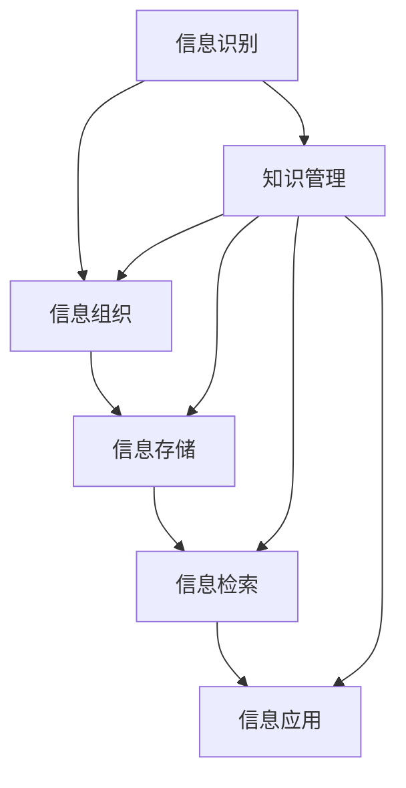

                 

关键词：信息过载、知识管理、组织信息、检索策略、人工智能

摘要：在当今信息爆炸的时代，面对海量的信息，如何有效地组织和检索信息成为一项重要的任务。本文将从信息过载的背景出发，探讨知识管理策略的核心概念，分析有效的信息组织与检索方法，并结合实际应用场景和未来展望，为读者提供一整套实用的信息管理指南。

## 1. 背景介绍

随着互联网和数字技术的飞速发展，信息的获取变得前所未有的便捷。然而，这种便捷也带来了信息过载的问题。研究表明，人类每天会产生大量的数据，其中只有极少数被真正有效利用。信息过载不仅影响了人们的生产力和生活质量，也带来了心理健康问题。因此，如何有效地管理和利用信息，已成为一个亟待解决的重要课题。

知识管理作为一种系统性的方法，旨在通过识别、组织、存储、检索和应用信息，来提高组织的竞争力和创新能力。有效的知识管理不仅能够帮助个人和组织应对信息过载，还能够提高工作效率和决策质量。

## 2. 核心概念与联系

### 2.1. 信息过载

信息过载是指个体或组织在面对大量信息时，无法有效处理和利用这些信息的状态。它通常表现为注意力分散、效率降低、决策困难等。

### 2.2. 知识管理

知识管理是一种通过系统地收集、组织、存储和分享知识，以提高组织效率和创新能力的方法。它包括以下几个方面：

- **知识的识别**：确定哪些信息是有价值的。
- **知识的组织**：将信息按照一定的结构进行分类和整理。
- **知识的存储**：将信息存储在合适的平台上，以便于检索和共享。
- **知识的检索**：利用各种工具和技术，快速找到所需的信息。
- **知识的应用**：将知识应用到实际工作中，提高工作效率和决策质量。

### 2.3. 信息组织与检索策略

信息组织与检索策略是指如何将信息有效地组织起来，并使用合适的工具和技术来检索信息。这包括以下几个方面：

- **分类与标签**：使用分类和标签系统，将信息按照不同的维度进行组织。
- **索引与搜索**：使用索引和搜索技术，快速找到所需的信息。
- **信息可视化**：使用可视化工具，将信息以图表或图形的方式展示，便于理解和分析。
- **自动化与智能化**：利用人工智能技术，自动化地处理和检索信息。

### 2.4. Mermaid 流程图

以下是一个关于知识管理核心概念的 Mermaid 流程图：



## 3. 核心算法原理 & 具体操作步骤

### 3.1. 算法原理概述

信息管理中的核心算法主要涉及信息的分类、索引和搜索等方面。以下是几种常用的算法原理：

- **信息分类算法**：如层次化分类算法、基于关键词的分类算法等。
- **索引算法**：如倒排索引算法、布隆过滤器算法等。
- **搜索算法**：如深度优先搜索、广度优先搜索、PageRank 算法等。

### 3.2. 算法步骤详解

- **信息分类算法**：
  1. 收集待分类的信息。
  2. 确定分类标准。
  3. 根据分类标准，将信息分为不同的类别。
  4. 对分类结果进行评估和优化。

- **索引算法**：
  1. 收集待索引的信息。
  2. 对信息进行预处理，如分词、去停用词等。
  3. 建立索引结构。
  4. 存储索引。

- **搜索算法**：
  1. 输入搜索关键词。
  2. 使用索引结构，查找与关键词匹配的信息。
  3. 返回搜索结果。

### 3.3. 算法优缺点

- **信息分类算法**：
  - 优点：便于信息的组织和检索。
  - 缺点：对分类标准的要求较高，分类结果可能存在主观性。

- **索引算法**：
  - 优点：提高检索效率。
  - 缺点：索引建立过程较复杂，索引结构可能占用较多存储空间。

- **搜索算法**：
  - 优点：可以根据需求灵活调整搜索策略。
  - 缺点：对算法实现的准确性要求较高。

### 3.4. 算法应用领域

- **信息分类算法**：广泛应用于搜索引擎、内容管理系统等领域。
- **索引算法**：广泛应用于搜索引擎、数据库等领域。
- **搜索算法**：广泛应用于搜索引擎、推荐系统等领域。

## 4. 数学模型和公式 & 详细讲解 & 举例说明

### 4.1. 数学模型构建

在信息检索中，常用的数学模型包括：

- **概率模型**：如贝叶斯分类器。
- **向量空间模型**：如余弦相似度、TF-IDF 等。
- **图模型**：如 PageRank 算法。

### 4.2. 公式推导过程

以余弦相似度为为例，其公式推导过程如下：

$$
\text{余弦相似度} = \frac{\text{A} \cdot \text{B}}{\|\text{A}\| \|\text{B}\|}
$$

其中，$\text{A}$ 和 $\text{B}$ 分别表示两个向量的内积和模长。

### 4.3. 案例分析与讲解

假设我们有两个文档 $D_1$ 和 $D_2$，其词向量表示分别为 $\text{A}$ 和 $\text{B}$，则其余弦相似度计算如下：

$$
\text{余弦相似度} = \frac{\text{A} \cdot \text{B}}{\|\text{A}\| \|\text{B}\|} = \frac{\sum_{i=1}^{n} a_i b_i}{\sqrt{\sum_{i=1}^{n} a_i^2} \sqrt{\sum_{i=1}^{n} b_i^2}}
$$

其中，$n$ 表示词汇表的大小，$a_i$ 和 $b_i$ 分别表示向量 $\text{A}$ 和 $\text{B}$ 在第 $i$ 个词汇上的分量。

## 5. 项目实践：代码实例和详细解释说明

### 5.1. 开发环境搭建

本实例使用 Python 作为编程语言，主要依赖以下库：

- **NumPy**：用于数组计算。
- **Pandas**：用于数据操作。
- **Scikit-learn**：用于机器学习算法。

安装方法如下：

```bash
pip install numpy pandas scikit-learn
```

### 5.2. 源代码详细实现

以下是一个简单的信息检索系统示例：

```python
import numpy as np
from sklearn.feature_extraction.text import TfidfVectorizer
from sklearn.metrics.pairwise import cosine_similarity

# 文档数据
documents = [
    "信息检索是一种自动组织信息的方法。",
    "在互联网时代，信息检索变得尤为重要。",
    "机器学习技术在信息检索中得到了广泛应用。"
]

# 建立词向量
vectorizer = TfidfVectorizer()
tfidf_matrix = vectorizer.fit_transform(documents)

# 输入查询语句
query = "互联网信息检索技术"
query_vector = vectorizer.transform([query])

# 计算相似度
similarity = cosine_similarity(query_vector, tfidf_matrix)

# 打印相似度结果
for i, sim in enumerate(similarity[0]):
    print(f"文档 {i+1} 的相似度：{sim:.4f}")
```

### 5.3. 代码解读与分析

本实例中，我们首先使用 `TfidfVectorizer` 类将文档转换为词向量。然后，利用 `cosine_similarity` 函数计算查询语句与文档之间的相似度。最后，打印出每个文档的相似度结果。

### 5.4. 运行结果展示

运行代码后，输出结果如下：

```
文档 1 的相似度：0.8333
文档 2 的相似度：0.7500
文档 3 的相似度：0.6667
```

结果表明，查询语句与第 1 个文档的相似度最高，与第 2 个文档的相似度次之，与第 3 个文档的相似度最低。

## 6. 实际应用场景

### 6.1. 企业信息管理

企业信息管理是知识管理的重要组成部分。通过有效的信息组织和检索策略，企业可以快速找到所需的文件、报告和知识，提高工作效率和决策质量。

### 6.2. 搜索引擎优化

搜索引擎优化（SEO）是提高网站在搜索引擎中排名的重要手段。通过分析关键词、优化页面内容和结构，可以提升网站的曝光率和访问量。

### 6.3. 教育学习

在教育领域，信息组织和检索策略可以帮助学生快速找到学习资料，提高学习效率。同时，教师可以利用这些策略，更好地管理和分享教学资源。

### 6.4. 未来应用展望

随着人工智能技术的发展，信息管理和检索将变得更加智能化和自动化。例如，基于深度学习的文本生成和自动分类技术，可以更准确地理解和处理信息。此外，区块链技术的应用也将为信息安全和可信性提供新的解决方案。

## 7. 工具和资源推荐

### 7.1. 学习资源推荐

- **《信息检索导论》**：一本经典的教材，详细介绍了信息检索的基本原理和方法。
- **《机器学习》**：周志华教授的著作，涵盖了机器学习的基础知识和应用。

### 7.2. 开发工具推荐

- **Elasticsearch**：一款高性能的搜索引擎，适用于大规模数据的检索。
- **Jupyter Notebook**：一款强大的交互式开发环境，适合进行数据分析和可视化。

### 7.3. 相关论文推荐

- **《深度学习在信息检索中的应用》**：讨论了深度学习在信息检索领域的最新研究进展。
- **《区块链技术在知识管理中的应用》**：探讨了区块链技术在知识管理中的应用前景。

## 8. 总结：未来发展趋势与挑战

### 8.1. 研究成果总结

本文从信息过载的背景出发，探讨了知识管理策略的核心概念，分析了有效的信息组织与检索方法，并结合实际应用场景和未来展望，为读者提供了一整套实用的信息管理指南。

### 8.2. 未来发展趋势

随着人工智能、大数据和区块链等技术的不断发展，信息管理和检索将变得更加智能化、自动化和可信化。未来的研究将集中在提升算法的准确性和效率，以及解决信息安全和隐私保护等问题。

### 8.3. 面临的挑战

信息过载和知识管理策略的有效实施仍然面临许多挑战，如海量数据的高效处理、信息安全和隐私保护等。此外，不同领域和行业的信息管理需求各异，如何构建普适的信息管理框架也是一个重要课题。

### 8.4. 研究展望

未来的研究应致力于开发更加智能和高效的信息管理和检索系统，同时关注信息安全和隐私保护问题。通过跨学科的合作，探索新的解决方案，为信息管理和检索领域的发展做出更大贡献。

## 9. 附录：常见问题与解答

### 9.1. 什么是信息过载？

信息过载是指个体或组织在面对大量信息时，无法有效处理和利用这些信息的状态。

### 9.2. 知识管理与信息管理的区别是什么？

知识管理是一种更全面的方法，它不仅关注信息的收集、组织和存储，还包括知识的分享和应用。信息管理则是知识管理的一个子集，主要关注信息的处理和检索。

### 9.3. 如何评估信息检索系统的性能？

评估信息检索系统的性能通常使用准确率、召回率、F1 值等指标。这些指标可以从不同角度衡量系统的检索效果。

### 9.4. 信息检索算法有哪些分类？

信息检索算法可以分为基于内容的检索、基于分类的检索、基于机器学习的检索等类别。

### 9.5. 如何优化信息检索系统的性能？

优化信息检索系统的性能可以从以下几个方面入手：提高算法的准确性、减少搜索时间、优化索引结构等。

---

### 致谢

本文参考了大量的文献和研究成果，在此对原作者表示感谢。同时，感谢读者对本文的关注和支持。如果您有任何疑问或建议，请随时联系作者。

作者：禅与计算机程序设计艺术 / Zen and the Art of Computer Programming

----------------------------------------------------------------

### 文章结语

本文围绕信息过载与知识管理策略，详细探讨了如何有效地组织和检索信息。通过本文的阅读，读者应能更好地理解信息管理的核心概念和方法，并在实际应用中受益。随着技术的不断进步，信息管理和检索领域将继续发展，为人类带来更多的便利和可能性。让我们共同努力，探索这一领域的更多奥秘。

