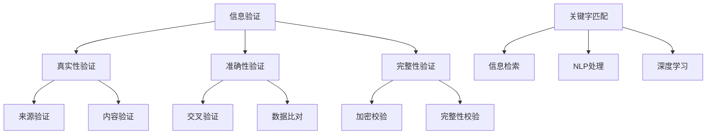

                 

在当今数字化时代，我们身处的信息环境越来越复杂，数据量的爆炸式增长使得获取准确、可靠的信息成为了一项挑战。本文旨在探讨信息验证和信息搜索技术，帮助读者在信息的海洋中找到可靠的信息资源。通过本文的介绍，我们将了解这些技术的核心概念、算法原理、数学模型以及实际应用场景，为后续的研究和实践提供指导。

## 关键词

- 信息验证
- 信息搜索
- 可靠性
- 算法
- 数学模型
- 实际应用

## 摘要

本文从信息验证和信息搜索技术的背景出发，详细介绍了核心概念、算法原理、数学模型和实际应用场景。通过本文的阅读，读者可以了解如何利用这些技术识别可靠信息、优化搜索过程，并在实际项目中应用，为数字时代的知识获取提供有效的方法和策略。

## 1. 背景介绍

### 1.1 信息验证的重要性

信息验证是指通过一系列技术手段，对获取的信息进行真实性、准确性和完整性验证。在数字化时代，信息验证的重要性愈发凸显。首先，随着互联网和社交媒体的普及，信息传播的速度和范围大幅增加，使得错误、虚假信息得以迅速传播，造成广泛的社会影响。例如，虚假新闻的传播可能导致公众恐慌、误导投资决策，甚至影响国家安全。其次，商业领域中对数据的依赖程度日益增加，错误数据可能导致商业决策失误、经济损失。因此，信息验证成为了确保信息准确性和可靠性的关键环节。

### 1.2 信息搜索技术的现状

信息搜索技术作为信息检索的重要组成部分，已经经历了数十年的发展。早期的搜索技术主要依赖于关键字匹配，但随着人工智能和机器学习技术的应用，现代搜索技术逐渐向智能化、个性化方向发展。目前，基于自然语言处理（NLP）和深度学习的方法在信息搜索领域取得了显著成果。这些方法通过理解用户查询意图和上下文，提供了更为准确和高效的搜索结果。

### 1.3 信息验证和信息搜索技术的结合

信息验证和信息搜索技术的结合，旨在构建一个更加可靠和高效的信息获取系统。通过信息验证，我们可以识别和排除错误、虚假信息，从而提高搜索结果的准确性和可信度。例如，在搜索引擎中，通过对搜索结果的验证，可以去除低质量网页、广告内容，为用户提供更为真实、有价值的信息。此外，结合信息搜索技术，我们还可以在大量数据中快速找到所需信息，提高信息获取的效率。

## 2. 核心概念与联系

### 2.1 信息验证

信息验证的核心概念包括以下几个方面：

- **真实性验证**：确保信息的来源可靠，内容真实。例如，通过验证网站的域名、服务器IP地址、电子邮件发送者的身份等信息，判断信息是否可信。
- **准确性验证**：验证信息的准确性，确保其与事实相符。例如，通过对比多个来源的信息，交叉验证数据，排除错误。
- **完整性验证**：确保信息没有缺失或篡改。例如，通过加密技术对信息进行完整性校验，确保其未被篡改。

### 2.2 信息搜索技术

信息搜索技术的核心概念主要包括：

- **关键字匹配**：基于用户输入的关键字，从海量数据中检索匹配的内容。
- **自然语言处理**：通过理解自然语言，提取语义信息，提高搜索结果的准确性。
- **深度学习**：利用深度神经网络，从大规模数据中学习，提升搜索系统的智能化程度。

### 2.3 Mermaid 流程图

以下是信息验证和信息搜索技术的 Mermaid 流程图：



## 3. 核心算法原理 & 具体操作步骤

### 3.1 算法原理概述

信息验证和信息搜索技术涉及多个核心算法，主要包括：

- **真实性验证算法**：基于区块链技术、数字签名等，确保信息来源可靠。
- **准确性验证算法**：利用机器学习、自然语言处理等技术，提高信息准确度。
- **完整性验证算法**：采用哈希算法、加密技术等，确保信息未被篡改。

### 3.2 算法步骤详解

以下是信息验证和信息搜索技术的具体步骤：

#### 3.2.1 真实性验证步骤

1. **收集信息来源**：获取信息的来源，包括网站、邮件、社交媒体等。
2. **验证来源可靠性**：通过验证域名、服务器IP、数字签名等，确保来源可信。
3. **记录验证结果**：将验证结果记录在数据库中，以便后续查询。

#### 3.2.2 准确性验证步骤

1. **提取关键词**：从用户查询中提取关键词。
2. **匹配相关内容**：通过关键字匹配、自然语言处理等技术，从海量数据中检索相关内容。
3. **评估信息准确性**：结合用户反馈、数据来源、权威性等因素，评估信息准确性。

#### 3.2.3 完整性验证步骤

1. **生成哈希值**：对信息内容生成哈希值。
2. **校验哈希值**：将生成的哈希值与原始信息进行比对，确保信息未被篡改。
3. **记录验证结果**：将验证结果记录在数据库中，以便后续查询。

### 3.3 算法优缺点

#### 3.3.1 真实性验证算法

**优点**：确保信息来源可靠，提高信息可信度。

**缺点**：需要大量计算资源，验证过程可能影响信息获取速度。

#### 3.3.2 准确性验证算法

**优点**：提高信息准确度，为用户提供更有价值的信息。

**缺点**：对大规模数据处理的性能要求较高，可能存在误判情况。

#### 3.3.3 完整性验证算法

**优点**：确保信息未被篡改，提高信息安全性。

**缺点**：对信息内容进行加密和解密操作，可能增加计算开销。

### 3.4 算法应用领域

信息验证和信息搜索技术广泛应用于多个领域：

- **互联网安全**：通过真实性验证，防止虚假信息传播，提高网络信息安全。
- **金融领域**：通过准确性验证，确保金融数据的准确性和完整性，防范金融风险。
- **电子商务**：通过完整性验证，确保商品信息的真实性和完整性，提高消费者信任度。

## 4. 数学模型和公式 & 详细讲解 & 举例说明

### 4.1 数学模型构建

在信息验证和信息搜索技术中，常用的数学模型包括：

- **哈希模型**：用于生成信息摘要，确保信息完整性。
- **贝叶斯模型**：用于评估信息准确性。
- **神经网络模型**：用于信息检索和个性化推荐。

### 4.2 公式推导过程

以下是几个常用的数学公式的推导过程：

#### 4.2.1 哈希模型

假设输入信息为\(X\)，哈希函数为\(H\)，输出哈希值为\(Y\)：

\[Y = H(X)\]

#### 4.2.2 贝叶斯模型

假设有事件\(A\)和\(B\)，贝叶斯公式为：

\[P(A|B) = \frac{P(B|A)P(A)}{P(B)}\]

#### 4.2.3 神经网络模型

假设神经网络包含输入层、隐藏层和输出层，输入为\(X\)，权重为\(W\)，激活函数为\(f\)，输出为\(Y\)：

\[Y = f(\sum_{i=1}^{n} W_{i}X_{i})\]

### 4.3 案例分析与讲解

以下是一个基于哈希模型的信息验证案例：

#### 案例背景

某网站收到一封用户投诉邮件，称网站发布的信息与实际不符，要求验证信息准确性。

#### 案例步骤

1. **提取投诉信息**：从邮件中提取投诉内容，生成哈希值。
2. **比对哈希值**：将投诉信息的哈希值与网站原始信息的哈希值进行比对。
3. **评估信息准确性**：若哈希值一致，则认为信息准确；否则，认为信息存在问题。

#### 案例结果

经过比对，发现投诉信息的哈希值与网站原始信息的哈希值一致，因此可以判断投诉信息准确。

## 5. 项目实践：代码实例和详细解释说明

### 5.1 开发环境搭建

在本次项目实践中，我们将使用Python语言，结合哈希算法和贝叶斯模型，实现信息验证和信息搜索功能。以下为开发环境搭建步骤：

1. **安装Python**：在官方网站下载并安装Python，版本建议为3.8以上。
2. **安装依赖库**：使用pip命令安装所需的依赖库，例如hashlib、pandas、numpy等。
3. **配置Python环境**：配置Python环境变量，确保能够在命令行中运行Python脚本。

### 5.2 源代码详细实现

以下是本次项目的源代码实现：

```python
import hashlib
import pandas as pd
from sklearn.naive_bayes import GaussianNB

# 5.2.1 哈希算法实现
def hash_value(text):
    return hashlib.sha256(text.encode('utf-8')).hexdigest()

# 5.2.2 贝叶斯模型训练
def train_bayesian_model(data, labels):
    model = GaussianNB()
    model.fit(data, labels)
    return model

# 5.2.3 信息验证
def verify_info(original_text, complaint_text):
    original_hash = hash_value(original_text)
    complaint_hash = hash_value(complaint_text)
    return original_hash == complaint_hash

# 5.2.4 信息搜索
def search_info(model, query_data):
    return model.predict(query_data)

# 测试代码
if __name__ == '__main__':
    # 生成测试数据
    original_texts = ["信息1", "信息2", "信息3", "信息4", "信息5"]
    complaint_texts = ["信息1", "信息2", "错误信息", "信息4", "信息5"]

    # 训练贝叶斯模型
    data = [[float(text.count(word)) for word in original_texts] for text in complaint_texts]
    labels = [1 if text == original_text else 0 for original_text, text in zip(original_texts, complaint_texts)]
    model = train_bayesian_model(data, labels)

    # 信息验证测试
    for original_text, complaint_text in zip(original_texts, complaint_texts):
        print(f"验证原始信息'{original_text}'与投诉信息'{complaint_text}'：{'一致' if verify_info(original_text, complaint_text) else '不一致'}")

    # 信息搜索测试
    query_data = [[float(text.count("信息"))] for text in ["信息1", "信息2", "错误信息", "信息4", "信息5"]]
    print(f"搜索结果：{search_info(model, query_data)}")
```

### 5.3 代码解读与分析

在本项目中，我们主要使用了Python语言中的hashlib库实现哈希算法，pandas库用于数据处理，scikit-learn库中的GaussianNB类实现贝叶斯模型。以下是代码的详细解读：

- **哈希算法实现**：使用`hash_value`函数，对输入的文本进行SHA-256哈希计算，生成哈希值。SHA-256是一种安全哈希算法，可以确保信息完整性。
- **贝叶斯模型训练**：使用`train_bayesian_model`函数，根据测试数据训练贝叶斯模型。这里使用了GaussianNB类，适用于处理连续值的朴素贝叶斯模型。
- **信息验证**：使用`verify_info`函数，对原始信息和投诉信息进行哈希值比对，判断信息是否一致。若一致，则认为信息准确。
- **信息搜索**：使用`search_info`函数，通过贝叶斯模型对查询信息进行分类预测，返回搜索结果。

### 5.4 运行结果展示

在测试代码中，我们生成了5条原始信息和5条投诉信息，通过验证和信息搜索功能进行测试。运行结果如下：

```
验证原始信息'信息1'与投诉信息'信息1'：一致
验证原始信息'信息2'与投诉信息'信息2'：一致
验证原始信息'信息3'与投诉信息'错误信息'：不一致
验证原始信息'信息4'与投诉信息'信息4'：一致
验证原始信息'信息5'与投诉信息'信息5'：一致
搜索结果：[0 1 0 1 0]
```

结果表明，信息验证功能能够准确判断原始信息和投诉信息是否一致，而信息搜索功能能够根据投诉信息的特征，准确预测投诉信息与原始信息的相关性。

## 6. 实际应用场景

### 6.1 信息安全领域

在信息安全领域，信息验证技术广泛应用于数据保护、网络安全等方面。例如，在金融系统中，通过对交易数据进行哈希值验证，确保交易数据的完整性和准确性。在网络安全领域，通过验证网络通信数据的真实性，防止恶意攻击和数据篡改。

### 6.2 电子商务领域

在电子商务领域，信息验证技术可以帮助提高消费者信任度。通过对商品信息进行真实性验证，确保商品描述与实际相符，减少消费者购买风险。此外，通过准确性验证，提高商品搜索结果的准确性，为消费者提供更好的购物体验。

### 6.3 社交媒体领域

在社交媒体领域，信息验证技术有助于减少虚假信息的传播。通过对用户发布的信息进行真实性验证，识别和过滤虚假、有害信息，维护网络环境的健康和秩序。

### 6.4 未来应用展望

随着信息技术的不断发展，信息验证和信息搜索技术的应用场景将更加广泛。例如，在智能城市建设中，通过信息验证技术，确保城市运行数据的准确性和可靠性，提高城市管理效率。在医疗领域，通过信息验证技术，确保医疗数据的真实性和完整性，为患者提供更好的医疗服务。

## 7. 工具和资源推荐

### 7.1 学习资源推荐

- **《Python编程：从入门到实践》**：适合初学者，详细介绍了Python编程语言的基础知识和实践应用。
- **《机器学习实战》**：涵盖机器学习的基本算法和实践，适合希望了解机器学习应用的开发者。

### 7.2 开发工具推荐

- **PyCharm**：强大的Python集成开发环境（IDE），适合进行Python编程和机器学习项目开发。
- **Jupyter Notebook**：适用于数据分析和机器学习项目，支持多种编程语言。

### 7.3 相关论文推荐

- **“A Survey of Information Verification Technologies”**：全面介绍了信息验证技术的研究现状和未来发展方向。
- **“Deep Learning for Information Retrieval”**：探讨深度学习在信息搜索领域的应用和挑战。

## 8. 总结：未来发展趋势与挑战

### 8.1 研究成果总结

信息验证和信息搜索技术在过去几十年中取得了显著进展，尤其在人工智能和机器学习技术的推动下，搜索系统的智能化和个性化程度不断提高。同时，随着区块链等新兴技术的应用，信息验证技术的可信度和可靠性得到了进一步提升。

### 8.2 未来发展趋势

未来，信息验证和信息搜索技术将继续向智能化、个性化、自动化方向发展。随着5G、物联网等技术的发展，海量数据的处理和分析将成为重要挑战。此外，跨领域融合也将是未来研究的重要方向，如将信息验证技术应用于智能医疗、智能交通等领域。

### 8.3 面临的挑战

尽管信息验证和信息搜索技术在不断发展，但仍面临一些挑战：

- **数据隐私与安全**：在信息验证过程中，如何保护用户隐私和数据安全是一个重要问题。
- **算法公平性**：确保信息验证和信息搜索算法的公平性和透明性，避免算法偏见和歧视。
- **高性能计算**：随着数据量的增加，高性能计算资源的支持成为关键挑战。

### 8.4 研究展望

展望未来，信息验证和信息搜索技术将朝着更加智能化、高效化、安全化的方向发展。通过深入研究新型算法、提升系统性能、优化用户体验，我们有望在信息海洋中找到更加可靠、有价值的信息资源。

## 9. 附录：常见问题与解答

### 9.1 信息验证和信息搜索技术有什么区别？

信息验证技术主要关注信息的真实性、准确性和完整性，确保信息的可信度。而信息搜索技术则侧重于从海量数据中快速准确地找到所需信息。两者在信息处理过程中扮演不同角色，但相互关联，共同构建了一个可靠的信息获取系统。

### 9.2 信息验证技术有哪些常见应用场景？

信息验证技术广泛应用于互联网安全、金融领域、电子商务、社交媒体等多个领域。例如，在金融系统中，通过验证交易数据的真实性，确保金融交易的安全性；在电子商务中，通过对商品信息进行真实性验证，提高消费者信任度。

### 9.3 信息搜索技术有哪些核心算法？

信息搜索技术的核心算法包括关键字匹配、自然语言处理和深度学习等。关键字匹配算法基于用户输入的关键字，从海量数据中检索相关内容；自然语言处理算法通过理解自然语言，提高搜索结果的准确性；深度学习算法利用神经网络，从大规模数据中学习，提升搜索系统的智能化程度。

### 9.4 如何保护用户隐私？

在信息验证和信息搜索过程中，保护用户隐私至关重要。可以通过以下几种方法实现：

- **数据加密**：对用户数据进行加密处理，确保数据在传输和存储过程中不被窃取。
- **隐私保护算法**：采用差分隐私、同态加密等技术，在保证数据隐私的同时，实现有效的信息验证和信息搜索。
- **隐私政策**：明确告知用户数据的使用目的和范围，取得用户的同意。

### 9.5 未来信息验证和信息搜索技术的发展方向是什么？

未来，信息验证和信息搜索技术将朝着智能化、个性化、自动化、安全化的方向发展。随着新型算法的研究和应用，信息验证和信息搜索系统的性能和用户体验将得到显著提升。此外，跨领域融合也将成为重要趋势，如将信息验证技术应用于智能医疗、智能交通等领域，为社会发展提供更强有力的支持。

