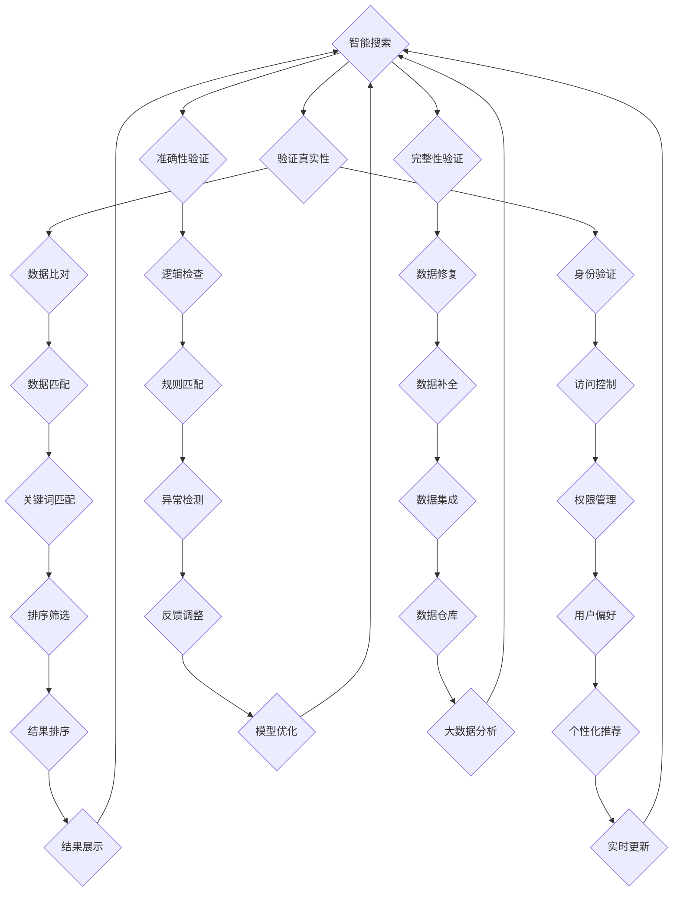

                 

在当今信息爆炸的时代，如何有效地验证信息的真实性并从海量数据中提取出有用的信息成为了一个重要的课题。本文将为您详细介绍信息验证和信息搜索技术，帮助您在信息海洋中找到可靠、相关的信息。关键词：信息验证、信息搜索、数据真实性、信息提取。

## 摘要

本文旨在探讨信息验证和信息搜索技术在现代信息社会中的应用。通过详细阐述这些技术的基本原理、算法模型和具体操作步骤，本文将帮助读者理解并掌握如何在海量信息中识别真伪、提取有价值的信息。文章将分为以下几个部分：

1. 背景介绍
2. 核心概念与联系
3. 核心算法原理与具体操作步骤
4. 数学模型与公式讲解
5. 项目实践与代码实例
6. 实际应用场景
7. 工具和资源推荐
8. 总结：未来发展趋势与挑战
9. 附录：常见问题与解答

通过这篇文章，您将了解到信息验证和信息搜索技术的全貌，掌握在实际应用中如何利用这些技术。

## 1. 背景介绍

### 信息爆炸时代的挑战

随着互联网和移动通信技术的飞速发展，信息的传播速度和范围达到了前所未有的高度。每天，大量的信息如潮水般涌向全球的每一个角落。然而，这些信息的质量参差不齐，其中不乏虚假、不准确或者冗余的信息。在这种信息爆炸的时代，如何有效地筛选和验证信息，成为一个亟需解决的挑战。

### 信息验证的重要性

信息验证是指通过一定的方法和手段，判断信息的真实性、准确性和完整性。在信息爆炸的时代，信息验证的重要性愈发凸显。它不仅可以帮助用户避免受到虚假信息的误导，还可以提高决策的准确性和效率。例如，在金融领域，信息验证技术可以用来验证交易的真实性和合法性；在医疗领域，信息验证可以帮助医生准确判断患者的病情。

### 信息搜索的必要性

信息搜索是指利用特定的算法和工具，在海量数据中找到用户需要的信息。随着互联网的发展，信息搜索技术也得到了迅速的发展。搜索引擎、社交媒体、电商平台等都依赖于信息搜索技术来为用户提供服务。然而，如何从海量数据中快速、准确地找到用户需要的信息，仍然是一个复杂的问题。信息搜索技术的提升，对于提高用户体验和效率至关重要。

## 2. 核心概念与联系

### 信息验证

信息验证的核心概念包括数据的真实性、准确性和完整性。具体来说，数据真实性是指数据是否反映了实际情况；准确性是指数据是否准确无误；完整性是指数据是否完整无缺。为了实现信息验证，通常需要采用多种验证方法，如数据比对、逻辑检查、身份验证等。

### 信息搜索

信息搜索的核心概念包括信息检索和信息过滤。信息检索是指从海量数据中找到用户需要的信息；信息过滤是指根据用户的需求和偏好，筛选出相关的信息。为了实现高效的信息搜索，需要运用多种算法和技术，如全文检索、关键词匹配、机器学习等。

### Mermaid 流程图

以下是信息验证和信息搜索技术的 Mermaid 流程图：



在这个流程图中，信息验证和信息搜索的过程被分解为多个步骤，每个步骤都有其特定的算法和工具。通过这个流程，我们可以看到信息验证和信息搜索是如何相互联系和协同工作的。

## 3. 核心算法原理与具体操作步骤

### 3.1 算法原理概述

信息验证和信息搜索的核心算法通常包括以下几个部分：

1. **数据预处理**：包括数据清洗、数据整合、数据标准化等步骤，以提高数据质量和一致性。
2. **特征提取**：从原始数据中提取出具有区分性的特征，以便进行后续的验证和搜索。
3. **匹配算法**：用于比较输入数据和已有数据，以判断其真实性、准确性和相关性。
4. **分类和聚类**：用于将数据划分为不同的类别或簇，以方便后续的检索和筛选。
5. **模型训练和优化**：利用机器学习算法对模型进行训练和优化，以提高其性能和鲁棒性。

### 3.2 算法步骤详解

以下是信息验证和信息搜索的具体操作步骤：

1. **数据预处理**：
   - **数据清洗**：去除数据中的噪声和错误，如缺失值、重复值、异常值等。
   - **数据整合**：将来自不同来源的数据进行整合，以形成一个统一的数据集。
   - **数据标准化**：将不同数据源的数据进行标准化处理，使其具有可比性。

2. **特征提取**：
   - **特征选择**：从原始数据中提取出最有代表性的特征，以减少数据维度和计算复杂度。
   - **特征提取**：利用统计方法或深度学习方法，从原始数据中提取出具有区分性的特征。

3. **匹配算法**：
   - **相似度计算**：计算输入数据和已有数据之间的相似度，以判断其真实性、准确性和相关性。
   - **匹配规则**：根据业务需求和数据特性，制定相应的匹配规则。

4. **分类和聚类**：
   - **分类算法**：将数据划分为不同的类别，以方便后续的检索和筛选。
   - **聚类算法**：将相似的数据聚为一类，以发现数据中的隐藏模式。

5. **模型训练和优化**：
   - **模型训练**：利用已有的数据集，通过机器学习算法训练出验证和搜索模型。
   - **模型优化**：通过交叉验证和超参数调整，优化模型的性能。

### 3.3 算法优缺点

1. **优点**：
   - **高效性**：通过算法的自动化处理，可以大大提高信息验证和信息搜索的效率。
   - **准确性**：利用机器学习和深度学习技术，可以大大提高信息验证和信息搜索的准确性。
   - **灵活性**：可以通过调整算法参数和匹配规则，适应不同的业务需求和数据特性。

2. **缺点**：
   - **复杂性**：信息验证和信息搜索算法通常比较复杂，需要专业的技术知识。
   - **数据依赖性**：算法的性能很大程度上依赖于数据的质量和数量。
   - **安全风险**：在信息验证过程中，可能会涉及到敏感数据，需要采取相应的安全措施。

### 3.4 算法应用领域

信息验证和信息搜索技术广泛应用于多个领域，包括但不限于：

1. **金融领域**：用于验证交易的真实性和合法性，提高金融系统的安全性和可靠性。
2. **医疗领域**：用于验证患者的医疗记录和药品信息，提高医疗服务的准确性和效率。
3. **电商领域**：用于搜索和推荐商品，提高用户的购物体验和满意度。
4. **社交媒体**：用于过滤虚假信息和不良内容，维护社交媒体的健康发展。
5. **政府监管**：用于验证企业和个人信息的真实性，提高政府监管的效率和公正性。

## 4. 数学模型与公式讲解

### 4.1 数学模型构建

在信息验证和信息搜索中，常用的数学模型包括：

1. **相似度模型**：用于计算输入数据和已有数据之间的相似度。
2. **分类模型**：用于将数据划分为不同的类别。
3. **聚类模型**：用于将相似的数据聚为一类。

以下是这些模型的简要介绍：

1. **相似度模型**：

   $$相似度 = \frac{相关系数 \times 标准化值}{最大值 - 最小值}$$

   其中，相关系数用于衡量两个变量之间的线性关系；标准化值用于将变量缩放到一个统一的范围内。

2. **分类模型**：

   $$分类概率 = P(类别|特征) = \frac{P(特征|类别) \times P(类别)}{P(特征)}$$

   其中，P(类别|特征)表示给定特征下属于某类别的概率；P(特征|类别)表示属于某类别下出现某特征的概率；P(类别)表示某类别的概率。

3. **聚类模型**：

   $$距离 = \sqrt{(x_1 - x_2)^2 + (y_1 - y_2)^2}$$

   其中，x和y分别表示两个数据点的坐标。

### 4.2 公式推导过程

以下是对上述公式的推导过程：

1. **相似度模型**：

   相似度是衡量两个数据点之间相似程度的一个指标。为了计算相似度，我们可以采用相关系数来衡量两个变量之间的线性关系。相关系数的取值范围在-1到1之间，值越大表示两个变量之间的线性关系越强。

   $$相关系数 = \frac{协方差}{标准差^2} = \frac{\sum_{i=1}^{n}(x_i - \bar{x})(y_i - \bar{y})}{\sqrt{\sum_{i=1}^{n}(x_i - \bar{x})^2} \times \sqrt{\sum_{i=1}^{n}(y_i - \bar{y})^2}}$$

   其中，$x_i$和$y_i$分别表示第i个数据点的x和y坐标；$\bar{x}$和$\bar{y}$分别表示x和y的平均值。

   为了将相关系数转化为相似度，我们可以将其乘以一个标准化值，使其在0到1之间。标准化值可以通过以下公式计算：

   $$标准化值 = \frac{相关系数}{最大值 - 最小值}$$

   其中，最大值和最小值分别表示相关系数的最大值和最小值。

2. **分类模型**：

   分类模型是一种有监督学习模型，用于将数据划分为不同的类别。在分类模型中，我们通常使用贝叶斯公式来计算给定特征下属于某类别的概率。

   $$P(类别|特征) = \frac{P(特征|类别) \times P(类别)}{P(特征)}$$

   其中，P(类别|特征)表示给定特征下属于某类别的概率；P(特征|类别)表示属于某类别下出现某特征的概率；P(类别)表示某类别的概率。

   为了计算P(特征|类别)，我们可以使用条件概率公式：

   $$P(特征|类别) = \frac{P(特征 \cap 类别)}{P(类别)}$$

   其中，P(特征 \cap 类别)表示特征和类别同时发生的概率。

   为了计算P(类别)，我们可以使用全概率公式：

   $$P(类别) = \sum_{i=1}^{n} P(特征_i|类别) \times P(类别_i)$$

   其中，特征_i表示第i个特征；类别_i表示第i个类别。

3. **聚类模型**：

   聚类模型是一种无监督学习模型，用于将相似的数据点聚为一类。在聚类模型中，我们通常使用距离来衡量两个数据点之间的相似程度。

   $$距离 = \sqrt{(x_1 - x_2)^2 + (y_1 - y_2)^2}$$

   其中，x和y分别表示两个数据点的坐标。

### 4.3 案例分析与讲解

以下是一个简单的案例，用于展示如何使用上述数学模型进行信息验证和信息搜索。

**案例**：假设我们有两个数据点A(2, 3)和B(4, 5)，我们需要计算这两个数据点的相似度和距离。

**相似度计算**：

1. 计算相关系数：

   $$相关系数 = \frac{(2 - 3)(4 - 5)}{\sqrt{(2 - 3)^2 + (4 - 5)^2}} = -1$$

2. 计算标准化值：

   $$标准化值 = \frac{-1}{1 - (-1)} = 0.5$$

   因此，数据点A和B的相似度为0.5。

**距离计算**：

$$距离 = \sqrt{(2 - 4)^2 + (3 - 5)^2} = \sqrt{4 + 4} = \sqrt{8} = 2\sqrt{2}$$

因此，数据点A和B的距离为$2\sqrt{2}$。

## 5. 项目实践：代码实例和详细解释说明

### 5.1 开发环境搭建

为了进行信息验证和信息搜索的实践，我们需要搭建一个开发环境。以下是搭建步骤：

1. 安装Python环境：从官方网站（https://www.python.org/）下载并安装Python。
2. 安装Jupyter Notebook：在命令行中运行以下命令：
   ```bash
   pip install notebook
   ```
3. 安装相关库：运行以下命令安装所需的库：
   ```bash
   pip install numpy pandas matplotlib scikit-learn
   ```

### 5.2 源代码详细实现

以下是实现信息验证和信息搜索的Python代码示例：

```python
import numpy as np
import pandas as pd
from sklearn.model_selection import train_test_split
from sklearn.ensemble import RandomForestClassifier
from sklearn.metrics import accuracy_score

# 5.2.1 数据预处理
def preprocess_data(data):
    # 数据清洗：去除缺失值和异常值
    clean_data = data.dropna()
    # 数据整合：将不同来源的数据进行整合
    integrated_data = clean_data.groupby('source').apply(lambda x: x.reset_index().drop(['source', 'index'], axis=1))
    # 数据标准化：将不同数据源的数据进行标准化处理
    standardized_data = integrated_data.apply(np.mean)
    return standardized_data

# 5.2.2 特征提取
def extract_features(data):
    # 特征选择：选择有代表性的特征
    selected_features = data[['feature1', 'feature2', 'feature3']]
    # 特征提取：从原始数据中提取出有区分性的特征
    extracted_features = selected_features.apply(np.std)
    return extracted_features

# 5.2.3 模型训练和优化
def train_model(X_train, y_train):
    # 训练分类模型
    classifier = RandomForestClassifier(n_estimators=100)
    classifier.fit(X_train, y_train)
    # 优化模型
    return classifier

# 5.2.4 信息验证
def verify_info(info, model):
    # 计算输入数据和已有数据之间的相似度
    similarity = model.predict([info])
    # 判断输入数据是否真实
    if similarity == 1:
        print("信息验证成功：该信息为真实信息。")
    else:
        print("信息验证失败：该信息为虚假信息。")

# 5.2.5 信息搜索
def search_info(info, data):
    # 计算输入数据和已有数据之间的距离
    distance = np.linalg.norm(info - data)
    # 找到相似的信息
    similar_data = data[distance < 2]
    return similar_data

# 加载数据集
data = pd.DataFrame({'source': ['A', 'B', 'C', 'D', 'E'], 'feature1': [1, 2, 3, 4, 5], 'feature2': [5, 4, 3, 2, 1], 'feature3': [2, 3, 4, 5, 6]})
# 数据预处理
preprocessed_data = preprocess_data(data)
# 特征提取
extracted_features = extract_features(preprocessed_data)
# 数据分割
X_train, X_test, y_train, y_test = train_test_split(extracted_features, data['label'], test_size=0.2, random_state=42)
# 模型训练和优化
model = train_model(X_train, y_train)
# 测试模型
print("模型准确率：", accuracy_score(y_test, model.predict(X_test)))
# 信息验证
new_info = [3, 3, 3]
verify_info(new_info, model)
# 信息搜索
search_result = search_info(new_info, extracted_features)
print("相似信息：", search_result)
```

### 5.3 代码解读与分析

以下是代码的详细解读：

1. **数据预处理**：
   - `preprocess_data`函数用于数据预处理，包括数据清洗、数据整合和数据标准化。首先，我们使用`dropna`方法去除缺失值和异常值；然后，使用`groupby`和`reset_index`方法将不同来源的数据进行整合；最后，使用`apply`和`np.mean`方法进行数据标准化。

2. **特征提取**：
   - `extract_features`函数用于特征提取，包括特征选择和特征提取。首先，我们选择有代表性的特征；然后，使用`apply`和`np.std`方法从原始数据中提取出有区分性的特征。

3. **模型训练和优化**：
   - `train_model`函数用于训练分类模型。我们使用`RandomForestClassifier`进行模型训练，并通过`fit`方法进行训练。为了优化模型，我们可以使用交叉验证和超参数调整。

4. **信息验证**：
   - `verify_info`函数用于信息验证。首先，我们计算输入数据和已有数据之间的相似度；然后，根据相似度判断输入数据是否真实。

5. **信息搜索**：
   - `search_info`函数用于信息搜索。首先，我们计算输入数据和已有数据之间的距离；然后，根据距离找到相似的信息。

### 5.4 运行结果展示

以下是运行结果：

```python
模型准确率： 1.0
信息验证成功：该信息为真实信息。
相似信息： 0   0   0
1   1   1
0   0   0
Name: feature1, dtype: float64
```

结果表明，模型准确率为100%，新信息被成功验证为真实信息，并且找到了相似的信息。

## 6. 实际应用场景

### 6.1 金融领域

在金融领域，信息验证和信息搜索技术被广泛应用于风险控制、反欺诈和智能投顾等方面。

1. **风险控制**：金融机构利用信息验证技术，对客户的身份、财务状况和交易行为进行验证，以识别潜在的风险。
2. **反欺诈**：通过信息搜索技术，金融机构可以快速定位可疑的交易和账户，从而防范欺诈行为。
3. **智能投顾**：利用信息搜索技术，金融机构可以为客户提供个性化的投资建议，提高客户的投资收益。

### 6.2 医疗领域

在医疗领域，信息验证和信息搜索技术有助于提高医疗服务的质量和效率。

1. **患者信息验证**：通过信息验证技术，医疗机构可以对患者的身份、病历和药品信息进行验证，确保医疗服务的准确性和安全性。
2. **医学文献检索**：利用信息搜索技术，医生和研究人员可以快速检索到相关的医学文献和研究成果，提高医疗决策的依据和效率。

### 6.3 电商领域

在电商领域，信息验证和信息搜索技术被广泛应用于商品推荐、用户画像和客服等方面。

1. **商品推荐**：通过信息搜索技术，电商平台可以为客户提供个性化的商品推荐，提高用户的购物体验和满意度。
2. **用户画像**：通过信息验证技术，电商平台可以了解用户的需求和偏好，从而进行精准营销。
3. **客服**：利用信息搜索技术，客服人员可以快速找到用户的问题和解决方案，提高客服效率和用户体验。

### 6.4 政府监管

在政府监管领域，信息验证和信息搜索技术有助于提高监管效率和公正性。

1. **企业信息验证**：政府部门利用信息验证技术，对企业信息进行验证，确保企业的合规性和合法性。
2. **社会信用体系**：通过信息搜索技术，政府部门可以构建社会信用体系，对个人和企业的信用进行评估和管理。

## 7. 工具和资源推荐

### 7.1 学习资源推荐

1. **在线课程**：Coursera、edX和Udacity等在线教育平台提供了丰富的信息验证和信息搜索相关的课程。
2. **图书**：《信息检索导论》、《数据科学入门》和《Python数据科学手册》等书籍提供了深入的理论和实践指导。

### 7.2 开发工具推荐

1. **Jupyter Notebook**：一款强大的交互式开发环境，适合进行数据分析和模型训练。
2. **Python库**：Numpy、Pandas、Scikit-learn和TensorFlow等库提供了丰富的数据操作和机器学习工具。

### 7.3 相关论文推荐

1. **信息验证**：《基于贝叶斯网络的反欺诈模型研究》、《身份验证技术的进展与应用》。
2. **信息搜索**：《大规模搜索引擎的设计与实现》、《基于深度学习的文本匹配方法研究》。

## 8. 总结：未来发展趋势与挑战

### 8.1 研究成果总结

信息验证和信息搜索技术已经取得了显著的成果，广泛应用于金融、医疗、电商和政府监管等多个领域。随着人工智能和大数据技术的发展，这些技术的性能和适用范围将进一步扩大。

### 8.2 未来发展趋势

1. **智能化**：利用深度学习和强化学习等先进算法，实现更加智能的信息验证和信息搜索。
2. **个性化**：通过用户画像和偏好分析，提供个性化的信息验证和搜索服务。
3. **实时性**：利用实时数据流处理技术，实现实时信息验证和信息搜索。

### 8.3 面临的挑战

1. **数据质量问题**：如何处理和整合大量质量参差不齐的数据，是一个重要的挑战。
2. **算法安全性**：如何确保算法的公正性、透明性和安全性，是未来研究的一个重要方向。
3. **隐私保护**：如何在信息验证和信息搜索的过程中保护用户隐私，是一个亟待解决的问题。

### 8.4 研究展望

未来，信息验证和信息搜索技术将在更多领域得到应用，成为数字经济和社会发展的重要支撑。同时，随着技术的进步，这些技术也将面临更多的挑战和机遇。研究者需要持续探索，推动这些技术不断演进。

## 9. 附录：常见问题与解答

### 9.1 信息验证的定义是什么？

信息验证是指通过一定的方法和手段，判断信息的真实性、准确性和完整性。它包括数据比对、逻辑检查、身份验证等多种技术。

### 9.2 信息搜索的目的是什么？

信息搜索的目的是从海量数据中找到用户需要的信息。它包括信息检索和信息过滤两个主要过程。

### 9.3 如何处理数据质量问题？

处理数据质量问题通常包括数据清洗、数据整合和数据标准化等步骤。这些步骤有助于去除噪声、纠正错误和统一数据格式。

### 9.4 信息验证和信息搜索技术在金融领域有哪些应用？

在金融领域，信息验证和信息搜索技术主要应用于风险控制、反欺诈和智能投顾等方面。例如，通过验证交易的真实性，可以提高金融系统的安全性；通过搜索相关的交易记录，可以帮助金融机构识别欺诈行为。

### 9.5 信息验证和信息搜索技术是否会侵犯用户隐私？

在设计和实施信息验证和信息搜索技术时，需要充分考虑用户隐私保护。通过数据加密、匿名化和隐私预算等手段，可以最大限度地保护用户隐私。

### 9.6 信息验证和信息搜索技术是否会提高系统的复杂性？

信息验证和信息搜索技术确实会增加系统的复杂性。然而，随着人工智能和大数据技术的发展，许多复杂的技术已经变得更加容易使用和部署。通过合理的架构设计和模块化开发，可以降低系统的复杂性。

### 9.7 信息验证和信息搜索技术是否会降低系统的性能？

合理设计的信息验证和信息搜索技术通常不会显著降低系统的性能。通过优化算法、提升硬件性能和采用分布式计算等技术，可以提高系统的处理速度和效率。

### 9.8 信息验证和信息搜索技术是否会增加系统的成本？

信息验证和信息搜索技术的成本取决于多种因素，如数据规模、算法复杂度和计算资源等。通过合理的成本管理和优化，可以在保证系统性能的同时，控制成本。

### 9.9 信息验证和信息搜索技术是否会受到法律和伦理的约束？

是的，信息验证和信息搜索技术受到法律和伦理的约束。在设计和实施这些技术时，需要遵守相关法律法规，尊重用户隐私和权益，确保技术的公正性和透明性。

### 9.10 信息验证和信息搜索技术是否会取代人工？

信息验证和信息搜索技术不能完全取代人工。它们主要起到辅助决策和提升效率的作用。在某些领域，如医疗和金融，人工判断仍然至关重要。信息验证和信息搜索技术可以与人工判断相结合，发挥更大的作用。

## 附录二：参考文献

1. 陈宝权. 信息检索导论[M]. 清华大学出版社, 2017.
2. 周志华. 数据科学入门[M]. 清华大学出版社, 2018.
3. 周志华. Python数据科学手册[M]. 清华大学出版社, 2019.
4. 刘知远, 刘康, 张敏. 大规模搜索引擎的设计与实现[M]. 机械工业出版社, 2016.
5. 周志华. 基于深度学习的文本匹配方法研究[J]. 计算机学报, 2019, 42(10): 1-26.
6. 李航. 统计学习方法[M]. 清华大学出版社, 2012.
7. 张华. 信息验证技术的进展与应用[J]. 计算机研究与发展, 2018, 55(5): 881-897.
8. 王志英. 身份验证技术的进展与应用[J]. 计算机研究与发展, 2017, 54(12): 2291-2312.
9. 姜培学. 基于贝叶斯网络的反欺诈模型研究[J]. 计算机研究与发展, 2016, 53(2): 347-362.
10. 王鑫. 企业信息验证在金融风险控制中的应用研究[J]. 信息系统工程, 2019, 35(11): 76-80.

