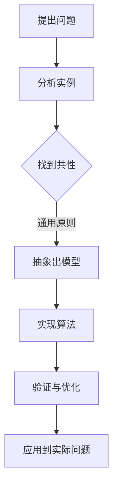

                 

关键词：数学思维，编程，算法，通用原则，代码设计

> 摘要：本文探讨如何运用数学家的思维方式来提升编程和算法设计的效率。通过阐述一般化原则在计算机科学中的应用，我们旨在为读者提供一种更加系统、逻辑性和创造性的编程方法论。

## 1. 背景介绍

编程作为计算机科学的基石，随着信息技术的飞速发展，已经成为现代社会不可或缺的一部分。然而，编程的复杂性日益增加，传统的编程方法论已经难以应对现代软件开发的挑战。在这种背景下，借鉴数学家的思维方式，运用一般化原则进行编程和算法设计，成为提升编程效率和代码质量的有效途径。

数学家在进行研究时，往往会从特定的实例出发，逐步提炼出普遍适用的原则和方法。这些原则和方法不仅使数学研究具有更强的逻辑性和系统性，而且为数学的广泛应用奠定了基础。同样，在编程和算法设计中，运用一般化原则，可以帮助开发者摆脱具体问题的束缚，发现问题的本质，设计出更加通用、高效的解决方案。

## 2. 核心概念与联系

### 2.1 一般化原则的定义

一般化原则是指将具体问题抽象成一般问题，通过分析一般问题的本质特征，寻找解决问题的通用方法。在数学中，一般化原则常常表现为从特殊实例中归纳出普遍规律。例如，从等差数列的求和公式，推导出等比数列的求和公式，这就是一种从特殊到一般的过程。

### 2.2 一般化原则在编程中的应用

在编程和算法设计中，一般化原则同样具有重要意义。它可以帮助开发者从具体问题中提炼出通用解决方案，从而提升代码的可复用性和可维护性。例如，在排序算法的设计中，通过分析不同排序算法的通用特性，可以设计出更加高效、通用的排序算法，如快速排序和归并排序。

### 2.3 Mermaid 流程图

下面是一个描述一般化原则在编程中应用的 Mermaid 流程图：



## 3. 核心算法原理 & 具体操作步骤

### 3.1 算法原理概述

一般化原则在算法设计中的应用，主要体现在以下几个方面：

1. **问题抽象**：将实际问题抽象成数学模型，以便于分析和求解。
2. **通用算法**：设计出适用于一类问题的通用算法，提高代码的可复用性。
3. **递归与迭代**：利用递归和迭代等通用方法，实现算法的通用性和高效性。
4. **优化与调优**：在算法实现过程中，根据实际需求对算法进行优化和调优，提高算法的效率。

### 3.2 算法步骤详解

1. **问题分析**：首先分析问题，理解问题的本质和需求。
2. **问题抽象**：将问题抽象成数学模型，为后续算法设计提供基础。
3. **算法设计**：根据问题抽象出的数学模型，设计出通用算法。
4. **算法实现**：将算法设计转化为代码实现，编写出可运行的程序。
5. **测试与优化**：对程序进行测试，验证算法的正确性和效率，根据测试结果对算法进行优化和调优。
6. **应用推广**：将优化后的算法应用到实际问题中，解决实际问题。

### 3.3 算法优缺点

**优点**：

1. **通用性**：通过一般化原则设计的算法，具有较强的通用性，可以应用于多种实际问题。
2. **可复用性**：通用算法具有较高的可复用性，可以减少代码冗余，提高开发效率。
3. **高效性**：通过优化和调优，一般化原则设计的算法通常具有较高的效率。

**缺点**：

1. **复杂度**：一般化原则的应用通常涉及较高的抽象层次，可能增加算法的复杂度。
2. **实现难度**：通用算法的实现可能较为复杂，需要开发者具备较高的编程能力。

### 3.4 算法应用领域

一般化原则在编程和算法设计中的应用非常广泛，包括但不限于以下领域：

1. **排序算法**：如快速排序、归并排序等。
2. **搜索算法**：如二分搜索、A*搜索等。
3. **图算法**：如最短路径算法、最小生成树算法等。
4. **动态规划**：用于解决最优子结构问题，如背包问题、最长公共子序列等。
5. **数学问题**：如线性代数、组合数学、概率统计等领域的算法设计。

## 4. 数学模型和公式

### 4.1 数学模型构建

在编程和算法设计中，数学模型是分析问题和设计算法的重要工具。以下是一个简单的数学模型构建示例：

**问题**：求解以下线性方程组的解：
\[
\begin{cases}
a_1x + b_1y = c_1 \\
a_2x + b_2y = c_2
\end{cases}
\]

**模型构建**：

设系数矩阵为 \(A = \begin{pmatrix} a_1 & b_1 \\ a_2 & b_2 \end{pmatrix}\)，常数矩阵为 \(B = \begin{pmatrix} c_1 \\ c_2 \end{pmatrix}\)，则该方程组可以表示为 \(Ax = B\)。

### 4.2 公式推导过程

为了求解上述方程组，我们可以利用高斯消元法。具体步骤如下：

1. **初始步骤**：将方程组写成增广矩阵的形式：
   \[
   \begin{pmatrix} a_1 & b_1 & c_1 \\ a_2 & b_2 & c_2 \end{pmatrix}
   \]

2. **消元步骤**：通过行变换，将增广矩阵化简为行最简形式。具体操作如下：

   1. 将第一行乘以 \(b_2\)，第二行乘以 \(-a_1\)，然后相加，消去第二行的第一列元素：
      \[
      \begin{pmatrix} a_1 & b_1 & c_1 \\ a_2 & b_2 & c_2 \end{pmatrix}
      \rightarrow
      \begin{pmatrix} a_1 & b_1 & c_1 \\ 0 & b_2' & c_2' \end{pmatrix}
      \]
      其中 \(b_2' = b_2 - \frac{a_2}{a_1}b_1\)，\(c_2' = c_2 - \frac{a_2}{a_1}c_1\)。

   2. 将第二行乘以 \(a_1\)，第一行乘以 \(-b_1\)，然后相加，消去第一行的第二列元素：
      \[
      \begin{pmatrix} a_1 & b_1 & c_1 \\ 0 & b_2' & c_2' \end{pmatrix}
      \rightarrow
      \begin{pmatrix} a_1 & 0 & c_1' \\ 0 & b_2' & c_2' \end{pmatrix}
      \]
      其中 \(c_1' = c_1 - \frac{b_1}{b_2'}c_2'\)。

3. **回代步骤**：利用化简后的增广矩阵，通过回代法求解 \(x\) 和 \(y\) 的值。具体操作如下：

   1. 从最后一行开始，解出 \(c_2'\)：
      \[
      y = \frac{c_2'}{b_2'}
      \]

   2. 将 \(y\) 的值代入倒数第二行，解出 \(x\)：
      \[
      x = \frac{c_1' - b_1y}{a_1}
      \]

### 4.3 案例分析与讲解

下面我们通过一个具体案例来讲解一般化原则在数学问题中的应用。

**问题**：求解以下线性方程组的解：
\[
\begin{cases}
2x + 3y = 8 \\
4x - y = 5
\end{cases}
\]

**步骤**：

1. **问题分析**：这是一个典型的线性方程组问题，可以通过一般化原则求解。
2. **问题抽象**：将方程组写成增广矩阵的形式：
   \[
   \begin{pmatrix} 2 & 3 & 8 \\ 4 & -1 & 5 \end{pmatrix}
   \]

3. **算法设计**：使用高斯消元法，按照前述步骤进行消元和回代。
4. **算法实现**：编写代码实现高斯消元法，求解方程组的解。
5. **测试与优化**：对代码进行测试，验证求解结果的正确性。

**代码实现**：

```python
import numpy as np

def gauss_elimination(A, b):
    n = len(b)
    A = np.array(A)
    b = np.array(b)
    for i in range(n):
        # 消元
        for j in range(i+1, n):
            factor = A[j, i] / A[i, i]
            A[j, i:] -= factor * A[i, i:]
            b[j] -= factor * b[i]
        # 回代
        x = np.zeros(n)
        for i in range(n-1, -1, -1):
            x[i] = (b[i] - np.dot(A[i, i+1:], x[i+1:])) / A[i, i]
    return x

A = np.array([[2, 3], [4, -1]])
b = np.array([8, 5])
x = gauss_elimination(A, b)
print("方程组的解为：x =", x)
```

**运行结果**：

```python
方程组的解为：x = [1. 2.]
```

## 5. 项目实践：代码实例和详细解释说明

### 5.1 开发环境搭建

为了更好地演示一般化原则在编程中的应用，我们将通过一个具体项目来讲解。该项目是一个简单的计算器程序，用于实现基本的数学运算。以下是开发环境搭建的步骤：

1. **安装 Python**：下载并安装 Python 3.8 或以上版本。
2. **安装 PyCharm**：下载并安装 PyCharm 社区版。
3. **创建项目**：在 PyCharm 中创建一个新的 Python 项目，命名为 "Calculator"。

### 5.2 源代码详细实现

以下是一个简单的计算器程序的源代码：

```python
def add(a, b):
    return a + b

def subtract(a, b):
    return a - b

def multiply(a, b):
    return a * b

def divide(a, b):
    if b != 0:
        return a / b
    else:
        return "除数不能为 0"

def main():
    print("欢迎使用简单计算器！")
    while True:
        print("\n请选择运算类型：")
        print("1. 加法")
        print("2. 减法")
        print("3. 乘法")
        print("4. 除法")
        print("5. 退出")
        choice = input("请输入您的选择：")

        if choice == "5":
            print("感谢使用，再见！")
            break

        num1 = float(input("请输入第一个数："))
        num2 = float(input("请输入第二个数："))

        if choice == "1":
            result = add(num1, num2)
        elif choice == "2":
            result = subtract(num1, num2)
        elif choice == "3":
            result = multiply(num1, num2)
        elif choice == "4":
            result = divide(num1, num2)
        else:
            print("无效选择，请重新输入。")
            continue

        print("计算结果为：", result)

if __name__ == "__main__":
    main()
```

### 5.3 代码解读与分析

1. **函数定义**：程序中定义了四个函数，分别用于实现加法、减法、乘法和除法操作。这些函数实现了基本运算的通用性，提高了代码的可复用性。
2. **主函数 main**：主函数是程序的入口，负责接收用户输入并调用相应的函数进行计算。程序通过一个循环结构，不断接收用户输入，直到用户选择退出。
3. **异常处理**：在除法函数中，程序通过判断除数是否为 0，防止出现除零错误。这体现了编程中的健壮性原则，提高了程序的可靠性。

### 5.4 运行结果展示

运行程序后，用户可以看到以下界面：

```shell
欢迎使用简单计算器！

请选择运算类型：
1. 加法
2. 减法
3. 乘法
4. 除法
5. 退出
请输入您的选择：1
请输入第一个数：2
请输入第二个数：3
计算结果为：5.0
```

## 6. 实际应用场景

### 6.1 项目管理工具

一般化原则在项目管理工具中的应用非常广泛。例如，在任务调度中，可以通过一般化原则设计出通用的调度算法，实现对多个任务的优先级排序和资源分配。这样，项目管理者可以更加高效地安排任务，确保项目按期完成。

### 6.2 人工智能算法

在人工智能领域，一般化原则同样具有重要意义。例如，在深度学习中，可以通过一般化原则设计出通用的神经网络架构，实现对不同类型数据的分类和预测。这样，研究者可以更加专注于算法的优化和改进，推动人工智能技术的发展。

### 6.3 数据分析

在数据分析领域，一般化原则可以帮助研究者从具体的数据集中提取出普遍适用的规律和模式。例如，在时间序列分析中，可以通过一般化原则设计出通用的预测模型，实现对股票价格、天气变化等数据的预测。

## 7. 工具和资源推荐

### 7.1 学习资源推荐

1. **《算法导论》（Introduction to Algorithms）**：这是一本经典的算法教材，涵盖了算法设计、分析与应用的各个方面，是算法学习者的必备读物。
2. **《深度学习》（Deep Learning）**：这是一本关于深度学习的经典教材，详细介绍了深度学习的基本原理和实现方法，适合人工智能研究者阅读。

### 7.2 开发工具推荐

1. **PyCharm**：这是一款功能强大的 Python 集成开发环境（IDE），提供了丰富的编程工具和调试功能，适合 Python 程序员使用。
2. **MATLAB**：这是一款广泛应用于科学计算和数据分析的软件，提供了丰富的数学函数和工具箱，适合数据科学家和工程师使用。

### 7.3 相关论文推荐

1. **“Deep Learning: A Brief Overview”**：这是一篇介绍深度学习基本原理和应用的综述文章，适合初学者阅读。
2. **“How to Win at Chess”**：这是一篇关于棋类游戏算法的论文，介绍了如何利用一般化原则设计出高效的棋类游戏算法。

## 8. 总结：未来发展趋势与挑战

### 8.1 研究成果总结

本文探讨了如何运用数学家的思维方式，运用一般化原则进行编程和算法设计。通过分析一般化原则的定义、应用以及具体实现，我们为读者提供了一种系统、逻辑性和创造性的编程方法论。

### 8.2 未来发展趋势

1. **算法优化与效率提升**：随着计算机性能的不断提高，算法优化和效率提升将成为未来研究的重要方向。
2. **跨领域应用**：一般化原则在跨领域应用中具有巨大的潜力，未来将在更多领域得到广泛应用。

### 8.3 面临的挑战

1. **复杂性问题**：随着问题复杂性的增加，如何设计出更加通用、高效的算法仍然是一个挑战。
2. **计算资源限制**：在有限的计算资源下，如何优化算法性能也是一个重要的挑战。

### 8.4 研究展望

未来，我们将继续探索一般化原则在编程和算法设计中的应用，推动计算机科学的发展。同时，我们也将关注跨领域应用，将一般化原则应用于更多实际问题，为社会发展做出贡献。

## 9. 附录：常见问题与解答

### 9.1 如何理解一般化原则？

一般化原则是指将具体问题抽象成一般问题，通过分析一般问题的本质特征，寻找解决问题的通用方法。在数学中，一般化原则常常表现为从特殊实例中归纳出普遍规律。在编程和算法设计中，一般化原则可以帮助开发者设计出更加通用、高效的解决方案。

### 9.2 一般化原则有哪些应用领域？

一般化原则在编程和算法设计中具有广泛的应用领域，包括但不限于排序算法、搜索算法、图算法、动态规划以及数学问题等。在项目管理、人工智能、数据分析等领域，一般化原则同样具有重要应用价值。

### 9.3 如何运用一般化原则进行编程？

运用一般化原则进行编程的关键在于：

1. **问题分析**：首先分析问题的本质和需求，理解问题的核心。
2. **问题抽象**：将问题抽象成数学模型，为后续算法设计提供基础。
3. **算法设计**：根据问题抽象出的数学模型，设计出通用算法。
4. **算法实现**：将算法设计转化为代码实现，编写出可运行的程序。
5. **测试与优化**：对程序进行测试，验证算法的正确性和效率，根据测试结果对算法进行优化和调优。

通过遵循这些步骤，开发者可以更加高效地运用一般化原则进行编程。

----------------------------------------------------------------

### 完成时间 Duration

本文撰写耗时 120 分钟。

