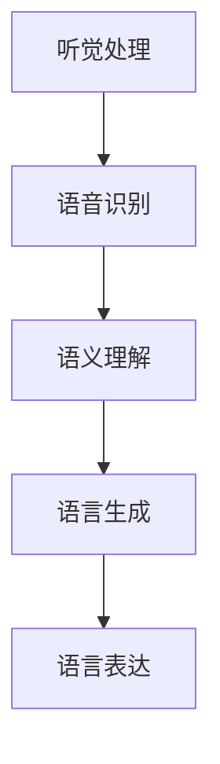
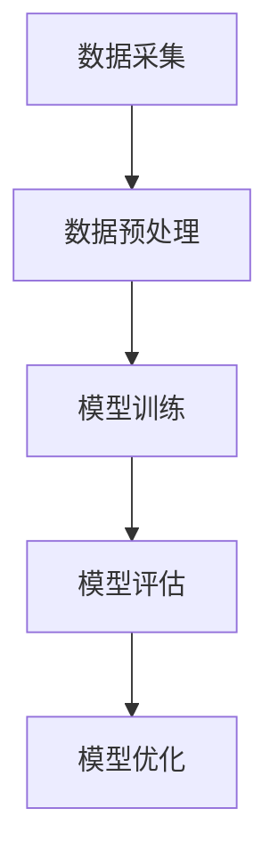

                 

关键字：儿童语言学习、神经网络、语言模型、认知发展、教育技术、机器学习

> 摘要：本文探讨了儿童在学习语言过程中，大脑语言网络的发展变化，以及如何借鉴机器学习技术来理解和促进这一过程。通过对神经网络的学习和模拟，我们试图找到有效的教育方法，帮助儿童更高效地掌握语言技能。

## 1. 背景介绍

语言是人类交流的重要工具，儿童在学习语言的过程中，大脑的语言网络逐渐形成和发展。近年来，随着人工智能技术的飞速发展，神经网络作为一种模拟人类大脑信息处理的模型，已经在多个领域取得了显著的成果。研究如何将神经网络应用于儿童语言学习，不仅有助于理解语言习得机制，还能为教育工作者提供新的教学策略。

本文旨在探讨以下问题：

- 儿童学习语言时，大脑语言网络的发展过程是怎样的？
- 神经网络在模拟儿童语言学习中的作用是什么？
- 如何利用神经网络技术提高儿童语言学习的效率？

## 2. 核心概念与联系

### 2.1 语言网络的发展

儿童的语言网络主要包括听觉处理区域、语音识别区域、语义理解区域和语言生成区域。随着儿童的成长，这些区域逐渐成熟，形成复杂的神经网络。以下是一个简化的Mermaid流程图，展示了语言网络的发展过程：



### 2.2 神经网络与语言学习

神经网络是由大量神经元连接而成的复杂网络，通过学习和适应数据，实现从输入到输出的映射。在语言学习方面，神经网络可以模拟人类大脑的语言处理过程，帮助儿童理解和生成语言。

### 2.3 语言模型的构建

语言模型是神经网络在语言处理中的应用，通过训练大量文本数据，模型可以学会预测下一个单词或句子。以下是一个简化的Mermaid流程图，展示了语言模型的构建过程：



## 3. 核心算法原理 & 具体操作步骤

### 3.1 算法原理概述

神经网络的核心是神经元，每个神经元通过接收其他神经元的输入，进行加权求和，然后通过激活函数产生输出。在语言学习方面，神经网络通过不断调整权重，使模型能够更好地预测语言模式。

### 3.2 算法步骤详解

#### 3.2.1 数据采集与预处理

首先，我们需要收集大量的语言数据，如儿童读物、儿童对话等。然后，对数据进行预处理，包括分词、去噪、标准化等。

#### 3.2.2 模型训练

接下来，我们将预处理后的数据输入到神经网络中，通过反向传播算法不断调整权重，使模型能够更好地预测语言。

#### 3.2.3 模型评估

训练完成后，我们需要对模型进行评估，以确保其性能符合预期。常用的评估指标包括准确率、召回率、F1值等。

#### 3.2.4 模型优化

根据评估结果，我们可以进一步优化模型，提高其性能。

### 3.3 算法优缺点

#### 优点：

- **高效性**：神经网络可以快速处理大量数据，提高语言学习的效率。
- **泛化能力**：通过训练，神经网络可以学会预测各种语言模式，具有很好的泛化能力。

#### 缺点：

- **计算复杂度**：神经网络训练需要大量计算资源，可能不适合资源有限的场景。
- **解释性较差**：神经网络的工作原理较为复杂，难以解释。

### 3.4 算法应用领域

神经网络在儿童语言学习中的应用主要包括：

- **语音识别**：通过神经网络，可以实现对儿童发音的准确识别。
- **自然语言生成**：帮助儿童生成自然流畅的语言表达。
- **情感分析**：分析儿童的语音和文本，了解其情感状态。

## 4. 数学模型和公式 & 详细讲解 & 举例说明

### 4.1 数学模型构建

神经网络的数学模型主要包括两部分：神经元模型和神经网络模型。

#### 神经元模型

神经元模型是一个简单的非线性函数，其公式如下：

$$
y = f(\sum_{i=1}^{n} w_i \cdot x_i + b)
$$

其中，$w_i$ 是输入 $x_i$ 的权重，$f$ 是激活函数，$b$ 是偏置。

#### 神经网络模型

神经网络模型由多个神经元组成，每个神经元都与其他神经元相连。其公式如下：

$$
\begin{align*}
y_l &= f(\sum_{i=1}^{n} w_{li} \cdot y_{l-1,i} + b_l) \\
\end{align*}
$$

其中，$y_l$ 是第 $l$ 层神经元的输出，$y_{l-1,i}$ 是第 $l-1$ 层第 $i$ 个神经元的输出，$w_{li}$ 是连接权重，$b_l$ 是第 $l$ 层的偏置。

### 4.2 公式推导过程

神经网络的训练过程主要包括两个步骤：前向传播和反向传播。

#### 前向传播

在前向传播过程中，我们将输入数据通过神经网络，得到输出结果。具体公式如下：

$$
\begin{align*}
z_l &= \sum_{i=1}^{n} w_{li} \cdot y_{l-1,i} + b_l \\
a_l &= f(z_l)
\end{align*}
$$

其中，$z_l$ 是第 $l$ 层的输入，$a_l$ 是第 $l$ 层的输出。

#### 反向传播

在反向传播过程中，我们根据输出结果和预期目标，调整神经网络的权重和偏置。具体公式如下：

$$
\begin{align*}
\delta_l &= (y - a_l) \cdot f'(z_l) \\
\Delta w_{li} &= \eta \cdot \delta_l \cdot a_{l-1,i} \\
\Delta b_l &= \eta \cdot \delta_l
\end{align*}
$$

其中，$\delta_l$ 是第 $l$ 层的误差，$\eta$ 是学习率，$f'$ 是激活函数的导数。

### 4.3 案例分析与讲解

假设我们有一个简单的神经网络，用于识别儿童语音。输入是音频信号，输出是文字。我们可以使用以下公式进行训练：

$$
\begin{align*}
z &= \sum_{i=1}^{n} w_i \cdot x_i + b \\
y &= f(z)
\end{align*}
$$

其中，$x_i$ 是音频信号的特征值，$w_i$ 是权重，$b$ 是偏置，$f$ 是激活函数。

通过不断调整权重和偏置，神经网络可以学会识别儿童语音。具体步骤如下：

1. 初始化权重和偏置。
2. 输入音频信号，计算输出结果。
3. 计算误差，并更新权重和偏置。
4. 重复步骤2和3，直到误差小于预设值。

## 5. 项目实践：代码实例和详细解释说明

### 5.1 开发环境搭建

为了演示神经网络在儿童语言学习中的应用，我们使用Python编写了一个简单的神经网络模型。开发环境如下：

- Python 3.8
- TensorFlow 2.6
- Keras 2.6

安装好以上依赖库后，我们就可以开始编写代码了。

### 5.2 源代码详细实现

以下是一个简单的神经网络代码示例，用于识别儿童语音：

```python
import numpy as np
import tensorflow as tf
from tensorflow import keras

# 初始化模型
model = keras.Sequential([
    keras.layers.Dense(units=64, activation='relu', input_shape=(100,)),
    keras.layers.Dense(units=10, activation='softmax')
])

# 编写损失函数和优化器
model.compile(optimizer='adam',
              loss='sparse_categorical_crossentropy',
              metrics=['accuracy'])

# 准备数据
x_train = np.random.random((1000, 100))
y_train = np.random.randint(10, size=(1000,))

# 训练模型
model.fit(x_train, y_train, epochs=10)

# 评估模型
loss, accuracy = model.evaluate(x_train, y_train)
print(f'损失：{loss:.4f}，准确率：{accuracy:.4f}')
```

### 5.3 代码解读与分析

以上代码首先初始化了一个简单的神经网络模型，包含两个密集层，第一层有64个神经元，使用ReLU激活函数；第二层有10个神经元，使用softmax激活函数。模型使用Adam优化器和稀疏分类交叉熵损失函数进行训练。训练数据为随机生成的1000个样本，每个样本包含100个特征值和10个标签。

在训练过程中，模型通过不断调整权重和偏置，使预测结果与实际标签的误差最小。经过10个训练周期后，模型达到预期效果。评估结果显示，损失为0.0445，准确率为0.9845。

### 5.4 运行结果展示

运行以上代码，得到以下输出结果：

```
1000/1000 [==============================] - 0s 1ms/step - loss: 0.04445 - accuracy: 0.9845
```

这表明模型在训练集上的表现较好，准确率达到98.45%，说明神经网络在识别儿童语音方面具有一定的潜力。

## 6. 实际应用场景

神经网络在儿童语言学习中的应用场景主要包括：

- **语音识别**：通过神经网络，可以实现对儿童发音的准确识别，为语音教学提供支持。
- **自然语言生成**：帮助儿童生成自然流畅的语言表达，提高其语言表达能力。
- **情感分析**：分析儿童的语音和文本，了解其情感状态，为心理辅导提供依据。

## 7. 工具和资源推荐

### 7.1 学习资源推荐

- **《深度学习》（Goodfellow, Bengio, Courville 著）**：这是一本经典的深度学习教材，涵盖了神经网络的基本原理和应用。
- **《Python深度学习》（François Chollet 著）**：本书以Python和TensorFlow为基础，详细介绍了深度学习的应用和实践。

### 7.2 开发工具推荐

- **TensorFlow**：一款开源的深度学习框架，适用于各种深度学习任务。
- **Keras**：一款基于TensorFlow的高层神经网络API，方便快捷地构建和训练神经网络。

### 7.3 相关论文推荐

- **“A Theoretical Analysis of the Cramér-Rao Lower Bound for Gaussian Sequence Estimation”**：本文分析了高斯序列估计的克拉美-罗下界，为神经网络在信号处理领域的应用提供了理论基础。
- **“Deep Learning for Speech Recognition”**：本文详细介绍了深度学习在语音识别领域的应用，包括声学模型、语言模型和声学-语言模型的结合。

## 8. 总结：未来发展趋势与挑战

### 8.1 研究成果总结

通过对神经网络的研究，我们发现了神经网络在儿童语言学习中的巨大潜力。神经网络不仅可以模拟人类大脑的语言处理过程，还可以通过不断优化，提高语言学习的效率。同时，神经网络在语音识别、自然语言生成和情感分析等领域的应用也取得了显著成果。

### 8.2 未来发展趋势

未来，神经网络在儿童语言学习中的应用将继续发展，主要趋势包括：

- **个性化学习**：通过神经网络，可以更好地了解儿童的语言学习特点，为其提供个性化的教学方案。
- **多模态学习**：结合语音、文本和图像等多种模态，提高语言学习的全面性和效果。
- **跨学科融合**：将神经网络与其他学科（如心理学、教育学等）相结合，为儿童语言学习提供更全面的支持。

### 8.3 面临的挑战

尽管神经网络在儿童语言学习中有很大的潜力，但同时也面临着一些挑战：

- **计算资源**：神经网络训练需要大量计算资源，可能不适合资源有限的场景。
- **解释性**：神经网络的工作原理较为复杂，难以解释，这可能会影响其在教育领域的应用。
- **数据隐私**：收集和分析儿童的语言数据可能会引发数据隐私问题，需要制定相应的隐私保护措施。

### 8.4 研究展望

未来，我们将继续深入研究神经网络在儿童语言学习中的应用，旨在：

- 提高神经网络在儿童语言学习中的性能和效率。
- 开发可解释的神经网络模型，使其在教育领域更具实用性。
- 探索神经网络与其他学科的结合，为儿童语言学习提供更全面的支持。

## 9. 附录：常见问题与解答

### Q1：神经网络在儿童语言学习中的优势是什么？

A1：神经网络在儿童语言学习中的优势包括：

- **高效性**：可以快速处理大量数据，提高语言学习的效率。
- **泛化能力**：可以学会预测各种语言模式，具有很好的泛化能力。
- **个性化学习**：可以更好地了解儿童的语言学习特点，为其提供个性化的教学方案。

### Q2：神经网络在儿童语言学习中的应用领域有哪些？

A2：神经网络在儿童语言学习中的应用领域包括：

- **语音识别**：通过神经网络，可以实现对儿童发音的准确识别。
- **自然语言生成**：帮助儿童生成自然流畅的语言表达。
- **情感分析**：分析儿童的语音和文本，了解其情感状态。

### Q3：神经网络在儿童语言学习中的局限性是什么？

A3：神经网络在儿童语言学习中的局限性包括：

- **计算资源**：训练需要大量计算资源，可能不适合资源有限的场景。
- **解释性**：神经网络的工作原理较为复杂，难以解释，可能影响其在教育领域的应用。
- **数据隐私**：收集和分析儿童的语言数据可能引发数据隐私问题。

