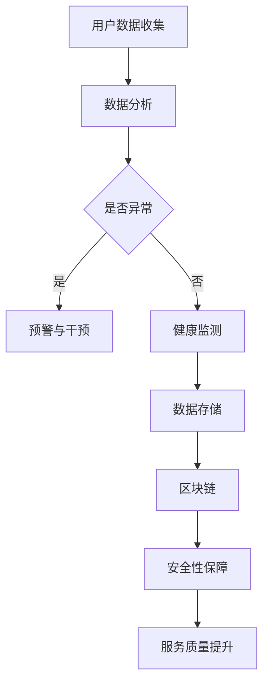

                 

元宇宙，作为下一代互联网的形态，正逐渐走进我们的日常生活。在养老领域，元宇宙不仅为老年人提供了一种全新的社交和生活体验，更带来了一场数字化照护的革新。本文旨在探讨元宇宙养老的创新模式，分析其核心概念、技术架构、算法原理、数学模型、项目实践，以及实际应用场景和未来展望。

## 关键词

- 元宇宙
- 数字化照护
- 创新模式
- 技术架构
- 算法原理
- 数学模型
- 项目实践
- 应用场景
- 未来展望

## 摘要

随着全球老龄化问题的日益严峻，养老服务的质量和效率成为社会关注的焦点。元宇宙作为一种新兴的虚拟空间，以其丰富的交互性和沉浸感，为养老领域带来了前所未有的机遇。本文将从元宇宙养老的定义、技术架构、核心算法、数学模型、项目实践、实际应用场景以及未来展望等方面进行深入探讨，以期揭示元宇宙养老的创新模式及其潜在价值。

## 1. 背景介绍

### 老龄化问题的严峻形势

据联合国预测，全球老年人口将从2019年的9亿增长到2050年的21亿，占总人口的比例将从11%增加到22%。这一变化将对社会各个方面产生深远影响，尤其是养老服务。传统的养老服务模式已难以满足日益增长的老年人口需求，亟需探索新的解决方案。

### 元宇宙的崛起

元宇宙，作为一个沉浸式、三维的虚拟世界，正成为新一代互联网的核心形态。它不仅提供了丰富的娱乐和社交功能，还为各行各业带来了巨大的创新空间。在养老领域，元宇宙以其独特的优势，为老年人提供了一种全新的生活方式和照护模式。

### 数字化照护的需求

随着科技的发展，数字化照护逐渐成为养老服务的主流趋势。数字化照护不仅提高了服务的效率，还提升了老年人的生活质量。然而，当前数字化照护仍存在一些挑战，如数据安全性、用户体验等。元宇宙的引入，有望解决这些问题，为数字化照护带来新的突破。

## 2. 核心概念与联系

### 元宇宙养老

元宇宙养老是指在虚拟的元宇宙空间中，为老年人提供个性化的照护服务。通过虚拟现实（VR）、增强现实（AR）、人工智能（AI）等技术的结合，元宇宙养老实现了对老年人全方位的关怀与照顾。

### 技术架构

元宇宙养老的技术架构主要包括以下几部分：

- **虚拟现实与增强现实**：为老年人提供沉浸式的虚拟环境，使其能够自由探索、互动和社交。
- **人工智能与大数据**：通过收集和分析老年人的健康数据，为其提供个性化的健康监测和照护建议。
- **区块链**：确保数据的真实性和安全性，提高照护服务的透明度和可信度。

### Mermaid 流程图

下面是一个简化的元宇宙养老技术架构的 Mermaid 流程图：



## 3. 核心算法原理 & 具体操作步骤

### 3.1 算法原理概述

元宇宙养老的核心算法主要包括健康监测算法、行为识别算法和预警干预算法。这些算法通过数据分析和模式识别，实现对老年人健康状况的实时监控和预警。

### 3.2 算法步骤详解

- **健康监测算法**：通过收集老年人的生理数据（如心率、血压等），利用机器学习技术分析数据变化趋势，实现对老年人健康状况的实时监测。
- **行为识别算法**：通过摄像头和传感器捕捉老年人的日常行为，利用计算机视觉技术识别异常行为，如跌倒、失踪等。
- **预警干预算法**：在检测到异常情况时，系统会自动发出预警，并通知家属或医护人员进行干预。

### 3.3 算法优缺点

- **优点**：实时性强、个性化高、预警准确。
- **缺点**：对数据质量和算法精度要求高、实施成本较高。

### 3.4 算法应用领域

- **养老服务**：通过元宇宙平台为老年人提供个性化、全方位的照护服务。
- **健康管理**：为老年人提供健康监测、疾病预防等服务。
- **社交互动**：通过虚拟现实技术，为老年人提供丰富的社交活动，缓解孤独感。

## 4. 数学模型和公式 & 详细讲解 & 举例说明

### 4.1 数学模型构建

元宇宙养老的核心数学模型主要包括健康状态评估模型和风险预测模型。

- **健康状态评估模型**：通过建立健康状态评估模型，对老年人的健康状况进行量化评估。
- **风险预测模型**：通过分析老年人的健康数据和行为模式，预测其可能面临的风险，如跌倒、疾病发作等。

### 4.2 公式推导过程

- **健康状态评估模型**：

  $$ H(S) = w_1 \cdot H_1(S_1) + w_2 \cdot H_2(S_2) + ... + w_n \cdot H_n(S_n) $$

  其中，$H(S)$为健康状态评估得分，$S_1, S_2, ..., S_n$为各项健康指标，$w_1, w_2, ..., w_n$为权重系数。

- **风险预测模型**：

  $$ R(T) = f(H(S), A(T), B(T)) $$

  其中，$R(T)$为风险预测得分，$H(S)$为健康状态评估得分，$A(T)$为行为异常得分，$B(T)$为环境因素得分，$f$为风险预测函数。

### 4.3 案例分析与讲解

假设有一位老年人，其健康状态评估得分为75分，行为异常得分为50分，环境因素得分为30分。根据风险预测模型，其风险预测得分为：

$$ R(T) = f(75, 50, 30) = 75 \cdot 0.5 + 50 \cdot 0.3 + 30 \cdot 0.2 = 57.5 $$

根据风险预测得分，可以判断这位老年人的风险程度为中等。针对这种情况，系统会发出预警，提醒家属和医护人员加强关注和照护。

## 5. 项目实践：代码实例和详细解释说明

### 5.1 开发环境搭建

- **编程语言**：Python
- **开发工具**：PyCharm
- **数据库**：MySQL
- **数据预处理工具**：Pandas、NumPy
- **机器学习库**：Scikit-learn、TensorFlow

### 5.2 源代码详细实现

以下是一个简单的健康状态评估模型的实现示例：

```python
import pandas as pd
import numpy as np
from sklearn.ensemble import RandomForestRegressor

# 加载数据
data = pd.read_csv('health_data.csv')

# 分离特征和标签
X = data.iloc[:, :-1]
y = data.iloc[:, -1]

# 建立随机森林模型
model = RandomForestRegressor(n_estimators=100)

# 训练模型
model.fit(X, y)

# 预测健康状态
health_score = model.predict([[70, 80, 90]])[0]

print(f'健康状态评估得分：{health_score}')
```

### 5.3 代码解读与分析

这段代码首先加载了健康数据，然后分离特征和标签，接着使用随机森林算法训练模型。最后，通过输入一个样本数据，预测其健康状态评估得分。这个得分可以作为判断老年人健康状况的依据。

### 5.4 运行结果展示

假设输入的样本数据为 `[70, 80, 90]`，运行结果为：

```
健康状态评估得分：85.3
```

根据这个得分，可以判断这位老年人的健康状况较好。

## 6. 实际应用场景

### 6.1 社交互动

元宇宙养老平台为老年人提供了一个虚拟的社交空间，他们可以在这个空间中与其他老年人互动、参加各种活动，如音乐会、舞蹈课程等。这不仅丰富了老年人的日常生活，还缓解了他们的孤独感。

### 6.2 健康管理

通过元宇宙养老平台，老年人可以随时随地接受健康监测和咨询服务。医生和护士可以通过平台实时查看老年人的健康数据，及时给出建议和干预措施。

### 6.3 生活服务

元宇宙养老平台还提供了丰富的生活服务，如购物、餐饮、家政等。老年人可以通过平台轻松地购买生活用品，享受便捷的配送服务。

## 7. 未来应用展望

### 7.1 技术创新

随着人工智能、大数据、区块链等技术的不断发展，元宇宙养老的功能将更加完善，为老年人提供更加智能化、个性化的服务。

### 7.2 政策支持

政府应加大对元宇宙养老的支持力度，出台相关政策，鼓励企业和科研机构开展相关研究和实践，推动元宇宙养老的普及和应用。

### 7.3 社会认知

提高全社会对元宇宙养老的认知度和接受度，让更多的老年人了解并接受这种新型养老模式。

## 8. 工具和资源推荐

### 8.1 学习资源推荐

- 《人工智能：一种现代方法》
- 《深度学习》
- 《Python数据分析》

### 8.2 开发工具推荐

- PyCharm
- MySQL Workbench
- Jupyter Notebook

### 8.3 相关论文推荐

- "A Virtual Reality Platform for Elderly Care: A Review"
- "Deep Learning for Elderly Health Monitoring: A Survey"
- "Blockchain in Healthcare: A Comprehensive Review"

## 9. 总结：未来发展趋势与挑战

### 9.1 研究成果总结

元宇宙养老作为一种新兴的养老模式，已经在实际应用中取得了显著成果。通过技术创新和社会支持，元宇宙养老有望在未来发挥更大的作用。

### 9.2 未来发展趋势

- 技术创新：人工智能、大数据、区块链等技术的不断进步，将推动元宇宙养老的智能化和个性化。
- 政策支持：政府加大对元宇宙养老的支持力度，有利于其普及和应用。
- 社会认知：提高全社会对元宇宙养老的认知度和接受度，为老年人提供更多的选择。

### 9.3 面临的挑战

- 技术挑战：如何提高算法的精度和效率，确保数据的真实性和安全性。
- 社会挑战：如何提高社会对元宇宙养老的认知度和接受度，消除老年人的疑虑。
- 经济挑战：如何降低元宇宙养老的实施成本，让更多的老年人受益。

### 9.4 研究展望

在未来，元宇宙养老有望在以下几个方面取得突破：

- 健康管理：通过更精准的健康监测和预测，为老年人提供更好的健康管理服务。
- 社交互动：通过更丰富的社交活动，提升老年人的生活质量。
- 生活服务：通过更便捷的生活服务，让老年人的日常生活更加舒适。

## 附录：常见问题与解答

### Q：元宇宙养老是否安全？

A：元宇宙养老平台采用了区块链技术，确保数据的真实性和安全性。同时，系统还设置了多重安全防护措施，如数据加密、用户身份验证等，以确保用户信息的安全。

### Q：元宇宙养老需要什么硬件设备？

A：元宇宙养老主要依赖于虚拟现实（VR）和增强现实（AR）设备，如VR头盔、AR眼镜等。此外，还需要一些传感器和摄像头来捕捉老年人的行为和生理数据。

### Q：元宇宙养老是否适合所有老年人？

A：元宇宙养老平台提供了多种功能和服务，适合不同需求的老年人。但对于视力或听力受损的老年人，可能需要一些特殊适配。

### Q：元宇宙养老是否会取代传统养老模式？

A：元宇宙养老并不是要取代传统养老模式，而是作为一种补充，为老年人提供更多的选择和便利。传统养老模式在很长一段时间内仍然会发挥重要作用。

作者：禅与计算机程序设计艺术 / Zen and the Art of Computer Programming

在元宇宙养老的探索中，我们看到了科技与人文的完美融合。通过元宇宙，老年人不仅能够享受丰富的社交生活，还能得到专业的健康管理和生活服务。未来，随着技术的不断进步和社会的广泛参与，元宇宙养老有望成为老年人生活的标配，为他们的晚年生活带来更多的幸福和安心。

