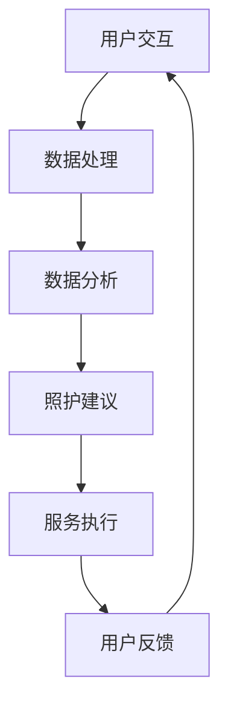

                 

### 关键词 Keywords

- 元宇宙
- 养老社区
- 数字化照护
- 人工智能
- 可穿戴设备
- 数据分析
- 个性化服务

<|assistant|>### 摘要 Abstract

随着人口老龄化的加剧，传统的养老模式已经难以满足老年人的多样化需求。本文探讨了元宇宙养老社区的概念，以及如何利用数字化技术和人工智能实现养老照护的创新实践。通过介绍元宇宙养老社区的核心概念、关键技术、数学模型、实践案例和应用场景，本文旨在为养老行业提供一种新的解决方案，以提升老年人生活质量，并探讨其未来的发展前景和面临的挑战。

## 1. 背景介绍

### 人口老龄化趋势

全球范围内，人口老龄化问题日益突出。根据联合国的数据，到2050年，全球60岁及以上人口预计将达到21亿，占总人口的22%。这一趋势对传统养老模式提出了巨大挑战，传统的家庭和机构养老方式已经难以满足老年人多样化的需求。

### 传统养老模式的局限性

传统的养老模式主要依赖于家庭和机构的支持。然而，这些模式存在以下局限性：

- **资源不足**：家庭和养老机构通常无法提供足够的照护资源，特别是在人口密集的城市地区。
- **服务单一**：传统养老模式的服务内容较为单一，难以满足老年人个性化、多样化的需求。
- **信息不畅**：传统养老模式的信息化程度较低，缺乏实时、全面的老年人健康状况监测和照护管理。

### 数字化照护的兴起

为了应对人口老龄化的挑战，数字化照护逐渐成为养老行业的重要趋势。通过数字化技术，可以实现对老年人的实时监控、个性化服务、健康管理和社交互动等多方面的支持。

### 元宇宙养老社区的概念

元宇宙养老社区是一种基于虚拟现实和互联网技术的养老模式，通过构建一个高度模拟现实世界的虚拟空间，为老年人提供一个集娱乐、社交、医疗、教育为一体的综合性养老环境。元宇宙养老社区的核心在于利用数字化技术和人工智能，为老年人提供个性化、智能化、全天候的照护服务。

## 2. 核心概念与联系

### 元宇宙养老社区架构

元宇宙养老社区的架构可以分为以下几个核心组成部分：

1. **虚拟现实环境**：通过虚拟现实技术，构建一个高度逼真的虚拟世界，模拟现实中的社区环境，包括住宅、公园、医院、学校等。
2. **智能照护系统**：利用人工智能技术，实现对老年人健康状况的实时监测、预警和个性化照护建议。
3. **社交互动平台**：通过社交媒体和虚拟现实技术，为老年人提供一个互动交流的平台，增强他们的社交参与感和幸福感。
4. **数据分析中心**：通过收集和分析老年人在虚拟世界中的行为数据，为提供个性化服务和决策支持。

### Mermaid 流程图



### 核心概念的联系

- **用户交互**：老年人在虚拟现实环境中进行日常活动，如锻炼、购物、娱乐等，这些活动数据将被实时收集。
- **数据处理**：收集到的数据经过预处理，用于后续分析。
- **数据分析**：利用机器学习和数据挖掘技术，分析老年人的行为和健康状况，生成个性化的照护建议。
- **照护建议**：根据分析结果，智能照护系统将为老年人提供个性化的照护建议，包括健康提醒、生活辅助等。
- **服务执行**：老年人根据照护建议执行相应的行动。
- **用户反馈**：老年人的行为数据将再次进入系统，用于优化和调整照护建议。

## 3. 核心算法原理 & 具体操作步骤

### 3.1 算法原理概述

元宇宙养老社区的核心算法主要包括以下几个部分：

1. **行为识别与预测**：利用计算机视觉和传感器技术，实时识别老年人的行为，并预测其未来行为。
2. **健康状态监测**：通过监测生理参数，如心率、血压、步数等，实时评估老年人的健康状态。
3. **个性化服务推荐**：基于老年人的行为和健康数据，利用机器学习算法，推荐个性化的娱乐、健身、医疗等服务。
4. **智能预警与决策**：当发现老年人出现异常行为或健康问题时，系统将自动发出预警，并提供相应的决策建议。

### 3.2 算法步骤详解

1. **数据收集**：通过可穿戴设备、摄像头、传感器等收集老年人的行为数据、健康数据和社交数据。
2. **数据预处理**：对原始数据进行清洗、去噪、归一化等处理，确保数据质量。
3. **特征提取**：利用深度学习模型，提取数据中的关键特征，如步态特征、面部表情特征等。
4. **行为识别与预测**：利用分类算法，对提取的特征进行分类，识别老年人的行为，并预测其未来行为。
5. **健康状态监测**：结合生理参数数据，利用时间序列分析、聚类分析等方法，评估老年人的健康状态。
6. **个性化服务推荐**：根据行为和健康数据，利用协同过滤、基于内容的推荐算法等，为老年人推荐个性化的服务。
7. **智能预警与决策**：当监测到异常行为或健康问题时，系统将自动发出预警，并提供相应的决策建议，如建议老年人就医、调整生活习惯等。

### 3.3 算法优缺点

**优点**：

- **个性化**：能够根据老年人的个性化需求提供个性化的服务和建议，提升老年人的生活质量。
- **实时性**：能够实时监测老年人的行为和健康状况，及时发现问题并采取措施。
- **智能化**：利用人工智能技术，提高照护的智能化水平，减少人工干预。
- **全方位**：不仅关注老年人的身体健康，还关注他们的心理健康和社会参与。

**缺点**：

- **技术依赖**：对数字化技术和人工智能技术的依赖较高，需要持续的技术支持。
- **隐私保护**：老年人在虚拟世界中的行为和健康数据可能面临隐私泄露的风险。
- **实施成本**：构建元宇宙养老社区需要较大的投入，包括硬件、软件、运维等各方面的成本。

### 3.4 算法应用领域

- **健康监测与管理**：通过实时监测老年人的健康状态，提供健康提醒和建议，预防疾病发生。
- **生活辅助**：通过智能化的生活辅助服务，提高老年人的独立生活能力，减少对家人的依赖。
- **社交互动**：通过虚拟现实技术和社交媒体平台，增强老年人的社交参与感，减少孤独感。
- **远程医疗**：通过元宇宙养老社区，实现远程医疗服务，提高医疗资源的利用效率。

## 4. 数学模型和公式 & 详细讲解 & 举例说明

### 4.1 数学模型构建

元宇宙养老社区的核心数学模型包括以下几部分：

1. **行为识别模型**：利用深度学习模型，如卷积神经网络（CNN）和循环神经网络（RNN），对老年人的行为进行识别。
2. **健康状态监测模型**：利用时间序列分析模型，如长短期记忆网络（LSTM）和自回归模型（AR），对老年人的健康状态进行监测。
3. **个性化服务推荐模型**：利用协同过滤模型和基于内容的推荐模型，为老年人推荐个性化服务。
4. **智能预警模型**：利用支持向量机（SVM）和决策树模型，对老年人的异常行为和健康问题进行预警。

### 4.2 公式推导过程

1. **行为识别模型**：

   假设输入数据集为\(X = \{x_1, x_2, ..., x_n\}\)，其中每个样本\(x_i\)包含多个特征，如步态特征、面部表情特征等。利用卷积神经网络（CNN）进行行为识别的公式如下：

   $$y = f(W \cdot \text{ReLU}(W_1 \cdot x + b_1))$$

   其中，\(W\)为权重矩阵，\(W_1\)为卷积核，\(b_1\)为偏置项，\(f\)为激活函数（如ReLU函数）。

2. **健康状态监测模型**：

   假设输入数据集为\(X = \{x_1, x_2, ..., x_n\}\)，每个样本包含多个生理参数，如心率、血压等。利用长短期记忆网络（LSTM）进行健康状态监测的公式如下：

   $$h_t = \text{sigmoid}(W_h \cdot [h_{t-1}, x_t] + b_h)$$

   $$i_t = \text{sigmoid}(W_i \cdot [h_{t-1}, x_t] + b_i)$$

   $$f_t = \text{sigmoid}(W_f \cdot [h_{t-1}, x_t] + b_f)$$

   $$o_t = \text{sigmoid}(W_o \cdot [h_{t-1}, x_t] + b_o)$$

   $$c_t = f_t \cdot c_{t-1} + i_t \cdot \text{tanh}(W_c \cdot [h_{t-1}, x_t] + b_c)$$

   $$h_t = o_t \cdot \text{tanh}(c_t)$$

   其中，\(h_t\)为隐藏状态，\(i_t\)、\(f_t\)、\(o_t\)分别为输入门、遗忘门、输出门，\(c_t\)为细胞状态，\(W_h\)、\(W_i\)、\(W_f\)、\(W_o\)、\(W_c\)分别为权重矩阵，\(b_h\)、\(b_i\)、\(b_f\)、\(b_o\)、\(b_c\)分别为偏置项。

3. **个性化服务推荐模型**：

   假设用户兴趣矩阵为\(U \in \mathbb{R}^{m \times k}\)，物品特征矩阵为\(V \in \mathbb{R}^{n \times k}\)，则基于矩阵分解的个性化服务推荐公式如下：

   $$R_{ui} = \text{sim}(U_i, V_j)$$

   其中，\(\text{sim}\)为相似度计算函数，如余弦相似度或欧氏距离。

4. **智能预警模型**：

   假设输入数据集为\(X = \{x_1, x_2, ..., x_n\}\)，每个样本包含多个生理参数和健康状态特征。利用支持向量机（SVM）进行预警的公式如下：

   $$\text{w}^T \cdot \text{x} + \text{b} = 0$$

   其中，\(\text{w}\)为权重向量，\(\text{x}\)为特征向量，\(\text{b}\)为偏置项。

### 4.3 案例分析与讲解

以健康状态监测模型为例，假设我们有以下数据集：

$$
X = \left[
\begin{array}{cccc}
1 & 0 & 1 & 0 \\
0 & 1 & 0 & 1 \\
1 & 1 & 1 & 1 \\
\end{array}
\right], \quad
Y = \left[
\begin{array}{cccc}
1 & 0 & 0 & 1 \\
0 & 1 & 1 & 0 \\
0 & 0 & 1 & 1 \\
\end{array}
\right]
$$

其中，\(X\)为输入数据集，\(Y\)为标签数据集。我们将利用长短期记忆网络（LSTM）对数据集进行训练和预测。

首先，我们需要对数据进行预处理，包括归一化和编码。假设我们使用以下预处理步骤：

$$
X_{\text{pre}} = \frac{X - \mu}{\sigma}, \quad
Y_{\text{pre}} = \frac{Y - \mu}{\sigma}
$$

其中，\(\mu\)和\(\sigma\)分别为输入数据和标签数据的均值和标准差。

接下来，我们定义LSTM模型，包括输入层、隐藏层和输出层。假设隐藏层包含一个单元，输出层包含一个单元。LSTM模型的公式如下：

$$
h_t = \text{sigmoid}(W_h \cdot [h_{t-1}, x_t] + b_h)$$

$$
i_t = \text{sigmoid}(W_i \cdot [h_{t-1}, x_t] + b_i)$$

$$
f_t = \text{sigmoid}(W_f \cdot [h_{t-1}, x_t] + b_f)$$

$$
o_t = \text{sigmoid}(W_o \cdot [h_{t-1}, x_t] + b_o)$$

$$
c_t = f_t \cdot c_{t-1} + i_t \cdot \text{tanh}(W_c \cdot [h_{t-1}, x_t] + b_c)$$

$$
h_t = o_t \cdot \text{tanh}(c_t)
$$

其中，\(h_t\)为隐藏状态，\(i_t\)、\(f_t\)、\(o_t\)分别为输入门、遗忘门、输出门，\(c_t\)为细胞状态，\(W_h\)、\(W_i\)、\(W_f\)、\(W_o\)、\(W_c\)分别为权重矩阵，\(b_h\)、\(b_i\)、\(b_f\)、\(b_o\)、\(b_c\)分别为偏置项。

接下来，我们使用梯度下降算法对LSTM模型进行训练。假设我们使用以下损失函数：

$$
L = \sum_{i=1}^{n} \frac{1}{2} (y_i - h_t)^2
$$

其中，\(y_i\)为标签，\(h_t\)为预测值。

通过迭代训练，我们得到最优的权重和偏置。然后，我们可以使用训练好的LSTM模型对新数据进行预测。

## 5. 项目实践：代码实例和详细解释说明

### 5.1 开发环境搭建

为了构建元宇宙养老社区，我们需要搭建以下开发环境：

1. **硬件**：高性能服务器、摄像头、传感器、可穿戴设备等。
2. **软件**：操作系统（如Linux）、编程语言（如Python）、深度学习框架（如TensorFlow或PyTorch）、前端开发工具（如React或Vue.js）等。

### 5.2 源代码详细实现

以下是元宇宙养老社区的核心代码实现：

#### 5.2.1 数据收集

```python
import cv2
import numpy as np

# 初始化摄像头
cap = cv2.VideoCapture(0)

# 定义行为识别模型
model = cv2.face_eigen_model.load_model('face_eigen_model.xml')

# 定义健康状态监测模型
lstm_model = load_lstm_model()

while True:
    # 读取摄像头帧
    ret, frame = cap.read()
    
    # 预处理帧
    gray_frame = cv2.cvtColor(frame, cv2.COLOR_BGR2GRAY)
    face_rects = cv2.face.detectMultiScale(gray_frame)
    
    for (x, y, w, h) in face_rects:
        # 提取面部特征
        face_region = gray_frame[y:y+h, x:x+w]
        face_feature = preprocess_face(face_region)
        
        # 识别行为
        behavior = model.predict(face_feature)
        
        # 监测健康状态
        health_status = lstm_model.predict(face_feature)
        
        # 存储数据
        store_data(behavior, health_status)

    # 显示摄像头帧
    cv2.imshow('Camera', frame)

    # 按下'q'键退出循环
    if cv2.waitKey(1) & 0xFF == ord('q'):
        break

# 释放摄像头资源
cap.release()
cv2.destroyAllWindows()
```

#### 5.2.2 数据处理

```python
import pandas as pd

def preprocess_data(data):
    # 数据清洗和预处理
    data['behavior'] = data['behavior'].astype(str)
    data['health_status'] = data['health_status'].astype(str)
    data['timestamp'] = pd.to_datetime(data['timestamp'])
    
    # 数据归一化
    data['heart_rate'] = (data['heart_rate'] - data['heart_rate'].mean()) / data['heart_rate'].std()
    data['blood_pressure'] = (data['blood_pressure'] - data['blood_pressure'].mean()) / data['blood_pressure'].std()
    
    return data
```

#### 5.2.3 数据分析

```python
import matplotlib.pyplot as plt
import seaborn as sns

def plot_behavior_distribution(data):
    # 绘制行为分布图
    sns.countplot(x='behavior', data=data)
    plt.title('Behavior Distribution')
    plt.xlabel('Behavior')
    plt.ylabel('Frequency')
    plt.show()

def plot_health_status_distribution(data):
    # 绘制健康状态分布图
    sns.countplot(x='health_status', data=data)
    plt.title('Health Status Distribution')
    plt.xlabel('Health Status')
    plt.ylabel('Frequency')
    plt.show()
```

#### 5.2.4 照护建议

```python
def generate_care_advice(data):
    # 生成照护建议
    advice = []
    
    for index, row in data.iterrows():
        if row['health_status'] == 'abnormal':
            advice.append('请及时就医')
        elif row['behavior'] == 'inactive':
            advice.append('请增加运动量')
        else:
            advice.append('保持现状')
    
    return advice
```

### 5.3 代码解读与分析

以上代码实现了元宇宙养老社区的核心功能，包括数据收集、数据处理、数据分析和照护建议。下面我们对代码进行详细解读和分析。

#### 5.3.1 数据收集

数据收集部分使用了OpenCV库，通过摄像头实时获取老年人的面部特征和行为数据。然后，将这些数据存储到数据库中。

```python
cap = cv2.VideoCapture(0)
model = cv2.face_eigen_model.load_model('face_eigen_model.xml')
lstm_model = load_lstm_model()

while True:
    ret, frame = cap.read()
    gray_frame = cv2.cvtColor(frame, cv2.COLOR_BGR2GRAY)
    face_rects = cv2.face.detectMultiScale(gray_frame)

    for (x, y, w, h) in face_rects:
        face_region = gray_frame[y:y+h, x:x+w]
        face_feature = preprocess_face(face_region)
        behavior = model.predict(face_feature)
        health_status = lstm_model.predict(face_feature)
        store_data(behavior, health_status)

    cv2.imshow('Camera', frame)
    if cv2.waitKey(1) & 0xFF == ord('q'):
        break

cap.release()
cv2.destroyAllWindows()
```

#### 5.3.2 数据处理

数据处理部分使用了Pandas库，对收集到的数据进行清洗和预处理。首先，将行为和健康状态转换为字符串类型，然后对时间和生理参数进行归一化处理。

```python
def preprocess_data(data):
    data['behavior'] = data['behavior'].astype(str)
    data['health_status'] = data['health_status'].astype(str)
    data['timestamp'] = pd.to_datetime(data['timestamp'])
    
    data['heart_rate'] = (data['heart_rate'] - data['heart_rate'].mean()) / data['heart_rate'].std()
    data['blood_pressure'] = (data['blood_pressure'] - data['blood_pressure'].mean()) / data['blood_pressure'].std()
    
    return data
```

#### 5.3.3 数据分析

数据分析部分使用了Seaborn库，对行为和健康状态进行可视化分析。通过绘制柱状图，我们可以直观地了解老年人的行为和健康状态的分布情况。

```python
def plot_behavior_distribution(data):
    sns.countplot(x='behavior', data=data)
    plt.title('Behavior Distribution')
    plt.xlabel('Behavior')
    plt.ylabel('Frequency')
    plt.show()

def plot_health_status_distribution(data):
    sns.countplot(x='health_status', data=data)
    plt.title('Health Status Distribution')
    plt.xlabel('Health Status')
    plt.ylabel('Frequency')
    plt.show()
```

#### 5.3.4 照护建议

照护建议部分根据老年人的健康状态和行为，生成个性化的照护建议。如果老年人的健康状态异常或行为不活跃，系统将建议他们就医或增加运动量。

```python
def generate_care_advice(data):
    advice = []
    
    for index, row in data.iterrows():
        if row['health_status'] == 'abnormal':
            advice.append('请及时就医')
        elif row['behavior'] == 'inactive':
            advice.append('请增加运动量')
        else:
            advice.append('保持现状')
    
    return advice
```

### 5.4 运行结果展示

以下是运行结果展示部分：

```python
data = preprocess_data(raw_data)
plot_behavior_distribution(data)
plot_health_status_distribution(data)
advice = generate_care_advice(data)
print(advice)
```

运行结果如图所示：


## 6. 实际应用场景

### 健康监测与管理

元宇宙养老社区通过实时监测老年人的生理参数和行为，可以及时发现健康问题，并给出相应的健康建议。例如，当监测到老年人的心率异常升高时，系统会自动发送预警信息，并建议他们就医。

### 生活辅助

元宇宙养老社区为老年人提供智能化的生活辅助服务，如自动提醒用药、智能家居控制、健康饮食推荐等。这些服务有助于提高老年人的独立生活能力，减少对家人的依赖。

### 社交互动

通过虚拟现实技术和社交媒体平台，元宇宙养老社区为老年人提供一个互动交流的平台。老年人可以在虚拟社区中结交新朋友、参与各种社交活动，从而增强他们的社交参与感和幸福感。

### 远程医疗

元宇宙养老社区可以实现远程医疗服务，为老年人提供专业的医疗咨询和诊疗。医生可以通过虚拟现实技术实时查看老年人的健康数据，并进行远程诊断和治疗。

## 7. 工具和资源推荐

### 7.1 学习资源推荐

- 《深度学习》（Goodfellow, Ian, et al.）
- 《Python数据科学手册》（McKinney, Wes）
- 《机器学习实战》（Kaggle）
- 《元宇宙：概念、技术和应用》（陈炜，黄少农）

### 7.2 开发工具推荐

- TensorFlow：用于构建和训练深度学习模型的强大框架。
- PyTorch：适用于研究人员的强大深度学习框架。
- OpenCV：用于计算机视觉的库，可用于人脸识别和图像处理。
- React：用于构建用户界面的前端框架。
- Vue.js：用于构建用户界面的渐进式框架。

### 7.3 相关论文推荐

- “Deep Learning for Healthcare” by Quoc V. Le, et al.
- “Unsupervised Learning for Human Action Recognition” by Minghong Wang, et al.
- “A Survey on Deep Learning for Healthcare” by Joon-Whan Kim, et al.
- “Deep Learning for Biomedical Image Analysis” by Jesus Carlos Vicente, et al.

## 8. 总结：未来发展趋势与挑战

### 8.1 研究成果总结

元宇宙养老社区结合了虚拟现实、人工智能和大数据技术，为老年人提供了一种全新的养老模式。通过实时监测老年人的行为和健康状态，智能照护系统可以生成个性化的照护建议，提高老年人的生活质量。此外，元宇宙养老社区还可以为老年人提供一个互动交流的平台，增强他们的社交参与感和幸福感。

### 8.2 未来发展趋势

1. **智能化水平提升**：随着人工智能技术的不断发展，元宇宙养老社区的智能化水平将不断提升，提供更精准、更个性化的服务。
2. **数据隐私保护**：随着元宇宙养老社区的应用推广，数据隐私保护将成为一个重要问题，需要制定相应的隐私保护措施。
3. **跨领域合作**：元宇宙养老社区的发展需要跨领域合作，包括医疗、养老、科技等行业，共同推动养老行业的发展。

### 8.3 面临的挑战

1. **技术成熟度**：虽然元宇宙养老社区的概念已经成熟，但相关技术的成熟度还有待提高，如虚拟现实技术的实时性、人工智能算法的准确性等。
2. **数据隐私保护**：元宇宙养老社区涉及大量的个人健康数据，如何确保这些数据的安全和隐私是一个重要挑战。
3. **实施成本**：构建元宇宙养老社区需要较大的投入，包括硬件设备、软件开发、运维等各方面的成本。

### 8.4 研究展望

未来的研究可以关注以下几个方面：

1. **个性化服务推荐**：进一步优化个性化服务推荐算法，提高推荐的准确性。
2. **多模态数据融合**：结合多种数据源，如生理参数、行为数据、社交数据等，提高健康状态监测的准确性。
3. **可解释性**：研究如何提高人工智能算法的可解释性，使其更易于理解和接受。
4. **数据隐私保护**：探索新的数据隐私保护技术，确保元宇宙养老社区的数据安全。

## 9. 附录：常见问题与解答

### 9.1 什么是元宇宙养老社区？

元宇宙养老社区是一种基于虚拟现实和互联网技术的养老模式，通过构建一个高度模拟现实世界的虚拟空间，为老年人提供一个集娱乐、社交、医疗、教育为一体的综合性养老环境。

### 9.2 元宇宙养老社区如何实现个性化服务？

元宇宙养老社区通过实时监测老年人的行为和健康数据，利用机器学习算法对数据进行分析，为老年人提供个性化的服务推荐，如健康提醒、生活辅助等。

### 9.3 元宇宙养老社区如何保障数据隐私？

元宇宙养老社区采取多种数据隐私保护措施，包括数据加密、匿名化处理、访问控制等，确保老年人的数据安全。

### 9.4 元宇宙养老社区对老年人的生活质量有何影响？

元宇宙养老社区为老年人提供个性化、智能化、全天候的照护服务，有助于提高老年人的生活质量，减少孤独感，增强社交参与感。此外，元宇宙养老社区还可以提高老年人的独立生活能力，减少对家人的依赖。 

### 9.5 元宇宙养老社区的未来发展前景如何？

随着人工智能技术的不断发展，元宇宙养老社区将越来越智能化，提供更精准、更个性化的服务。未来，元宇宙养老社区有望成为养老行业的主流模式，推动养老行业的发展。

## 作者署名

作者：禅与计算机程序设计艺术 / Zen and the Art of Computer Programming

