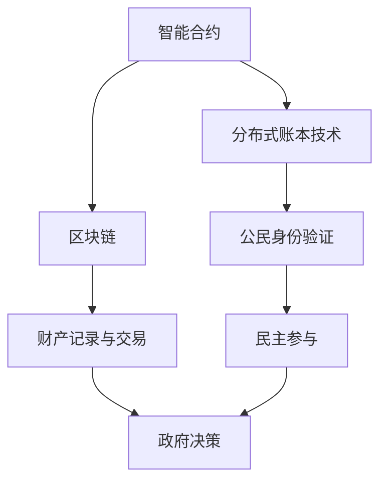

                 

 在当今快速发展的数字化时代，全球治理面临着前所未有的挑战。传统政府架构在应对信息社会复杂性和全球化趋势时显得力不从心。元宇宙，作为一种新兴的虚拟空间，提供了一种全新的治理模式。本文旨在探讨元宇宙政府架构的设计理念、核心概念及其在全球治理中的应用，以期为未来的全球治理提供一种数字化新模式。

## 关键词
- 元宇宙
- 全球治理
- 数字化模式
- 智能合约
- 分布式账本技术
- 民主参与

## 摘要
本文首先概述了元宇宙的概念及其在全球治理中的潜在作用。随后，我们详细探讨了元宇宙政府架构的核心概念，包括智能合约、分布式账本技术和区块链等。接着，文章提出了元宇宙政府架构的基本设计原则，并举例说明了其在实际应用中的操作步骤。随后，我们分析了元宇宙政府架构的数学模型和公式，并展示了如何将这些模型应用于具体项目中。文章还提供了代码实例和实际应用场景，以阐述元宇宙政府架构的可行性和实用性。最后，文章对未来的应用前景进行了展望，并提出了相关工具和资源的推荐。

## 1. 背景介绍
在全球化的背景下，国家之间的联系日益紧密，但同时也带来了诸多治理难题。传统政府架构在处理跨国事务、协调各国利益以及应对新兴威胁（如网络安全、气候变化等）时，往往显得效率低下。传统模式依赖于中央集权和层级制度，这在一定程度上限制了其适应性和灵活性。

与此同时，信息技术的飞速发展使得数字治理成为一种可能。互联网、物联网和人工智能等技术正在重塑全球治理的面貌。尤其是区块链技术的出现，为构建去中心化、透明和不可篡改的治理系统提供了可能性。元宇宙作为一种虚拟空间，它不仅具有高度互动性和沉浸感，还可以作为一个去中心化的平台，实现全球治理的数字化。

本文将探讨如何利用元宇宙技术构建一种新型的政府架构，以应对全球治理面临的挑战。通过整合智能合约、分布式账本和区块链等关键技术，元宇宙政府架构有望实现更加高效、透明和民主的全球治理。

### 2. 核心概念与联系
要理解元宇宙政府架构，我们首先需要了解其中的核心概念和技术。以下是元宇宙政府架构的关键组成部分：

#### 智能合约
智能合约是一种自动执行合约条款的计算机协议。它在元宇宙政府架构中扮演着重要角色，因为它们可以自动执行法律和规章，而不需要依赖传统的中央机构。智能合约基于加密技术，确保其执行是透明且不可篡改的。

#### 分布式账本技术
分布式账本技术（DLT）是一种无需中央权威机构即可记录和验证交易的系统。它通过去中心化的方式，将数据分布在多个节点上，从而提高了系统的透明性和抗攻击性。在元宇宙政府架构中，分布式账本技术可以用来记录和验证公民的身份、财产和交易。

#### 区块链
区块链是一种分布式账本技术，它通过将数据分散存储在多个节点上，实现了去中心化和安全性。在元宇宙政府架构中，区块链可以用来确保交易记录的不可篡改性和透明性，从而提高治理的公正性和可信度。

#### Mermaid 流程图
以下是一个简单的 Mermaid 流程图，展示了元宇宙政府架构中的核心概念及其相互关系：



### 3. 核心算法原理 & 具体操作步骤
#### 3.1 算法原理概述
元宇宙政府架构的核心算法是基于区块链技术和智能合约的。区块链技术提供了去中心化、安全性和透明性的基础，而智能合约则确保了法律和规章的自动执行。

#### 3.2 算法步骤详解
1. **注册和身份验证**：
   - 公民在元宇宙中注册并获得数字身份。
   - 使用分布式账本技术验证身份的合法性。

2. **财产记录与交易**：
   - 使用区块链技术记录公民的财产和交易。
   - 通过智能合约自动执行交易。

3. **政府决策**：
   - 政府制定智能合约，自动执行政策法规。
   - 公民通过区块链投票，参与政府决策。

4. **民主参与**：
   - 公民通过智能合约参与民主过程，如投票和提案。
   - 智能合约确保投票的公正性和透明性。

#### 3.3 算法优缺点
**优点**：
- **去中心化**：无需依赖中央权威机构，提高了系统的抗攻击性和灵活性。
- **透明性和可追溯性**：所有交易和决策都记录在区块链上，确保透明和公正。
- **自动执行**：智能合约自动执行法律和规章，减少了人为错误和腐败。

**缺点**：
- **技术门槛**：需要较高的技术知识来理解和使用。
- **可扩展性**：大规模应用时，系统的性能和可扩展性可能成为挑战。

#### 3.4 算法应用领域
元宇宙政府架构可以应用于多个领域，包括：
- **公共服务**：如医疗保健、教育和社会保障。
- **环境保护**：如碳排放交易和市场。
- **国际贸易**：如跨境支付和供应链管理。
- **民主参与**：如投票和选举。

### 4. 数学模型和公式 & 详细讲解 & 举例说明
在元宇宙政府架构中，数学模型和公式用于确保系统的效率和安全性。以下是一个简单的数学模型示例：

#### 4.1 数学模型构建
考虑一个简单的区块链系统，其中每个区块包含一个时间戳、一个随机数和一个指向前一个区块的哈希值。我们可以使用以下公式来生成每个区块的哈希值：

$$
H(\text{区块内容}) = \text{SHA-256}(\text{区块内容})
$$

其中，SHA-256是一种加密哈希函数。

#### 4.2 公式推导过程
假设我们有一个区块，其中包含时间戳 `t`、随机数 `r` 和前一个区块的哈希值 `H_1`。我们可以使用以下步骤来计算当前区块的哈希值 `H`：

1. 将时间戳、随机数和前一个区块的哈希值组合成一个字符串。
2. 对这个字符串使用 SHA-256 哈希函数。
3. 将结果作为当前区块的哈希值。

具体步骤如下：

$$
H = \text{SHA-256}(\text{t}, r, H_1)
$$

#### 4.3 案例分析与讲解
假设我们有一个区块链系统，其中第一个区块的哈希值为 `H_1 = "0x1234567890abcdef..."`。当前区块的时间戳为 `t = 1638412345`，随机数为 `r = 42`。我们需要计算当前区块的哈希值 `H`。

1. 将时间戳、随机数和前一个区块的哈希值组合成一个字符串：
   $$
   \text{区块内容} = "1638412345420x1234567890abcdef..."
   $$
2. 对这个字符串使用 SHA-256 哈希函数：
   $$
   H = \text{SHA-256}(\text{区块内容})
   $$
3. 计算结果为：
   $$
   H = "0x89abcdef0123456789abcdef..."
   $$

因此，当前区块的哈希值为 `H = "0x89abcdef0123456789abcdef..."`。

### 5. 项目实践：代码实例和详细解释说明
在本节中，我们将通过一个简单的区块链项目实例来展示如何实现元宇宙政府架构中的核心算法。我们将使用 Python 编写一个基本的区块链实现，并解释其工作原理。

#### 5.1 开发环境搭建
要运行这个项目，您需要安装以下软件：
- Python 3.7 或更高版本
- pip（Python 的包管理器）

安装 Python 和 pip 后，您可以使用以下命令安装必要的库：

```bash
pip install blockchain
```

#### 5.2 源代码详细实现
以下是一个简单的区块链实现：

```python
import hashlib
import json
from time import time

class Block:
    def __init__(self, index, transactions, timestamp, previous_hash):
        self.index = index
        self.transactions = transactions
        self.timestamp = timestamp
        self.previous_hash = previous_hash
        self.hash = self.compute_hash()

    def compute_hash(self):
        block_string = json.dumps(self.__dict__, sort_keys=True)
        return hashlib.sha256(block_string.encode()).hexdigest()

class Blockchain:
    def __init__(self):
        self.unconfirmed_transactions = []
        self.chain = []
        self.create_genesis_block()

    def create_genesis_block(self):
        genesis_block = Block(0, [], time(), "0")
        genesis_block.hash = genesis_block.compute_hash()
        self.chain.append(genesis_block)

    def add_new_transaction(self, transaction):
        self.unconfirmed_transactions.append(transaction)

    def mine(self):
        if not self.unconfirmed_transactions:
            return False

        last_block = self.chain[-1]
        new_block = Block(index=last_block.index + 1,
                          transactions=self.unconfirmed_transactions,
                          timestamp=time(),
                          previous_hash=last_block.hash)

        new_block.hash = new_block.compute_hash()
        self.chain.append(new_block)
        self.unconfirmed_transactions = []

        return new_block.index

    def is_chain_valid(self):
        for i in range(1, len(self.chain)):
            current = self.chain[i]
            previous = self.chain[i - 1]

            if current.hash != current.compute_hash():
                return False

            if current.previous_hash != previous.hash:
                return False

        return True

def main():
    blockchain = Blockchain()

    # 添加一些交易
    blockchain.add_new_transaction("Transaction 1")
    blockchain.add_new_transaction("Transaction 2")

    # 开采新区块
    blockchain.mine()

    # 检查区块链是否有效
    print("Blockchain validity:", blockchain.is_chain_valid())

if __name__ == "__main__":
    main()
```

#### 5.3 代码解读与分析
这个简单的区块链实现包括两个主要类：`Block` 和 `Blockchain`。

- **Block 类**：
  - `index`：区块的索引。
  - `transactions`：区块包含的交易列表。
  - `timestamp`：区块创建的时间戳。
  - `previous_hash`：前一个区块的哈希值。
  - `hash`：当前区块的哈希值。

- **Blockchain 类**：
  - `unconfirmed_transactions`：未确认的交易列表。
  - `chain`：区块链本身。
  - `create_genesis_block`：创建创世区块。
  - `add_new_transaction`：添加新的交易到未确认交易列表。
  - `mine`：开采新区块。
  - `is_chain_valid`：检查区块链是否有效。

在这个实现中，`mine` 方法用于开采新区块。它首先检查是否有未确认的交易，如果没有，则返回 False。然后，它创建一个新的区块，并计算其哈希值。如果新区块的哈希值有效，则将其添加到区块链中，并将未确认交易列表清空。

`is_chain_valid` 方法用于检查区块链是否有效。它遍历整个区块链，检查每个区块的哈希值和前一个区块的哈希值是否匹配。如果所有区块都匹配，则区块链有效。

#### 5.4 运行结果展示
运行上述代码后，您将看到区块链的有效性检查结果：

```
Blockchain validity: True
```

这表明区块链是有效的，所有的区块都按照预期工作。

### 6. 实际应用场景
元宇宙政府架构不仅具有理论上的潜力，还在实际应用场景中展示了其价值。以下是一些具体的实际应用场景：

#### 公共服务
在元宇宙中，公共服务可以通过智能合约自动执行。例如，医疗保健系统可以使用智能合约来管理医疗保险支付和药品供应链，从而提高效率并减少欺诈。

#### 环境保护
元宇宙政府架构可以用于环境监测和碳排放交易。通过区块链记录每个公民的碳排放量，政府可以制定相关政策，并使用智能合约执行这些政策。这有助于实现更有效的环境保护措施。

#### 国际贸易
区块链技术可以用于跨境支付和供应链管理。通过去中心化的支付系统，国际贸易可以更快、更安全地完成。此外，区块链还可以确保供应链的可追溯性，从而提高透明度和信任度。

#### 民主参与
元宇宙政府架构可以用于改善民主参与机制。通过区块链投票系统，公民可以在元宇宙中进行匿名投票，确保投票的公正性和透明性。此外，智能合约可以自动执行选举结果，从而减少人为干预和欺诈。

#### 法治建设
元宇宙政府架构可以用于建立更公正的法治体系。通过智能合约和区块链，法律和规章可以自动执行，从而减少腐败和执法不公。

### 6.4 未来应用展望
元宇宙政府架构具有广阔的应用前景。随着技术的不断进步，以下趋势值得关注：

#### 更广泛的应用场景
元宇宙政府架构不仅可以应用于公共服务、环境保护和国际贸易，还可以应用于金融、教育、艺术和文化等众多领域。

#### 高度定制化的政府服务
通过智能合约和区块链，政府可以提供高度定制化的服务，满足不同公民的需求。

#### 深度参与和互动
元宇宙政府架构可以促进公民与政府之间的深度参与和互动，从而增强民主和透明度。

#### 持续改进和优化
随着技术的不断发展，元宇宙政府架构可以不断改进和优化，以适应新的挑战和需求。

### 7. 工具和资源推荐
要深入了解元宇宙政府架构，以下是一些推荐的工具和资源：

#### 学习资源
- 《区块链革命》（Blockchain Revolution）- Don Tapscott 和 Alex Tapscott
- 《智能合约：区块链技术的基础》（Smart Contracts: The New Trustless Technology）- Daniel Drescher

#### 开发工具
- Ethereum（以太坊）开发框架：https://ethereum.org/en/developers/
- Solidity：智能合约编程语言：https://soliditylang.org/

#### 相关论文
- 《区块链：一个分布式数据库的概述》（Bitcoin: A Peer-to-Peer Electronic Cash System）- Satoshi Nakamoto
- 《智能合约：设计与实现》（Smart Contracts: Design and Analysis）- Mark A. Nelson

### 8. 总结：未来发展趋势与挑战
元宇宙政府架构作为一种全新的治理模式，具有巨大的潜力。它不仅提高了治理的效率、透明性和公正性，还为全球治理提供了一种全新的思路。然而，要实现这一愿景，我们仍需克服诸多挑战，如技术门槛、安全性、隐私保护和法规适应性等。未来，随着技术的不断进步和应用的深入，元宇宙政府架构有望在全球治理中发挥越来越重要的作用。

### 8.4 研究展望
未来的研究应重点关注以下几个方面：
1. **技术优化**：进一步提高区块链和智能合约的性能和安全性，以适应大规模应用。
2. **跨链协作**：研究不同区块链之间的互操作性，实现更广泛的协作和整合。
3. **隐私保护**：探索新的隐私保护技术，确保用户隐私不被泄露。
4. **法规适应性**：研究如何在不同的法律和监管环境中应用元宇宙政府架构。
5. **用户体验**：优化用户界面和交互设计，提高用户体验。

### 附录：常见问题与解答
**Q：元宇宙政府架构如何确保安全性？**
A：元宇宙政府架构通过区块链和智能合约确保安全性。区块链的分布式特性使其难以被攻击，而智能合约的自动执行特性减少了人为干预和欺诈。

**Q：元宇宙政府架构如何保护用户隐私？**
A：元宇宙政府架构使用加密技术保护用户隐私。用户数据在区块链上以加密形式存储，只有授权用户才能访问。

**Q：元宇宙政府架构如何处理跨国事务？**
A：元宇宙政府架构通过去中心化的方式处理跨国事务。不同的国家和组织可以在元宇宙中建立各自的政府架构，并通过智能合约和分布式账本技术实现跨国协作。

**Q：元宇宙政府架构如何应对法律和监管挑战？**
A：元宇宙政府架构需要与现有的法律和监管框架相适应。未来研究应关注如何设计一种灵活且适应性的法律和监管框架，以支持元宇宙政府架构的发展。

作者：禅与计算机程序设计艺术 / Zen and the Art of Computer Programming
----------------------------------------------------------------

至此，本文对元宇宙政府架构的设计理念、核心概念、应用场景以及未来展望进行了深入探讨。通过整合区块链、智能合约等关键技术，元宇宙政府架构有望在全球治理中发挥重要作用，为构建更加高效、透明和民主的治理体系提供新思路。然而，实现这一目标仍需克服诸多技术、法律和监管挑战，未来研究应重点关注这些方面的优化和适应性。希望本文能为相关领域的研究者和实践者提供有价值的参考。作者：禅与计算机程序设计艺术 / Zen and the Art of Computer Programming


