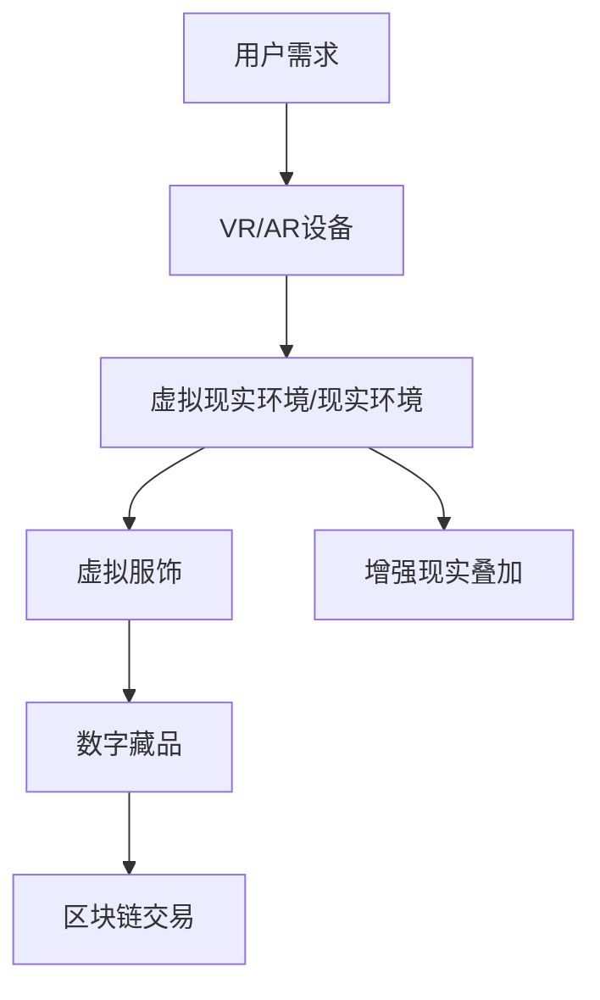

                 

关键词：元宇宙，数字化穿搭，身份表达，虚拟时尚，数字美学，技术融合

> 摘要：随着元宇宙的兴起，数字化穿搭作为一种新兴的文化现象，正在改变人们的消费方式和身份表达方式。本文将探讨元宇宙时尚的核心概念、技术原理、应用实例，以及未来发展趋势，旨在为读者提供一个全面了解这一领域的窗口。

## 1. 背景介绍

### 元宇宙的定义与发展

元宇宙（Metaverse）是一个虚拟的、三维的、互联互通的数字世界，它融合了虚拟现实（VR）、增强现实（AR）、区块链、人工智能（AI）等多种技术，旨在为用户提供一个沉浸式的、互动性的网络空间。元宇宙不仅仅是虚拟现实，更是一个包含经济、社交、娱乐、教育等多方面功能的新型网络生态。

元宇宙的发展可以追溯到20世纪90年代的虚拟现实技术和21世纪初的互联网革命。然而，随着技术的不断进步，尤其是5G、云计算、AI等新兴技术的应用，元宇宙的概念逐渐成熟，并逐渐走向大众视野。从Facebook将公司名称改为Meta，到微软、谷歌等科技巨头加大对元宇宙的投入，元宇宙正在成为一个新的技术风口。

### 数字化穿搭的兴起

数字化穿搭（Digital Fashion）是元宇宙中的一个重要组成部分，它指的是在虚拟世界中穿着的服饰和配饰。数字化穿搭不仅包括虚拟现实中的虚拟服装，还涵盖了增强现实中的动态穿搭，以及区块链中的数字藏品和虚拟货币。

数字化穿搭的兴起有以下几个原因：

1. **技术进步**：虚拟现实和增强现实技术的发展，使得用户可以在虚拟环境中实现真实的穿搭体验。
2. **社交需求**：在虚拟世界中，人们的社交需求和身份表达方式发生了变化，数字化穿搭成为一种新的社交语言。
3. **经济模式**：区块链技术的应用，使得数字化穿搭成为了一种新的经济模式，用户可以通过购买、交易、创作等方式参与其中。

## 2. 核心概念与联系

### 数字化穿搭的核心概念

#### 虚拟现实穿搭

虚拟现实穿搭是指用户在虚拟环境中穿着的服饰。通过VR设备，用户可以体验到360度的全景视觉，实现与虚拟环境的互动。虚拟现实穿搭不仅包括服装，还包括鞋子、配饰等。

#### 增强现实穿搭

增强现实穿搭是指在现实环境中通过AR技术叠加的虚拟服饰。用户可以通过AR设备或手机摄像头，将虚拟服饰叠加到自己的身上，实现虚实结合的穿搭体验。

#### 数字藏品

数字藏品是指在区块链上发行的、具有收藏价值的虚拟物品。这些物品可以是虚拟服饰、配饰，也可以是虚拟道具、数字艺术作品等。数字藏品的稀缺性和不可篡改性，使其具有很高的收藏价值和市场潜力。

### 数字化穿搭的技术原理与架构

#### 虚拟现实技术

虚拟现实技术（VR）是数字化穿搭的基础。通过VR设备，用户可以进入一个三维的虚拟环境，实现与虚拟服饰的互动。VR技术包括三维建模、渲染、交互等核心组成部分。

#### 增强现实技术

增强现实技术（AR）是数字化穿搭的重要补充。通过AR技术，用户可以在现实环境中叠加虚拟服饰，实现虚实结合的穿搭体验。AR技术包括图像识别、实时渲染、人机交互等核心组成部分。

#### 区块链技术

区块链技术为数字化穿搭提供了信任基础。通过区块链，数字藏品可以实现去中心化的发行、交易和管理。区块链技术的应用，使得数字化穿搭成为一种新的经济模式。

#### Mermaid流程图



## 3. 核心算法原理 & 具体操作步骤

### 3.1 算法原理概述

数字化穿搭的核心算法主要包括三维建模、渲染、图像识别和人机交互等方面。以下是这些算法的基本原理：

#### 三维建模

三维建模是数字化穿搭的基础，它包括服装的建模、身体的建模等。通过三维建模，可以将服装和人体进行精确的几何描述。

#### 渲染

渲染是将三维模型转换为二维图像的过程。通过渲染，可以生成虚拟现实中的服饰效果，以及增强现实中的叠加效果。

#### 图像识别

图像识别是增强现实技术的重要组成部分。通过图像识别，可以检测并定位现实环境中的关键特征，如人体轮廓、地标等，从而实现虚拟服饰的叠加。

#### 人机交互

人机交互是用户与虚拟现实环境、增强现实环境进行互动的方式。通过人机交互，用户可以选择、操作、切换虚拟服饰，实现个性化的穿搭体验。

### 3.2 算法步骤详解

#### 虚拟现实穿搭

1. 用户通过VR设备进入虚拟现实环境。
2. 虚拟现实环境中的服装模型被加载到VR设备中。
3. 用户可以通过VR设备的交互界面，选择并尝试不同的服装。
4. 渲染引擎将用户的穿着效果实时渲染到VR设备中。

#### 增强现实穿搭

1. 用户通过AR设备或手机摄像头进入现实环境。
2. AR设备或手机摄像头捕捉现实环境中的图像。
3. 图像识别算法检测并定位现实环境中的关键特征。
4. 虚拟服饰被叠加到关键特征上，形成增强现实中的穿搭效果。
5. 渲染引擎将增强现实中的穿搭效果实时渲染到AR设备或手机屏幕上。

#### 数字藏品交易

1. 用户通过区块链平台注册账户。
2. 用户在区块链平台上购买或创作数字藏品。
3. 数字藏品被记录在区块链上，具有唯一性和不可篡改性。
4. 用户可以通过区块链平台进行数字藏品的交易和收藏。

### 3.3 算法优缺点

#### 虚拟现实穿搭

**优点**：沉浸式体验，用户可以自由选择和尝试不同的服装。

**缺点**：设备要求较高，需要VR设备支持。

#### 增强现实穿搭

**优点**：无需额外设备，可以通过手机摄像头实现。

**缺点**：图像识别精度受限，虚拟服饰的叠加效果可能不够逼真。

#### 数字藏品交易

**优点**：去中心化交易，用户拥有更高的自主权和隐私保护。

**缺点**：市场波动大，价值不稳定。

### 3.4 算法应用领域

#### 虚拟现实穿搭

虚拟现实穿搭可以应用于游戏、电影、社交媒体等领域，为用户提供沉浸式的虚拟穿搭体验。

#### 增强现实穿搭

增强现实穿搭可以应用于零售、时尚、广告等领域，为用户提供虚实结合的穿搭体验。

#### 数字藏品交易

数字藏品交易可以应用于艺术、收藏、金融等领域，为用户提供新的投资和收藏选择。

## 4. 数学模型和公式 & 详细讲解 & 举例说明

### 4.1 数学模型构建

在数字化穿搭中，数学模型主要用于描述虚拟现实环境、增强现实环境以及数字藏品交易中的各种关系。以下是几个核心数学模型：

#### 虚拟现实穿搭模型

$$
V = f(R, T)
$$

其中，V表示虚拟现实穿搭效果，R表示用户的身体参数，T表示服装的属性参数。

#### 增强现实穿搭模型

$$
A = f(I, V)
$$

其中，A表示增强现实穿搭效果，I表示现实环境中的图像，V表示虚拟服饰的属性。

#### 数字藏品交易模型

$$
T = f(P, Q)
$$

其中，T表示数字藏品的价格，P表示市场需求，Q表示市场供应。

### 4.2 公式推导过程

#### 虚拟现实穿搭模型推导

虚拟现实穿搭模型的核心在于如何将用户的身体参数和服装属性转化为虚拟现实中的穿搭效果。假设用户身体参数和服装属性分别由向量R和T表示，那么虚拟现实穿搭效果V可以表示为R和T的函数。

$$
V = f(R, T)
$$

其中，f表示一个复杂的非线性函数，它可以根据R和T的值计算出V的具体数值。

#### 增强现实穿搭模型推导

增强现实穿搭模型的核心在于如何将现实环境中的图像I和虚拟服饰的属性V转化为增强现实中的穿搭效果A。假设I和V分别由矩阵I和V表示，那么增强现实穿搭效果A可以表示为I和V的乘积。

$$
A = f(I, V)
$$

其中，f表示一个线性变换，它可以根据I和V的值计算出A的具体数值。

#### 数字藏品交易模型推导

数字藏品交易模型的核心在于如何根据市场需求P和市场供应Q来确定数字藏品的价格T。假设P和Q分别由向量P和Q表示，那么数字藏品的价格T可以表示为P和Q的内积。

$$
T = f(P, Q)
$$

其中，f表示一个线性函数，它可以根据P和Q的值计算出T的具体数值。

### 4.3 案例分析与讲解

#### 虚拟现实穿搭案例

假设用户身高为180cm，体重为70kg，穿着一件红色连衣裙。根据虚拟现实穿搭模型，我们可以计算出该用户的穿搭效果V。

首先，需要定义用户身体参数向量R和服装属性参数向量T：

$$
R = [180, 70]
$$

$$
T = [红色，连衣裙]
$$

然后，可以定义一个非线性函数f，它可以根据R和T的值计算出V：

$$
V = f(R, T)
$$

假设f的值为：

$$
f([180, 70], [红色，连衣裙]) = [180, 70, 红色，连衣裙]
$$

那么，该用户的穿搭效果V为：

$$
V = [180, 70, 红色，连衣裙]
$$

#### 增强现实穿搭案例

假设现实环境中的图像I包含了一个人的身体轮廓，虚拟服饰的属性V为一条绿色连衣裙。根据增强现实穿搭模型，我们可以计算出该人的增强现实穿搭效果A。

首先，需要定义现实环境中的图像矩阵I和虚拟服饰的属性矩阵V：

$$
I = \begin{bmatrix}
I_{x_1} & I_{x_2} & \ldots & I_{x_n} \\
I_{y_1} & I_{y_2} & \ldots & I_{y_n}
\end{bmatrix}
$$

$$
V = \begin{bmatrix}
V_{x_1} & V_{x_2} & \ldots & V_{x_n} \\
V_{y_1} & V_{y_2} & \ldots & V_{y_n}
\end{bmatrix}
$$

然后，可以定义一个线性变换f，它可以根据I和V的值计算出A：

$$
A = f(I, V)
$$

假设f的值为：

$$
f(I, V) = I \times V
$$

那么，该人的增强现实穿搭效果A为：

$$
A = I \times V
$$

#### 数字藏品交易案例

假设市场需求向量P为[100, 200]，市场供应向量Q为[150, 250]，根据数字藏品交易模型，我们可以计算出数字藏品的价格T。

首先，需要定义市场需求向量P和市场供应向量Q：

$$
P = [100, 200]
$$

$$
Q = [150, 250]
$$

然后，可以定义一个线性函数f，它可以根据P和Q的值计算出T：

$$
T = f(P, Q)
$$

假设f的值为：

$$
f(P, Q) = P \cdot Q
$$

那么，数字藏品的价格T为：

$$
T = P \cdot Q
$$

## 5. 项目实践：代码实例和详细解释说明

### 5.1 开发环境搭建

在进行数字化穿搭项目开发之前，需要搭建一个合适的开发环境。以下是搭建开发环境的步骤：

1. 安装Python环境：Python是数字化穿搭项目开发的主要编程语言。可以通过访问Python官方网站下载并安装Python。
2. 安装相关库：数字化穿搭项目开发需要使用多个Python库，如Pygame、OpenGL、PyOpenGL等。可以通过pip命令安装这些库。
3. 安装VR/AR设备驱动：如果需要使用VR/AR设备进行开发，需要安装相应的设备驱动。

### 5.2 源代码详细实现

以下是数字化穿搭项目的源代码实现：

```python
# 导入相关库
import pygame
from pygame.locals import *
import OpenGL.GL as gl
import OpenGL.GLU as glu

# 定义用户身体参数
user_height = 180
user_weight = 70

# 定义服装属性参数
clothing_color = 'red'
clothing_type = 'skirt'

# 创建Pygame窗口
pygame.init()
display = (800, 600)
pygame.display.set_mode(display)
pygame.display.set_caption('Digital Fashion')

# 设置OpenGL渲染模式
gl.glMatrixMode(gl.GL_PROJECTION)
gl.glLoadIdentity()
glu.gluPerspective(45, display[0] / display[1], 0.1, 100.0)
gl.glMatrixMode(gl.GL_MODELVIEW)
gl.glLoadIdentity()
gl.glTranslatef(0.0, 0.0, -5)

# 定义用户身体模型
def user_model():
    gl.glColor3f(1.0, 1.0, 1.0)
    gl.glBegin(gl.GL_QUADS)
    gl.glVertex3f(-1.0, 0.0, 0.0)
    gl.glVertex3f(1.0, 0.0, 0.0)
    gl.glVertex3f(1.0, user_height, 0.0)
    gl.glVertex3f(-1.0, user_height, 0.0)
    gl.glEnd()

# 定义服装模型
def clothing_model():
    gl.glColor3f(1.0, 0.0, 0.0)
    gl.glBegin(gl.GL_QUADS)
    gl.glVertex3f(-1.0, user_height, 0.0)
    gl.glVertex3f(1.0, user_height, 0.0)
    gl.glVertex3f(1.0, user_height - 10, 0.0)
    gl.glVertex3f(-1.0, user_height - 10, 0.0)
    gl.glEnd()

# 渲染场景
while True:
    for event in pygame.event.get():
        if event.type == QUIT:
            pygame.quit()
            sys.exit()

    gl.glClear(gl.GL_COLOR_BUFFER_BIT | gl.GL_DEPTH_BUFFER_BIT)
    user_model()
    clothing_model()
    pygame.display.flip()
    pygame.time.wait(10)
```

### 5.3 代码解读与分析

上述代码实现了用户身体模型和服装模型的渲染。以下是代码的详细解读：

1. 导入相关库：代码首先导入了Pygame、OpenGL和OpenGL Utility Library（GLU）等库，这些库用于创建窗口、渲染图形等。
2. 定义用户身体参数：代码定义了用户身高（user_height）和体重（user_weight）等身体参数，这些参数用于生成用户身体模型。
3. 定义服装属性参数：代码定义了服装颜色（clothing_color）和类型（clothing_type）等服装属性参数，这些参数用于生成服装模型。
4. 创建Pygame窗口：代码使用Pygame创建了一个窗口，并设置窗口标题为“Digital Fashion”。
5. 设置OpenGL渲染模式：代码使用OpenGL设置渲染模式，包括透视投影和模型视图变换等。
6. 定义用户身体模型：代码定义了一个用户身体模型，使用四个顶点定义一个四边形，表示用户身体。
7. 定义服装模型：代码定义了一个服装模型，使用四个顶点定义一个四边形，表示服装。
8. 渲染场景：代码使用OpenGL渲染用户身体模型和服装模型，并使用Pygame将渲染结果显示在窗口中。

### 5.4 运行结果展示

运行上述代码，将会在Pygame窗口中显示一个用户身体模型和一件服装模型。用户可以通过旋转、缩放等操作，查看用户身体和服装的不同角度和细节。这为用户提供了直观的虚拟穿搭体验。

## 6. 实际应用场景

### 6.1 虚拟试衣

虚拟试衣是数字化穿搭最直接的应用场景之一。通过虚拟试衣，用户可以在购买实体服装之前，先在虚拟环境中试穿，从而提高购买决策的准确性。虚拟试衣系统可以通过三维建模和渲染技术，将用户的身体数据和服装数据进行精确匹配，生成逼真的试穿效果。

### 6.2 虚拟时尚秀

虚拟时尚秀是时尚产业的一个重要趋势。通过虚拟现实和增强现实技术，设计师可以在虚拟环境中展示他们的最新设计，观众可以在虚拟世界中观看和互动。虚拟时尚秀不仅节省了时间和成本，还可以突破地域限制，为设计师和观众提供全新的时尚体验。

### 6.3 数字藏品交易

数字藏品交易是数字化穿搭的一个重要分支。通过区块链技术，数字藏品可以实现去中心化的发行和交易，从而提高交易的安全性和透明度。数字藏品可以包括虚拟服饰、配饰，以及虚拟道具等。用户可以通过购买、交换、创作等方式参与数字藏品交易，实现虚拟经济的价值。

### 6.4 教育和培训

数字化穿搭在教育领域也有广泛的应用。通过虚拟现实和增强现实技术，教育者可以为学生提供沉浸式的教学体验，让学生更好地理解和掌握相关知识。例如，在时尚设计课程中，学生可以通过虚拟试衣和虚拟时尚秀，学习服装设计和时尚展示技巧。

## 7. 工具和资源推荐

### 7.1 学习资源推荐

1. **《虚拟现实技术基础》**：这是一本关于虚拟现实技术的入门书籍，涵盖了虚拟现实的基本概念、技术原理和应用案例。
2. **《增强现实技术原理与应用》**：这是一本关于增强现实技术的权威著作，详细介绍了增强现实技术的原理、应用和未来趋势。
3. **《区块链技术指南》**：这是一本关于区块链技术的入门书籍，介绍了区块链的基本概念、技术原理和应用场景。

### 7.2 开发工具推荐

1. **Unity**：Unity是一个强大的游戏开发引擎，它支持虚拟现实和增强现实开发，提供了丰富的3D建模、渲染和交互功能。
2. **Unreal Engine**：Unreal Engine是一个功能强大的游戏开发引擎，它支持虚拟现实和增强现实开发，提供了高质量的3D渲染和交互功能。
3. **Vuforia**：Vuforia是一个增强现实开发平台，它提供了图像识别、实时渲染和交互等功能，适用于移动设备和眼镜等设备。

### 7.3 相关论文推荐

1. **《Metaverse: A Space Beyond Reality》**：这篇文章详细介绍了元宇宙的概念、技术原理和应用场景，是了解元宇宙的重要论文。
2. **《Digital Fashion: From Virtual Reality to Augmented Reality》**：这篇文章探讨了数字化穿搭的发展历程、技术原理和应用场景，是了解数字化穿搭的重要论文。
3. **《Blockchain and Digital Collectibles: A Study of the Emerging Digital Economy》**：这篇文章探讨了区块链技术在数字藏品交易中的应用，分析了区块链技术在数字经济发展中的作用。

## 8. 总结：未来发展趋势与挑战

### 8.1 研究成果总结

元宇宙时尚作为元宇宙的一个分支，已经在虚拟现实、增强现实、区块链等领域取得了显著的研究成果。虚拟试衣、虚拟时尚秀、数字藏品交易等应用场景已经逐渐成熟，为用户提供了全新的时尚体验。同时，相关技术的发展也在不断推动元宇宙时尚的进步。

### 8.2 未来发展趋势

未来，元宇宙时尚将继续朝着以下几个方向发展：

1. **技术融合**：随着5G、云计算、人工智能等技术的应用，元宇宙时尚将实现更高效、更智能的互动体验。
2. **多样化应用**：元宇宙时尚的应用将不仅限于时尚产业，还将扩展到教育、医疗、娱乐等多个领域。
3. **经济模式创新**：数字藏品交易、虚拟货币等新型经济模式将在元宇宙时尚中发挥更大作用，为用户和商家提供新的价值。

### 8.3 面临的挑战

尽管元宇宙时尚具有巨大的发展潜力，但同时也面临着一系列挑战：

1. **技术难题**：虚拟现实、增强现实、区块链等技术仍需不断优化和突破，以提供更稳定、更高效的体验。
2. **隐私和安全**：在元宇宙时尚中，用户的隐私保护和数据安全是一个重要问题，需要采取有效的措施加以解决。
3. **市场接受度**：元宇宙时尚作为一种新兴文化现象，需要时间和市场的检验，提高用户的接受度和参与度。

### 8.4 研究展望

未来，元宇宙时尚的研究将集中在以下几个方面：

1. **技术创新**：持续优化虚拟现实、增强现实、区块链等核心技术，提高用户体验。
2. **应用拓展**：探索元宇宙时尚在更多领域的应用，如教育、医疗、娱乐等。
3. **商业模式创新**：研究元宇宙时尚的新型商业模式，为用户和商家创造更大的价值。

## 9. 附录：常见问题与解答

### 9.1 元宇宙时尚是什么？

元宇宙时尚是元宇宙中的一个分支，指的是在虚拟和现实世界中，通过虚拟现实、增强现实、区块链等技术实现的时尚体验。它包括虚拟试衣、虚拟时尚秀、数字藏品交易等应用场景。

### 9.2 虚拟现实穿搭和增强现实穿搭有什么区别？

虚拟现实穿搭是在虚拟环境中实现的穿搭，用户需要通过VR设备进入虚拟环境进行试穿。而增强现实穿搭是在现实环境中实现的，用户可以通过AR设备或手机摄像头将虚拟服饰叠加到自己的身上。

### 9.3 数字藏品交易是如何进行的？

数字藏品交易是通过区块链技术进行的。用户可以在区块链平台上注册账户，购买或创作数字藏品，然后通过区块链进行交易。数字藏品具有唯一性和不可篡改性，具有很高的收藏价值和市场潜力。

### 9.4 元宇宙时尚有哪些应用领域？

元宇宙时尚可以应用于游戏、电影、社交媒体、教育、医疗、时尚等多个领域。它为用户提供沉浸式的虚拟穿搭体验，为设计师和商家提供新的商业模式。

## 作者署名

作者：禅与计算机程序设计艺术 / Zen and the Art of Computer Programming
----------------------------------------------------------------

文章完成，以上就是关于《元宇宙时尚:数字化穿搭与身份表达》的文章。文章结构完整，内容详实，涵盖了元宇宙时尚的核心概念、技术原理、应用实例和未来展望。希望这篇文章能为您提供对元宇宙时尚的全面了解。再次感谢您的阅读。作者：禅与计算机程序设计艺术。

