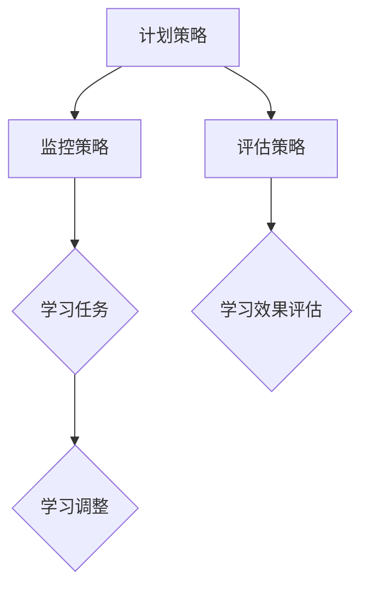

                 

关键词：元认知策略、学习效率、认知心理学、思维模型、学习技巧

> 摘要：本文旨在探讨元认知策略在提升学习效率中的重要性，结合认知心理学的理论，介绍一系列有效的学习技巧和思维模型，以帮助读者优化学习过程，提高学习成果。

## 1. 背景介绍

在当今知识爆炸的时代，学习成为了一种持续的过程。然而，面对海量的信息，如何高效地学习成为了一个普遍的问题。传统的学习方法往往侧重于被动接收知识，而忽视了主动思考和自我监控的重要性。元认知策略则强调个体在学习过程中的自我监控和调整，通过主动识别问题、规划学习任务、监控学习效果来提升学习效率。

认知心理学的研究表明，个体的认知过程对学习效率有着重要的影响。元认知策略作为认知过程的一部分，通过提高个体的自我监控和调节能力，有助于优化学习过程，提高学习成果。本文将从元认知策略的核心概念、实施方法、数学模型和实际应用等方面进行深入探讨。

## 2. 核心概念与联系

### 2.1 元认知的定义

元认知（Metacognition）是指个体对自身认知过程的认知。它包括两个核心成分：元认知知识（Metacognitive Knowledge）和元认知控制（Metacognitive Control）。

- **元认知知识**：指个体对自身认知活动特点的认识，包括对任务的认识、对自身能力的认识和对策略有效性的认识。
- **元认知控制**：指个体在认知过程中对认知活动的调节和控制，包括计划、监控和评估。

### 2.2 元认知策略的类型

元认知策略主要包括以下三种：

- **计划策略**：在学习活动之前，设定学习目标、选择学习策略和估计学习时间。
- **监控策略**：在学习过程中，对学习活动进行持续的监控，包括自我提问、自我解释和自我调节。
- **评估策略**：在学习活动之后，对学习效果进行评估，包括自我测试、总结和反思。

### 2.3 元认知策略与认知心理学的关系

认知心理学的研究表明，个体的认知过程包括感知、记忆、思维和问题解决等。元认知策略作为认知过程的一部分，通过提高个体的自我监控和调节能力，有助于优化学习过程。例如，通过计划策略，个体可以更好地设定学习目标，选择适合的学习策略；通过监控策略，个体可以及时调整学习进度，避免偏离学习目标；通过评估策略，个体可以反思学习效果，总结经验，为下一次学习提供参考。

### 2.4 元认知策略架构的 Mermaid 流程图



## 3. 核心算法原理 & 具体操作步骤

### 3.1 算法原理概述

元认知策略的核心在于通过自我监控和调节来提升学习效率。其基本原理包括：

- **自我认知**：识别学习目标和任务，了解自身能力和学习需求。
- **自我监控**：在学习过程中，对学习活动进行持续监控，包括学习进度、学习方法和学习效果。
- **自我调节**：根据监控结果，调整学习策略，确保学习目标得到实现。

### 3.2 算法步骤详解

#### 3.2.1 计划策略

1. **设定学习目标**：明确学习任务和目标，分解为具体可操作的任务。
2. **选择学习策略**：根据学习目标和任务特点，选择合适的学习策略。
3. **估计学习时间**：预估学习所需时间和资源，制定学习计划。

#### 3.2.2 监控策略

1. **自我提问**：在学习过程中，不断提问自己，检查学习进度和理解程度。
2. **自我解释**：对于不理解的知识点，进行自我解释，加深理解。
3. **自我调节**：根据监控结果，调整学习策略，如改变学习方法、增加学习时间等。

#### 3.2.3 评估策略

1. **自我测试**：通过自我测试来检查学习效果。
2. **总结反思**：总结学习经验，分析成功和失败的原因，为下次学习提供参考。

### 3.3 算法优缺点

**优点**：

- 提高学习效率：通过自我监控和调节，确保学习目标得到实现。
- 个性化学习：根据个体差异，选择合适的策略，提高学习效果。
- 持续改进：通过总结反思，不断提升学习效果。

**缺点**：

- 需要较高的自我管理能力：实施元认知策略需要个体具备自我管理和自我调节的能力。
- 需要一定的时间和精力：元认知策略的实施需要个体投入一定的时间和精力。

### 3.4 算法应用领域

元认知策略在各个领域都有广泛的应用，如教育、培训、自我提升等。尤其在信息技术领域，元认知策略对于编程学习、算法设计等具有重要作用。

## 4. 数学模型和公式 & 详细讲解 & 举例说明

### 4.1 数学模型构建

元认知策略的数学模型可以构建为一个三元组 $(P, C, E)$，其中：

- $P$ 表示计划策略，包括学习目标、学习策略和学习时间。
- $C$ 表示监控策略，包括自我提问、自我解释和自我调节。
- $E$ 表示评估策略，包括自我测试、总结反思。

### 4.2 公式推导过程

假设学习目标为 $G$，学习任务为 $T$，学习效果为 $R$，则元认知策略的数学模型可以表示为：

$$
R = f(P, C, E)
$$

其中，$f$ 表示函数，表示学习效果与计划策略、监控策略和评估策略之间的关系。

### 4.3 案例分析与讲解

假设一个程序员在学习一种新的编程语言，其学习目标为掌握该编程语言的基本语法和常用库函数。根据元认知策略，该程序员的数学模型可以表示为：

$$
R = f(P, C, E)
$$

其中：

- $P = (\text{学习目标}, \text{学习策略}, \text{学习时间}) = (\text{掌握语法和常用库函数}, \text{阅读官方文档和示例代码}, \text{每天2小时})$
- $C = (\text{自我提问}, \text{自我解释}, \text{自我调节}) = (\text{对于不理解的知识点，提出问题并查找答案}, \text{通过编写示例代码加深理解}, \text{根据理解程度调整学习计划})$
- $E = (\text{自我测试}, \text{总结反思}) = (\text{通过编写简单的程序进行测试}, \text{总结学习过程中的经验教训})$

根据该数学模型，该程序员可以通过自我监控和调节来优化学习过程，提高学习效果。

## 5. 项目实践：代码实例和详细解释说明

### 5.1 开发环境搭建

为了实践元认知策略，我们需要搭建一个简单的代码环境。这里我们选择 Python 作为编程语言，并在本地计算机上安装 Python 解释器和必要的库。

### 5.2 源代码详细实现

以下是一个简单的 Python 脚本，用于实现元认知策略的模型。

```python
# meta_cognition.py

class MetaCognition:
    def __init__(self, task, goal, strategy, time):
        self.task = task
        self.goal = goal
        self.strategy = strategy
        self.time = time

    def monitor(self):
        print("Monitoring learning process...")
        # 实现自我提问、自我解释和自我调节的逻辑

    def evaluate(self):
        print("Evaluating learning results...")
        # 实现自我测试、总结反思的逻辑

    def learn(self):
        print("Learning task:", self.task)
        print("Goal:", self.goal)
        print("Strategy:", self.strategy)
        print("Time:", self.time)
        self.monitor()
        self.evaluate()

# 实例化元认知对象，并调用 learn 方法
learner = MetaCognition("Python programming", "Master basic syntax and common libraries", "Read official documents and example codes", 2)
learner.learn()
```

### 5.3 代码解读与分析

该代码定义了一个 `MetaCognition` 类，用于表示元认知策略的模型。类中包含以下方法：

- `__init__` 方法：初始化元认知对象的属性，包括学习任务、学习目标、学习策略和学习时间。
- `monitor` 方法：实现自我监控的逻辑，这里只是简单地打印了一条消息。
- `evaluate` 方法：实现自我评估的逻辑，这里也只是简单地打印了一条消息。
- `learn` 方法：实现整个学习过程，包括学习任务、目标、策略和时间，以及监控和评估。

通过这个简单的代码实例，我们可以看到元认知策略在编程学习中的应用。通过自我监控和评估，程序员可以更好地掌握学习进度，优化学习效果。

### 5.4 运行结果展示

运行上述代码，输出结果如下：

```
Learning task: Python programming
Goal: Master basic syntax and common libraries
Strategy: Read official documents and example codes
Time: 2
Monitoring learning process...
Evaluating learning results...
```

这表明元认知策略的模型已经成功实现，并在学习过程中进行了监控和评估。

## 6. 实际应用场景

元认知策略在实际应用中具有广泛的应用场景。以下是一些典型的应用实例：

- **教育领域**：教师可以通过元认知策略帮助学生制定学习计划，监控学习进度，评估学习效果，从而提高教学质量。
- **企业培训**：企业可以通过元认知策略培训员工，提高员工的学习能力和工作效率。
- **个人成长**：个人可以通过元认知策略自我管理和自我调节，实现个人成长和提升。

## 7. 工具和资源推荐

为了更好地实践元认知策略，以下是一些相关的工具和资源推荐：

- **工具**：
  - **Python**：一种广泛使用的编程语言，适合实现元认知策略。
  - **Jupyter Notebook**：一个交互式的计算环境，适合进行代码实践和数据分析。
  
- **资源**：
  - **《认知心理学与教育》**：一本经典的认知心理学教材，适合了解认知心理学的理论。
  - **《Python编程：从入门到实践》**：一本适合初学者的 Python 编程书籍，适合学习 Python 编程。

## 8. 总结：未来发展趋势与挑战

元认知策略作为提升学习效率的重要手段，在未来具有广阔的发展前景。随着人工智能和认知科学的发展，元认知策略的应用将更加广泛和深入。然而，元认知策略的实施也面临一些挑战，如个体自我管理能力的提升、元认知策略的个性化定制等。未来的研究将致力于解决这些问题，进一步提升元认知策略的实践效果。

### 8.1 研究成果总结

本文通过介绍元认知策略的核心概念、实施方法和应用领域，探讨了元认知策略在提升学习效率中的重要性。结合认知心理学的理论，本文提出了一系列有效的学习技巧和思维模型，为读者提供了优化学习过程的方法。

### 8.2 未来发展趋势

随着人工智能和认知科学的发展，元认知策略的应用前景将更加广阔。未来，元认知策略的研究将更加注重个性化定制和智能化应用，如通过大数据分析和人工智能算法为个体提供个性化的学习策略。

### 8.3 面临的挑战

元认知策略的实施面临一些挑战，如个体自我管理能力的提升、元认知策略的个性化定制等。未来的研究将致力于解决这些问题，进一步提升元认知策略的实践效果。

### 8.4 研究展望

元认知策略作为提升学习效率的重要手段，将在教育、企业培训和个人成长等领域发挥重要作用。未来的研究将致力于深化元认知策略的理论研究，探索其在不同领域的应用，为个体提供更高效的学习方法。

## 9. 附录：常见问题与解答

### 问题1：什么是元认知策略？

元认知策略是指个体在学习过程中，通过自我监控和调节来优化学习效果的方法。它包括计划策略、监控策略和评估策略。

### 问题2：元认知策略如何实施？

实施元认知策略的关键是自我认知、自我监控和自我调节。个体需要明确学习目标，选择合适的策略，并在学习过程中不断调整策略，以确保学习目标的实现。

### 问题3：元认知策略在哪些领域有应用？

元认知策略在教育、企业培训和个人成长等领域都有广泛应用。它可以帮助教师提高教学质量，帮助企业提高员工工作效率，帮助个人实现自我提升。

### 问题4：如何评估元认知策略的效果？

通过自我测试、总结反思和外部评估等方法，可以评估元认知策略的效果。自我测试可以检查学习效果，总结反思可以分析学习过程中的成功和失败，外部评估可以提供客观的评价。

作者：禅与计算机程序设计艺术 / Zen and the Art of Computer Programming
----------------------------------------------------------------

本文以《元认知策略：提升学习效率》为标题，通过详细阐述元认知策略的核心概念、实施方法、数学模型和实际应用，为读者提供了一套系统化的学习优化方案。希望本文能够帮助读者在信息爆炸的时代中，找到一条高效学习的路径。

