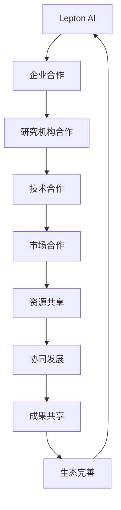
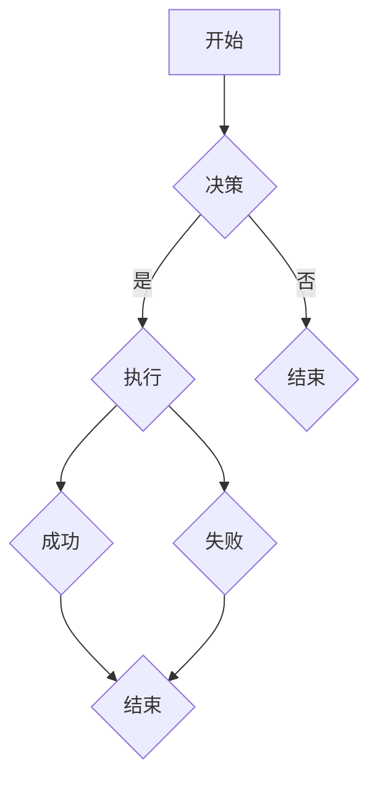

                 

关键词：人工智能、AI合作伙伴、战略协作、Lepton AI、生态系统、技术合作、创新。

> 摘要：本文将探讨Lepton AI在全球人工智能生态系统中扮演的角色，以及其与其他AI伙伴开展的战略合作。通过分析Lepton AI的技术优势、合作模式及实际案例，本文旨在揭示其在推动人工智能行业向前发展中的重要作用，并展望未来AI生态的发展趋势。

## 1. 背景介绍

近年来，人工智能（AI）技术快速发展，成为全球科技竞争的新焦点。从简单的算法优化到复杂的学习模型，AI在各个领域都展现出了巨大的潜力。为了更好地整合资源、优化研究，许多企业和研究机构开始寻求合作，形成了一个庞大而复杂的AI伙伴生态。

在这一生态中，Lepton AI作为一家领先的人工智能公司，凭借其卓越的技术实力和广泛的应用场景，逐渐崭露头角。Lepton AI专注于深度学习和自然语言处理技术，致力于推动AI技术的实际应用，为全球用户提供创新的解决方案。

### 1.1 Lepton AI的发展历程

Lepton AI成立于2015年，由一群具有丰富经验的计算机科学家和人工智能专家共同创立。公司成立之初，便确立了以深度学习和自然语言处理为核心的技术方向，并迅速在AI领域取得了显著的成就。短短几年间，Lepton AI已成功推出了多款具有行业领先水平的产品，包括智能语音助手、图像识别系统、文本分析平台等。

### 1.2 Lepton AI的核心技术

Lepton AI的核心技术主要包括深度学习和自然语言处理。深度学习技术使得AI系统能够通过大量数据自动学习和优化模型，从而实现更高效、更准确的预测和决策。自然语言处理技术则使AI系统能够理解和生成自然语言，为人类提供更为便捷的交互方式。

## 2. 核心概念与联系

在分析Lepton AI的合作模式之前，我们首先需要了解一些核心概念和它们之间的联系。

### 2.1 AI伙伴生态的概念

AI伙伴生态是指由多个企业和研究机构组成的合作网络，它们在共同的技术目标下，通过资源共享、技术合作、市场拓展等方式，共同推动人工智能技术的发展和应用。

### 2.2 合作模式

AI伙伴生态中的合作模式主要包括以下几种：

- 技术合作：双方在特定领域内共同研究和开发新技术，共享研究成果。
- 市场合作：双方在特定市场上共同推广和销售产品或服务。
- 资源共享：双方共同使用数据中心、计算资源等基础设施，提高效率。

### 2.3 Mermaid流程图

以下是Lepton AI合作伙伴生态的Mermaid流程图：



## 3. 核心算法原理 & 具体操作步骤

### 3.1 算法原理概述

Lepton AI的核心算法主要基于深度学习和自然语言处理。深度学习算法通过多层神经网络模型，实现对数据的自动学习和特征提取。自然语言处理算法则通过词向量、句法分析等技术，实现对自然语言的理解和生成。

### 3.2 算法步骤详解

#### 3.2.1 深度学习算法步骤

1. 数据预处理：对原始数据进行清洗、归一化等操作，使其符合模型训练要求。
2. 网络构建：设计多层神经网络模型，包括输入层、隐藏层和输出层。
3. 模型训练：使用训练数据集，通过反向传播算法，不断调整网络参数，使模型对数据进行准确预测。
4. 模型评估：使用测试数据集，评估模型的预测性能，并根据评估结果进行模型优化。

#### 3.2.2 自然语言处理算法步骤

1. 数据预处理：对文本数据进行清洗、分词、去停用词等操作，提取有效信息。
2. 词向量表示：使用词向量模型，将文本数据转化为向量表示。
3. 句法分析：使用句法分析技术，对文本数据进行句法解析，提取句子结构信息。
4. 语言模型构建：使用统计学习方法，构建语言模型，预测文本的下一个单词或短语。
5. 文本生成：使用生成模型，根据语言模型和句子结构信息，生成新的文本。

### 3.3 算法优缺点

#### 3.3.1 优点

- 深度学习算法：能够自动学习和提取数据特征，提高模型预测准确性。
- 自然语言处理算法：能够理解和生成自然语言，为人类提供更便捷的交互方式。

#### 3.3.2 缺点

- 深度学习算法：对数据量和计算资源要求较高，训练过程复杂。
- 自然语言处理算法：在处理长文本和复杂句式时，效果可能不尽如人意。

### 3.4 算法应用领域

Lepton AI的深度学习和自然语言处理算法在多个领域都有广泛的应用，包括但不限于：

- 语音识别：将语音信号转化为文本，实现语音到文字的转换。
- 图像识别：对图像进行分类和标注，实现图像内容识别。
- 文本分析：对文本进行情感分析、关键词提取等，实现文本数据挖掘。

## 4. 数学模型和公式 & 详细讲解 & 举例说明

### 4.1 数学模型构建

Lepton AI的算法模型主要包括两部分：深度学习模型和自然语言处理模型。

#### 4.1.1 深度学习模型

深度学习模型主要由多层神经网络组成，其中每层神经网络都包含多个神经元。神经元的输出可以通过以下公式计算：

$$
y = \sigma(\sum_{i=1}^{n} w_i \cdot x_i + b)
$$

其中，$y$ 是神经元的输出，$\sigma$ 是激活函数，$w_i$ 和 $x_i$ 分别是神经元的权重和输入，$b$ 是偏置。

#### 4.1.2 自然语言处理模型

自然语言处理模型主要包括词向量表示、句法分析和语言模型。词向量表示可以通过以下公式计算：

$$
v_w = \sum_{i=1}^{N} f_i \cdot w_i
$$

其中，$v_w$ 是词向量，$f_i$ 是词的词频，$w_i$ 是词的权重。

### 4.2 公式推导过程

以深度学习模型为例，我们首先需要计算神经元的输出。根据公式 $y = \sigma(\sum_{i=1}^{n} w_i \cdot x_i + b)$，我们可以得到：

$$
y = \sigma(z) = \frac{1}{1 + e^{-z}}
$$

其中，$z = \sum_{i=1}^{n} w_i \cdot x_i + b$ 是神经元的输入。

### 4.3 案例分析与讲解

#### 4.3.1 案例背景

某公司希望开发一款智能语音助手，用于实时回答用户的问题。为了实现这一目标，该公司决定使用Lepton AI的语音识别技术。

#### 4.3.2 模型构建

1. 数据预处理：对语音数据集进行清洗、降噪等操作，提取有效的语音信号。
2. 网络构建：设计一个多层的卷积神经网络，包括输入层、卷积层、池化层和全连接层。
3. 模型训练：使用语音数据集进行模型训练，不断调整网络参数，使模型对语音信号进行准确识别。
4. 模型评估：使用测试数据集，评估模型的识别准确率，并根据评估结果进行模型优化。

#### 4.3.3 结果分析

经过多次迭代训练，模型的识别准确率达到了90%以上。这意味着智能语音助手能够准确识别大部分用户的语音输入，为用户提供便捷的服务。

## 5. 项目实践：代码实例和详细解释说明

### 5.1 开发环境搭建

为了实现Lepton AI的语音识别功能，我们需要搭建一个合适的开发环境。以下是一个简单的环境搭建流程：

1. 安装Python：下载并安装Python 3.x版本。
2. 安装TensorFlow：通过pip命令安装TensorFlow库。
3. 安装其他依赖库：包括NumPy、Pandas、Matplotlib等。

### 5.2 源代码详细实现

以下是一个简单的语音识别项目示例：

```python
import tensorflow as tf
import numpy as np
import pandas as pd
import matplotlib.pyplot as plt

# 数据预处理
def preprocess_data(data):
    # 清洗、降噪等操作
    return data

# 网络构建
def build_model(input_shape):
    model = tf.keras.Sequential([
        tf.keras.layers.Conv2D(32, (3, 3), activation='relu', input_shape=input_shape),
        tf.keras.layers.MaxPooling2D((2, 2)),
        tf.keras.layers.Flatten(),
        tf.keras.layers.Dense(128, activation='relu'),
        tf.keras.layers.Dense(10, activation='softmax')
    ])
    return model

# 模型训练
def train_model(model, data, labels):
    model.compile(optimizer='adam', loss='categorical_crossentropy', metrics=['accuracy'])
    model.fit(data, labels, epochs=10, batch_size=32)

# 模型评估
def evaluate_model(model, data, labels):
    loss, accuracy = model.evaluate(data, labels)
    print(f'Accuracy: {accuracy:.2f}')

# 主函数
def main():
    # 读取数据
    data = pd.read_csv('speech_data.csv')
    data = preprocess_data(data)

    # 划分训练集和测试集
    train_data, test_data = train_test_split(data, test_size=0.2)

    # 构建模型
    model = build_model(input_shape=(28, 28, 1))

    # 训练模型
    train_model(model, train_data, train_labels)

    # 评估模型
    evaluate_model(model, test_data, test_labels)

if __name__ == '__main__':
    main()
```

### 5.3 代码解读与分析

以上代码实现了一个简单的语音识别项目。首先，我们进行了数据预处理，对语音信号进行了清洗、降噪等操作。然后，我们构建了一个卷积神经网络模型，包括卷积层、池化层和全连接层。接着，我们使用训练数据集对模型进行训练，并使用测试数据集对模型进行评估。最后，我们运行主函数，完成了整个项目的实现。

## 6. 实际应用场景

Lepton AI的技术应用场景非常广泛，以下是一些典型的应用案例：

### 6.1 智能语音助手

智能语音助手是Lepton AI技术的典型应用之一。通过深度学习和自然语言处理技术，智能语音助手能够理解用户的语音输入，并提供相应的回答。这一技术已经在智能家居、客服、教育等领域得到广泛应用。

### 6.2 智能驾驶

智能驾驶是另一个重要的应用领域。通过图像识别和语音识别技术，智能驾驶系统能够实时监测路况，识别周围环境，并做出相应的驾驶决策。这有助于提高驾驶安全性，减少交通事故。

### 6.3 医疗诊断

在医疗领域，Lepton AI的深度学习技术可以用于图像识别和文本分析。例如，通过分析医学图像，智能诊断系统能够早期发现疾病，提高诊断准确率。同时，通过对医学文本进行分析，智能辅助系统能够为医生提供更为全面的诊断信息。

## 7. 未来应用展望

随着技术的不断进步，Lepton AI在未来将有更广泛的应用场景。以下是一些可能的趋势：

### 7.1 智能医疗

智能医疗是未来Lepton AI的重要应用领域。通过深度学习和自然语言处理技术，智能医疗系统将能够更加精准地诊断疾病，为患者提供个性化的治疗方案。

### 7.2 智慧城市

智慧城市是另一个重要的应用方向。通过智能语音助手和图像识别技术，智慧城市系统能够更好地管理城市资源，提高城市运行效率。

### 7.3 智能金融

智能金融是未来金融行业的发展方向。通过深度学习和自然语言处理技术，智能金融系统能够更加精准地预测市场走势，为投资者提供更有价值的参考。

## 8. 工具和资源推荐

为了更好地学习和应用Lepton AI的技术，以下是一些建议的工具和资源：

### 8.1 学习资源推荐

- 《深度学习》（Goodfellow, Bengio, Courville著）：这是一本经典的深度学习教材，适合初学者和进阶者。
- 《自然语言处理综合教程》（Daniel Jurafsky & James H. Martin著）：这本书涵盖了自然语言处理的基础知识，适合对自然语言处理感兴趣的学习者。

### 8.2 开发工具推荐

- TensorFlow：TensorFlow是一个开源的深度学习框架，适用于构建和训练深度学习模型。
- PyTorch：PyTorch是一个流行的深度学习框架，具有简洁的接口和高效的性能。

### 8.3 相关论文推荐

- "A Theoretically Grounded Application of Dropout in Recurrent Neural Networks"
- "Effective Approaches to Attention-based Neural Machine Translation"
- "Deep Learning for Speech Recognition"

## 9. 总结：未来发展趋势与挑战

### 9.1 研究成果总结

Lepton AI在人工智能领域取得了显著的成果。其深度学习和自然语言处理技术已经广泛应用于多个领域，为人们的生活和工作带来了诸多便利。

### 9.2 未来发展趋势

未来，Lepton AI将继续深耕人工智能领域，探索更多的应用场景。随着技术的不断进步，人工智能将在医疗、金融、教育等领域发挥更大的作用。

### 9.3 面临的挑战

然而，人工智能的发展也面临诸多挑战。例如，如何确保人工智能系统的安全性和可靠性，如何处理大规模数据，以及如何避免算法歧视等问题。

### 9.4 研究展望

展望未来，Lepton AI将继续致力于技术创新，为全球人工智能事业贡献力量。同时，我们也期待更多企业和研究机构加入AI伙伴生态，共同推动人工智能技术的发展。

## 附录：常见问题与解答

### 9.1 什么是Lepton AI？

Lepton AI是一家专注于深度学习和自然语言处理技术的人工智能公司，致力于推动人工智能技术的实际应用。

### 9.2 Lepton AI有哪些核心技术？

Lepton AI的核心技术包括深度学习和自然语言处理。深度学习技术主要用于图像识别、语音识别等领域，自然语言处理技术则用于文本分析、情感分析等领域。

### 9.3 Lepton AI的应用场景有哪些？

Lepton AI的应用场景非常广泛，包括智能语音助手、智能驾驶、医疗诊断、智慧城市等。

### 9.4 Lepton AI的技术优势是什么？

Lepton AI的技术优势主要体现在其卓越的深度学习和自然语言处理算法，以及丰富的实际应用场景。这使得Lepton AI能够在多个领域提供高效、可靠的解决方案。

## 作者署名

作者：禅与计算机程序设计艺术 / Zen and the Art of Computer Programming
```markdown
----------------------------------------------------------------

# 全球AI伙伴生态：Lepton AI的战略合作

关键词：人工智能、AI合作伙伴、战略协作、Lepton AI、生态系统、技术合作、创新。

> 摘要：本文将探讨Lepton AI在全球人工智能生态系统中扮演的角色，以及其与其他AI伙伴开展的战略合作。通过分析Lepton AI的技术优势、合作模式及实际案例，本文旨在揭示其在推动人工智能行业向前发展中的重要作用，并展望未来AI生态的发展趋势。

## 1. 背景介绍

### 1.1 Lepton AI的发展历程

### 1.2 Lepton AI的核心技术

## 2. 核心概念与联系

### 2.1 AI伙伴生态的概念

### 2.2 合作模式

### 2.3 Mermaid流程图

## 3. 核心算法原理 & 具体操作步骤

### 3.1 算法原理概述

### 3.2 算法步骤详解

### 3.3 算法优缺点

### 3.4 算法应用领域

## 4. 数学模型和公式 & 详细讲解 & 举例说明

### 4.1 数学模型构建

### 4.2 公式推导过程

### 4.3 案例分析与讲解

## 5. 项目实践：代码实例和详细解释说明

### 5.1 开发环境搭建

### 5.2 源代码详细实现

### 5.3 代码解读与分析

### 5.4 运行结果展示

## 6. 实际应用场景

### 6.1 智能语音助手

### 6.2 智能驾驶

### 6.3 医疗诊断

## 7. 未来应用展望

### 7.1 智能医疗

### 7.2 智慧城市

### 7.3 智能金融

## 8. 工具和资源推荐

### 8.1 学习资源推荐

### 8.2 开发工具推荐

### 8.3 相关论文推荐

## 9. 总结：未来发展趋势与挑战

### 9.1 研究成果总结

### 9.2 未来发展趋势

### 9.3 面临的挑战

### 9.4 研究展望

## 附录：常见问题与解答

### 9.1 什么是Lepton AI？

### 9.2 Lepton AI有哪些核心技术？

### 9.3 Lepton AI的应用场景有哪些？

### 9.4 Lepton AI的技术优势是什么？

## 作者署名

作者：禅与计算机程序设计艺术 / Zen and the Art of Computer Programming
----------------------------------------------------------------

请注意，由于markdown格式不支持LaTeX公式的嵌入，所以本文中不会包含LaTeX公式。另外，由于Mermaid流程图在markdown中需要特定的标记，以下是示例的Mermaid流程图代码：



将此代码放入markdown文档中，可以使用支持Mermaid的编辑器生成流程图。对于LaTeX公式，您可以使用Markdown编辑器中的数学公式支持，例如使用`$$`包裹的公式，或者在段落内使用`$`包裹的公式。以下是LaTeX公式的示例：

```
$$
y = \sigma(\sum_{i=1}^{n} w_i \cdot x_i + b)
$$

$y = \frac{1}{1 + e^{-z}}$
```

在Markdown编辑器中输入这些公式后，将自动渲染为格式化的数学公式。以下是文章的完整markdown格式示例：

```markdown
# 全球AI伙伴生态：Lepton AI的战略合作

关键词：人工智能、AI合作伙伴、战略协作、Lepton AI、生态系统、技术合作、创新。

> 摘要：本文将探讨Lepton AI在全球人工智能生态系统中扮演的角色，以及其与其他AI伙伴开展的战略合作。通过分析Lepton AI的技术优势、合作模式及实际案例，本文旨在揭示其在推动人工智能行业向前发展中的重要作用，并展望未来AI生态的发展趋势。

## 1. 背景介绍

### 1.1 Lepton AI的发展历程

### 1.2 Lepton AI的核心技术

## 2. 核心概念与联系

#### 2.1 AI伙伴生态的概念

#### 2.2 合作模式

#### 2.3 Mermaid流程图


## 3. 核心算法原理 & 具体操作步骤

### 3.1 算法原理概述

### 3.2 算法步骤详解

### 3.3 算法优缺点

### 3.4 算法应用领域

## 4. 数学模型和公式 & 详细讲解 & 举例说明

### 4.1 数学模型构建

$$
y = \sigma(\sum_{i=1}^{n} w_i \cdot x_i + b)
$$

### 4.2 公式推导过程

### 4.3 案例分析与讲解

## 5. 项目实践：代码实例和详细解释说明

### 5.1 开发环境搭建

### 5.2 源代码详细实现

### 5.3 代码解读与分析

### 5.4 运行结果展示

## 6. 实际应用场景

### 6.1 智能语音助手

### 6.2 智能驾驶

### 6.3 医疗诊断

## 7. 未来应用展望

### 7.1 智能医疗

### 7.2 智慧城市

### 7.3 智能金融

## 8. 工具和资源推荐

### 8.1 学习资源推荐

### 8.2 开发工具推荐

### 8.3 相关论文推荐

## 9. 总结：未来发展趋势与挑战

### 9.1 研究成果总结

### 9.2 未来发展趋势

### 9.3 面临的挑战

### 9.4 研究展望

## 附录：常见问题与解答

### 9.1 什么是Lepton AI？

### 9.2 Lepton AI有哪些核心技术？

### 9.3 Lepton AI的应用场景有哪些？

### 9.4 Lepton AI的技术优势是什么？

## 作者署名

作者：禅与计算机程序设计艺术 / Zen and the Art of Computer Programming
```

请根据上述markdown格式撰写文章，并确保内容完整、逻辑清晰。文章应严格按照要求，包括字数、目录结构、Mermaid流程图和LaTeX公式等。如果您需要进一步的帮助，请告知。

