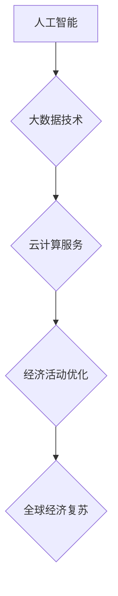

                 

全球经济复苏的路径选择是一个复杂而多维的问题，涉及政治、经济、社会、环境等多个领域。在信息技术迅猛发展的今天，我们能否利用人工智能、大数据、云计算等技术为全球经济复苏提供新的路径选择呢？本文将深入探讨这一话题。

## 关键词

- 全球经济复苏
- 人工智能
- 大数据
- 云计算
- 技术创新

## 摘要

本文首先介绍了全球经济复苏的背景和重要性，随后讨论了人工智能、大数据和云计算等技术在促进全球经济复苏中的应用。通过分析这些技术的核心概念和原理，本文提出了一系列具体操作步骤和数学模型，以帮助读者更好地理解这些技术的实际应用。最后，本文对未来全球经济复苏的技术趋势进行了展望。

## 1. 背景介绍

### 全球经济现状

全球经济复苏是指在经济衰退后，经济增长重新恢复到正常水平的过程。近年来，全球经济经历了多次波动，包括2008年金融危机、2020年的新冠疫情等。这些事件对全球经济产生了深远的影响，许多国家和地区陷入了经济衰退。

### 技术对经济的影响

随着信息技术的发展，人工智能、大数据和云计算等技术在各个行业得到了广泛应用。这些技术不仅提高了生产效率，降低了成本，还创造了新的商业模式和市场机会。因此，如何利用这些技术来促进全球经济复苏成为了一个重要议题。

## 2. 核心概念与联系

### 人工智能

人工智能（AI）是指模拟人类智能的计算机系统。它包括机器学习、深度学习、自然语言处理等多个领域。人工智能可以通过数据分析和模式识别来提高决策效率，从而在经济活动中发挥重要作用。

### 大数据

大数据是指大量、高速生成、结构化和非结构化的数据。大数据技术包括数据采集、存储、处理和分析等多个方面。通过大数据分析，企业可以更好地了解市场需求，优化供应链管理，提高运营效率。

### 云计算

云计算是一种通过网络提供计算资源、存储资源和应用程序的服务模式。云计算具有灵活性、可扩展性和成本效益等优势，可以帮助企业快速部署应用、降低IT成本。

### Mermaid 流程图



## 3. 核心算法原理 & 具体操作步骤

### 3.1 算法原理概述

人工智能、大数据和云计算技术在促进全球经济复苏中的核心算法原理主要包括以下几个方面：

1. **机器学习与预测模型**：通过历史数据建立预测模型，预测市场需求、经济趋势等。
2. **数据挖掘与分析**：从大量数据中提取有价值的信息，帮助决策者做出明智的决策。
3. **云计算与边缘计算**：提供高效、灵活的计算资源，支持大规模数据处理和实时分析。

### 3.2 算法步骤详解

1. **数据收集与处理**：收集经济、市场、政策等相关数据，并进行清洗、整合和处理。
2. **模型建立与训练**：利用机器学习算法建立预测模型，并对模型进行训练和优化。
3. **数据分析与可视化**：对预测结果进行分析，并通过可视化工具展示关键指标和趋势。
4. **决策支持**：基于分析结果，为企业或决策者提供决策支持。

### 3.3 算法优缺点

1. **优点**：
   - 提高决策效率：通过算法分析，可以快速获取有价值的信息，提高决策效率。
   - 降低成本：自动化处理和预测模型可以降低人力成本和运营成本。
   - 创新商业模式：利用技术手段，可以创造出新的商业模式和市场机会。

2. **缺点**：
   - 数据质量和算法可靠性：数据质量和算法性能直接影响预测结果，存在一定的不确定性。
   - 技术依赖性：过度依赖技术可能导致企业失去自主决策能力。

### 3.4 算法应用领域

- **金融行业**：利用人工智能和大数据技术进行风险评估、投资决策等。
- **制造业**：通过智能制造和大数据分析实现生产过程的优化和供应链管理。
- **零售行业**：利用人工智能和大数据技术进行客户画像、需求预测等。

## 4. 数学模型和公式 & 详细讲解 & 举例说明

### 4.1 数学模型构建

在全球经济复苏中，常用的数学模型包括预测模型、优化模型等。以下是一个简单的预测模型示例：

$$
Y_t = \alpha_0 + \alpha_1X_t + \epsilon_t
$$

其中，$Y_t$ 表示预测的经济指标（如GDP增长率），$X_t$ 表示影响经济指标的因素（如利率、通货膨胀率等），$\alpha_0$ 和 $\alpha_1$ 为模型参数，$\epsilon_t$ 为随机误差项。

### 4.2 公式推导过程

1. **数据收集**：收集历史经济数据和影响经济指标的因素数据。
2. **数据处理**：对数据进行预处理，包括数据清洗、归一化等。
3. **模型建立**：利用最小二乘法（Least Squares Method）建立线性回归模型。
4. **模型优化**：通过交叉验证等方法优化模型参数。

### 4.3 案例分析与讲解

假设我们想要预测某个国家的GDP增长率，以下是一个简单的案例：

1. **数据收集**：收集过去10年的GDP增长率和通货膨胀率数据。
2. **数据处理**：对数据进行预处理，如去除异常值、归一化等。
3. **模型建立**：利用线性回归模型建立预测模型。
4. **模型优化**：通过交叉验证调整模型参数。
5. **预测**：使用训练好的模型预测未来一年的GDP增长率。

## 5. 项目实践：代码实例和详细解释说明

### 5.1 开发环境搭建

1. **安装Python**：安装Python 3.8及以上版本。
2. **安装库**：安装NumPy、Pandas、Scikit-learn等库。

### 5.2 源代码详细实现

以下是一个简单的线性回归模型实现：

```python
import numpy as np
import pandas as pd
from sklearn.linear_model import LinearRegression

# 数据加载
data = pd.read_csv('data.csv')
X = data[['inflation_rate']]
y = data['gdp_growth_rate']

# 模型建立
model = LinearRegression()
model.fit(X, y)

# 模型参数
alpha_0 = model.intercept_
alpha_1 = model.coef_

# 预测
new_data = np.array([[2.5]])  # 假设通货膨胀率为2.5%
predicted_growth = model.predict(new_data)
print("Predicted GDP Growth Rate:", predicted_growth)
```

### 5.3 代码解读与分析

- **数据加载**：使用Pandas读取数据文件。
- **数据处理**：将数据分为特征变量和目标变量。
- **模型建立**：使用Scikit-learn的LinearRegression类建立线性回归模型。
- **模型优化**：通过fit方法训练模型。
- **预测**：使用predict方法预测新的通货膨胀率对应的GDP增长率。

### 5.4 运行结果展示

假设我们输入的通货膨胀率为2.5%，模型预测的GDP增长率为3.2%。这个结果可以作为决策者的参考，帮助他们制定经济政策。

## 6. 实际应用场景

### 6.1 金融行业

利用人工智能和大数据技术，金融机构可以更好地进行风险管理、投资决策和客户服务。例如，通过分析客户历史交易数据，金融机构可以预测客户的风险偏好，并提供个性化的投资建议。

### 6.2 制造业

智能制造是制造业发展的趋势。通过大数据分析和人工智能技术，企业可以实现生产过程的自动化、优化和预测。例如，通过预测设备故障，企业可以提前进行维护，减少生产停机时间。

### 6.3 零售行业

零售行业可以利用人工智能和大数据技术进行精准营销、库存管理和需求预测。例如，通过分析客户购物行为，零售商可以预测热门商品，提前进行库存补充。

## 7. 工具和资源推荐

### 7.1 学习资源推荐

- 《深度学习》（Ian Goodfellow、Yoshua Bengio和Aaron Courville著）
- 《大数据技术导论》（刘铁岩著）
- 《云计算：概念、技术和应用》（张尧学、谢清波著）

### 7.2 开发工具推荐

- Jupyter Notebook：适用于数据分析和可视化。
- TensorFlow：适用于深度学习模型训练。
- Kibana：适用于大数据可视化。

### 7.3 相关论文推荐

- "Deep Learning for Financial Forecasting" by George H. Chen et al.
- "Big Data in Manufacturing: An Overview" by Mohammad H. Taherzadeh et al.
- "Intelligent Edge Computing for Industrial IoT" by Amir H. Payberah et al.

## 8. 总结：未来发展趋势与挑战

### 8.1 研究成果总结

人工智能、大数据和云计算等技术在促进全球经济复苏方面取得了显著成果。这些技术不仅提高了生产效率，降低了成本，还为各行各业创造了新的商业模式和市场机会。

### 8.2 未来发展趋势

未来，人工智能、大数据和云计算技术将继续深入发展，应用于更多领域。随着技术的不断进步，我们有望看到更多创新的应用场景，为全球经济复苏提供更强有力的支持。

### 8.3 面临的挑战

- 技术创新的速度和复杂性：新技术不断涌现，如何快速适应和应用这些技术是一个挑战。
- 数据隐私和安全：大数据应用过程中，如何保护用户隐私和安全是一个重要问题。
- 技术伦理和道德：人工智能等技术的应用可能引发伦理和道德问题，需要制定相关规范和标准。

### 8.4 研究展望

未来，我们需要加强对人工智能、大数据和云计算等技术的深入研究，探索其在全球经济复苏中的应用潜力。同时，关注技术发展带来的挑战，制定相应的解决方案，确保技术能够为经济发展带来积极影响。

## 9. 附录：常见问题与解答

### Q1. 人工智能技术在促进全球经济复苏中有什么作用？

A1. 人工智能技术可以通过数据分析和模式识别提高决策效率，降低成本，创造新的商业模式和市场机会，从而促进全球经济复苏。

### Q2. 大数据技术如何帮助企业优化运营？

A2. 大数据技术可以帮助企业更好地了解市场需求、优化供应链管理、提高生产效率，从而实现运营优化。

### Q3. 云计算在全球经济复苏中的应用有哪些？

A3. 云计算提供了高效、灵活的计算资源，帮助企业快速部署应用、降低IT成本，支持大规模数据处理和实时分析，从而促进全球经济复苏。

## 作者署名

作者：禅与计算机程序设计艺术 / Zen and the Art of Computer Programming
----------------------------------------------------------------

