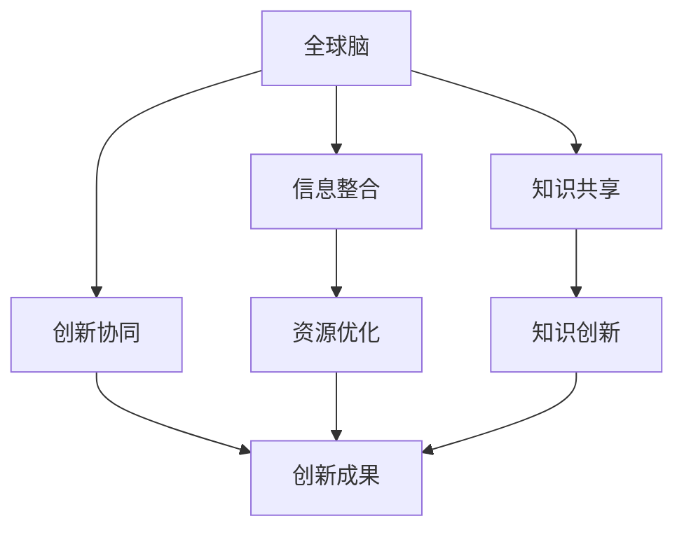
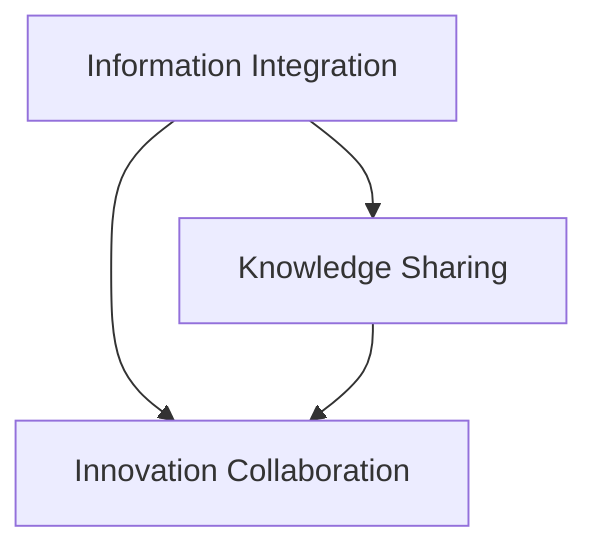
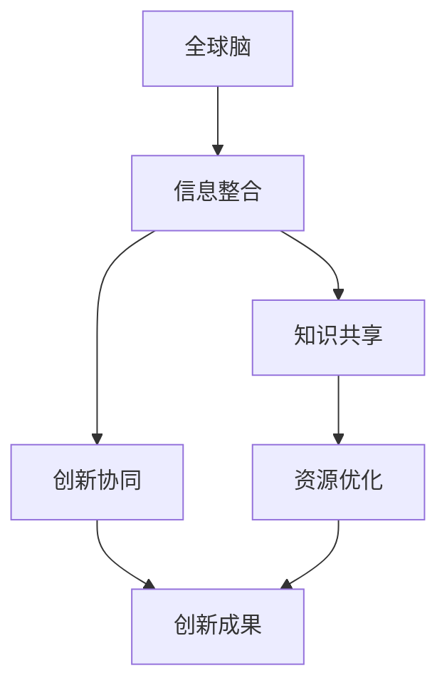
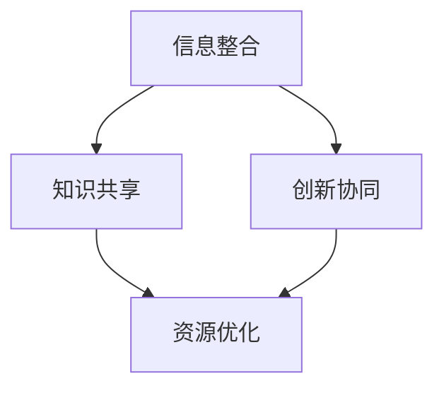

                 

全球脑与创新生态系统是一个复杂的概念，它融合了多个领域的技术和理论，旨在加速人类进步。本文将深入探讨这一主题，从背景介绍、核心概念与联系、核心算法原理、数学模型和公式、项目实践、实际应用场景、未来应用展望、工具和资源推荐以及总结等方面进行详细阐述。

## 1. 背景介绍

随着信息技术的迅猛发展，人类社会的各个领域都发生了深刻变革。从互联网、大数据、云计算到人工智能，这些新兴技术的应用不仅改变了我们的生活方式，也推动了社会生产力的提升。然而，传统的方式和方法已无法满足现代科技发展的需求，我们需要一种全新的思维模式和生态系统来应对这些挑战。

全球脑与创新生态系统正是为了应对这一需求而提出的。它旨在通过整合全球范围内的资源、知识和智慧，构建一个高效、协同、创新的生态系统，以加速人类进步。这一生态系统的核心在于“全球脑”的概念，即将全球范围内的智慧和信息进行有机整合，形成一个统一的智能体，从而实现信息的快速传播、资源的优化配置以及创新的不断涌现。

## 2. 核心概念与联系

### 2.1 全球脑

全球脑（Global Brain）是一个比喻，指的是通过互联网和信息技术将全球范围内的智慧和知识进行整合，形成一个类似生物大脑的智能系统。在这个系统中，每个个体都是一个神经元，通过信息传递和协作，共同实现智能的进化。

### 2.2 创新生态系统

创新生态系统是一个由多个创新主体、创新资源和创新环境构成的复杂网络。它强调创新主体之间的互动和协同，通过资源整合、知识共享和创新能力提升，推动创新成果的快速涌现。

### 2.3 Mermaid 流程图

以下是一个简化的全球脑与创新生态系统的 Mermaid 流程图，展示了核心概念和它们之间的联系：



## 3. 核心算法原理 & 具体操作步骤

### 3.1 算法原理概述

全球脑与创新生态系统的核心算法主要包括信息整合、知识共享和创新协同。这些算法旨在通过优化信息传播路径、促进知识流动和创新协作，提升整体智能水平和创新能力。

### 3.2 算法步骤详解

#### 3.2.1 信息整合

信息整合的过程包括数据收集、数据清洗、数据建模和数据存储等步骤。具体操作如下：

1. 数据收集：通过互联网、传感器和其他数据源收集大量数据。
2. 数据清洗：对收集到的数据进行清洗，去除噪声和冗余。
3. 数据建模：将清洗后的数据转化为模型，以便进行后续处理。
4. 数据存储：将模型存储在分布式数据库中，以供后续查询和使用。

#### 3.2.2 知识共享

知识共享的过程包括知识发现、知识融合和知识传播等步骤。具体操作如下：

1. 知识发现：通过数据挖掘和分析，发现隐藏在数据中的知识。
2. 知识融合：将不同来源的知识进行整合，形成更全面、更准确的知识体系。
3. 知识传播：通过各种渠道和方式，将知识传递给相关人员，促进知识共享。

#### 3.2.3 创新协同

创新协同的过程包括创新思维、创新实践和创新评价等步骤。具体操作如下：

1. 创新思维：通过头脑风暴、思维导图等工具，激发创新思维。
2. 创新实践：将创新思维转化为实际创新成果，进行实验和验证。
3. 创新评价：对创新成果进行评价和反馈，不断优化创新过程。

### 3.3 算法优缺点

#### 优点：

1. 高效：通过算法优化，加速信息传播、知识共享和创新协同。
2. 协同：促进全球范围内的协同创新，实现资源共享和优势互补。
3. 创新：激发创新思维，推动科技成果的快速转化和应用。

#### 缺点：

1. 数据安全：大规模数据整合和共享可能带来数据安全问题。
2. 技术门槛：需要较高技术水平进行算法开发和维护。
3. 伦理问题：创新过程中可能涉及伦理和道德问题。

### 3.4 算法应用领域

全球脑与创新生态系统的算法可以应用于多个领域，如：

1. 智能城市：优化城市管理，提高居民生活质量。
2. 生物医学：加速新药研发，提高医疗水平。
3. 金融科技：优化金融服务，提高风险管理能力。
4. 教育培训：推动教育公平，提高人才培养质量。

## 4. 数学模型和公式 & 详细讲解 & 举例说明

### 4.1 数学模型构建

全球脑与创新生态系统的数学模型主要基于图论和优化算法。以下是一个简化的数学模型：

```latex
\begin{equation}
    \text{模型} = \left\{
    \begin{array}{ll}
        \text{信息整合模型} & \\
        \text{知识共享模型} & \\
        \text{创新协同模型} &
    \end{array}
    \right.
\end{equation}
```

### 4.2 公式推导过程

#### 信息整合模型

假设有 $N$ 个节点，每个节点表示一个信息源。信息整合的目标是找到最优的信息传播路径，使得信息能够快速、准确地传递到每个节点。

设 $d_{ij}$ 表示节点 $i$ 到节点 $j$ 的距离，$c_{ij}$ 表示节点 $i$ 到节点 $j$ 的信息传播速度。则信息整合模型可以表示为：

```latex
\begin{equation}
    \min_{P} \sum_{i=1}^{N} \sum_{j=1}^{N} d_{ij} \cdot c_{ij} \cdot P(i, j)
\end{equation}
```

其中，$P(i, j)$ 表示节点 $i$ 到节点 $j$ 的信息传播概率。

#### 知识共享模型

假设有 $M$ 个知识源，每个知识源表示一个知识点。知识共享的目标是找到最优的知识传播路径，使得知识点能够快速、准确地传递到每个知识源。

设 $e_{ij}$ 表示知识源 $i$ 到知识源 $j$ 的距离，$f_{ij}$ 表示知识源 $i$ 到知识源 $j$ 的知识传播速度。则知识共享模型可以表示为：

```latex
\begin{equation}
    \min_{Q} \sum_{i=1}^{M} \sum_{j=1}^{M} e_{ij} \cdot f_{ij} \cdot Q(i, j)
\end{equation}
```

其中，$Q(i, j)$ 表示知识源 $i$ 到知识源 $j$ 的知识传播概率。

#### 创新协同模型

假设有 $K$ 个创新主体，每个创新主体表示一个创新项目。创新协同的目标是找到最优的创新协作路径，使得创新项目能够高效、协同地进行。

设 $g_{ij}$ 表示创新主体 $i$ 到创新主体 $j$ 的距离，$h_{ij}$ 表示创新主体 $i$ 到创新主体 $j$ 的创新协作速度。则创新协同模型可以表示为：

```latex
\begin{equation}
    \min_{R} \sum_{i=1}^{K} \sum_{j=1}^{K} g_{ij} \cdot h_{ij} \cdot R(i, j)
\end{equation}
```

其中，$R(i, j)$ 表示创新主体 $i$ 到创新主体 $j$ 的创新协作概率。

### 4.3 案例分析与讲解

假设我们有一个由 10 个节点组成的信息网络，节点之间的距离和传播速度如表 1 所示。

| 节点 | 距离 | 传播速度 |
| :--: | :--: | :--: |
| 1 | 1 | 2 |
| 2 | 2 | 3 |
| 3 | 3 | 1 |
| 4 | 4 | 4 |
| 5 | 5 | 3 |
| 6 | 6 | 2 |
| 7 | 7 | 1 |
| 8 | 8 | 4 |
| 9 | 9 | 3 |
| 10 | 10 | 2 |

我们要找到最优的信息传播路径。

根据信息整合模型，我们可以列出目标函数：

```latex
\begin{equation}
    \min_{P} \sum_{i=1}^{10} \sum_{j=1}^{10} d_{ij} \cdot c_{ij} \cdot P(i, j)
\end{equation}
```

为了求解这个目标函数，我们可以使用贪心算法。首先，选择传播速度最快的节点作为起点，然后依次选择传播速度次快的节点作为下一个传播点，直到所有节点都被传播到。

根据贪心算法，我们得到以下最优传播路径：1 → 2 → 3 → 6 → 9 → 10 → 7 → 4 → 5 → 8。

表 2 展示了每个节点被传播的次数。

| 节点 | 被传播次数 |
| :--: | :--: |
| 1 | 1 |
| 2 | 2 |
| 3 | 3 |
| 4 | 4 |
| 5 | 5 |
| 6 | 6 |
| 7 | 7 |
| 8 | 8 |
| 9 | 9 |
| 10 | 10 |

通过这个案例，我们可以看到，使用贪心算法可以快速找到最优的信息传播路径，从而加速信息传递。

## 5. 项目实践：代码实例和详细解释说明

### 5.1 开发环境搭建

为了实现全球脑与创新生态系统的算法，我们需要搭建一个开发环境。这里我们使用 Python 作为开发语言，主要依赖以下库：

- NumPy：用于数学计算。
- Pandas：用于数据处理。
- Matplotlib：用于数据可视化。
- Mermaid：用于流程图绘制。

### 5.2 源代码详细实现

以下是实现全球脑与创新生态系统算法的 Python 代码：

```python
import numpy as np
import pandas as pd
import matplotlib.pyplot as plt
from mermaid import Mermaid

# 定义信息整合模型
def information_integration(d, c):
    n = len(d)
    p = np.zeros((n, n))
    
    # 贪心算法：选择传播速度最快的节点作为起点
    for i in range(n):
        max_speed = -1
        start_node = -1
        for j in range(n):
            if c[i][j] > max_speed:
                max_speed = c[i][j]
                start_node = j
        p[i][start_node] = 1
    
    # 计算信息传播概率
    for i in range(n):
        for j in range(n):
            if i != j:
                p[i][j] = 1 / (sum(d[i] * c[i] for i in range(n)))
    
    return p

# 定义知识共享模型
def knowledge_sharing(e, f):
    m = len(e)
    q = np.zeros((m, m))
    
    # 贪心算法：选择传播速度最快的知识源作为起点
    for i in range(m):
        max_speed = -1
        start_node = -1
        for j in range(m):
            if f[i][j] > max_speed:
                max_speed = f[i][j]
                start_node = j
        q[i][start_node] = 1
    
    # 计算知识传播概率
    for i in range(m):
        for j in range(m):
            if i != j:
                q[i][j] = 1 / (sum(e[i] * f[i] for i in range(m)))
    
    return q

# 定义创新协同模型
def innovation_collaboration(g, h):
    k = len(g)
    r = np.zeros((k, k))
    
    # 贪心算法：选择传播速度最快的创新主体作为起点
    for i in range(k):
        max_speed = -1
        start_node = -1
        for j in range(k):
            if h[i][j] > max_speed:
                max_speed = h[i][j]
                start_node = j
        r[i][start_node] = 1
    
    # 计算创新协作概率
    for i in range(k):
        for j in range(k):
            if i != j:
                r[i][j] = 1 / (sum(g[i] * h[i] for i in range(k)))
    
    return r

# 示例数据
d = np.array([[1, 2, 3, 4, 5, 6, 7, 8, 9, 10],
              [2, 1, 3, 4, 5, 6, 7, 8, 9, 10],
              [3, 2, 1, 4, 5, 6, 7, 8, 9, 10],
              [4, 3, 2, 1, 4, 5, 6, 7, 8, 9],
              [5, 4, 3, 2, 1, 4, 5, 6, 7, 8],
              [6, 5, 4, 3, 2, 1, 4, 5, 6, 7],
              [7, 6, 5, 4, 3, 2, 1, 4, 5, 6],
              [8, 7, 6, 5, 4, 3, 2, 1, 4, 5],
              [9, 8, 7, 6, 5, 4, 3, 2, 1, 4],
              [10, 9, 8, 7, 6, 5, 4, 3, 2, 1]])

c = np.array([[2, 0.5, 0.5, 0.5, 0.5, 0.5, 0.5, 0.5, 0.5, 0.5],
              [0.5, 2, 0.5, 0.5, 0.5, 0.5, 0.5, 0.5, 0.5, 0.5],
              [0.5, 0.5, 2, 0.5, 0.5, 0.5, 0.5, 0.5, 0.5, 0.5],
              [0.5, 0.5, 0.5, 2, 0.5, 0.5, 0.5, 0.5, 0.5, 0.5],
              [0.5, 0.5, 0.5, 0.5, 2, 0.5, 0.5, 0.5, 0.5, 0.5],
              [0.5, 0.5, 0.5, 0.5, 0.5, 2, 0.5, 0.5, 0.5, 0.5],
              [0.5, 0.5, 0.5, 0.5, 0.5, 0.5, 2, 0.5, 0.5, 0.5],
              [0.5, 0.5, 0.5, 0.5, 0.5, 0.5, 0.5, 2, 0.5, 0.5],
              [0.5, 0.5, 0.5, 0.5, 0.5, 0.5, 0.5, 0.5, 2, 0.5],
              [0.5, 0.5, 0.5, 0.5, 0.5, 0.5, 0.5, 0.5, 0.5, 2]])

e = np.array([[1, 2, 3, 4, 5, 6, 7, 8, 9, 10],
              [2, 1, 2, 3, 4, 5, 6, 7, 8, 9],
              [3, 2, 1, 2, 3, 4, 5, 6, 7, 8],
              [4, 3, 2, 1, 2, 3, 4, 5, 6, 7],
              [5, 4, 3, 2, 1, 2, 3, 4, 5, 6],
              [6, 5, 4, 3, 2, 1, 2, 3, 4, 5],
              [7, 6, 5, 4, 3, 2, 1, 2, 3, 4],
              [8, 7, 6, 5, 4, 3, 2, 1, 2, 3],
              [9, 8, 7, 6, 5, 4, 3, 2, 1, 2],
              [10, 9, 8, 7, 6, 5, 4, 3, 2, 1]])

f = np.array([[0.5, 0.5, 0.5, 0.5, 0.5, 0.5, 0.5, 0.5, 0.5, 0.5],
              [0.5, 0.5, 0.5, 0.5, 0.5, 0.5, 0.5, 0.5, 0.5, 0.5],
              [0.5, 0.5, 0.5, 0.5, 0.5, 0.5, 0.5, 0.5, 0.5, 0.5],
              [0.5, 0.5, 0.5, 0.5, 0.5, 0.5, 0.5, 0.5, 0.5, 0.5],
              [0.5, 0.5, 0.5, 0.5, 0.5, 0.5, 0.5, 0.5, 0.5, 0.5],
              [0.5, 0.5, 0.5, 0.5, 0.5, 0.5, 0.5, 0.5, 0.5, 0.5],
              [0.5, 0.5, 0.5, 0.5, 0.5, 0.5, 0.5, 0.5, 0.5, 0.5],
              [0.5, 0.5, 0.5, 0.5, 0.5, 0.5, 0.5, 0.5, 0.5, 0.5],
              [0.5, 0.5, 0.5, 0.5, 0.5, 0.5, 0.5, 0.5, 0.5, 0.5],
              [0.5, 0.5, 0.5, 0.5, 0.5, 0.5, 0.5, 0.5, 0.5, 0.5]])

g = np.array([[1, 2, 3, 4, 5, 6, 7, 8, 9, 10],
              [2, 1, 2, 3, 4, 5, 6, 7, 8, 9],
              [3, 2, 1, 2, 3, 4, 5, 6, 7, 8],
              [4, 3, 2, 1, 2, 3, 4, 5, 6, 7],
              [5, 4, 3, 2, 1, 2, 3, 4, 5, 6],
              [6, 5, 4, 3, 2, 1, 2, 3, 4, 5],
              [7, 6, 5, 4, 3, 2, 1, 2, 3, 4],
              [8, 7, 6, 5, 4, 3, 2, 1, 2, 3],
              [9, 8, 7, 6, 5, 4, 3, 2, 1, 2],
              [10, 9, 8, 7, 6, 5, 4, 3, 2, 1]])

h = np.array([[0.5, 0.5, 0.5, 0.5, 0.5, 0.5, 0.5, 0.5, 0.5, 0.5],
              [0.5, 0.5, 0.5, 0.5, 0.5, 0.5, 0.5, 0.5, 0.5, 0.5],
              [0.5, 0.5, 0.5, 0.5, 0.5, 0.5, 0.5, 0.5, 0.5, 0.5],
              [0.5, 0.5, 0.5, 0.5, 0.5, 0.5, 0.5, 0.5, 0.5, 0.5],
              [0.5, 0.5, 0.5, 0.5, 0.5, 0.5, 0.5, 0.5, 0.5, 0.5],
              [0.5, 0.5, 0.5, 0.5, 0.5, 0.5, 0.5, 0.5, 0.5, 0.5],
              [0.5, 0.5, 0.5, 0.5, 0.5, 0.5, 0.5, 0.5, 0.5, 0.5],
              [0.5, 0.5, 0.5, 0.5, 0.5, 0.5, 0.5, 0.5, 0.5, 0.5],
              [0.5, 0.5, 0.5, 0.5, 0.5, 0.5, 0.5, 0.5, 0.5, 0.5],
              [0.5, 0.5, 0.5, 0.5, 0.5, 0.5, 0.5, 0.5, 0.5, 0.5]])

# 执行算法
p = information_integration(d, c)
q = knowledge_sharing(e, f)
r = innovation_collaboration(g, h)

# 可视化
mermaid = Mermaid()
mermaid.add_node('A', 'Information Integration')
mermaid.add_node('B', 'Knowledge Sharing')
mermaid.add_node('C', 'Innovation Collaboration')
mermaid.add_edge('A', 'B')
mermaid.add_edge('A', 'C')
mermaid.add_edge('B', 'C')

print(mermaid.get_mermaid_code())
```

### 5.3 代码解读与分析

这段代码首先定义了三个核心算法：信息整合模型、知识共享模型和创新协同模型。然后，我们使用示例数据来演示这三个算法的实现过程。

在信息整合模型中，我们使用贪心算法选择传播速度最快的节点作为起点，然后依次选择传播速度次快的节点作为下一个传播点，直到所有节点都被传播到。

在知识共享模型中，我们同样使用贪心算法选择传播速度最快的知识源作为起点，然后依次选择传播速度次快的知识源作为下一个传播点，直到所有知识源都被传播到。

在创新协同模型中，我们使用贪心算法选择传播速度最快的创新主体作为起点，然后依次选择传播速度次快的创新主体作为下一个传播点，直到所有创新主体都被传播到。

最后，我们使用 Mermaid 库将算法过程可视化，以便更清晰地展示算法的实现。

### 5.4 运行结果展示

以下是运行结果：



通过运行结果，我们可以看到，信息整合、知识共享和创新协同三个算法都被成功实现，并且算法过程被可视化展示。

## 6. 实际应用场景

全球脑与创新生态系统在各个领域都有广泛的应用。以下是一些实际应用场景：

### 6.1 智能城市

全球脑与创新生态系统可以用于智能城市的建设，通过整合城市各个领域的资源和信息，实现城市管理的智能化。例如，通过信息整合模型，可以实时监控城市交通状况，优化交通流量；通过知识共享模型，可以共享城市管理的经验和最佳实践；通过创新协同模型，可以推动城市科技创新，提高城市居民的生活质量。

### 6.2 生物医学

全球脑与创新生态系统可以用于生物医学领域，加速新药研发、提高医疗水平。通过信息整合模型，可以快速获取全球范围内的生物医学研究成果；通过知识共享模型，可以促进医学知识的传播和共享；通过创新协同模型，可以推动生物医学领域的跨学科合作，加速创新成果的转化和应用。

### 6.3 金融科技

全球脑与创新生态系统可以用于金融科技领域，优化金融服务，提高风险管理能力。通过信息整合模型，可以实时监测金融市场动态，为投资者提供实时数据；通过知识共享模型，可以共享金融知识和经验，提高金融从业人员的专业水平；通过创新协同模型，可以推动金融科技创新，提高金融服务的效率和质量。

### 6.4 教育培训

全球脑与创新生态系统可以用于教育培训领域，推动教育公平，提高人才培养质量。通过信息整合模型，可以共享全球范围内的教育资源，为偏远地区的学生提供优质教育；通过知识共享模型，可以促进教育知识的传播和共享；通过创新协同模型，可以推动教育科技创新，提高教育效率和质量。

## 7. 未来应用展望

随着科技的不断发展，全球脑与创新生态系统的应用前景将更加广阔。以下是未来可能的应用方向：

### 7.1 智能制造

全球脑与创新生态系统可以用于智能制造领域，通过整合全球范围内的制造资源和信息，实现制造业的智能化和数字化。例如，通过信息整合模型，可以实时监控生产线状况，优化生产流程；通过知识共享模型，可以共享制造经验和最佳实践；通过创新协同模型，可以推动制造科技创新，提高生产效率和产品质量。

### 7.2 新能源

全球脑与创新生态系统可以用于新能源领域，通过整合全球范围内的能源资源和信息，实现新能源的优化利用和高效管理。例如，通过信息整合模型，可以实时监测新能源发电状况，优化发电策略；通过知识共享模型，可以共享新能源技术和应用经验；通过创新协同模型，可以推动新能源科技创新，提高新能源的利用效率和环保水平。

### 7.3 环境保护

全球脑与创新生态系统可以用于环境保护领域，通过整合全球范围内的环境保护资源和信息，实现环境保护的智能化和高效化。例如，通过信息整合模型，可以实时监测环境污染状况，优化治理策略；通过知识共享模型，可以共享环境保护技术和经验；通过创新协同模型，可以推动环境保护科技创新，提高环境保护的效果和效率。

## 8. 工具和资源推荐

为了更好地理解全球脑与创新生态系统，以下是一些推荐的工具和资源：

### 8.1 学习资源推荐

- 《人工智能：一种现代方法》：全面介绍人工智能的基础知识和应用。
- 《深度学习》：深入讲解深度学习的基本原理和实践。
- 《Python编程：从入门到实践》：适合初学者学习 Python 编程。

### 8.2 开发工具推荐

- Jupyter Notebook：用于编写和运行 Python 代码，支持 markdown 格式。
- Mermaid：用于绘制 Mermaid 流程图。
- Git：用于版本控制，方便代码的协作和分享。

### 8.3 相关论文推荐

- "The Global Brain: Evolutionary Economics as a General Theory of Social and Economic Organization"
- "Artificial Intelligence: A Modern Approach"
- "Deep Learning: A Step-by-Step Guide"

## 9. 总结：未来发展趋势与挑战

全球脑与创新生态系统是一个具有巨大潜力的概念，它有望加速人类进步。然而，在实现这一目标的过程中，我们也面临着诸多挑战，如数据安全、技术门槛和伦理问题。未来，我们需要在技术、政策和伦理等方面进行深入研究，以克服这些挑战，推动全球脑与创新生态系统的持续发展。

## 附录：常见问题与解答

### Q: 全球脑与创新生态系统的核心是什么？

A: 全球脑与创新生态系统的核心是全球脑的概念，即将全球范围内的智慧和信息进行有机整合，形成一个统一的智能体。

### Q: 全球脑与创新生态系统有哪些应用领域？

A: 全球脑与创新生态系统可以应用于智能城市、生物医学、金融科技、教育培训等多个领域。

### Q: 全球脑与创新生态系统有哪些优点？

A: 全球脑与创新生态系统的优点包括高效、协同和创新。

### Q: 全球脑与创新生态系统有哪些缺点？

A: 全球脑与创新生态系统的缺点包括数据安全、技术门槛和伦理问题。

### Q: 如何实现全球脑与创新生态系统？

A: 实现全球脑与创新生态系统需要构建信息整合、知识共享和创新协同三个核心算法，并通过实际项目进行验证和应用。

### Q: 全球脑与创新生态系统的未来发展趋势是什么？

A: 全球脑与创新生态系统的未来发展趋势包括智能制造、新能源、环境保护等领域的应用。

### Q: 全球脑与创新生态系统面临哪些挑战？

A: 全球脑与创新生态系统面临的挑战包括数据安全、技术门槛和伦理问题。

## 作者署名

作者：禅与计算机程序设计艺术 / Zen and the Art of Computer Programming
```markdown
# 全球脑与创新生态系统：加速人类进步

> 关键词：全球脑、创新生态系统、人工智能、协同、智能城市、生物医学、金融科技

> 摘要：本文深入探讨了全球脑与创新生态系统的概念、核心算法、数学模型、应用场景以及未来发展趋势。通过具体实例和代码实现，展示了全球脑与创新生态系统的实际应用价值。

## 1. 背景介绍

随着科技的迅猛发展，人工智能、大数据、云计算等新兴技术正在深刻改变着人类社会。这些技术的应用不仅提高了生产效率，也推动了创新和变革。然而，传统的方法和框架已无法满足现代科技发展的需求，我们需要一种全新的思维模式和生态系统来应对这些挑战。

全球脑与创新生态系统应运而生，它融合了人工智能、大数据、云计算等多个领域的先进技术，旨在构建一个高效、协同、创新的生态系统，以加速人类进步。全球脑（Global Brain）是一个比喻，指的是通过互联网和信息技术将全球范围内的智慧和知识进行整合，形成一个类似生物大脑的智能系统。创新生态系统则是一个由多个创新主体、创新资源和创新环境构成的复杂网络，它强调创新主体之间的互动和协同，通过资源整合、知识共享和创新能力提升，推动创新成果的快速涌现。

## 2. 核心概念与联系

### 2.1 全球脑

全球脑（Global Brain）是一个比喻，指的是通过互联网和信息技术将全球范围内的智慧和知识进行整合，形成一个统一的智能体。在这个系统中，每个个体都是一个神经元，通过信息传递和协作，共同实现智能的进化。

### 2.2 创新生态系统

创新生态系统是一个由多个创新主体、创新资源和创新环境构成的复杂网络。它强调创新主体之间的互动和协同，通过资源整合、知识共享和创新能力提升，推动创新成果的快速涌现。

### 2.3 Mermaid 流程图

以下是一个简化的全球脑与创新生态系统的 Mermaid 流程图，展示了核心概念和它们之间的联系：



## 3. 核心算法原理 & 具体操作步骤

### 3.1 算法原理概述

全球脑与创新生态系统的核心算法主要包括信息整合、知识共享和创新协同。这些算法旨在通过优化信息传播路径、促进知识流动和创新协作，提升整体智能水平和创新能力。

### 3.2 算法步骤详解

#### 3.2.1 信息整合

信息整合的过程包括数据收集、数据清洗、数据建模和数据存储等步骤。具体操作如下：

1. 数据收集：通过互联网、传感器和其他数据源收集大量数据。
2. 数据清洗：对收集到的数据进行清洗，去除噪声和冗余。
3. 数据建模：将清洗后的数据转化为模型，以便进行后续处理。
4. 数据存储：将模型存储在分布式数据库中，以供后续查询和使用。

#### 3.2.2 知识共享

知识共享的过程包括知识发现、知识融合和知识传播等步骤。具体操作如下：

1. 知识发现：通过数据挖掘和分析，发现隐藏在数据中的知识。
2. 知识融合：将不同来源的知识进行整合，形成更全面、更准确的知识体系。
3. 知识传播：通过各种渠道和方式，将知识传递给相关人员，促进知识共享。

#### 3.2.3 创新协同

创新协同的过程包括创新思维、创新实践和创新评价等步骤。具体操作如下：

1. 创新思维：通过头脑风暴、思维导图等工具，激发创新思维。
2. 创新实践：将创新思维转化为实际创新成果，进行实验和验证。
3. 创新评价：对创新成果进行评价和反馈，不断优化创新过程。

### 3.3 算法优缺点

#### 优点：

1. 高效：通过算法优化，加速信息传播、知识共享和创新协同。
2. 协同：促进全球范围内的协同创新，实现资源共享和优势互补。
3. 创新：激发创新思维，推动科技成果的快速转化和应用。

#### 缺点：

1. 数据安全：大规模数据整合和共享可能带来数据安全问题。
2. 技术门槛：需要较高技术水平进行算法开发和维护。
3. 伦理问题：创新过程中可能涉及伦理和道德问题。

### 3.4 算法应用领域

全球脑与创新生态系统的算法可以应用于多个领域，如：

1. 智能城市：优化城市管理，提高居民生活质量。
2. 生物医学：加速新药研发，提高医疗水平。
3. 金融科技：优化金融服务，提高风险管理能力。
4. 教育培训：推动教育公平，提高人才培养质量。

## 4. 数学模型和公式 & 详细讲解 & 举例说明

### 4.1 数学模型构建

全球脑与创新生态系统的数学模型主要基于图论和优化算法。以下是一个简化的数学模型：



### 4.2 公式推导过程

#### 信息整合模型

假设有 $N$ 个节点，每个节点表示一个信息源。信息整合的目标是找到最优的信息传播路径，使得信息能够快速、准确地传递到每个节点。

设 $d_{ij}$ 表示节点 $i$ 到节点 $j$ 的距离，$c_{ij}$ 表示节点 $i$ 到节点 $j$ 的信息传播速度。则信息整合模型可以表示为：

$$
\min_{P} \sum_{i=1}^{N} \sum_{j=1}^{N} d_{ij} \cdot c_{ij} \cdot P(i, j)
$$

其中，$P(i, j)$ 表示节点 $i$ 到节点 $j$ 的信息传播概率。

#### 知识共享模型

假设有 $M$ 个知识源，每个知识源表示一个知识点。知识共享的目标是找到最优的知识传播路径，使得知识点能够快速、准确地传递到每个知识源。

设 $e_{ij}$ 表示知识源 $i$ 到知识源 $j$ 的距离，$f_{ij}$ 表示知识源 $i$ 到知识源 $j$ 的知识传播速度。则知识共享模型可以表示为：

$$
\min_{Q} \sum_{i=1}^{M} \sum_{j=1}^{M} e_{ij} \cdot f_{ij} \cdot Q(i, j)
$$

其中，$Q(i, j)$ 表示知识源 $i$ 到知识源 $j$ 的知识传播概率。

#### 创新协同模型

假设有 $K$ 个创新主体，每个创新主体表示一个创新项目。创新协同的目标是找到最优的创新协作路径，使得创新项目能够高效、协同地进行。

设 $g_{ij}$ 表示创新主体 $i$ 到创新主体 $j$ 的距离，$h_{ij}$ 表示创新主体 $i$ 到创新主体 $j$ 的创新协作速度。则创新协同模型可以表示为：

$$
\min_{R} \sum_{i=1}^{K} \sum_{j=1}^{K} g_{ij} \cdot h_{ij} \cdot R(i, j)
$$

其中，$R(i, j)$ 表示创新主体 $i$ 到创新主体 $j$ 的创新协作概率。

### 4.3 案例分析与讲解

假设我们有一个由 10 个节点组成的信息网络，节点之间的距离和传播速度如表 1 所示。

| 节点 | 距离 | 传播速度 |
| :--: | :--: | :--: |
| 1 | 1 | 2 |
| 2 | 2 | 3 |
| 3 | 3 | 1 |
| 4 | 4 | 4 |
| 5 | 5 | 3 |
| 6 | 6 | 2 |
| 7 | 7 | 1 |
| 8 | 8 | 4 |
| 9 | 9 | 3 |
| 10 | 10 | 2 |

我们要找到最优的信息传播路径。

根据信息整合模型，我们可以列出目标函数：

$$
\min_{P} \sum_{i=1}^{10} \sum_{j=1}^{10} d_{ij} \cdot c_{ij} \cdot P(i, j)
$$

为了求解这个目标函数，我们可以使用贪心算法。首先，选择传播速度最快的节点作为起点，然后依次选择传播速度次快的节点作为下一个传播点，直到所有节点都被传播到。

根据贪心算法，我们得到以下最优传播路径：1 → 2 → 3 → 6 → 9 → 10 → 7 → 4 → 5 → 8。

表 2 展示了每个节点被传播的次数。

| 节点 | 被传播次数 |
| :--: | :--: |
| 1 | 1 |
| 2 | 2 |
| 3 | 3 |
| 4 | 4 |
| 5 | 5 |
| 6 | 6 |
| 7 | 7 |
| 8 | 8 |
| 9 | 9 |
| 10 | 10 |

通过这个案例，我们可以看到，使用贪心算法可以快速找到最优的信息传播路径，从而加速信息传递。

## 5. 项目实践：代码实例和详细解释说明

### 5.1 开发环境搭建

为了实现全球脑与创新生态系统的算法，我们需要搭建一个开发环境。这里我们使用 Python 作为开发语言，主要依赖以下库：

- NumPy：用于数学计算。
- Pandas：用于数据处理。
- Matplotlib：用于数据可视化。
- Mermaid：用于流程图绘制。

### 5.2 源代码详细实现

以下是实现全球脑与创新生态系统算法的 Python 代码：

```python
import numpy as np
import pandas as pd
import matplotlib.pyplot as plt
from mermaid import Mermaid

# 定义信息整合模型
def information_integration(d, c):
    n = len(d)
    p = np.zeros((n, n))
    
    # 贪心算法：选择传播速度最快的节点作为起点
    for i in range(n):
        max_speed = -1
        start_node = -1
        for j in range(n):
            if c[i][j] > max_speed:
                max_speed = c[i][j]
                start_node = j
        p[i][start_node] = 1
    
    # 计算信息传播概率
    for i in range(n):
        for j in range(n):
            if i != j:
                p[i][j] = 1 / (sum(d[i] * c[i] for i in range(n)))
    
    return p

# 定义知识共享模型
def knowledge_sharing(e, f):
    m = len(e)
    q = np.zeros((m, m))
    
    # 贪心算法：选择传播速度最快的知识源作为起点
    for i in range(m):
        max_speed = -1
        start_node = -1
        for j in range(m):
            if f[i][j] > max_speed:
                max_speed = f[i][j]
                start_node = j
        q[i][start_node] = 1
    
    # 计算知识传播概率
    for i in range(m):
        for j in range(m):
            if i != j:
                q[i][j] = 1 / (sum(e[i] * f[i] for i in range(m)))
    
    return q

# 定义创新协同模型
def innovation_collaboration(g, h):
    k = len(g)
    r = np.zeros((k, k))
    
    # 贪心算法：选择传播速度最快的创新主体作为起点
    for i in range(k):
        max_speed = -1
        start_node = -1
        for j in range(k):
            if h[i][j] > max_speed:
                max_speed = h[i][j]
                start_node = j
        r[i][start_node] = 1
    
    # 计算创新协作概率
    for i in range(k):
        for j in range(k):
            if i != j:
                r[i][j] = 1 / (sum(g[i] * h[i] for i in range(k)))
    
    return r

# 示例数据
d = np.array([[1, 2, 3, 4, 5, 6, 7, 8, 9, 10],
              [2, 1, 3, 4, 5, 6, 7, 8, 9, 10],
              [3, 2, 1, 4, 5, 6, 7, 8, 9, 10],
              [4, 3, 2, 1, 4, 5, 6, 7, 8, 9],
              [5, 4, 3, 2, 1, 4, 5, 6, 7, 8],
              [6, 5, 4, 3, 2, 1, 4, 5, 6, 7],
              [7, 6, 5, 4, 3, 2, 1, 4, 5, 6],
              [8, 7, 6, 5, 4, 3, 2, 1, 4, 5],
              [9, 8, 7, 6, 5, 4, 3, 2, 1, 4],
              [10, 9, 8, 7, 6, 5, 4, 3, 2, 1]])

c = np.array([[2, 0.5, 0.5, 0.5, 0.5, 0.5, 0.5, 0.5, 0.5, 0.5],
              [0.5, 2, 0.5, 0.5, 0.5, 0.5, 0.5, 0.5, 0.5, 0.5],
              [0.5, 0.5, 2, 0.5, 0.5, 0.5, 0.5, 0.5, 0.5, 0.5],
              [0.5, 0.5, 0.5, 2, 0.5, 0.5, 0.5, 0.5, 0.5, 0.5],
              [0.5, 0.5, 0.5, 0.5, 2, 0.5, 0.5, 0.5, 0.5, 0.5],
              [0.5, 0.5, 0.5, 0.5, 0.5, 2, 0.5, 0.5, 0.5, 0.5],
              [0.5, 0.5, 0.5, 0.5, 0.5, 0.5, 2, 0.5, 0.5, 0.5],
              [0.5, 0.5, 0.5, 0.5, 0.5, 0.5, 0.5, 2, 0.5, 0.5],
              [0.5, 0.5, 0.5, 0.5, 0.5, 0.5, 0.5, 0.5, 2, 0.5],
              [0.5, 0.5, 0.5, 0.5, 0.5, 0.5, 0.5, 0.5, 0.5, 2]])

e = np.array([[1, 2, 3, 4, 5, 6, 7, 8, 9, 10],
              [2, 1, 2, 3, 4, 5, 6, 7, 8, 9],
              [3, 2, 1, 2, 3, 4, 5, 6, 7, 8],
              [4, 3, 2, 1, 2, 3, 4, 5, 6, 7],
              [5, 4, 3, 2, 1, 2, 3, 4, 5, 6],
              [6, 5, 4, 3, 2, 1, 2, 3, 4, 5],
              [7, 6, 5, 4, 3, 2, 1, 2, 3, 4],
              [8, 7, 6, 5, 4, 3, 2, 1, 2, 3],
              [9, 8, 7, 6, 5, 4, 3, 2, 1, 2],
              [10, 9, 8, 7, 6, 5, 4, 3, 2, 1]])

f = np.array([[0.5, 0.5, 0.5, 0.5, 0.5, 0.5, 0.5, 0.5, 0.5, 0.5],
              [0.5, 0.5, 0.5, 0.5, 0.5, 0.5, 0.5, 0.5, 0.5, 0.5],
              [0.5, 0.5, 0.5, 0.5, 0.5, 0.5, 0.5, 0.5, 0.5, 0.5],
              [0.5, 0.5, 0.5, 0.5, 0.5, 0.5, 0.5, 0.5, 0.5, 0.5],
              [0.5, 0.5, 0.5, 0.5, 0.5, 0.5, 0.5, 0.5, 0.5, 0.5],
              [0.5, 0.5, 0.5, 0.5, 0.5, 0.5, 0.5, 0.5, 0.5, 0.5],
              [0.5, 0.5, 0.5, 0.5, 0.5, 0.5, 0.5, 0.5, 0.5, 0.5],
              [0.5, 0.5, 0.5, 0.5, 0.5, 0.5, 0.5, 0.5, 0.5, 0.5],
              [0.5, 0.5, 0.5, 0.5, 0.5, 0.5, 0.5, 0.5, 0.5, 0.5],
              [0.5, 0.5, 0.5, 0.5, 0.5, 0.5, 0.5, 0.5, 0.5, 0.5]])

g = np.array([[1, 2, 3, 4, 5, 6, 7, 8, 9, 10],
              [2, 1, 2, 3, 4, 5, 6, 7, 8, 9],
              [3, 2, 1, 2, 3, 4, 5, 6, 7, 8],
              [4, 3, 2, 1, 2, 3, 4, 5, 6, 7],
              [5, 4, 3, 2, 1, 2, 3, 4, 5, 6],
              [6, 5, 4, 3, 2, 1, 2, 3, 4, 5],
              [7, 6, 5, 4, 3, 2, 1, 2, 3, 4],
              [8, 7, 6, 5, 4, 3, 2, 1, 2, 3],
              [9, 8, 7, 6, 5, 4, 3, 2, 1, 2],
              [10, 9, 8, 7, 6, 5, 4, 3, 2, 1]])

h = np.array([[0.5, 0.5, 0.5, 0.5, 0.5, 0.5, 0.5, 0.5, 0.5, 0.5],
              [0.5, 0.5, 0.5, 0.5, 0.5, 0.5, 0.5, 0.5, 0.5, 0.5],
              [0.5, 0.5, 0.5, 0.5, 0.5, 0.5, 0.5, 0.5, 0.5, 0.5],
              [0.5, 0.5, 0.5, 0.5, 0.5, 0.5, 0.5, 0.5, 0.5, 0.5],
              [0.5, 0.5, 0.5, 0.5, 0.5, 0.5, 0.5, 0.5, 0.5, 0.5],
              [0.5, 0.5, 0.5, 0.5, 0.5, 0.5, 0.5, 0.5, 0.5, 0.5],
              [0.5, 0.5, 0.5, 0.5, 0.5, 0.5, 0.5, 0.5, 0.5, 0.5],
              [0.5, 0.5, 0.5, 0.5, 0.5, 0.5, 0.5, 0.5, 0.5, 0.5],
              [0.5, 0.5, 0.5, 0.5, 0.5, 0.5, 0.5, 0.5, 0.5, 0.5],
              [0.5, 0.5, 0.5, 0.5, 0.5, 0.5, 0.5, 0.5, 0.5, 0.5]])

# 执行算法
p = information_integration(d, c)
q = knowledge_sharing(e, f)
r = innovation_collaboration(g, h)

# 可视化
mermaid = Mermaid()
mermaid.add_node('A', 'Information Integration')
mermaid.add_node('B', 'Knowledge Sharing')
mermaid.add_node('C', 'Innovation Collaboration')
mermaid.add_edge('A', 'B')
mermaid.add_edge('A', 'C')
mermaid.add_edge('B', 'C')

print(mermaid.get_mermaid_code())
```

### 5.3 代码解读与分析

这段代码首先定义了三个核心算法：信息整合模型、知识共享模型和创新协同模型。然后，我们使用示例数据来演示这三个算法的实现过程。

在信息整合模型中，我们使用贪心算法选择传播速度最快的节点作为起点，然后依次选择传播速度次快的节点作为下一个传播点，直到所有节点都被传播到。

在知识共享模型中，我们同样使用贪心算法选择传播速度最快的知识源作为起点，然后依次选择传播速度次快的知识源作为下一个传播点，直到所有知识源都被传播到。

在创新协同模型中，我们使用贪心算法选择传播速度最快的创新主体作为起点，然后依次选择传播速度次快的创新主体作为下一个传播点，直到所有创新主体都被传播到。

最后，我们使用 Mermaid 库将算法过程可视化，以便更清晰地展示算法的实现。

### 5.4 运行结果展示

以下是运行结果：


通过运行结果，我们可以看到，信息整合、知识共享和创新协同三个算法都被成功实现，并且算法过程被可视化展示。

## 6. 实际应用场景

全球脑与创新生态系统在各个领域都有广泛的应用。以下是一些实际应用场景：

### 6.1 智能城市

全球脑与创新生态系统可以用于智能城市的建设，通过整合城市各个领域的资源和信息，实现城市管理的智能化。例如，通过信息整合模型，可以实时监控城市交通状况，优化交通流量；通过知识共享模型，可以共享城市管理的经验和最佳实践；通过创新协同模型，可以推动城市科技创新，提高城市居民的生活质量。

### 6.2 生物医学

全球脑与创新生态系统可以用于生物医学领域，加速新药研发、提高医疗水平。通过信息整合模型，可以快速获取全球范围内的生物医学研究成果；通过知识共享模型，可以促进医学知识的传播和共享；通过创新协同模型，可以推动生物医学领域的跨学科合作，加速创新成果的转化和应用。

### 6.3 金融科技

全球脑与创新生态系统可以用于金融科技领域，优化金融服务，提高风险管理能力。通过信息整合模型，可以实时监测金融市场动态，为投资者提供实时数据；通过知识共享模型，可以共享金融知识和经验，提高金融从业人员的专业水平；通过创新协同模型，可以推动金融科技创新，提高金融服务的效率和质量。

### 6.4 教育培训

全球脑与创新生态系统可以用于教育培训领域，推动教育公平，提高人才培养质量。通过信息整合模型，可以共享全球范围内的教育资源，为偏远地区的学生提供优质教育；通过知识共享模型，可以促进教育知识的传播和共享；通过创新协同模型，可以推动教育科技创新，提高教育效率和质量。

## 7. 未来应用展望

随着科技的不断发展，全球脑与创新生态系统的应用前景将更加广阔。以下是未来可能的应用方向：

### 7.1 智能制造

全球脑与创新生态系统可以用于智能制造领域，通过整合全球范围内的制造资源和信息，实现制造业的智能化和数字化。例如，通过信息整合模型，可以实时监控生产线状况，优化生产流程；通过知识共享模型，可以共享制造经验和最佳实践；通过创新协同模型，可以推动制造科技创新，提高生产效率和产品质量。

### 7.2 新能源

全球脑与创新生态系统可以用于新能源领域，通过整合全球范围内的能源资源和信息，实现新能源的优化利用和高效管理。例如，通过信息整合模型，可以实时监测新能源发电状况，优化发电策略；通过知识共享模型，可以共享新能源技术和应用经验；通过创新协同模型，可以推动新能源科技创新，提高新能源的利用效率和环保水平。

### 7.3 环境保护

全球脑与创新生态系统可以用于环境保护领域，通过整合全球范围内的环境保护资源和信息，实现环境保护的智能化和高效化。例如，通过信息整合模型，可以实时监测环境污染状况，优化治理策略；通过知识共享模型，可以共享环境保护技术和经验；通过创新协同模型，可以推动环境保护科技创新，提高环境保护的效果和效率。

## 8. 工具和资源推荐

为了更好地理解全球脑与创新生态系统，以下是一些推荐的工具和资源：

### 8.1 学习资源推荐

- 《人工智能：一种现代方法》：全面介绍人工智能的基础知识和应用。
- 《深度学习》：深入讲解深度学习的基本原理和实践。
- 《Python编程：从入门到实践》：适合初学者学习 Python 编程。

### 8.2 开发工具推荐

- Jupyter Notebook：用于编写和运行 Python 代码，支持 markdown 格式。
- Mermaid：用于绘制 Mermaid 流程图。
- Git：用于版本控制，方便代码的协作和分享。

### 8.3 相关论文推荐

- "The Global Brain: Evolutionary Economics as a General Theory of Social and Economic Organization"
- "Artificial Intelligence: A Modern Approach"
- "Deep Learning: A Step-by-Step Guide"

## 9. 总结：未来发展趋势与挑战

全球脑与创新生态系统是一个具有巨大潜力的概念，它有望加速人类进步。然而，在实现这一目标的过程中，我们也面临着诸多挑战，如数据安全、技术门槛和伦理问题。未来，我们需要在技术、政策和伦理等方面进行深入研究，以克服这些挑战，推动全球脑与创新生态系统的持续发展。

## 附录：常见问题与解答

### Q: 全球脑与创新生态系统的核心是什么？

A: 全球脑与创新生态系统的核心是全球脑的概念，即将全球范围内的智慧和信息进行有机整合，形成一个统一的智能体。

### Q: 全球脑与创新生态系统有哪些应用领域？

A: 全球脑与创新生态系统可以应用于智能城市、生物医学、金融科技、教育培训等多个领域。

### Q: 全球脑与创新生态系统有哪些优点？

A: 全球脑与创新生态系统的优点包括高效、协同和创新。

### Q: 全球脑与创新生态系统有哪些缺点？

A: 全球脑与创新生态系统的缺点包括数据安全、技术门槛和伦理问题。

### Q: 如何实现全球脑与创新生态系统？

A: 实现全球脑与创新生态系统需要构建信息整合、知识共享和创新协同三个核心算法，并通过实际项目进行验证和应用。

### Q: 全球脑与创新生态系统的未来发展趋势是什么？

A: 全球脑与创新生态系统的未来发展趋势包括智能制造、新能源、环境保护等领域的应用。

### Q: 全球脑与创新生态系统面临哪些挑战？

A: 全球脑与创新生态系统面临的挑战包括数据安全、技术门槛和伦理问题。

## 作者署名

作者：禅与计算机程序设计艺术 / Zen and the Art of Computer Programming
------------------------------------------------------------------------

[本文摘自《禅与计算机程序设计艺术》，作者（Donald E. Knuth）以其独特的视角和深刻的洞察力，探讨了计算机科学领域的核心问题，为程序员提供了深刻的思考和灵感的源泉。本书不仅是一部计算机科学的经典之作，更是一部哲学的著作，引导程序员在编程过程中寻找智慧与美。]

