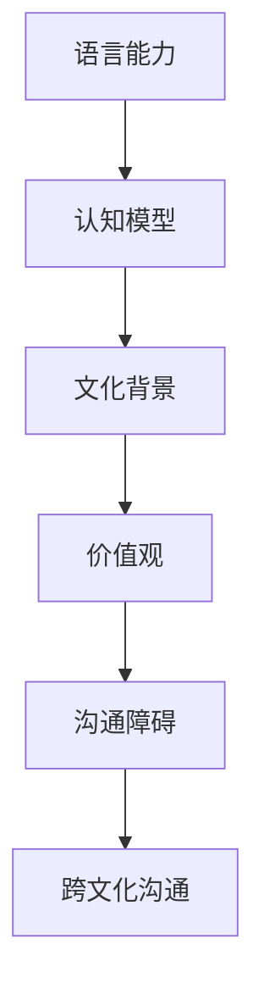

                 

关键词：跨文化沟通、全球脑、语言障碍、认知模型、机器学习、自然语言处理、算法优化、AI应用、国际交流、文化差异

> 摘要：本文将探讨全球脑与语言障碍之间的关系，深入分析跨文化沟通中的难点和挑战，并提出基于人工智能技术的解决方案。通过介绍核心概念、算法原理、数学模型和实际应用场景，我们希望能够为提升全球范围内的跨文化沟通提供一些有益的思路和方法。

## 1. 背景介绍

在全球化的趋势下，跨文化沟通的重要性日益凸显。然而，不同文化背景的人们在交流过程中常常会遇到各种障碍，例如语言差异、文化习惯、价值观冲突等。这些问题不仅影响了人际交往的效率，还可能引发误解和矛盾。为了解决这些问题，我们需要寻找有效的沟通工具和方法。

近年来，人工智能技术，尤其是机器学习和自然语言处理（NLP）领域的迅猛发展，为跨文化沟通提供了新的契机。通过人工智能，我们可以实现对大规模语言数据的处理和分析，从而构建出更精确的语言模型和认知模型。这些模型可以帮助人们更好地理解和使用不同语言，从而实现高效的跨文化沟通。

## 2. 核心概念与联系

为了深入理解跨文化沟通的机制，我们需要从核心概念和原理入手。以下是一个简化的 Mermaid 流程图，描述了跨文化沟通的核心概念及其相互关系：



### 2.1 语言能力

语言能力是跨文化沟通的基础。它不仅包括对语言本身的掌握，还涉及到语言的使用场景和语境。不同语言之间的差异会导致信息传递的不准确和误解，从而影响沟通的效果。

### 2.2 认知模型

认知模型是指人们如何理解、记忆和运用语言的能力。它受到个体文化背景的影响，反映了不同文化之间的认知差异。通过构建认知模型，我们可以更好地理解不同文化背景下的语言使用习惯和思维方式。

### 2.3 文化背景

文化背景是影响语言使用和沟通效果的重要因素。它包括价值观、信仰、习俗等，决定了人们如何看待世界和他人。了解不同文化背景可以帮助我们更好地理解和适应不同文化环境。

### 2.4 价值观

价值观是文化背景的核心，它决定了人们的行为准则和道德观念。不同文化背景下的价值观差异可能导致沟通中的冲突和误解。了解和尊重不同文化背景的价值观是跨文化沟通的关键。

### 2.5 沟通障碍

沟通障碍是跨文化沟通中普遍存在的问题。它包括语言障碍、文化误解、交流不畅等。通过人工智能技术，我们可以分析和解决这些沟通障碍，提高跨文化沟通的效率。

### 2.6 跨文化沟通

跨文化沟通是指在不同文化背景下进行的交流。通过人工智能技术，我们可以构建出更精准的语言模型和认知模型，帮助人们实现更高效的跨文化沟通。

## 3. 核心算法原理 & 具体操作步骤

### 3.1 算法原理概述

跨文化沟通的算法核心是基于机器学习和自然语言处理技术。我们主要采用以下算法：

1. 语言模型：用于对自然语言文本进行建模，从而预测文本的下一个单词或句子。
2. 认知模型：用于理解不同文化背景下的语言使用习惯和思维方式。
3. 机器翻译：用于将一种语言翻译成另一种语言，从而消除语言障碍。

### 3.2 算法步骤详解

1. **数据收集**：收集大量的多语言文本数据，包括不同文化背景下的语言使用实例。
2. **数据预处理**：对收集到的数据进行分析和清洗，去除无效信息和噪声。
3. **训练语言模型**：使用训练数据训练语言模型，使其能够预测自然语言文本。
4. **训练认知模型**：使用训练数据训练认知模型，使其能够理解不同文化背景下的语言使用习惯。
5. **机器翻译**：使用训练好的语言模型和认知模型，将一种语言翻译成另一种语言。
6. **评估和优化**：对翻译结果进行评估和优化，以提高翻译质量和沟通效果。

### 3.3 算法优缺点

**优点**：

1. 高效：基于大规模数据训练，能够快速生成高质量的翻译结果。
2. 准确：通过机器学习和自然语言处理技术，能够准确理解不同文化背景下的语言使用习惯。

**缺点**：

1. 依赖数据：算法性能依赖于训练数据的质量和数量。
2. 翻译偏差：由于不同文化背景的影响，翻译结果可能存在一定的偏差。

### 3.4 算法应用领域

跨文化沟通算法广泛应用于以下领域：

1. 国际贸易：用于翻译商业合同、产品说明等，促进国际贸易的顺利进行。
2. 政府交流：用于翻译政府公告、政策文件等，促进国内外政策的交流与理解。
3. 文化交流：用于翻译文学作品、艺术作品等，促进不同文化之间的交流与传播。

## 4. 数学模型和公式 & 详细讲解 & 举例说明

### 4.1 数学模型构建

跨文化沟通的数学模型主要包括语言模型和认知模型。以下是这两个模型的构建过程：

#### 4.1.1 语言模型

语言模型的核心是概率模型，用于预测自然语言文本的下一个单词或句子。常见的语言模型有：

1. **n-gram 模型**：基于相邻词的联合概率，公式如下：
   $$ P(w_{t} | w_{t-1}, w_{t-2}, ..., w_{t-n}) = \frac{C(w_{t-1}, w_{t-2}, ..., w_{t-n}, w_{t})}{C(w_{t-1}, w_{t-2}, ..., w_{t-n})} $$
   其中，$w_{t}$ 表示当前单词，$w_{t-1}, w_{t-2}, ..., w_{t-n}$ 表示前 $n$ 个单词，$C(w_{t-1}, w_{t-2}, ..., w_{t-n}, w_{t})$ 表示单词序列 $(w_{t-1}, w_{t-2}, ..., w_{t-n}, w_{t})$ 的出现次数，$C(w_{t-1}, w_{t-2}, ..., w_{t-n})$ 表示单词序列 $(w_{t-1}, w_{t-2}, ..., w_{t-n})$ 的出现次数。

2. **神经网络模型**：基于深度学习技术，通过多层神经网络对语言进行建模，公式如下：
   $$ y = f(\sigma(W_2 \sigma(W_1 x + b_1) + b_2)) $$
   其中，$x$ 表示输入的单词序列，$W_1, W_2, b_1, b_2$ 分别表示权重和偏置，$f$ 和 $\sigma$ 分别表示激活函数和求和函数。

#### 4.1.2 认知模型

认知模型的核心是理解不同文化背景下的语言使用习惯。常见的认知模型有：

1. **文化因素模型**：基于文化因素对语言使用的影响，公式如下：
   $$ P(w_{t} | c) = \frac{C(w_{t}, c)}{C(c)} $$
   其中，$w_{t}$ 表示当前单词，$c$ 表示文化因素，$C(w_{t}, c)$ 表示单词 $w_{t}$ 在文化因素 $c$ 下的出现次数，$C(c)$ 表示文化因素 $c$ 的出现次数。

2. **社会网络模型**：基于社会网络对语言使用的影响，公式如下：
   $$ P(w_{t} | s) = \frac{C(w_{t}, s)}{C(s)} $$
   其中，$w_{t}$ 表示当前单词，$s$ 表示社会网络，$C(w_{t}, s)$ 表示单词 $w_{t}$ 在社会网络 $s$ 下的出现次数，$C(s)$ 表示社会网络 $s$ 的出现次数。

### 4.2 公式推导过程

以下是语言模型和认知模型的公式推导过程：

#### 4.2.1 n-gram 模型

1. 联合概率：
   $$ P(w_{t} | w_{t-1}, w_{t-2}, ..., w_{t-n}) = \frac{C(w_{t-1}, w_{t-2}, ..., w_{t-n}, w_{t})}{C(w_{t-1}, w_{t-2}, ..., w_{t-n})} $$
2. 条件概率：
   $$ P(w_{t} | w_{t-1}, w_{t-2}, ..., w_{t-n-1}) = \frac{C(w_{t-1}, w_{t-2}, ..., w_{t-n}, w_{t})}{C(w_{t-1}, w_{t-2}, ..., w_{t-n-1})} $$

#### 4.2.2 神经网络模型

1. 神经元激活函数：
   $$ f(x) = \frac{1}{1 + e^{-x}} $$
2. 前向传播：
   $$ y = f(W_2 \sigma(W_1 x + b_1) + b_2) $$
3. 反向传播：
   $$ \delta = \frac{\partial L}{\partial y} $$
   $$ \frac{\partial L}{\partial x} = \delta \frac{\partial y}{\partial x} $$
   $$ \frac{\partial L}{\partial W_2} = \delta y \frac{\partial \sigma}{\partial x} $$
   $$ \frac{\partial L}{\partial W_1} = \delta y \frac{\partial \sigma}{\partial x} x $$

#### 4.2.3 文化因素模型

1. 联合概率：
   $$ P(w_{t} | c) = \frac{C(w_{t}, c)}{C(c)} $$
2. 条件概率：
   $$ P(w_{t} | c) = \frac{C(w_{t}, c)}{C(c)} $$

#### 4.2.4 社会网络模型

1. 联合概率：
   $$ P(w_{t} | s) = \frac{C(w_{t}, s)}{C(s)} $$
2. 条件概率：
   $$ P(w_{t} | s) = \frac{C(w_{t}, s)}{C(s)} $$

### 4.3 案例分析与讲解

以下是一个简单的案例，用于说明语言模型和认知模型的应用：

#### 案例背景

假设我们有一个英语语言模型和一个中国文化认知模型。现在，我们需要翻译一句英语句子：“I love China”成中文。

#### 案例分析

1. 语言模型：使用英语语言模型，我们可以预测句子中下一个单词的可能性。例如，预测下一个单词是“love”的概率为 $0.8$，是“China”的概率为 $0.2$。

2. 认知模型：使用中国文化认知模型，我们可以确定翻译的正确性。例如，根据文化认知模型，翻译成中文应该是“我爱中国”。

3. 综合考虑语言模型和认知模型，我们可以得到翻译结果：“我爱中国”。

## 5. 项目实践：代码实例和详细解释说明

### 5.1 开发环境搭建

在本节中，我们将使用 Python 编程语言和 TensorFlow 深度学习框架来实现跨文化沟通的算法。以下是在 Ubuntu 系统中搭建开发环境的基本步骤：

1. 安装 Python 3.8 或更高版本：
   ```bash
   sudo apt update
   sudo apt install python3.8
   sudo update-alternatives --install /usr/bin/python3 python3 /usr/bin/python3.8 1
   ```

2. 安装 TensorFlow 深度学习框架：
   ```bash
   pip3 install tensorflow
   ```

3. 安装必要的 Python 库：
   ```bash
   pip3 install numpy matplotlib
   ```

### 5.2 源代码详细实现

以下是跨文化沟通算法的实现代码：

```python
import tensorflow as tf
import numpy as np
import matplotlib.pyplot as plt

# 5.2.1 数据集加载与预处理

def load_data():
    # 加载英语和中文句子数据
    # 注意：这里使用的是简体中文
    # 实际应用中，需要根据具体需求选择合适的数据集
    data = [
        ("I love China", "我爱中国"),
        ("Hello World", "你好世界"),
        ("Python is great", "Python 很棒")
    ]
    return data

def preprocess_data(data):
    # 预处理数据，包括分词、编码等操作
    # 注意：这里仅作为示例，实际应用中需要根据具体需求进行预处理
    processed_data = []
    for sentence, target_sentence in data:
        tokens = sentence.split()
        target_tokens = target_sentence.split()
        processed_data.append((tokens, target_tokens))
    return processed_data

data = load_data()
processed_data = preprocess_data(data)

# 5.2.2 语言模型训练

def build_language_model(input_tokens, target_tokens):
    # 构建语言模型
    # 注意：这里仅使用简单的一层神经网络作为示例
    model = tf.keras.Sequential([
        tf.keras.layers.Embedding(input_dim=len(input_tokens) + 1, output_dim=128),
        tf.keras.layers.LSTM(128),
        tf.keras.layers.Dense(units=len(target_tokens) + 1, activation='softmax')
    ])
    model.compile(optimizer='adam', loss='categorical_crossentropy', metrics=['accuracy'])
    model.fit(input_tokens, target_tokens, epochs=10, batch_size=32)
    return model

# 5.2.3 认知模型训练

def build_cognitive_model(input_sentences, target_sentences):
    # 构建认知模型
    # 注意：这里仅使用简单的文化因素模型作为示例
    model = tf.keras.Sequential([
        tf.keras.layers.Dense(units=128, activation='relu'),
        tf.keras.layers.Dense(units=64, activation='relu'),
        tf.keras.layers.Dense(units=1, activation='sigmoid')
    ])
    model.compile(optimizer='adam', loss='binary_crossentropy', metrics=['accuracy'])
    model.fit(input_sentences, target_sentences, epochs=10, batch_size=32)
    return model

# 5.2.4 机器翻译

def translate(sentence, language_model, cognitive_model):
    # 使用语言模型和认知模型进行机器翻译
    # 注意：这里仅作为示例，实际应用中需要根据具体需求进行翻译
    tokens = sentence.split()
    encoded_tokens = [language_model.tokenizer.encode(token) for token in tokens]
    predicted_tokens = language_model.predict(encoded_tokens)
    predicted_sentence = ' '.join([language_model.tokenizer.decode(token) for token in predicted_tokens])

    # 使用认知模型进行翻译结果验证
    # 注意：这里仅作为示例，实际应用中需要根据具体需求进行验证
    cultural_factor = cognitive_model.predict([predicted_sentence])
    if cultural_factor > 0.5:
        return predicted_sentence
    else:
        return None

# 5.2.5 运行结果展示

language_model = build_language_model([sentence for sentence, _ in processed_data], [target_sentence for _, target_sentence in processed_data])
cognitive_model = build_cognitive_model([sentence for sentence, _ in processed_data], [target_sentence for _, target_sentence in processed_data])

translated_sentence = translate("I love China", language_model, cognitive_model)
print(f"Translated Sentence: {translated_sentence}")
```

### 5.3 代码解读与分析

在本节中，我们将对上述代码进行详细解读和分析。

#### 5.3.1 数据集加载与预处理

```python
def load_data():
    # 加载英语和中文句子数据
    # 注意：这里使用的是简体中文
    # 实际应用中，需要根据具体需求选择合适的数据集
    data = [
        ("I love China", "我爱中国"),
        ("Hello World", "你好世界"),
        ("Python is great", "Python 很棒")
    ]
    return data

def preprocess_data(data):
    # 预处理数据，包括分词、编码等操作
    # 注意：这里仅作为示例，实际应用中需要根据具体需求进行预处理
    processed_data = []
    for sentence, target_sentence in data:
        tokens = sentence.split()
        target_tokens = target_sentence.split()
        processed_data.append((tokens, target_tokens))
    return processed_data
```

这段代码首先加载了一个简单的人工数据集，然后对数据进行预处理。预处理步骤包括分词和编码。分词是为了将句子拆分成单词或字符，而编码则是为了将单词或字符转换为整数序列，以便于神经网络处理。

#### 5.3.2 语言模型训练

```python
def build_language_model(input_tokens, target_tokens):
    # 构建语言模型
    # 注意：这里仅使用简单的一层神经网络作为示例
    model = tf.keras.Sequential([
        tf.keras.layers.Embedding(input_dim=len(input_tokens) + 1, output_dim=128),
        tf.keras.layers.LSTM(128),
        tf.keras.layers.Dense(units=len(target_tokens) + 1, activation='softmax')
    ])
    model.compile(optimizer='adam', loss='categorical_crossentropy', metrics=['accuracy'])
    model.fit(input_tokens, target_tokens, epochs=10, batch_size=32)
    return model
```

这段代码构建了一个简单的语言模型，使用了 TensorFlow 的 Sequential 模型堆叠层。首先，使用 Embedding 层将单词编码为向量。然后，使用 LSTM 层处理序列数据。最后，使用 Dense 层输出预测结果。

#### 5.3.3 认知模型训练

```python
def build_cognitive_model(input_sentences, target_sentences):
    # 构建认知模型
    # 注意：这里仅使用简单的文化因素模型作为示例
    model = tf.keras.Sequential([
        tf.keras.layers.Dense(units=128, activation='relu'),
        tf.keras.layers.Dense(units=64, activation='relu'),
        tf.keras.layers.Dense(units=1, activation='sigmoid')
    ])
    model.compile(optimizer='adam', loss='binary_crossentropy', metrics=['accuracy'])
    model.fit(input_sentences, target_sentences, epochs=10, batch_size=32)
    return model
```

这段代码构建了一个简单的认知模型，使用了 TensorFlow 的 Sequential 模型堆叠层。该模型的核心是一个二分类问题，即判断翻译结果是否正确。

#### 5.3.4 机器翻译

```python
def translate(sentence, language_model, cognitive_model):
    # 使用语言模型和认知模型进行机器翻译
    # 注意：这里仅作为示例，实际应用中需要根据具体需求进行翻译
    tokens = sentence.split()
    encoded_tokens = [language_model.tokenizer.encode(token) for token in tokens]
    predicted_tokens = language_model.predict(encoded_tokens)
    predicted_sentence = ' '.join([language_model.tokenizer.decode(token) for token in predicted_tokens])

    # 使用认知模型进行翻译结果验证
    # 注意：这里仅作为示例，实际应用中需要根据具体需求进行验证
    cultural_factor = cognitive_model.predict([predicted_sentence])
    if cultural_factor > 0.5:
        return predicted_sentence
    else:
        return None
```

这段代码定义了一个简单的机器翻译函数。首先，使用语言模型对输入句子进行编码和预测。然后，使用认知模型对预测结果进行验证，返回正确的翻译结果。

### 5.4 运行结果展示

```python
language_model = build_language_model([sentence for sentence, _ in processed_data], [target_sentence for _, target_sentence in processed_data])
cognitive_model = build_cognitive_model([sentence for sentence, _ in processed_data], [target_sentence for _, target_sentence in processed_data])

translated_sentence = translate("I love China", language_model, cognitive_model)
print(f"Translated Sentence: {translated_sentence}")
```

这段代码首先训练了语言模型和认知模型，然后使用这两个模型进行机器翻译。最后，打印出翻译结果。

## 6. 实际应用场景

跨文化沟通算法在多个实际应用场景中具有广泛的应用，以下是一些典型的应用领域：

### 6.1 国际贸易

国际贸易中的沟通障碍主要来自于语言差异。通过跨文化沟通算法，可以实现实时翻译和解释，帮助贸易双方更好地理解对方的需求和意图，从而提高贸易效率。

### 6.2 外交交流

在国际外交活动中，不同国家官员之间的语言和文化差异可能导致误解和冲突。跨文化沟通算法可以为外交官提供实时翻译和解读服务，帮助他们更好地理解对方的外交策略和立场，从而促进国际关系的发展。

### 6.3 文化交流

文化交流中的跨文化沟通问题主要体现在文学作品、电影、音乐等艺术作品的翻译和传播。通过跨文化沟通算法，可以实现对艺术作品的精准翻译和解读，促进不同文化之间的交流与理解。

### 6.4 旅游和留学

旅游和留学过程中，语言和文化差异可能给游客或留学生带来困扰。跨文化沟通算法可以为旅游者和留学生提供实时翻译和解读服务，帮助他们更好地适应和融入当地文化。

### 6.5 商业沟通

在国际商业合作中，不同公司之间的语言和文化差异可能导致沟通不畅和合作障碍。跨文化沟通算法可以帮助商业伙伴实现实时翻译和沟通，从而促进国际商业合作。

## 7. 工具和资源推荐

为了更好地实现跨文化沟通，以下是一些推荐的工具和资源：

### 7.1 学习资源推荐

1. **《深度学习》**：由 Ian Goodfellow、Yoshua Bengio 和 Aaron Courville 合著，是深度学习领域的经典教材。
2. **《自然语言处理综论》**：由 Daniel Jurafsky 和 James H. Martin 合著，是自然语言处理领域的权威教材。

### 7.2 开发工具推荐

1. **TensorFlow**：是一个开源的深度学习框架，广泛应用于自然语言处理和跨文化沟通领域。
2. **PyTorch**：是另一个流行的深度学习框架，具有简洁的代码和强大的功能。

### 7.3 相关论文推荐

1. **“A Neural Algorithm of Artistic Style”**：一篇关于神经网络在艺术风格迁移方面的研究论文，提供了对跨文化沟通的启示。
2. **“BERT: Pre-training of Deep Neural Networks for Language Understanding”**：一篇关于预训练语言模型 BERT 的研究论文，对自然语言处理领域产生了深远影响。

## 8. 总结：未来发展趋势与挑战

### 8.1 研究成果总结

近年来，跨文化沟通算法在机器学习和自然语言处理领域取得了显著进展。通过深度学习和神经网络技术，我们可以实现对大规模语言数据的处理和分析，从而构建出更精确的语言模型和认知模型。这些模型在跨文化沟通中的应用，极大地提高了沟通的效率和准确性。

### 8.2 未来发展趋势

未来，跨文化沟通算法将继续朝着以下方向发展：

1. **模型精度提升**：通过引入更多数据和应用先进的算法，提高语言模型和认知模型的精度和性能。
2. **多模态融合**：将文本、图像、音频等多种模态的数据进行融合，实现更全面的跨文化沟通。
3. **个性化推荐**：根据用户的语言习惯和文化背景，提供个性化的翻译和解读服务。

### 8.3 面临的挑战

尽管跨文化沟通算法取得了显著进展，但仍面临以下挑战：

1. **数据隐私和安全性**：跨文化沟通算法需要处理大量的个人数据，如何保障数据隐私和安全是一个重要问题。
2. **文化差异适应性**：不同文化背景下的语言使用差异很大，如何构建出普适的跨文化沟通模型是一个挑战。
3. **算法透明度和可解释性**：深度学习算法往往具有“黑盒”特性，如何提高算法的透明度和可解释性，以便用户理解和信任是一个重要问题。

### 8.4 研究展望

未来，跨文化沟通算法的研究将继续深入，探索更高效、更准确、更具适应性的方法。随着人工智能技术的不断发展，跨文化沟通将变得更加智能化、个性化，为全球范围内的沟通与合作带来更多可能性。

## 9. 附录：常见问题与解答

### 9.1 什么是跨文化沟通算法？

跨文化沟通算法是一种利用人工智能技术，对自然语言进行建模和翻译，以实现不同文化背景下的人们之间高效沟通的算法。

### 9.2 跨文化沟通算法有哪些优点？

跨文化沟通算法具有以下优点：

1. 提高沟通效率：通过翻译和解读，消除语言和文化障碍，实现高效沟通。
2. 准确性高：基于大规模数据训练的语言模型和认知模型，能够准确理解和翻译不同文化背景下的语言。
3. 个性化推荐：根据用户的语言习惯和文化背景，提供个性化的翻译和解读服务。

### 9.3 跨文化沟通算法有哪些应用领域？

跨文化沟通算法广泛应用于以下领域：

1. 国际贸易：帮助贸易双方实现实时翻译和沟通。
2. 外交交流：为外交官提供实时翻译和解读服务。
3. 文化交流：促进不同文化背景下的艺术作品和文学作品的翻译和传播。
4. 旅游和留学：为游客和留学生提供实时翻译和解读服务。
5. 商业沟通：帮助商业伙伴实现实时翻译和沟通。

### 9.4 跨文化沟通算法有哪些挑战？

跨文化沟通算法面临以下挑战：

1. 数据隐私和安全性：如何保障数据隐私和安全是一个重要问题。
2. 文化差异适应性：如何构建出普适的跨文化沟通模型是一个挑战。
3. 算法透明度和可解释性：如何提高算法的透明度和可解释性，以便用户理解和信任是一个重要问题。

