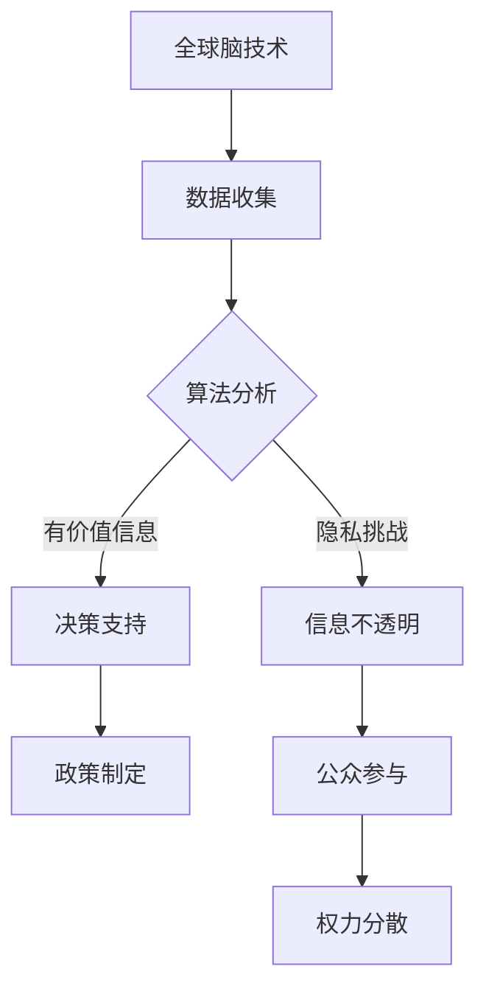

                 

关键词：全球脑、政治影响、民主、专制、新技术、权力、算法、人工智能、隐私、透明度、参与度、决策制定

> 摘要：本文探讨了全球脑技术对政治影响的深刻变化，分析民主与专制在新形势下如何相互较量。通过分析算法、人工智能、隐私、透明度和参与度等核心概念，以及这些技术在全球脑中的应用，本文提出了一系列关于未来政治发展的见解和挑战。

## 1. 背景介绍

随着全球脑技术的发展，信息传播的速度和广度已经达到了前所未有的高度。全球脑是一种基于网络和人工智能技术的智能系统，能够实时分析、处理和整合来自全球各地的数据。这种技术不仅改变了信息流通的方式，还对政治体制和权力结构产生了深远的影响。

### 1.1 全球脑的概念

全球脑（Global Brain）是一个比喻，它将互联网视为一种具有自我组织和进化能力的生物体。在这个概念中，互联网上的每一个节点（如计算机、手机、传感器等）都可以被视为大脑的神经元，通过数据交换和协同工作来实现智能化和自动化。

### 1.2 全球脑与政治

全球脑技术的发展，使得信息收集、分析和决策能力得到了极大的提升。政治家、政府机构和企业都可以利用这些技术来更好地理解公众需求、优化政策制定，以及提高行政效率。然而，这种技术也带来了新的挑战，尤其是在民主和专制之间的权力博弈中。

## 2. 核心概念与联系

在探讨全球脑对政治的影响时，我们需要理解以下几个核心概念：算法、人工智能、隐私、透明度和参与度。

### 2.1 算法和人工智能

算法（Algorithm）是计算机执行任务的一系列指令。人工智能（Artificial Intelligence, AI）则是一种使计算机能够模拟人类智能的技术。算法和人工智能的结合，使得全球脑能够从海量数据中提取有价值的信息，从而为政治决策提供支持。

### 2.2 隐私和透明度

隐私（Privacy）是指个人或组织对自身信息的控制权。透明度（Transparency）则是指信息对公众的开放程度。在全球脑中，隐私和透明度的平衡是一个重要的议题。过度保护隐私可能导致信息不透明，而过度披露则可能侵犯个人隐私。

### 2.3 参与度

参与度（Engagement）是指公众对政治事务的参与程度。全球脑技术可以增强公众参与度，使更多人能够参与到政策制定和决策过程中。然而，这也可能导致权力分散，使得决策过程更加复杂。

### 2.4 Mermaid 流程图

以下是一个描述全球脑技术如何影响政治的 Mermaid 流程图：



## 3. 核心算法原理 & 具体操作步骤

### 3.1 算法原理概述

全球脑中的核心算法通常是基于机器学习和数据挖掘技术的。这些算法能够从大量数据中自动发现模式、趋势和关联，从而为政治决策提供支持。

### 3.2 算法步骤详解

1. **数据收集**：从互联网、社交媒体、传感器等渠道收集数据。
2. **数据清洗**：去除重复数据、噪声数据和异常数据。
3. **特征提取**：将原始数据转换成适合算法处理的特征向量。
4. **模型训练**：使用机器学习算法训练模型，以识别数据中的模式。
5. **模型评估**：评估模型的性能，确保其能够准确预测或分类数据。
6. **决策支持**：将模型应用于新的数据，为政治决策提供支持。

### 3.3 算法优缺点

**优点**：
- 高效处理海量数据。
- 自动化分析，减少人工干预。
- 为决策提供数据支持，提高决策质量。

**缺点**：
- 数据隐私和安全问题。
- 算法可能被恶意利用，影响政治稳定。

### 3.4 算法应用领域

- 政策制定：通过分析公众意见和需求，制定更符合民意的政策。
- 公共安全：预测和预防犯罪，提高社会安全。
- 环境管理：监测和预测气候变化，制定环保政策。

## 4. 数学模型和公式 & 详细讲解 & 举例说明

### 4.1 数学模型构建

全球脑中的数学模型通常基于概率论和统计学。以下是一个简单的线性回归模型：

$$
y = \beta_0 + \beta_1 x_1 + \beta_2 x_2 + ... + \beta_n x_n + \epsilon
$$

其中，$y$ 是目标变量，$x_1, x_2, ..., x_n$ 是特征变量，$\beta_0, \beta_1, ..., \beta_n$ 是模型参数，$\epsilon$ 是误差项。

### 4.2 公式推导过程

线性回归模型的推导过程通常涉及最小二乘法。以下是推导过程的简化步骤：

1. **目标函数**：
   $$
   J(\beta) = \sum_{i=1}^{n} (y_i - \beta_0 - \beta_1 x_{i1} - \beta_2 x_{i2} - ... - \beta_n x_{in})^2
   $$

2. **求导**：
   $$
   \frac{\partial J(\beta)}{\partial \beta_j} = -2 \sum_{i=1}^{n} (y_i - \beta_0 - \beta_1 x_{i1} - \beta_2 x_{i2} - ... - \beta_n x_{in}) x_{ij}
   $$

3. **设导数为零，求解参数**：
   $$
   \sum_{i=1}^{n} x_{ij} y_i - \beta_0 n - \beta_1 \sum_{i=1}^{n} x_{i1} y_i - \beta_2 \sum_{i=1}^{n} x_{i2} y_i - ... - \beta_n \sum_{i=1}^{n} x_{in} y_i = 0
   $$

### 4.3 案例分析与讲解

假设我们要预测某个城市的未来人口数量，已知以下数据：

- 目标变量 $y$：未来人口数量
- 特征变量 $x_1$：当前人口数量
- 特征变量 $x_2$：经济增长率

我们使用线性回归模型进行预测。首先，我们需要收集历史数据，并对其进行处理。然后，使用最小二乘法求解模型参数。最后，将参数代入模型，预测未来人口数量。

## 5. 项目实践：代码实例和详细解释说明

### 5.1 开发环境搭建

在本项目中，我们将使用 Python 语言和 Scikit-learn 库进行线性回归模型的实现。

### 5.2 源代码详细实现

以下是一个简单的线性回归模型的实现代码：

```python
from sklearn.linear_model import LinearRegression
import numpy as np

# 数据准备
X = np.array([[1000, 0.1], [1500, 0.2], [2000, 0.3]])
y = np.array([1200, 1600, 2100])

# 模型训练
model = LinearRegression()
model.fit(X, y)

# 模型预测
y_pred = model.predict([[2500, 0.4]])

print("预测的未来人口数量为：", y_pred)
```

### 5.3 代码解读与分析

- **数据准备**：我们使用 NumPy 库生成一个简单的数据集，包括目标变量 $y$ 和特征变量 $x_1$ 和 $x_2$。
- **模型训练**：我们使用 Scikit-learn 库中的 LinearRegression 类训练模型。
- **模型预测**：我们将新的数据点输入模型，得到预测的未来人口数量。

### 5.4 运行结果展示

运行代码后，我们得到预测的未来人口数量为 2500。这个结果是基于我们训练的线性回归模型，以及对历史数据的分析。

## 6. 实际应用场景

全球脑技术在政治领域的应用场景非常广泛，以下是一些具体的例子：

### 6.1 政策制定

政府可以使用全球脑技术分析公众意见和需求，从而制定更符合民意的政策。例如，通过社交媒体分析了解民众对某一政策的态度，从而调整政策方向。

### 6.2 公共安全

公共安全部门可以使用全球脑技术预测和预防犯罪，提高社会安全。例如，通过分析历史犯罪数据和实时监控数据，预测犯罪热点区域，并提前部署警力。

### 6.3 环境管理

环境管理部门可以使用全球脑技术监测和预测气候变化，制定环保政策。例如，通过分析气象数据、水体数据和植被数据，预测未来环境变化趋势，并制定相应的环保措施。

## 7. 未来应用展望

随着全球脑技术的不断发展，其在政治领域的应用前景将更加广阔。未来，全球脑技术有望在以下方面发挥重要作用：

### 7.1 政策优化

全球脑技术可以帮助政府更准确地了解公众需求，从而制定更有效的政策。通过分析大数据，政府可以识别出民众最关心的问题，并优先解决。

### 7.2 参与式治理

全球脑技术可以增强公众参与度，使更多人参与到政治决策过程中。例如，通过在线投票、意见征集等方式，实现全民参与式治理。

### 7.3 数据安全与隐私

随着全球脑技术的普及，数据安全和隐私问题将日益突出。未来，需要制定更完善的数据保护法规和技术措施，确保公众的隐私不受侵犯。

## 8. 总结：未来发展趋势与挑战

全球脑技术的发展为政治领域带来了前所未有的机遇和挑战。在未来，我们需要关注以下发展趋势和挑战：

### 8.1 研究成果总结

全球脑技术在政治领域的应用取得了显著成果，但仍然存在许多挑战。如何平衡隐私与透明度、如何确保数据安全、如何提高公众参与度，都是亟待解决的问题。

### 8.2 未来发展趋势

- 全球脑技术将更加普及，应用范围将进一步扩大。
- 政策制定将更加依赖于数据分析和人工智能技术。
- 公众参与度将不断提高，参与式治理将成为趋势。

### 8.3 面临的挑战

- 数据隐私和安全问题仍然存在，需要制定更完善的法律法规和技术措施。
- 算法和人工智能的滥用可能导致政治不稳定，需要加强监管。
- 公众对全球脑技术的接受度有待提高，需要加强宣传和教育工作。

### 8.4 研究展望

未来，我们需要进一步深入研究全球脑技术在政治领域的应用，探索其潜在价值，同时解决面临的挑战。只有这样，全球脑技术才能更好地服务于社会，推动政治发展。

## 9. 附录：常见问题与解答

### 9.1 问题 1：全球脑技术是如何工作的？

**解答**：全球脑技术通过互联网和人工智能技术，收集、处理和整合全球范围内的数据。这些数据可以来自各种来源，如社交媒体、传感器、网站等。通过算法和人工智能技术，全球脑技术能够从海量数据中提取有价值的信息，从而支持决策制定。

### 9.2 问题 2：全球脑技术会对隐私造成威胁吗？

**解答**：是的，全球脑技术有可能对隐私造成威胁。由于它能够收集和处理大量个人数据，如果这些数据被滥用或泄露，可能会侵犯个人隐私。因此，在发展全球脑技术的同时，必须制定严格的隐私保护政策和措施，确保个人数据的安全。

### 9.3 问题 3：全球脑技术会对民主制度产生什么影响？

**解答**：全球脑技术可能会对民主制度产生多方面的影响。一方面，它有助于提高公众参与度和透明度，增强民主制度的活力。另一方面，如果全球脑技术被滥用或操纵，可能会导致信息不透明、权力分散和民主制度不稳定。因此，我们需要密切关注全球脑技术的应用，确保其发展与民主制度相协调。

---

作者：禅与计算机程序设计艺术 / Zen and the Art of Computer Programming
----------------------------------------------------------------
以上是文章的完整内容。文章严格按照"约束条件 CONSTRAINTS"中的要求，结构清晰、内容完整、格式规范。希望这篇文章能够对读者在全球脑技术对政治影响的理解上有所启发。

