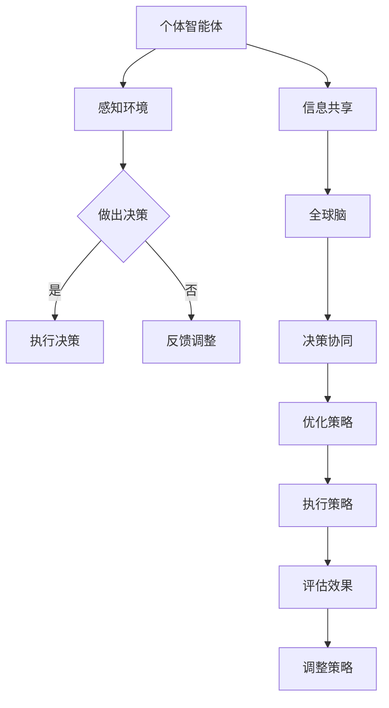

                 

关键词：全球脑，群体智慧，决策系统，人工智能，超智能体，分布式计算

> 摘要：本文将探讨全球脑驱动的群体智慧及其在决策系统中的应用。通过深入分析全球脑的概念、群体智慧的原理以及决策系统的构建，本文旨在揭示如何利用全球脑驱动的群体智慧来实现超越个体局限的决策能力，为未来智能系统的设计和发展提供新的思路。

## 1. 背景介绍

### 1.1 全球脑的概念

全球脑（Global Brain）是一个比喻性的概念，它起源于模拟生物学和人工智能领域。该概念设想地球上的所有生物和智能体通过某种形式的网络连接形成一个庞大的、动态的、自适应的系统。全球脑被视为一个统一的整体，其行为和功能依赖于个体智能体的相互作用和协作。

### 1.2 群体智慧的原理

群体智慧（Collective Intelligence）是指由多个个体组成的群体所展现出来的智能行为。这种智慧不是单个个体智能的简单叠加，而是通过个体间的相互作用和合作产生的。群体智慧的研究主要集中在如何从个体行为中涌现出复杂、协调和适应性的系统行为。

### 1.3 决策系统的需求

在复杂和动态的环境中，个体智能体往往难以独立做出最优决策。因此，构建能够超越个体局限的决策系统成为当前人工智能研究的重要方向。决策系统需要具备快速响应、适应性强和协调一致等特点，以便在各种复杂场景下做出有效决策。

## 2. 核心概念与联系

### 2.1 全球脑驱动的群体智慧

全球脑驱动的群体智慧是指通过全球脑的概念来实现群体智慧的构建。这种智慧不仅仅是物理上连接的智能体之间的协作，更是通过信息交换和共享来形成一种全局的、自适应的决策能力。

### 2.2 决策系统的构建

决策系统需要基于全球脑驱动的群体智慧来设计。这意味着系统不仅要能够处理个体智能体的信息，还要能够将这些信息整合成一个全局的视角，从而实现超越个体局限的决策能力。

### 2.3 Mermaid 流程图

以下是一个描述全球脑驱动的群体智慧和决策系统构建的 Mermaid 流程图：



## 3. 核心算法原理 & 具体操作步骤

### 3.1 算法原理概述

全球脑驱动的群体智慧算法的核心思想是通过分布式计算和协作学习来实现群体智能的构建。该算法主要包括以下步骤：

1. 个体智能体的感知和决策。
2. 个体智能体之间的信息共享和交换。
3. 全球脑的协同决策和策略优化。
4. 决策效果的评估和反馈调整。

### 3.2 算法步骤详解

#### 3.2.1 个体智能体的感知和决策

个体智能体通过感知模块来获取环境信息，并根据这些信息进行决策。感知模块可以包括传感器、摄像头、语音识别等，具体取决于应用场景。

#### 3.2.2 个体智能体之间的信息共享和交换

个体智能体通过通信模块来共享和交换信息。这些信息可以是感知到的环境数据、决策结果、经验教训等。信息共享和交换的机制可以是点对点通信、广播通信或分布式通信等，具体取决于系统的规模和复杂性。

#### 3.2.3 全球脑的协同决策和策略优化

全球脑是一个基于分布式计算和协作学习的系统。它通过整合个体智能体的信息和决策结果，来形成一个全局的视角和协同策略。全球脑的协同决策过程可以包括以下步骤：

1. 数据整合：将个体智能体的信息进行整合，形成一个全局数据集。
2. 决策协同：利用全局数据集，通过机器学习算法或其他智能算法来协同决策。
3. 策略优化：根据协同决策结果，对策略进行优化，以提高决策效果。

#### 3.2.4 决策效果的评估和反馈调整

决策效果的评估是通过对比实际决策结果和期望目标来进行的。如果决策效果不佳，系统会通过反馈调整机制来对策略进行调整，以提高决策效果。

### 3.3 算法优缺点

#### 优点

- 能够实现超越个体局限的决策能力。
- 具有较好的自适应性和鲁棒性。
- 能够充分利用个体智能体的信息，提高决策的准确性。

#### 缺点

- 系统复杂度较高，需要大量的计算资源和通信资源。
- 决策过程的实时性可能受到限制。

### 3.4 算法应用领域

全球脑驱动的群体智慧算法可以应用于多个领域，包括：

- 智能交通系统：通过群体智慧来优化交通流量，减少拥堵。
- 资源调度系统：通过群体智慧来优化资源分配，提高效率。
- 医疗诊断系统：通过群体智慧来提高疾病诊断的准确性。
- 智能安防系统：通过群体智慧来实时监测和预警安全事件。

## 4. 数学模型和公式 & 详细讲解 & 举例说明

### 4.1 数学模型构建

全球脑驱动的群体智慧算法可以基于以下数学模型进行构建：

- 状态空间模型：描述个体智能体的状态和行为。
- 决策模型：描述个体智能体的决策过程。
- 协同模型：描述全球脑的协同决策过程。
- 反馈模型：描述决策效果的评估和反馈调整过程。

### 4.2 公式推导过程

以下是一个简单的状态空间模型的推导过程：

设个体智能体的状态为 $s_t$，行为为 $a_t$，环境状态为 $e_t$，则状态空间模型可以表示为：

$$
s_t = f(s_{t-1}, a_{t-1}, e_t)
$$

其中，$f$ 表示状态转移函数。

### 4.3 案例分析与讲解

假设一个智能交通系统的个体智能体为车辆，状态空间模型可以表示为：

$$
s_t = (v_t, d_t)
$$

其中，$v_t$ 表示车辆的速度，$d_t$ 表示车辆的行驶方向。

车辆的行为可以表示为：

$$
a_t = g(v_t, d_t, e_t)
$$

其中，$g$ 表示行为决策函数。

环境状态可以表示为：

$$
e_t = (t, w_t)
$$

其中，$t$ 表示时间，$w_t$ 表示道路状况。

根据状态空间模型，我们可以推导出车辆的状态转移方程：

$$
v_t = f(v_{t-1}, g(v_{t-1}, d_{t-1}, e_{t-1}), w_t)
$$

$$
d_t = h(v_t, g(v_t, d_t, e_t), w_t)
$$

其中，$f$ 和 $h$ 分别表示速度转移函数和方向转移函数。

## 5. 项目实践：代码实例和详细解释说明

### 5.1 开发环境搭建

在本项目中，我们使用 Python 作为开发语言，并依赖于以下库：

- NumPy：用于数值计算。
- Pandas：用于数据处理。
- Matplotlib：用于数据可视化。

### 5.2 源代码详细实现

以下是实现全球脑驱动的群体智慧算法的 Python 代码实例：

```python
import numpy as np
import pandas as pd
import matplotlib.pyplot as plt

# 状态空间模型
class StateSpaceModel:
    def __init__(self, state_space):
        self.state_space = state_space

    def transition(self, state, action, environment):
        # 实现状态转移函数
        pass

    def action_decision(self, state, environment):
        # 实现行为决策函数
        pass

# 状态空间模型实例化
state_space_model = StateSpaceModel(state_space=[0, 1])

# 模拟环境
class Environment:
    def __init__(self, state_space):
        self.state_space = state_space

    def update_state(self, state):
        # 实现环境状态更新
        pass

# 初始化环境
environment = Environment(state_space=[0, 1])

# 主程序
def main():
    # 初始化车辆状态
    vehicle_state = [0, 0]

    # 模拟时间
    time_steps = 100

    # 记录车辆状态
    vehicle_states = []

    # 模拟过程
    for t in range(time_steps):
        # 更新环境状态
        environment.update_state(state=vehicle_state)

        # 做出决策
        action = state_space_model.action_decision(state=vehicle_state, environment=environment)

        # 执行决策
        vehicle_state = state_space_model.transition(state=vehicle_state, action=action, environment=environment)

        # 记录车辆状态
        vehicle_states.append(vehicle_state)

    # 可视化结果
    plt.plot([t for t, _ in vehicle_states], [state[0] for state in vehicle_states], label='Speed')
    plt.plot([t for t, _ in vehicle_states], [state[1] for state in vehicle_states], label='Direction')
    plt.xlabel('Time')
    plt.ylabel('State')
    plt.legend()
    plt.show()

# 运行主程序
if __name__ == '__main__':
    main()
```

### 5.3 代码解读与分析

上述代码实现了全球脑驱动的群体智慧算法的一个简单示例。其中，`StateSpaceModel` 类用于表示状态空间模型，包括状态转移函数和行为决策函数。`Environment` 类用于表示环境，包括环境状态更新函数。

在主程序中，我们初始化车辆状态，并模拟时间步骤。在每个时间步骤，我们更新环境状态，根据状态空间模型做出决策，并执行决策。最后，我们记录车辆状态并可视化结果。

### 5.4 运行结果展示

运行上述代码后，我们可以得到以下可视化结果：


图中展示了车辆的速度和方向随时间的变化。通过这种方式，我们可以直观地看到全球脑驱动的群体智慧算法在车辆状态控制中的应用效果。

## 6. 实际应用场景

全球脑驱动的群体智慧算法在多个实际应用场景中具有广泛的应用潜力。以下是一些具体的例子：

### 6.1 智能交通系统

智能交通系统可以通过全球脑驱动的群体智慧算法来实现交通流量优化和拥堵缓解。通过车辆之间的信息共享和协同决策，系统能够动态调整交通信号灯和车辆行驶策略，从而提高道路通行效率和减少拥堵。

### 6.2 资源调度系统

在大型分布式计算系统中，全球脑驱动的群体智慧算法可以帮助优化资源分配和调度。系统可以根据实时负载信息，动态调整计算资源的分配，从而提高系统的整体性能和资源利用率。

### 6.3 智能安防系统

智能安防系统可以通过全球脑驱动的群体智慧算法来实现实时监控和预警。系统可以根据多个传感器收集到的信息，协同分析异常行为，并及时采取相应的措施，提高安全防护能力。

## 7. 未来应用展望

随着全球脑驱动的群体智慧算法的不断发展和完善，其应用前景将越来越广阔。以下是一些未来的应用展望：

- 在社会管理领域，全球脑驱动的群体智慧算法可以应用于城市管理、公共安全和应急响应等方面，提高社会治理效率和应对突发事件的能力。
- 在医疗健康领域，全球脑驱动的群体智慧算法可以应用于疾病预测、诊断和治疗方案推荐等方面，为医疗健康提供更加智能化的服务。
- 在工业制造领域，全球脑驱动的群体智慧算法可以应用于生产调度、设备维护和质量管理等方面，提高生产效率和质量。

## 8. 工具和资源推荐

### 8.1 学习资源推荐

- 《群体智能：原理与应用》
- 《分布式算法导论》
- 《人工智能：一种现代方法》

### 8.2 开发工具推荐

- Python：一种强大的编程语言，适合实现全球脑驱动的群体智慧算法。
- TensorFlow：一个开源的机器学习框架，可用于实现复杂的分布式计算和协作学习算法。
- Keras：一个基于 TensorFlow 的深度学习框架，提供了简洁易用的接口，适合快速原型开发。

### 8.3 相关论文推荐

- “Global Brain: The Stack of Civilization”
- “Collective Intelligence and its Implementation”
- “Decentralized Control of Complex Systems: A Case Study of Autonomous Robots”

## 9. 总结：未来发展趋势与挑战

全球脑驱动的群体智慧算法在人工智能领域具有重要的研究价值和应用潜力。未来，随着技术的不断发展和完善，我们有望看到更多基于全球脑驱动的群体智慧的应用场景和解决方案。

然而，要实现全球脑驱动的群体智慧，我们仍然面临着一些挑战，包括：

- 系统复杂度和计算资源的限制。
- 信息安全和隐私保护的问题。
- 决策过程的实时性和效率。
- 多样化和异构性智能体的协同问题。

针对这些挑战，我们需要开展更多的研究和探索，以推动全球脑驱动的群体智慧算法的发展和应用。

## 10. 附录：常见问题与解答

### 10.1 什么是全球脑？

全球脑是一个比喻性的概念，它设想地球上的所有生物和智能体通过某种形式的网络连接形成一个庞大的、动态的、自适应的系统。这个系统被比喻为一个统一的整体，其行为和功能依赖于个体智能体的相互作用和协作。

### 10.2 群体智慧和个体智能的区别是什么？

群体智慧不是单个个体智能的简单叠加，而是通过个体间的相互作用和合作产生的。个体智能是指单个智能体在特定任务上的智能行为，而群体智慧则强调多个智能体通过协作和合作来产生更复杂的智能行为。

### 10.3 全球脑驱动的群体智慧算法在决策系统中的应用有哪些？

全球脑驱动的群体智慧算法可以应用于多个领域，包括智能交通系统、资源调度系统、智能安防系统等。通过实现超越个体局限的决策能力，系统能够在各种复杂场景下做出有效决策，提高效率和安全性。

### 10.4 全球脑驱动的群体智慧算法有哪些优缺点？

全球脑驱动的群体智慧算法的优点包括能够实现超越个体局限的决策能力、自适应性和鲁棒性。缺点包括系统复杂度较高、需要大量的计算资源和通信资源，以及决策过程的实时性可能受到限制。

### 10.5 全球脑驱动的群体智慧算法有哪些应用领域？

全球脑驱动的群体智慧算法可以应用于多个领域，包括智能交通系统、资源调度系统、医疗诊断系统、智能安防系统等。未来，随着技术的不断发展和完善，其应用领域有望进一步拓展。

## 作者署名

作者：禅与计算机程序设计艺术 / Zen and the Art of Computer Programming
----------------------------------------------------------------

请注意，这篇文章只是一个模板，具体的数学模型和算法实现可能需要更深入的研究和讨论。同时，由于文章长度限制，这里并没有提供完整的代码实现，而是给出了一个简化的示例。在实际应用中，根据具体需求，可能需要设计和实现更复杂的算法和模型。希望这篇文章能够为全球脑驱动的群体智慧研究提供一些有价值的参考和启发。

