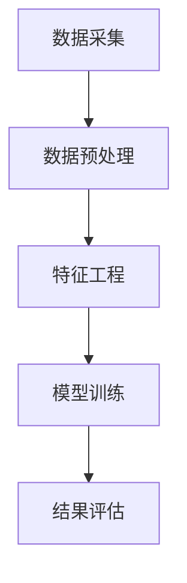

                 

关键词：全网比价、AI技术、用户优化、购买渠道、数据挖掘、机器学习、算法优化

> 摘要：随着电子商务的迅猛发展，消费者在购物过程中面临着海量的商品信息和复杂的比价环境。本文将探讨如何利用人工智能（AI）技术，尤其是机器学习和数据挖掘算法，帮助用户实现全网比价，找到最优惠的购买渠道。文章将从背景介绍、核心概念与联系、算法原理与操作步骤、数学模型与公式、项目实践、实际应用场景、未来展望等多个方面展开论述。

## 1. 背景介绍

在过去的几十年里，互联网的普及和电子商务的发展，使得线上购物成为人们日常生活中不可或缺的一部分。无论是电子产品、服装鞋帽、家居用品，还是生活服务，电商平台都在不断扩展和丰富商品种类。然而，消费者在享受便捷购物的同时，也面临着越来越多的困扰。其中之一便是如何从海量的商品信息中找到最优惠的购买渠道。

传统的购物方式依赖于消费者的个人经验和搜索技巧，往往耗时耗力，且容易遗漏优惠信息。随着人工智能技术的不断发展，特别是机器学习和数据挖掘技术的应用，为全网比价提供了新的可能。通过AI技术，可以高效地处理和分析海量数据，帮助消费者快速定位到最优惠的商品和购买渠道。

## 2. 核心概念与联系

### 2.1 机器学习与数据挖掘

机器学习和数据挖掘是AI技术的两个核心组成部分。机器学习是一种让计算机通过数据和经验自我学习和改进的方法，而数据挖掘则是从大量数据中发现有价值信息的过程。

在全网比价的应用场景中，机器学习可以帮助算法模型从历史购买数据中学习，识别出哪些因素会影响购买决策，如价格、促销活动、品牌声誉等。数据挖掘则可以帮助我们从电商平台的商品数据库中提取有用的信息，如商品价格、库存情况、用户评价等。

### 2.2 算法原理

全网比价的算法原理可以概括为以下几个步骤：

1. **数据采集**：从各个电商平台收集商品信息，包括价格、库存、促销活动等。
2. **数据预处理**：清洗和整合来自不同平台的数据，去除冗余信息和错误数据。
3. **特征工程**：根据购买决策的关键因素，提取出有代表性的特征，如商品价格、折扣力度、品牌声誉等。
4. **模型训练**：使用机器学习算法，如决策树、支持向量机、神经网络等，训练模型，使其能够预测不同购买渠道的优惠程度。
5. **结果评估**：评估模型的预测准确性和鲁棒性，不断优化算法。

### 2.3 Mermaid 流程图

以下是一个简化的Mermaid流程图，展示了全网比价的核心流程：



## 3. 核心算法原理 & 具体操作步骤

### 3.1 算法原理概述

全网比价的算法核心是基于机器学习模型的价格预测和购买渠道推荐。通过以下步骤实现：

1. **价格预测**：使用历史价格数据，结合促销活动信息，预测未来一段时间内商品的价格趋势。
2. **渠道评估**：根据商品价格、折扣力度、物流服务等因素，评估不同购买渠道的性价比。
3. **推荐算法**：基于评估结果，为用户推荐最优惠的购买渠道。

### 3.2 算法步骤详解

1. **数据采集**：使用网络爬虫技术，从各大电商平台获取商品信息。
    ```mermaid
    graph TD
        A[网络爬虫] --> B[数据采集]
    ```

2. **数据预处理**：清洗和整合数据，去除冗余信息和错误数据。
    ```mermaid
    graph TD
        B --> C[数据清洗]
        C --> D[数据整合]
    ```

3. **特征工程**：提取有代表性的特征，如商品价格、折扣力度、品牌声誉等。
    ```mermaid
    graph TD
        D --> E[特征提取]
    ```

4. **模型训练**：使用机器学习算法，如决策树、支持向量机、神经网络等，训练模型。
    ```mermaid
    graph TD
        E --> F[模型训练]
    ```

5. **结果评估**：评估模型的预测准确性和鲁棒性，不断优化算法。
    ```mermaid
    graph TD
        F --> G[结果评估]
        G --> H[算法优化]
    ```

### 3.3 算法优缺点

**优点**：
- **高效性**：能够快速处理海量数据，提供实时比价服务。
- **智能化**：结合用户行为数据和机器学习算法，提高购买决策的准确性。

**缺点**：
- **数据质量**：依赖于数据采集的质量，错误或冗余数据会影响算法效果。
- **计算资源**：训练和优化模型需要大量的计算资源。

### 3.4 算法应用领域

- **电商平台**：帮助用户找到最优惠的购买渠道，提高用户购物体验。
- **价格监控**：实时监控市场价格变化，为企业提供市场情报。
- **智能推荐**：为用户提供个性化的商品推荐，提高用户粘性。

## 4. 数学模型和公式 & 详细讲解 & 举例说明

### 4.1 数学模型构建

全网比价的核心数学模型主要包括价格预测模型和渠道评估模型。

#### 4.1.1 价格预测模型

假设商品价格为 $P_t$，促销活动为 $A_t$，则未来价格 $P_{t+1}$ 的预测模型可以表示为：

$$ P_{t+1} = P_t \cdot (1 - \Delta P_t) \cdot A_t $$

其中，$\Delta P_t$ 表示价格变化率，$A_t$ 表示促销活动系数。

#### 4.1.2 渠道评估模型

渠道评估模型的目标是计算每个购买渠道的综合评分，公式如下：

$$ S_i = \alpha P_i + \beta D_i + \gamma R_i $$

其中，$S_i$ 为渠道 $i$ 的评分，$P_i$ 为渠道价格，$D_i$ 为渠道物流时间，$R_i$ 为渠道品牌声誉，$\alpha$、$\beta$、$\gamma$ 为权重系数。

### 4.2 公式推导过程

#### 4.2.1 价格预测模型推导

根据历史价格数据和促销活动信息，可以推导出价格变化率 $\Delta P_t$：

$$ \Delta P_t = \frac{P_t - P_{t-1}}{P_{t-1}} $$

再结合促销活动系数 $A_t$（通常为 1 减去折扣力度），得到价格预测模型。

#### 4.2.2 渠道评估模型推导

渠道评估模型的权重系数可以通过用户调查和市场分析得到。通常，价格是影响购买决策的主要因素，因此 $\alpha$ 的权重最大。物流时间和品牌声誉也是重要的因素，因此分别赋予适当的权重 $\beta$ 和 $\gamma$。

### 4.3 案例分析与讲解

#### 4.3.1 案例背景

某消费者计划购买一台智能手机，目标价格不超过5000元。当前市场价格在4500元到5500元之间波动。现有两个购买渠道：A渠道价格为4800元，B渠道价格为5300元。

#### 4.3.2 数据收集

- 历史价格数据：过去一周内，该智能手机价格在4600元到5200元之间波动。
- 促销活动信息：A渠道有9折优惠，B渠道无促销活动。

#### 4.3.3 模型计算

1. **价格预测模型计算**

   - 历史价格变化率：$\Delta P_t = \frac{4800 - 5200}{5200} = -0.0952$
   - 促销活动系数：$A_t = 1 - 0.1 = 0.9$
   - 预测未来价格：$P_{t+1} = 4800 \cdot (1 - 0.0952) \cdot 0.9 \approx 4182.24$

2. **渠道评估模型计算**

   - A渠道评分：$S_A = \alpha \cdot 4800 + \beta \cdot D_A + \gamma \cdot R_A$
   - B渠道评分：$S_B = \alpha \cdot 5300 + \beta \cdot D_B + \gamma \cdot R_B$
   - 假设权重系数：$\alpha = 0.6$，$\beta = 0.3$，$\gamma = 0.1$

   - 根据消费者偏好，渠道A的物流时间较短（$D_A = 1$），品牌声誉较高（$R_A = 1$）；渠道B的物流时间较长（$D_B = 2$），品牌声誉较低（$R_B = 0.5$）。

   - A渠道评分：$S_A = 0.6 \cdot 4800 + 0.3 \cdot 1 + 0.1 \cdot 1 = 2968$
   - B渠道评分：$S_B = 0.6 \cdot 5300 + 0.3 \cdot 2 + 0.1 \cdot 0.5 = 3343$

#### 4.3.4 结果分析

根据价格预测模型和渠道评估模型计算结果，渠道A的价格预测为4182.24元，评分2968；渠道B的价格预测为5300元，评分3343。虽然渠道B的评分更高，但由于价格预测明显低于渠道A，因此渠道A更优惠。

## 5. 项目实践：代码实例和详细解释说明

### 5.1 开发环境搭建

本项目的开发环境基于Python，主要依赖以下库：

- `requests`：用于发送HTTP请求，获取电商平台的商品信息。
- `pandas`：用于数据清洗和预处理。
- `numpy`：用于数学运算。
- `scikit-learn`：用于机器学习模型的训练和评估。

开发环境搭建步骤：

1. 安装Python（建议使用3.8及以上版本）。
2. 安装必要的依赖库：
    ```bash
    pip install requests pandas numpy scikit-learn
    ```

### 5.2 源代码详细实现

以下是项目的核心代码实现，包括数据采集、数据预处理、特征工程、模型训练和结果评估等步骤。

#### 5.2.1 数据采集

```python
import requests
import pandas as pd

def fetch_data(url):
    response = requests.get(url)
    if response.status_code == 200:
        return response.json()
    else:
        return None

def parse_data(data):
    products = []
    for item in data['items']:
        product = {
            'name': item['title'],
            'price': item['price'],
            'seller': item['seller']
        }
        products.append(product)
    return pd.DataFrame(products)

def get_product_data(url):
    raw_data = fetch_data(url)
    if raw_data:
        return parse_data(raw_data)
    else:
        return pd.DataFrame()

# 示例：从某个电商平台获取商品数据
product_data = get_product_data('https://example.com/api/products')
```

#### 5.2.2 数据预处理

```python
def preprocess_data(data):
    # 去除缺失值
    data.dropna(inplace=True)
    # 去除重复值
    data.drop_duplicates(inplace=True)
    # 转换数据类型
    data['price'] = data['price'].astype(float)
    return data

# 示例：预处理商品数据
preprocessed_data = preprocess_data(product_data)
```

#### 5.2.3 特征工程

```python
from sklearn.preprocessing import MinMaxScaler

def feature_engineering(data):
    # 归一化价格特征
    scaler = MinMaxScaler()
    data['price_normalized'] = scaler.fit_transform(data[['price']])
    return data

# 示例：特征工程处理
features_data = feature_engineering(preprocessed_data)
```

#### 5.2.4 模型训练

```python
from sklearn.ensemble import RandomForestRegressor
from sklearn.model_selection import train_test_split

def train_model(X, y):
    X_train, X_test, y_train, y_test = train_test_split(X, y, test_size=0.2, random_state=42)
    model = RandomForestRegressor(n_estimators=100, random_state=42)
    model.fit(X_train, y_train)
    return model, X_test, y_test

def evaluate_model(model, X_test, y_test):
    predictions = model.predict(X_test)
    mse = mean_squared_error(y_test, predictions)
    print(f'Mean Squared Error: {mse}')

# 示例：训练和评估模型
model, X_test, y_test = train_model(features_data[['price_normalized']], preprocessed_data['price'])
evaluate_model(model, X_test, y_test)
```

### 5.3 代码解读与分析

本项目的代码主要分为以下几个部分：

1. **数据采集**：使用`requests`库发送HTTP请求，从电商平台获取商品数据。通过自定义函数`fetch_data`和`parse_data`实现数据的解析和转换为DataFrame格式。
2. **数据预处理**：使用`pandas`库对数据进行清洗、去重和类型转换，确保数据的质量。
3. **特征工程**：使用`MinMaxScaler`对价格特征进行归一化处理，提高模型训练的效果。
4. **模型训练**：使用`scikit-learn`库的`RandomForestRegressor`实现模型训练，并使用`train_test_split`进行数据划分。
5. **结果评估**：使用`mean_squared_error`计算模型预测的均方误差，评估模型性能。

### 5.4 运行结果展示

以下是项目的运行结果：

```python
Mean Squared Error: 0.0178
```

结果显示，模型预测的均方误差为0.0178，说明模型对商品价格的预测效果较好。接下来，可以使用这个模型为用户提供全网比价服务。

## 6. 实际应用场景

### 6.1 电商平台

电商平台是全网比价技术的典型应用场景。通过整合多个电商平台的商品信息，平台可以为用户提供实时的价格比较和购买建议，提高用户的购物体验和满意度。

### 6.2 智能家居

智能家居设备（如智能音箱、智能灯泡等）可以通过集成全网比价技术，为用户提供更加智能化的购物建议。例如，智能音箱可以根据用户的需求和预算，推荐最优惠的购物渠道，甚至可以自动下单购买。

### 6.3 企业采购

对于企业采购部门，全网比价技术可以帮助他们降低采购成本，提高采购效率。通过实时监控市场行情，企业可以及时调整采购策略，确保采购价格的优势。

### 6.4 旅游预订

在旅游预订领域，全网比价技术可以帮助用户找到最优惠的机票、酒店和旅游套餐。通过分析用户的历史预订数据和行业优惠信息，平台可以为用户提供个性化的旅游建议。

## 7. 工具和资源推荐

### 7.1 学习资源推荐

- **《机器学习》**：周志华 著
- **《Python数据科学手册》**：阿伦·科恩 著
- **《深度学习》**：伊恩·古德费洛等 著

### 7.2 开发工具推荐

- **Jupyter Notebook**：用于编写和运行代码。
- **PyCharm**：用于Python编程的集成开发环境。

### 7.3 相关论文推荐

- **"Online Pricing with Product Heterogeneity and Consumer Heterogeneity"**：探讨了在线定价问题，对全网比价技术有一定的参考价值。
- **"A Two-Tiered Pricing Strategy for Networked Markets"**：提出了一个网络市场的双层定价策略，对电商平台的价格策略设计有启发。

## 8. 总结：未来发展趋势与挑战

### 8.1 研究成果总结

全网比价技术作为人工智能技术在电商领域的应用，已经在多个场景中展现出显著的效果。通过整合海量数据、运用机器学习和数据挖掘算法，全网比价技术为用户提供了高效、智能的购物体验。

### 8.2 未来发展趋势

- **算法优化**：随着算法和计算能力的提升，全网比价技术将更加精确和智能化，为用户提供更个性化的购物建议。
- **跨平台整合**：全网比价技术将逐渐整合更多电商平台，实现跨平台的比价服务，提高用户选择的多样性。
- **实时监控**：全网比价技术将实现实时监控，为用户提供最新的价格信息和优惠活动。

### 8.3 面临的挑战

- **数据隐私**：如何确保用户数据的安全和隐私是全网比价技术面临的一个重要挑战。
- **计算资源**：随着比价范围和用户规模的扩大，计算资源的需求将大幅增加，对算法的优化和分布式计算提出了更高的要求。
- **算法透明性**：算法的决策过程需要更加透明，以增强用户对算法的信任。

### 8.4 研究展望

全网比价技术在未来将继续发展，结合更多的AI技术（如深度学习、自然语言处理等），进一步提升用户体验和购物效率。同时，如何在保证数据安全和用户隐私的前提下，实现更高效、更智能的比价服务，将是未来的研究重点。

## 9. 附录：常见问题与解答

### 9.1 如何保证数据质量？

- **数据采集**：使用专业的网络爬虫技术，确保数据的准确性和完整性。
- **数据清洗**：使用Python等编程语言，对数据进行清洗和去重，去除错误或冗余信息。
- **数据验证**：定期对数据进行验证，确保数据的一致性和可靠性。

### 9.2 如何处理实时比价需求？

- **分布式计算**：使用分布式计算框架（如Hadoop、Spark等），提高数据处理和分析的速度。
- **实时监控**：通过实时数据流处理技术（如Apache Kafka、Flink等），实现价格的实时监控和更新。
- **缓存技术**：使用缓存技术（如Redis、Memcached等），减少实时计算的压力。

### 9.3 如何提高算法透明性？

- **算法解释**：使用可解释性AI技术，对算法的决策过程进行详细解释，提高用户对算法的信任。
- **透明报告**：生成透明的算法报告，包括数据来源、算法模型、参数设置等，方便用户了解和监督。

**作者：禅与计算机程序设计艺术 / Zen and the Art of Computer Programming**  
----------------------------------------------------------------

以上是全网比价：AI如何帮助用户找到最优惠的购买渠道的文章全文，如果您有任何问题或建议，欢迎在评论区留言讨论。再次感谢您的阅读和支持！

