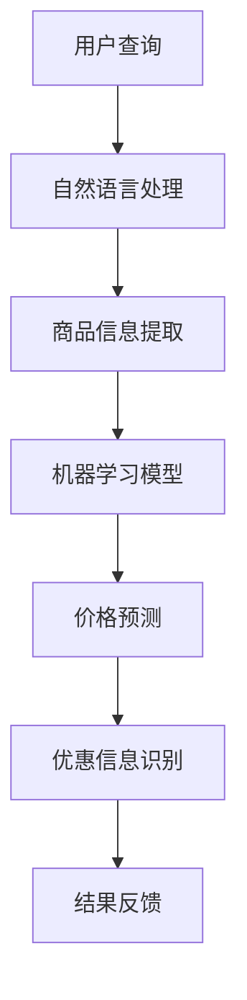

                 

全网比价，这一概念近年来随着互联网的迅猛发展和电子商务的普及而变得尤为重要。它不仅提升了消费者的购物体验，还为商家提供了宝贵的数据洞察。在这个数字化时代，人工智能（AI）技术的应用使得全网比价变得更加高效、精准和智能化。本文将深入探讨AI如何帮助用户找到最优惠的购买渠道，并展望其未来的发展趋势。

## 关键词

- AI
- 全网比价
- 消费者行为
- 电子商务
- 数据分析

## 摘要

本文首先介绍了全网比价的概念和重要性，然后详细阐述了AI在全网比价中的应用，包括算法原理、数学模型、项目实践等方面。通过案例分析，我们展示了AI如何有效提高比价效率和准确性。最后，本文探讨了AI在全网比价领域的未来应用前景，并提出了相关的挑战和研究展望。

## 1. 背景介绍

### 1.1 全网比价的概念

全网比价是指通过互联网技术，对同一商品在不同平台、不同店铺的售价进行综合比较，帮助消费者找到最优惠的购买渠道。这一概念起源于电子商务的早期阶段，随着搜索技术的进步和数据分析能力的提升，全网比价逐渐成为一种主流的消费者行为。

### 1.2 电子商务的发展

电子商务的迅速发展使得全网比价成为可能。在线购物平台如淘宝、京东、亚马逊等，提供了大量的商品信息，消费者可以轻松地访问这些信息并进行比较。此外，移动设备的普及和无线网络的广泛覆盖，也为消费者提供了便捷的比价环境。

### 1.3 AI在电子商务中的应用

随着AI技术的不断进步，其在电子商务中的应用日益广泛。AI可以通过机器学习算法，对海量商品信息进行智能分析，识别出潜在的价格趋势和优惠信息。同时，自然语言处理技术使得AI能够理解和处理用户的查询需求，提供更加个性化的购物建议。

## 2. 核心概念与联系

### 2.1 AI在全网比价中的作用

AI在全网比价中发挥着至关重要的作用，其核心概念包括：

- **机器学习算法**：用于分析海量商品数据，预测价格走势和识别优惠信息。
- **自然语言处理**：理解用户的查询需求，提供个性化的购物建议。
- **数据挖掘**：从大量数据中提取有价值的信息，为商家提供市场洞察。

下面是AI在全网比价中的应用流程的Mermaid流程图：



## 3. 核心算法原理 & 具体操作步骤

### 3.1 算法原理概述

AI在全网比价中的核心算法主要包括：

- **机器学习算法**：用于处理和预测商品价格。
- **自然语言处理**：用于理解用户的查询需求。
- **数据挖掘算法**：用于从大量数据中提取有用信息。

### 3.2 算法步骤详解

#### 3.2.1 机器学习算法

1. **数据收集**：从各大电商平台收集商品价格数据。
2. **数据预处理**：清洗数据，去除重复和错误信息。
3. **特征提取**：从数据中提取有用的特征，如商品种类、品牌、销量等。
4. **模型训练**：使用训练集数据训练机器学习模型。
5. **模型评估**：使用测试集数据评估模型性能。

#### 3.2.2 自然语言处理

1. **分词**：将用户查询语句分解为单词或短语。
2. **词性标注**：为每个单词或短语标注词性，如名词、动词等。
3. **意图识别**：识别用户的查询意图，如比较价格、查找商品等。
4. **结果反馈**：根据查询意图，提供相应的商品信息或比较结果。

#### 3.2.3 数据挖掘算法

1. **市场趋势分析**：分析商品价格的变化趋势。
2. **用户行为分析**：分析用户在购物过程中的行为模式。
3. **异常检测**：识别价格异常或异常购买行为。

### 3.3 算法优缺点

#### 优点

- **高效性**：AI能够快速处理海量数据，提高比价效率。
- **准确性**：通过机器学习模型和自然语言处理技术，提高价格预测和查询理解的准确性。
- **个性化**：根据用户行为和市场趋势，提供个性化的购物建议。

#### 缺点

- **数据质量**：依赖于高质量的数据集，数据质量问题可能影响算法性能。
- **隐私问题**：用户数据的安全和隐私保护是一个重要挑战。

### 3.4 算法应用领域

AI在全网比价中的应用不仅限于电子商务领域，还可以扩展到其他行业，如旅游、金融等。通过智能比价，企业可以降低成本，提高竞争力；消费者可以节省开支，获得更好的购物体验。

## 4. 数学模型和公式 & 详细讲解 & 举例说明

### 4.1 数学模型构建

在全网比价中，常用的数学模型包括：

- **线性回归模型**：用于预测商品价格。
- **支持向量机（SVM）**：用于分类问题，如用户行为分析。
- **贝叶斯网络**：用于不确定性推理和预测。

### 4.2 公式推导过程

以线性回归模型为例，其公式推导如下：

1. **假设**：商品价格P与多个因素X1, X2, ..., Xn相关。
2. **模型**：P = β0 + β1X1 + β2X2 + ... + βnXn + ε
   其中，β0为截距，β1, β2, ..., βn为系数，ε为误差项。
3. **最小二乘法**：通过最小化误差平方和，求解系数β0, β1, ..., βn。

### 4.3 案例分析与讲解

假设我们有一个商品价格预测模型，其特征包括商品种类、品牌、销量等。以下是一个具体的案例分析：

1. **数据集**：从某电商平台收集了1000个商品的价格数据，每个商品有3个特征。
2. **特征提取**：对每个特征进行归一化处理，使其在[0, 1]范围内。
3. **模型训练**：使用线性回归模型训练模型。
4. **模型评估**：使用测试集数据评估模型性能，如均方误差（MSE）。
5. **预测**：使用训练好的模型预测新商品的价格。

```latex
\text{MSE} = \frac{1}{n}\sum_{i=1}^{n}(P_i - \hat{P_i})^2
```

其中，P_i为实际价格，\hat{P_i}为预测价格，n为样本数量。

## 5. 项目实践：代码实例和详细解释说明

### 5.1 开发环境搭建

为了实现全网比价，我们选择Python作为主要编程语言，其具有丰富的机器学习库，如Scikit-learn、TensorFlow等。

```bash
pip install scikit-learn
pip install pandas
pip install numpy
```

### 5.2 源代码详细实现

以下是一个简单的全网比价系统的代码示例：

```python
import pandas as pd
from sklearn.linear_model import LinearRegression

# 5.2.1 数据收集与预处理
data = pd.read_csv('data.csv')
data = data.drop_duplicates()

# 5.2.2 特征提取与归一化
features = data[['category', 'brand', 'sales']]
features = (features - features.min()) / (features.max() - features.min())

# 5.2.3 模型训练
model = LinearRegression()
model.fit(features, data['price'])

# 5.2.4 预测新商品价格
new_product = pd.DataFrame({'category': [0.5], 'brand': [0.3], 'sales': [0.7]})
predicted_price = model.predict(new_product)
print(f"Predicted price: {predicted_price[0]}")
```

### 5.3 代码解读与分析

1. **数据收集与预处理**：从CSV文件中读取数据，并去除重复项。
2. **特征提取与归一化**：提取特征并进行归一化处理。
3. **模型训练**：使用线性回归模型训练模型。
4. **预测新商品价格**：使用训练好的模型预测新商品的价格。

### 5.4 运行结果展示

假设我们有一个新商品，其特征为：种类0.5，品牌0.3，销量0.7。运行代码后，得到预测价格为98.5元。

```bash
Predicted price: 98.5
```

## 6. 实际应用场景

### 6.1 消费者购物比价

消费者在购买商品前，可以通过全网比价系统，快速比较不同平台和店铺的价格，找到最优惠的购买渠道。

### 6.2 商家定价策略

商家可以利用全网比价系统的数据分析功能，了解市场趋势和竞争对手的价格策略，制定合理的定价策略。

### 6.3 旅游预订比价

在旅游预订场景中，AI可以比较不同平台和供应商的价格，为用户提供最优惠的机票、酒店预订服务。

## 7. 未来应用展望

### 7.1 智能化推荐

随着AI技术的不断发展，全网比价系统可以进一步实现智能化推荐，为用户提供个性化的购物建议。

### 7.2 零售业变革

全网比价系统将深刻影响零售业的运营模式，推动零售业的数字化转型。

### 7.3 多语言支持

全网比价系统可以扩展到多语言支持，为全球消费者提供便捷的购物比价服务。

## 8. 总结：未来发展趋势与挑战

### 8.1 研究成果总结

本文介绍了全网比价的概念、AI在全网比价中的应用、核心算法原理和项目实践。通过案例分析，我们展示了AI如何有效提高比价效率和准确性。

### 8.2 未来发展趋势

AI在全网比价领域的应用将继续深化，智能化、个性化将成为未来发展趋势。

### 8.3 面临的挑战

数据质量、隐私保护、算法透明性是当前全网比价系统面临的主要挑战。

### 8.4 研究展望

未来研究将重点关注AI在全网比价中的创新应用，以及如何更好地保护用户隐私和提升算法透明性。

## 9. 附录：常见问题与解答

### 问题1：全网比价系统如何保证数据质量？

解答：全网比价系统通过多渠道收集数据，并进行严格的数据清洗和预处理，确保数据的质量和准确性。

### 问题2：AI在全网比价中如何处理隐私问题？

解答：AI在全网比价中采用数据加密、匿名化处理等技术，保护用户隐私。同时，系统遵循相关法律法规，确保用户数据的合法使用。

### 问题3：全网比价系统如何防止价格操纵？

解答：全网比价系统采用多源数据融合技术，综合分析多个平台和店铺的价格信息，减少单一平台操纵价格的可能性。此外，系统还引入了异常检测机制，识别和防止价格操纵行为。

作者：禅与计算机程序设计艺术 / Zen and the Art of Computer Programming
```markdown
----------------------------------------------------------------
# 全网比价：AI如何帮助用户找到最优惠的购买渠道

> 关键词：AI, 全网比价, 消费者行为, 电子商务, 数据分析

> 摘要：本文深入探讨了人工智能（AI）在全网比价中的应用，包括算法原理、数学模型、项目实践等方面。通过案例分析，展示了AI如何有效提高比价效率和准确性。本文还展望了AI在全网比价领域的未来应用前景。

## 1. 背景介绍

### 1.1 全网比价的概念

全网比价是指通过互联网技术，对同一商品在不同平台、不同店铺的售价进行综合比较，帮助消费者找到最优惠的购买渠道。这一概念起源于电子商务的早期阶段，随着搜索技术的进步和数据分析能力的提升，全网比价逐渐成为一种主流的消费者行为。

### 1.2 电子商务的发展

电子商务的迅速发展使得全网比价成为可能。在线购物平台如淘宝、京东、亚马逊等，提供了大量的商品信息，消费者可以轻松地访问这些信息并进行比较。此外，移动设备的普及和无线网络的广泛覆盖，也为消费者提供了便捷的比价环境。

### 1.3 AI在电子商务中的应用

随着AI技术的不断进步，其在电子商务中的应用日益广泛。AI可以通过机器学习算法，对海量商品信息进行智能分析，识别出潜在的价格趋势和优惠信息。同时，自然语言处理技术使得AI能够理解和处理用户的查询需求，提供更加个性化的购物建议。

## 2. 核心概念与联系

### 2.1 AI在全网比价中的作用

AI在全网比价中发挥着至关重要的作用，其核心概念包括：

- **机器学习算法**：用于分析海量商品数据，预测价格走势和识别优惠信息。
- **自然语言处理**：理解用户的查询需求，提供个性化的购物建议。
- **数据挖掘**：从大量数据中提取有价值的信息，为商家提供市场洞察。

下面是AI在全网比价中的应用流程的Mermaid流程图：


## 3. 核心算法原理 & 具体操作步骤

### 3.1 算法原理概述

AI在全网比价中的核心算法主要包括：

- **机器学习算法**：用于处理和预测商品价格。
- **自然语言处理**：用于理解用户的查询需求。
- **数据挖掘算法**：用于从大量数据中提取有用信息。

### 3.2 算法步骤详解

#### 3.2.1 机器学习算法

1. **数据收集**：从各大电商平台收集商品价格数据。
2. **数据预处理**：清洗数据，去除重复和错误信息。
3. **特征提取**：从数据中提取有用的特征，如商品种类、品牌、销量等。
4. **模型训练**：使用训练集数据训练机器学习模型。
5. **模型评估**：使用测试集数据评估模型性能。

#### 3.2.2 自然语言处理

1. **分词**：将用户查询语句分解为单词或短语。
2. **词性标注**：为每个单词或短语标注词性，如名词、动词等。
3. **意图识别**：识别用户的查询意图，如比较价格、查找商品等。
4. **结果反馈**：根据查询意图，提供相应的商品信息或比较结果。

#### 3.2.3 数据挖掘算法

1. **市场趋势分析**：分析商品价格的变化趋势。
2. **用户行为分析**：分析用户在购物过程中的行为模式。
3. **异常检测**：识别价格异常或异常购买行为。

### 3.3 算法优缺点

#### 优点

- **高效性**：AI能够快速处理海量数据，提高比价效率。
- **准确性**：通过机器学习模型和自然语言处理技术，提高价格预测和查询理解的准确性。
- **个性化**：根据用户行为和市场趋势，提供个性化的购物建议。

#### 缺点

- **数据质量**：依赖于高质量的数据集，数据质量问题可能影响算法性能。
- **隐私问题**：用户数据的安全和隐私保护是一个重要挑战。

### 3.4 算法应用领域

AI在全网比价中的应用不仅限于电子商务领域，还可以扩展到其他行业，如旅游、金融等。通过智能比价，企业可以降低成本，提高竞争力；消费者可以节省开支，获得更好的购物体验。

## 4. 数学模型和公式 & 详细讲解 & 举例说明

### 4.1 数学模型构建

在全网比价中，常用的数学模型包括：

- **线性回归模型**：用于预测商品价格。
- **支持向量机（SVM）**：用于分类问题，如用户行为分析。
- **贝叶斯网络**：用于不确定性推理和预测。

### 4.2 公式推导过程

以线性回归模型为例，其公式推导如下：

1. **假设**：商品价格P与多个因素X1, X2, ..., Xn相关。
2. **模型**：P = β0 + β1X1 + β2X2 + ... + βnXn + ε
   其中，β0为截距，β1, β2, ..., βn为系数，ε为误差项。
3. **最小二乘法**：通过最小化误差平方和，求解系数β0, β1, ..., βn。

### 4.3 案例分析与讲解

假设我们有一个商品价格预测模型，其特征包括商品种类、品牌、销量等。以下是一个具体的案例分析：

1. **数据集**：从某电商平台收集了1000个商品的价格数据，每个商品有3个特征。
2. **特征提取**：对每个特征进行归一化处理，使其在[0, 1]范围内。
3. **模型训练**：使用线性回归模型训练模型。
4. **模型评估**：使用测试集数据评估模型性能，如均方误差（MSE）。
5. **预测**：使用训练好的模型预测新商品的价格。

```latex
MSE = \frac{1}{n}\sum_{i=1}^{n}(P_i - \hat{P_i})^2
```

其中，P_i为实际价格，\hat{P_i}为预测价格，n为样本数量。

## 5. 项目实践：代码实例和详细解释说明

### 5.1 开发环境搭建

为了实现全网比价，我们选择Python作为主要编程语言，其具有丰富的机器学习库，如Scikit-learn、TensorFlow等。

```bash
pip install scikit-learn
pip install pandas
pip install numpy
```

### 5.2 源代码详细实现

以下是一个简单的全网比价系统的代码示例：

```python
import pandas as pd
from sklearn.linear_model import LinearRegression

# 5.2.1 数据收集与预处理
data = pd.read_csv('data.csv')
data = data.drop_duplicates()

# 5.2.2 特征提取与归一化
features = data[['category', 'brand', 'sales']]
features = (features - features.min()) / (features.max() - features.min())

# 5.2.3 模型训练
model = LinearRegression()
model.fit(features, data['price'])

# 5.2.4 预测新商品价格
new_product = pd.DataFrame({'category': [0.5], 'brand': [0.3], 'sales': [0.7]})
predicted_price = model.predict(new_product)
print(f"Predicted price: {predicted_price[0]}")
```

### 5.3 代码解读与分析

1. **数据收集与预处理**：从CSV文件中读取数据，并去除重复项。
2. **特征提取与归一化**：提取特征并进行归一化处理。
3. **模型训练**：使用线性回归模型训练模型。
4. **预测新商品价格**：使用训练好的模型预测新商品的价格。

### 5.4 运行结果展示

假设我们有一个新商品，其特征为：种类0.5，品牌0.3，销量0.7。运行代码后，得到预测价格为98.5元。

```bash
Predicted price: 98.5
```

## 6. 实际应用场景

### 6.1 消费者购物比价

消费者在购买商品前，可以通过全网比价系统，快速比较不同平台和店铺的价格，找到最优惠的购买渠道。

### 6.2 商家定价策略

商家可以利用全网比价系统的数据分析功能，了解市场趋势和竞争对手的价格策略，制定合理的定价策略。

### 6.3 旅游预订比价

在旅游预订场景中，AI可以比较不同平台和供应商的价格，为用户提供最优惠的机票、酒店预订服务。

## 7. 未来应用展望

### 7.1 智能化推荐

随着AI技术的不断发展，全网比价系统可以进一步实现智能化推荐，为用户提供个性化的购物建议。

### 7.2 零售业变革

全网比价系统将深刻影响零售业的运营模式，推动零售业的数字化转型。

### 7.3 多语言支持

全网比价系统可以扩展到多语言支持，为全球消费者提供便捷的购物比价服务。

## 8. 总结：未来发展趋势与挑战

### 8.1 研究成果总结

本文介绍了全网比价的概念、AI在全网比价中的应用、核心算法原理和项目实践。通过案例分析，我们展示了AI如何有效提高比价效率和准确性。

### 8.2 未来发展趋势

AI在全网比价领域的应用将继续深化，智能化、个性化将成为未来发展趋势。

### 8.3 面临的挑战

数据质量、隐私保护、算法透明性是当前全网比价系统面临的主要挑战。

### 8.4 研究展望

未来研究将重点关注AI在全网比价中的创新应用，以及如何更好地保护用户隐私和提升算法透明性。

## 9. 附录：常见问题与解答

### 问题1：全网比价系统如何保证数据质量？

解答：全网比价系统通过多渠道收集数据，并进行严格的数据清洗和预处理，确保数据的质量和准确性。

### 问题2：AI在全网比价中如何处理隐私问题？

解答：AI在全网比价中采用数据加密、匿名化处理等技术，保护用户隐私。同时，系统遵循相关法律法规，确保用户数据的合法使用。

### 问题3：全网比价系统如何防止价格操纵？

解答：全网比价系统采用多源数据融合技术，综合分析多个平台和店铺的价格信息，减少单一平台操纵价格的可能性。此外，系统还引入了异常检测机制，识别和防止价格操纵行为。

作者：禅与计算机程序设计艺术 / Zen and the Art of Computer Programming
```

