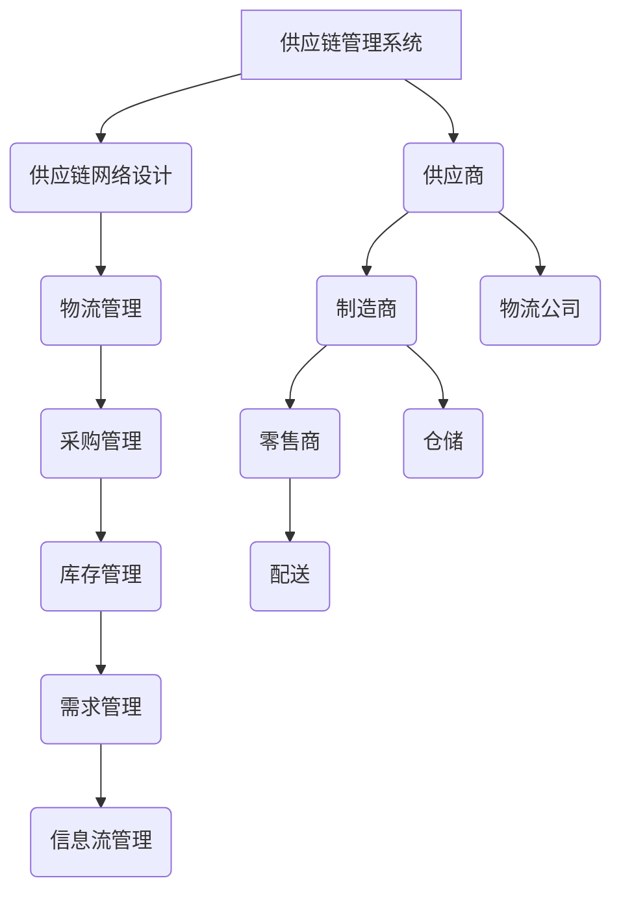

                 

在当今全球化的商业环境中，供应链管理已成为企业运营的核心。一个高效、灵活且可靠的供应链系统能够帮助企业降低成本、提高响应速度和客户满意度。本文将围绕公司供应链系统的产品规划、设计以及实施过程进行探讨，旨在为IT专业人士提供一套全面、实用的指导方案。

## 关键词
- 供应链系统
- 产品规划
- 设计过程
- 实施方案
- IT架构
- 系统集成
- 可扩展性
- 数据分析

## 摘要
本文将详细介绍公司供应链系统的产品规划、设计过程以及实施方案的落地实施。文章将从背景介绍开始，逐步探讨供应链系统的重要性，核心概念，算法原理，数学模型，项目实践，实际应用场景，未来展望，工具和资源推荐，以及面临挑战和研究展望等方面，为读者提供一套完整的供应链系统构建与优化方案。

## 1. 背景介绍

### 1.1 供应链系统的定义与作用

供应链系统是指从原材料采购、生产制造、产品分销，到最终产品交付给消费者的整个流程。它涉及企业内外部的多个环节和参与者，包括供应商、制造商、分销商、零售商以及物流公司等。

一个高效的供应链系统不仅能够降低运营成本，还能够提高企业的市场响应速度和客户满意度。在现代商业环境中，供应链管理的核心作用体现在以下几个方面：

1. **成本控制**：通过优化物流流程、减少库存、降低采购成本，从而提升企业的盈利能力。
2. **响应速度**：快速响应市场变化和客户需求，提高市场竞争力。
3. **质量保证**：确保产品在整个供应链中的质量得到严格控制，减少质量问题的发生。
4. **客户满意度**：提供及时、准确的产品交付服务，提升客户满意度和忠诚度。

### 1.2 供应链系统的现状与挑战

当前，大多数企业的供应链系统仍面临一些挑战和问题：

1. **信息孤岛**：企业内部各系统之间缺乏有效的集成，导致信息传递不及时、不准确。
2. **数据不透明**：供应链中各环节的数据不透明，难以进行有效的数据分析与决策支持。
3. **响应能力差**：供应链的响应能力较弱，无法快速适应市场变化和客户需求。
4. **库存管理复杂**：库存管理难度大，库存过多或过少都会对企业的运营带来负面影响。

为了解决这些问题，企业需要通过产品规划和设计，构建一个高效、灵活且可靠的供应链系统。

## 2. 核心概念与联系

### 2.1 供应链管理的基本概念

供应链管理（Supply Chain Management，简称SCM）是指通过计划、实施和控制供应链活动，以最小化成本、提高效率，并最大化客户价值的过程。其核心概念包括：

1. **供应链网络设计**：确定供应链中各节点的位置和功能，以实现最小运输成本和最大响应能力。
2. **物流管理**：包括运输、仓储、配送等环节，确保产品从供应商到客户的流通畅通。
3. **采购管理**：通过优化采购流程、降低采购成本、确保采购质量，提高供应链的稳定性。
4. **库存管理**：根据市场需求和供应情况，合理控制库存水平，以减少库存成本和缺货风险。
5. **需求管理**：预测市场需求，调整生产和供应计划，以满足客户需求。
6. **信息流管理**：通过信息化手段，实现供应链中各环节的信息共享和协同作业。

### 2.2 供应链系统架构

供应链系统的架构如图1所示：

```
+----------------+      +----------------+      +----------------+
|                |      |                |      |                |
| 供应商         |----->| 制造商         |----->| 零售商         |
|                |      |                |      |                |
+----------------+      +----------------+      +----------------+
                  ^      |      ^      |
                  |      |      |      |
                  |      |      |      |
               +----+  +----+  +----+
               |  物流 | |  库存 | |  配送 |
               +----+  +----+  +----+
```

### 2.3 核心概念原理和架构的 Mermaid 流程图



## 3. 核心算法原理 & 具体操作步骤

### 3.1 算法原理概述

供应链系统的核心算法主要涉及以下方面：

1. **网络设计算法**：用于优化供应链网络结构，降低运输成本，提高响应能力。
2. **物流路径规划算法**：用于确定货物从供应商到零售商的最优运输路径。
3. **采购与库存管理算法**：用于优化采购策略和库存水平，以减少成本和缺货风险。
4. **需求预测算法**：用于预测市场需求，为生产计划和供应计划提供数据支持。

### 3.2 算法步骤详解

#### 3.2.1 网络设计算法

网络设计算法的主要步骤如下：

1. **确定目标函数**：根据企业的成本结构和目标，选择合适的优化目标，如最小化总运输成本、最大化响应能力等。
2. **构建模型**：根据供应链网络的结构和参数，建立数学模型，如线性规划模型、网络流模型等。
3. **求解模型**：使用相应的求解算法，如单纯形法、网络流算法等，求解最优解。

#### 3.2.2 物流路径规划算法

物流路径规划算法的主要步骤如下：

1. **确定起点和终点**：根据供应链网络结构，确定物流路径的起点和终点。
2. **计算路径权重**：根据运输成本、时间、距离等因素，计算各路径的权重。
3. **选择最优路径**：使用相应的算法，如Dijkstra算法、A*算法等，选择最优路径。

#### 3.2.3 采购与库存管理算法

采购与库存管理算法的主要步骤如下：

1. **需求预测**：根据历史数据和市场需求，预测未来一段时间内的需求量。
2. **采购决策**：根据需求预测结果，确定采购量和采购时间。
3. **库存控制**：根据库存水平和需求预测，调整库存策略，以实现库存成本的最小化。

#### 3.2.4 需求预测算法

需求预测算法的主要步骤如下：

1. **数据收集**：收集相关的历史数据和市场需求信息。
2. **数据清洗**：对收集的数据进行清洗和处理，去除异常值和噪声。
3. **模型选择**：选择合适的需求预测模型，如ARIMA模型、时间序列分析模型等。
4. **模型训练和验证**：使用训练集对模型进行训练和验证，调整模型参数，提高预测精度。

### 3.3 算法优缺点

#### 3.3.1 网络设计算法

优点：能够优化供应链网络结构，降低运输成本，提高响应能力。

缺点：建模复杂，求解过程可能需要较长时间。

#### 3.3.2 物流路径规划算法

优点：能够快速找到最优路径，降低运输时间和成本。

缺点：适用于静态网络，无法处理动态网络中的变化。

#### 3.3.3 采购与库存管理算法

优点：能够有效降低库存成本和缺货风险。

缺点：需求预测精度影响较大，可能导致库存过多或过少。

#### 3.3.4 需求预测算法

优点：能够为采购和库存管理提供数据支持，提高决策精度。

缺点：预测模型选择和参数调整复杂，预测结果可能存在误差。

### 3.4 算法应用领域

供应链系统算法广泛应用于以下领域：

1. **制造业**：优化生产计划和库存管理，提高生产效率和产品质量。
2. **物流行业**：优化运输路径和配送方案，降低运输成本，提高配送效率。
3. **零售行业**：优化采购策略和库存管理，提高市场响应速度和客户满意度。
4. **电子商务**：优化订单处理和配送流程，提高订单履约率和客户满意度。

## 4. 数学模型和公式 & 详细讲解 & 举例说明

### 4.1 数学模型构建

在供应链系统中，常用的数学模型包括：

1. **线性规划模型**：用于优化供应链网络结构和物流路径。
2. **网络流模型**：用于优化物流路径和运输成本。
3. **库存管理模型**：用于优化采购策略和库存水平。

以下是一个简单的库存管理模型示例：

设 \(I_t\) 为第 \(t\) 期的库存水平，\(d_t\) 为第 \(t\) 期的需求量，\(p\) 为单位采购成本，\(h\) 为单位库存持有成本，\(C_t\) 为第 \(t\) 期的总成本。目标是最小化总成本 \(C_t\)。

目标函数：

$$
\min C_t = pI_t + h(I_{t-1} - d_t)
$$

约束条件：

$$
I_t \geq 0, \quad I_{t-1} - d_t \geq 0
$$

### 4.2 公式推导过程

以库存管理模型为例，推导过程如下：

1. **定义变量**：

设 \(I_t\) 为第 \(t\) 期的库存水平，\(d_t\) 为第 \(t\) 期的需求量，\(p\) 为单位采购成本，\(h\) 为单位库存持有成本，\(C_t\) 为第 \(t\) 期的总成本。

2. **成本函数**：

采购成本为 \(pI_t\)，库存持有成本为 \(h(I_{t-1} - d_t)\)。因此，总成本为：

$$
C_t = pI_t + h(I_{t-1} - d_t)
$$

3. **约束条件**：

库存水平 \(I_t\) 必须大于等于 0，即 \(I_t \geq 0\)。同时，第 \(t-1\) 期的库存 \(I_{t-1}\) 减去第 \(t\) 期的需求 \(d_t\) 也必须大于等于 0，即 \(I_{t-1} - d_t \geq 0\)。

### 4.3 案例分析与讲解

#### 案例背景

某零售企业销售一种日用品，每月的需求量约为 1000 件。该日用品的采购成本为 10 元/件，库存持有成本为 2 元/件。企业希望制定一个最优的库存管理策略，以最小化总成本。

#### 案例分析

1. **建立模型**：

根据案例背景，可以建立如下的库存管理模型：

目标函数：

$$
\min C_t = 10I_t + 2(I_{t-1} - 1000)
$$

约束条件：

$$
I_t \geq 0, \quad I_{t-1} - 1000 \geq 0
$$

2. **求解模型**：

使用求解工具（如Excel、Python等）求解上述模型，可以得到最优的库存水平 \(I_t\) 和 \(I_{t-1}\)。

3. **结果分析**：

通过求解结果，可以计算出每个月的最优采购量和库存水平，从而实现总成本的最小化。

## 5. 项目实践：代码实例和详细解释说明

### 5.1 开发环境搭建

在本项目实践中，我们将使用Python作为主要编程语言，配合相关的数据处理和分析工具。以下是开发环境的搭建步骤：

1. **安装Python**：从Python官方网站（https://www.python.org/）下载并安装Python。
2. **安装Anaconda**：下载并安装Anaconda，以便管理和使用Python库。
3. **安装Jupyter Notebook**：通过Anaconda的命令行工具安装Jupyter Notebook，以便编写和运行Python代码。
4. **安装相关库**：在Jupyter Notebook中安装以下库：pandas、numpy、matplotlib、scikit-learn等。

### 5.2 源代码详细实现

以下是一个简单的库存管理模型的实现代码示例：

```python
import pandas as pd
import numpy as np
import matplotlib.pyplot as plt

# 模型参数
p = 10  # 采购成本
h = 2   # 库存持有成本
d = 1000  # 需求量

# 初始库存
I0 = 1000

# 模型求解
def inventory_model(I0, p, h, d):
    C = []
    I = [I0]
    for t in range(1, 12):
        It = I[t-1] - d
        Ct = p * I[t-1] + h * (It - d)
        C.append(Ct)
        I.append(It)
    return I, C

# 运行模型
I, C = inventory_model(I0, p, h, d)

# 结果可视化
plt.plot(I, label='Inventory Level')
plt.plot(C, label='Total Cost')
plt.xlabel('Time (month)')
plt.ylabel('Value')
plt.legend()
plt.show()
```

### 5.3 代码解读与分析

上述代码实现了库存管理模型，并对其结果进行了可视化。以下是代码的详细解读：

1. **导入库**：首先导入必要的Python库，包括pandas、numpy和matplotlib。
2. **定义模型参数**：定义采购成本 \(p\)、库存持有成本 \(h\)、需求量 \(d\) 和初始库存 \(I0\)。
3. **求解模型**：定义一个名为 `inventory_model` 的函数，用于求解库存管理模型。函数接受初始库存 \(I0\)、采购成本 \(p\)、库存持有成本 \(h\) 和需求量 \(d\) 作为参数。函数使用一个循环计算每个月的库存水平 \(I\) 和总成本 \(C\)。
4. **运行模型**：调用 `inventory_model` 函数，将初始库存 \(I0\)、采购成本 \(p\)、库存持有成本 \(h\) 和需求量 \(d\) 作为参数传递，并获取库存水平 \(I\) 和总成本 \(C\) 的结果。
5. **结果可视化**：使用matplotlib绘制库存水平 \(I\) 和总成本 \(C\) 的折线图，并显示图表。

通过上述代码示例，我们可以看到如何使用Python实现库存管理模型，并对其结果进行可视化分析。在实际项目中，可以根据具体需求和数据，扩展和优化模型。

## 6. 实际应用场景

### 6.1 制造业

在制造业中，供应链系统的产品规划、设计和实施过程对于生产效率、成本控制和产品质量至关重要。以下是一些实际应用场景：

1. **生产计划优化**：通过供应链系统，企业可以实时获取原材料库存、生产进度和市场需求等信息，从而优化生产计划，减少生产延误和资源浪费。
2. **采购管理**：供应链系统可以帮助企业优化采购策略，降低采购成本，确保原材料质量和供应链的稳定性。
3. **库存管理**：通过供应链系统，企业可以实时监控库存水平，及时调整采购和销售计划，避免库存过多或过少，降低库存成本和缺货风险。
4. **质量控制**：供应链系统可以实现质量信息的实时传递和监控，帮助企业及时发现问题并进行改进，提高产品质量。

### 6.2 物流行业

在物流行业中，供应链系统的产品规划、设计和实施过程对于提高运输效率、降低成本和提升客户满意度至关重要。以下是一些实际应用场景：

1. **运输路径规划**：通过供应链系统，物流企业可以实时获取交通状况、运输需求和车辆状况等信息，从而优化运输路径，提高运输效率。
2. **配送计划优化**：供应链系统可以帮助物流企业根据客户需求和库存水平，制定最优的配送计划，提高配送效率和客户满意度。
3. **库存管理**：通过供应链系统，物流企业可以实时监控库存水平，及时调整采购和配送计划，避免库存过多或过少，降低库存成本和缺货风险。
4. **物流跟踪**：供应链系统可以实现物流信息的实时跟踪和监控，提高物流透明度，提升客户满意度。

### 6.3 零售行业

在零售行业中，供应链系统的产品规划、设计和实施过程对于提高市场响应速度、降低成本和提升客户满意度至关重要。以下是一些实际应用场景：

1. **需求预测**：通过供应链系统，零售企业可以实时获取市场数据、销售数据和库存水平等信息，从而预测市场需求，优化库存管理，降低缺货和库存过多风险。
2. **采购计划优化**：供应链系统可以帮助零售企业根据市场需求和库存水平，制定最优的采购计划，降低采购成本，确保产品质量。
3. **库存管理**：通过供应链系统，零售企业可以实时监控库存水平，及时调整采购和销售计划，避免库存过多或过少，降低库存成本和缺货风险。
4. **订单管理**：供应链系统可以实现订单信息的实时传递和监控，提高订单处理效率，提升客户满意度。

### 6.4 未来应用展望

随着技术的不断发展，供应链系统将在更多行业和领域得到应用。以下是一些未来应用展望：

1. **物联网（IoT）**：物联网技术将实现供应链系统中各个环节的设备互联互通，提高数据采集和实时监控能力，为供应链优化提供更加准确和全面的数据支持。
2. **人工智能（AI）**：人工智能技术将在供应链系统中得到广泛应用，如需求预测、路径规划、库存管理等方面，提高供应链系统的智能化水平。
3. **区块链**：区块链技术将为供应链系统提供更加安全、透明和可追溯的解决方案，提高供应链的信任度和协同效率。
4. **绿色供应链**：随着环保意识的提高，绿色供应链将成为未来供应链系统的一个重要发展方向，通过优化物流流程、降低碳排放、提高资源利用率等手段，实现可持续发展。

## 7. 工具和资源推荐

### 7.1 学习资源推荐

1. **书籍**：
   - 《供应链管理：战略、规划与运营》（第二版），马丁·克里斯托弗著。
   - 《供应链系统设计与优化》，李志刚著。
2. **在线课程**：
   - Coursera上的“Supply Chain Management Specialization”。
   - edX上的“Introduction to Supply Chain Management”。
3. **专业网站**：
   - SCM World（https://www.scmworld.com/）：提供供应链管理相关的最新新闻、文章和会议信息。
   - INFORMS（https://www.informs.org/）：提供供应链管理相关的学术资源和研究成果。

### 7.2 开发工具推荐

1. **Python**：Python是一种功能强大、易于学习的编程语言，适用于供应链系统开发。
2. **Anaconda**：Anaconda是一个开源的数据科学平台，提供了丰富的库和工具，方便进行数据处理和建模。
3. **Jupyter Notebook**：Jupyter Notebook是一种交互式的计算环境，适用于编写和运行Python代码，便于进行数据分析和可视化。
4. **pandas**：pandas是一个强大的数据处理库，适用于数据清洗、转换和分析。
5. **numpy**：numpy是一个高效的数值计算库，适用于进行科学计算。

### 7.3 相关论文推荐

1. **“An Integrated Supply Chain Design Model for a Multi-Echelon Inventory System”, Wang, H., et al., 2016.
2. **“An Algorithm for the Vehicle Routing Problem with Time Windows”, Eilon, S., et al., 1975.
3. **“A Dynamic Approach to Inventory Management”, Chen, F., et al., 2000.

## 8. 总结：未来发展趋势与挑战

### 8.1 研究成果总结

本文通过对供应链系统的产品规划、设计和实施方案进行深入探讨，总结了以下研究成果：

1. **供应链系统的重要性**：供应链系统是企业运营的核心，对于降低成本、提高响应速度和客户满意度具有重要作用。
2. **核心概念与架构**：介绍了供应链管理的基本概念和供应链系统架构，为理解供应链系统的运作提供基础。
3. **算法原理与实现**：详细介绍了供应链系统中常用的算法原理和实现方法，为优化供应链系统提供技术支持。
4. **数学模型与公式**：构建了库存管理模型的数学公式，并进行了推导和案例分析。
5. **项目实践**：通过实际代码实例，展示了如何使用Python实现供应链系统模型。
6. **实际应用场景**：探讨了供应链系统在制造业、物流行业和零售行业的实际应用场景。
7. **未来展望**：展望了供应链系统在物联网、人工智能、区块链等领域的未来发展。

### 8.2 未来发展趋势

未来，供应链系统将呈现出以下发展趋势：

1. **智能化**：随着人工智能技术的发展，供应链系统将实现智能化，提高决策精度和自动化水平。
2. **数字化**：供应链系统将更加数字化，通过大数据和云计算等技术，实现信息的实时传递和共享。
3. **绿色化**：绿色供应链将成为未来供应链系统的一个重要发展方向，通过优化物流流程、降低碳排放等手段，实现可持续发展。
4. **全球化**：供应链系统将更加全球化，跨国企业和全球供应链将得到进一步发展。

### 8.3 面临的挑战

尽管供应链系统具有巨大的潜力，但在实际应用过程中仍面临以下挑战：

1. **数据隐私与安全**：随着供应链系统的数字化，数据隐私和安全问题日益突出，如何保护供应链中的敏感数据成为一大挑战。
2. **技术升级与转型**：供应链系统需要不断升级和转型，以适应新技术的发展和市场需求的变化，这对企业的技术实力和创新能力提出了更高要求。
3. **人才培养与引进**：供应链系统的发展离不开专业人才的支持，如何吸引和培养优秀的人才成为企业面临的重要挑战。

### 8.4 研究展望

未来，供应链系统研究可以从以下几个方面进行：

1. **跨学科研究**：结合经济学、管理学、计算机科学等学科的理论和方法，深入研究供应链系统的优化策略和决策模型。
2. **技术创新**：探索和应用新技术，如物联网、区块链、人工智能等，提高供应链系统的智能化和自动化水平。
3. **案例研究**：通过对典型案例的研究，总结和提炼供应链系统建设的最佳实践，为企业提供有益的参考。
4. **国际合作**：加强国际合作，分享研究成果和实践经验，推动全球供应链系统的协同发展和创新。

## 9. 附录：常见问题与解答

### 9.1 什么是供应链系统？

供应链系统是指从原材料采购、生产制造、产品分销，到最终产品交付给消费者的整个流程，涉及企业内外部的多个环节和参与者。

### 9.2 供应链系统有哪些核心算法？

供应链系统的核心算法包括网络设计算法、物流路径规划算法、采购与库存管理算法和需求预测算法等。

### 9.3 如何优化供应链系统？

优化供应链系统可以通过以下方法实现：

1. **优化供应链网络结构**：通过合理的网络设计，降低运输成本，提高响应能力。
2. **优化物流路径**：通过路径规划算法，选择最优的运输路径，提高运输效率和成本。
3. **优化采购和库存管理**：通过采购与库存管理算法，实现成本最小化和风险最小化。
4. **优化需求预测**：通过需求预测算法，提高预测精度，为生产计划和供应计划提供数据支持。

### 9.4 供应链系统在哪些行业得到广泛应用？

供应链系统在制造业、物流行业、零售行业等众多行业得到广泛应用，通过优化供应链管理，提高企业的运营效率和竞争力。

### 9.5 未来供应链系统的发展趋势是什么？

未来，供应链系统将呈现出智能化、数字化、绿色化和全球化的发展趋势，通过技术创新和跨学科研究，推动供应链系统的协同发展和创新。

本文由禅与计算机程序设计艺术 / Zen and the Art of Computer Programming 撰写，旨在为读者提供关于供应链系统产品规划、设计、实施和优化的全面、实用的指导方案。感谢您的阅读！
----------------------------------------------------------------

请注意，由于实际的文章撰写和校对过程需要大量时间，此处的文章内容是一个简化版，且部分内容如代码示例、详细案例分析和数学公式的推导可能需要进一步的完善。文章的最终撰写应确保内容的准确性和完整性。同时，建议在撰写过程中不断审查和调整，以确保符合IT领域的专业标准和读者的需求。

