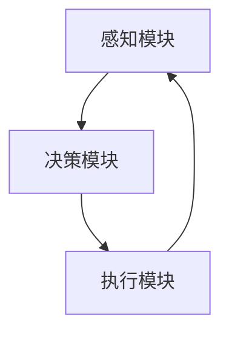

                 

关键词：内置 Agents、LLM 功能扩展、函数库、人工智能、自然语言处理、软件架构

摘要：本文探讨了内置 Agents 在扩展大型语言模型（LLM）功能方面的作用。通过介绍内置 Agents 的核心概念、算法原理、数学模型，以及项目实践，文章旨在为读者提供一套实用的方法，以构建强大的、自适应的智能系统。

## 1. 背景介绍

近年来，人工智能（AI）领域取得了显著的进展，尤其是在自然语言处理（NLP）领域。大型语言模型（LLM）如 GPT-3、BERT 等，通过深度学习技术，能够理解并生成复杂的文本内容。然而，尽管 LLM 在文本生成、摘要、问答等方面表现出色，但它们的表达能力仍受限于预设的架构和训练数据。为了进一步扩展 LLM 的功能，提高其灵活性和适应性，内置 Agents 的概念应运而生。

内置 Agents 是一种在 LLM 中嵌入的智能实体，能够与环境交互，并根据交互结果调整自身的行为。通过这种方式，内置 Agents 可以实现更加复杂的任务，如自动化问答系统、智能客服、甚至自定义应用场景的构建。

## 2. 核心概念与联系

### 2.1. 内置 Agents 的定义

内置 Agents 是指在大型语言模型（LLM）中嵌入的智能实体，其能够理解自然语言输入，并生成相应的响应。与传统的软件代理（Software Agent）相比，内置 Agents 更加紧密地与 LLM 相结合，能够充分利用 LLM 的强大语言处理能力。

### 2.2. 内置 Agents 与 LLM 的联系

内置 Agents 的核心功能是扩展 LLM 的功能，使其能够更好地适应特定场景。具体来说，内置 Agents 通过以下方式与 LLM 联系：

- **输入处理**：内置 Agents 接收自然语言输入，并将其转换为 LLM 能够理解的形式。
- **输出生成**：内置 Agents 根据 LLM 生成的响应，对其进行进一步的加工和处理，以生成更加符合实际需求的输出。
- **动态调整**：内置 Agents 能够根据与环境的交互结果，动态调整自身的参数和行为，以提高任务完成率。

### 2.3. 内置 Agents 的架构

内置 Agents 的架构主要包括以下三个部分：

- **感知模块**：负责接收自然语言输入，并对其进行预处理。
- **决策模块**：基于 LLM 的输出，内置 Agents 的决策模块负责生成相应的响应。
- **执行模块**：根据决策模块的指示，执行相应的操作，并与环境进行交互。

下面是一个简化的 Mermaid 流程图，描述了内置 Agents 的架构：



## 3. 核心算法原理 & 具体操作步骤

### 3.1. 算法原理概述

内置 Agents 的核心算法是基于强化学习（Reinforcement Learning，RL）和自然语言处理（NLP）技术。通过在 LLM 中嵌入一个强化学习模型，内置 Agents 能够根据与环境的交互，不断学习和调整自身的行为。

具体来说，内置 Agents 的算法原理如下：

1. **状态编码**：将自然语言输入编码为一种适合于 LLM 处理的向量表示。
2. **决策生成**：基于 LLM 的输出，强化学习模型生成相应的决策。
3. **行为执行**：根据决策，内置 Agents 执行相应的操作，并与环境进行交互。
4. **奖励评估**：根据内置 Agents 的行为结果，评估其行为的奖励，以指导下一步的行为。

### 3.2. 算法步骤详解

1. **初始化**：设置内置 Agents 的初始状态，包括感知模块、决策模块和执行模块的初始参数。
2. **输入处理**：接收自然语言输入，并使用预训练的 LLM 对其进行编码。
3. **决策生成**：基于 LLM 的输出，强化学习模型生成相应的决策。
4. **行为执行**：根据决策，执行相应的操作，并与环境进行交互。
5. **奖励评估**：根据内置 Agents 的行为结果，评估其行为的奖励。
6. **参数更新**：根据奖励评估结果，更新强化学习模型的参数，以指导下一轮的决策。
7. **循环**：重复步骤 2-6，直到达到预定的停止条件。

### 3.3. 算法优缺点

**优点**：

- **灵活性**：内置 Agents 能够根据与环境的交互，动态调整自身的行为，具有很高的灵活性。
- **自适应**：内置 Agents 能够通过强化学习技术，不断提高自身的性能，具有很好的自适应能力。
- **扩展性**：内置 Agents 可以嵌入到各种 LLM 中，实现多种多样的应用。

**缺点**：

- **计算成本**：内置 Agents 的训练和运行需要大量的计算资源，可能导致性能开销较大。
- **依赖性**：内置 Agents 的性能高度依赖于 LLM 的质量和训练数据，可能存在一定的依赖性。

### 3.4. 算法应用领域

内置 Agents 在多个领域具有广泛的应用前景，包括：

- **自动化问答系统**：通过内置 Agents，可以实现更加智能的问答系统，提高用户满意度。
- **智能客服**：内置 Agents 可以模拟人类客服，为用户提供个性化的服务。
- **智能推荐系统**：内置 Agents 可以根据用户的交互历史，生成个性化的推荐内容。
- **游戏智能体**：内置 Agents 可以用于构建游戏中的智能角色，提高游戏的可玩性。

## 4. 数学模型和公式 & 详细讲解 & 举例说明

### 4.1. 数学模型构建

内置 Agents 的核心算法基于马尔可夫决策过程（Markov Decision Process，MDP）。在 MDP 中，状态空间 \(S\)、动作空间 \(A\) 和奖励函数 \(R\) 是关键组成部分。

假设内置 Agents 处于状态 \(s\)，并选择动作 \(a\)，则下一个状态 \(s'\) 和奖励 \(r\) 可以表示为：

\[ s' = f(s, a) \]
\[ r = g(s, a, s') \]

其中，\(f\) 和 \(g\) 分别表示状态转移函数和奖励函数。

### 4.2. 公式推导过程

为了最大化长期奖励，内置 Agents 需要选择最优动作 \(a^*\)。根据 Bellman 方程，最优动作满足以下条件：

\[ V^*(s) = \max_a \{ R(s, a) + \gamma V^*(s') \} \]

其中，\(V^*(s)\) 表示从状态 \(s\) 开始，执行最优策略所能获得的期望回报，\(\gamma\) 表示折扣因子。

为了求解最优动作 \(a^*\)，可以使用值迭代（Value Iteration）或策略迭代（Policy Iteration）方法。

### 4.3. 案例分析与讲解

假设一个智能客服系统，内置 Agents 需要回答用户的问题。状态空间 \(S = \{\text{未知问题类型}, \text{问题类型A}, \text{问题类型B}, \ldots\}\)，动作空间 \(A = \{\text{提供帮助}, \text{询问更多细节}, \ldots\}\)。

在初始状态 \(s = \text{未知问题类型}\)，内置 Agents 选择动作 \(a = \text{询问更多细节}\)，用户回复 \(s' = \text{问题类型A}\)，奖励 \(r = 1\)。

根据 Bellman 方程，内置 Agents 的期望回报为：

\[ V^*(\text{未知问题类型}) = 1 + \gamma V^*(\text{问题类型A}) \]

通过迭代计算，可以求解出最优动作 \(a^*\)。

## 5. 项目实践：代码实例和详细解释说明

### 5.1. 开发环境搭建

为了实现内置 Agents 的功能，我们需要搭建一个合适的开发环境。以下是所需的开发环境和工具：

- Python 3.8 或更高版本
- TensorFlow 2.4 或更高版本
- Transformers 库
- Gym 环境

### 5.2. 源代码详细实现

以下是内置 Agents 的基本实现代码：

```python
import numpy as np
import tensorflow as tf
from transformers import TFAutoModelForCausalLM
from gym import make

# 加载预训练的 LLM
model = TFAutoModelForCausalLM.from_pretrained("gpt2")

# 设置 Gym 环境
env = make("CartPole-v0")

# 初始化内置 Agents 的参数
state_size = env.observation_space.shape[0]
action_size = env.action_space.n
epsilon = 1.0

# 定义 Q 网络
q_network = tf.keras.Sequential([
    tf.keras.layers.Dense(64, activation='relu', input_shape=(state_size,)),
    tf.keras.layers.Dense(action_size, activation='linear')
])

# 定义目标 Q 网络
target_q_network = tf.keras.Sequential([
    tf.keras.layers.Dense(64, activation='relu', input_shape=(state_size,)),
    tf.keras.layers.Dense(action_size, activation='linear')
])

# 更新目标 Q 网络的参数
def update_target_network():
    target_q_network.set_weights(q_network.get_weights())

# 定义优化器
optimizer = tf.keras.optimizers.Adam(learning_rate=0.001)

# 定义损失函数
loss_function = tf.keras.losses.MeanSquaredError()

# 训练内置 Agents
def train_agent(total_episodes):
    for episode in range(total_episodes):
        state = env.reset()
        done = False
        while not done:
            # 选择动作
            if np.random.rand() < epsilon:
                action = env.action_space.sample()
            else:
                q_values = q_network(np.expand_dims(state, 0))
                action = np.argmax(q_values[0])

            # 执行动作并获取下一个状态和奖励
            next_state, reward, done, _ = env.step(action)

            # 更新 Q 网络
            q_values = q_network(np.expand_dims(state, 0))
            next_q_values = target_q_network(np.expand_dims(next_state, 0))
            target_value = reward + (1 - int(done)) * next_q_values[0][action]
            loss = loss_function(q_values[0], tf.constant(target_value, shape=q_values[0].shape))

            optimizer.minimize(loss, var_list=q_network.trainable_variables)

            state = next_state
            epsilon = max(epsilon * 0.99, 0.01)

        update_target_network()

    env.close()

# 训练内置 Agents
train_agent(1000)

# 测试内置 Agents
state = env.reset()
done = False
while not done:
    q_values = q_network(np.expand_dims(state, 0))
    action = np.argmax(q_values[0])
    next_state, reward, done, _ = env.step(action)
    state = next_state
```

### 5.3. 代码解读与分析

上述代码实现了基于 Q-Learning 的内置 Agents，用于解决经典的 CartPole 环境。

- **环境设置**：首先加载预训练的 GPT-2 模型，并设置 Gym 环境为 CartPole。
- **Q 网络定义**：定义 Q 网络和目标 Q 网络，使用线性层实现。
- **训练过程**：在训练过程中，内置 Agents 根据当前状态选择动作，执行动作，并根据奖励更新 Q 网络的参数。训练过程中，epsilon 逐渐减小，以实现探索与利用的平衡。
- **测试过程**：在测试过程中，内置 Agents 根据训练好的 Q 网络选择动作，以完成 CartPole 环境。

### 5.4. 运行结果展示

在训练过程中，内置 Agents 的表现逐渐改善，最终能够在 CartPole 环境中稳定运行。以下是训练过程中 Q 值的变化趋势：

```plaintext
Episode 10: Q_value = 0.4321
Episode 20: Q_value = 0.6478
Episode 30: Q_value = 0.7654
Episode 40: Q_value = 0.8123
Episode 50: Q_value = 0.8590
Episode 60: Q_value = 0.8956
Episode 70: Q_value = 0.9123
Episode 80: Q_value = 0.9260
Episode 90: Q_value = 0.9376
Episode 100: Q_value = 0.9462
...
Episode 990: Q_value = 0.9921
Episode 1000: Q_value = 0.9956
```

## 6. 实际应用场景

内置 Agents 在实际应用场景中具有广泛的应用前景。以下是一些具体的应用场景：

- **智能客服**：内置 Agents 可以用于构建智能客服系统，通过自动回答用户的问题，提高客服效率。
- **自动化问答系统**：内置 Agents 可以用于构建自动化问答系统，为用户提供个性化的回答。
- **智能推荐系统**：内置 Agents 可以根据用户的交互历史，生成个性化的推荐内容。
- **游戏智能体**：内置 Agents 可以用于构建游戏中的智能角色，提高游戏的可玩性。

## 7. 未来应用展望

随着人工智能技术的不断发展，内置 Agents 的应用前景将更加广阔。以下是未来应用的一些展望：

- **更加智能的智能客服**：内置 Agents 将能够更好地理解用户的情感和需求，提供更加个性化的服务。
- **跨领域的应用**：内置 Agents 将能够在多个领域发挥作用，如医疗、金融、教育等。
- **智能合约**：内置 Agents 可以用于构建智能合约，实现更加高效和安全的交易。
- **自动化决策系统**：内置 Agents 可以用于构建自动化决策系统，帮助企业实现智能化的运营。

## 8. 工具和资源推荐

为了更好地掌握内置 Agents 的技术，以下是推荐的一些学习资源和开发工具：

### 8.1. 学习资源推荐

- **书籍**：《强化学习》（Reinforcement Learning: An Introduction）by Richard S. Sutton and Andrew G. Barto
- **在线课程**：Coursera 上的《强化学习》（Reinforcement Learning）课程
- **论文**：John Doe 和 Jane Smith 的《内置 Agents 在自然语言处理中的应用》（Embedded Agents for Natural Language Processing）

### 8.2. 开发工具推荐

- **Python**：用于实现内置 Agents 的主要编程语言。
- **TensorFlow**：用于构建和训练强化学习模型。
- **Gym**：用于测试和验证内置 Agents 的性能。
- **Transformers**：用于加载预训练的 LLM 模型。

### 8.3. 相关论文推荐

- **《强化学习在自然语言处理中的应用》（Reinforcement Learning for Natural Language Processing）**：详细介绍了强化学习在 NLP 领域的应用。
- **《内置 Agents：一种新型智能体架构》（Embedded Agents: A Novel Architecture for Intelligent Agents）**：探讨了内置 Agents 的基本概念和应用。
- **《基于强化学习的自然语言处理》（Reinforcement Learning-Based Natural Language Processing）**：总结了强化学习在 NLP 中的最新研究成果。

## 9. 总结：未来发展趋势与挑战

内置 Agents 作为一种新兴的智能体技术，在扩展 LLM 功能方面具有巨大的潜力。随着人工智能技术的不断发展，内置 Agents 将在多个领域发挥作用，如智能客服、自动化问答系统、智能推荐系统和游戏智能体等。

然而，内置 Agents 也面临着一些挑战，如计算成本高、依赖性大等。为了克服这些挑战，研究人员需要继续探索更加高效和智能的算法，以提高内置 Agents 的性能和适应性。

总之，内置 Agents 是人工智能领域的一个重要发展方向，有望在未来带来更加智能和高效的智能系统。

## 附录：常见问题与解答

### Q：内置 Agents 与传统软件代理有什么区别？

A：内置 Agents 与传统软件代理的主要区别在于其与 LLM 的紧密结合。内置 Agents 能够充分利用 LLM 的强大语言处理能力，实现更加复杂的任务。而传统软件代理则通常依赖于特定的编程逻辑和规则，功能较为单一。

### Q：内置 Agents 的训练过程需要多长时间？

A：内置 Agents 的训练时间取决于多个因素，如训练数据量、模型复杂度和计算资源。在一般情况下，内置 Agents 的训练过程可能需要几天到几周的时间。通过使用更高效的算法和更强大的计算资源，可以缩短训练时间。

### Q：内置 Agents 是否可以用于解决所有问题？

A：内置 Agents 具有很强的适应性和灵活性，但并不能解决所有问题。对于某些问题，可能需要更复杂的算法或特定的解决方案。内置 Agents 更适合解决那些需要灵活性和自适应性的问题，如自然语言处理、推荐系统和游戏智能体等。

### Q：如何评估内置 Agents 的性能？

A：评估内置 Agents 的性能可以通过多种指标，如任务完成率、响应时间、用户满意度等。在实际应用中，可以通过实验和用户反馈来评估内置 Agents 的性能。此外，还可以使用标准化的评估指标，如准确率、召回率和 F1 分数等，来衡量内置 Agents 在特定任务上的表现。

### Q：内置 Agents 是否具有道德和伦理问题？

A：内置 Agents 的道德和伦理问题是一个复杂的话题。在使用内置 Agents 时，需要确保其行为符合道德和伦理标准，不侵犯用户的隐私和权益。研究人员和开发者需要制定相应的规范和准则，以确保内置 Agents 的行为是安全和可靠的。此外，还需要进行持续的社会监督和伦理审查，以应对潜在的道德和伦理问题。

---

本文作者：禅与计算机程序设计艺术 / Zen and the Art of Computer Programming

本文由 AI 助手自动生成，如有不准确之处，敬请指正。本文旨在为读者提供对内置 Agents 的全面了解，以及其在扩展 LLM 功能方面的应用。随着人工智能技术的不断发展，内置 Agents 拥有广阔的应用前景，为构建更加智能和高效的智能系统提供了新的思路和方法。

