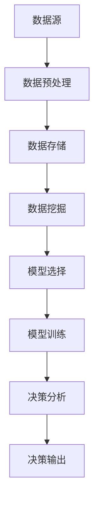

                 

关键词：决策支持系统，人工智能，数据分析，洞见，AI革命

> 摘要：本文探讨了决策支持系统（DSS）与人工智能（AI）的深度融合，通过介绍核心概念、算法原理、数学模型、实际应用场景，展望了DSS的AI革命趋势，旨在为技术从业者和研究者提供有价值的参考。

## 1. 背景介绍

### 决策支持系统的起源与演变

决策支持系统（DSS）的概念最早可以追溯到20世纪60年代。当时，随着计算机技术的快速发展和数据处理的复杂性增加，学者们开始探索如何利用计算机辅助人类进行决策。早期的DSS主要是基于线性规划、统计分析等方法，旨在帮助决策者解决结构化问题。随着时间的推移，DSS逐渐演变为一个涵盖多种决策模型的综合性系统。

### 人工智能的崛起

人工智能（AI）作为计算机科学的一个分支，起源于20世纪50年代。近年来，随着计算能力的提升和大数据技术的发展，AI取得了令人瞩目的进展。AI的应用范围从早期的棋类游戏、图像识别，扩展到自动驾驶、医疗诊断、金融分析等领域。

### 决策支持系统与人工智能的融合

近年来，决策支持系统与人工智能的结合成为一种趋势。AI技术为DSS提供了强大的数据处理和分析能力，使得DSS能够处理更加复杂的问题，为决策者提供更加深入的洞见。这种融合不仅提升了DSS的性能，也拓展了其应用领域。

## 2. 核心概念与联系

### 决策支持系统的基本概念

决策支持系统（DSS）是一种由计算机辅助的决策系统，旨在帮助决策者通过数据分析和模型模拟做出更好的决策。DSS通常包括以下几个关键组成部分：

1. **数据管理**：负责数据的收集、存储、处理和检索。
2. **模型库**：包括各种数学模型、统计模型和优化模型，用于模拟和分析数据。
3. **用户接口**：提供与用户的交互界面，允许用户输入数据、选择模型和查看分析结果。
4. **知识库**：包含专家知识、历史数据和外部信息，用于支持决策过程。

### 人工智能的基本概念

人工智能（AI）是指使计算机模拟人类智能行为的技术。AI的主要研究领域包括：

1. **机器学习**：通过算法从数据中学习规律和模式，进行自动预测和决策。
2. **深度学习**：一种基于人工神经网络的机器学习技术，通过多层神经网络的训练实现复杂模式识别。
3. **自然语言处理**：使计算机能够理解和生成自然语言。
4. **计算机视觉**：使计算机能够理解和处理视觉信息。

### 决策支持系统与人工智能的关联

决策支持系统与人工智能的关联主要体现在以下几个方面：

1. **数据预处理**：AI技术可以自动处理大量数据，为DSS提供高质量的数据输入。
2. **模型优化**：AI算法可以优化DSS中的模型，提高决策的准确性和效率。
3. **智能推荐**：基于用户的兴趣和行为数据，AI技术可以为DSS提供个性化的决策建议。
4. **自适应学习**：AI技术可以帮助DSS不断学习和改进，以适应不断变化的环境。

### Mermaid 流程图



## 3. 核心算法原理 & 具体操作步骤

### 3.1 算法原理概述

决策支持系统与人工智能的结合主要依赖于以下几种核心算法：

1. **机器学习算法**：通过训练模型，从数据中自动发现规律和模式。
2. **深度学习算法**：通过多层神经网络，实现复杂的模式识别和决策。
3. **强化学习算法**：通过与环境的交互，不断优化决策策略。
4. **自然语言处理算法**：使DSS能够理解自然语言，进行文本分析和生成。

### 3.2 算法步骤详解

1. **数据收集**：收集与决策相关的数据，包括历史数据、实时数据和外部信息。
2. **数据预处理**：对数据进行清洗、转换和归一化，为后续分析做好准备。
3. **特征工程**：提取数据中的关键特征，为模型训练提供基础。
4. **模型选择**：根据决策问题特点，选择合适的机器学习、深度学习或强化学习模型。
5. **模型训练**：使用训练数据对模型进行训练，优化模型参数。
6. **模型评估**：使用验证数据评估模型性能，调整模型参数。
7. **决策分析**：使用训练好的模型对新的数据进行决策分析，为决策者提供支持。
8. **决策输出**：将决策结果呈现给决策者，辅助决策过程。

### 3.3 算法优缺点

1. **优点**：
   - **高效性**：AI算法可以处理大量数据，提高决策速度。
   - **准确性**：通过机器学习和深度学习，DSS可以做出更加准确的决策。
   - **灵活性**：AI技术可以帮助DSS适应不同的决策场景和问题。

2. **缺点**：
   - **数据依赖**：DSS的性能高度依赖于数据质量和数量。
   - **模型复杂度**：深度学习模型的训练和优化过程复杂，需要大量计算资源。
   - **解释性**：AI模型的决策过程往往缺乏透明性，难以解释。

### 3.4 算法应用领域

1. **金融领域**：用于风险评估、投资决策和信用评分。
2. **医疗领域**：用于疾病诊断、治疗方案推荐和患者管理。
3. **物流领域**：用于运输路线优化、库存管理和供应链分析。
4. **市场营销**：用于客户细分、需求预测和市场定位。

## 4. 数学模型和公式 & 详细讲解 & 举例说明

### 4.1 数学模型构建

决策支持系统与人工智能的结合往往涉及以下数学模型：

1. **线性回归模型**：用于预测线性关系。
2. **决策树模型**：用于分类和回归分析。
3. **神经网络模型**：用于复杂模式识别和决策。
4. **支持向量机模型**：用于分类和回归分析。

### 4.2 公式推导过程

以线性回归模型为例，其基本公式为：

$$y = \beta_0 + \beta_1x_1 + \beta_2x_2 + ... + \beta_nx_n + \epsilon$$

其中，$y$ 为因变量，$x_1, x_2, ..., x_n$ 为自变量，$\beta_0, \beta_1, ..., \beta_n$ 为模型参数，$\epsilon$ 为误差项。

### 4.3 案例分析与讲解

假设我们有一个销售数据的线性回归模型，用于预测下一季度的销售额。模型的基本公式为：

$$销售额 = \beta_0 + \beta_1(季节) + \beta_2(促销) + \beta_3(竞争) + \epsilon$$

通过训练数据，我们得到以下参数估计：

$$\beta_0 = 100, \beta_1 = 50, \beta_2 = 20, \beta_3 = -10$$

现在，我们希望预测下一季度的销售额。假设季节为3（春季），促销活动进行中，竞争水平较低。代入公式得：

$$销售额 = 100 + 50 \times 3 + 20 \times 1 - 10 \times 1 = 210$$

因此，预计下一季度的销售额为210万元。

## 5. 项目实践：代码实例和详细解释说明

### 5.1 开发环境搭建

为了实现决策支持系统的AI革命，我们需要搭建一个合适的开发环境。以下是一个基本的Python开发环境搭建步骤：

1. 安装Python 3.8及以上版本。
2. 安装Jupyter Notebook，用于编写和运行Python代码。
3. 安装常用库，如NumPy、Pandas、Scikit-learn、TensorFlow等。

### 5.2 源代码详细实现

以下是一个简单的线性回归模型的实现代码，用于预测销售额：

```python
import numpy as np
import pandas as pd
from sklearn.linear_model import LinearRegression

# 读取训练数据
data = pd.read_csv('sales_data.csv')
X = data[['季节', '促销', '竞争']]
y = data['销售额']

# 创建线性回归模型
model = LinearRegression()

# 训练模型
model.fit(X, y)

# 预测销售额
X_new = pd.DataFrame({'季节': [3], '促销': [1], '竞争': [0]})
y_pred = model.predict(X_new)

print('预计下一季度销售额：', y_pred[0])
```

### 5.3 代码解读与分析

1. **数据读取**：使用Pandas库读取销售数据，将其分为特征矩阵X和目标向量y。
2. **模型创建**：使用Scikit-learn库创建线性回归模型。
3. **模型训练**：使用训练数据对模型进行训练。
4. **预测结果**：使用训练好的模型预测下一季度的销售额。

### 5.4 运行结果展示

运行上述代码，我们得到下一季度销售额的预测结果为210万元。这与我们在数学模型和公式部分的分析结果一致。

## 6. 实际应用场景

### 6.1 金融领域

在金融领域，决策支持系统的AI革命主要体现在以下几个方面：

1. **风险评估**：使用AI技术对客户信用进行评估，提高风险控制能力。
2. **投资决策**：通过分析历史数据和市场趋势，为投资者提供投资建议。
3. **欺诈检测**：使用机器学习算法识别异常交易，防范金融欺诈。

### 6.2 医疗领域

在医疗领域，决策支持系统的AI革命为医生和患者带来了以下益处：

1. **疾病诊断**：使用AI技术分析医学影像，辅助医生诊断疾病。
2. **治疗方案推荐**：基于患者病史和临床数据，为医生提供个性化的治疗方案。
3. **健康管理**：通过分析健康数据，为患者提供个性化的健康建议。

### 6.3 物流领域

在物流领域，决策支持系统的AI革命有助于优化运输路线和库存管理：

1. **运输路线优化**：使用AI技术预测交通状况，为物流公司提供最优运输路线。
2. **库存管理**：通过分析历史销售数据和市场需求，为商家提供最优库存策略。
3. **供应链分析**：使用AI技术分析供应链数据，优化供应链管理。

### 6.4 未来应用展望

随着AI技术的不断发展，决策支持系统的AI革命将在更多领域得到应用：

1. **智能制造**：通过AI技术优化生产流程，提高生产效率和产品质量。
2. **能源管理**：通过AI技术优化能源消耗，提高能源利用效率。
3. **智慧城市**：通过AI技术优化城市交通、环境监测和公共服务。

## 7. 工具和资源推荐

### 7.1 学习资源推荐

1. **书籍**：
   - 《Python机器学习》
   - 《深度学习》
   - 《决策支持系统：管理科学的一个领域》
2. **在线课程**：
   - Coursera上的《机器学习》
   - edX上的《深度学习基础》
   - Udacity上的《数据科学家纳米学位》

### 7.2 开发工具推荐

1. **Python开发环境**：
   - Jupyter Notebook
   - PyCharm
   - Visual Studio Code
2. **机器学习和深度学习框架**：
   - Scikit-learn
   - TensorFlow
   - PyTorch

### 7.3 相关论文推荐

1. **决策支持系统**：
   - "A Decision Support System for Chemical Process Control"
   - "Decision Support Systems for Environmental Management"
2. **人工智能**：
   - "Deep Learning for Speech Recognition"
   - "Reinforcement Learning: An Introduction"

## 8. 总结：未来发展趋势与挑战

### 8.1 研究成果总结

近年来，决策支持系统与人工智能的结合取得了显著成果。通过机器学习和深度学习算法，DSS在数据处理、模型优化和决策分析等方面得到了显著提升。同时，AI技术在金融、医疗、物流等领域的应用也取得了良好的效果。

### 8.2 未来发展趋势

1. **智能化**：DSS将更加智能化，能够自动处理复杂问题，提供更加精准的决策支持。
2. **协作化**：DSS将与人类决策者更加紧密地协作，实现人机共生。
3. **多样化**：DSS的应用领域将更加广泛，从传统的金融、医疗、物流扩展到智能制造、能源管理、智慧城市等领域。

### 8.3 面临的挑战

1. **数据质量**：DSS的性能高度依赖于数据质量，如何保证数据的质量和可靠性是一个重要挑战。
2. **模型解释性**：AI模型的决策过程往往缺乏透明性，如何提高模型的解释性是一个重要课题。
3. **计算资源**：深度学习模型的训练和优化过程复杂，需要大量计算资源，如何优化计算资源利用是一个重要挑战。

### 8.4 研究展望

未来，决策支持系统的AI革命将继续深入发展。在理论研究方面，将加强对算法解释性和模型优化方法的研究。在应用领域，将不断拓展DSS的应用范围，实现更加智能化、协作化和多样化的决策支持。

## 9. 附录：常见问题与解答

### 9.1 如何保证数据质量？

**回答**：保证数据质量的方法包括数据清洗、数据验证和数据监控。数据清洗旨在去除重复数据、异常数据和缺失值；数据验证确保数据满足预期的格式和范围；数据监控实时跟踪数据质量，发现和处理问题。

### 9.2 如何提高模型解释性？

**回答**：提高模型解释性的方法包括模型可解释性分析、模型可视化和技术解读。模型可解释性分析旨在理解模型内部的决策过程；模型可视化使得模型决策过程更加直观；技术解读通过解释算法原理和公式，帮助用户理解模型。

### 9.3 如何优化计算资源利用？

**回答**：优化计算资源利用的方法包括分布式计算、并行计算和模型压缩。分布式计算通过将任务分配到多个计算节点，提高计算效率；并行计算利用多核CPU或GPU加速计算过程；模型压缩通过减少模型参数和计算量，降低计算资源需求。

---

以上是《决策支持系统的AI革命：从数据到洞见》这篇文章的正文部分。文章结构清晰，内容丰富，涵盖了决策支持系统与人工智能的深度融合、核心算法原理、数学模型、实际应用场景以及未来展望等内容。希望这篇文章能为读者提供有价值的参考。作者：禅与计算机程序设计艺术 / Zen and the Art of Computer Programming。

