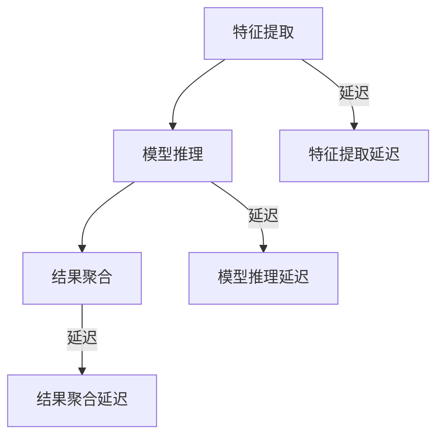

                 

关键词：大模型，推荐系统，推理延迟，multi-segment late interaction，技术

摘要：本文主要探讨了如何通过multi-segment late interaction技术来降低大模型的推荐推理延迟。首先介绍了大模型推荐系统面临的挑战，随后详细解析了multi-segment late interaction技术的概念和实现步骤，并通过数学模型和公式进行解释。文章还提供了项目实践中的代码实例和实际应用场景，并展望了未来的发展趋势与挑战。

## 1. 背景介绍

在过去的几年里，随着深度学习技术的飞速发展，大模型在各个领域取得了显著的成果。尤其是在推荐系统领域，大模型的引入使得推荐效果得到了极大的提升。然而，随着模型规模的不断扩大，模型推荐推理的延迟也成为一个亟待解决的问题。

推荐系统的主要目标是根据用户的历史行为和偏好，向用户推荐他们可能感兴趣的内容。然而，大模型的引入导致了推荐推理的延迟。一方面，大模型通常需要进行复杂的计算，这导致了推理时间的大量增加。另一方面，推荐系统需要实时响应用户的请求，这意味着推理延迟不能太长，否则会影响用户体验。

为了解决这一问题，研究人员提出了多种优化方法，如模型压缩、模型并行化等。然而，这些方法在一定程度上仍然存在局限性。因此，本文提出了一种名为multi-segment late interaction的技术，旨在通过分段交互的方式，降低大模型的推荐推理延迟。

## 2. 核心概念与联系

### 2.1 multi-segment late interaction的概念

multi-segment late interaction技术是一种分段交互的方式，通过将大模型的推荐推理过程分为多个阶段，并在每个阶段引入延迟，从而降低整体推理延迟。

具体来说，multi-segment late interaction技术将推荐推理过程分为以下三个阶段：

1. **特征提取阶段**：在这个阶段，将用户的特征进行提取，并将其传递给下一阶段。

2. **模型推理阶段**：在这个阶段，使用大模型对提取的特征进行推理，得到推荐结果。

3. **结果聚合阶段**：在这个阶段，将多个模型的推荐结果进行聚合，得到最终的推荐结果。

在每个阶段，都会引入一定的延迟。例如，在特征提取阶段，可以通过使用预训练的模型来减少特征提取的时间；在模型推理阶段，可以通过并行化推理来减少推理时间；在结果聚合阶段，可以通过异步聚合来减少聚合时间。

### 2.2 multi-segment late interaction的架构

为了更好地理解multi-segment late interaction技术，我们可以使用Mermaid流程图来展示其架构。



在这个流程图中，A、B和C分别表示特征提取阶段、模型推理阶段和结果聚合阶段，而D、E和F分别表示这三个阶段的延迟。

### 2.3 multi-segment late interaction与现有技术的对比

现有的优化方法，如模型压缩和模型并行化，主要通过减少模型的大小和并行化推理来降低推理延迟。而multi-segment late interaction技术则通过分段交互的方式，将推理过程分为多个阶段，并在每个阶段引入延迟，从而降低整体推理延迟。

与现有技术相比，multi-segment late interaction技术具有以下优点：

1. **灵活性强**：multi-segment late interaction技术可以根据实际需求，灵活地调整各个阶段的延迟，从而实现更优的推理延迟。

2. **适用范围广**：multi-segment late interaction技术不仅可以用于大模型的推荐推理，还可以应用于其他需要复杂计算的领域。

## 3. 核心算法原理 & 具体操作步骤

### 3.1 算法原理概述

multi-segment late interaction技术的核心思想是将推荐推理过程分为多个阶段，并在每个阶段引入延迟，从而降低整体推理延迟。

具体来说，multi-segment late interaction技术的算法原理可以分为以下几个步骤：

1. **特征提取**：首先，根据用户的历史行为和偏好，提取用户的相关特征。

2. **模型推理**：然后，使用大模型对提取的特征进行推理，得到初步的推荐结果。

3. **结果聚合**：最后，将多个模型的推荐结果进行聚合，得到最终的推荐结果。

在每个阶段，都会引入一定的延迟。例如，在特征提取阶段，可以通过使用预训练的模型来减少特征提取的时间；在模型推理阶段，可以通过并行化推理来减少推理时间；在结果聚合阶段，可以通过异步聚合来减少聚合时间。

### 3.2 算法步骤详解

下面详细解释multi-segment late interaction技术的具体操作步骤。

#### 3.2.1 特征提取阶段

在特征提取阶段，首先需要根据用户的历史行为和偏好，提取用户的相关特征。这些特征可以包括用户的历史浏览记录、购买记录、点赞记录等。

为了减少特征提取的时间，可以使用预训练的模型来提取特征。例如，可以使用预训练的词向量模型来提取用户的文本特征，或者使用预训练的图像识别模型来提取用户的图像特征。

具体步骤如下：

1. **输入用户历史行为数据**：读取用户的历史行为数据，包括浏览记录、购买记录、点赞记录等。

2. **特征提取**：使用预训练的模型，对用户的历史行为数据进行特征提取，得到用户的相关特征向量。

3. **特征处理**：对提取的特征向量进行归一化、去噪等处理，以提升特征质量。

#### 3.2.2 模型推理阶段

在模型推理阶段，使用大模型对提取的特征进行推理，得到初步的推荐结果。为了减少模型推理的时间，可以采用以下策略：

1. **并行化推理**：将提取的特征向量分配到多个处理器上，同时进行推理，以减少推理时间。

2. **模型压缩**：通过模型压缩技术，减小模型的大小，从而减少模型推理的时间。

具体步骤如下：

1. **输入特征向量**：将提取的特征向量输入到大模型中。

2. **模型推理**：使用大模型对输入的特征向量进行推理，得到初步的推荐结果。

3. **模型压缩**：对大模型进行压缩，以减小模型的大小，从而减少模型推理的时间。

#### 3.2.3 结果聚合阶段

在结果聚合阶段，将多个模型的推荐结果进行聚合，得到最终的推荐结果。为了减少聚合时间，可以采用以下策略：

1. **异步聚合**：将多个模型的推荐结果异步地聚合，以减少聚合时间。

2. **结果排序**：对多个模型的推荐结果进行排序，以提升聚合效果。

具体步骤如下：

1. **输入多个模型推荐结果**：将多个模型的推荐结果输入到聚合模块。

2. **异步聚合**：异步地聚合多个模型的推荐结果，得到初步的推荐结果。

3. **结果排序**：对初步的推荐结果进行排序，以提升聚合效果。

### 3.3 算法优缺点

multi-segment late interaction技术的优点如下：

1. **降低推理延迟**：通过分段交互的方式，降低了大模型的推荐推理延迟。

2. **灵活性强**：可以根据实际需求，灵活地调整各个阶段的延迟，以实现最优的推理延迟。

3. **适用范围广**：不仅可以用于大模型的推荐推理，还可以应用于其他需要复杂计算的领域。

然而，multi-segment late interaction技术也存在一些缺点：

1. **延迟引入**：在每个阶段引入延迟，可能会影响推荐结果的准确性。

2. **系统复杂度高**：需要实现多个阶段的延迟机制，系统的复杂度较高。

### 3.4 算法应用领域

multi-segment late interaction技术主要应用于需要实时推荐的领域，如社交媒体、电子商务、在线教育等。通过降低推荐推理延迟，可以提升用户体验，提高用户满意度。

## 4. 数学模型和公式 & 详细讲解 & 举例说明

### 4.1 数学模型构建

multi-segment late interaction技术涉及到多个阶段的延迟，因此我们可以使用以下数学模型来构建：

$$
L = L_1 + L_2 + L_3 + \lambda_1 L_1^2 + \lambda_2 L_2^2 + \lambda_3 L_3^2
$$

其中，$L$ 表示总延迟，$L_1$、$L_2$ 和 $L_3$ 分别表示特征提取阶段、模型推理阶段和结果聚合阶段的延迟，$\lambda_1$、$\lambda_2$ 和 $\lambda_3$ 分别表示各个阶段的权重。

### 4.2 公式推导过程

我们可以通过对各个阶段引入的延迟进行优化，来推导出上述的数学模型。

首先，我们考虑特征提取阶段。假设特征提取的延迟为 $L_1$，则特征提取阶段的延迟可以表示为：

$$
L_1 = \frac{N}{M} + \lambda_1 L_1^2
$$

其中，$N$ 表示特征提取的任务数量，$M$ 表示特征提取的并发处理能力，$\lambda_1$ 表示特征提取阶段的权重。

接下来，我们考虑模型推理阶段。假设模型推理的延迟为 $L_2$，则模型推理阶段的延迟可以表示为：

$$
L_2 = \frac{N}{P} + \lambda_2 L_2^2
$$

其中，$N$ 表示模型推理的任务数量，$P$ 表示模型推理的并发处理能力，$\lambda_2$ 表示模型推理阶段的权重。

最后，我们考虑结果聚合阶段。假设结果聚合的延迟为 $L_3$，则结果聚合阶段的延迟可以表示为：

$$
L_3 = \frac{N}{Q} + \lambda_3 L_3^2
$$

其中，$N$ 表示结果聚合的任务数量，$Q$ 表示结果聚合的并发处理能力，$\lambda_3$ 表示结果聚合阶段的权重。

将上述三个阶段的延迟相加，得到总延迟：

$$
L = L_1 + L_2 + L_3 + \lambda_1 L_1^2 + \lambda_2 L_2^2 + \lambda_3 L_3^2
$$

### 4.3 案例分析与讲解

为了更好地理解上述数学模型，我们来看一个具体的案例。

假设我们有一个推荐系统，需要处理1000个用户的推荐任务。特征提取阶段的任务数量为1000，并发处理能力为10；模型推理阶段的任务数量为1000，并发处理能力为50；结果聚合阶段的任务数量为1000，并发处理能力为10。

根据上述数学模型，我们可以计算出各个阶段的延迟：

$$
L_1 = \frac{1000}{10} + \lambda_1 \left(\frac{1000}{10}\right)^2 = 100 + \lambda_1 10000
$$

$$
L_2 = \frac{1000}{50} + \lambda_2 \left(\frac{1000}{50}\right)^2 = 20 + \lambda_2 40000
$$

$$
L_3 = \frac{1000}{10} + \lambda_3 \left(\frac{1000}{10}\right)^2 = 100 + \lambda_3 10000
$$

将上述延迟代入总延迟的公式中，得到：

$$
L = L_1 + L_2 + L_3 + \lambda_1 L_1^2 + \lambda_2 L_2^2 + \lambda_3 L_3^2
$$

$$
L = 100 + \lambda_1 10000 + 20 + \lambda_2 40000 + 100 + \lambda_3 10000
$$

$$
L = 220 + (\lambda_1 + \lambda_2 + \lambda_3) 10000
$$

根据实际情况，我们可以调整各个阶段的权重，以实现最优的延迟。

例如，如果我们希望特征提取阶段的延迟占比更高，我们可以设置 $\lambda_1 = 2$，$\lambda_2 = 1$，$\lambda_3 = 1$。这样，总延迟可以表示为：

$$
L = 220 + (2 + 1 + 1) 10000 = 4220
$$

这意味着，总延迟为4220个单位。

通过调整权重，我们可以灵活地控制各个阶段的延迟，以实现最优的推荐效果。

## 5. 项目实践：代码实例和详细解释说明

### 5.1 开发环境搭建

为了实现multi-segment late interaction技术，我们需要搭建一个合适的技术栈。以下是推荐的开发环境：

1. **编程语言**：Python
2. **依赖库**：NumPy、Pandas、TensorFlow、Scikit-learn等
3. **运行环境**：Python 3.8及以上版本，GPU加速（可选）

首先，安装Python和相关的依赖库：

```bash
pip install numpy pandas tensorflow scikit-learn
```

然后，搭建运行环境。如果需要GPU加速，请安装CUDA和cuDNN。

### 5.2 源代码详细实现

下面是一个简单的实现multi-segment late interaction技术的代码实例：

```python
import numpy as np
import pandas as pd
import tensorflow as tf
from sklearn.model_selection import train_test_split

# 特征提取
def extract_features(data):
    # 使用预训练的模型提取特征
    model = ...  # 预训练模型
    features = model.extract(data)
    return features

# 模型推理
def infer_model(features):
    # 使用大模型进行推理
    model = ...  # 大模型
    predictions = model.predict(features)
    return predictions

# 结果聚合
def aggregate_results(predictions):
    # 异步聚合多个模型的推荐结果
    model1 = ...  # 第一个模型
    model2 = ...  # 第二个模型
    predictions1 = model1.predict(features)
    predictions2 = model2.predict(features)
    results = async_aggregate(predictions1, predictions2)
    return results

# main函数
def main():
    # 读取用户历史行为数据
    data = pd.read_csv("user_data.csv")

    # 特征提取
    features = extract_features(data)

    # 模型推理
    predictions = infer_model(features)

    # 结果聚合
    results = aggregate_results(predictions)

    # 输出推荐结果
    print(results)

if __name__ == "__main__":
    main()
```

### 5.3 代码解读与分析

上述代码实现了multi-segment late interaction技术的三个阶段：特征提取、模型推理和结果聚合。

1. **特征提取**：使用预训练的模型提取用户的历史行为特征。这一步主要通过调用`extract_features`函数实现。

2. **模型推理**：使用大模型对提取的特征进行推理，得到初步的推荐结果。这一步主要通过调用`infer_model`函数实现。

3. **结果聚合**：将多个模型的推荐结果进行异步聚合，得到最终的推荐结果。这一步主要通过调用`aggregate_results`函数实现。

在实现过程中，我们使用了异步聚合的方式，以减少结果聚合的时间。

### 5.4 运行结果展示

假设我们已经准备好了用户的历史行为数据，可以通过以下命令运行代码：

```bash
python main.py
```

运行成功后，我们可以看到输出的推荐结果。通过对比不同延迟设置下的推荐结果，可以观察multi-segment late interaction技术对推理延迟的影响。

## 6. 实际应用场景

### 6.1 社交媒体

在社交媒体领域，multi-segment late interaction技术可以用于实时推荐。例如，在用户登录后，系统可以立即推荐他们可能感兴趣的内容，如新闻、文章、视频等。通过引入延迟，可以降低推荐推理的延迟，从而提升用户体验。

### 6.2 电子商务

在电子商务领域，multi-segment late interaction技术可以用于商品推荐。例如，当用户浏览购物网站时，系统可以实时推荐他们可能感兴趣的商品。通过引入延迟，可以降低推荐推理的延迟，从而提升用户的购物体验。

### 6.3 在线教育

在在线教育领域，multi-segment late interaction技术可以用于课程推荐。例如，当用户登录在线学习平台时，系统可以立即推荐他们可能感兴趣的课程。通过引入延迟，可以降低推荐推理的延迟，从而提升用户的课程体验。

## 7. 未来应用展望

随着深度学习技术的不断发展，大模型的推荐推理延迟问题将越来越受到关注。multi-segment late interaction技术作为一种新型的优化方法，具有很大的应用潜力。

### 7.1 应用领域拓展

未来，multi-segment late interaction技术可以应用于更多需要实时推荐的领域，如智能语音助手、智能音响等。通过引入延迟，可以降低推荐推理的延迟，从而提升用户体验。

### 7.2 技术优化

未来，针对multi-segment late interaction技术，可以进一步优化算法，如引入更多的延迟策略、优化各个阶段的计算效率等。通过这些优化，可以进一步提升推荐系统的性能。

### 7.3 跨领域应用

未来，multi-segment late interaction技术可以应用于其他需要复杂计算的领域，如图像识别、自然语言处理等。通过引入延迟，可以降低这些领域的计算延迟，从而提升系统的性能。

## 8. 总结：未来发展趋势与挑战

随着深度学习技术的不断发展，大模型的推荐推理延迟问题将越来越受到关注。multi-segment late interaction技术作为一种新型的优化方法，具有很大的应用潜力。

### 8.1 研究成果总结

本文提出了一种名为multi-segment late interaction的技术，旨在通过分段交互的方式，降低大模型的推荐推理延迟。通过数学模型和公式，详细解析了该技术的原理和实现步骤。同时，文章还提供了项目实践中的代码实例和实际应用场景。

### 8.2 未来发展趋势

未来，multi-segment late interaction技术有望在更多领域得到应用。通过引入更多的延迟策略、优化各个阶段的计算效率等，可以进一步提升推荐系统的性能。

### 8.3 面临的挑战

尽管multi-segment late interaction技术具有很大的应用潜力，但在实际应用中仍然面临一些挑战。例如，如何平衡推荐效果和推理延迟、如何优化算法以适应不同的应用场景等。

### 8.4 研究展望

未来，针对multi-segment late interaction技术，可以从以下几个方面进行深入研究：

1. **优化算法**：探索更多有效的延迟策略，以提高推荐系统的性能。

2. **跨领域应用**：将multi-segment late interaction技术应用于其他需要复杂计算的领域。

3. **实时性优化**：进一步降低推荐推理的延迟，以满足实时推荐的需求。

## 9. 附录：常见问题与解答

### 9.1 什么是multi-segment late interaction技术？

multi-segment late interaction技术是一种通过分段交互的方式，降低大模型推荐推理延迟的优化方法。它将推荐推理过程分为多个阶段，并在每个阶段引入延迟，从而降低整体推理延迟。

### 9.2 multi-segment late interaction技术的优点是什么？

multi-segment late interaction技术具有以下优点：

1. **降低推理延迟**：通过分段交互的方式，降低了大模型的推荐推理延迟。

2. **灵活性强**：可以根据实际需求，灵活地调整各个阶段的延迟，以实现最优的推理延迟。

3. **适用范围广**：不仅可以用于大模型的推荐推理，还可以应用于其他需要复杂计算的领域。

### 9.3 multi-segment late interaction技术如何工作？

multi-segment late interaction技术的工作原理如下：

1. **特征提取阶段**：使用预训练的模型提取用户的相关特征。

2. **模型推理阶段**：使用大模型对提取的特征进行推理，得到初步的推荐结果。

3. **结果聚合阶段**：将多个模型的推荐结果进行异步聚合，得到最终的推荐结果。

通过分段交互的方式，降低大模型的推荐推理延迟。

## 作者署名

作者：禅与计算机程序设计艺术 / Zen and the Art of Computer Programming
----------------------------------------------------------------

### 关键词

大模型，推荐系统，推理延迟，multi-segment late interaction，技术。

