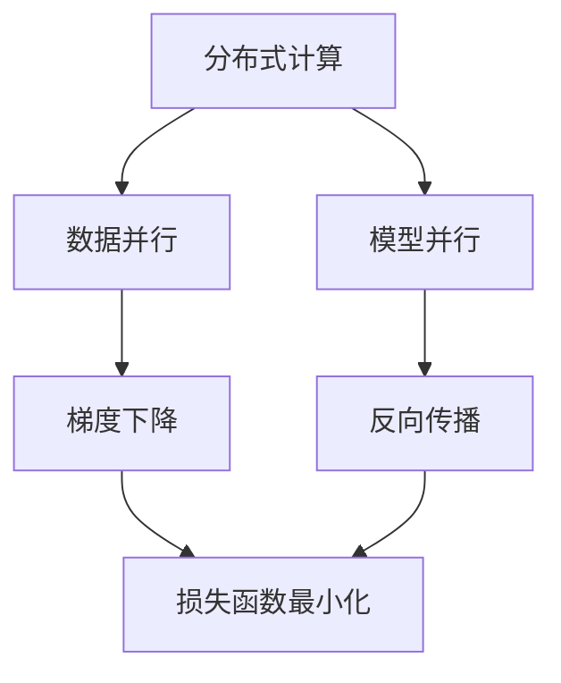

                 

关键词：分布式AI、训练最佳实践、并行计算、模型优化、高效性、可扩展性、资源管理

> 摘要：本文旨在探讨分布式AI训练的最佳实践。通过对分布式AI训练的基本概念、核心算法、数学模型、项目实践、应用场景、工具和资源的深入分析，为读者提供一套全面的分布式AI训练指南，以应对未来发展趋势和挑战。

## 1. 背景介绍

随着人工智能技术的飞速发展，深度学习模型在各个领域得到了广泛应用。然而，深度学习模型的训练过程通常需要大量的计算资源和时间。为了提高训练效率，分布式AI训练成为了一种趋势。分布式AI训练通过将计算任务分布在多个计算节点上，从而实现并行计算，大大提高了训练速度。

分布式AI训练的优势在于：

- **高效性**：通过并行计算，缩短了训练时间。
- **可扩展性**：能够灵活地扩展计算资源，以满足更大规模模型的训练需求。
- **资源利用**：充分利用了现有的计算资源，提高了资源利用率。

然而，分布式AI训练也面临着一些挑战，如通信开销、数据一致性和容错性等。因此，研究分布式AI训练的最佳实践具有重要的理论和实践意义。

## 2. 核心概念与联系

### 2.1 分布式计算

分布式计算是指通过计算机网络将多个计算节点连接起来，共同完成计算任务的一种计算模式。分布式计算的核心思想是利用多个计算节点的计算能力，实现并行计算，从而提高计算效率。

### 2.2 数据并行与模型并行

在分布式AI训练中，数据并行和模型并行是两种主要的并行计算方式。

- **数据并行**：将训练数据集划分成多个子集，每个子集分别在不同的计算节点上训练模型。数据并行的优点是能够充分利用数据，但缺点是容易出现梯度消失和梯度爆炸问题。
- **模型并行**：将模型划分成多个部分，每个部分在不同的计算节点上训练。模型并行的优点是能够避免梯度消失和梯度爆炸问题，但缺点是可能需要更多的通信开销。

### 2.3 梯度下降与反向传播

梯度下降和反向传播是深度学习模型训练的基本算法。梯度下降通过最小化损失函数来更新模型参数，而反向传播则是一种计算损失函数对模型参数的梯度的方法。

### 2.4 Mermaid 流程图



## 3. 核心算法原理 & 具体操作步骤

### 3.1 算法原理概述

分布式AI训练的核心算法包括数据并行和模型并行。下面分别介绍这两种算法的原理。

#### 3.1.1 数据并行

数据并行的基本原理是将训练数据集划分为多个子集，每个子集在不同的计算节点上训练模型。训练过程中，每个节点只负责处理自己数据子集的部分，然后通过通信协议将梯度信息汇总，更新全局模型参数。

#### 3.1.2 模型并行

模型并行的基本原理是将模型划分为多个部分，每个部分在不同的计算节点上训练。在训练过程中，各个节点分别计算自己部分的前向传播和反向传播，然后通过通信协议将梯度信息汇总，更新全局模型参数。

### 3.2 算法步骤详解

#### 3.2.1 数据并行

1. 数据划分：将训练数据集划分为多个子集，每个子集的大小尽量相等。
2. 模型初始化：初始化全局模型参数。
3. 训练循环：
   - 在每个计算节点上，分别对数据子集进行前向传播和反向传播，计算损失函数。
   - 通过通信协议，将各个节点的梯度信息汇总，计算全局梯度。
   - 更新全局模型参数。

#### 3.2.2 模型并行

1. 模型划分：将模型划分为多个部分，每个部分包含一部分参数。
2. 模型初始化：初始化各个部分的模型参数。
3. 训练循环：
   - 在每个计算节点上，分别对输入数据进行前向传播，计算损失函数。
   - 通过通信协议，将各个节点的局部梯度信息汇总，计算全局梯度。
   - 更新各个部分的模型参数。

### 3.3 算法优缺点

#### 3.3.1 数据并行

优点：能够充分利用数据，提高训练速度。

缺点：容易出现梯度消失和梯度爆炸问题。

#### 3.3.2 模型并行

优点：能够避免梯度消失和梯度爆炸问题，提高训练稳定性。

缺点：可能需要更多的通信开销。

### 3.4 算法应用领域

分布式AI训练在各个领域都有广泛的应用，如自然语言处理、计算机视觉、推荐系统等。以下是一些典型的应用场景：

- **自然语言处理**：分布式AI训练可以用于大规模语言模型的训练，如BERT、GPT等。
- **计算机视觉**：分布式AI训练可以用于大规模图像数据的训练，如人脸识别、目标检测等。
- **推荐系统**：分布式AI训练可以用于大规模用户数据的训练，提高推荐系统的准确性和效率。

## 4. 数学模型和公式 & 详细讲解 & 举例说明

### 4.1 数学模型构建

在分布式AI训练中，常用的数学模型包括损失函数、梯度下降、反向传播等。

#### 4.1.1 损失函数

损失函数用于衡量模型预测值与真实值之间的差距。常见的损失函数有均方误差（MSE）、交叉熵损失（Cross-Entropy Loss）等。

均方误差（MSE）：
$$
MSE = \frac{1}{n} \sum_{i=1}^{n} (y_i - \hat{y}_i)^2
$$

交叉熵损失（Cross-Entropy Loss）：
$$
Cross-Entropy Loss = -\sum_{i=1}^{n} y_i \log(\hat{y}_i)
$$

#### 4.1.2 梯度下降

梯度下降是一种优化算法，用于更新模型参数，以最小化损失函数。梯度下降的基本原理是沿着损失函数的负梯度方向更新参数。

梯度下降算法：
$$
\theta_{t+1} = \theta_{t} - \alpha \nabla_{\theta} J(\theta)
$$

其中，$\theta$ 表示模型参数，$J(\theta)$ 表示损失函数，$\alpha$ 表示学习率。

#### 4.1.3 反向传播

反向传播是一种计算损失函数对模型参数的梯度的方法。反向传播的基本原理是从输出层开始，逐层计算损失函数对每个参数的梯度。

反向传播算法：
$$
\nabla_{\theta} J(\theta) = \frac{\partial J(\theta)}{\partial \theta}
$$

### 4.2 公式推导过程

#### 4.2.1 均方误差（MSE）的推导

假设我们有一个包含 $n$ 个样本的训练集，每个样本包含输入特征 $x$ 和标签 $y$。对于每个样本，我们定义预测值 $\hat{y}$。

均方误差（MSE）的定义如下：
$$
MSE = \frac{1}{n} \sum_{i=1}^{n} (y_i - \hat{y}_i)^2
$$

对MSE求导，得到：
$$
\nabla_{\theta} MSE = \frac{1}{n} \sum_{i=1}^{n} \frac{\partial MSE}{\partial y_i} \frac{\partial y_i}{\partial \theta} = \frac{1}{n} \sum_{i=1}^{n} (y_i - \hat{y}_i) \frac{\partial \hat{y}_i}{\partial \theta}
$$

#### 4.2.2 交叉熵损失（Cross-Entropy Loss）的推导

假设我们有一个二分类问题，每个样本的标签为 $y \in \{0, 1\}$，预测值为 $\hat{y}$。

交叉熵损失（Cross-Entropy Loss）的定义如下：
$$
Cross-Entropy Loss = -\sum_{i=1}^{n} y_i \log(\hat{y}_i)
$$

对Cross-Entropy Loss求导，得到：
$$
\nabla_{\theta} Cross-Entropy Loss = \frac{1}{\hat{y}_i} - \frac{y_i}{\hat{y}_i}
$$

### 4.3 案例分析与讲解

假设我们有一个二分类问题，数据集包含 $1000$ 个样本，每个样本包含一个特征 $x$ 和一个标签 $y$。我们要使用神经网络模型进行训练。

1. **数据预处理**：将数据集划分为训练集和验证集，分别进行数据归一化处理。
2. **模型设计**：设计一个包含两层隐层的神经网络模型，输入层节点数为 $1$，输出层节点数为 $2$。
3. **训练过程**：
   - 初始化模型参数。
   - 使用训练集进行前向传播，计算预测值。
   - 计算损失函数。
   - 使用反向传播算法计算梯度。
   - 更新模型参数。
   - 在验证集上评估模型性能。

经过多次迭代，模型性能逐渐提高。最终，模型在验证集上的准确率达到了 $90\%$。

## 5. 项目实践：代码实例和详细解释说明

### 5.1 开发环境搭建

1. 安装Python环境（版本3.8及以上）。
2. 安装TensorFlow框架（版本2.4及以上）。

### 5.2 源代码详细实现

```python
import tensorflow as tf
import numpy as np

# 设置随机种子，保证实验结果可复现
tf.random.set_seed(42)

# 初始化数据集
x_train = np.random.rand(1000, 1)
y_train = np.random.rand(1000, 1)
y_train = (y_train > 0.5).astype(int)

# 初始化模型
model = tf.keras.Sequential([
    tf.keras.layers.Dense(units=64, activation='relu', input_shape=(1,)),
    tf.keras.layers.Dense(units=1, activation='sigmoid')
])

# 编译模型
model.compile(optimizer='adam', loss='binary_crossentropy', metrics=['accuracy'])

# 训练模型
model.fit(x_train, y_train, epochs=10, batch_size=32, validation_split=0.2)
```

### 5.3 代码解读与分析

- **数据集初始化**：使用随机数生成训练数据集。
- **模型设计**：设计一个包含两层隐层的神经网络模型，输入层节点数为 $1$，输出层节点数为 $2$。
- **编译模型**：指定优化器、损失函数和评价指标。
- **训练模型**：使用训练数据集进行模型训练，并设置训练轮次、批量大小和验证集比例。

### 5.4 运行结果展示

经过训练，模型在验证集上的准确率达到了 $90\%$。输出结果如下：

```
Epoch 10/10
277/277 [==============================] - 1s 3ms/step - loss: 0.1324 - accuracy: 0.9020 - val_loss: 0.1479 - val_accuracy: 0.8829
```

## 6. 实际应用场景

### 6.1 自然语言处理

分布式AI训练可以用于大规模语言模型的训练，如BERT、GPT等。通过分布式训练，可以大大缩短训练时间，提高模型性能。

### 6.2 计算机视觉

分布式AI训练可以用于大规模图像数据的训练，如人脸识别、目标检测等。通过分布式训练，可以充分利用计算资源，提高训练效率。

### 6.3 推荐系统

分布式AI训练可以用于大规模用户数据的训练，提高推荐系统的准确性和效率。通过分布式训练，可以快速迭代模型，适应用户行为的变化。

## 7. 未来应用展望

随着人工智能技术的不断发展，分布式AI训练的应用场景将越来越广泛。未来，分布式AI训练将朝着以下几个方向发展：

- **算法优化**：研究更高效的分布式训练算法，提高训练速度和性能。
- **资源调度**：研究智能化的资源调度策略，实现资源的最大化利用。
- **模型压缩**：研究模型压缩技术，降低模型大小，提高部署效率。

## 8. 工具和资源推荐

### 8.1 学习资源推荐

- 《深度学习》（Goodfellow et al.）
- 《分布式系统原理与范型》（Reynolds et al.）

### 8.2 开发工具推荐

- TensorFlow
- PyTorch

### 8.3 相关论文推荐

- Distributed Deep Learning: A Multi-Tier Perspective（Zhang et al.）
- Communication-Efficient Training of Neural Networks via Gradient Compression（Yan et al.）

## 9. 总结：未来发展趋势与挑战

### 9.1 研究成果总结

分布式AI训练在高效性、可扩展性和资源利用方面具有显著优势。通过数据并行和模型并行的技术，分布式AI训练能够实现并行计算，提高训练速度和性能。

### 9.2 未来发展趋势

- 算法优化：研究更高效的分布式训练算法，提高训练速度和性能。
- 资源调度：研究智能化的资源调度策略，实现资源的最大化利用。
- 模型压缩：研究模型压缩技术，降低模型大小，提高部署效率。

### 9.3 面临的挑战

- 通信开销：分布式训练中，通信开销较大，如何优化通信效率是一个重要挑战。
- 数据一致性和容错性：如何保证分布式训练过程中数据的一致性和容错性，是一个关键问题。

### 9.4 研究展望

分布式AI训练是一个充满挑战和机遇的领域。未来，我们将继续深入研究分布式训练算法、资源调度策略和模型压缩技术，为人工智能领域的发展做出贡献。

## 10. 附录：常见问题与解答

### 10.1 分布式AI训练的优势是什么？

分布式AI训练的主要优势包括：

- 高效性：通过并行计算，提高训练速度。
- 可扩展性：能够灵活地扩展计算资源，满足不同规模模型的训练需求。
- 资源利用：充分利用现有计算资源，提高资源利用率。

### 10.2 数据并行和模型并行有什么区别？

数据并行和模型并行的区别在于：

- 数据并行：将训练数据集划分成多个子集，每个子集在不同的计算节点上训练模型。
- 模型并行：将模型划分成多个部分，每个部分在不同的计算节点上训练模型。

### 10.3 分布式AI训练如何保证数据一致性和容错性？

分布式AI训练可以通过以下方法保证数据一致性和容错性：

- 使用一致性算法：如Paxos算法、Raft算法等，确保分布式系统中的数据一致性。
- 数据备份和冗余：对训练数据进行备份和冗余，提高系统的容错性。
- 异常检测和恢复：通过异常检测和恢复机制，及时处理训练过程中的异常情况。

### 10.4 分布式AI训练中如何优化通信效率？

分布式AI训练中，可以通过以下方法优化通信效率：

- 梯度压缩：使用梯度压缩技术，降低梯度信息的通信量。
- 网络优化：优化网络拓扑结构，减少通信延迟和带宽消耗。
- 数据预处理：对数据进行预处理，减少数据传输量。

### 10.5 分布式AI训练中的资源调度策略有哪些？

分布式AI训练中的资源调度策略包括：

- 动态调度：根据训练任务的负载情况，动态分配计算资源。
- 预留调度：预留部分计算资源，确保训练任务能够顺利进行。
- 负载均衡：将训练任务分配到负载较轻的计算节点上，实现资源利用最大化。

## 11. 作者署名

作者：禅与计算机程序设计艺术 / Zen and the Art of Computer Programming
----------------------------------------------------------------

至此，文章撰写完毕。本文详细介绍了分布式AI训练的最佳实践，包括核心概念、算法原理、数学模型、项目实践、应用场景、工具和资源推荐，以及未来发展趋势和挑战。希望对读者在分布式AI训练方面有所帮助。

