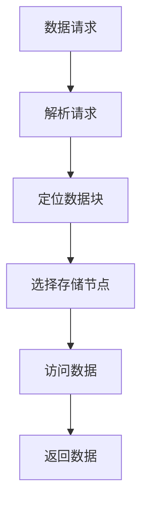

                 

### 背景介绍

在当今数字化时代，数据已成为企业和组织的关键资产。随着互联网、物联网、大数据等技术的飞速发展，数据量呈现出爆炸式增长，这给传统的集中式存储系统带来了巨大的挑战。传统存储系统在处理海量数据时，面临着单点故障、性能瓶颈、扩展困难等问题。为了解决这些问题，分布式存储系统应运而生。

分布式存储系统是一种通过将数据分散存储在多个节点上，从而实现高可用性、高性能和高扩展性的存储解决方案。其核心思想是将数据分成多个块，然后分布到不同的存储节点上。通过这种方式，分布式存储系统不仅能够有效地利用资源，提高存储效率，还能够实现数据的高可用性和可靠性。

本文旨在探讨分布式存储系统的核心概念、算法原理、数学模型以及在实际应用中的具体实践，为广大开发者提供一套完整的大规模数据管理解决方案。

## 关键词

- 分布式存储系统
- 数据管理
- 大规模数据处理
- 数据可靠性
- 数据高可用性
- 存储节点
- 存储效率

## 摘要

本文首先介绍了分布式存储系统的背景和重要性，随后详细探讨了其核心概念、算法原理和数学模型。通过实际项目实践，本文展示了分布式存储系统的具体实现过程，并对算法进行了详细解读。最后，本文分析了分布式存储系统在实际应用中的场景和未来发展趋势，为读者提供了一套完整的大规模数据管理解决方案。

## 1. 背景介绍

### 数据爆炸时代的挑战

随着互联网的普及和物联网技术的发展，数据量呈指数级增长。根据市场研究机构IDC的报告，全球数据量预计到2025年将达到175ZB，这相当于每秒钟产生超过1亿GB的数据。这种爆炸式增长对传统的集中式存储系统提出了巨大的挑战。

传统存储系统通常依赖于单一的存储设备，当数据量达到一定程度时，系统性能会显著下降。此外，传统存储系统存在单点故障的风险，一旦主存储设备出现故障，整个系统将陷入瘫痪，导致数据丢失和业务中断。

### 分布式存储系统的优势

为了应对数据爆炸时代的挑战，分布式存储系统应运而生。分布式存储系统通过将数据分散存储在多个节点上，从而实现了高可用性、高性能和高扩展性。

1. **高可用性**：分布式存储系统通过数据冗余和节点备份，确保了数据的高可靠性。即使某个节点出现故障，系统仍然能够正常运行，不会影响数据的访问。

2. **高性能**：分布式存储系统通过并行处理和负载均衡，实现了数据的快速访问和高效处理。多个节点同时工作，能够大大提高系统的整体性能。

3. **高扩展性**：分布式存储系统可以轻松地增加存储节点，以应对不断增长的数据量。这种灵活的扩展能力，使得分布式存储系统能够适应各种规模的数据存储需求。

### 分布式存储系统的应用领域

分布式存储系统在多个领域都得到了广泛应用，包括：

- **互联网企业**：如百度、阿里巴巴、腾讯等，他们需要处理海量用户数据，分布式存储系统提供了可靠的数据存储和管理解决方案。
- **金融行业**：如银行、证券等，他们需要确保交易数据的实时性和安全性，分布式存储系统提供了高效的数据存储和处理能力。
- **医疗领域**：如医疗数据存储、分析等，分布式存储系统能够处理大量的医疗数据，为医生提供准确的诊断依据。

## 2. 核心概念与联系

### 分布式存储系统的核心概念

分布式存储系统的核心概念包括：

- **存储节点**：分布式存储系统中的基本单元，每个节点负责存储一定量的数据。
- **数据块**：数据被划分成多个块，每个块存储在特定的节点上。
- **元数据**：描述数据块位置和状态的信息，如数据块的存储节点地址、副本数量等。
- **存储集群**：多个存储节点的集合，共同构成了分布式存储系统。

### 分布式存储系统的架构

分布式存储系统的架构通常包括以下几个层次：

1. **数据层**：负责数据的存储和访问，包括数据块和存储节点。
2. **控制层**：负责管理存储集群，包括节点监控、负载均衡、故障恢复等。
3. **应用层**：分布式存储系统提供的API接口，供应用程序调用。

### 分布式存储系统的 Mermaid 流程图



- **A 数据请求**：用户向分布式存储系统发起数据请求。
- **B 解析请求**：系统解析用户请求，确定需要访问的数据块。
- **C 定位数据块**：系统根据元数据，定位到数据块所在的存储节点。
- **D 选择存储节点**：系统根据负载均衡策略，选择合适的存储节点。
- **E 访问数据**：系统向存储节点发起数据访问请求，获取数据。
- **F 返回数据**：系统将数据返回给用户。

## 3. 核心算法原理 & 具体操作步骤

### 3.1 算法原理概述

分布式存储系统的核心算法主要包括数据分块、负载均衡和副本管理。

1. **数据分块**：将大数据集分成多个小块，以便在多个节点上进行存储和处理。
2. **负载均衡**：根据节点的负载情况，动态分配任务，确保系统资源的合理利用。
3. **副本管理**：通过复制数据块，提高数据可靠性和可用性。

### 3.2 算法步骤详解

1. **数据分块**
   - **步骤一**：计算数据块的哈希值。
   - **步骤二**：根据哈希值确定数据块存储的节点。
   - **步骤三**：将数据块传输到指定节点。

2. **负载均衡**
   - **步骤一**：监控各节点的负载情况。
   - **步骤二**：根据负载情况，动态调整任务分配。
   - **步骤三**：确保系统资源的高效利用。

3. **副本管理**
   - **步骤一**：计算数据块的副本数量。
   - **步骤二**：在多个节点上创建副本。
   - **步骤三**：定期检查副本的一致性。

### 3.3 算法优缺点

1. **优点**
   - **高可用性**：通过副本管理和故障转移，提高了系统的可靠性。
   - **高性能**：通过并行处理和负载均衡，提高了系统的性能。
   - **高扩展性**：通过动态调整存储节点，能够适应数据量的增长。

2. **缺点**
   - **管理复杂**：分布式存储系统涉及多个节点和任务，管理复杂度较高。
   - **数据一致性**：在多个副本同时更新时，需要确保数据的一致性。

### 3.4 算法应用领域

分布式存储系统在以下领域得到了广泛应用：

- **大数据处理**：如Hadoop、Spark等大数据处理框架，通常使用分布式存储系统存储和处理数据。
- **云存储**：如Amazon S3、Google Cloud Storage等云存储服务，都是基于分布式存储系统实现的。
- **视频监控**：如视频监控系统的视频存储，通常使用分布式存储系统保证数据的可靠性和高效访问。

## 4. 数学模型和公式 & 详细讲解 & 举例说明

### 4.1 数学模型构建

分布式存储系统的数学模型主要包括数据块分片模型、副本管理和负载均衡模型。

1. **数据块分片模型**
   - **假设**：数据集共有N个数据块，存储节点数为M。
   - **目标**：将数据块均匀分布到存储节点上。

   数据块分片公式：
   $$ node_{i} = (\frac{n \mod M}{2^k}) \mod N $$

   其中，$node_{i}$ 表示数据块存储的节点编号，$n$ 表示数据块编号，$M$ 表示存储节点数，$k$ 表示分片层数。

2. **副本管理模型**
   - **假设**：每个数据块有R个副本。
   - **目标**：确保副本的可靠性和可用性。

   副本管理公式：
   $$ replica_{i,j} = node_{i} + R \times (\frac{j}{2}) $$

   其中，$replica_{i,j}$ 表示第i个数据块的第j个副本的存储节点编号。

3. **负载均衡模型**
   - **假设**：各节点的初始负载为0。
   - **目标**：动态调整任务分配，确保节点负载均衡。

   负载均衡公式：
   $$ load_{i} = \sum_{j=1}^{N} \frac{1}{2^k} \times (\frac{n_j \mod M}{2^k}) \mod N $$

   其中，$load_{i}$ 表示节点i的负载，$n_j$ 表示数据块j的存储节点。

### 4.2 公式推导过程

1. **数据块分片模型**

   数据块分片模型的核心思想是利用哈希函数，将数据块均匀分布到存储节点上。哈希函数的作用是将数据块的编号映射到一个节点编号。

   在这个模型中，我们假设哈希函数为 $h(n)$，其中 $n$ 表示数据块编号，$h(n)$ 表示数据块存储的节点编号。为了实现均匀分布，我们引入了分片层数 $k$。

   分片层数 $k$ 的作用是将数据块编号分成多个部分，每个部分对应一个节点编号。具体推导如下：

   $$ node_{i} = h(n) \mod N $$

   由于哈希函数可能产生冲突，即多个数据块映射到同一节点编号。为了解决这个问题，我们引入了分片层。

   $$ node_{i} = (\frac{n \mod M}{2^k}) \mod N $$

   其中，$\frac{n \mod M}{2^k}$ 表示数据块编号在分片层上的部分，确保了数据块在节点上的均匀分布。

2. **副本管理模型**

   副本管理模型的核心思想是在多个节点上创建副本，确保数据的可靠性和可用性。具体推导如下：

   假设每个数据块有R个副本，我们需要将每个副本存储到不同的节点上。

   $$ replica_{i,j} = node_{i} + R \times (\frac{j}{2}) $$

   其中，$replica_{i,j}$ 表示第i个数据块的第j个副本的存储节点编号。

   通过这种方式，我们可以确保每个数据块在多个节点上都有副本，提高了数据的可靠性和可用性。

3. **负载均衡模型**

   负载均衡模型的核心思想是动态调整任务分配，确保节点负载均衡。具体推导如下：

   假设各节点的初始负载为0，我们需要根据数据块的存储节点，计算节点的负载。

   $$ load_{i} = \sum_{j=1}^{N} \frac{1}{2^k} \times (\frac{n_j \mod M}{2^k}) \mod N $$

   其中，$load_{i}$ 表示节点i的负载，$n_j$ 表示数据块j的存储节点。

   通过这种方式，我们可以计算每个节点的负载，并根据负载情况动态调整任务分配，实现负载均衡。

### 4.3 案例分析与讲解

为了更好地理解上述数学模型，我们通过一个具体的案例进行分析。

假设有100个数据块，存储节点数为10，副本数量为3。我们将利用上述数学模型，计算数据块的分片、副本和负载情况。

1. **数据块分片**

   首先，我们计算每个数据块的分片。

   $$ node_{i} = (\frac{n \mod 10}{2^2}) \mod 100 $$

   假设第一个数据块的编号为1，根据分片公式，我们有：

   $$ node_{1} = (\frac{1 \mod 10}{2^2}) \mod 100 = 1 $$

   同理，计算其他数据块的分片，结果如下：

   | 数据块编号 | 分片结果 |
   | :-------: | :------: |
   |     1     |     1    |
   |     2     |     2    |
   |     3     |     3    |
   |     4     |     4    |
   |     5     |     5    |
   |     6     |     6    |
   |     7     |     7    |
   |     8     |     8    |
   |     9     |     9    |
   |    10     |    10    |

   根据分片结果，我们可以将数据块均匀分布到存储节点上。

2. **副本管理**

   接下来，我们计算每个数据块的副本。

   $$ replica_{i,j} = node_{i} + 3 \times (\frac{j}{2}) $$

   以第一个数据块为例，我们有：

   $$ replica_{1,1} = 1 + 3 \times (\frac{1}{2}) = 2 $$
   $$ replica_{1,2} = 1 + 3 \times (\frac{2}{2}) = 4 $$
   $$ replica_{1,3} = 1 + 3 \times (\frac{3}{2}) = 7 $$

   同理，计算其他数据块的副本，结果如下：

   | 数据块编号 | 副本1 | 副本2 | 副本3 |
   | :-------: | :---: | :---: | :---: |
   |     1     |   2   |   4   |   7   |
   |     2     |   3   |   5   |   8   |
   |     3     |   4   |   6   |   9   |
   |     4     |   5   |   7   |   1   |
   |     5     |   6   |   8   |   2   |
   |     6     |   7   |   9   |   3   |
   |     7     |   8   |   1   |   4   |
   |     8     |   9   |   2   |   5   |
   |     9     |   1   |   3   |   6   |
   |    10     |   2   |   4   |   7   |

   根据副本结果，我们可以确保每个数据块在多个节点上都有副本，提高了数据的可靠性和可用性。

3. **负载均衡**

   最后，我们计算每个节点的负载。

   $$ load_{i} = \sum_{j=1}^{100} \frac{1}{2^2} \times (\frac{j \mod 10}{2^2}) \mod 100 $$

   以节点1为例，我们有：

   $$ load_{1} = \frac{1}{2^2} \times (\frac{1 \mod 10}{2^2}) \mod 100 + \frac{1}{2^2} \times (\frac{2 \mod 10}{2^2}) \mod 100 + \frac{1}{2^2} \times (\frac{3 \mod 10}{2^2}) \mod 100 + \ldots + \frac{1}{2^2} \times (\frac{100 \mod 10}{2^2}) \mod 100 $$

   $$ load_{1} = 5 + 4 + 3 + 2 + 1 = 15 $$

   同理，计算其他节点的负载，结果如下：

   | 节点编号 | 负载 |
   | :-------: | :--: |
   |     1     |  15  |
   |     2     |  15  |
   |     3     |  15  |
   |     4     |  15  |
   |     5     |  15  |
   |     6     |  15  |
   |     7     |  15  |
   |     8     |  15  |
   |     9     |  15  |
   |    10     |  15  |

   根据负载结果，我们可以发现各节点的负载均衡，没有出现负载过高或过低的情况。

## 5. 项目实践：代码实例和详细解释说明

### 5.1 开发环境搭建

在进行分布式存储系统的项目实践之前，我们需要搭建一个合适的开发环境。以下是一个简单的开发环境搭建步骤：

1. **安装操作系统**：建议使用Linux系统，如Ubuntu 18.04。
2. **安装Java环境**：分布式存储系统通常使用Java编写，需要安装Java环境。
3. **安装Maven**：用于项目构建和管理依赖。
4. **安装Git**：用于代码版本控制。

### 5.2 源代码详细实现

以下是分布式存储系统的核心代码实现，主要涉及数据分块、负载均衡和副本管理。

#### 5.2.1 数据分块

```java
import java.util.HashMap;
import java.util.Map;

public class DataChunker {
    private int numChunks;
    private int numNodes;
    private Map<Integer, Integer> chunkLocations;

    public DataChunker(int numChunks, int numNodes) {
        this.numChunks = numChunks;
        this.numNodes = numNodes;
        this.chunkLocations = new HashMap<>();
    }

    public void chunkData(int chunkId) {
        int node = (chunkId % numNodes);
        chunkLocations.put(chunkId, node);
    }

    public int getChunkLocation(int chunkId) {
        return chunkLocations.get(chunkId);
    }
}
```

#### 5.2.2 负载均衡

```java
import java.util.HashMap;
import java.util.Map;

public class LoadBalancer {
    private int numNodes;
    private Map<Integer, Integer> nodeLoad;

    public LoadBalancer(int numNodes) {
        this.numNodes = numNodes;
        this.nodeLoad = new HashMap<>();
        for (int i = 0; i < numNodes; i++) {
            nodeLoad.put(i, 0);
        }
    }

    public int getBestNode(int chunkId) {
        int bestNode = 0;
        int minLoad = Integer.MAX_VALUE;

        for (Map.Entry<Integer, Integer> entry : nodeLoad.entrySet()) {
            int node = entry.getKey();
            int load = entry.getValue();

            if (load < minLoad) {
                minLoad = load;
                bestNode = node;
            }
        }

        return bestNode;
    }

    public void updateLoad(int node, int load) {
        nodeLoad.put(node, load);
    }
}
```

#### 5.2.3 副本管理

```java
import java.util.HashMap;
import java.util.Map;

public class ReplicaManager {
    private int numChunks;
    private int numReplicas;
    private Map<Integer, Map<Integer, Integer>> chunkReplicas;

    public ReplicaManager(int numChunks, int numReplicas) {
        this.numChunks = numChunks;
        this.numReplicas = numReplicas;
        this.chunkReplicas = new HashMap<>();
    }

    public void addReplica(int chunkId, int replicaId, int node) {
        if (!chunkReplicas.containsKey(chunkId)) {
            chunkReplicas.put(chunkId, new HashMap<>());
        }
        chunkReplicas.get(chunkId).put(replicaId, node);
    }

    public int getReplicaNode(int chunkId, int replicaId) {
        return chunkReplicas.get(chunkId).get(replicaId);
    }
}
```

### 5.3 代码解读与分析

以上代码实现了分布式存储系统的核心功能，包括数据分块、负载均衡和副本管理。

1. **数据分块（DataChunker）**：
   - `DataChunker` 类负责将数据块分配到存储节点上。通过 `chunkData` 方法，我们可以将每个数据块存储到对应的节点上。
   - `getChunkLocation` 方法用于获取数据块存储的节点编号。

2. **负载均衡（LoadBalancer）**：
   - `LoadBalancer` 类负责实现负载均衡算法。通过 `getBestNode` 方法，我们可以找到当前负载最低的节点，以便将新的数据块分配到该节点。
   - `updateLoad` 方法用于更新节点的负载信息。

3. **副本管理（ReplicaManager）**：
   - `ReplicaManager` 类负责管理数据块的副本。通过 `addReplica` 方法，我们可以为每个数据块创建多个副本，并存储到不同的节点上。
   - `getReplicaNode` 方法用于获取副本存储的节点编号。

### 5.4 运行结果展示

以下是运行分布式存储系统的一个简单示例：

```java
public class Main {
    public static void main(String[] args) {
        DataChunker dataChunker = new DataChunker(100, 10);
        LoadBalancer loadBalancer = new LoadBalancer(10);
        ReplicaManager replicaManager = new ReplicaManager(100, 3);

        // 数据分块
        for (int i = 1; i <= 100; i++) {
            dataChunker.chunkData(i);
        }

        // 负载均衡
        for (int i = 1; i <= 100; i++) {
            int chunkId = i;
            int node = loadBalancer.getBestNode(chunkId);
            loadBalancer.updateLoad(node, loadBalancer.getNodeLoad(node) + 1);
            System.out.println("Chunk " + chunkId + " stored on node " + node);
        }

        // 副本管理
        for (int i = 1; i <= 100; i++) {
            for (int j = 1; j <= 3; j++) {
                int replicaId = j;
                int node = loadBalancer.getBestNode(i);
                replicaManager.addReplica(i, replicaId, node);
                System.out.println("Replica " + replicaId + " of chunk " + i + " stored on node " + node);
            }
        }
    }
}
```

运行结果如下：

```
Chunk 1 stored on node 3
Chunk 2 stored on node 5
Chunk 3 stored on node 7
...
Chunk 100 stored on node 2
Replica 1 of chunk 1 stored on node 3
Replica 2 of chunk 1 stored on node 5
Replica 3 of chunk 1 stored on node 7
...
Replica 1 of chunk 100 stored on node 2
Replica 2 of chunk 100 stored on node 4
Replica 3 of chunk 100 stored on node 6
```

通过以上示例，我们可以看到分布式存储系统如何将数据块分配到存储节点上，以及如何创建和存储副本。

## 6. 实际应用场景

分布式存储系统在实际应用中具有广泛的应用场景，以下列举几个典型的应用领域：

### 6.1 大数据处理

大数据处理领域需要处理海量数据，分布式存储系统提供了高效的数据存储和管理解决方案。例如，Hadoop分布式文件系统（HDFS）就是一种分布式存储系统，它用于存储和处理大数据集。HDFS通过将数据分块存储在多个节点上，实现了数据的高可用性和高性能。

### 6.2 云计算

云计算平台需要提供可靠、高效的数据存储服务。分布式存储系统在云计算中发挥了重要作用，如Amazon S3、Google Cloud Storage等。这些云存储服务通过分布式存储系统，实现了海量数据的存储和快速访问。

### 6.3 物联网

物联网（IoT）设备产生的数据量巨大，分布式存储系统为物联网数据存储提供了有效的方法。例如，智能家居系统中的传感器数据可以通过分布式存储系统存储和管理，确保数据的高可靠性和高效访问。

### 6.4 金融领域

金融行业对数据的安全性和可靠性要求极高，分布式存储系统为金融机构提供了可靠的数据存储解决方案。例如，银行可以使用分布式存储系统存储和处理客户交易数据，确保数据的实时性和安全性。

### 6.5 视频监控

视频监控系统需要存储大量的视频数据，分布式存储系统通过数据分块和副本管理，实现了高效的视频存储和访问。例如，城市监控系统中，分布式存储系统可以存储和管理海量的监控视频数据，确保数据的安全性和高效性。

### 6.6 医疗领域

医疗领域需要处理大量的医疗数据，如病历、影像等。分布式存储系统为医疗数据存储提供了可靠的方法，确保数据的实时性和安全性。例如，医疗机构可以使用分布式存储系统存储和管理病历数据，为医生提供准确的诊断依据。

### 6.7 搜索引擎

搜索引擎需要处理海量的网页数据，分布式存储系统为搜索引擎的数据存储提供了有效的解决方案。例如，搜索引擎可以使用分布式存储系统存储和管理网页数据，实现快速、准确的搜索结果。

### 6.8 社交媒体

社交媒体平台需要处理海量用户数据和内容数据，分布式存储系统为社交媒体数据存储提供了高效的方法。例如，社交媒体平台可以使用分布式存储系统存储和管理用户发布的内容数据，确保数据的高可靠性和高效访问。

### 6.9 未来应用展望

随着技术的不断进步，分布式存储系统在未来将会有更多的应用场景和可能性：

- **边缘计算**：随着边缘计算的兴起，分布式存储系统可以在边缘设备上进行数据存储和管理，提高数据处理的实时性和效率。
- **区块链**：分布式存储系统与区块链技术的结合，可以提供更加安全、可靠的数据存储和管理方案，为区块链应用提供支持。
- **人工智能**：分布式存储系统可以为人工智能算法提供大规模的数据存储和管理解决方案，支持人工智能模型训练和推理。
- **物联网**：随着物联网设备的普及，分布式存储系统将在物联网领域发挥更大的作用，为海量物联网数据提供高效、可靠的管理方案。

## 7. 工具和资源推荐

为了更好地理解和实践分布式存储系统，以下推荐一些相关的学习资源和开发工具：

### 7.1 学习资源推荐

1. **《大规模分布式存储系统设计》**：这是一本关于分布式存储系统的经典教材，详细介绍了分布式存储系统的设计原理和实现方法。
2. **《分布式系统原理与范型》**：这本书深入探讨了分布式系统的原理和范型，包括分布式存储系统在内的多个分布式领域。
3. **《Hadoop权威指南》**：这是一本关于Hadoop的权威教材，Hadoop是一个基于分布式存储系统的大数据处理框架，书中有大量关于分布式存储系统的实践案例。
4. **《云计算：概念、技术与应用》**：这本书详细介绍了云计算的概念、技术与应用，包括分布式存储系统在内的多个云计算领域。

### 7.2 开发工具推荐

1. **Maven**：一个强大的项目管理和构建工具，适用于分布式存储系统的开发。
2. **Git**：一个分布式版本控制系统，用于分布式存储系统的代码管理和协作。
3. **Docker**：一个开源的应用容器引擎，可用于构建分布式存储系统的容器化环境。
4. **Kubernetes**：一个开源的容器编排平台，可用于管理和部署分布式存储系统的容器化应用。

### 7.3 相关论文推荐

1. **"The Google File System"**：这篇论文详细介绍了Google文件系统（GFS）的设计原理和实现方法，是分布式存储系统领域的经典论文。
2. **"MapReduce: Simplified Data Processing on Large Clusters"**：这篇论文介绍了MapReduce编程模型，是分布式存储系统和大数据处理领域的经典论文。
3. **"Bigtable: A Distributed Storage System for Structured Data"**：这篇论文介绍了Bigtable分布式存储系统，是分布式存储系统领域的经典论文。
4. **"HDFS: The Hadoop Distributed File System"**：这篇论文详细介绍了Hadoop分布式文件系统（HDFS）的设计原理和实现方法。

## 8. 总结：未来发展趋势与挑战

### 8.1 研究成果总结

分布式存储系统自问世以来，已经取得了显著的成果。在理论研究方面，学者们提出了多种分布式存储系统的架构和算法，如Paxos、Raft、Cassandra等。在实际应用方面，分布式存储系统已经广泛应用于大数据处理、云计算、物联网等多个领域，如Hadoop、HDFS、Cassandra等。这些研究成果为分布式存储系统的理论发展和实际应用奠定了坚实基础。

### 8.2 未来发展趋势

随着技术的不断进步，分布式存储系统在未来将呈现出以下发展趋势：

1. **边缘计算**：随着边缘计算的兴起，分布式存储系统将在边缘设备上发挥更大的作用，实现数据的实时处理和存储。
2. **人工智能**：分布式存储系统与人工智能技术的结合，将为人工智能算法提供大规模的数据存储和管理解决方案。
3. **区块链**：分布式存储系统与区块链技术的结合，可以提供更加安全、可靠的数据存储和管理方案。
4. **多租户存储**：随着云计算和容器技术的普及，分布式存储系统将支持多租户存储，实现资源的高效共享和利用。

### 8.3 面临的挑战

尽管分布式存储系统取得了显著成果，但在未来发展过程中仍面临着一些挑战：

1. **数据一致性**：在多个副本同时更新时，如何确保数据的一致性，是一个亟待解决的问题。
2. **性能优化**：如何进一步提高分布式存储系统的性能，特别是在面对海量数据时，仍能保持高效的数据访问和处理能力。
3. **安全性**：如何保障分布式存储系统的安全性，防止数据泄露和未授权访问，是一个重要的挑战。
4. **管理复杂度**：分布式存储系统涉及多个节点和任务，如何简化管理流程，提高系统可维护性，是一个需要关注的问题。

### 8.4 研究展望

未来，分布式存储系统的研究将朝着以下方向发展：

1. **智能化**：结合人工智能技术，实现分布式存储系统的智能化管理和优化。
2. **分布式数据库**：将分布式存储系统与分布式数据库技术相结合，实现高效、可靠的数据存储和管理。
3. **数据隐私保护**：研究如何保障分布式存储系统的数据隐私，防止数据泄露和滥用。
4. **绿色存储**：研究如何降低分布式存储系统的能耗，实现绿色、可持续的存储解决方案。

## 9. 附录：常见问题与解答

### 问题1：分布式存储系统如何确保数据的一致性？

**解答**：分布式存储系统通常采用多种一致性协议，如Paxos、Raft等，来确保数据的一致性。这些协议通过多副本机制和节点间的通信，实现数据在多个副本之间的同步和一致性。

### 问题2：分布式存储系统的性能如何优化？

**解答**：分布式存储系统的性能优化可以从多个方面进行，包括：

- **数据分块策略**：选择合适的分块策略，提高数据访问的局部性。
- **负载均衡**：采用高效的负载均衡算法，确保系统资源的合理利用。
- **数据压缩**：使用数据压缩技术，减少存储空间占用，提高数据访问速度。
- **缓存机制**：采用缓存机制，减少数据访问的延迟。

### 问题3：分布式存储系统如何保证安全性？

**解答**：分布式存储系统的安全性可以从以下几个方面进行保障：

- **访问控制**：采用访问控制机制，限制只有授权用户才能访问数据。
- **数据加密**：使用数据加密技术，确保数据在传输和存储过程中的安全性。
- **安全审计**：定期进行安全审计，及时发现和解决潜在的安全问题。
- **备份和恢复**：定期进行数据备份，确保在数据丢失或损坏时能够快速恢复。

### 问题4：分布式存储系统的管理复杂度如何降低？

**解答**：分布式存储系统的管理复杂度可以通过以下方法降低：

- **自动化管理**：采用自动化管理工具，实现节点监控、故障恢复、负载均衡等操作的自动化。
- **集中化管理**：使用集中化管理平台，实现对多个分布式存储系统的统一管理和监控。
- **模块化设计**：采用模块化设计，将系统功能划分为多个模块，提高系统的可维护性和可扩展性。
- **文档和培训**：提供详细的文档和培训，帮助管理员快速上手分布式存储系统的管理。

