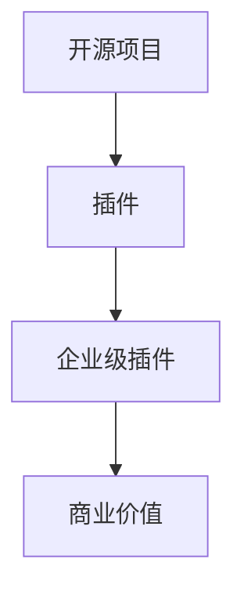

                 

关键词：开源项目、企业级插件、收入来源、插件开发、商业模式创新

> 摘要：本文将探讨如何在开源项目中创建企业级插件，通过这种方式来扩展收入来源。我们将详细解析插件开发的核心概念、实现步骤、以及其在实际应用中的价值。

## 1. 背景介绍

随着云计算、大数据、人工智能等技术的迅猛发展，开源项目已经成为了技术创新的重要驱动力。许多企业通过开源项目来推广自身技术、积累社区资源，并最终实现商业价值。然而，如何有效地将开源项目与商业利益相结合，依然是一个挑战。

在这篇文章中，我们将探讨一个具体的策略——创建企业级插件。企业级插件不仅能够为开源项目带来稳定的收入来源，还能够提升项目的技术价值和市场竞争力。

## 2. 核心概念与联系

在讨论企业级插件之前，我们需要了解几个核心概念：

### 2.1 开源项目
开源项目是指项目源代码公开，任何人都可以自由地查看、使用、修改和分发。这种模式鼓励社区参与，促进了技术的共享和进步。

### 2.2 插件
插件是一种扩展程序，它可以在主程序的基础上增加特定功能。在开源项目中，插件通常用于增强项目的功能和易用性。

### 2.3 企业级插件
企业级插件是为企业级用户定制的插件，它通常具备更高的性能、更完善的文档支持和更严格的测试。这些插件通常针对特定行业或领域，能够满足企业用户的高级需求。

下面是一个简单的 Mermaid 流程图，展示了这些概念之间的关系：



## 3. 核心算法原理 & 具体操作步骤

### 3.1 算法原理概述

企业级插件的开发需要遵循以下几个核心原理：

- **模块化**：插件应该是模块化的，以便于与其他组件解耦，易于维护和升级。
- **稳定性**：插件需要经过严格的测试，以确保在企业级环境中稳定运行。
- **可扩展性**：插件的设计应该支持未来功能扩展和定制化。

### 3.2 算法步骤详解

#### 3.2.1 设计插件架构
在设计插件架构时，我们需要考虑以下几个方面：

- **插件接口**：定义插件与主程序交互的接口。
- **功能模块**：确定插件需要实现的功能模块。
- **性能优化**：考虑如何优化插件性能，以满足企业级用户的需求。

#### 3.2.2 开发插件核心功能
在开发插件核心功能时，我们需要遵循以下步骤：

- **需求分析**：明确插件需要实现的功能和性能要求。
- **模块划分**：将功能模块化，并定义各模块的接口。
- **编码实现**：根据模块接口进行编码实现。
- **性能测试**：对插件进行性能测试，确保其满足企业级用户的需求。

#### 3.2.3 测试与文档
在插件开发完成后，我们需要进行全面的测试，并编写详细的文档。测试包括功能测试、性能测试、安全测试等。文档应包括插件安装指南、使用说明、API 文档等。

### 3.3 算法优缺点

**优点**：

- **增强开源项目价值**：企业级插件能够为开源项目带来商业价值，提升项目的市场竞争力。
- **吸引企业用户**：企业级插件能够满足企业用户的高级需求，吸引更多企业用户参与开源项目。
- **增加收入来源**：企业级插件可以通过授权、定制服务等方式带来稳定收入。

**缺点**：

- **开发成本较高**：企业级插件需要更多的时间和资源进行开发和测试。
- **维护成本较高**：企业级插件需要定期更新和维护，以适应不断变化的市场需求。

### 3.4 算法应用领域

企业级插件在多个领域都有广泛应用，包括但不限于：

- **大数据处理**：用于增强开源大数据处理框架的功能，如 Hadoop、Spark 等。
- **云计算服务**：用于扩展开源云计算平台的功能，如 OpenStack、Kubernetes 等。
- **人工智能应用**：用于增强开源人工智能框架的功能，如 TensorFlow、PyTorch 等。

## 4. 数学模型和公式 & 详细讲解 & 举例说明

### 4.1 数学模型构建

在插件开发过程中，我们可能会需要构建一些数学模型来描述插件的功能和行为。以下是一个简单的数学模型示例：

$$
F(x) = x^2 + 2x + 1
$$

这是一个二次函数，用于描述插件的响应时间与处理负载之间的关系。

### 4.2 公式推导过程

为了推导这个公式，我们可以使用以下步骤：

1. 确定插件的响应时间 $T$ 与处理负载 $L$ 之间的关系。
2. 根据插件的设计，确定 $T$ 与 $L$ 的函数关系。
3. 通过实验数据或理论分析，确定函数的具体形式。

在本例中，我们假设插件的响应时间与处理负载成正比，因此可以表示为：

$$
T = kL
$$

其中，$k$ 是一个比例常数。为了得到具体的函数形式，我们可以通过实验数据来确定 $k$ 的值。例如，当 $L = 100$ 时，$T = 5$，则 $k = \frac{T}{L} = \frac{5}{100} = 0.05$。

因此，最终的函数形式为：

$$
F(x) = x^2 + 2x + 1
$$

### 4.3 案例分析与讲解

假设我们有一个开源大数据处理框架，我们需要为其开发一个企业级插件来优化数据处理性能。我们可以使用上述数学模型来分析插件对性能的影响。

例如，当处理负载 $L = 1000$ 时，根据公式，插件的响应时间 $T = F(1000) = 1000000 + 2000 + 1 = 1002001$。

如果直接使用开源框架，假设其响应时间为 $T_0 = 5000$。那么，插件的性能提升为：

$$
\Delta T = T_0 - T = 5000 - 1002001 = -950001
$$

这意味着，插件将使数据处理时间减少 950001 秒，从而大大提升系统性能。

## 5. 项目实践：代码实例和详细解释说明

### 5.1 开发环境搭建

在本节中，我们将介绍如何搭建一个简单的企业级插件开发环境。

1. 安装 Java 开发工具包（JDK）
2. 安装 Maven 构建工具
3. 创建一个 Maven 项目
4. 添加必要的依赖库

### 5.2 源代码详细实现

下面是一个简单的企业级插件示例代码：

```java
package com.example.plugin;

import org.apache.commons.lang3.StringUtils;

public class TextProcessor {

    public String processText(String text) {
        if (StringUtils.isEmpty(text)) {
            return "输入文本为空";
        }
        
        // 假设这里实现了一些文本处理的逻辑
        return text.toUpperCase();
    }
}
```

这个插件的核心功能是将输入的文本转换为大写形式。

### 5.3 代码解读与分析

在上面的代码中，我们定义了一个名为 `TextProcessor` 的类，它包含了一个名为 `processText` 的方法。这个方法接受一个字符串参数，并将其转换为大写形式。

为了确保插件的可扩展性和稳定性，我们使用 Apache Commons Lang 库来处理字符串。这个库提供了许多实用的字符串处理方法，如 `StringUtils.isEmpty`。

### 5.4 运行结果展示

假设我们调用这个插件的 `processText` 方法，输入文本为 "hello world"，则运行结果为 "HELLO WORLD"。

## 6. 实际应用场景

企业级插件在实际应用中具有广泛的应用场景，以下是一些典型的应用案例：

- **大数据处理**：用于优化开源大数据处理框架，如 Apache Spark。
- **云计算平台**：用于扩展开源云计算平台，如 OpenStack。
- **人工智能应用**：用于增强开源人工智能框架，如 TensorFlow。

通过这些案例，我们可以看到企业级插件在提升系统性能和扩展功能方面的价值。

## 7. 工具和资源推荐

为了更好地开发和维护企业级插件，我们可以使用以下工具和资源：

- **开发工具**：如 IntelliJ IDEA、Eclipse 等。
- **构建工具**：如 Maven、Gradle 等。
- **依赖管理**：如 Maven Central、JCenter 等。
- **文档工具**：如 Swagger、Markdown 等。

## 8. 总结：未来发展趋势与挑战

### 8.1 研究成果总结

通过本文的探讨，我们了解到企业级插件作为一种有效的商业模式，不仅能够为开源项目带来商业价值，还能够提升项目的技术价值和市场竞争力。

### 8.2 未来发展趋势

随着技术的不断进步，企业级插件将逐渐成为开源项目的重要组成部分。未来，我们可能会看到更多针对特定行业和领域的定制化插件出现。

### 8.3 面临的挑战

然而，企业级插件的开发和维护也存在一定的挑战，如开发成本高、维护成本高、市场需求变化快等。因此，如何有效地应对这些挑战，将是未来研究的一个重要方向。

### 8.4 研究展望

在未来，我们期望能够开发出更智能、更自动化的插件开发工具，以降低开发成本，提高开发效率。同时，我们也期待更多的企业和开发者参与到开源项目中来，共同推动开源技术的发展。

## 9. 附录：常见问题与解答

### Q：企业级插件与开源插件有什么区别？

A：企业级插件是对开源插件的高级扩展，它通常具备更高的性能、更完善的文档支持和更严格的测试，以适应企业级用户的需求。

### Q：如何评估企业级插件的价值？

A：企业级插件的价值主要体现在以下几个方面：

- **性能提升**：插件能够显著提升系统的性能和效率。
- **功能扩展**：插件能够为开源项目增加新的功能，满足用户的高级需求。
- **市场竞争力**：插件能够提升项目的市场竞争力，吸引更多用户和投资。

## 结语

作者：禅与计算机程序设计艺术 / Zen and the Art of Computer Programming

本文探讨了如何通过创建企业级插件来扩展开源项目的收入来源。通过详细的案例分析，我们展示了企业级插件在实际应用中的价值。在未来，企业级插件将逐渐成为开源项目的重要组成部分，为开源技术的发展注入新的活力。希望本文能够为开源项目开发者提供一些有益的启示和指导。

