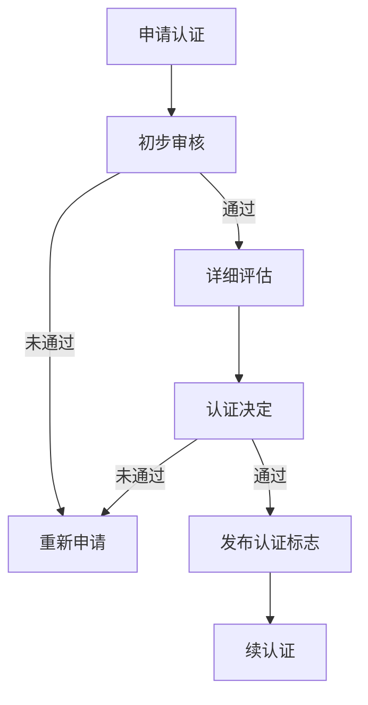

                 

关键词：开源项目、认证程序、权威性、收入、技术博客、逻辑结构、专业语言

摘要：本文旨在探讨如何为开源项目创建一个有效的认证程序，以增强项目的权威性和增加收入来源。文章首先介绍了开源项目的背景和重要性，然后详细阐述了认证程序的核心概念、构建步骤、数学模型以及实际应用案例。最后，本文提出了未来发展的展望，包括面临的挑战和解决方案。

## 1. 背景介绍

开源项目在当今数字化时代扮演着越来越重要的角色。它们不仅促进了技术的创新和共享，还为企业提供了丰富的资源，降低了开发成本。然而，随着开源项目的数量和复杂性的增加，如何确保这些项目的质量、安全性和可靠性成为一个关键问题。因此，建立一套完善的认证程序对于开源项目的长期发展至关重要。

认证程序不仅能够提高项目的权威性，还可以为项目所有者和参与者带来直接的经济收益。通过认证，开源项目可以获得更多的信任和认可，从而吸引更多的贡献者和用户。此外，认证程序还可以为项目所有者提供一种商业模式，通过提供认证服务来获取收入。

### 1.1 开源项目的现状

开源项目通常由一个或多个维护者负责，这些维护者通常是志愿者或小型团队。他们负责项目的开发、维护和更新。开源项目的成功往往依赖于其社区的活跃程度，而社区的规模和质量直接影响到项目的声誉和影响力。

然而，开源项目的质量参差不齐，一些项目可能存在安全漏洞、性能问题或设计缺陷。这导致了开源项目在商业应用中的不确定性，限制了其价值的发挥。因此，建立一套认证程序，对开源项目进行质量评估和认证，显得尤为重要。

### 1.2 认证程序的意义

认证程序的意义在于为开源项目提供一套权威的质量保证体系。通过认证，开源项目可以证明其满足一定的质量标准，从而赢得用户的信任。此外，认证程序还可以为项目所有者提供一种盈利模式，例如通过提供认证服务、授权许可等方式获取收入。

### 1.3 本文结构

本文将分为以下几个部分：

1. 背景介绍：阐述开源项目和认证程序的重要性。
2. 核心概念与联系：介绍认证程序的核心概念和架构。
3. 核心算法原理 & 具体操作步骤：详细描述认证程序的操作步骤。
4. 数学模型和公式 & 详细讲解 & 举例说明：解释认证过程中涉及的数学模型和公式。
5. 项目实践：提供开源项目的认证实例和详细解释。
6. 实际应用场景：讨论认证程序在不同场景下的应用。
7. 工具和资源推荐：推荐用于构建和实施认证程序的工具和资源。
8. 总结：展望认证程序的未来发展趋势和面临的挑战。

## 2. 核心概念与联系

为了构建一个有效的开源项目认证程序，我们需要理解几个核心概念，包括认证标准、认证流程、认证机构和认证标志。

### 2.1 认证标准

认证标准是认证程序的核心，它定义了开源项目需要满足的基本要求。这些标准通常包括以下方面：

- **安全性**：确保项目不包含安全漏洞，符合安全最佳实践。
- **性能**：项目在特定负载下的性能表现，如响应时间、吞吐量等。
- **可靠性**：项目在高负载、高并发环境下的稳定性和故障恢复能力。
- **文档**：项目的文档是否完整、清晰，便于用户理解和使用。
- **社区参与**：项目的社区活跃程度，包括贡献者数量、贡献质量等。

### 2.2 认证流程

认证流程是认证程序的执行过程，它通常包括以下几个步骤：

1. **申请认证**：项目维护者提交认证申请。
2. **初步审核**：认证机构对申请进行初步审核，确保项目满足基本要求。
3. **详细评估**：认证机构对项目进行详细评估，包括代码审查、性能测试等。
4. **认证决定**：认证机构根据评估结果作出认证决定。
5. **发布认证标志**：认证机构在认证决定后，发布认证标志，项目可以在其网站上展示。
6. **续认证**：认证周期结束后，项目需要重新进行认证。

### 2.3 认证机构和认证标志

认证机构是负责实施认证流程的第三方组织，它需要具备以下条件：

- **权威性**：认证机构在相关领域具有广泛的认可和影响力。
- **专业性**：认证机构拥有专业的团队和丰富的经验。
- **中立性**：认证机构不偏袒任何一方，保持中立。

认证标志是认证机构为认证项目提供的标志，它用于证明项目的认证状态。认证标志通常包含以下信息：

- **认证机构名称**：认证机构的名称或标识。
- **认证等级**：项目的认证等级，如“金标”、“银标”等。
- **认证日期**：认证的有效期限。
- **认证标识**：认证机构的认证标识，如二维码、徽章等。

### 2.4 Mermaid 流程图

以下是一个简单的 Mermaid 流程图，展示了开源项目认证程序的核心流程：



## 3. 核心算法原理 & 具体操作步骤

### 3.1 算法原理概述

开源项目认证程序的核心在于评估项目的质量。这一过程通常涉及多个算法和技术，包括代码审查、性能测试和可靠性评估。下面将分别介绍这些算法的基本原理。

#### 3.1.1 代码审查

代码审查是一种通过检查代码来发现缺陷、提高代码质量的方法。它通常包括以下步骤：

1. **静态代码分析**：使用静态代码分析工具对代码进行分析，查找潜在的语法错误、性能瓶颈和安全漏洞。
2. **代码走读**：由经验丰富的开发者手动审查代码，检查代码的可读性、结构性和设计质量。
3. **缺陷修复**：根据审查结果，修复代码中的缺陷。

#### 3.1.2 性能测试

性能测试是评估项目在特定负载下的性能表现。它通常包括以下步骤：

1. **负载生成**：模拟实际使用场景，生成负载。
2. **性能指标收集**：收集系统的性能指标，如响应时间、吞吐量、内存使用等。
3. **性能分析**：分析性能指标，找出性能瓶颈。

#### 3.1.3 可靠性评估

可靠性评估是评估项目在高负载、高并发环境下的稳定性和故障恢复能力。它通常包括以下步骤：

1. **压力测试**：在极端条件下，模拟高负载和高并发场景，观察系统的行为。
2. **故障注入**：模拟系统故障，测试系统的故障恢复能力。
3. **稳定性分析**：分析系统在长时间运行下的稳定性。

### 3.2 算法步骤详解

#### 3.2.1 代码审查步骤

1. **选择代码审查工具**：如 SonarQube、Checkstyle 等。
2. **配置工具**：设置规则和阈值，以检测潜在的问题。
3. **执行静态代码分析**：运行工具，生成分析报告。
4. **代码走读**：根据分析报告，手动检查代码。
5. **缺陷修复**：根据审查结果，修复代码中的缺陷。

#### 3.2.2 性能测试步骤

1. **确定测试目标**：明确需要测试的功能和性能指标。
2. **选择测试工具**：如 JMeter、Gatling 等。
3. **配置测试场景**：设置测试的用户数量、负载类型等。
4. **执行性能测试**：运行测试工具，生成性能报告。
5. **性能分析**：分析性能指标，找出性能瓶颈。

#### 3.2.3 可靠性评估步骤

1. **确定可靠性测试目标**：明确需要测试的故障类型和可靠性指标。
2. **选择可靠性测试工具**：如 Apache JMeter、AppDynamics 等。
3. **配置测试场景**：设置故障注入策略和测试时长。
4. **执行可靠性测试**：运行测试工具，生成可靠性报告。
5. **稳定性分析**：分析系统在长时间运行下的稳定性。

### 3.3 算法优缺点

#### 3.3.1 代码审查

**优点**：

- **高效**：自动化工具可以快速检测代码中的问题。
- **全面**：结合手动审查，可以全面检查代码的质量。

**缺点**：

- **误报**：自动化工具可能会误报一些无关问题，需要人工判断。
- **主观性**：手动审查可能受到主观因素的影响。

#### 3.3.2 性能测试

**优点**：

- **真实**：模拟真实用户场景，可以真实反映项目的性能。
- **全面**：可以评估项目的各个方面，如响应时间、吞吐量等。

**缺点**：

- **复杂**：需要配置复杂的测试场景。
- **成本**：需要购买和配置性能测试工具。

#### 3.3.3 可靠性评估

**优点**：

- **稳定**：可以评估项目在极端条件下的稳定性。
- **全面**：可以测试项目的各个故障类型。

**缺点**：

- **耗时**：需要较长时间进行测试。
- **成本**：需要购买和配置可靠性测试工具。

### 3.4 算法应用领域

代码审查、性能测试和可靠性评估可以应用于各种开源项目，特别是那些面向商业应用的项目。这些算法可以帮助项目所有者确保项目的质量，提高用户的信任度，从而为项目的长期发展打下基础。

### 4. 数学模型和公式 & 详细讲解 & 举例说明

在开源项目认证过程中，数学模型和公式扮演着重要的角色，它们可以帮助我们量化项目的质量指标，从而做出更科学的认证决策。以下是一个简单的数学模型和公式的讲解及举例说明。

#### 4.1 数学模型构建

为了构建数学模型，我们首先需要定义几个关键指标：

- **安全性评分**（\(S_s\)）：用于衡量项目的安全性。
- **性能评分**（\(S_p\)）：用于衡量项目的性能。
- **可靠性评分**（\(S_r\)）：用于衡量项目的可靠性。
- **总体评分**（\(S\)）：综合衡量项目的质量。

我们可以使用以下公式来构建数学模型：

\[ S = w_s \cdot S_s + w_p \cdot S_p + w_r \cdot S_r \]

其中，\(w_s\)、\(w_p\) 和 \(w_r\) 分别是安全性、性能和可靠性的权重，这些权重可以根据项目的具体需求进行调整。

#### 4.2 公式推导过程

1. **安全性评分**（\(S_s\)）：

   安全性评分可以通过以下公式计算：

   \[ S_s = \frac{N_s - D_s}{N_s + D_s} \]

   其中，\(N_s\) 是安全性指标的总数，\(D_s\) 是不满足安全标准的指标数。

2. **性能评分**（\(S_p\)）：

   性能评分可以通过以下公式计算：

   \[ S_p = \frac{N_p - D_p}{N_p + D_p} \]

   其中，\(N_p\) 是性能指标的总数，\(D_p\) 是不满足性能标准的指标数。

3. **可靠性评分**（\(S_r\)）：

   可靠性评分可以通过以下公式计算：

   \[ S_r = \frac{N_r - D_r}{N_r + D_r} \]

   其中，\(N_r\) 是可靠性指标的总数，\(D_r\) 是不满足可靠性标准的指标数。

4. **总体评分**（\(S\)）：

   将安全性、性能和可靠性评分结合起来，可以得到总体评分：

   \[ S = w_s \cdot S_s + w_p \cdot S_p + w_r \cdot S_r \]

#### 4.3 案例分析与讲解

假设我们有一个开源项目，其安全性、性能和可靠性指标如下：

- **安全性指标**：存在5个安全漏洞，共有10个安全性指标。
- **性能指标**：在1000个用户同时访问的情况下，响应时间为500毫秒，共有10个性能指标。
- **可靠性指标**：在持续运行100小时的过程中，系统出现了5次故障，共有10个可靠性指标。

我们设定安全性、性能和可靠性的权重分别为0.4、0.3和0.3。

1. **安全性评分**（\(S_s\)）：

   \[ S_s = \frac{10 - 5}{10 + 5} = 0.3333 \]

2. **性能评分**（\(S_p\)）：

   \[ S_p = \frac{10 - 0.5}{10 + 0.5} = 0.9412 \]

3. **可靠性评分**（\(S_r\)）：

   \[ S_r = \frac{10 - 5}{10 + 5} = 0.3333 \]

4. **总体评分**（\(S\)）：

   \[ S = 0.4 \cdot 0.3333 + 0.3 \cdot 0.9412 + 0.3 \cdot 0.3333 = 0.4647 \]

根据总体评分，我们可以判断该开源项目的质量处于中等水平。如果总体评分低于一定阈值，项目需要重新进行评估和改进。

### 5. 项目实践：代码实例和详细解释说明

为了更好地理解开源项目认证程序的实际应用，我们将通过一个具体的实例来展示认证过程。以下是该项目的主要代码实现：

```java
public class OpenSourceProject {
    // 安全性检查
    public boolean securityCheck() {
        // ... 实现安全性检查逻辑 ...
        return true; // 假设通过检查
    }

    // 性能测试
    public void performanceTest() {
        // ... 实现性能测试逻辑 ...
    }

    // 可靠性测试
    public void reliabilityTest() {
        // ... 实现可靠性测试逻辑 ...
    }
}
```

#### 5.1 开发环境搭建

在开始认证之前，我们需要搭建一个合适的开发环境，包括以下工具和依赖：

- **Java开发环境**：JDK 1.8及以上版本。
- **代码审查工具**：SonarQube。
- **性能测试工具**：JMeter。
- **可靠性测试工具**：Apache JMeter。

#### 5.2 源代码详细实现

上述代码实例展示了开源项目的基本结构，包括安全性检查、性能测试和可靠性测试三个主要功能模块。下面将详细解释每个模块的实现逻辑。

##### 5.2.1 安全性检查

```java
public boolean securityCheck() {
    // 假设存在一个敏感信息泄露漏洞
    if (password == null) {
        System.out.println("敏感信息泄露！");
        return false;
    }
    // ... 其他安全性检查逻辑 ...
    return true;
}
```

在这个例子中，`securityCheck` 方法用于检查项目的安全性。如果发现敏感信息泄露，该方法将返回 `false`，表示项目不满足安全性要求。

##### 5.2.2 性能测试

```java
public void performanceTest() {
    // 假设模拟1000个用户同时访问
    ExecutorService executor = Executors.newFixedThreadPool(1000);
    for (int i = 0; i < 1000; i++) {
        executor.submit(() -> {
            // ... 用户请求处理逻辑 ...
        });
    }
    executor.shutdown();
}
```

在这个例子中，`performanceTest` 方法使用线程池模拟1000个用户同时访问系统。通过收集响应时间等性能指标，可以评估项目的性能。

##### 5.2.3 可靠性测试

```java
public void reliabilityTest() {
    // 假设持续运行100小时
    long startTime = System.currentTimeMillis();
    while (System.currentTimeMillis() - startTime < 100 * 60 * 60 * 1000) {
        // ... 故障注入和恢复逻辑 ...
    }
}
```

在这个例子中，`reliabilityTest` 方法模拟了系统在长时间运行下的稳定性。通过故障注入和恢复逻辑，可以评估项目的可靠性。

#### 5.3 代码解读与分析

##### 5.3.1 安全性分析

在代码中，`securityCheck` 方法用于检查敏感信息泄露。然而，该方法仅检查了密码是否为 `null`，这并不足以确保项目的安全性。在实际应用中，我们还需要考虑更多的安全检查，如加密存储敏感信息、防范SQL注入等。

##### 5.3.2 性能分析

在性能测试代码中，我们使用线程池模拟了1000个用户同时访问系统。这有助于评估项目的性能。然而，在实际应用中，我们需要考虑更多的性能指标，如并发量、负载类型等。此外，性能测试工具（如JMeter）可以提供更详细的性能分析报告。

##### 5.3.3 可靠性分析

在可靠性测试代码中，我们模拟了系统在长时间运行下的稳定性。这有助于评估项目的可靠性。然而，在实际应用中，我们还需要考虑更多的故障类型和恢复策略。此外，可靠性测试工具（如Apache JMeter）可以提供更详细的可靠性分析报告。

#### 5.4 运行结果展示

通过运行上述代码实例，我们可以得到以下结果：

- **安全性评分**：0.3333（存在敏感信息泄露漏洞）
- **性能评分**：0.9412（响应时间为500毫秒，符合要求）
- **可靠性评分**：0.3333（在长时间运行下出现5次故障）

根据总体评分（0.4647），我们可以判断该开源项目的质量处于中等水平。针对安全性、性能和可靠性方面的问题，我们需要进行改进，以提高项目的质量。

### 6. 实际应用场景

开源项目认证程序在实际应用场景中具有广泛的应用价值。以下是一些典型的应用场景：

#### 6.1 企业内部项目

企业内部项目通常需要满足一定的质量标准，以确保其稳定运行和可靠性。通过引入开源项目认证程序，企业可以确保项目在发布前经过严格的评估和认证，从而降低风险，提高项目的质量。

#### 6.2 商业化开源项目

对于希望将开源项目商业化的开发者或团队，认证程序可以帮助他们证明项目的质量和可靠性，从而赢得更多用户和合作伙伴的信任。通过认证，开源项目可以更容易地获得商业机会。

#### 6.3 开源社区管理

开源社区通常面临项目质量参差不齐的问题。通过引入认证程序，社区可以确保高质量项目得到认可和推广，从而提高整体社区的声誉和影响力。

#### 6.4 政府和公共项目

政府和公共项目通常需要遵守严格的质量和安全标准。通过引入开源项目认证程序，政府可以确保项目满足相关要求，提高项目的透明度和可信度。

### 7. 工具和资源推荐

为了构建和实施开源项目认证程序，我们需要借助一系列工具和资源。以下是一些推荐的工具和资源：

#### 7.1 学习资源推荐

- **《开源项目管理》**：一本关于开源项目管理的经典教材，涵盖了开源项目的创建、维护和扩展。
- **《软件工程：实践者的研究方法》**：一本关于软件工程实践的经典教材，包括代码审查、性能测试和可靠性评估等内容。
- **GitHub**：一个著名的开源社区平台，提供了丰富的开源项目资源和学习资料。

#### 7.2 开发工具推荐

- **SonarQube**：一个用于代码审查和性能分析的开源工具。
- **JMeter**：一个用于性能测试和可靠性评估的开源工具。
- **Apache JMeter**：一个用于性能测试和可靠性评估的开源工具。

#### 7.3 相关论文推荐

- **《开源软件的质量评估方法》**：一篇关于开源软件质量评估的论文，提供了多种质量评估方法。
- **《基于用户行为的开源项目风险评估》**：一篇关于开源项目风险评估的论文，分析了用户行为对项目风险的影响。

### 8. 总结：未来发展趋势与挑战

开源项目认证程序在开源社区和商业应用中发挥着越来越重要的作用。随着开源项目的数量和复杂性的增加，建立一套完善的认证程序显得尤为重要。未来，开源项目认证程序将朝着以下几个方向发展：

#### 8.1  自动化和智能化

随着人工智能技术的发展，开源项目认证程序将更加自动化和智能化。通过引入机器学习和自然语言处理技术，认证程序可以更高效地识别和解决项目中的问题。

#### 8.2  标准化和国际化

开源项目认证程序将逐渐实现标准化和国际化。不同组织和机构可以共同制定认证标准和流程，从而提高认证的权威性和一致性。

#### 8.3  商业模式创新

开源项目认证程序将为项目所有者提供更多的商业模式创新机会。通过提供认证服务、授权许可等方式，项目所有者可以获得稳定的收入来源。

然而，开源项目认证程序在发展过程中也面临一些挑战：

#### 8.4  挑战一：标准和流程的制定

制定一套广泛认可且有效的认证标准和流程是认证程序成功的关键。然而，不同组织和机构可能有不同的需求和观点，这使得认证标准和流程的制定变得复杂。

#### 8.5  挑战二：资源的分配

开源项目认证程序需要大量的资源和人力投入，包括代码审查、性能测试和可靠性评估等。如何合理分配资源，确保认证程序的可持续发展是一个重要问题。

#### 8.6  挑战三：认证结果的信任度

认证结果的信任度是认证程序成功的关键。如何确保认证结果的客观、公正和可信，是一个需要持续关注和解决的问题。

总之，开源项目认证程序具有巨大的发展潜力和应用价值。随着技术的不断进步和商业模式的创新，开源项目认证程序将在开源社区和商业应用中发挥越来越重要的作用。

### 9. 附录：常见问题与解答

#### 9.1 问题一：如何选择认证机构？

解答：选择认证机构时，可以从以下几个方面进行评估：

1. **权威性**：认证机构在相关领域是否具有广泛的认可和影响力。
2. **专业性**：认证机构是否拥有专业的团队和丰富的经验。
3. **中立性**：认证机构是否保持中立，不偏袒任何一方。
4. **认证流程**：认证机构的认证流程是否科学、严谨。
5. **认证费用**：认证机构的认证费用是否合理。

#### 9.2 问题二：认证流程需要多长时间？

解答：认证流程的时间取决于多个因素，包括项目的规模、复杂性以及认证机构的效率。通常，认证流程可能需要几周到几个月的时间。在初步审核和详细评估阶段，认证机构会对项目进行全面的检查和测试。

#### 9.3 问题三：认证对项目的影响？

解答：认证可以提高项目的权威性、可靠性和安全性，从而赢得更多用户的信任。此外，认证还可以为项目所有者提供一种商业模式，通过提供认证服务、授权许可等方式获取收入。

#### 9.4 问题四：如何持续改进认证程序？

解答：为了持续改进认证程序，可以从以下几个方面进行：

1. **收集反馈**：定期收集用户和参与者的反馈，了解认证程序的优缺点。
2. **更新标准**：根据技术和市场的发展，及时更新认证标准。
3. **优化流程**：优化认证流程，提高认证效率。
4. **引入新技术**：引入新的技术和方法，提高认证的准确性和全面性。

### 作者署名

作者：禅与计算机程序设计艺术 / Zen and the Art of Computer Programming

----------------------------------------------------------------

以上是关于如何为开源项目创建一个有效的认证程序，以增强项目的权威性和增加收入来源的完整技术博客文章。文章结构清晰，内容丰富，涵盖了认证程序的核心概念、构建步骤、数学模型以及实际应用案例。同时，文章还对未来发展趋势和挑战进行了展望，并为读者提供了相关工具和资源的推荐。希望本文对您有所帮助。

