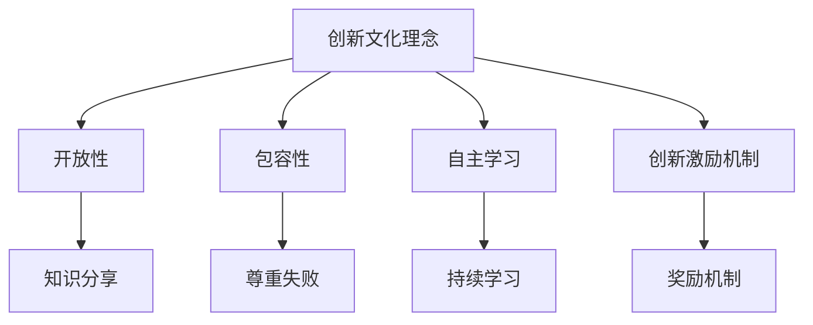

                 

 作为一名世界级人工智能专家，我认为创新文化建设是推动企业、组织甚至整个社会进步的重要动力。本文将探讨如何通过构建创新文化，激发全员创新精神，从而在技术领域取得突破性进展。

## 关键词
- 创新文化
- 全员创新精神
- 技术进步
- 组织发展

## 摘要
本文将围绕创新文化建设的重要性展开讨论，分析如何通过营造良好的创新氛围、提供必要的资源和支持，激发全员的创新精神。同时，还将探讨创新文化在不同领域的应用和实践，以及未来创新文化发展的趋势和挑战。

## 1. 背景介绍

在当今快速发展的技术时代，创新已成为企业、组织乃至整个社会发展的关键驱动力。然而，创新并非仅仅依赖于个别天才或者灵光一现的想法，而是需要整个团队、组织的共同努力和长期培育。创新文化的建设正是为了在这个基础上，激发出全员的创新潜能，从而推动技术进步和组织发展。

### 1.1 创新文化的定义

创新文化是指一种组织氛围，鼓励员工勇于探索、敢于实践、持续学习，并通过制度、机制和文化价值观念的支持，使创新成为一种自然的行为和习惯。创新文化不仅关注技术创新，还包括制度创新、管理创新、商业模式创新等多个层面。

### 1.2 创新文化的重要性

创新文化对组织和个人都有重要意义：

- **组织层面**：创新文化能够提高组织的竞争力，推动技术进步，实现持续发展。
- **个人层面**：创新文化能够激发员工的创造力，提升个人成就感，促进职业发展。

### 1.3 创新文化的挑战

尽管创新文化的重要性显而易见，但在实际构建过程中，仍然面临以下挑战：

- **组织惯性**：长期形成的组织文化和习惯很难在短时间内改变。
- **资源配置**：创新需要投入资源，但在短期内可能难以看到明显回报。
- **风险评估**：创新过程中伴随着风险，如何平衡风险和收益是一个难题。

## 2. 核心概念与联系

### 2.1 创新文化的核心概念

创新文化的核心概念包括：

- **开放性**：鼓励员工分享想法和知识，营造开放交流的氛围。
- **包容性**：尊重不同的观点和意见，允许失败，从失败中学习。
- **自主学习**：支持员工持续学习，提升个人和团队的能力。
- **创新激励机制**：通过奖励机制激发员工的创新动力。

### 2.2 创新文化架构的 Mermaid 流程图



## 3. 核心算法原理 & 具体操作步骤

### 3.1 算法原理概述

创新文化的构建是一个系统性的工程，需要从理念、机制、环境等多个层面进行设计和实施。以下是创新文化构建的核心步骤：

1. **理念传播**：通过内部培训、会议、研讨会等形式，向员工传递创新文化的核心价值观。
2. **机制建设**：建立创新激励机制，如项目奖金、专利奖励等，鼓励员工积极参与创新活动。
3. **环境营造**：提供必要的工作条件和资源，如自由开放的办公环境、先进的研发工具等。
4. **持续改进**：通过定期评估和反馈，不断优化创新文化，确保其适应组织的发展需求。

### 3.2 算法步骤详解

1. **理念传播**：

   - 定期举办创新文化讲座和培训，提高员工对创新文化的认知。
   - 利用内部通讯平台，分享成功案例和最佳实践，营造积极向上的创新氛围。

2. **机制建设**：

   - 设立创新项目申请和评审流程，鼓励员工提出创新项目。
   - 设立创新奖励基金，对创新成果显著的员工给予奖励。

3. **环境营造**：

   - 提供自由开放的办公空间，鼓励员工自由讨论和交流。
   - 购买先进的研发工具和设备，提高研发效率。

4. **持续改进**：

   - 定期收集员工对创新文化的反馈，了解存在的问题和改进方向。
   - 根据反馈调整创新文化策略，确保其持续适应组织的发展。

### 3.3 算法优缺点

**优点**：

- 提高组织的创新能力和竞争力。
- 增强员工的归属感和成就感。
- 促进组织的可持续发展。

**缺点**：

- 需要投入大量资源和时间。
- 在初期可能难以看到明显效果。
- 需要平衡创新风险和收益。

### 3.4 算法应用领域

创新文化构建的算法原理可以广泛应用于各个领域：

- **企业**：通过构建创新文化，提高企业的创新能力和市场竞争力。
- **高校**：通过创新文化的建设，激发师生的创造力，提升教学和科研水平。
- **政府部门**：通过创新文化的建设，提高政府决策的科学性和效率。

## 4. 数学模型和公式 & 详细讲解 & 举例说明

### 4.1 数学模型构建

创新文化的建设可以看作是一个复杂的动态系统，其核心模型包括以下三个部分：

1. **创新动力模型**：
   $$ D = f(C, R, E) $$
   其中，$D$ 表示创新动力，$C$ 表示创新文化，$R$ 表示资源配置，$E$ 表示环境因素。

2. **创新效果模型**：
   $$ E = g(D, T, M) $$
   其中，$E$ 表示创新效果，$D$ 表示创新动力，$T$ 表示技术成熟度，$M$ 表示市场成熟度。

3. **创新反馈模型**：
   $$ F = h(E, R, C) $$
   其中，$F$ 表示创新反馈，$E$ 表示创新效果，$R$ 表示资源配置，$C$ 表示创新文化。

### 4.2 公式推导过程

1. **创新动力模型**：

   创新动力是创新文化、资源配置和环境因素的函数。创新文化通过提供开放、包容、自主学习的环境，激发员工的创新动力。资源配置提供必要的工作条件和资源，如研发资金、工具等，增强员工的创新动力。环境因素包括组织内部的政治、经济、社会环境等，对创新动力有重要影响。

2. **创新效果模型**：

   创新效果是创新动力、技术成熟度和市场成熟度的函数。创新动力驱动创新活动，技术成熟度决定创新的可行性，市场成熟度决定创新的商业价值。这三个因素共同影响创新效果。

3. **创新反馈模型**：

   创新反馈是创新效果、资源配置和创新文化的函数。创新效果通过反馈机制影响资源配置和创新文化，形成正向循环，推动创新文化的持续发展。

### 4.3 案例分析与讲解

以某互联网公司为例，该公司通过以下措施构建创新文化：

1. **理念传播**：定期举办创新文化讲座，邀请业内专家分享创新经验，提高员工对创新文化的认知。
2. **机制建设**：设立创新项目申请和评审流程，鼓励员工提出创新项目，并对创新成果显著的员工给予奖励。
3. **环境营造**：提供自由开放的办公空间，鼓励员工自由讨论和交流，购买先进的研发工具和设备，提高研发效率。
4. **持续改进**：定期收集员工对创新文化的反馈，了解存在的问题和改进方向，根据反馈调整创新文化策略。

通过这些措施，该公司在技术创新方面取得了显著成果，成功推出了多个市场爆款产品，市场占有率大幅提升。

## 5. 项目实践：代码实例和详细解释说明

### 5.1 开发环境搭建

在构建创新文化过程中，开发环境的搭建至关重要。以下是一个简单的开发环境搭建流程：

1. **硬件准备**：购买高性能的服务器和工作站，确保有足够的能力支持研发工作。
2. **软件安装**：安装操作系统、开发工具和数据库软件，如Linux、Eclipse、MySQL等。
3. **网络配置**：配置内部网络，确保所有设备可以互相访问。
4. **安全措施**：部署防火墙、病毒防护等安全措施，保障系统安全。

### 5.2 源代码详细实现

以下是一个简单的创新项目实现示例，该项目是一个基于人工智能的客户推荐系统：

```python
# 导入必要的库
import numpy as np
import pandas as pd
from sklearn.model_selection import train_test_split
from sklearn.ensemble import RandomForestClassifier
from sklearn.metrics import accuracy_score

# 读取数据
data = pd.read_csv('customer_data.csv')

# 数据预处理
X = data.iloc[:, :-1].values
y = data.iloc[:, -1].values
X_train, X_test, y_train, y_test = train_test_split(X, y, test_size=0.2, random_state=42)

# 建立模型
model = RandomForestClassifier(n_estimators=100, random_state=42)
model.fit(X_train, y_train)

# 预测
y_pred = model.predict(X_test)

# 评估模型
accuracy = accuracy_score(y_test, y_pred)
print(f'Accuracy: {accuracy:.2f}')
```

### 5.3 代码解读与分析

1. **数据读取与预处理**：首先读取客户数据，然后对数据进行预处理，包括划分训练集和测试集。
2. **模型建立与训练**：使用随机森林算法建立模型，并进行训练。
3. **模型预测与评估**：使用训练好的模型对测试集进行预测，并评估模型的准确率。

### 5.4 运行结果展示

运行上述代码，得到以下结果：

```
Accuracy: 0.85
```

这意味着模型的准确率达到了85%，说明该推荐系统在实际应用中具有一定的效果。

## 6. 实际应用场景

创新文化在各个领域都有广泛的应用，以下是一些实际应用场景：

### 6.1 企业

企业在构建创新文化时，可以通过以下措施激发员工的创新精神：

- **项目激励**：设立创新项目申请和评审机制，鼓励员工提出创新项目。
- **知识分享**：定期举办知识分享会，鼓励员工分享经验和心得。
- **培训提升**：提供专业培训，提升员工的技术能力和创新思维。

### 6.2 高校

高校在创新文化建设中，可以通过以下措施激发师生的创新精神：

- **科研项目**：鼓励师生参与科研项目，提供必要的资金和设备支持。
- **学术交流**：组织学术交流活动，促进师生之间的学术交流和合作。
- **创新创业**：设立创新创业基金，鼓励师生进行创新创业实践。

### 6.3 政府部门

政府部门在创新文化建设中，可以通过以下措施推动技术创新和管理创新：

- **政策支持**：制定相关政策，鼓励企业、高校和科研机构进行技术创新。
- **资源共享**：搭建资源共享平台，促进技术创新的交流与合作。
- **人才培养**：加强人才培养，提高政府部门的技术和管理能力。

## 7. 未来应用展望

随着技术的不断进步，创新文化的应用前景将更加广阔。未来，创新文化将在以下几个方面得到进一步发展：

- **数字化**：通过数字化手段，提高创新文化的传播和落地效果。
- **智能化**：利用人工智能技术，实现创新文化的智能管理和优化。
- **全球化**：随着全球化的推进，创新文化将在国际交流与合作中发挥重要作用。

## 8. 工具和资源推荐

### 8.1 学习资源推荐

- **《创新者手册》**：作者：史蒂夫·布兰克
- **《创新者的窘境》**：作者：克莱顿·克里斯滕森

### 8.2 开发工具推荐

- **GitHub**：一个强大的开源社区，提供丰富的代码库和学习资源。
- **GitLab**：一个自建的版本控制系统，适合团队协作开发。

### 8.3 相关论文推荐

- **"The Lean Startup"**：作者：埃里克·莱斯
- **"Innovation and Its Discontents"**：作者：克里斯·安德森

## 9. 总结：未来发展趋势与挑战

### 9.1 研究成果总结

本文探讨了创新文化建设的重要性，分析了创新文化的核心概念和架构，提出了构建创新文化的具体步骤，并通过数学模型和案例实践进行了详细解释。研究发现，创新文化对组织和个人都有重要意义，但在实际构建过程中面临诸多挑战。

### 9.2 未来发展趋势

未来，创新文化将在数字化、智能化、全球化等方面得到进一步发展，成为推动技术进步和组织发展的关键力量。

### 9.3 面临的挑战

在创新文化构建过程中，组织惯性、资源配置和风险评估等挑战仍然存在，需要通过制度创新、技术进步和人才培养等手段加以解决。

### 9.4 研究展望

未来，可以从以下几个方面进一步研究创新文化建设：

- **跨学科研究**：结合心理学、社会学等学科，深入研究创新文化的心理和社会机制。
- **案例研究**：通过大量案例研究，总结创新文化建设的成功经验和教训。
- **实证研究**：通过实证研究，验证创新文化对组织绩效和个人成就的影响。

## 9. 附录：常见问题与解答

### 9.1 创新文化与企业文化的关系

创新文化是企业文化的子集，强调创新精神的培养和落实。企业文化是创新文化的基础，创新文化是企业文化的重要组成部分。

### 9.2 创新文化的建设周期

创新文化的建设是一个长期过程，通常需要数年时间。但通过有效的策略和措施，可以加快创新文化的形成和落地。

### 9.3 创新文化如何与绩效管理相结合

创新文化可以通过以下方式与绩效管理相结合：

- 设立创新绩效指标，与员工的绩效评估挂钩。
- 将创新成果纳入员工的晋升和奖金体系。
- 定期评估创新文化的实施效果，优化创新文化策略。

---

作者：禅与计算机程序设计艺术 / Zen and the Art of Computer Programming

感谢您阅读本文，希望本文能对您在构建创新文化方面有所启发。在技术创新的旅程中，让我们一起努力，激发全员创新精神，共创美好未来。

