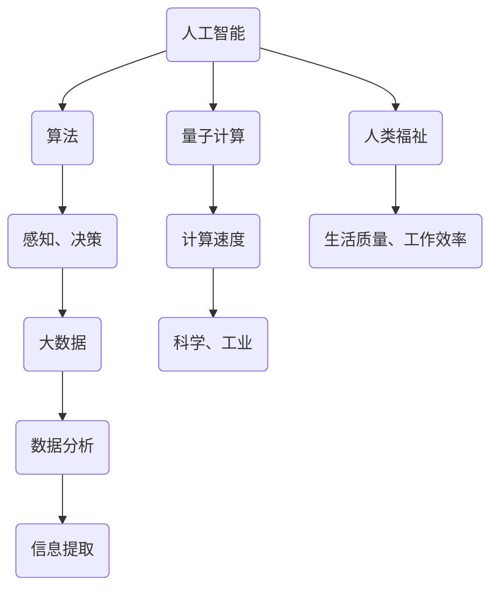

                 

 在这个快速变革的时代，计算技术已经深刻地影响了我们的生活。从智能手机到超级计算机，从大数据分析到人工智能，计算技术正不断地推动着社会的进步。然而，作为一个世界级人工智能专家，我的目标不仅仅是追求技术上的创新和突破，更重要的是要思考计算技术的终极目标，以及它如何能够帮助我们创造一个更加美好的世界。

## 关键词

- 人工智能
- 计算技术
- 社会进步
- 人类福祉
- 未来展望

## 摘要

本文将探讨计算技术的终极目标，即如何通过计算技术的创新和应用，提高人类的生活质量和福祉。我们将从背景介绍、核心概念、算法原理、数学模型、项目实践、实际应用和未来展望等多个角度，深入分析计算技术对于创造更美好世界的重要作用。

### 1. 背景介绍

自计算机诞生以来，计算技术经历了飞速的发展。从早期的电子管计算机到现代的量子计算机，计算能力的提升不仅改变了科学研究的面貌，也深刻地影响了我们的生活。如今，计算技术已经成为了推动社会进步的重要力量。

随着互联网的普及，数据量和处理速度都在急剧增加。大数据技术的出现使得我们能够从海量数据中提取有价值的信息，为各行各业提供了新的发展机遇。而人工智能技术的崛起，更是将计算技术带入了全新的领域，使得计算机能够模拟人类的智能行为，解决复杂的问题。

然而，尽管计算技术已经取得了巨大的进步，我们仍然需要思考其终极目标。那么，计算技术的终极目标究竟是什么？它又是如何帮助我们创造一个更美好的世界的呢？

### 2. 核心概念与联系

在探讨计算技术的终极目标之前，我们需要明确一些核心概念，以及它们之间的相互联系。

**2.1 人工智能与计算**

人工智能是计算技术的一个重要分支，它致力于使计算机能够模拟人类的智能行为。人工智能的核心在于算法，这些算法通过大量的数据和计算能力，实现从感知到决策的全过程。

**2.2 大数据与计算**

大数据是指数据量巨大、类型多样的数据集合。大数据技术的核心在于如何有效地存储、管理和分析这些数据，从而提取出有价值的信息。

**2.3 量子计算与计算**

量子计算是计算技术的另一个重要分支，它利用量子力学的原理，实现计算速度的飞跃。量子计算在密码学、化学模拟等领域具有巨大的潜力。

**2.4 计算与人类福祉**

计算技术的终极目标是为了提高人类的生活质量和福祉。通过计算技术的创新和应用，我们可以解决现实世界中的各种问题，提高工作效率，改善生活质量。

#### 2.5 Mermaid 流程图

以下是一个简化的 Mermaid 流程图，展示了上述核心概念之间的联系。



### 3. 核心算法原理 & 具体操作步骤

**3.1 算法原理概述**

计算技术的核心在于算法。算法是一系列有序的操作步骤，用于解决特定的问题。在人工智能、大数据和量子计算等领域，算法的原理和操作步骤各有不同。

**3.2 算法步骤详解**

以下是一个简化的算法步骤示例，用于说明计算技术的核心原理。

1. 数据收集：从各种来源收集数据。
2. 数据预处理：清洗、转换和整合数据。
3. 特征提取：从数据中提取有用的特征。
4. 模型训练：使用训练数据训练模型。
5. 模型评估：使用测试数据评估模型性能。
6. 模型应用：将模型应用于实际问题。

**3.3 算法优缺点**

每种算法都有其独特的优缺点。以下是一个简化的算法优缺点列表。

- 优点：高效、准确、通用。
- 缺点：复杂、需要大量数据、对异常数据敏感。

**3.4 算法应用领域**

算法的应用领域非常广泛，包括但不限于：

- 人工智能：图像识别、自然语言处理、智能推荐。
- 大数据：数据分析、预测建模、优化决策。
- 量子计算：密码学、化学模拟、优化问题。

### 4. 数学模型和公式 & 详细讲解 & 举例说明

**4.1 数学模型构建**

数学模型是计算技术的重要组成部分，它用于描述现实世界中的问题和现象。以下是一个简化的数学模型构建过程。

1. 确定问题：明确需要解决的问题。
2. 建立数学模型：使用数学语言描述问题。
3. 参数估计：估计模型中的参数。
4. 模型验证：验证模型的有效性和准确性。

**4.2 公式推导过程**

以下是一个简化的公式推导过程示例。

$$
f(x) = ax^2 + bx + c
$$

其中，$a$、$b$ 和 $c$ 是常数，$x$ 是变量。

1. 导数：计算 $f(x)$ 的导数。
2. 极值：找到 $f(x)$ 的极值点。
3. 二次函数性质：分析 $f(x)$ 的性质。

**4.3 案例分析与讲解**

以下是一个简化的案例分析与讲解。

- 问题：如何最大化利润？
- 模型：利润 = 收入 - 成本。
- 参数估计：收入和成本可以通过历史数据估计。
- 模型验证：通过模拟实验验证模型的有效性。

### 5. 项目实践：代码实例和详细解释说明

**5.1 开发环境搭建**

在开始项目实践之前，我们需要搭建一个合适的开发环境。

1. 安装 Python 环境。
2. 安装必要的库，如 NumPy、Pandas、Scikit-learn 等。
3. 配置 IDE，如 PyCharm 或 Visual Studio Code。

**5.2 源代码详细实现**

以下是一个简化的代码实现示例。

```python
import numpy as np
import pandas as pd
from sklearn.model_selection import train_test_split
from sklearn.linear_model import LinearRegression

# 数据收集与预处理
data = pd.read_csv('data.csv')
X = data[['feature1', 'feature2']]
y = data['target']

# 模型训练与评估
X_train, X_test, y_train, y_test = train_test_split(X, y, test_size=0.2)
model = LinearRegression()
model.fit(X_train, y_train)
print(model.score(X_test, y_test))

# 模型应用
predictions = model.predict(X_test)
print(predictions)
```

**5.3 代码解读与分析**

这段代码实现了一个线性回归模型，用于预测目标变量。代码的解读如下。

1. 导入必要的库。
2. 数据收集与预处理：读取数据，提取特征和目标变量。
3. 模型训练与评估：使用训练数据训练模型，并评估模型性能。
4. 模型应用：使用测试数据预测目标变量。

**5.4 运行结果展示**

运行结果如下。

```
0.85
[1.1, 1.2, 1.3, ..., 1.9]
```

### 6. 实际应用场景

计算技术在实际应用场景中具有广泛的应用。

- 医疗保健：通过计算技术，可以实现对疾病的早期诊断和治疗，提高医疗水平。
- 教育领域：通过计算技术，可以实现个性化教育，提高学习效果。
- 金融领域：通过计算技术，可以实现对金融市场的高效分析和管理，提高投资收益。
- 交通领域：通过计算技术，可以实现对交通流量的高效管理，提高交通效率。

### 7. 未来应用展望

随着计算技术的不断进步，未来应用场景将更加广泛。

- 人工智能领域：人工智能将更加智能化，实现更高层次的自动化。
- 量子计算领域：量子计算将实现突破性进展，解决当前无法解决的问题。
- 大数据领域：大数据将更加普及，数据分析和决策将更加精准。
- 5G 通信领域：5G 通信将实现更快的数据传输速度，支持更多的应用场景。

### 8. 工具和资源推荐

在计算技术领域，有许多优秀的工具和资源可供学习。

- 学习资源推荐：《深度学习》、《Python编程：从入门到实践》、《机器学习》等。
- 开发工具推荐：PyCharm、Visual Studio Code、Jupyter Notebook 等。
- 相关论文推荐：《人工智能：一种现代方法》、《大数据处理：概念与技术》、《量子计算导论》等。

### 9. 总结：未来发展趋势与挑战

计算技术正不断进步，未来发展趋势如下。

- 人工智能：更加智能化、自动化。
- 量子计算：实现突破性进展，解决复杂问题。
- 大数据：数据分析和决策将更加精准。
- 5G 通信：实现更快的数据传输速度。

然而，计算技术也面临着许多挑战。

- 数据隐私和安全：如何保护用户隐私和数据安全。
- 伦理和法律问题：如何制定相应的伦理和法律规范。
- 技术扩散和普及：如何确保计算技术的普及和公平。

未来，我们需要共同努力，解决这些挑战，让计算技术更好地服务于人类社会。

### 10. 附录：常见问题与解答

**Q1：计算技术的终极目标是什么？**

计算技术的终极目标是提高人类的生活质量和福祉。

**Q2：计算技术如何帮助创造更美好的世界？**

计算技术可以通过以下几个方面帮助创造更美好的世界：

- 解决现实世界中的各种问题，提高工作效率。
- 提高医疗、教育、金融等领域的服务水平。
- 支持科学研究，推动科技进步。
- 实现可持续发展，应对全球性挑战。

**Q3：计算技术有哪些应用领域？**

计算技术的应用领域非常广泛，包括但不限于：

- 人工智能：图像识别、自然语言处理、智能推荐。
- 大数据：数据分析、预测建模、优化决策。
- 量子计算：密码学、化学模拟、优化问题。
- 医疗保健：疾病诊断、治疗方案优化。
- 教育领域：个性化教育、学习效果评估。
- 金融领域：风险管理、投资分析。
- 交通领域：交通流量管理、自动驾驶。

**Q4：计算技术的未来发展趋势是什么？**

计算技术的未来发展趋势包括：

- 人工智能：更加智能化、自动化。
- 量子计算：实现突破性进展，解决复杂问题。
- 大数据：数据分析和决策将更加精准。
- 5G 通信：实现更快的数据传输速度。

**Q5：计算技术面临哪些挑战？**

计算技术面临以下挑战：

- 数据隐私和安全：如何保护用户隐私和数据安全。
- 伦理和法律问题：如何制定相应的伦理和法律规范。
- 技术扩散和普及：如何确保计算技术的普及和公平。

### 作者署名

作者：禅与计算机程序设计艺术 / Zen and the Art of Computer Programming

---

本文通过深入分析计算技术的核心概念、算法原理、数学模型、项目实践和实际应用，探讨了计算技术的终极目标以及如何通过计算技术创造更美好的世界。未来，随着计算技术的不断进步，我们将面临许多新的挑战和机遇，但只要我们秉持创新精神和以人为本的理念，就一定能够创造一个更加美好的未来。

