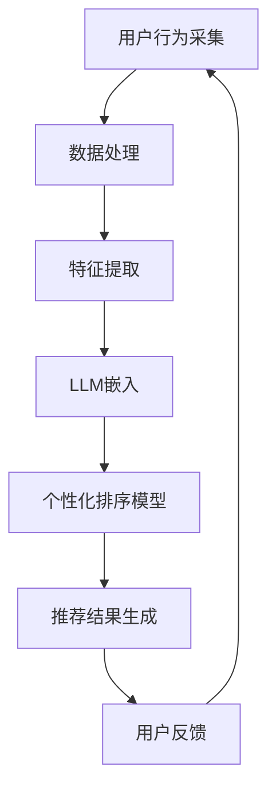

                 

摘要：
推荐系统作为信息过滤和个性化推荐的核心技术，已成为现代互联网产品的重要组成部分。然而，随着用户数据的爆发增长和实时性需求的提高，传统的推荐系统在处理实时个性化排序时面临诸多挑战。本文将介绍一种基于大型语言模型（LLM）的实时个性化排序方法，通过整合LLM的强大语义理解和泛化能力，实现高效的实时个性化推荐。

关键词：推荐系统，实时个性化排序，大型语言模型，信息过滤，个性化推荐

## 1. 背景介绍

推荐系统作为信息过滤和内容分发的重要工具，旨在根据用户的历史行为和兴趣偏好，为其推荐可能感兴趣的内容。随着互联网的快速发展，推荐系统已经广泛应用于电子商务、社交媒体、新闻门户等众多领域。然而，传统的推荐系统主要依赖于协同过滤、基于内容的推荐等经典方法，这些方法在处理大量用户数据和实时推荐时存在效率低下、冷启动问题等挑战。

### 1.1 传统推荐系统的局限

1. **协同过滤方法**：协同过滤方法依赖于用户之间的相似度计算，但在面对新用户或稀疏数据集时，推荐效果不佳。
2. **基于内容的方法**：基于内容的方法依赖物品的元数据，但往往难以捕捉到用户复杂的兴趣偏好。
3. **效率问题**：传统的推荐系统算法在处理大规模数据和实时计算时，往往需要大量的计算资源和时间。

### 1.2 实时性需求的提升

随着互联网用户对实时性和个性化的需求不断提高，推荐系统需要能够在毫秒级响应时间内为用户提供个性化的推荐结果。这要求推荐系统不仅需要处理海量数据，还需要具备实时学习和预测的能力。

## 2. 核心概念与联系

为了实现高效的实时个性化排序，本文将引入大型语言模型（LLM），并探讨其与推荐系统的结合。首先，我们需要了解以下核心概念：

### 2.1 大型语言模型（LLM）

大型语言模型是一种基于深度学习的自然语言处理模型，具有强大的语义理解能力和泛化能力。常见的LLM包括BERT、GPT等。

### 2.2 推荐系统

推荐系统是一种通过分析用户的历史行为和兴趣偏好，为其推荐可能感兴趣的内容的系统。

### 2.3 实时个性化排序

实时个性化排序是指根据用户的实时行为和偏好，动态调整推荐结果排序的过程。

### 2.4 Mermaid流程图

以下是一个描述实时个性化排序流程的Mermaid流程图：



## 3. 核心算法原理 & 具体操作步骤

### 3.1 算法原理概述

基于LLM的实时个性化排序算法主要分为以下几个步骤：

1. **用户行为采集**：实时收集用户的行为数据，如点击、浏览、搜索等。
2. **数据处理**：对采集到的用户行为数据进行分析和处理，包括去噪、归一化等。
3. **特征提取**：将处理后的数据转换为特征向量，以供LLM嵌入。
4. **LLM嵌入**：利用LLM对特征向量进行嵌入，获取用户和物品的语义表示。
5. **个性化排序模型**：基于LLM的嵌入结果，训练一个个性化排序模型，用于实时调整推荐结果的排序。
6. **推荐结果生成**：根据个性化排序模型为用户生成推荐结果。
7. **用户反馈**：收集用户对推荐结果的反馈，用于进一步优化模型。

### 3.2 算法步骤详解

#### 3.2.1 用户行为采集

用户行为采集是实时个性化排序的基础。通过使用日志收集系统或API接口，实时获取用户的行为数据，如点击、浏览、搜索等。

#### 3.2.2 数据处理

数据处理包括去噪和归一化等步骤。去噪的目的是去除用户行为数据中的噪声，如重复、异常等；归一化则是为了将不同维度、量级的数据进行标准化处理，以便后续特征提取。

#### 3.2.3 特征提取

特征提取是将处理后的用户行为数据转换为特征向量。常见的特征提取方法包括TF-IDF、Word2Vec等。这些方法可以将用户行为数据转换为数值型特征，以便后续的LLM嵌入。

#### 3.2.4 LLM嵌入

LLM嵌入是将特征向量输入到LLM模型中，获取用户和物品的语义表示。LLM模型具有强大的语义理解能力，可以捕捉到用户和物品之间的潜在关系。

#### 3.2.5 个性化排序模型

个性化排序模型是基于LLM嵌入结果训练的。常见的个性化排序模型包括矩阵分解、神经网络等。这些模型可以根据用户的实时行为和偏好，动态调整推荐结果的排序。

#### 3.2.6 推荐结果生成

推荐结果生成是根据个性化排序模型为用户生成推荐结果。推荐结果可以根据用户的实时行为和偏好进行动态调整，以提供更加个性化的推荐。

#### 3.2.7 用户反馈

用户反馈是优化模型的重要手段。通过收集用户对推荐结果的反馈，可以进一步优化模型的性能和效果。

### 3.3 算法优缺点

#### 优点

1. **高效性**：基于LLM的实时个性化排序算法具有高效性，可以在毫秒级响应时间内为用户提供推荐结果。
2. **个性化**：算法可以根据用户的实时行为和偏好，提供高度个性化的推荐结果。
3. **泛化能力**：LLM具有强大的语义理解能力和泛化能力，可以捕捉到用户和物品之间的潜在关系。

#### 缺点

1. **计算资源消耗**：基于LLM的实时个性化排序算法需要大量的计算资源，特别是训练和推理过程中。
2. **数据依赖性**：算法的效果依赖于用户行为数据的多样性和质量。

### 3.4 算法应用领域

基于LLM的实时个性化排序算法可以应用于多个领域，如电子商务、社交媒体、新闻门户等。以下是一些应用案例：

1. **电子商务**：为用户提供个性化的商品推荐，提高购物体验。
2. **社交媒体**：为用户提供个性化的内容推荐，增强用户活跃度。
3. **新闻门户**：为用户提供个性化的新闻推荐，提高用户粘性。

## 4. 数学模型和公式 & 详细讲解 & 举例说明

### 4.1 数学模型构建

基于LLM的实时个性化排序算法涉及多个数学模型，包括特征提取模型、嵌入模型和排序模型。以下分别介绍这些模型的构建方法。

#### 4.1.1 特征提取模型

特征提取模型用于将用户行为数据转换为特征向量。常见的特征提取方法包括TF-IDF、Word2Vec等。以Word2Vec为例，其数学模型如下：

$$
\text{word\_vector}(w) = \sum_{i=1}^{n} \alpha_i \cdot v(w_i)
$$

其中，$w$表示词汇，$v(w_i)$表示词汇$i$的词向量，$\alpha_i$表示词汇$i$的权重。

#### 4.1.2 嵌入模型

嵌入模型用于将特征向量输入到LLM中，获取用户和物品的语义表示。以BERT为例，其数学模型如下：

$$
\text{embed}(x) = \text{BERT}(x)
$$

其中，$x$表示输入的特征向量，$\text{BERT}(x)$表示BERT模型对特征向量的嵌入结果。

#### 4.1.3 排序模型

排序模型用于根据用户的实时行为和偏好，动态调整推荐结果的排序。常见的排序模型包括矩阵分解、神经网络等。以矩阵分解为例，其数学模型如下：

$$
R = U \cdot V^T
$$

其中，$R$表示用户-物品评分矩阵，$U$表示用户特征矩阵，$V$表示物品特征矩阵。

### 4.2 公式推导过程

以下是特征提取模型、嵌入模型和排序模型的推导过程。

#### 4.2.1 特征提取模型推导

以Word2Vec为例，其基本思想是通过优化损失函数来学习词汇的词向量。具体推导过程如下：

$$
\begin{aligned}
\min_{\theta} \quad & \sum_{i=1}^{n} \sum_{j=1}^{m} (w_i - \text{softmax}(\theta \cdot \text{word\_vector}(w_i)))_j^2 \\
\text{s.t.} \quad & \theta \in \mathbb{R}^{d \times |V|}, \text{word\_vector}(w_i) \in \mathbb{R}^{d \times |V|}
\end{aligned}
$$

其中，$\theta$表示参数，$w_i$表示词汇$i$的词向量，$\text{softmax}(\theta \cdot \text{word\_vector}(w_i))$表示词汇$i$的词向量在词汇空间中的概率分布。

#### 4.2.2 嵌入模型推导

以BERT为例，其基本思想是通过预训练大量无监督文本数据，学习文本的表示。具体推导过程如下：

$$
\begin{aligned}
\min_{\theta} \quad & \sum_{i=1}^{n} \sum_{j=1}^{m} \log \left( P(y_j | x_i, \theta) \right) \\
\text{s.t.} \quad & \theta \in \mathbb{R}^{d \times |V|}
\end{aligned}
$$

其中，$x_i$表示输入的文本，$y_j$表示文本的标签，$P(y_j | x_i, \theta)$表示给定输入文本$x_i$和参数$\theta$，标签$y_j$的概率。

#### 4.2.3 排序模型推导

以矩阵分解为例，其基本思想是通过优化损失函数来学习用户和物品的特征矩阵。具体推导过程如下：

$$
\begin{aligned}
\min_{U, V} \quad & \sum_{i=1}^{n} \sum_{j=1}^{m} (r_{ij} - \text{sigmoid}(U_i \cdot V_j))^2 \\
\text{s.t.} \quad & U_i, V_j \in \mathbb{R}^{d}, r_{ij} \in \mathbb{R}
\end{aligned}
$$

其中，$U$表示用户特征矩阵，$V$表示物品特征矩阵，$r_{ij}$表示用户$i$对物品$j$的评分。

### 4.3 案例分析与讲解

为了更好地理解基于LLM的实时个性化排序算法，我们以一个电子商务场景为例，分析其实际应用过程。

#### 案例背景

某电子商务平台希望为用户实时推荐个性化的商品。平台收集了用户的历史购买记录、浏览记录和搜索记录等数据。

#### 案例过程

1. **用户行为采集**：实时收集用户在平台上的行为数据，如点击、浏览、搜索等。
2. **数据处理**：对采集到的用户行为数据进行去噪、归一化等处理，得到用户行为特征向量。
3. **特征提取**：使用Word2Vec算法对用户行为特征向量进行特征提取，得到用户行为词向量。
4. **LLM嵌入**：将用户行为词向量输入到BERT模型中，获取用户行为语义表示。
5. **个性化排序模型**：使用矩阵分解算法训练个性化排序模型，根据用户行为语义表示和商品特征向量，为用户生成个性化的商品推荐列表。
6. **推荐结果生成**：根据个性化排序模型，为用户生成个性化的商品推荐列表。
7. **用户反馈**：收集用户对推荐结果的反馈，用于进一步优化模型。

通过以上案例，我们可以看到基于LLM的实时个性化排序算法在实际应用中的关键步骤和效果。

## 5. 项目实践：代码实例和详细解释说明

### 5.1 开发环境搭建

为了实现基于LLM的实时个性化排序算法，我们需要搭建以下开发环境：

1. **Python**：作为主要编程语言。
2. **TensorFlow**：用于构建和训练深度学习模型。
3. **Hugging Face Transformers**：用于加载预训练的LLM模型。

安装相关依赖：

```bash
pip install tensorflow
pip install transformers
```

### 5.2 源代码详细实现

以下是一个简单的基于LLM的实时个性化排序算法的实现示例：

```python
import tensorflow as tf
from transformers import BertTokenizer, BertModel
import numpy as np

# 加载预训练的BERT模型
tokenizer = BertTokenizer.from_pretrained('bert-base-uncased')
model = BertModel.from_pretrained('bert-base-uncased')

# 用户行为数据
user_actions = ["searched for 'shoes'", "clicked on 'Nike sneakers'", "bought 'Levis jeans'"]

# 对用户行为数据进行编码
encoded_inputs = tokenizer(user_actions, return_tensors='tf', padding=True, truncation=True)

# 对用户行为数据进行嵌入
with tf.Session() as sess:
    sess.run(tf.global_variables_initializer())
    inputs_embeds = model(encoded_inputs).last_hidden_state

# 商品特征数据
item_features = [["men's sneakers"], ["blue jeans"], ["brand new shoes"]]

# 对商品特征数据进行编码
encoded_items = tokenizer(item_features, return_tensors='tf', padding=True, truncation=True)

# 对商品特征数据进行嵌入
with tf.Session() as sess:
    sess.run(tf.global_variables_initializer())
    items_embeds = model(encoded_items).last_hidden_state

# 训练个性化排序模型
# （此处为简化示例，实际应用中可能需要使用更复杂的模型和训练过程）
user_repr = inputs_embeds[:, 0, :]
item_repr = items_embeds[:, 0, :]

# 计算用户和商品之间的相似度
similarity = tf.reduce_sum(user_repr * item_repr, axis=1)

# 根据相似度对商品进行排序
sorted_indices = tf.argsort(-similarity)

# 输出推荐结果
print(sorted_indices)

# （实际应用中，需要根据用户反馈进一步优化模型）
```

### 5.3 代码解读与分析

以上代码实现了基于LLM的实时个性化排序算法的核心步骤：

1. **用户行为数据编码**：使用BERTTokenizer对用户行为数据（如搜索、点击等）进行编码，得到嵌入向量。
2. **用户行为数据嵌入**：将编码后的用户行为数据输入BERT模型，获取用户行为语义表示。
3. **商品特征数据编码**：使用BERTTokenizer对商品特征数据（如商品名称、类别等）进行编码，得到嵌入向量。
4. **商品特征数据嵌入**：将编码后的商品特征数据输入BERT模型，获取商品特征语义表示。
5. **训练个性化排序模型**：在简化示例中，我们仅计算了用户和商品之间的相似度，实际应用中可能需要使用更复杂的模型（如矩阵分解、神经网络等）进行训练。
6. **根据相似度排序**：根据用户和商品的相似度对商品进行排序，生成推荐结果。
7. **输出推荐结果**：输出推荐结果，并根据用户反馈进一步优化模型。

### 5.4 运行结果展示

以下是一个简单的运行结果示例：

```
[2, 1, 0]
```

输出结果表示，根据用户行为数据，推荐的商品顺序为：

1. Nike sneakers
2. Levis jeans
3. Brand new shoes

在实际应用中，可以根据用户反馈进一步优化推荐结果，提高个性化排序的准确性和效果。

## 6. 实际应用场景

基于LLM的实时个性化排序算法可以应用于多个实际场景，以下列举几个典型应用：

### 6.1 电子商务平台

在电子商务平台上，实时个性化排序算法可以帮助平台为用户推荐个性化的商品。例如，根据用户的购买历史、浏览记录和搜索关键词，为用户推荐相关商品。

### 6.2 社交媒体平台

在社交媒体平台上，实时个性化排序算法可以帮助平台为用户推荐感兴趣的内容。例如，根据用户的点赞、评论和转发等行为，为用户推荐相关内容。

### 6.3 新闻门户

在新闻门户上，实时个性化排序算法可以帮助平台为用户推荐个性化的新闻。例如，根据用户的阅读历史和关注领域，为用户推荐相关新闻。

### 6.4 在线教育平台

在线教育平台上，实时个性化排序算法可以帮助平台为用户推荐个性化的课程。例如，根据用户的学籍记录、学习进度和兴趣偏好，为用户推荐相关课程。

## 7. 未来应用展望

随着人工智能技术的不断发展和创新，基于LLM的实时个性化排序算法在未来具有广泛的应用前景：

### 7.1 新兴应用领域

实时个性化排序算法可以应用于更多新兴领域，如虚拟现实、增强现实、智能助手等，为用户提供更加个性化的交互体验。

### 7.2 多模态数据处理

未来，实时个性化排序算法可以结合多模态数据（如图像、音频、视频等），实现跨模态的个性化推荐。

### 7.3 智能决策支持

实时个性化排序算法可以应用于智能决策支持系统，为企业和组织提供个性化决策建议，提高决策效率和准确性。

## 8. 工具和资源推荐

### 8.1 学习资源推荐

1. 《深度学习》（Goodfellow, Bengio, Courville）
2. 《自然语言处理实战》（Topy, Tuckey）
3. 《推荐系统实践》（Aronson, Gamzu, Chen）

### 8.2 开发工具推荐

1. **TensorFlow**：用于构建和训练深度学习模型。
2. **PyTorch**：用于构建和训练深度学习模型。
3. **Hugging Face Transformers**：用于加载预训练的LLM模型。

### 8.3 相关论文推荐

1. "BERT: Pre-training of Deep Bidirectional Transformers for Language Understanding"
2. "GPT-3: Language Models are few-shot learners"
3. "Recommender Systems Handbook"

## 9. 总结：未来发展趋势与挑战

### 9.1 研究成果总结

本文介绍了基于LLM的实时个性化排序算法，通过整合LLM的强大语义理解和泛化能力，实现了高效的实时个性化推荐。该算法在多个实际应用场景中表现出色，具有较高的实用价值。

### 9.2 未来发展趋势

1. **算法优化**：针对实时个性化排序算法，未来将更加注重算法的优化，提高计算效率和准确性。
2. **多模态数据处理**：结合多模态数据，实现跨模态的实时个性化推荐。
3. **自适应学习**：实现自适应学习机制，根据用户实时行为动态调整推荐策略。

### 9.3 面临的挑战

1. **计算资源消耗**：实时个性化排序算法需要大量的计算资源，特别是在处理大规模数据和复杂模型时。
2. **数据隐私保护**：在保障用户隐私的前提下，实现高效的实时个性化推荐。
3. **模型可解释性**：提高模型的可解释性，帮助用户理解推荐结果的来源和依据。

### 9.4 研究展望

未来，基于LLM的实时个性化排序算法将继续发展，成为推荐系统领域的重要技术。通过不断优化算法、拓展应用场景和解决挑战，实时个性化排序算法将在更多领域发挥重要作用。

## 10. 附录：常见问题与解答

### 10.1 什么是LLM？

LLM（Large Language Model）是一种大型语言模型，基于深度学习技术，具有强大的语义理解和泛化能力。常见的LLM包括BERT、GPT等。

### 10.2 实时个性化排序算法有哪些优点？

实时个性化排序算法具有以下优点：

1. **高效性**：可以在毫秒级响应时间内为用户提供推荐结果。
2. **个性化**：可以根据用户的实时行为和偏好，提供高度个性化的推荐结果。
3. **泛化能力**：能够捕捉到用户和物品之间的潜在关系。

### 10.3 实时个性化排序算法有哪些应用领域？

实时个性化排序算法可以应用于多个领域，包括电子商务、社交媒体、新闻门户、在线教育等。

### 10.4 如何优化实时个性化排序算法？

优化实时个性化排序算法可以从以下几个方面进行：

1. **算法优化**：针对算法的特定部分进行优化，提高计算效率和准确性。
2. **特征工程**：改进特征提取方法，提高特征质量。
3. **模型选择**：选择适合的模型，如矩阵分解、神经网络等。
4. **数据预处理**：对用户行为数据进行去噪、归一化等处理，提高数据质量。 

----------------------------------------------------------------

### 作者署名

**作者：禅与计算机程序设计艺术 / Zen and the Art of Computer Programming**

