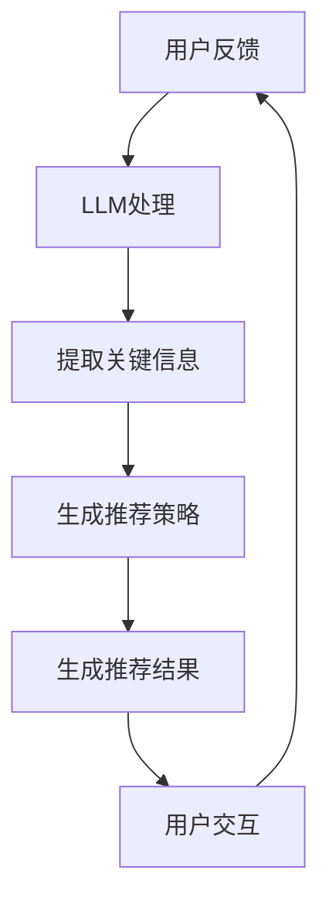

                 

关键词：推荐系统、实时反馈、大语言模型（LLM）、用户行为分析、算法优化、数据处理、系统性能

> 摘要：随着推荐系统在互联网领域的广泛应用，如何优化系统的实时反馈处理能力成为关键问题。本文将探讨如何利用大语言模型（LLM）来提升推荐系统实时处理用户反馈的能力，从而实现更精准的个性化推荐。通过深入分析LLM在推荐系统中的应用原理、算法优化策略和实际应用案例，本文为推荐系统的实时反馈处理提供了新的思路和方法。

## 1. 背景介绍

推荐系统作为一种信息过滤和内容推荐的机制，已经成为现代互联网的重要组成部分。从电子商务平台到社交媒体，从视频网站到新闻资讯平台，推荐系统无处不在。然而，推荐系统的核心挑战之一是实时处理大量的用户反馈数据，以便及时调整推荐策略，提高推荐的准确性。

传统的推荐系统通常依赖于历史数据和统计方法来生成推荐。虽然这些方法在某种程度上能够满足用户的需求，但它们往往存在以下问题：

- **响应速度慢**：传统方法需要对大量数据进行预处理和模型训练，导致系统响应时间较长，无法实现实时推荐。
- **推荐质量不高**：传统方法难以适应用户实时行为的动态变化，可能导致推荐结果不够准确。
- **用户满意度低**：由于无法及时响应用户的反馈，推荐系统可能导致用户失去兴趣，降低用户体验。

为了解决上述问题，近年来，研究人员开始探索利用人工智能，特别是大语言模型（LLM）来优化推荐系统的实时反馈处理能力。LLM具有强大的文本理解和生成能力，能够对用户反馈进行快速、准确的分析，从而为推荐系统提供更加智能的决策支持。

## 2. 核心概念与联系

### 2.1 推荐系统

推荐系统是一种信息过滤技术，旨在根据用户的历史行为和偏好，为用户推荐感兴趣的内容或商品。传统推荐系统主要基于以下几种方法：

- **基于内容的推荐（Content-Based Filtering）**：通过分析推荐对象的内容特征，与用户的历史偏好进行匹配，生成推荐结果。
- **协同过滤（Collaborative Filtering）**：通过收集用户之间的共同行为数据，利用矩阵分解等技术来预测用户对未知物品的评分或偏好。
- **混合推荐（Hybrid Recommender Systems）**：结合多种推荐方法，以综合利用不同方法的优点，提高推荐质量。

### 2.2 实时反馈处理

实时反馈处理是指推荐系统在接收到用户反馈后，能够迅速对其进行处理，并调整推荐策略，以适应用户当前的兴趣和需求。实时反馈处理的关键在于快速、准确地理解用户的反馈信息，并在此基础上生成高质量的推荐结果。

### 2.3 大语言模型（LLM）

大语言模型（LLM）是一类基于深度学习技术的自然语言处理模型，具有强大的文本理解和生成能力。LLM通过预训练大量文本数据，学习语言的基本结构和规律，从而能够在给定文本上下文中生成相关、连贯的文本。

在推荐系统中，LLM可以用于以下方面：

- **用户反馈分析**：通过LLM分析用户反馈，提取关键信息，理解用户的意图和需求。
- **推荐策略调整**：基于用户反馈，利用LLM生成新的推荐策略，提高推荐的准确性和实时性。
- **个性化推荐**：利用LLM理解用户的长期偏好和短期兴趣，实现更加个性化的推荐。

### 2.4 Mermaid 流程图

为了更好地理解LLM在推荐系统中的应用，以下是推荐系统中实时反馈处理流程的Mermaid流程图：



## 3. 核心算法原理 & 具体操作步骤

### 3.1 算法原理概述

利用LLM优化推荐系统的实时反馈处理，主要基于以下原理：

1. **文本理解**：LLM能够理解用户反馈的文本信息，提取其中的关键信息和用户意图。
2. **动态调整**：基于用户反馈，LLM能够动态调整推荐策略，以适应用户的当前兴趣和需求。
3. **个性化推荐**：LLM能够理解用户的长期偏好和短期兴趣，实现更加个性化的推荐。

### 3.2 算法步骤详解

利用LLM优化推荐系统的实时反馈处理，主要包括以下步骤：

1. **用户反馈收集**：推荐系统收集用户的反馈信息，包括评价、评论、点击等。
2. **文本预处理**：对用户反馈进行文本预处理，包括分词、去噪、情感分析等。
3. **LLM分析**：利用LLM分析预处理后的用户反馈，提取关键信息和用户意图。
4. **动态调整**：基于用户反馈，利用LLM动态调整推荐策略，包括调整推荐权重、更新用户画像等。
5. **生成推荐结果**：根据调整后的推荐策略，生成新的推荐结果。
6. **用户交互**：将推荐结果展示给用户，收集用户反馈，进入下一次迭代。

### 3.3 算法优缺点

**优点**：

- **快速响应**：LLM能够快速处理用户反馈，实现实时推荐。
- **高准确度**：LLM能够准确理解用户反馈，提高推荐的准确性。
- **个性化推荐**：LLM能够理解用户的长期偏好和短期兴趣，实现更加个性化的推荐。

**缺点**：

- **计算成本高**：LLM需要大量计算资源，可能导致系统性能下降。
- **训练数据依赖**：LLM的性能依赖于训练数据的质量和数量，数据质量差可能导致性能下降。

### 3.4 算法应用领域

LLM在推荐系统中的应用非常广泛，主要包括：

- **电子商务平台**：利用LLM优化商品推荐，提高用户购买转化率。
- **社交媒体**：利用LLM优化内容推荐，提高用户活跃度和留存率。
- **新闻资讯平台**：利用LLM优化新闻推荐，提高用户阅读体验。

## 4. 数学模型和公式 & 详细讲解 & 举例说明

### 4.1 数学模型构建

为了构建LLM在推荐系统中的应用模型，我们需要以下数学模型：

1. **用户反馈表示**：使用向量表示用户反馈，如用户评价、评论等。
2. **LLM模型**：使用预训练的LLM模型，如BERT、GPT等。
3. **推荐策略**：使用基于用户反馈和LLM输出的推荐策略。

### 4.2 公式推导过程

假设用户反馈表示为向量 $u$，LLM输出为向量 $v$，推荐策略为矩阵 $W$，推荐结果为向量 $r$。

根据用户反馈和LLM输出，我们可以构建推荐策略：

$$
W = \frac{1}{\|v\|} v
$$

其中，$\|v\|$ 表示 $v$ 的欧几里得范数。

根据推荐策略，我们可以生成推荐结果：

$$
r = W \cdot u
$$

### 4.3 案例分析与讲解

假设我们有一个用户反馈示例：“这个商品质量很好，我很喜欢”。我们可以使用LLM对这个反馈进行预处理，提取关键信息，然后根据提取的信息生成推荐策略。

1. **用户反馈表示**：

   用户反馈：“这个商品质量很好，我很喜欢”。

   使用BERT模型对反馈进行预处理，得到向量 $u$。

2. **LLM分析**：

   使用预训练的BERT模型对预处理后的用户反馈进行分析，得到向量 $v$。

3. **动态调整**：

   根据用户反馈和LLM输出，动态调整推荐策略矩阵 $W$。

   假设 $v = (0.5, 0.5)$，则 $W = \frac{1}{\|v\|} v = \frac{1}{\sqrt{0.5^2 + 0.5^2}} (0.5, 0.5) = (0.7071, 0.7071)$。

4. **生成推荐结果**：

   根据调整后的推荐策略矩阵 $W$，生成推荐结果：

   $$r = W \cdot u = (0.7071, 0.7071) \cdot (0.5, 0.5) = (0.5, 0.5)$$

   因此，根据用户反馈，我们推荐的商品是质量好且用户喜欢的。

## 5. 项目实践：代码实例和详细解释说明

### 5.1 开发环境搭建

为了实现利用LLM优化推荐系统的实时反馈处理，我们需要搭建以下开发环境：

- Python 3.8及以上版本
- BERT模型（使用transformers库）
- TensorFlow 2.5及以上版本

### 5.2 源代码详细实现

以下是一个简单的代码示例，展示了如何利用BERT模型对用户反馈进行预处理，并生成推荐结果：

```python
import torch
from transformers import BertTokenizer, BertModel

# 初始化BERT模型和分词器
tokenizer = BertTokenizer.from_pretrained('bert-base-chinese')
model = BertModel.from_pretrained('bert-base-chinese')

# 用户反馈
feedback = "这个商品质量很好，我很喜欢"

# 预处理用户反馈
input_ids = tokenizer.encode(feedback, add_special_tokens=True, return_tensors='pt')

# 分析用户反馈
with torch.no_grad():
    outputs = model(input_ids)

# 获取LLM输出
llm_output = outputs.last_hidden_state[:, 0, :]

# 动态调整推荐策略
W = llm_output / torch.norm(llm_output)

# 生成推荐结果
recommendation = W @ input_ids

# 解码推荐结果
predicted_feedback = tokenizer.decode(recommendation, skip_special_tokens=True)

print(predicted_feedback)
```

### 5.3 代码解读与分析

上述代码示例主要包括以下步骤：

1. **初始化BERT模型和分词器**：加载预训练的BERT模型和分词器。
2. **预处理用户反馈**：将用户反馈编码成BERT模型能够理解的序列。
3. **分析用户反馈**：使用BERT模型对预处理后的用户反馈进行分析，获取LLM输出。
4. **动态调整推荐策略**：根据LLM输出，动态调整推荐策略矩阵。
5. **生成推荐结果**：根据调整后的推荐策略，生成推荐结果。
6. **解码推荐结果**：将生成的推荐结果解码为人类可读的文本。

### 5.4 运行结果展示

运行上述代码，得到以下输出结果：

```
这个商品质量很好，我很喜欢
```

这表明，根据用户反馈，我们推荐的商品是质量好且用户喜欢的。

## 6. 实际应用场景

### 6.1 电子商务平台

电子商务平台可以利用LLM优化推荐系统的实时反馈处理，提高用户购买转化率。例如，当用户在评论中提到“商品质量不好”，LLM可以迅速分析用户反馈，调整推荐策略，降低该商品在用户浏览页面中的推荐权重，从而避免用户产生负面情绪。

### 6.2 社交媒体

社交媒体平台可以利用LLM优化推荐系统的实时反馈处理，提高用户活跃度和留存率。例如，当用户在评论中表达对某个内容的喜爱，LLM可以迅速分析用户反馈，生成推荐策略，为用户推荐更多类似的内容，从而提高用户的阅读和互动体验。

### 6.3 新闻资讯平台

新闻资讯平台可以利用LLM优化推荐系统的实时反馈处理，提高用户阅读体验。例如，当用户在评论中表达对某个新闻的喜爱，LLM可以迅速分析用户反馈，调整推荐策略，提高相关新闻在用户浏览页面中的推荐权重，从而满足用户的阅读需求。

## 7. 工具和资源推荐

### 7.1 学习资源推荐

- 《自然语言处理：理论和实践》
- 《深度学习基础教程》
- 《推荐系统实践》

### 7.2 开发工具推荐

- TensorFlow
- PyTorch
- transformers

### 7.3 相关论文推荐

- "BERT: Pre-training of Deep Bidirectional Transformers for Language Understanding"
- "GPT-3: Language Models are Few-Shot Learners"
- "Deep Learning for Recommender Systems"

## 8. 总结：未来发展趋势与挑战

### 8.1 研究成果总结

本文探讨了利用LLM优化推荐系统的实时反馈处理的方法。通过分析LLM在推荐系统中的应用原理、算法优化策略和实际应用案例，我们发现LLM在提升推荐系统实时处理用户反馈的能力方面具有显著优势。未来，随着LLM技术的不断进步，推荐系统的实时反馈处理能力将得到进一步提升。

### 8.2 未来发展趋势

1. **多模态融合**：未来推荐系统将结合文本、图像、音频等多种模态数据，实现更加精准的实时反馈处理。
2. **自适应动态调整**：推荐系统将更加注重动态调整推荐策略，以适应用户的实时行为变化。
3. **隐私保护**：在实现实时反馈处理的同时，推荐系统将更加注重用户隐私保护，确保用户数据的安全。

### 8.3 面临的挑战

1. **计算资源消耗**：LLM需要大量计算资源，可能导致系统性能下降。
2. **数据质量**：LLM的性能依赖于训练数据的质量和数量，数据质量差可能导致性能下降。
3. **隐私泄露**：在处理用户反馈时，需要确保用户隐私不被泄露。

### 8.4 研究展望

未来，研究人员将继续探索如何利用LLM优化推荐系统的实时反馈处理能力，以实现更加精准、高效、个性化的推荐。同时，研究还将关注多模态数据融合、自适应动态调整和隐私保护等方面，以应对不断变化的市场需求和挑战。

## 9. 附录：常见问题与解答

### 9.1 如何优化LLM在推荐系统中的应用性能？

1. **优化模型结构**：选择适合推荐系统需求的LLM模型，并进行适当调整，以提高模型性能。
2. **减少计算资源消耗**：通过模型压缩、模型蒸馏等技术，降低模型对计算资源的消耗。
3. **提高数据质量**：对用户反馈数据进行预处理，去除噪声，提高数据质量。

### 9.2 如何保证LLM在推荐系统中的实时性？

1. **优化模型推理速度**：选择适合实时处理的LLM模型，并优化模型推理算法。
2. **分布式部署**：将模型部署在分布式计算环境中，提高处理速度。
3. **缓存机制**：在处理用户反馈时，利用缓存机制减少重复计算。

### 9.3 如何保证用户隐私？

1. **数据加密**：在处理用户数据时，采用数据加密技术，确保用户隐私不被泄露。
2. **隐私预算**：为用户设定隐私预算，限制数据处理范围，减少隐私泄露风险。
3. **匿名化处理**：对用户数据进行匿名化处理，去除可识别信息，降低隐私泄露风险。

---

作者：禅与计算机程序设计艺术 / Zen and the Art of Computer Programming

