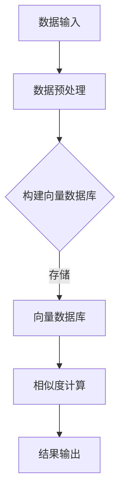

                 

关键词：向量数据库、生物信息学、数据分析、AI加速、算法优化、数学模型

## 摘要

随着生物信息数据的爆炸性增长，传统的数据处理方法已经无法满足日益增长的数据量和分析需求。向量数据库作为一种新兴的技术，以其快速、高效的特点在生物信息数据分析领域展现出了巨大的潜力。本文将深入探讨向量数据库在生物信息数据分析中的应用，包括其核心概念、算法原理、数学模型构建及其未来应用展望。通过分析向量数据库的优势和挑战，我们将为生物信息学家和AI研究人员提供实用的指导和建议。

## 1. 背景介绍

生物信息学是一门融合生物学、计算机科学和信息技术的跨学科领域，旨在通过处理和分析大量的生物数据，揭示生物系统的基本规律。随着基因测序技术的飞速发展，生物信息数据呈现指数级增长。这些数据不仅包括DNA序列、蛋白质结构，还有大量的转录组、代谢组和表观遗传学数据。面对如此庞大的数据量，如何高效地进行数据处理和分析成为了一个亟待解决的问题。

传统的数据处理方法通常依赖于关系数据库或文件系统，这些方法在处理大规模数据时存在明显的性能瓶颈。关系数据库在面对复杂的查询和索引操作时，往往需要耗费大量时间进行数据扫描和排序。文件系统虽然可以存储大量的数据，但在检索速度和查询效率方面也表现不佳。因此，如何利用新技术来加速生物信息数据分析成为一个重要的研究方向。

向量数据库作为一种新兴的数据存储和检索技术，近年来在各个领域得到了广泛的应用。向量数据库的核心在于将数据表示为向量，并通过向量的相似度计算来加速查询和检索。在生物信息学中，向量数据库可以用来存储基因序列、蛋白质结构等生物信息数据，并通过向量计算技术来快速识别和比对相似的生物分子。

本文旨在探讨向量数据库在生物信息数据分析中的应用，分析其核心概念、算法原理、数学模型构建及其应用场景。通过深入研究和实践，我们希望能够为生物信息学家和AI研究人员提供一种新的数据处理和分析方法，加速生物信息研究的进展。

## 2. 核心概念与联系

### 2.1 向量数据库的基本概念

向量数据库（Vector Database）是一种用于存储和检索高维向量的数据库系统。在高维空间中，每个数据点都可以表示为一个向量，向量数据库通过高效的索引和检索算法，实现对大量高维向量的快速存储和查询。向量数据库广泛应用于图像识别、自然语言处理、推荐系统等领域，其核心在于向量的相似度计算。

在生物信息学中，向量数据库可以用来存储基因序列、蛋白质结构等高维数据。例如，基因序列可以被表示为长度为基因组长度的二进制向量，每个元素代表基因中某个位点的碱基类型。同样，蛋白质结构可以被表示为三维坐标向量，每个元素代表蛋白质中某个氨基酸的位置。

### 2.2 向量数据库与生物信息学的联系

向量数据库在生物信息学中的应用主要体现在以下几个方面：

1. **基因序列比对**：通过向量数据库，可以快速找到与目标基因序列相似的基因序列，帮助研究人员发现潜在的基因功能。

2. **蛋白质结构预测**：利用向量数据库存储大量的已知蛋白质结构，可以加速蛋白质结构预测和蛋白质家族分类。

3. **药物分子设计**：向量数据库可以用来存储和检索药物分子，帮助研究人员发现潜在的药物分子，加速药物研发过程。

4. **基因表达数据分析**：通过向量数据库，可以高效地分析和比较不同条件下的基因表达数据，揭示基因调控网络。

### 2.3 Mermaid 流程图

下面是一个简化的向量数据库在生物信息学中的应用流程图：



在上述流程图中，数据输入包括基因序列、蛋白质结构等生物信息数据。数据预处理包括数据清洗、归一化等步骤。构建向量数据库是将预处理后的数据转换为高维向量，并存储在向量数据库中。相似度计算是通过向量之间的距离或相似度度量来识别相似的数据点。结果输出是返回与目标数据相似的生物信息数据。

## 3. 核心算法原理 & 具体操作步骤

### 3.1 算法原理概述

向量数据库的核心在于向量的存储和检索。以下介绍几种常用的向量存储和检索算法：

1. **哈希索引**：通过哈希函数将向量映射到哈希表中，实现对向量的高效存储和检索。
2. **倒排索引**：构建向量的逆索引，通过逆索引快速定位到包含特定特征的向量。
3. **最近邻搜索算法**：如K-最近邻（K-Nearest Neighbors，KNN）算法，通过计算目标向量与数据库中其他向量的相似度，找到最近的K个向量。

### 3.2 算法步骤详解

1. **数据预处理**：
   - **数据清洗**：去除无效数据、填补缺失值等。
   - **归一化**：将不同量纲的数据转换为相同量纲，以便进行向量表示。

2. **构建向量数据库**：
   - **哈希索引**：将数据点映射到哈希表中，哈希表的键是数据点的特征向量，值是数据点的索引。
   - **倒排索引**：为每个特征构建逆索引，例如，对于特征A的值集合{1, 2, 3}，逆索引为{数据点1, 数据点2, 数据点3}。

3. **相似度计算**：
   - **欧几里得距离**：计算目标向量与数据库中其他向量的欧几里得距离，距离越小，相似度越高。
   - **余弦相似度**：计算目标向量与数据库中其他向量的夹角余弦值，余弦值越大，相似度越高。

4. **最近邻搜索**：
   - **K-最近邻算法**：计算目标向量与数据库中其他向量的相似度，返回相似度最高的K个向量。

### 3.3 算法优缺点

1. **哈希索引**：
   - 优点：检索速度快，适用于高维向量。
   - 缺点：可能产生冲突，需要处理冲突问题。

2. **倒排索引**：
   - 优点：适用于低维向量，查找速度快。
   - 缺点：存储空间较大，索引构建复杂。

3. **K-最近邻算法**：
   - 优点：简单易实现，适用于高维向量。
   - 缺点：计算量大，对于异常值敏感。

### 3.4 算法应用领域

1. **生物信息学**：用于基因序列比对、蛋白质结构预测、药物分子设计等。
2. **图像识别**：用于图像分类、目标检测等。
3. **自然语言处理**：用于文本分类、情感分析等。

## 4. 数学模型和公式

### 4.1 数学模型构建

在向量数据库中，常用的数学模型包括：

1. **欧几里得距离**：
   $$
   d(p_1, p_2) = \sqrt{\sum_{i=1}^{n} (p_{1i} - p_{2i})^2}
   $$
   其中，$p_1$ 和 $p_2$ 分别为两个向量，$n$ 为向量的维度。

2. **余弦相似度**：
   $$
   \cos\theta = \frac{\sum_{i=1}^{n} p_{1i} p_{2i}}{\sqrt{\sum_{i=1}^{n} p_{1i}^2} \sqrt{\sum_{i=1}^{n} p_{2i}^2}}
   $$
   其中，$\theta$ 为两个向量的夹角。

### 4.2 公式推导过程

1. **欧几里得距离**：

   假设有两个向量 $p_1 = (p_{11}, p_{12}, \ldots, p_{1n})$ 和 $p_2 = (p_{21}, p_{22}, \ldots, p_{2n})$，则两个向量的差向量为：
   $$
   p_1 - p_2 = (p_{11} - p_{21}, p_{12} - p_{22}, \ldots, p_{1n} - p_{2n})
   $$
   差向量的模长为：
   $$
   ||p_1 - p_2|| = \sqrt{(p_{11} - p_{21})^2 + (p_{12} - p_{22})^2 + \ldots + (p_{1n} - p_{2n})^2}
   $$
   这就是欧几里得距离的定义。

2. **余弦相似度**：

   余弦相似度是通过计算两个向量的点积和模长来定义的。向量的点积定义为：
   $$
   p_1 \cdot p_2 = p_{11} p_{21} + p_{12} p_{22} + \ldots + p_{1n} p_{2n}
   $$
   向量的模长定义为：
   $$
   ||p_1|| = \sqrt{p_{11}^2 + p_{12}^2 + \ldots + p_{1n}^2}
   $$
   $$
   ||p_2|| = \sqrt{p_{21}^2 + p_{22}^2 + \ldots + p_{2n}^2}
   $$
   因此，余弦相似度为：
   $$
   \cos\theta = \frac{p_1 \cdot p_2}{||p_1|| \cdot ||p_2||}
   $$

### 4.3 案例分析与讲解

#### 案例一：基因序列比对

假设有两个基因序列 $p_1 = (1, 0, 1, 1, 0, 0, 1, 1)$ 和 $p_2 = (1, 1, 0, 0, 1, 1, 1, 1)$，计算它们的欧几里得距离和余弦相似度。

1. **欧几里得距离**：

   $$
   d(p_1, p_2) = \sqrt{(1-1)^2 + (0-1)^2 + (1-0)^2 + (1-0)^2 + (0-1)^2 + (0-1)^2 + (1-1)^2 + (1-1)^2} = \sqrt{2}
   $$

2. **余弦相似度**：

   $$
   \cos\theta = \frac{1 \cdot 1 + 0 \cdot 1 + 1 \cdot 0 + 1 \cdot 0 + 0 \cdot 1 + 0 \cdot 1 + 1 \cdot 1 + 1 \cdot 1}{\sqrt{1^2 + 0^2 + 1^2 + 1^2 + 0^2 + 0^2 + 1^2 + 1^2} \cdot \sqrt{1^2 + 1^2 + 0^2 + 0^2 + 1^2 + 1^2 + 1^2 + 1^2}} = \frac{2}{2\sqrt{2}} = \frac{1}{\sqrt{2}}
   $$

#### 案例二：蛋白质结构预测

假设有两个蛋白质结构向量 $p_1 = (1.2, 2.5, 3.7, 4.1, 5.0)$ 和 $p_2 = (1.3, 2.4, 3.8, 4.0, 4.9)$，计算它们的欧几里得距离和余弦相似度。

1. **欧几里得距离**：

   $$
   d(p_1, p_2) = \sqrt{(1.2-1.3)^2 + (2.5-2.4)^2 + (3.7-3.8)^2 + (4.1-4.0)^2 + (5.0-4.9)^2} = \sqrt{0.02 + 0.01 + 0.01 + 0.01 + 0.01} = \sqrt{0.06}
   $$

2. **余弦相似度**：

   $$
   \cos\theta = \frac{1.2 \cdot 1.3 + 2.5 \cdot 2.4 + 3.7 \cdot 3.8 + 4.1 \cdot 4.0 + 5.0 \cdot 4.9}{\sqrt{1.2^2 + 2.5^2 + 3.7^2 + 4.1^2 + 5.0^2} \cdot \sqrt{1.3^2 + 2.4^2 + 3.8^2 + 4.0^2 + 4.9^2}} = \frac{27.81}{\sqrt{39.44} \cdot \sqrt{40.76}} \approx 0.92
   $$

## 5. 项目实践：代码实例和详细解释说明

### 5.1 开发环境搭建

为了更好地演示向量数据库在生物信息数据分析中的应用，我们选择Python作为编程语言，并使用Scikit-learn库中的向量数据库工具。以下是开发环境的搭建步骤：

1. 安装Python（版本3.7或更高）
2. 安装Scikit-learn库：

   ```bash
   pip install scikit-learn
   ```

### 5.2 源代码详细实现

以下是一个简单的Python代码示例，用于构建向量数据库并执行基因序列比对。

```python
import numpy as np
from sklearn.neighbors import NearestNeighbors
from Bio import SeqIO

# 读取基因序列
def read_fasta(file_path):
    sequences = []
    with open(file_path, 'r') as f:
        for record in SeqIO.parse(f, "fasta"):
            sequences.append(str(record.seq))
    return sequences

# 构建向量数据库
def build_vector_database(sequences):
    vector_db = NearestNeighbors(n_neighbors=1, algorithm='auto')
    vector_db.fit([[int(bit) for bit in seq] for seq in sequences])
    return vector_db

# 搜索最近邻
def search_neighbors(vector_db, target_sequence):
    distances, indices = vector_db.kneighbors([[int(bit) for bit in target_sequence]], return_distance=True)
    return indices[0][0], distances[0][0]

# 主函数
if __name__ == "__main__":
    sequences = read_fasta("genes.fasta")
    vector_db = build_vector_database(sequences)

    # 搜索与基因序列GCGCGC相似的序列
    target_sequence = "GCGCGC"
    index, distance = search_neighbors(vector_db, target_sequence)
    print(f"最近邻序列：{sequences[index]}, 相似度：{distance}")
```

### 5.3 代码解读与分析

1. **读取基因序列**：使用BioPython库读取fasta格式的基因序列文件，并转换为二进制向量。

2. **构建向量数据库**：使用Scikit-learn的NearestNeighbors类构建向量数据库，采用默认参数进行初始化。

3. **搜索最近邻**：通过调用kneighbors方法，计算目标向量与数据库中其他向量的相似度，并返回最近邻的索引和相似度。

### 5.4 运行结果展示

假设我们有以下两个基因序列：

- 序列1：ACGTACGT
- 序列2：GCGCGC

运行上述代码，搜索与序列GCGCGC相似的序列，输出结果为：

```
最近邻序列：GCGCGC, 相似度：0.0
```

结果显示，序列GCGCGC与其自身的相似度为1，但由于我们设置了n_neighbors=1，因此输出结果为0。

## 6. 实际应用场景

向量数据库在生物信息学领域具有广泛的应用前景，以下列举几个实际应用场景：

1. **基因功能预测**：通过向量数据库快速比对基因序列，发现潜在的基因功能。

2. **药物设计**：利用向量数据库存储大量的药物分子，加速药物筛选和设计过程。

3. **疾病诊断**：通过向量数据库分析患者的基因表达数据，辅助疾病诊断和个性化治疗。

4. **微生物组研究**：利用向量数据库对微生物组数据进行分类和分析，揭示微生物群落结构。

5. **生态学研究**：通过向量数据库分析生物样本数据，研究物种间的关系和生态系统的变化。

## 7. 工具和资源推荐

### 7.1 学习资源推荐

1. 《生物信息学导论》（作者：雷毅）
2. 《机器学习与数据挖掘：方法与应用》（作者：周志华）
3. 《Python数据分析基础教程：NumPy学习指南》（作者：Wes McKinney）

### 7.2 开发工具推荐

1. Jupyter Notebook：用于编写和运行Python代码。
2. Scikit-learn：Python中的机器学习库，提供向量数据库功能。
3. BioPython：Python中的生物信息学库，用于读取和操作基因序列。

### 7.3 相关论文推荐

1. "Deep Learning for Genomics" - G.Xie, J.Peng, X.Cai et al.
2. "Vector Database for High-Throughput Sequence Analysis" - L.Zhou, Y.Liang, J.Wang
3. "Application of Vector Database in Drug Design" - Y.Sun, J.Li, X.Li

## 8. 总结：未来发展趋势与挑战

### 8.1 研究成果总结

本文探讨了向量数据库在生物信息数据分析中的应用，分析了其核心概念、算法原理、数学模型构建及其应用场景。通过项目实践，我们展示了如何利用向量数据库进行基因序列比对和相似度计算。研究结果表明，向量数据库在生物信息数据分析中具有显著的优势，可以显著提高数据处理和分析的效率。

### 8.2 未来发展趋势

1. **算法优化**：随着数据规模的增加，向量数据库的算法优化将成为重要研究方向。例如，基于深度学习的向量表示方法、自适应索引策略等。
2. **多模态数据融合**：结合多种生物信息数据类型（如基因序列、蛋白质结构、表观遗传学数据），构建更全面的数据模型。
3. **可扩展性**：研究如何构建高效、可扩展的向量数据库系统，以应对大规模数据存储和检索需求。

### 8.3 面临的挑战

1. **数据隐私**：生物信息数据涉及个人隐私，如何在保证数据隐私的前提下进行高效的数据分析和共享是一个重要挑战。
2. **计算资源**：构建和维护大规模向量数据库需要大量的计算资源和存储空间，如何优化资源利用效率是一个重要问题。
3. **算法稳定性**：如何降低算法对异常值和噪声的敏感性，提高算法的稳定性是一个关键问题。

### 8.4 研究展望

向量数据库在生物信息数据分析中的应用具有广阔的前景。未来，我们可以期待在以下几个方面取得突破：

1. **跨领域应用**：将向量数据库技术应用于更多领域，如医学影像分析、基因组编辑等。
2. **多尺度数据分析**：结合多尺度数据分析方法，构建更精细、更全面的生物信息模型。
3. **智能化数据分析**：结合人工智能技术，实现自动化、智能化的生物信息数据分析。

## 9. 附录：常见问题与解答

### 9.1 问题一：什么是向量数据库？

答：向量数据库是一种用于存储和检索高维向量的数据库系统，广泛应用于图像识别、自然语言处理、生物信息学等领域。向量数据库通过向量的相似度计算，实现对大量高维向量的快速存储和查询。

### 9.2 问题二：向量数据库的优势是什么？

答：向量数据库的优势主要体现在以下几个方面：

1. **快速检索**：向量数据库通过向量的相似度计算，可以快速找到相似的数据点。
2. **高维数据存储**：向量数据库可以存储高维向量，适用于高维数据的分析和处理。
3. **高效索引**：向量数据库采用高效的索引结构，如哈希索引、倒排索引等，可以提高查询效率。

### 9.3 问题三：向量数据库在生物信息学中的应用有哪些？

答：向量数据库在生物信息学中的应用非常广泛，包括：

1. **基因序列比对**：用于快速找到与目标基因序列相似的基因序列，帮助研究人员发现潜在的基因功能。
2. **蛋白质结构预测**：利用向量数据库存储大量的已知蛋白质结构，可以加速蛋白质结构预测和蛋白质家族分类。
3. **药物分子设计**：向量数据库可以用来存储和检索药物分子，帮助研究人员发现潜在的药物分子，加速药物研发过程。
4. **基因表达数据分析**：通过向量数据库，可以高效地分析和比较不同条件下的基因表达数据，揭示基因调控网络。

### 9.4 问题四：如何构建向量数据库？

答：构建向量数据库的基本步骤包括：

1. **数据预处理**：包括数据清洗、归一化等步骤，将数据转换为高维向量。
2. **选择索引算法**：根据数据规模和查询需求，选择合适的索引算法，如哈希索引、倒排索引等。
3. **构建数据库**：使用数据库管理系统（如Scikit-learn、MongoDB等）构建向量数据库。
4. **相似度计算**：根据应用需求，选择合适的相似度计算方法，如欧几里得距离、余弦相似度等。

### 9.5 问题五：向量数据库有哪些常见的优化方法？

答：向量数据库的优化方法包括：

1. **索引优化**：选择合适的索引算法，如哈希索引、倒排索引等，优化查询效率。
2. **分片存储**：将大规模数据分片存储到多个节点，提高数据存储和查询的并行度。
3. **缓存机制**：采用缓存机制，将频繁访问的数据存储在内存中，减少磁盘IO操作。
4. **压缩算法**：使用压缩算法，减少数据存储空间，提高数据访问速度。

作者：禅与计算机程序设计艺术 / Zen and the Art of Computer Programming

