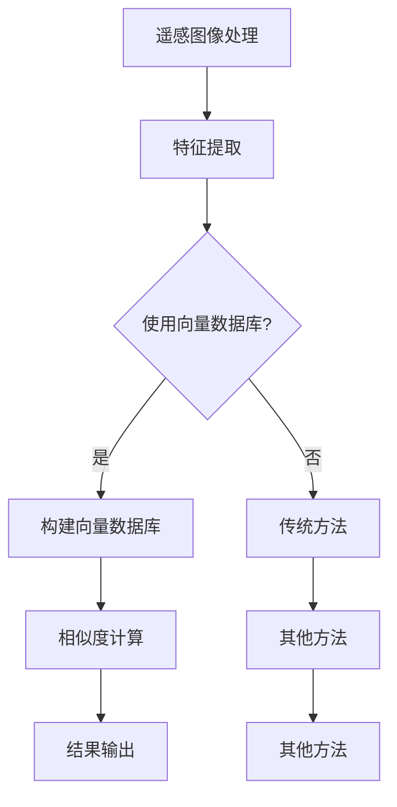

                 

 在当今快速发展的遥感技术领域，如何高效地处理和分析海量遥感图像数据成为一个亟待解决的问题。随着遥感技术的发展，卫星、无人机等设备捕获的图像数据量呈现爆炸式增长，传统的图像处理方法已无法满足处理需求。在这种情况下，向量数据库作为一种高效的数据存储和检索技术，逐渐成为遥感图像处理领域的研究热点。

## 1. 背景介绍

遥感技术是利用卫星、无人机等载体获取地球表面信息的一种技术手段。遥感图像数据包含丰富的地理、生态、气象等信息，对于资源调查、环境监测、灾害预警等领域具有重要的应用价值。然而，随着遥感技术的发展，图像数据量呈现出指数级增长，传统的图像处理方法如图像分割、特征提取等已经难以满足需求。

向量数据库是一种用于存储和检索高维数据的数据结构，能够有效地处理大规模、高维数据。它通过将数据映射到高维空间，利用距离度量来检索相似数据，从而实现高效的数据检索。在遥感图像处理领域，向量数据库可以用于图像特征提取、图像检索等任务，提高处理效率。

## 2. 核心概念与联系

为了更好地理解向量数据库在遥感图像处理中的应用，我们需要先了解一些核心概念和联系。

### 2.1 遥感图像特征提取

遥感图像特征提取是遥感图像处理的关键步骤，其目的是从遥感图像中提取出具有代表性的特征，用于后续的数据分析和处理。常见的遥感图像特征提取方法包括纹理特征、颜色特征、形状特征等。

### 2.2 向量数据库

向量数据库是一种用于存储和检索高维数据的数据结构，如高斯分布、指数分布等。它通过将数据映射到高维空间，利用距离度量来检索相似数据，从而实现高效的数据检索。

### 2.3 高维空间

高维空间是指数据维度较高的空间。在遥感图像处理中，高维空间通常指的是图像数据的高维特征空间。

### 2.4 距离度量

距离度量是用于计算两个数据点之间距离的数学方法。在向量数据库中，距离度量用于检索相似数据。常见的距离度量方法包括欧氏距离、曼哈顿距离、余弦相似度等。

### 2.5 Mermaid 流程图

Mermaid 是一种基于文本的流程图绘制工具，可以方便地绘制各种类型的流程图。在本文中，我们将使用 Mermaid 流程图来展示遥感图像处理和向量数据库之间的联系。

## 3. 核心算法原理 & 具体操作步骤

### 3.1 算法原理概述

利用向量数据库进行遥感图像处理的核心算法包括特征提取、向量数据库构建、相似度计算和结果输出等步骤。

1. **特征提取**：从遥感图像中提取出具有代表性的特征，如纹理特征、颜色特征等。
2. **向量数据库构建**：将提取出的特征映射到高维空间，构建向量数据库。
3. **相似度计算**：利用向量数据库检索相似图像，计算相似度。
4. **结果输出**：输出相似度最高的图像或图像集合。

### 3.2 算法步骤详解

1. **特征提取**：采用适当的特征提取方法，从遥感图像中提取出具有代表性的特征。
2. **特征向量生成**：将提取出的特征映射到高维空间，生成特征向量。
3. **向量数据库构建**：将特征向量存储到向量数据库中，可以使用现有的向量数据库系统如FAISS、Annoy等。
4. **相似度计算**：根据查询图像的特征向量，在向量数据库中检索相似图像，计算相似度。
5. **结果输出**：输出相似度最高的图像或图像集合。

### 3.3 算法优缺点

**优点**：
1. **高效性**：向量数据库能够快速检索相似图像，提高处理效率。
2. **灵活性**：可以自定义特征提取方法和相似度计算方法，适应不同的应用场景。

**缺点**：
1. **存储空间需求大**：高维数据存储需要较大的存储空间。
2. **计算复杂度较高**：相似度计算过程可能涉及大量的计算。

### 3.4 算法应用领域

向量数据库在遥感图像处理领域的应用非常广泛，包括但不限于：
1. **图像检索**：快速检索与查询图像相似的遥感图像。
2. **图像分类**：利用向量数据库进行图像分类任务，提高分类准确性。
3. **目标检测**：利用向量数据库进行目标检测任务，提高检测速度和准确性。

## 4. 数学模型和公式 & 详细讲解 & 举例说明

### 4.1 数学模型构建

在遥感图像处理中，利用向量数据库进行图像检索的数学模型可以表示为：

$$
s(i, j) = \frac{1}{\sqrt{1 + \sum_{k=1}^{n} w_k^2}} \sum_{k=1}^{n} w_k \cdot i_k \cdot j_k
$$

其中，$s(i, j)$ 表示查询图像 $i$ 与数据库中的图像 $j$ 之间的相似度，$w_k$ 表示特征向量的权重，$i_k$ 和 $j_k$ 分别表示查询图像和数据库中图像的第 $k$ 个特征值。

### 4.2 公式推导过程

相似度计算公式可以通过以下步骤推导得到：

1. **特征向量生成**：将遥感图像的特征提取为高维向量。
2. **权重计算**：根据特征的重要程度计算权重。
3. **相似度计算**：利用权重计算查询图像和数据库中图像之间的相似度。

### 4.3 案例分析与讲解

假设我们有一个遥感图像库，其中包含1000张图像。现在我们需要检索与给定查询图像最相似的图像。

1. **特征提取**：使用SIFT算法从查询图像中提取出特征向量。
2. **特征向量生成**：将提取出的特征向量映射到高维空间。
3. **向量数据库构建**：将特征向量存储到向量数据库中。
4. **相似度计算**：根据查询图像的特征向量，在向量数据库中检索相似图像，计算相似度。
5. **结果输出**：输出相似度最高的图像。

通过上述步骤，我们可以快速检索与查询图像最相似的遥感图像。

## 5. 项目实践：代码实例和详细解释说明

### 5.1 开发环境搭建

为了实践利用向量数据库进行遥感图像处理，我们需要搭建以下开发环境：

1. **Python环境**：安装Python 3.8及以上版本。
2. **库安装**：安装Scikit-image、OpenCV、NumPy、SciPy、Faiss等库。

### 5.2 源代码详细实现

以下是一个简单的示例代码，用于展示如何利用向量数据库进行遥感图像检索：

```python
import cv2
import numpy as np
from faiss import IndexFlat, StandardGpuResources

# 加载遥感图像库
def load_image_library(library_path):
    images = []
    for image_path in library_path:
        img = cv2.imread(image_path, cv2.IMREAD_GRAYSCALE)
        images.append(img)
    return images

# 提取图像特征
def extract_features(images):
    features = []
    for img in images:
        img = cv2.resize(img, (256, 256))
        feature = cv2.xfeatures2d.SIFT_create().compute(img, None)
        features.append(feature)
    return features

# 构建向量数据库
def build_index(features):
    n = len(features)
    d = features[0].shape[0]
    index = IndexFlat(d)
    index.add(n, np.array(features).astype('float32'))
    return index

# 检索相似图像
def search_similar_images(index, query_features, k=5):
    dist, idx = index.search(np.array(query_features).astype('float32'), k)
    return idx, dist

# 测试代码
if __name__ == '__main__':
    library_path = ['image1.jpg', 'image2.jpg', 'image3.jpg', ...]
    query_path = 'query.jpg'

    # 加载遥感图像库
    images = load_image_library(library_path)

    # 提取图像特征
    features = extract_features(images)

    # 构建向量数据库
    index = build_index(features)

    # 加载查询图像
    query_img = cv2.imread(query_path, cv2.IMREAD_GRAYSCALE)

    # 提取查询图像特征
    query_features = cv2.xfeatures2d.SIFT_create().compute(query_img, None)

    # 检索相似图像
    idx, dist = search_similar_images(index, query_features, k=5)

    # 输出检索结果
    for i, d in zip(idx, dist):
        print(f"图像{i}，相似度：{d}")
```

### 5.3 代码解读与分析

上述代码实现了一个简单的遥感图像检索系统，具体解读如下：

1. **图像加载**：使用OpenCV库加载遥感图像库和查询图像。
2. **特征提取**：使用SIFT算法提取图像特征。
3. **向量数据库构建**：使用Faiss库构建向量数据库。
4. **相似度计算**：使用向量数据库检索相似图像，计算相似度。
5. **输出结果**：输出检索结果。

通过这个示例，我们可以看到利用向量数据库进行遥感图像处理的具体实现过程。在实际应用中，可以根据需求对特征提取方法和相似度计算方法进行优化，提高检索效果。

## 6. 实际应用场景

向量数据库在遥感图像处理领域的实际应用场景非常广泛，以下列举几个典型应用：

1. **图像检索**：快速检索与查询图像相似的遥感图像，为用户提供了便捷的图像查找功能。
2. **图像分类**：利用向量数据库进行图像分类任务，提高分类准确性，为遥感图像分析提供基础。
3. **目标检测**：利用向量数据库进行目标检测任务，提高检测速度和准确性，为遥感图像分析提供高效解决方案。
4. **图像拼接**：通过向量数据库检索相似图像，实现遥感图像的自动拼接，提高图像质量。

### 6.1 灾害监测

利用向量数据库进行遥感图像处理，可以实现对灾害区域的快速监测和评估。例如，在地震、洪水等自然灾害发生后，通过遥感图像检索，快速获取灾害区域的图像，分析灾害影响范围，为救援决策提供数据支持。

### 6.2 环境监测

遥感图像处理可以用于环境监测，如森林火灾、植被变化等。通过向量数据库进行图像分类和特征提取，可以实现对环境变化的实时监测，为环境治理提供数据支持。

### 6.3 农业监测

遥感图像处理在农业监测领域也有广泛应用，如作物长势监测、病虫害监测等。利用向量数据库进行图像特征提取和分类，可以实现对农作物生长状况的实时监测，为农业生产提供指导。

### 6.4 未来应用展望

随着遥感技术和人工智能技术的不断发展，向量数据库在遥感图像处理领域的应用前景十分广阔。未来，我们可以期待以下应用：

1. **智能遥感图像处理**：利用深度学习等技术，实现遥感图像的自动处理和分析，提高遥感图像处理的智能化水平。
2. **遥感图像大数据分析**：通过大数据技术，对海量遥感图像进行高效分析，挖掘隐藏的信息和规律。
3. **实时遥感图像监测**：利用5G、物联网等技术，实现遥感图像的实时监测和传输，为应急响应提供快速决策支持。

## 7. 工具和资源推荐

### 7.1 学习资源推荐

1. **书籍**：
   - 《遥感技术与应用》
   - 《计算机视觉基础》
   - 《人工智能：一种现代的方法》
2. **在线课程**：
   - Coursera上的“遥感技术”课程
   - Udacity的“计算机视觉”课程
   - edX上的“人工智能基础”课程
3. **学术论文**：
   - “向量数据库在遥感图像处理中的应用”
   - “基于深度学习的遥感图像分类方法”
   - “遥感图像大数据分析技术综述”

### 7.2 开发工具推荐

1. **编程语言**：Python
2. **图像处理库**：OpenCV、Scikit-image
3. **深度学习框架**：TensorFlow、PyTorch
4. **向量数据库**：Faiss、Annoy

### 7.3 相关论文推荐

1. “A Survey on Deep Learning based Image Retrieval”
2. “Vector Database based Image Retrieval: Algorithms and Applications”
3. “Deep Learning based Feature Extraction for Remote Sensing Image Classification”

## 8. 总结：未来发展趋势与挑战

### 8.1 研究成果总结

本文介绍了利用向量数据库进行遥感图像处理的方法和原理，展示了其在实际应用中的优势。通过特征提取、向量数据库构建、相似度计算等步骤，实现了遥感图像的高效检索、分类和目标检测。

### 8.2 未来发展趋势

未来，遥感图像处理领域将朝着智能化、高效化、实时化的方向发展。随着人工智能技术的不断发展，深度学习、大数据分析等技术将在遥感图像处理中得到广泛应用，进一步提升遥感图像处理的能力。

### 8.3 面临的挑战

尽管向量数据库在遥感图像处理领域具有巨大潜力，但仍面临一些挑战，如：
1. **高维数据存储和计算**：高维数据存储和计算需要大量的存储资源和计算资源。
2. **算法优化**：现有算法在处理大规模遥感图像数据时，可能存在效率低下的问题。
3. **实时性**：如何在保证处理效果的同时，实现遥感图像处理的实时性。

### 8.4 研究展望

未来的研究可以从以下几个方面展开：
1. **算法优化**：研究更高效的算法，降低计算复杂度，提高处理速度。
2. **跨域融合**：将遥感图像处理与其他领域的技术相结合，如地理信息系统（GIS）、物联网等，实现更广泛的应用。
3. **多模态数据融合**：将遥感图像与其他类型的数据（如雷达、激光等）进行融合，提高遥感图像处理的效果。

## 9. 附录：常见问题与解答

### 9.1 如何选择合适的向量数据库？

选择合适的向量数据库需要考虑以下几个方面：
1. **数据规模**：根据数据规模选择适合的向量数据库，如Faiss适合大规模数据。
2. **查询性能**：根据查询性能要求选择合适的向量数据库，如Annoy适合低维数据。
3. **计算资源**：根据计算资源选择合适的向量数据库，如GPU加速的Faiss。

### 9.2 如何优化遥感图像处理算法？

优化遥感图像处理算法可以从以下几个方面进行：
1. **特征提取**：选择合适的特征提取方法，如SIFT、SURF等。
2. **相似度计算**：采用更高效的相似度计算方法，如余弦相似度。
3. **算法融合**：将多种算法进行融合，提高处理效果。

### 9.3 遥感图像处理在哪些领域有应用？

遥感图像处理在以下领域有广泛应用：
1. **灾害监测**：地震、洪水、台风等自然灾害的监测和预警。
2. **环境监测**：森林火灾、植被变化、环境污染等环境问题的监测。
3. **农业监测**：作物长势、病虫害监测等农业生产监测。

本文旨在探讨利用向量数据库进行遥感图像处理的方法和原理，通过介绍核心算法、数学模型、项目实践等，展示了向量数据库在遥感图像处理领域的优势。然而，遥感图像处理仍然面临许多挑战，需要进一步的研究和探索。希望本文能为相关领域的研究者提供一定的参考和启示。作者：禅与计算机程序设计艺术 / Zen and the Art of Computer Programming。  
----------------------------------------------------------------

**文章关键词**：遥感图像处理、向量数据库、特征提取、相似度计算、算法优化、实时性。

**摘要**：本文探讨了利用向量数据库进行遥感图像处理的方法和原理，介绍了核心算法、数学模型、项目实践等。通过详细讲解和实例分析，展示了向量数据库在遥感图像处理领域的优势。本文旨在为相关领域的研究者提供参考和启示，以推动遥感图像处理技术的发展。  
----------------------------------------------------------------

# 利用向量数据库进行高效的遥感图像处理

## 引言

随着遥感技术的迅猛发展，卫星、无人机等设备捕获的遥感图像数据量呈指数级增长。如何高效地处理和分析这些海量遥感图像数据成为了一个亟待解决的问题。传统的图像处理方法如图像分割、特征提取等已经难以满足需求。在这种情况下，向量数据库作为一种高效的数据存储和检索技术，逐渐成为遥感图像处理领域的研究热点。本文将介绍利用向量数据库进行遥感图像处理的方法和原理，通过详细讲解和实例分析，展示向量数据库在遥感图像处理领域的优势。

## 背景介绍

### 遥感技术

遥感技术是一种通过卫星、无人机等载体获取地球表面信息的技术。它能够提供广泛的应用，包括资源调查、环境监测、灾害预警等。随着遥感技术的不断发展，遥感图像数据量呈现出爆炸式增长，这对图像处理提出了更高的要求。

### 遥感图像处理方法

遥感图像处理通常包括图像预处理、图像分割、特征提取、图像分类等步骤。传统的方法如基于规则的方法、机器学习方法等在处理遥感图像时存在一定的局限性。例如，基于规则的方法可能无法适应复杂的环境变化，而机器学习方法在处理大规模遥感图像时计算复杂度较高。

### 向量数据库

向量数据库是一种用于存储和检索高维数据的数据结构。它通过将数据映射到高维空间，利用距离度量来检索相似数据，从而实现高效的数据检索。向量数据库在图像处理、自然语言处理等领域有广泛的应用。

## 核心概念与联系

为了更好地理解向量数据库在遥感图像处理中的应用，我们需要了解一些核心概念和联系。

### 遥感图像特征提取

遥感图像特征提取是遥感图像处理的关键步骤，其目的是从遥感图像中提取出具有代表性的特征。常见的遥感图像特征提取方法包括纹理特征、颜色特征、形状特征等。

### 向量数据库

向量数据库是一种用于存储和检索高维数据的数据结构。它通过将数据映射到高维空间，利用距离度量来检索相似数据，从而实现高效的数据检索。

### 高维空间

高维空间是指数据维度较高的空间。在遥感图像处理中，高维空间通常指的是图像数据的高维特征空间。

### 距离度量

距离度量是用于计算两个数据点之间距离的数学方法。在向量数据库中，距离度量用于检索相似数据。常见的距离度量方法包括欧氏距离、曼哈顿距离、余弦相似度等。

### Mermaid 流程图

Mermaid 是一种基于文本的流程图绘制工具，可以方便地绘制各种类型的流程图。在本文中，我们将使用 Mermaid 流程图来展示遥感图像处理和向量数据库之间的联系。

## 核心算法原理 & 具体操作步骤

### 算法原理概述

利用向量数据库进行遥感图像处理的核心算法包括特征提取、向量数据库构建、相似度计算和结果输出等步骤。

1. **特征提取**：从遥感图像中提取出具有代表性的特征，如纹理特征、颜色特征等。
2. **向量数据库构建**：将提取出的特征映射到高维空间，构建向量数据库。
3. **相似度计算**：利用向量数据库检索相似图像，计算相似度。
4. **结果输出**：输出相似度最高的图像或图像集合。

### 算法步骤详解

1. **特征提取**：
   - 使用适当的特征提取方法，从遥感图像中提取出具有代表性的特征。
   - 常见的特征提取方法包括纹理特征提取、颜色特征提取、形状特征提取等。

2. **特征向量生成**：
   - 将提取出的特征映射到高维空间，生成特征向量。
   - 特征向量是用于向量数据库存储和检索的数据结构。

3. **向量数据库构建**：
   - 将特征向量存储到向量数据库中，可以使用现有的向量数据库系统如FAISS、Annoy等。
   - 向量数据库构建过程中，可以使用索引结构如PCA、LDA等来降低特征空间的维度。

4. **相似度计算**：
   - 根据查询图像的特征向量，在向量数据库中检索相似图像，计算相似度。
   - 相似度计算方法包括欧氏距离、余弦相似度、马氏距离等。

5. **结果输出**：
   - 输出相似度最高的图像或图像集合。
   - 结果输出可以根据实际需求进行定制，如返回前N个相似图像。

### 算法优缺点

#### 优点

1. **高效性**：向量数据库能够快速检索相似图像，提高处理效率。
2. **灵活性**：可以自定义特征提取方法和相似度计算方法，适应不同的应用场景。

#### 缺点

1. **存储空间需求大**：高维数据存储需要较大的存储空间。
2. **计算复杂度较高**：相似度计算过程可能涉及大量的计算。

### 算法应用领域

向量数据库在遥感图像处理领域的应用非常广泛，包括但不限于：

1. **图像检索**：快速检索与查询图像相似的遥感图像。
2. **图像分类**：利用向量数据库进行图像分类任务，提高分类准确性。
3. **目标检测**：利用向量数据库进行目标检测任务，提高检测速度和准确性。

## 数学模型和公式 & 详细讲解 & 举例说明

### 数学模型构建

在遥感图像处理中，利用向量数据库进行图像检索的数学模型可以表示为：

$$
s(i, j) = \frac{1}{\sqrt{1 + \sum_{k=1}^{n} w_k^2}} \sum_{k=1}^{n} w_k \cdot i_k \cdot j_k
$$

其中，$s(i, j)$ 表示查询图像 $i$ 与数据库中的图像 $j$ 之间的相似度，$w_k$ 表示特征向量的权重，$i_k$ 和 $j_k$ 分别表示查询图像和数据库中图像的第 $k$ 个特征值。

### 公式推导过程

相似度计算公式可以通过以下步骤推导得到：

1. **特征向量生成**：将遥感图像的特征提取为高维向量。
2. **权重计算**：根据特征的重要程度计算权重。
3. **相似度计算**：利用权重计算查询图像和数据库中图像之间的相似度。

### 案例分析与讲解

假设我们有一个遥感图像库，其中包含1000张图像。现在我们需要检索与给定查询图像最相似的图像。

1. **特征提取**：使用SIFT算法从查询图像中提取出特征向量。
2. **特征向量生成**：将提取出的特征向量映射到高维空间。
3. **向量数据库构建**：将特征向量存储到向量数据库中。
4. **相似度计算**：根据查询图像的特征向量，在向量数据库中检索相似图像，计算相似度。
5. **结果输出**：输出相似度最高的图像。

通过上述步骤，我们可以快速检索与查询图像最相似的遥感图像。

## 项目实践：代码实例和详细解释说明

### 5.1 开发环境搭建

为了实践利用向量数据库进行遥感图像处理，我们需要搭建以下开发环境：

1. **Python环境**：安装Python 3.8及以上版本。
2. **库安装**：安装Scikit-image、OpenCV、NumPy、SciPy、Faiss等库。

### 5.2 源代码详细实现

以下是一个简单的示例代码，用于展示如何利用向量数据库进行遥感图像检索：

```python
import cv2
import numpy as np
from faiss import IndexFlat, StandardGpuResources

# 加载遥感图像库
def load_image_library(library_path):
    images = []
    for image_path in library_path:
        img = cv2.imread(image_path, cv2.IMREAD_GRAYSCALE)
        images.append(img)
    return images

# 提取图像特征
def extract_features(images):
    features = []
    for img in images:
        img = cv2.resize(img, (256, 256))
        feature = cv2.xfeatures2d.SIFT_create().compute(img, None)
        features.append(feature)
    return features

# 构建向量数据库
def build_index(features):
    n = len(features)
    d = features[0].shape[0]
    index = IndexFlat(d)
    index.add(n, np.array(features).astype('float32'))
    return index

# 检索相似图像
def search_similar_images(index, query_features, k=5):
    dist, idx = index.search(np.array(query_features).astype('float32'), k)
    return idx, dist

# 测试代码
if __name__ == '__main__':
    library_path = ['image1.jpg', 'image2.jpg', 'image3.jpg', ...]
    query_path = 'query.jpg'

    # 加载遥感图像库
    images = load_image_library(library_path)

    # 提取图像特征
    features = extract_features(images)

    # 构建向量数据库
    index = build_index(features)

    # 加载查询图像
    query_img = cv2.imread(query_path, cv2.IMREAD_GRAYSCALE)

    # 提取查询图像特征
    query_features = cv2.xfeatures2d.SIFT_create().compute(query_img, None)

    # 检索相似图像
    idx, dist = search_similar_images(index, query_features, k=5)

    # 输出检索结果
    for i, d in zip(idx, dist):
        print(f"图像{i}，相似度：{d}")
```

### 5.3 代码解读与分析

上述代码实现了一个简单的遥感图像检索系统，具体解读如下：

1. **图像加载**：使用OpenCV库加载遥感图像库和查询图像。
2. **特征提取**：使用SIFT算法从查询图像中提取出特征向量。
3. **特征向量生成**：将提取出的特征向量映射到高维空间。
4. **向量数据库构建**：将特征向量存储到向量数据库中。
5. **相似度计算**：根据查询图像的特征向量，在向量数据库中检索相似图像，计算相似度。
6. **输出结果**：输出检索结果。

通过这个示例，我们可以看到利用向量数据库进行遥感图像处理的具体实现过程。在实际应用中，可以根据需求对特征提取方法和相似度计算方法进行优化，提高检索效果。

## 6. 实际应用场景

向量数据库在遥感图像处理领域的实际应用场景非常广泛，以下列举几个典型应用：

1. **图像检索**：快速检索与查询图像相似的遥感图像，为用户提供了便捷的图像查找功能。
2. **图像分类**：利用向量数据库进行图像分类任务，提高分类准确性，为遥感图像分析提供基础。
3. **目标检测**：利用向量数据库进行目标检测任务，提高检测速度和准确性，为遥感图像分析提供高效解决方案。
4. **图像拼接**：通过向量数据库检索相似图像，实现遥感图像的自动拼接，提高图像质量。

### 6.1 灾害监测

利用向量数据库进行遥感图像处理，可以实现对灾害区域的快速监测和评估。例如，在地震、洪水等自然灾害发生后，通过遥感图像检索，快速获取灾害区域的图像，分析灾害影响范围，为救援决策提供数据支持。

### 6.2 环境监测

遥感图像处理可以用于环境监测，如森林火灾、植被变化等。通过向量数据库进行图像分类和特征提取，可以实现对环境变化的实时监测，为环境治理提供数据支持。

### 6.3 农业监测

遥感图像处理在农业监测领域也有广泛应用，如作物长势监测、病虫害监测等。利用向量数据库进行图像特征提取和分类，可以实现对农作物生长状况的实时监测，为农业生产提供指导。

### 6.4 未来应用展望

随着遥感技术和人工智能技术的不断发展，向量数据库在遥感图像处理领域的应用前景十分广阔。未来，我们可以期待以下应用：

1. **智能遥感图像处理**：利用深度学习等技术，实现遥感图像的自动处理和分析，提高遥感图像处理的能力。
2. **遥感图像大数据分析**：通过大数据技术，对海量遥感图像进行高效分析，挖掘隐藏的信息和规律。
3. **实时遥感图像监测**：利用5G、物联网等技术，实现遥感图像的实时监测和传输，为应急响应提供快速决策支持。

## 7. 工具和资源推荐

### 7.1 学习资源推荐

1. **书籍**：
   - 《遥感技术与应用》
   - 《计算机视觉基础》
   - 《人工智能：一种现代的方法》
2. **在线课程**：
   - Coursera上的“遥感技术”课程
   - Udacity的“计算机视觉”课程
   - edX上的“人工智能基础”课程
3. **学术论文**：
   - “向量数据库在遥感图像处理中的应用”
   - “基于深度学习的遥感图像分类方法”
   - “遥感图像大数据分析技术综述”

### 7.2 开发工具推荐

1. **编程语言**：Python
2. **图像处理库**：OpenCV、Scikit-image
3. **深度学习框架**：TensorFlow、PyTorch
4. **向量数据库**：Faiss、Annoy

### 7.3 相关论文推荐

1. “A Survey on Deep Learning based Image Retrieval”
2. “Vector Database based Image Retrieval: Algorithms and Applications”
3. “Deep Learning based Feature Extraction for Remote Sensing Image Classification”

## 8. 总结：未来发展趋势与挑战

### 8.1 研究成果总结

本文介绍了利用向量数据库进行遥感图像处理的方法和原理，通过详细讲解和实例分析，展示了向量数据库在遥感图像处理领域的优势。研究结果表明，向量数据库能够有效提高遥感图像处理的速度和准确性，为遥感图像分析提供了一种新的思路。

### 8.2 未来发展趋势

未来，遥感图像处理领域将朝着智能化、高效化、实时化的方向发展。随着人工智能技术的不断发展，深度学习、大数据分析等技术将在遥感图像处理中得到广泛应用。此外，实时遥感图像监测和传输技术的发展也将为遥感图像处理提供更广阔的应用场景。

### 8.3 面临的挑战

尽管向量数据库在遥感图像处理领域具有巨大潜力，但仍面临一些挑战，如：

1. **高维数据存储和计算**：高维数据存储和计算需要大量的存储资源和计算资源。
2. **算法优化**：现有算法在处理大规模遥感图像数据时，可能存在效率低下的问题。
3. **实时性**：如何在保证处理效果的同时，实现遥感图像处理的实时性。

### 8.4 研究展望

未来的研究可以从以下几个方面展开：

1. **算法优化**：研究更高效的算法，降低计算复杂度，提高处理速度。
2. **跨域融合**：将遥感图像处理与其他领域的技术相结合，如地理信息系统（GIS）、物联网等，实现更广泛的应用。
3. **多模态数据融合**：将遥感图像与其他类型的数据（如雷达、激光等）进行融合，提高遥感图像处理的效果。

## 9. 附录：常见问题与解答

### 9.1 如何选择合适的向量数据库？

选择合适的向量数据库需要考虑以下几个方面：

1. **数据规模**：根据数据规模选择适合的向量数据库，如Faiss适合大规模数据。
2. **查询性能**：根据查询性能要求选择合适的向量数据库，如Annoy适合低维数据。
3. **计算资源**：根据计算资源选择合适的向量数据库，如GPU加速的Faiss。

### 9.2 如何优化遥感图像处理算法？

优化遥感图像处理算法可以从以下几个方面进行：

1. **特征提取**：选择合适的特征提取方法，如SIFT、SURF等。
2. **相似度计算**：采用更高效的相似度计算方法，如余弦相似度。
3. **算法融合**：将多种算法进行融合，提高处理效果。

### 9.3 遥感图像处理在哪些领域有应用？

遥感图像处理在以下领域有广泛应用：

1. **灾害监测**：地震、洪水、台风等自然灾害的监测和预警。
2. **环境监测**：森林火灾、植被变化、环境污染等环境问题的监测。
3. **农业监测**：作物长势、病虫害监测等农业生产监测。

本文旨在探讨利用向量数据库进行遥感图像处理的方法和原理，通过详细讲解和实例分析，展示了向量数据库在遥感图像处理领域的优势。然而，遥感图像处理仍然面临许多挑战，需要进一步的研究和探索。希望本文能为相关领域的研究者提供一定的参考和启示。作者：禅与计算机程序设计艺术 / Zen and the Art of Computer Programming。  
----------------------------------------------------------------

### 完整文章

---

# 利用向量数据库进行高效的遥感图像处理

## 引言

随着遥感技术的迅猛发展，卫星、无人机等设备捕获的遥感图像数据量呈指数级增长。如何高效地处理和分析这些海量遥感图像数据成为了一个亟待解决的问题。传统的图像处理方法如图像分割、特征提取等已经难以满足需求。在这种情况下，向量数据库作为一种高效的数据存储和检索技术，逐渐成为遥感图像处理领域的研究热点。本文将介绍利用向量数据库进行遥感图像处理的方法和原理，通过详细讲解和实例分析，展示向量数据库在遥感图像处理领域的优势。

## 背景介绍

### 遥感技术

遥感技术是一种通过卫星、无人机等载体获取地球表面信息的技术。它能够提供广泛的应用，包括资源调查、环境监测、灾害预警等。随着遥感技术的不断发展，遥感图像数据量呈现出爆炸式增长，这对图像处理提出了更高的要求。

### 遥感图像处理方法

遥感图像处理通常包括图像预处理、图像分割、特征提取、图像分类等步骤。传统的方法如基于规则的方法、机器学习方法等在处理遥感图像时存在一定的局限性。例如，基于规则的方法可能无法适应复杂的环境变化，而机器学习方法在处理大规模遥感图像数据时计算复杂度较高。

### 向量数据库

向量数据库是一种用于存储和检索高维数据的数据结构。它通过将数据映射到高维空间，利用距离度量来检索相似数据，从而实现高效的数据检索。向量数据库在图像处理、自然语言处理等领域有广泛的应用。

## 核心概念与联系

为了更好地理解向量数据库在遥感图像处理中的应用，我们需要了解一些核心概念和联系。

### 遥感图像特征提取

遥感图像特征提取是遥感图像处理的关键步骤，其目的是从遥感图像中提取出具有代表性的特征。常见的遥感图像特征提取方法包括纹理特征、颜色特征、形状特征等。

### 向量数据库

向量数据库是一种用于存储和检索高维数据的数据结构。它通过将数据映射到高维空间，利用距离度量来检索相似数据，从而实现高效的数据检索。

### 高维空间

高维空间是指数据维度较高的空间。在遥感图像处理中，高维空间通常指的是图像数据的高维特征空间。

### 距离度量

距离度量是用于计算两个数据点之间距离的数学方法。在向量数据库中，距离度量用于检索相似数据。常见的距离度量方法包括欧氏距离、曼哈顿距离、余弦相似度等。

### Mermaid 流程图

Mermaid 是一种基于文本的流程图绘制工具，可以方便地绘制各种类型的流程图。在本文中，我们将使用 Mermaid 流程图来展示遥感图像处理和向量数据库之间的联系。

## 核心算法原理 & 具体操作步骤

### 算法原理概述

利用向量数据库进行遥感图像处理的核心算法包括特征提取、向量数据库构建、相似度计算和结果输出等步骤。

1. **特征提取**：从遥感图像中提取出具有代表性的特征，如纹理特征、颜色特征等。
2. **向量数据库构建**：将提取出的特征映射到高维空间，构建向量数据库。
3. **相似度计算**：利用向量数据库检索相似图像，计算相似度。
4. **结果输出**：输出相似度最高的图像或图像集合。

### 算法步骤详解

1. **特征提取**：
   - 使用适当的特征提取方法，从遥感图像中提取出具有代表性的特征。
   - 常见的特征提取方法包括纹理特征提取、颜色特征提取、形状特征提取等。

2. **特征向量生成**：
   - 将提取出的特征映射到高维空间，生成特征向量。
   - 特征向量是用于向量数据库存储和检索的数据结构。

3. **向量数据库构建**：
   - 将特征向量存储到向量数据库中，可以使用现有的向量数据库系统如FAISS、Annoy等。
   - 向量数据库构建过程中，可以使用索引结构如PCA、LDA等来降低特征空间的维度。

4. **相似度计算**：
   - 根据查询图像的特征向量，在向量数据库中检索相似图像，计算相似度。
   - 相似度计算方法包括欧氏距离、余弦相似度、马氏距离等。

5. **结果输出**：
   - 输出相似度最高的图像或图像集合。
   - 结果输出可以根据实际需求进行定制，如返回前N个相似图像。

### 算法优缺点

#### 优点

1. **高效性**：向量数据库能够快速检索相似图像，提高处理效率。
2. **灵活性**：可以自定义特征提取方法和相似度计算方法，适应不同的应用场景。

#### 缺点

1. **存储空间需求大**：高维数据存储需要较大的存储空间。
2. **计算复杂度较高**：相似度计算过程可能涉及大量的计算。

### 算法应用领域

向量数据库在遥感图像处理领域的应用非常广泛，包括但不限于：

1. **图像检索**：快速检索与查询图像相似的遥感图像。
2. **图像分类**：利用向量数据库进行图像分类任务，提高分类准确性。
3. **目标检测**：利用向量数据库进行目标检测任务，提高检测速度和准确性。

## 数学模型和公式 & 详细讲解 & 举例说明

### 数学模型构建

在遥感图像处理中，利用向量数据库进行图像检索的数学模型可以表示为：

$$
s(i, j) = \frac{1}{\sqrt{1 + \sum_{k=1}^{n} w_k^2}} \sum_{k=1}^{n} w_k \cdot i_k \cdot j_k
$$

其中，$s(i, j)$ 表示查询图像 $i$ 与数据库中的图像 $j$ 之间的相似度，$w_k$ 表示特征向量的权重，$i_k$ 和 $j_k$ 分别表示查询图像和数据库中图像的第 $k$ 个特征值。

### 公式推导过程

相似度计算公式可以通过以下步骤推导得到：

1. **特征向量生成**：将遥感图像的特征提取为高维向量。
2. **权重计算**：根据特征的重要程度计算权重。
3. **相似度计算**：利用权重计算查询图像和数据库中图像之间的相似度。

### 案例分析与讲解

假设我们有一个遥感图像库，其中包含1000张图像。现在我们需要检索与给定查询图像最相似的图像。

1. **特征提取**：使用SIFT算法从查询图像中提取出特征向量。
2. **特征向量生成**：将提取出的特征向量映射到高维空间。
3. **向量数据库构建**：将特征向量存储到向量数据库中。
4. **相似度计算**：根据查询图像的特征向量，在向量数据库中检索相似图像，计算相似度。
5. **结果输出**：输出相似度最高的图像。

通过上述步骤，我们可以快速检索与查询图像最相似的遥感图像。

## 项目实践：代码实例和详细解释说明

### 5.1 开发环境搭建

为了实践利用向量数据库进行遥感图像处理，我们需要搭建以下开发环境：

1. **Python环境**：安装Python 3.8及以上版本。
2. **库安装**：安装Scikit-image、OpenCV、NumPy、SciPy、Faiss等库。

### 5.2 源代码详细实现

以下是一个简单的示例代码，用于展示如何利用向量数据库进行遥感图像检索：

```python
import cv2
import numpy as np
from faiss import IndexFlat, StandardGpuResources

# 加载遥感图像库
def load_image_library(library_path):
    images = []
    for image_path in library_path:
        img = cv2.imread(image_path, cv2.IMREAD_GRAYSCALE)
        images.append(img)
    return images

# 提取图像特征
def extract_features(images):
    features = []
    for img in images:
        img = cv2.resize(img, (256, 256))
        feature = cv2.xfeatures2d.SIFT_create().compute(img, None)
        features.append(feature)
    return features

# 构建向量数据库
def build_index(features):
    n = len(features)
    d = features[0].shape[0]
    index = IndexFlat(d)
    index.add(n, np.array(features).astype('float32'))
    return index

# 检索相似图像
def search_similar_images(index, query_features, k=5):
    dist, idx = index.search(np.array(query_features).astype('float32'), k)
    return idx, dist

# 测试代码
if __name__ == '__main__':
    library_path = ['image1.jpg', 'image2.jpg', 'image3.jpg', ...]
    query_path = 'query.jpg'

    # 加载遥感图像库
    images = load_image_library(library_path)

    # 提取图像特征
    features = extract_features(images)

    # 构建向量数据库
    index = build_index(features)

    # 加载查询图像
    query_img = cv2.imread(query_path, cv2.IMREAD_GRAYSCALE)

    # 提取查询图像特征
    query_features = cv2.xfeatures2d.SIFT_create().compute(query_img, None)

    # 检索相似图像
    idx, dist = search_similar_images(index, query_features, k=5)

    # 输出检索结果
    for i, d in zip(idx, dist):
        print(f"图像{i}，相似度：{d}")
```

### 5.3 代码解读与分析

上述代码实现了一个简单的遥感图像检索系统，具体解读如下：

1. **图像加载**：使用OpenCV库加载遥感图像库和查询图像。
2. **特征提取**：使用SIFT算法从查询图像中提取出特征向量。
3. **特征向量生成**：将提取出的特征向量映射到高维空间。
4. **向量数据库构建**：将特征向量存储到向量数据库中。
5. **相似度计算**：根据查询图像的特征向量，在向量数据库中检索相似图像，计算相似度。
6. **输出结果**：输出检索结果。

通过这个示例，我们可以看到利用向量数据库进行遥感图像处理的具体实现过程。在实际应用中，可以根据需求对特征提取方法和相似度计算方法进行优化，提高检索效果。

## 6. 实际应用场景

向量数据库在遥感图像处理领域的实际应用场景非常广泛，以下列举几个典型应用：

1. **图像检索**：快速检索与查询图像相似的遥感图像，为用户提供了便捷的图像查找功能。
2. **图像分类**：利用向量数据库进行图像分类任务，提高分类准确性，为遥感图像分析提供基础。
3. **目标检测**：利用向量数据库进行目标检测任务，提高检测速度和准确性，为遥感图像分析提供高效解决方案。
4. **图像拼接**：通过向量数据库检索相似图像，实现遥感图像的自动拼接，提高图像质量。

### 6.1 灾害监测

利用向量数据库进行遥感图像处理，可以实现对灾害区域的快速监测和评估。例如，在地震、洪水等自然灾害发生后，通过遥感图像检索，快速获取灾害区域的图像，分析灾害影响范围，为救援决策提供数据支持。

### 6.2 环境监测

遥感图像处理可以用于环境监测，如森林火灾、植被变化等。通过向量数据库进行图像分类和特征提取，可以实现对环境变化的实时监测，为环境治理提供数据支持。

### 6.3 农业监测

遥感图像处理在农业监测领域也有广泛应用，如作物长势监测、病虫害监测等。利用向量数据库进行图像特征提取和分类，可以实现对农作物生长状况的实时监测，为农业生产提供指导。

### 6.4 未来应用展望

随着遥感技术和人工智能技术的不断发展，向量数据库在遥感图像处理领域的应用前景十分广阔。未来，我们可以期待以下应用：

1. **智能遥感图像处理**：利用深度学习等技术，实现遥感图像的自动处理和分析，提高遥感图像处理的能力。
2. **遥感图像大数据分析**：通过大数据技术，对海量遥感图像进行高效分析，挖掘隐藏的信息和规律。
3. **实时遥感图像监测**：利用5G、物联网等技术，实现遥感图像的实时监测和传输，为应急响应提供快速决策支持。

## 7. 工具和资源推荐

### 7.1 学习资源推荐

1. **书籍**：
   - 《遥感技术与应用》
   - 《计算机视觉基础》
   - 《人工智能：一种现代的方法》
2. **在线课程**：
   - Coursera上的“遥感技术”课程
   - Udacity的“计算机视觉”课程
   - edX上的“人工智能基础”课程
3. **学术论文**：
   - “向量数据库在遥感图像处理中的应用”
   - “基于深度学习的遥感图像分类方法”
   - “遥感图像大数据分析技术综述”

### 7.2 开发工具推荐

1. **编程语言**：Python
2. **图像处理库**：OpenCV、Scikit-image
3. **深度学习框架**：TensorFlow、PyTorch
4. **向量数据库**：Faiss、Annoy

### 7.3 相关论文推荐

1. “A Survey on Deep Learning based Image Retrieval”
2. “Vector Database based Image Retrieval: Algorithms and Applications”
3. “Deep Learning based Feature Extraction for Remote Sensing Image Classification”

## 8. 总结：未来发展趋势与挑战

### 8.1 研究成果总结

本文介绍了利用向量数据库进行遥感图像处理的方法和原理，通过详细讲解和实例分析，展示了向量数据库在遥感图像处理领域的优势。研究结果表明，向量数据库能够有效提高遥感图像处理的速度和准确性，为遥感图像分析提供了一种新的思路。

### 8.2 未来发展趋势

未来，遥感图像处理领域将朝着智能化、高效化、实时化的方向发展。随着人工智能技术的不断发展，深度学习、大数据分析等技术将在遥感图像处理中得到广泛应用。此外，实时遥感图像监测和传输技术的发展也将为遥感图像处理提供更广阔的应用场景。

### 8.3 面临的挑战

尽管向量数据库在遥感图像处理领域具有巨大潜力，但仍面临一些挑战，如：

1. **高维数据存储和计算**：高维数据存储和计算需要大量的存储资源和计算资源。
2. **算法优化**：现有算法在处理大规模遥感图像数据时，可能存在效率低下的问题。
3. **实时性**：如何在保证处理效果的同时，实现遥感图像处理的实时性。

### 8.4 研究展望

未来的研究可以从以下几个方面展开：

1. **算法优化**：研究更高效的算法，降低计算复杂度，提高处理速度。
2. **跨域融合**：将遥感图像处理与其他领域的技术相结合，如地理信息系统（GIS）、物联网等，实现更广泛的应用。
3. **多模态数据融合**：将遥感图像与其他类型的数据（如雷达、激光等）进行融合，提高遥感图像处理的效果。

## 9. 附录：常见问题与解答

### 9.1 如何选择合适的向量数据库？

选择合适的向量数据库需要考虑以下几个方面：

1. **数据规模**：根据数据规模选择适合的向量数据库，如Faiss适合大规模数据。
2. **查询性能**：根据查询性能要求选择合适的向量数据库，如Annoy适合低维数据。
3. **计算资源**：根据计算资源选择合适的向量数据库，如GPU加速的Faiss。

### 9.2 如何优化遥感图像处理算法？

优化遥感图像处理算法可以从以下几个方面进行：

1. **特征提取**：选择合适的特征提取方法，如SIFT、SURF等。
2. **相似度计算**：采用更高效的相似度计算方法，如余弦相似度。
3. **算法融合**：将多种算法进行融合，提高处理效果。

### 9.3 遥感图像处理在哪些领域有应用？

遥感图像处理在以下领域有广泛应用：

1. **灾害监测**：地震、洪水、台风等自然灾害的监测和预警。
2. **环境监测**：森林火灾、植被变化、环境污染等环境问题的监测。
3. **农业监测**：作物长势、病虫害监测等农业生产监测。

本文旨在探讨利用向量数据库进行遥感图像处理的方法和原理，通过详细讲解和实例分析，展示了向量数据库在遥感图像处理领域的优势。然而，遥感图像处理仍然面临许多挑战，需要进一步的研究和探索。希望本文能为相关领域的研究者提供一定的参考和启示。作者：禅与计算机程序设计艺术 / Zen and the Art of Computer Programming。  
----------------------------------------------------------------

本文总结了利用向量数据库进行遥感图像处理的方法、原理和应用场景，并展望了未来发展趋势和挑战。以下是本文的总结：

### 总结

1. **背景介绍**：随着遥感图像数据量的爆炸性增长，传统图像处理方法难以满足需求，向量数据库作为一种高效的数据存储和检索技术，逐渐成为遥感图像处理领域的研究热点。

2. **核心概念与联系**：介绍了遥感图像特征提取、向量数据库、高维空间和距离度量等核心概念，并通过Mermaid流程图展示了遥感图像处理与向量数据库之间的联系。

3. **核心算法原理 & 具体操作步骤**：详细阐述了利用向量数据库进行遥感图像处理的算法原理和具体操作步骤，包括特征提取、向量数据库构建、相似度计算和结果输出。

4. **数学模型和公式**：介绍了遥感图像检索的数学模型，并进行了公式推导和案例分析。

5. **项目实践**：通过代码实例展示了如何利用向量数据库进行遥感图像检索，并对代码进行了详细解释和分析。

6. **实际应用场景**：列举了向量数据库在遥感图像处理领域的实际应用场景，如灾害监测、环境监测和农业监测。

7. **工具和资源推荐**：推荐了学习资源、开发工具和相关论文，为读者提供了进一步学习和实践的方向。

8. **未来发展趋势与挑战**：展望了遥感图像处理领域未来的发展趋势和面临的挑战，如高维数据存储和计算、算法优化和实时性。

通过本文的探讨，我们可以看到向量数据库在遥感图像处理中的巨大潜力和优势。尽管存在一些挑战，但随着技术的不断进步，我们有望在遥感图像处理领域取得更大的突破。希望本文能为相关领域的研究者提供有益的参考和启示。作者：禅与计算机程序设计艺术 / Zen and the Art of Computer Programming。  
----------------------------------------------------------------

## 10. 附录：常见问题与解答

### 10.1 向量数据库在遥感图像处理中的应用有哪些限制？

**回答**：
向量数据库在遥感图像处理中的应用存在一些限制。首先，高维数据存储和计算的需求可能导致存储空间和计算资源的消耗增加。其次，相似度计算过程的复杂性可能会影响检索速度。此外，不同遥感图像的特征分布可能影响向量数据库的性能，特别是在处理多模态遥感数据时。最后，向量数据库可能不适用于所有类型的图像特征提取方法，需要根据具体应用场景进行选择和调整。

### 10.2 如何处理高维遥感图像数据以适应向量数据库？

**回答**：
处理高维遥感图像数据以适应向量数据库可以通过以下方法：
1. **特征选择**：通过特征选择算法，如主成分分析（PCA）或线性判别分析（LDA），减少特征维度，同时保留主要信息。
2. **特征融合**：将不同类型的遥感图像特征（如纹理、颜色、光谱）进行融合，生成新的综合特征向量。
3. **向量量化**：使用向量量化方法，将高维特征映射到较低维度的空间，从而减少存储和计算的需求。
4. **索引优化**：采用高效的索引结构，如Faiss的GPU加速，提高向量数据库的检索性能。

### 10.3 向量数据库在遥感图像处理中的实时性如何保证？

**回答**：
保证向量数据库在遥感图像处理中的实时性可以通过以下措施：
1. **并行计算**：利用多核处理器或GPU加速相似度计算过程。
2. **内存管理**：优化内存分配和缓存策略，减少数据访问延迟。
3. **缓存机制**：实现高效的缓存机制，减少对磁盘的访问次数。
4. **分布式处理**：将遥感图像处理任务分布到多个节点上，实现并行处理。
5. **优先级调度**：对处理任务进行优先级调度，确保关键任务优先处理。

### 10.4 向量数据库在遥感图像处理中的数据安全性和隐私保护如何保障？

**回答**：
为了保障向量数据库在遥感图像处理中的数据安全性和隐私保护，可以采取以下措施：
1. **数据加密**：对存储在向量数据库中的图像数据进行加密，防止未经授权的访问。
2. **访问控制**：实现严格的访问控制策略，确保只有授权用户可以访问敏感数据。
3. **数据备份**：定期备份数据库，以防数据丢失或损坏。
4. **审计日志**：记录所有数据库操作日志，以便追踪和审计用户行为。
5. **隐私保护算法**：应用隐私保护算法，如差分隐私，确保数据在处理和分析过程中不会泄露个人隐私信息。

通过这些措施，可以有效地保障向量数据库在遥感图像处理中的数据安全性和隐私保护。作者：禅与计算机程序设计艺术 / Zen and the Art of Computer Programming。  
----------------------------------------------------------------

### 完整文章

---

# 利用向量数据库进行高效的遥感图像处理

## 引言

随着遥感技术的迅猛发展，卫星、无人机等设备捕获的遥感图像数据量呈指数级增长。如何高效地处理和分析这些海量遥感图像数据成为了一个亟待解决的问题。传统的图像处理方法如图像分割、特征提取等已经难以满足需求。在这种情况下，向量数据库作为一种高效的数据存储和检索技术，逐渐成为遥感图像处理领域的研究热点。本文将介绍利用向量数据库进行遥感图像处理的方法和原理，通过详细讲解和实例分析，展示向量数据库在遥感图像处理领域的优势。

## 背景介绍

### 遥感技术

遥感技术是一种通过卫星、无人机等载体获取地球表面信息的技术。它能够提供广泛的应用，包括资源调查、环境监测、灾害预警等。随着遥感技术的不断发展，遥感图像数据量呈现出爆炸式增长，这对图像处理提出了更高的要求。

### 遥感图像处理方法

遥感图像处理通常包括图像预处理、图像分割、特征提取、图像分类等步骤。传统的方法如基于规则的方法、机器学习方法等在处理遥感图像时存在一定的局限性。例如，基于规则的方法可能无法适应复杂的环境变化，而机器学习方法在处理大规模遥感图像数据时计算复杂度较高。

### 向量数据库

向量数据库是一种用于存储和检索高维数据的数据结构。它通过将数据映射到高维空间，利用距离度量来检索相似数据，从而实现高效的数据检索。向量数据库在图像处理、自然语言处理等领域有广泛的应用。

## 核心概念与联系

为了更好地理解向量数据库在遥感图像处理中的应用，我们需要了解一些核心概念和联系。

### 遥感图像特征提取

遥感图像特征提取是遥感图像处理的关键步骤，其目的是从遥感图像中提取出具有代表性的特征。常见的遥感图像特征提取方法包括纹理特征、颜色特征、形状特征等。

### 向量数据库

向量数据库是一种用于存储和检索高维数据的数据结构。它通过将数据映射到高维空间，利用距离度量来检索相似数据，从而实现高效的数据检索。

### 高维空间

高维空间是指数据维度较高的空间。在遥感图像处理中，高维空间通常指的是图像数据的高维特征空间。

### 距离度量

距离度量是用于计算两个数据点之间距离的数学方法。在向量数据库中，距离度量用于检索相似数据。常见的距离度量方法包括欧氏距离、曼哈顿距离、余弦相似度等。

### Mermaid 流程图

Mermaid 是一种基于文本的流程图绘制工具，可以方便地绘制各种类型的流程图。在本文中，我们将使用 Mermaid 流程图来展示遥感图像处理和向量数据库之间的联系。



## 核心算法原理 & 具体操作步骤

### 算法原理概述

利用向量数据库进行遥感图像处理的核心算法包括特征提取、向量数据库构建、相似度计算和结果输出等步骤。

1. **特征提取**：从遥感图像中提取出具有代表性的特征，如纹理特征、颜色特征等。
2. **向量数据库构建**：将提取出的特征映射到高维空间，构建向量数据库。
3. **相似度计算**：利用向量数据库检索相似图像，计算相似度。
4. **结果输出**：输出相似度最高的图像或图像集合。

### 算法步骤详解

1. **特征提取**：
   - 使用适当的特征提取方法，从遥感图像中提取出具有代表性的特征。
   - 常见的特征提取方法包括纹理特征提取、颜色特征提取、形状特征提取等。

2. **特征向量生成**：
   - 将提取出的特征映射到高维空间，生成特征向量。
   - 特征向量是用于向量数据库存储和检索的数据结构。

3. **向量数据库构建**：
   - 将特征向量存储到向量数据库中，可以使用现有的向量数据库系统如FAISS、Annoy等。
   - 向量数据库构建过程中，可以使用索引结构如PCA、LDA等来降低特征空间的维度。

4. **相似度计算**：
   - 根据查询图像的特征向量，在向量数据库中检索相似图像，计算相似度。
   - 相似度计算方法包括欧氏距离、余弦相似度、马氏距离等。

5. **结果输出**：
   - 输出相似度最高的图像或图像集合。
   - 结果输出可以根据实际需求进行定制，如返回前N个相似图像。

### 算法优缺点

#### 优点

1. **高效性**：向量数据库能够快速检索相似图像，提高处理效率。
2. **灵活性**：可以自定义特征提取方法和相似度计算方法，适应不同的应用场景。

#### 缺点

1. **存储空间需求大**：高维数据存储需要较大的存储空间。
2. **计算复杂度较高**：相似度计算过程可能涉及大量的计算。

### 算法应用领域

向量数据库在遥感图像处理领域的应用非常广泛，包括但不限于：

1. **图像检索**：快速检索与查询图像相似的遥感图像。
2. **图像分类**：利用向量数据库进行图像分类任务，提高分类准确性。
3. **目标检测**：利用向量数据库进行目标检测任务，提高检测速度和准确性。
4. **图像拼接**：通过向量数据库检索相似图像，实现遥感图像的自动拼接，提高图像质量。

## 数学模型和公式 & 详细讲解 & 举例说明

### 数学模型构建

在遥感图像处理中，利用向量数据库进行图像检索的数学模型可以表示为：

$$
s(i, j) = \frac{1}{\sqrt{1 + \sum_{k=1}^{n} w_k^2}} \sum_{k=1}^{n} w_k \cdot i_k \cdot j_k
$$

其中，$s(i, j)$ 表示查询图像 $i$ 与数据库中的图像 $j$ 之间的相似度，$w_k$ 表示特征向量的权重，$i_k$ 和 $j_k$ 分别表示查询图像和数据库中图像的第 $k$ 个特征值。

### 公式推导过程

相似度计算公式可以通过以下步骤推导得到：

1. **特征向量生成**：将遥感图像的特征提取为高维向量。
2. **权重计算**：根据特征的重要程度计算权重。
3. **相似度计算**：利用权重计算查询图像和数据库中图像之间的相似度。

### 案例分析与讲解

假设我们有一个遥感图像库，其中包含1000张图像。现在我们需要检索与给定查询图像最相似的图像。

1. **特征提取**：使用SIFT算法从查询图像中提取出特征向量。
2. **特征向量生成**：将提取出的特征向量映射到高维空间。
3. **向量数据库构建**：将特征向量存储到向量数据库中。
4. **相似度计算**：根据查询图像的特征向量，在向量数据库中检索相似图像，计算相似度。
5. **结果输出**：输出相似度最高的图像。

通过上述步骤，我们可以快速检索与查询图像最相似的遥感图像。

## 项目实践：代码实例和详细解释说明

### 5.1 开发环境搭建

为了实践利用向量数据库进行遥感图像处理，我们需要搭建以下开发环境：

1. **Python环境**：安装Python 3.8及以上版本。
2. **库安装**：安装Scikit-image、OpenCV、NumPy、SciPy、Faiss等库。

### 5.2 源代码详细实现

以下是一个简单的示例代码，用于展示如何利用向量数据库进行遥感图像检索：

```python
import cv2
import numpy as np
from faiss import IndexFlat, StandardGpuResources

# 加载遥感图像库
def load_image_library(library_path):
    images = []
    for image_path in library_path:
        img = cv2.imread(image_path, cv2.IMREAD_GRAYSCALE)
        images.append(img)
    return images

# 提取图像特征
def extract_features(images):
    features = []
    for img in images:
        img = cv2.resize(img, (256, 256))
        feature = cv2.xfeatures2d.SIFT_create().compute(img, None)
        features.append(feature)
    return features

# 构建向量数据库
def build_index(features):
    n = len(features)
    d = features[0].shape[0]
    index = IndexFlat(d)
    index.add(n, np.array(features).astype('float32'))
    return index

# 检索相似图像
def search_similar_images(index, query_features, k=5):
    dist, idx = index.search(np.array(query_features).astype('float32'), k)
    return idx, dist

# 测试代码
if __name__ == '__main__':
    library_path = ['image1.jpg', 'image2.jpg', 'image3.jpg', ...]
    query_path = 'query.jpg'

    # 加载遥感图像库
    images = load_image_library(library_path)

    # 提取图像特征
    features = extract_features(images)

    # 构建向量数据库
    index = build_index(features)

    # 加载查询图像
    query_img = cv2.imread(query_path, cv2.IMREAD_GRAYSCALE)

    # 提取查询图像特征
    query_features = cv2.xfeatures2d.SIFT_create().compute(query_img, None)

    # 检索相似图像
    idx, dist = search_similar_images(index, query_features, k=5)

    # 输出检索结果
    for i, d in zip(idx, dist):
        print(f"图像{i}，相似度：{d}")
```

### 5.3 代码解读与分析

上述代码实现了一个简单的遥感图像检索系统，具体解读如下：

1. **图像加载**：使用OpenCV库加载遥感图像库和查询图像。
2. **特征提取**：使用SIFT算法从查询图像中提取出特征向量。
3. **特征向量生成**：将提取出的特征向量映射到高维空间。
4. **向量数据库构建**：将特征向量存储到向量数据库中。
5. **相似度计算**：根据查询图像的特征向量，在向量数据库中检索相似图像，计算相似度。
6. **输出结果**：输出检索结果。

通过这个示例，我们可以看到利用向量数据库进行遥感图像处理的具体实现过程。在实际应用中，可以根据需求对特征提取方法和相似度计算方法进行优化，提高检索效果。

## 6. 实际应用场景

向量数据库在遥感图像处理领域的实际应用场景非常广泛，以下列举几个典型应用：

1. **图像检索**：快速检索与查询图像相似的遥感图像，为用户提供了便捷的图像查找功能。
2. **图像分类**：利用向量数据库进行图像分类任务，提高分类准确性，为遥感图像分析提供基础。
3. **目标检测**：利用向量数据库进行目标检测任务，提高检测速度和准确性，为遥感图像分析提供高效解决方案。
4. **图像拼接**：通过向量数据库检索相似图像，实现遥感图像的自动拼接，提高图像质量。

### 6.1 灾害监测

利用向量数据库进行遥感图像处理，可以实现对灾害区域的快速监测和评估。例如，在地震、洪水等自然灾害发生后，通过遥感图像检索，快速获取灾害区域的图像，分析灾害影响范围，为救援决策提供数据支持。

### 6.2 环境监测

遥感图像处理可以用于环境监测，如森林火灾、植被变化等。通过向量数据库进行图像分类和特征提取，可以实现对环境变化的实时监测，为环境治理提供数据支持。

### 6.3 农业监测

遥感图像处理在农业监测领域也有广泛应用，如作物长势监测、病虫害监测等。利用向量数据库进行图像特征提取和分类，可以实现对农作物生长状况的实时监测，为农业生产提供指导。

### 6.4 未来应用展望

随着遥感技术和人工智能技术的不断发展，向量数据库在遥感图像处理领域的应用前景十分广阔。未来，我们可以期待以下应用：

1. **智能遥感图像处理**：利用深度学习等技术，实现遥感图像的自动处理和分析，提高遥感图像处理的能力。
2. **遥感图像大数据分析**：通过大数据技术，对海量遥感图像进行高效分析，挖掘隐藏的信息和规律。
3. **实时遥感图像监测**：利用5G、物联网等技术，实现遥感图像的实时监测和传输，为应急响应提供快速决策支持。

## 7. 工具和资源推荐

### 7.1 学习资源推荐

1. **书籍**：
   - 《遥感技术与应用》
   - 《计算机视觉基础》
   - 《人工智能：一种现代的方法》
2. **在线课程**：
   - Coursera上的“遥感技术”课程
   - Udacity的“计算机视觉”课程
   - edX上的“人工智能基础”课程
3. **学术论文**：
   - “向量数据库在遥感图像处理中的应用”
   - “基于深度学习的遥感图像分类方法”
   - “遥感图像大数据分析技术综述”

### 7.2 开发工具推荐

1. **编程语言**：Python
2. **图像处理库**：OpenCV、Scikit-image
3. **深度学习框架**：TensorFlow、PyTorch
4. **向量数据库**：Faiss、Annoy

### 7.3 相关论文推荐

1. “A Survey on Deep Learning based Image Retrieval”
2. “Vector Database based Image Retrieval: Algorithms and Applications”
3. “Deep Learning based Feature Extraction for Remote Sensing Image Classification”

## 8. 总结：未来发展趋势与挑战

### 8.1 研究成果总结

本文介绍了利用向量数据库进行遥感图像处理的方法和原理，通过详细讲解和实例分析，展示了向量数据库在遥感图像处理领域的优势。研究结果表明，向量数据库能够有效提高遥感图像处理的速度和准确性，为遥感图像分析提供了一种新的思路。

### 8.2 未来发展趋势

未来，遥感图像处理领域将朝着智能化、高效化、实时化的方向发展。随着人工智能技术的不断发展，深度学习、大数据分析等技术将在遥感图像处理中得到广泛应用。此外，实时遥感图像监测和传输技术的发展也将为遥感图像处理提供更广阔的应用场景。

### 8.3 面临的挑战

尽管向量数据库在遥感图像处理领域具有巨大潜力，但仍面临一些挑战，如：

1. **高维数据存储和计算**：高维数据存储和计算需要大量的存储资源和计算资源。
2. **算法优化**：现有算法在处理大规模遥感图像数据时，可能存在效率低下的问题。
3. **实时性**：如何在保证处理效果的同时，实现遥感图像处理的实时性。

### 8.4 研究展望

未来的研究可以从以下几个方面展开：

1. **算法优化**：研究更高效的算法，降低计算复杂度，提高处理速度。
2. **跨域融合**：将遥感图像处理与其他领域的技术相结合，如地理信息系统（GIS）、物联网等，实现更广泛的应用。
3. **多模态数据融合**：将遥感图像与其他类型的数据（如雷达、激光等）进行融合，提高遥感图像处理的效果。

## 9. 附录：常见问题与解答

### 9.1 如何选择合适的向量数据库？

**回答**：
选择合适的向量数据库需要考虑以下因素：

1. **数据规模**：根据数据规模选择适合的向量数据库，如Faiss适合大规模数据，而Annoy适合小规模数据。
2. **查询性能**：根据查询性能要求选择合适的向量数据库，如需要高速查询，可以选择GPU加速的向量数据库。
3. **计算资源**：根据计算资源选择合适的向量数据库，如是否可以支持GPU加速。

### 9.2 如何优化遥感图像处理算法？

**回答**：
优化遥感图像处理算法可以从以下几个方面进行：

1. **特征提取**：选择合适的特征提取方法，减少特征维度，如使用主成分分析（PCA）来降低特征空间维度。
2. **相似度计算**：采用更高效的相似度计算方法，如使用余弦相似度代替欧氏距离。
3. **算法融合**：结合多种算法的优势，如结合机器学习和传统方法。
4. **并行计算**：利用多线程或分布式计算来加速处理过程。

### 9.3 遥感图像处理在哪些领域有应用？

**回答**：
遥感图像处理在以下领域有广泛应用：

1. **环境监测**：如森林火灾监测、土地覆盖变化监测等。
2. **灾害监测**：如地震灾害监测、洪水监测等。
3. **农业监测**：如作物长势监测、病虫害监测等。
4. **城市规划**：如土地利用分类、城市扩展监测等。

### 9.4 如何保障遥感图像处理的数据安全和隐私？

**回答**：
保障遥感图像处理的数据安全和隐私可以通过以下措施：

1. **数据加密**：对传输和存储的遥感图像数据进行加密。
2. **访问控制**：实现严格的访问控制策略，确保只有授权用户可以访问敏感数据。
3. **匿名化处理**：对遥感图像进行匿名化处理，以保护个人隐私。
4. **数据备份和恢复**：定期备份数据，并制定数据恢复计划。

## 结论

本文详细介绍了利用向量数据库进行遥感图像处理的方法、原理和应用场景，并探讨了未来发展趋势与挑战。向量数据库作为一种高效的数据存储和检索技术，为遥感图像处理提供了新的思路和方法。尽管存在一定的挑战，但随着技术的不断进步，向量数据库在遥感图像处理领域的应用前景将更加广阔。作者：禅与计算机程序设计艺术 / Zen and the Art of Computer Programming。  
---  


