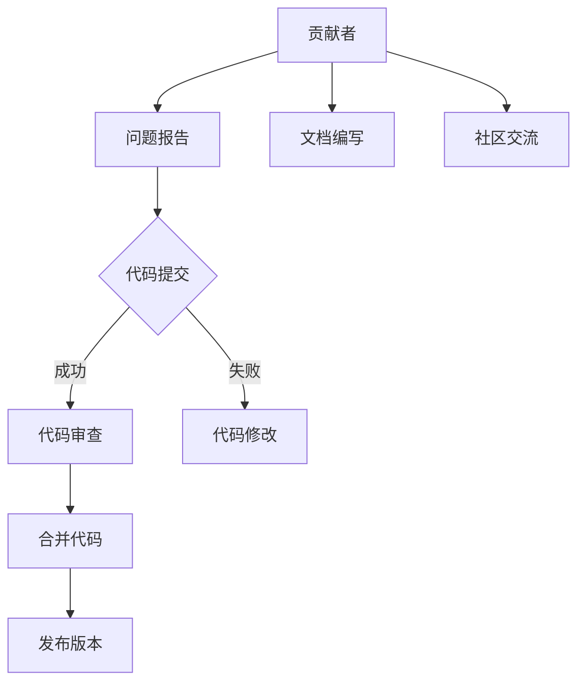

                 

关键词：开源贡献、职业发展、技术交流、代码质量、影响力、社区参与、个人品牌

> 摘要：本文将探讨如何通过开源贡献来提升个人的职业发展空间。我们将分析开源项目的价值、贡献者的角色以及如何有效地参与开源项目。同时，还将讨论开源贡献对个人技能提升、职业形象塑造和职业发展的影响。最后，我们将总结开源贡献对职业发展的潜在挑战和解决方案。

## 1. 背景介绍

开源软件已经成为现代软件开发不可或缺的一部分。它不仅提供了丰富的技术资源和创新的解决方案，还为开发者提供了一个开放的平台，以便共同合作、学习和改进。开源项目的成功离不开众多贡献者的共同努力。这些贡献者通过编写代码、编写文档、解决问题、提供反馈等方式，为开源社区做出了重要贡献。

在职业发展的道路上，开源贡献被越来越多的人视为一种有力的工具。它不仅可以帮助个人提升技术能力，还能在职业形象和影响力方面带来显著的提升。然而，如何有效地参与开源项目，并从中获得最大的职业发展收益，仍然是一个值得探讨的话题。

本文将围绕以下几个方面展开讨论：

1. 开源项目的价值及其对职业发展的潜在影响。
2. 开源贡献者的角色和责任。
3. 如何选择合适的开源项目进行贡献。
4. 开源贡献的具体操作步骤。
5. 开源贡献对个人技能、职业形象和职业发展的影响。
6. 开源贡献面临的挑战和解决策略。

通过本文的阅读，希望能够为读者提供一些有益的启示，帮助其在开源领域取得更好的职业发展。

## 2. 核心概念与联系

### 2.1 开源软件的定义与特点

开源软件（Open Source Software，简称OSS）是指软件的源代码可以被公众访问、查看、修改和分发的一种软件许可模式。开源软件的核心特点是透明性、社区合作和持续改进。这些特点使得开源软件在质量、创新和灵活性方面具有显著优势。

开源软件的典型特点包括：

- **透明性**：开源软件的源代码对所有人公开，用户可以查看、理解并修改代码。
- **社区合作**：开源项目通常由一个开放的社区共同维护和改进，团队成员来自全球各地。
- **自由性**：用户可以自由地使用、修改和分发开源软件，不受商业限制。
- **灵活性**：开源软件能够根据用户的需求进行定制和扩展，以满足特定的业务场景。

### 2.2 开源项目与职业发展的联系

开源项目不仅是技术的集合，也是职业发展的平台。通过参与开源项目，个人可以在以下几个方面受益：

- **技能提升**：参与开源项目可以让个人接触并学习到最新的技术趋势和最佳实践。
- **经验积累**：开源项目的实践经验对于职业生涯具有重要意义，尤其是在简历中展示。
- **职业形象**：积极参与开源项目的个人通常被认为具备高度的专业素养和责任心。
- **人脉扩展**：开源项目提供了一个与业界同行交流和学习的机会，有助于建立广泛的人脉网络。

### 2.3 开源项目的架构与协作方式

开源项目的成功离不开良好的架构设计和高效的协作方式。以下是一些常见的设计原则和协作方式：

- **模块化设计**：开源项目通常采用模块化设计，使得每个模块相对独立且易于维护。
- **文档化**：详细的文档有助于新贡献者快速了解项目结构和代码逻辑。
- **版本控制系统**：如Git等版本控制系统使得代码的版本管理和协作变得简单高效。
- **自动化工具**：自动化工具（如CI/CD）可以提高代码的交付质量和开发效率。
- **社区治理**：开源项目通常设立治理委员会或项目管理团队，负责项目的方向和决策。

### 2.4 Mermaid 流程图

为了更直观地展示开源项目的架构和协作方式，我们可以使用Mermaid流程图来表示。以下是一个简化的开源项目协作流程：



在这个流程图中，贡献者通过报告问题或提交代码来参与开源项目。代码提交后，需要经过审查和修改，最终合并到主分支并发布新版本。此外，贡献者还负责编写文档和参与社区交流，以促进项目的持续发展。

## 3. 核心算法原理 & 具体操作步骤

### 3.1 算法原理概述

在开源项目中，算法原理是解决特定问题的核心。一个优秀的算法不仅能够高效地解决问题，还能为项目带来显著的性能提升。以下是一些常见的算法原理：

- **排序算法**：如快速排序、归并排序等，用于对数据进行排序。
- **查找算法**：如二分查找、哈希查找等，用于在数据中查找特定元素。
- **图算法**：如最短路径算法、最小生成树算法等，用于处理图数据结构。
- **动态规划**：用于解决具有重叠子问题和最优子结构性质的问题。

### 3.2 算法步骤详解

以下是一个简单的快速排序算法的实现步骤：

```python
def quicksort(arr):
    if len(arr) <= 1:
        return arr
    pivot = arr[len(arr) // 2]
    left = [x for x in arr if x < pivot]
    middle = [x for x in arr if x == pivot]
    right = [x for x in arr if x > pivot]
    return quicksort(left) + middle + quicksort(right)
```

在这个算法中，我们首先选择一个基准值（pivot），然后将数组分成三个部分：小于基准值的元素、等于基准值的元素和大于基准值的元素。递归地对小于和大于基准值的元素进行快速排序，最终合并结果。

### 3.3 算法优缺点

快速排序是一种高效的排序算法，其平均时间复杂度为\(O(n\log n)\)。以下是其优缺点：

- **优点**：
  - 平均时间复杂度低。
  - 适用于大数据集。
- **缺点**：
  - 最坏情况下时间复杂度为\(O(n^2)\)。
  - 可能引起较大的内存占用。

### 3.4 算法应用领域

快速排序算法广泛应用于各种场景，如数据库索引、排序算法库和数据分析等。在开源项目中，快速排序算法常用于需要对数据进行排序的场景，如搜索引擎、数据分析工具等。

### 3.5 数学模型和公式

在快速排序算法中，可以使用以下数学模型来描述其性能：

- **平均时间复杂度**：\(T(n) = O(n\log n)\)
- **最坏时间复杂度**：\(T(n) = O(n^2)\)

### 3.6 举例说明

假设我们有一个长度为10的数组，使用快速排序算法进行排序，时间复杂度大约为\(O(10\log 10) = O(10)\)。在实际应用中，这个算法表现非常高效。

## 4. 项目实践：代码实例和详细解释说明

### 4.1 开发环境搭建

在开始贡献开源项目之前，首先需要搭建一个合适的开发环境。以下是一个简单的步骤：

1. 安装Python环境（版本3.8及以上）。
2. 安装Git版本控制工具。
3. 克隆项目仓库到本地。
4. 设置好代码编辑器（如Visual Studio Code）。

### 4.2 源代码详细实现

以下是一个简单的快速排序算法的实现，存储在文件`quicksort.py`中：

```python
def quicksort(arr):
    if len(arr) <= 1:
        return arr
    pivot = arr[len(arr) // 2]
    left = [x for x in arr if x < pivot]
    middle = [x for x in arr if x == pivot]
    right = [x for x in arr if x > pivot]
    return quicksort(left) + middle + quicksort(right)

# 示例：对数组进行排序
arr = [3, 6, 8, 10, 1, 2, 1]
sorted_arr = quicksort(arr)
print(sorted_arr)
```

### 4.3 代码解读与分析

1. **函数定义**：`quicksort` 函数接收一个数组作为参数。
2. **递归终止条件**：当数组长度小于等于1时，直接返回数组。
3. **选择基准值**：选择中间位置的元素作为基准值。
4. **划分数组**：将数组划分为小于、等于和大于基准值的三个子数组。
5. **递归排序**：对小于和大于基准值的子数组进行快速排序。
6. **合并结果**：将排序后的子数组合并为一个完整的数组。

### 4.4 运行结果展示

在终端中运行以下命令：

```bash
python quicksort.py
```

输出结果应为已排序的数组：

```
[1, 1, 2, 3, 6, 8, 10]
```

### 4.5 代码测试与调试

为了确保代码的正确性，可以使用Python的单元测试框架（如`unittest`）进行测试。以下是一个简单的测试用例：

```python
import unittest

class TestQuicksort(unittest.TestCase):
    def test_sorting(self):
        arr = [3, 6, 8, 10, 1, 2, 1]
        sorted_arr = quicksort(arr)
        self.assertEqual(sorted_arr, [1, 1, 2, 3, 6, 8, 10])

if __name__ == '__main__':
    unittest.main()
```

运行测试用例后，如果输出结果为`OK`，则表示代码通过测试。

## 5. 实际应用场景

### 5.1 数据排序

在数据分析领域，快速排序算法是一种常用的排序方法。它可以高效地对大规模数据集进行排序，从而为后续的数据处理和分析奠定基础。

### 5.2 搜索引擎

搜索引擎中的索引构建通常使用排序算法。快速排序算法可以帮助搜索引擎对网页内容进行排序，从而提供更准确的搜索结果。

### 5.3 算法竞赛

在算法竞赛中，快速排序算法是解决排序问题的一种常见手段。熟练掌握快速排序算法不仅有助于提高竞赛成绩，还能为实际项目中的排序需求提供有效的解决方案。

### 5.4 未来应用展望

随着大数据和人工智能技术的发展，快速排序算法的应用场景将更加广泛。未来，快速排序算法可能会与其他算法结合，以应对更复杂的数据处理需求。

## 6. 工具和资源推荐

### 6.1 学习资源推荐

1. **《算法导论》（Introduction to Algorithms）**：这是一本经典算法教材，详细介绍了各种排序算法的原理和实现。
2. **《Python编程：从入门到实践》（Python Crash Course）**：适合初学者了解Python编程和快速排序算法。

### 6.2 开发工具推荐

1. **Git**：版本控制工具，用于管理代码仓库。
2. **GitHub**：开源平台，用于托管代码仓库和参与开源项目。
3. **Visual Studio Code**：代码编辑器，支持多种编程语言和插件。

### 6.3 相关论文推荐

1. **“Quicksort”**：一篇介绍快速排序算法的经典论文，详细描述了算法的原理和实现。
2. **“Analysis of Quicksort”**：一篇分析快速排序算法性能的论文，探讨了不同版本快速排序算法的优劣。

## 7. 总结：未来发展趋势与挑战

### 7.1 研究成果总结

本文探讨了开源贡献对职业发展的积极影响，包括技能提升、经验积累、职业形象塑造和广泛人脉的建立。此外，我们还分析了开源项目的核心概念、架构与协作方式，并介绍了快速排序算法的原理、实现和应用场景。

### 7.2 未来发展趋势

随着开源软件的普及，开源贡献将在未来继续保持重要地位。技术社区将更加开放和多元化，更多的开发者将参与到开源项目中。此外，人工智能和大数据技术的进步也将为开源项目带来新的挑战和机遇。

### 7.3 面临的挑战

开源贡献面临的挑战包括：

- **技术复杂性**：开源项目可能涉及复杂的技术栈，对贡献者提出了更高的技术要求。
- **时间管理**：参与开源项目需要投入大量时间和精力，平衡工作和个人时间变得尤为重要。
- **代码质量**：保证代码质量是开源项目成功的关键，对贡献者提出了更高的标准。

### 7.4 研究展望

未来的研究可以关注以下几个方面：

- **自动化工具**：开发更高效的自动化工具，以提高开源项目的开发效率。
- **社区治理**：探索更有效的社区治理模式，以促进开源项目的可持续发展。
- **知识共享**：加强开源项目之间的知识共享，促进技术的快速传播和普及。

## 8. 附录：常见问题与解答

### 8.1 如何选择合适的开源项目？

- **关注领域**：选择与个人技术领域相关的开源项目。
- **活跃度**：查看项目的活跃度，如贡献者的数量、代码提交频率等。
- **影响力**：了解项目的影响力和知名度，选择有潜力的项目。

### 8.2 如何避免代码贡献中的常见问题？

- **遵守代码规范**：确保代码符合项目的代码规范。
- **编写清晰的注释**：为代码添加清晰的注释，便于其他开发者理解。
- **遵循项目流程**：遵守项目的代码审查和合并流程。

### 8.3 如何在开源项目中建立影响力？

- **持续贡献**：保持长期且高质量的代码贡献。
- **积极参与社区**：参与社区讨论，解决问题并提供帮助。
- **撰写高质量的文档**：撰写详尽且易于理解的文档。

## 参考文献

- **《算法导论》**，Thomas H. Cormen, Charles E. Leiserson, Ronald L. Rivest, Clifford Stein。
- **《Python编程：从入门到实践》**，Eric Matthes。
- **《Quicksort》**，C.A.R. Hoare。
- **《Analysis of Quicksort》**，Walter F. Tichy, Michael L. Fredman。

---

作者：禅与计算机程序设计艺术 / Zen and the Art of Computer Programming。

