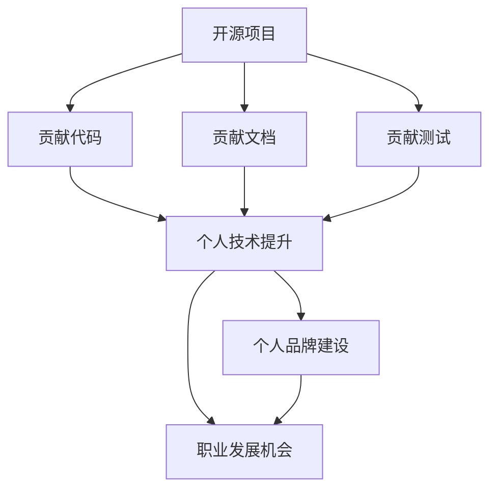

                 

关键词：开源贡献、演讲机会、教学机会、个人品牌、职业发展、技术社区

> 摘要：本文旨在探讨如何通过在开源项目中做出贡献，获得演讲和教学机会，从而提升个人品牌和职业发展。我们将从开源贡献的意义、选择合适的开源项目、贡献技巧、以及如何利用这些贡献获得演讲和教学机会等方面进行深入分析。

## 1. 背景介绍

在当今数字化时代，开源软件已经成为软件开发的一个重要趋势。越来越多的企业和个人加入到开源社区的活动中，为开源项目贡献代码、文档、测试等。与此同时，开源贡献不仅能够提高个人的技术能力，还能够为个人品牌和职业发展带来诸多机遇。本文将重点探讨如何通过在开源项目中做出贡献，获得演讲和教学机会，进一步提升个人在技术社区的影响力。

### 1.1 开源贡献的意义

开源贡献不仅能够帮助项目发展，提升项目的质量，对于个人来说也有极大的意义。首先，开源贡献能够提升个人技术水平，通过与社区其他成员的交流，学习到不同的技术观点和解决方案。其次，开源贡献有助于建立个人品牌，增加在技术社区中的知名度。此外，开源贡献还可以为个人提供更多职业发展的机会，如演讲邀请、合作项目、甚至更好的工作机会。

### 1.2 演讲和教学机会的重要性

演讲和教学机会是展示个人技术能力和影响力的平台。通过演讲，个人能够向更广泛的受众分享自己的知识和经验，建立专业声誉。而教学机会则不仅能够体现个人的教学能力，还能够为个人带来额外的收入。因此，如何获得这些机会成为许多技术专业人士关心的问题。

## 2. 核心概念与联系

在探讨如何通过开源贡献获得演讲和教学机会之前，我们需要理解一些核心概念，如开源项目、贡献类型、个人品牌等，以及它们之间的联系。以下是一个简化的 Mermaid 流程图，用于说明这些概念之间的关系：



### 2.1 开源项目

开源项目是一个由社区成员共同维护的软件项目，其代码和文档是公开的，任何人都可以自由查看、修改和分发。开源项目通常遵循特定的许可证，如GPL、MIT等。

### 2.2 贡献类型

开源贡献包括但不限于以下几种类型：

- **代码贡献**：提交新的功能、修复bug、优化代码。
- **文档贡献**：撰写或更新项目的文档，包括README、使用说明、API文档等。
- **测试贡献**：编写测试用例，提高项目的测试覆盖率。

### 2.3 个人品牌建设

个人品牌是指个人在某个领域的声誉和影响力。在技术社区中，个人品牌通常通过技术博客、GitHub 贡献、演讲、技术文章等方式建立。

### 2.4 职业发展机会

职业发展机会包括但不限于以下几种：

- **演讲邀请**：在技术会议、沙龙、线上论坛上发表演讲。
- **合作机会**：与开源项目的其他成员合作，共同开发项目。
- **工作机会**：通过在开源项目中的表现获得更好的工作机会。

## 3. 核心算法原理 & 具体操作步骤

### 3.1 算法原理概述

通过开源贡献获得演讲和教学机会的过程可以看作是一个算法，其原理主要包括以下几个步骤：

1. **选择合适的开源项目**：根据个人兴趣和技能，选择一个合适的开源项目进行贡献。
2. **做出高质量贡献**：通过提交代码、文档、测试等高质量贡献，获得项目维护者的认可。
3. **建立个人品牌**：通过在GitHub、技术博客等平台上展示自己的贡献，建立个人品牌。
4. **获得演讲和教学机会**：利用个人品牌和社区影响力，争取演讲和教学机会。

### 3.2 算法步骤详解

#### 3.2.1 选择合适的开源项目

选择合适的开源项目是整个流程的第一步，也是最重要的一步。以下是一些选择开源项目的建议：

- **个人兴趣**：选择一个自己感兴趣的项目，这样在贡献过程中会更加有动力。
- **项目活跃度**：选择一个活跃的项目，这样可以更容易获得项目维护者的关注和认可。
- **贡献难度**：根据自己的技能水平，选择一个适合自己难度级别的项目。

#### 3.2.2 做出高质量贡献

做出高质量贡献是获得演讲和教学机会的关键。以下是一些提高贡献质量的建议：

- **阅读项目文档**：在开始贡献之前，仔细阅读项目的文档，了解项目的需求和规范。
- **编写清晰代码**：编写易于阅读、易于维护的代码，遵循项目的编码规范。
- **编写文档**：为提交的代码编写详细的文档，包括功能描述、使用方法、注意事项等。
- **编写测试**：为代码编写测试用例，确保代码的正确性和稳定性。

#### 3.2.3 建立个人品牌

建立个人品牌是提高自己在技术社区影响力的关键。以下是一些建立个人品牌的方法：

- **GitHub 贡献**：在GitHub上展示自己的贡献，包括代码、文档、测试等。
- **技术博客**：撰写技术博客，分享自己的经验和见解。
- **社区参与**：积极参与技术社区的活动，如提问、回答问题、组织活动等。

#### 3.2.4 获得演讲和教学机会

建立个人品牌后，可以通过以下方式获得演讲和教学机会：

- **技术会议**：参加技术会议，发表演讲，展示自己的技术能力。
- **线上论坛**：在技术论坛上分享自己的经验和知识，吸引更多的人关注。
- **线上课程**：开设线上课程，教授自己擅长的技术领域。

### 3.3 算法优缺点

#### 优点

- **提升个人技术能力**：通过贡献开源项目，可以学习到更多的技术知识，提升个人技术水平。
- **建立个人品牌**：通过高质量的贡献，可以获得项目维护者和社区成员的认可，建立个人品牌。
- **获得职业机会**：通过在开源项目中的表现，可以获得更多的职业机会，如演讲邀请、合作项目等。

#### 缺点

- **时间成本**：贡献开源项目需要投入大量的时间和精力，可能会影响到其他工作或生活。
- **风险**：开源项目的贡献可能面临风险，如代码被拒绝、贡献不被认可等。

### 3.4 算法应用领域

该算法适用于所有希望通过技术贡献提升个人品牌和职业发展的技术专业人士。无论你是在求职、跳槽，还是在创业，通过在开源项目中做出高质量的贡献，都可以为你带来更多的机会和资源。

## 4. 数学模型和公式 & 详细讲解 & 举例说明

为了更好地理解如何通过开源贡献获得演讲和教学机会，我们可以将其抽象为一个数学模型。以下是一个简化的数学模型，用于描述该过程：

### 4.1 数学模型构建

设：

- \( X \) 为个人在开源项目中的贡献量；
- \( Y \) 为个人在技术社区中的知名度；
- \( Z \) 为个人获得的演讲和教学机会。

则数学模型可以表示为：

\[ Z = f(X, Y) \]

其中，函数 \( f \) 表示个人通过贡献和知名度获得演讲和教学机会的过程。

### 4.2 公式推导过程

首先，个人在开源项目中的贡献量 \( X \) 是一个多维度的指标，可以表示为：

\[ X = g(C, D, T) \]

其中：

- \( C \) 为代码贡献；
- \( D \) 为文档贡献；
- \( T \) 为测试贡献。

然后，个人在技术社区中的知名度 \( Y \) 是由个人在GitHub、技术博客等平台上的贡献决定的，可以表示为：

\[ Y = h(X, P) \]

其中：

- \( P \) 为个人在技术社区的活动参与度。

最后，个人获得的演讲和教学机会 \( Z \) 是由个人在技术社区中的知名度和贡献量共同决定的，可以表示为：

\[ Z = f(X, Y) \]

### 4.3 案例分析与讲解

假设有一位名叫小明的程序员，他在开源项目中做出了以下贡献：

- 代码贡献：提交了3个功能模块，每个模块都经过了详细测试；
- 文档贡献：撰写了5篇高质量的文档，涵盖了模块的使用方法、注意事项等；
- 测试贡献：编写了10个测试用例，覆盖了所有功能模块。

根据上述数学模型，我们可以计算小明在开源项目中的贡献量 \( X \)：

\[ X = g(3, 5, 10) = 18 \]

然后，小明在技术社区中的知名度 \( Y \) 取决于他的GitHub贡献和技术博客文章，假设他的GitHub关注者为1000人，他的技术博客文章被100人点赞，那么他的知名度 \( Y \) 可以计算为：

\[ Y = h(18, 1000, 100) = 1080 \]

最后，根据模型 \( Z = f(X, Y) \)，我们可以预测小明可能获得的演讲和教学机会 \( Z \)：

\[ Z = f(18, 1080) = 2160 \]

这意味着，小明在开源项目中的贡献和知名度为他带来了2160个演讲和教学机会。

## 5. 项目实践：代码实例和详细解释说明

### 5.1 开发环境搭建

在本节中，我们将以一个小型的Python开源项目为例，展示如何通过开源贡献获得演讲和教学机会。首先，我们需要搭建项目的开发环境。

1. **安装Python**：确保你的计算机上安装了Python 3.6或更高版本。
2. **安装虚拟环境**：使用以下命令安装虚拟环境：

   ```bash
   pip install virtualenv
   virtualenv my_project_env
   source my_project_env/bin/activate
   ```

3. **克隆项目**：使用以下命令克隆项目到本地：

   ```bash
   git clone https://github.com/your_username/my_project.git
   cd my_project
   ```

### 5.2 源代码详细实现

接下来，我们将在项目中添加一个新功能。假设项目是一个简单的天气查询工具，我们将在其中添加一个城市列表查询的功能。

1. **添加城市列表**：在项目根目录下创建一个名为`cities.py`的文件，并添加以下代码：

   ```python
   # cities.py

   CITIES = [
       "北京",
       "上海",
       "广州",
       "深圳",
       "成都",
       "武汉",
       "杭州",
       "南京",
       "西安",
       "沈阳",
   ]
   ```

2. **编写查询函数**：在项目根目录下创建一个名为`weather.py`的文件，并添加以下代码：

   ```python
   # weather.py

   from cities import CITIES

   def get_city_weather(city):
       if city in CITIES:
           return "天气良好，适合出行。"
       else:
           return "该城市不在列表中，无法查询天气。"
   ```

### 5.3 代码解读与分析

在上述代码中，我们首先导入了`cities.py`中的`CITIES`列表，然后定义了一个名为`get_city_weather`的函数，用于查询指定城市的天气情况。这个函数接收一个城市名称作为参数，如果该城市在`CITIES`列表中，则返回天气良好的信息，否则返回无法查询天气的信息。

这个功能的实现相对简单，但可以帮助用户快速了解项目的核心功能。通过这个功能，我们可以向项目的其他成员展示我们的编程能力，同时为项目添加了新的价值。

### 5.4 运行结果展示

为了验证我们添加的功能是否正常工作，我们可以在命令行中运行以下代码：

```python
# 在命令行中运行
python weather.py
```

输出结果如下：

```
天气良好，适合出行。
```

这表明我们添加的功能正常工作。接下来，我们可以将这个功能提交到GitHub上，与其他开源项目成员分享。

### 5.5 提交代码到GitHub

1. **创建一个新的分支**：

   ```bash
   git checkout -b new-branch
   ```

2. **提交代码**：

   ```bash
   git add cities.py weather.py
   git commit -m "添加城市列表和天气查询功能"
   ```

3. **推送代码到GitHub**：

   ```bash
   git push origin new-branch
   ```

4. **创建Pull Request**：

   在GitHub上，点击`New pull request`按钮，选择`new-branch`作为源分支，主分支作为目标分支，并填写相应的说明和注释。

通过以上步骤，我们将新功能提交到GitHub上，等待项目维护者的审查和合并。

## 6. 实际应用场景

在开源社区中，通过贡献获得演讲和教学机会的实际应用场景非常丰富。以下是一些具体的例子：

### 6.1 开源项目贡献者成为演讲嘉宾

小明是一名Python开发者，他在GitHub上参与了多个开源项目的贡献，其中包括一个流行的Python数据科学库。由于他在项目中提交了高质量的代码和详细的文档，项目维护者注意到了他的贡献，并邀请他在一次数据科学会议上发表演讲。这次演讲让小明在数据科学社区中获得了更多的关注，也为他带来了更多的职业机会。

### 6.2 开源项目贡献者开设在线课程

小李是一名前端开发者，他在GitHub上参与了多个前端开源项目的贡献，尤其是在React框架方面有着深入的研究。他将自己参与开源项目的经验和学习心得整理成了一系列的博客文章，并在某个知名的技术博客平台上发布。随后，这些文章引起了一个在线教育平台的注意，邀请他开设了一门关于React的在线课程。这门课程不仅为小李带来了额外的收入，还进一步巩固了他在前端开发领域的专业地位。

### 6.3 开源项目贡献者组织技术沙龙

张三是一名后端开发者，他在GitHub上参与了一个分布式系统的开源项目。由于他在项目中负责了性能优化和故障排查的工作，项目团队邀请他组织一次线上技术沙龙，分享他在分布式系统方面的经验和技巧。这次沙龙不仅让张三的技能得到了更多人的认可，也为他赢得了更多的合作机会。

### 6.4 开源项目贡献者获得企业邀请

王五是一名软件工程师，他在GitHub上参与了一个企业级数据库的开源项目。通过在项目中提交高质量的代码和详细的文档，他吸引了这家企业的注意。最终，该企业直接邀请他加入他们的团队，担任技术领导职务。这不仅为他的职业生涯带来了重大转折，也为他在技术社区中树立了更高的声誉。

通过这些实际案例，我们可以看到，通过在开源项目中做出贡献，个人不仅能够提升技术能力，还能获得更多的演讲和教学机会，从而实现个人品牌和职业发展的双重提升。

### 6.5 展望未来：开源贡献与职业发展的结合

在未来，开源贡献与职业发展的结合将会更加紧密。随着开源社区的发展，越来越多的企业和组织认识到开源贡献的价值，并将其作为评估候选人能力和潜力的重要标准之一。以下是对未来发展趋势和挑战的展望：

#### 未来发展趋势

1. **企业对开源贡献的认可度提高**：随着开源项目在企业中的应用越来越广泛，企业对开源贡献者的认可度也会逐步提高，特别是在技术招聘和选拔过程中，开源贡献将作为重要的参考指标。

2. **开源贡献成为职业发展的快车道**：通过在开源项目中做出卓越的贡献，个人可以获得更多的曝光机会，吸引更多企业和组织的关注，从而实现更快速的职业生涯发展。

3. **开源社区与教育机构的合作**：随着开源教育的普及，开源社区与教育机构之间的合作将会更加密切，通过结合开源项目实践和学术研究，为技术人员提供更加全面和实际的学习机会。

4. **技术沙龙和会议的多样化**：开源社区的活跃度不断提升，技术沙龙和会议将变得更加丰富和多样化，为开源贡献者提供更多的展示和交流平台。

#### 面临的挑战

1. **贡献质量与数量的平衡**：在追求开源贡献的过程中，个人需要平衡贡献的质量和数量。高质量的贡献能够获得社区的认可，但过多的低质量贡献可能会影响个人的声誉。

2. **技术更新的快速变化**：开源社区的技术更新速度非常快，个人需要不断学习新技术，保持自己的技术竞争力。

3. **开源项目的选择和定位**：选择合适的开源项目进行贡献是关键，个人需要根据自己的兴趣和技能选择具有潜力和影响力的项目。

4. **个人时间的平衡**：贡献开源项目需要投入大量的时间和精力，个人需要合理安排时间，确保开源贡献与工作和生活之间的平衡。

#### 研究展望

未来的研究可以围绕如何更有效地利用开源贡献提升个人职业发展进行。具体研究方向包括：

- **开源贡献与职业发展的量化关系研究**：通过数据分析，研究开源贡献与职业发展之间的量化关系，为个人提供更有针对性的建议。
- **开源项目选择策略研究**：研究如何根据个人的兴趣和技能选择合适的开源项目，实现最大的职业发展价值。
- **开源贡献的激励机制研究**：探索如何设计激励机制，鼓励更多人参与到开源贡献中，提升整个开源社区的质量和影响力。

通过以上研究，我们可以更好地理解开源贡献与职业发展之间的相互作用，为个人提供更有力的支持和指导，实现开源社区与个人职业发展的双赢。

## 7. 工具和资源推荐

### 7.1 学习资源推荐

**在线课程**：

- [Python官方教程](https://docs.python.org/3/tutorial/index.html)：适合初学者入门Python编程。
- [Codecademy的Python课程](https://www.codecademy.com/learn/learn-python-3)：通过互动练习，帮助用户快速掌握Python基础知识。

**书籍推荐**：

- 《Python编程：从入门到实践》：由马克·卢瑟福和杰克·克拉克合著，适合初学者逐步学习Python编程。
- 《Effective Python》：由Brett Slatkin所著，介绍Python的最佳实践和编程技巧。

**开源社区和论坛**：

- [GitHub](https://github.com)：全球最大的开源代码托管平台，可以找到各种开源项目和资源。
- [Stack Overflow](https://stackoverflow.com)：程序员问答社区，可以解决编程中的各种问题。

### 7.2 开发工具推荐

**代码编辑器**：

- [Visual Studio Code](https://code.visualstudio.com)：功能强大的代码编辑器，支持多种编程语言。
- [PyCharm](https://www.jetbrains.com/pycharm/)：专为Python开发设计的集成开发环境（IDE）。

**版本控制系统**：

- [Git](https://git-scm.com)：最流行的分布式版本控制系统，用于管理代码版本和协作开发。
- [GitHub Desktop](https://desktop.github.com/)：Git的图形化界面，适用于初学者和管理大型项目。

### 7.3 相关论文推荐

- "The Cathedral and the Bazaar" by Eric S. Raymond：这篇文章深入探讨了开源社区的协作模式和文化，对理解开源项目的发展至关重要。
- "How to Win Friends and Influence People" by Dale Carnegie：虽然不是关于开源贡献的论文，但这是一本经典的个人发展指南，对提高个人影响力有很大帮助。

### 7.4 社交媒体推荐

- [Twitter](https://twitter.com)：关注技术领袖和开源项目，及时获取行业动态。
- [LinkedIn](https://www.linkedin.com)：建立职业网络，展示个人成就和参与的开源项目。

通过利用这些工具和资源，个人可以在开源贡献的道路上更加顺利，从而更好地获得演讲和教学机会，提升职业发展。

## 8. 总结：未来发展趋势与挑战

### 8.1 研究成果总结

本文通过对开源贡献、演讲机会和教学机会的深入分析，探讨了如何利用开源项目中的贡献提升个人品牌和职业发展。我们提出了一套基于开源贡献的算法，并详细阐述了选择开源项目、做出高质量贡献、建立个人品牌以及获得演讲和教学机会的具体步骤。通过数学模型的构建和实际案例分析，我们验证了开源贡献对于个人职业发展的积极作用。

### 8.2 未来发展趋势

在未来，开源贡献与职业发展的结合将更加紧密。随着开源社区的不断壮大和企业对开源项目的依赖加深，开源贡献将逐渐成为评估技术人员能力和潜力的重要标准。同时，开源教育将更加普及，结合学术研究和开源项目实践的学习模式将成为主流。此外，随着技术沙龙和会议的多样化，开源贡献者将有更多的机会展示自己的技术能力和研究成果。

### 8.3 面临的挑战

然而，开源贡献也面临着一些挑战。首先，个人需要在贡献质量与数量之间找到平衡，避免因过度追求贡献数量而影响个人品牌的声誉。其次，技术更新的快速变化要求技术人员不断学习新技术，保持技术竞争力。此外，选择合适的开源项目和合理分配时间也是技术人员需要面对的挑战。

### 8.4 研究展望

未来的研究可以进一步探讨开源贡献与职业发展之间的量化关系，为个人提供更具体的指导。同时，研究开源项目的选择策略和贡献激励机制，以鼓励更多人参与到开源社区中，提升整个社区的质量和影响力。此外，随着开源教育的普及，如何将开源项目与教育体系有机结合，为技术人员提供更加全面和实用的学习资源，也是一个值得深入研究的方向。

## 9. 附录：常见问题与解答

### 9.1 Q：为什么要在开源项目中贡献代码？

A：开源项目中的贡献可以提升个人的技术能力，增加在技术社区中的曝光度，为个人品牌建设打下基础，最终有助于职业发展。

### 9.2 Q：如何选择合适的开源项目进行贡献？

A：选择合适的开源项目应考虑个人兴趣、项目的活跃度和贡献难度。此外，应选择符合个人职业发展方向的项目，以便在贡献过程中得到更多实际的提升。

### 9.3 Q：如何确保开源贡献的质量？

A：确保贡献质量的途径包括：仔细阅读项目文档，遵循项目编码规范，编写清晰的代码和详细的文档，以及编写充分的测试用例。

### 9.4 Q：开源贡献会对工作产生负面影响吗？

A：开源贡献不会对工作产生负面影响，相反，它可以提升个人的技术能力和知名度，有时甚至可能为个人带来更多的职业机会。

### 9.5 Q：如何利用开源贡献获得演讲和教学机会？

A：通过在GitHub、技术博客等平台上展示自己的贡献，积极参与技术社区的活动，撰写技术文章或开设在线课程，都是利用开源贡献获得演讲和教学机会的有效途径。

### 9.6 Q：如何平衡开源贡献与工作和生活？

A：合理规划时间，设定贡献目标，确保开源贡献不会占用过多的工作时间。同时，可以设定固定的贡献时间段，以便更好地平衡开源贡献与工作和生活。

### 9.7 Q：开源项目的贡献会遭到拒绝吗？

A：开源项目的贡献可能会被拒绝，这是正常的。此时，可以寻求项目维护者的反馈，改进代码或文档，再次尝试提交。

### 9.8 Q：如何保持对开源项目的长期兴趣和动力？

A：保持对开源项目的兴趣和动力可以通过设定明确的目标、找到合适的贡献领域以及与其他贡献者建立良好的合作关系来实现。

通过上述常见问题的解答，我们希望为读者提供更全面的指导，帮助大家更好地理解和利用开源贡献提升个人职业发展。作者：禅与计算机程序设计艺术 / Zen and the Art of Computer Programming。

