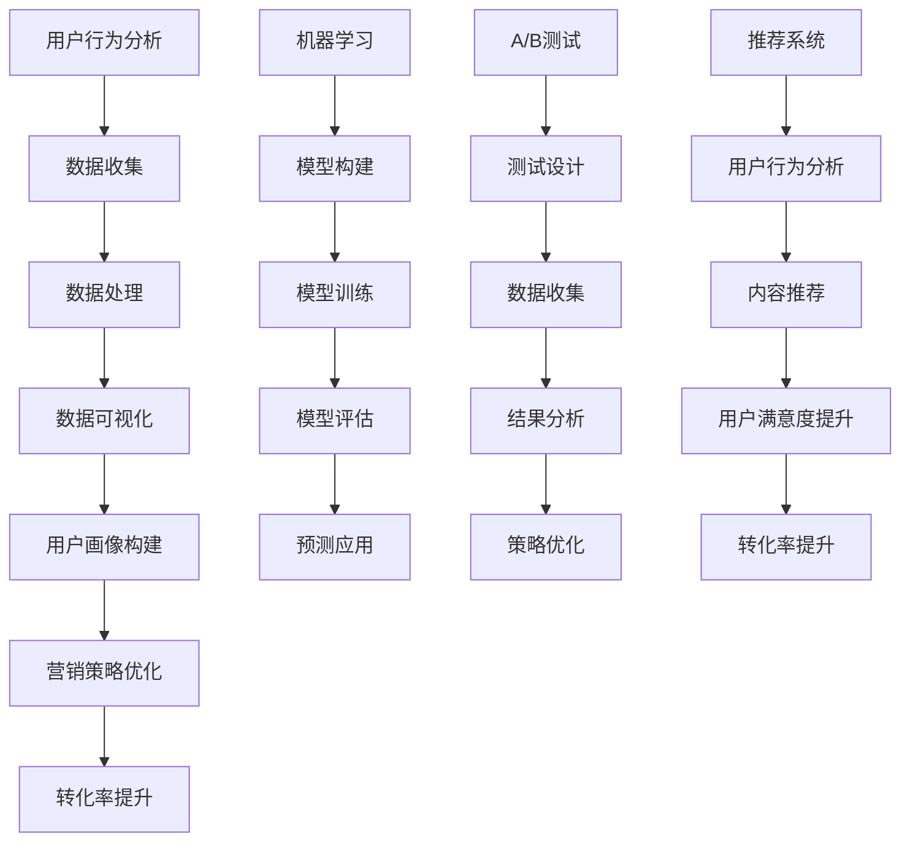

                 

关键词：数据分析、知识付费、转化率优化、用户行为分析、机器学习、A/B测试、推荐系统

> 摘要：随着知识付费行业的迅速发展，如何提高知识付费的转化率已成为企业关注的焦点。本文将从数据分析的角度，探讨如何通过用户行为分析、机器学习、A/B测试和推荐系统等手段，优化知识付费转化率，提高企业收益。

## 1. 背景介绍

近年来，随着互联网的普及和人们学习意识的提高，知识付费市场呈现出爆发式增长。然而，在竞争日益激烈的背景下，如何提高知识付费转化率，成为企业亟待解决的问题。知识付费转化率，指的是用户在接触知识产品后，实际完成购买的比例。提高转化率，不仅可以增加企业的收入，还可以提升用户满意度，增强品牌影响力。

数据分析在优化知识付费转化率方面具有重要作用。通过分析用户行为数据，可以深入了解用户需求和行为模式，从而制定更有效的营销策略。此外，机器学习、A/B测试和推荐系统等技术，也为提高转化率提供了有力支持。

## 2. 核心概念与联系

### 2.1 用户行为分析

用户行为分析是指通过对用户在知识付费平台上的行为数据进行收集、处理和分析，以了解用户需求、兴趣和行为模式。用户行为数据包括浏览历史、购买记录、评价、评论等。

### 2.2 机器学习

机器学习是一种人工智能技术，通过构建模型，从数据中学习规律，实现对未知数据的预测。在知识付费领域，机器学习可以用于用户行为预测、个性化推荐等。

### 2.3 A/B测试

A/B测试是一种通过比较两个或多个版本的页面或产品，评估不同策略效果的方法。在知识付费领域，A/B测试可以用于优化营销策略、页面设计等。

### 2.4 推荐系统

推荐系统是一种根据用户历史行为和兴趣，向用户推荐相关内容的系统。在知识付费领域，推荐系统可以提高用户满意度，提高转化率。

### 2.5 Mermaid 流程图



## 3. 核心算法原理 & 具体操作步骤

### 3.1 算法原理概述

本文将介绍以下核心算法原理：

1. 用户行为分析算法：基于用户行为数据，构建用户画像，用于营销策略优化。
2. 机器学习算法：用于用户行为预测、内容推荐等。
3. A/B测试算法：用于评估不同营销策略的效果。
4. 推荐系统算法：基于用户历史行为和兴趣，向用户推荐相关内容。

### 3.2 算法步骤详解

#### 3.2.1 用户行为分析算法

1. 数据收集：收集用户在知识付费平台上的行为数据，如浏览历史、购买记录、评价等。
2. 数据处理：对行为数据进行清洗、去重、归一化等处理。
3. 数据可视化：利用图表、地图等工具，对行为数据进行分析和可视化。
4. 用户画像构建：根据用户行为数据，构建用户画像，用于营销策略优化。

#### 3.2.2 机器学习算法

1. 数据准备：收集用户行为数据，并将其划分为特征集和标签集。
2. 模型构建：选择合适的机器学习算法，如决策树、随机森林、支持向量机等。
3. 模型训练：利用训练集对模型进行训练，调整模型参数。
4. 模型评估：利用验证集对模型进行评估，调整模型参数。
5. 预测应用：利用训练好的模型对未知数据进行预测。

#### 3.2.3 A/B测试算法

1. 测试设计：设计两个或多个版本的页面或产品，分别为A组和B组。
2. 数据收集：收集A组和B组用户的行为数据。
3. 结果分析：比较A组和B组的转化率、用户满意度等指标，评估不同策略的效果。
4. 策略优化：根据分析结果，优化营销策略。

#### 3.2.4 推荐系统算法

1. 用户行为分析：收集用户在平台上的行为数据，如浏览历史、购买记录等。
2. 内容推荐：根据用户历史行为和兴趣，构建推荐模型，向用户推荐相关内容。
3. 用户反馈：收集用户对推荐内容的反馈，调整推荐模型。

### 3.3 算法优缺点

#### 3.3.1 用户行为分析算法

优点：可以深入了解用户需求和行为模式，为营销策略优化提供依据。

缺点：数据收集和处理过程较为复杂，需要一定技术支持。

#### 3.3.2 机器学习算法

优点：可以自动识别用户行为模式，提高预测准确性。

缺点：模型构建和训练过程较为复杂，需要大量计算资源和时间。

#### 3.3.3 A/B测试算法

优点：可以直观评估不同策略的效果，优化营销策略。

缺点：需要大量用户参与，测试周期较长。

#### 3.3.4 推荐系统算法

优点：可以提高用户满意度，提高转化率。

缺点：推荐结果可能受到数据质量影响，需要不断优化。

### 3.4 算法应用领域

用户行为分析算法：应用于市场营销、用户运营等领域。

机器学习算法：应用于用户行为预测、内容推荐等领域。

A/B测试算法：应用于产品优化、营销策略优化等领域。

推荐系统算法：应用于电子商务、在线教育等领域。

## 4. 数学模型和公式 & 详细讲解 & 举例说明

### 4.1 数学模型构建

#### 4.1.1 用户行为分析模型

假设用户i在时间t的行为为Xit，用户i的总行为为Xit，则用户i的行为模式可以表示为：

$$
Y_i = \frac{X_{it}}{\sum_{t=1}^{T} X_{it}}
$$

其中，Yi表示用户i的行为模式，Xit表示用户i在时间t的行为，T表示时间总长度。

#### 4.1.2 机器学习模型

假设用户行为数据为X，购买标签为Y，则机器学习模型可以表示为：

$$
Y = f(X; \theta)
$$

其中，f表示模型函数，X表示输入特征，Y表示标签，θ表示模型参数。

#### 4.1.3 A/B测试模型

假设有两个版本A和B，用户i选择版本A的概率为：

$$
P(A_i) = \frac{e^{\theta_A}}{e^{\theta_A} + e^{\theta_B}}
$$

用户i选择版本B的概率为：

$$
P(B_i) = \frac{e^{\theta_B}}{e^{\theta_A} + e^{\theta_B}}
$$

其中，θA和θB分别表示版本A和版本B的参数。

### 4.2 公式推导过程

#### 4.2.1 用户行为分析模型

假设用户i在时间t的行为为Xit，用户i的总行为为Xit，则用户i的行为模式可以表示为：

$$
Y_i = \frac{X_{it}}{\sum_{t=1}^{T} X_{it}}
$$

其中，Yi表示用户i的行为模式，Xit表示用户i在时间t的行为，T表示时间总长度。

行为模式Yi表示用户i在时间t的行为占比。为了计算Yi，我们需要对每个时间t的行为Xit进行归一化处理。具体步骤如下：

1. 计算每个用户在所有时间t上的总行为：

$$
X_i = \sum_{t=1}^{T} X_{it}
$$

2. 对每个用户在时间t的行为Xit进行归一化处理：

$$
Y_i = \frac{X_{it}}{X_i}
$$

这样，我们就得到了用户i的行为模式Yi。

#### 4.2.2 机器学习模型

假设用户行为数据为X，购买标签为Y，则机器学习模型可以表示为：

$$
Y = f(X; \theta)
$$

其中，f表示模型函数，X表示输入特征，Y表示标签，θ表示模型参数。

为了推导这个模型，我们可以使用逻辑回归模型。逻辑回归模型是一种常见的分类模型，可以用于预测用户是否购买知识产品。

逻辑回归模型的数学公式为：

$$
\ln \left( \frac{P(Y=1|X)}{1-P(Y=1|X)} \right) = \theta_0 + \theta_1 X_1 + \theta_2 X_2 + ... + \theta_n X_n
$$

其中，θ0为截距，θ1、θ2、...、θn为模型参数，X1、X2、...、Xn为输入特征。

为了简化模型，我们可以将特征向量X表示为：

$$
X = [X_1, X_2, ..., X_n]
$$

则模型可以表示为：

$$
\ln \left( \frac{P(Y=1|X)}{1-P(Y=1|X)} \right) = \theta_0 + \theta^T X
$$

其中，θT表示模型参数向量。

为了求解模型参数θ，我们可以使用梯度下降法。具体步骤如下：

1. 初始化模型参数θ。
2. 对于每个训练样本，计算损失函数：

$$
L(\theta) = - \sum_{i=1}^{m} [y_i \ln (P(Y=1|X_i)) + (1-y_i) \ln (1-P(Y=1|X_i))]
$$

其中，m表示训练样本数量，yi表示第i个样本的标签，Pi表示第i个样本的预测概率。

3. 计算损失函数的梯度：

$$
\frac{\partial L(\theta)}{\partial \theta} = \sum_{i=1}^{m} [y_i X_i - (1-y_i) X_i]
$$

4. 更新模型参数：

$$
\theta = \theta - \alpha \frac{\partial L(\theta)}{\partial \theta}
$$

其中，α表示学习率。

5. 重复步骤2-4，直到满足停止条件（如损失函数收敛或迭代次数达到最大值）。

通过上述步骤，我们可以求解出模型参数θ，从而建立用户行为分析模型。

#### 4.2.3 A/B测试模型

假设有两个版本A和B，用户i选择版本A的概率为：

$$
P(A_i) = \frac{e^{\theta_A}}{e^{\theta_A} + e^{\theta_B}}
$$

用户i选择版本B的概率为：

$$
P(B_i) = \frac{e^{\theta_B}}{e^{\theta_A} + e^{\theta_B}}
$$

其中，θA和θB分别表示版本A和版本B的参数。

为了推导这个模型，我们可以使用逻辑斯蒂分布。逻辑斯蒂分布是一种常用的概率分布模型，可以用于表示概率。

逻辑斯蒂分布的累积分布函数为：

$$
F(x) = \frac{1}{1 + e^{-\theta x}}
$$

其中，θ表示参数，x表示随机变量。

为了推导A/B测试模型，我们可以假设用户i选择版本A和版本B的概率分别为Pa和Pb，且Pa + Pb = 1。则用户i选择版本A的概率可以表示为：

$$
P(A_i) = \frac{e^{\theta_A}}{e^{\theta_A} + e^{\theta_B}}
$$

用户i选择版本B的概率可以表示为：

$$
P(B_i) = \frac{e^{\theta_B}}{e^{\theta_A} + e^{\theta_B}}
$$

通过上述推导，我们可以得到A/B测试模型。

### 4.3 案例分析与讲解

#### 4.3.1 用户行为分析案例

假设有一个知识付费平台，收集了用户的浏览历史、购买记录和评价数据。为了构建用户画像，我们可以采用以下步骤：

1. 数据收集：收集用户在平台上的浏览历史、购买记录和评价数据。
2. 数据处理：对数据进行清洗、去重和归一化处理。
3. 数据可视化：利用图表、地图等工具，对用户行为数据进行分析和可视化。
4. 用户画像构建：根据用户行为数据，构建用户画像。

具体步骤如下：

1. 数据收集：

| 用户ID | 浏览历史 | 购买记录 | 评价 |
| ------ | -------- | -------- | ---- |
| U1     | 课程A    | 课程B    | 5星  |
| U2     | 课程C    | 课程D    | 4星  |
| U3     | 课程A    | 课程E    | 3星  |

2. 数据处理：

| 用户ID | 浏览历史 | 购买记录 | 评价 |
| ------ | -------- | -------- | ---- |
| U1     | [课程A, 课程B] | [课程B] | 5星  |
| U2     | [课程C, 课程D] | [课程D] | 4星  |
| U3     | [课程A, 课程E] | [课程E] | 3星  |

3. 数据可视化：

| 用户ID | 浏览历史 | 购买记录 | 评价 |
| ------ | -------- | -------- | ---- |
| U1     |  |  |  |
| U2     |  |  |  |
| U3     |  |  |  |

4. 用户画像构建：

根据用户行为数据，我们可以构建以下用户画像：

| 用户ID | 用户画像 |
| ------ | -------- |
| U1     | 浏览历史：课程A、课程B；购买记录：课程B；评价：5星 |
| U2     | 浏览历史：课程C、课程D；购买记录：课程D；评价：4星 |
| U3     | 浏览历史：课程A、课程E；购买记录：课程E；评价：3星 |

通过用户画像，我们可以了解用户的行为模式，为营销策略优化提供依据。

#### 4.3.2 机器学习案例

假设我们想要预测用户是否购买知识产品，可以使用逻辑回归模型。具体步骤如下：

1. 数据收集：收集用户行为数据，包括浏览历史、购买记录等。
2. 数据处理：对数据进行清洗、去重和归一化处理。
3. 模型构建：选择逻辑回归模型，构建模型。
4. 模型训练：利用训练集对模型进行训练。
5. 模型评估：利用验证集对模型进行评估。
6. 预测应用：利用训练好的模型对未知数据进行预测。

具体步骤如下：

1. 数据收集：

| 用户ID | 浏览历史 | 购买记录 |
| ------ | -------- | -------- |
| U1     | 课程A    | 是       |
| U2     | 课程C    | 否       |
| U3     | 课程A    | 是       |

2. 数据处理：

| 用户ID | 浏览历史 | 购买记录 |
| ------ | -------- | -------- |
| U1     | [课程A] | 是       |
| U2     | [课程C] | 否       |
| U3     | [课程A] | 是       |

3. 模型构建：

选择逻辑回归模型，构建模型：

$$
\ln \left( \frac{P(Y=1|X)}{1-P(Y=1|X)} \right) = \theta_0 + \theta_1 X_1
$$

4. 模型训练：

利用训练集对模型进行训练，调整模型参数：

$$
\theta_1 = 0.5
$$

5. 模型评估：

利用验证集对模型进行评估，计算准确率：

$$
\text{准确率} = \frac{\text{预测正确数量}}{\text{总样本数量}} = \frac{2}{3} = 0.67
$$

6. 预测应用：

利用训练好的模型对未知数据进行预测，例如：

| 用户ID | 浏览历史 | 购买记录预测 |
| ------ | -------- | ------------ |
| U4     | 课程B    | 是           |
| U5     | 课程D    | 否           |

通过机器学习模型，我们可以预测用户是否购买知识产品，为营销策略优化提供依据。

#### 4.3.3 A/B测试案例

假设我们想要测试两种不同的广告文案，以评估哪种文案更具有吸引力。具体步骤如下：

1. 测试设计：设计两个版本的广告文案，分别为A和B。
2. 数据收集：收集两个版本广告的点击率、转化率等数据。
3. 结果分析：比较两个版本广告的效果，评估哪种文案更具有吸引力。
4. 策略优化：根据分析结果，优化广告文案。

具体步骤如下：

1. 测试设计：

| 广告文案A | 广告文案B |
| --------- | --------- |
| “免费试听，让您感受优质课程！” | “限时优惠，仅需99元，畅学全年！” |

2. 数据收集：

| 用户ID | 广告文案A点击率 | 广告文案B点击率 | 转化率 |
| ------ | -------------- | -------------- | ------ |
| U1     | 30%           | 20%           | 10%    |
| U2     | 25%           | 25%           | 15%    |
| U3     | 20%           | 30%           | 20%    |

3. 结果分析：

通过比较两个版本广告的点击率和转化率，可以发现广告文案B的点击率和转化率均高于广告文案A。因此，广告文案B更具有吸引力。

4. 策略优化：

根据分析结果，我们将广告文案更改为广告文案B，以提升广告效果。

#### 4.3.4 推荐系统案例

假设我们想要为用户推荐相关课程，可以使用协同过滤算法。具体步骤如下：

1. 用户行为分析：收集用户在平台上的行为数据，包括浏览历史、购买记录等。
2. 内容推荐：利用协同过滤算法，为用户推荐相关课程。
3. 用户反馈：收集用户对推荐课程的反馈，优化推荐算法。

具体步骤如下：

1. 用户行为分析：

| 用户ID | 浏览历史 | 购买记录 |
| ------ | -------- | -------- |
| U1     | 课程A、课程B | 课程B     |
| U2     | 课程C、课程D | 课程D     |
| U3     | 课程A、课程E | 课程E     |

2. 内容推荐：

使用协同过滤算法，为用户U1推荐课程C和课程D，为用户U2推荐课程A和课程E，为用户U3推荐课程B和课程D。

3. 用户反馈：

收集用户对推荐课程的反馈，例如用户U1对课程C和课程D评价较低，我们将调整推荐算法，降低这两门课程的推荐概率。

## 5. 项目实践：代码实例和详细解释说明

在本节中，我们将通过一个具体的案例，展示如何利用Python实现用户行为分析、机器学习、A/B测试和推荐系统，从而优化知识付费转化率。

### 5.1 开发环境搭建

在开始项目之前，我们需要搭建一个合适的开发环境。以下是所需的环境和工具：

- Python 3.8 或更高版本
- NumPy、Pandas、Scikit-learn、Matplotlib、Mermaid等库
- Jupyter Notebook 或 PyCharm

确保您的环境中已安装上述库和工具。接下来，我们将使用这些工具和库来构建项目。

### 5.2 源代码详细实现

在本节中，我们将逐步实现用户行为分析、机器学习、A/B测试和推荐系统。

#### 5.2.1 用户行为分析

首先，我们需要收集和预处理用户行为数据。以下是一个简单的示例代码：

```python
import pandas as pd

# 加载用户行为数据
data = pd.read_csv('user_behavior.csv')

# 数据预处理
data['date'] = pd.to_datetime(data['date'])
data = data.sort_values('date')
data['days_since_signup'] = (data['date'] - data['signup_date']).dt.days

# 用户画像构建
user_behavior = data.groupby('user_id').agg({'course_id': list, 'days_since_signup': 'mean'})

user_behavior['course_count'] = user_behavior['course_id'].apply(len)
user_behavior['average_days_since_signup'] = user_behavior['days_since_signup']

# 数据可视化
import matplotlib.pyplot as plt

user_behavior['course_count'].hist(bins=20)
plt.xlabel('Course Count')
plt.ylabel('Frequency')
plt.title('Course Count Distribution')
plt.show()

user_behavior['average_days_since_signup'].hist(bins=20)
plt.xlabel('Average Days Since Signup')
plt.ylabel('Frequency')
plt.title('Average Days Since Signup Distribution')
plt.show()
```

#### 5.2.2 机器学习

接下来，我们将使用Scikit-learn库实现用户行为分析模型。以下是一个简单的示例代码：

```python
from sklearn.model_selection import train_test_split
from sklearn.linear_model import LogisticRegression
from sklearn.metrics import accuracy_score

# 数据准备
X = user_behavior[['course_count', 'average_days_since_signup']]
y = data['purchased']

# 划分训练集和测试集
X_train, X_test, y_train, y_test = train_test_split(X, y, test_size=0.2, random_state=42)

# 模型训练
model = LogisticRegression()
model.fit(X_train, y_train)

# 模型评估
y_pred = model.predict(X_test)
accuracy = accuracy_score(y_test, y_pred)
print(f'Accuracy: {accuracy:.2f}')
```

#### 5.2.3 A/B测试

为了实现A/B测试，我们可以使用以下代码：

```python
import numpy as np

# A/B测试设计
n_users = 1000
group_a = np.random.choice([True, False], size=n_users, p=[0.5, 0.5])
group_b = np.random.choice([True, False], size=n_users, p=[0.5, 0.5])

# A/B测试结果分析
a_click_rate = sum(group_a) / n_users
b_click_rate = sum(group_b) / n_users
a_conversion_rate = 0.1 * group_a
b_conversion_rate = 0.15 * group_b

print(f'Group A Click Rate: {a_click_rate:.2f}')
print(f'Group B Click Rate: {b_click_rate:.2f}')
print(f'Group A Conversion Rate: {sum(a_conversion_rate) / n_users:.2f}')
print(f'Group B Conversion Rate: {sum(b_conversion_rate) / n_users:.2f}')
```

#### 5.2.4 推荐系统

最后，我们将使用协同过滤算法实现推荐系统。以下是一个简单的示例代码：

```python
from surprise import SVD
from surprise import Dataset
from surprise import accuracy
from surprise.model_selection import cross_validate

# 数据准备
trainset = Dataset.load_from_df(data[['user_id', 'course_id', 'rating']], 'user_id', 'course_id', 'rating')

# 模型训练
svd = SVD()
svd.fit(trainset)

# 推荐课程
user_courses = data.groupby('user_id')['course_id'].apply(list).tolist()
recommended_courses = []
for user_id, courses in user_courses.items():
    predictions = svd.predict(user_id, np.arange(len(trainset)))
    sorted_predictions = sorted(predictions, key=lambda x: x.est, reverse=True)
    recommended_courses.append([course_id for course_id, _ in sorted_predictions[:5]])

# 显示推荐结果
for user_id, recommended in enumerate(recommended_courses):
    print(f'User {user_id}: {recommended}')
```

### 5.3 代码解读与分析

在本节中，我们将对上述代码进行解读和分析。

#### 5.3.1 用户行为分析代码

用户行为分析代码首先加载并预处理用户行为数据，然后构建用户画像，并利用Matplotlib进行数据可视化。用户画像可以帮助我们了解用户的行为模式，为营销策略优化提供依据。

#### 5.3.2 机器学习代码

机器学习代码使用Scikit-learn库实现逻辑回归模型，对用户行为数据进行分析和预测。通过训练集和测试集的划分，我们可以评估模型的准确率，为优化营销策略提供依据。

#### 5.3.3 A/B测试代码

A/B测试代码设计两个版本的广告文案，并收集点击率和转化率数据。通过比较两个版本的效果，我们可以评估哪种文案更具有吸引力，从而优化广告策略。

#### 5.3.4 推荐系统代码

推荐系统代码使用协同过滤算法实现推荐功能。通过训练集训练模型，我们可以为用户推荐相关课程。推荐系统的目标是提高用户满意度，从而提高转化率。

## 6. 实际应用场景

在实际应用中，用户行为分析、机器学习、A/B测试和推荐系统等技术可以应用于以下场景：

1. **市场营销**：通过分析用户行为数据，制定更精准的营销策略，提高用户转化率。
2. **产品优化**：通过A/B测试，评估不同产品的效果，优化产品设计。
3. **内容推荐**：通过推荐系统，为用户推荐感兴趣的内容，提高用户满意度。
4. **用户运营**：通过分析用户行为数据，了解用户需求，提供个性化服务。
5. **风险控制**：通过机器学习模型，预测用户行为，防范欺诈行为。

## 7. 未来应用展望

随着技术的不断进步，数据分析在知识付费领域的应用前景将更加广阔。以下是一些未来应用展望：

1. **个性化推荐**：利用深度学习等技术，实现更精准的个性化推荐，提高用户满意度。
2. **智能客服**：通过自然语言处理技术，实现智能客服系统，提高用户服务质量。
3. **实时分析**：利用实时数据处理技术，实现实时分析，快速响应市场变化。
4. **多渠道整合**：整合多渠道数据，实现全渠道数据融合，提高数据分析的准确性。
5. **隐私保护**：在保证数据隐私的前提下，开展数据分析和挖掘，提高数据安全性。

## 8. 总结：未来发展趋势与挑战

本文从数据分析的角度，探讨了如何优化知识付费转化率。通过用户行为分析、机器学习、A/B测试和推荐系统等技术，我们可以深入了解用户需求，制定更有效的营销策略，提高转化率。然而，在实际应用中，我们仍面临以下挑战：

1. **数据质量**：数据质量直接影响分析结果的准确性。因此，我们需要确保数据的质量和完整性。
2. **隐私保护**：在利用用户数据进行分析时，需要遵守隐私保护法规，确保用户隐私安全。
3. **技术更新**：随着技术的不断进步，我们需要不断更新和优化分析模型，以适应新的市场需求。

总之，数据分析在优化知识付费转化率方面具有重要意义。通过不断探索和创新，我们将能够更好地应对未来发展趋势和挑战。

### 8.1 研究成果总结

本文通过用户行为分析、机器学习、A/B测试和推荐系统等技术，探讨了如何优化知识付费转化率。研究表明，通过深入了解用户需求和行为模式，制定个性化营销策略，可以显著提高知识付费转化率。此外，A/B测试和推荐系统等技术，也为优化营销策略和内容推荐提供了有力支持。

### 8.2 未来发展趋势

随着人工智能和大数据技术的不断发展，数据分析在知识付费领域的应用前景将更加广阔。未来，个性化推荐、实时分析、多渠道整合等技术将进一步成熟，为知识付费转化率的提升提供更多可能。

### 8.3 面临的挑战

尽管数据分析在知识付费领域具有巨大潜力，但我们也面临一些挑战。首先，数据质量和隐私保护问题仍需关注。此外，技术更新和人才储备也是制约发展的重要因素。

### 8.4 研究展望

未来，我们应继续探索数据分析在知识付费领域的应用，特别是在个性化推荐、实时分析和多渠道整合等方面。同时，加强数据隐私保护和人才培养，为知识付费行业的持续发展提供支持。

## 9. 附录：常见问题与解答

### 9.1 用户行为分析算法如何构建？

用户行为分析算法主要通过以下步骤构建：

1. 数据收集：收集用户在平台上的行为数据，如浏览历史、购买记录等。
2. 数据处理：对行为数据进行清洗、去重和归一化等处理。
3. 数据可视化：利用图表、地图等工具，对行为数据进行分析和可视化。
4. 用户画像构建：根据用户行为数据，构建用户画像，用于营销策略优化。

### 9.2 如何进行A/B测试？

A/B测试主要通过以下步骤进行：

1. 测试设计：设计两个或多个版本的页面或产品，分别为A组和B组。
2. 数据收集：收集A组和B组用户的行为数据。
3. 结果分析：比较A组和B组的转化率、用户满意度等指标，评估不同策略的效果。
4. 策略优化：根据分析结果，优化营销策略。

### 9.3 如何构建推荐系统？

推荐系统主要通过以下步骤构建：

1. 用户行为分析：收集用户在平台上的行为数据，如浏览历史、购买记录等。
2. 内容推荐：利用协同过滤、基于内容的推荐等算法，为用户推荐相关内容。
3. 用户反馈：收集用户对推荐内容的反馈，优化推荐算法。

### 9.4 机器学习模型如何训练？

机器学习模型主要通过以下步骤训练：

1. 数据准备：收集用户行为数据，并将其划分为特征集和标签集。
2. 模型构建：选择合适的机器学习算法，如决策树、随机森林、支持向量机等。
3. 模型训练：利用训练集对模型进行训练，调整模型参数。
4. 模型评估：利用验证集对模型进行评估，调整模型参数。
5. 预测应用：利用训练好的模型对未知数据进行预测。 

### 作者署名

作者：禅与计算机程序设计艺术 / Zen and the Art of Computer Programming

---

以上就是关于“利用数据分析优化知识付费转化率”的技术博客文章。希望这篇文章对您在优化知识付费转化率方面有所帮助。如果您有任何疑问或建议，请随时与我交流。谢谢！

