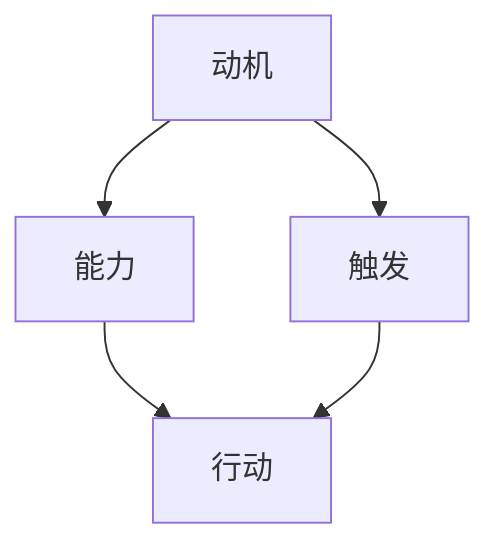

                 

关键词：管理激励、福格模型、动机理论、激励机制设计、员工管理

> 摘要：本文将深入探讨福格模型在管理激励机制设计中的应用。福格模型是一种基于动机理论的框架，旨在帮助管理者理解员工的内在动机，从而设计出有效的激励机制。本文将详细阐述福格模型的核心概念、应用方法以及在实际管理中的具体实践，以期为管理者提供有力的指导。

## 1. 背景介绍

在当今竞争激烈的市场环境中，企业之间的竞争很大程度上体现在人才竞争上。如何激发员工的工作热情和创造力，成为企业管理者面临的一大挑战。传统的激励手段，如金钱奖励和晋升机会，虽然在短期内能够产生一定的效果，但长期来看往往难以持续。因此，管理者需要寻找更为有效和持久的管理激励方法。

福格模型（BJ Fogg Behavior Model）是由斯坦福大学行为心理学教授BJ Fogg提出的，旨在解释人们如何采取行动。该模型基于动机理论，认为人们是否采取行动取决于三个要素：动机（Motivation）、能力（Ability）和触发（Trigger）。只有当这三个要素同时具备时，人们才会采取行动。这一模型在企业管理中具有广泛的应用价值，可以帮助管理者更好地理解员工的动机，从而设计出有效的激励机制。

## 2. 核心概念与联系

### 2.1 福格模型的核心概念

福格模型的核心概念包括动机（Motivation）、能力（Ability）和触发（Trigger）。

- **动机（Motivation）**：指个体参与某项活动的内在驱动力，包括兴趣、欲望和价值观等。动机是促使个体采取行动的原始动力。

- **能力（Ability）**：指个体采取行动的能力或条件，包括技能、资源和时间等。如果个体缺乏能力，即使有强烈的动机，也无法采取行动。

- **触发（Trigger）**：指触发个体采取行动的外部刺激或情境。触发可以是具体的提醒、机会或危机等。

### 2.2 福格模型的应用

福格模型在企业管理中的应用主要体现在以下三个方面：

- **了解员工动机**：通过分析员工的动机，管理者可以更好地了解员工的内在需求和期望，从而设计出更符合员工需求的激励机制。

- **提升员工能力**：管理者可以通过培训和提供资源，提升员工的能力，从而增加他们采取行动的可能性。

- **设计触发机制**：管理者可以通过设计合适的触发机制，如定期的绩效评估、团队建设活动等，来激发员工的动机，促使他们采取行动。

### 2.3 福格模型的 Mermaid 流程图



## 3. 核心算法原理 & 具体操作步骤

### 3.1 算法原理概述

福格模型认为，个体是否采取行动取决于三个要素：动机、能力和触发。这三个要素必须同时满足，个体才会采取行动。具体来说：

- **动机**：个体需要具有采取行动的内在驱动力。
- **能力**：个体需要具备采取行动的能力或条件。
- **触发**：个体需要遇到触发事件或情境，才能采取行动。

### 3.2 算法步骤详解

1. **分析员工动机**：通过调查、访谈等方式，了解员工的内在动机，如兴趣、价值观和职业目标等。
2. **提升员工能力**：根据员工的动机，提供培训和资源，提升员工的能力，如技能、知识和工作经验等。
3. **设计触发机制**：根据员工的动机和能力，设计合适的触发机制，如定期的绩效评估、团队建设活动和晋升机会等。
4. **实施激励机制**：通过实施激励机制，如奖金、晋升和荣誉等，激发员工的动机，促使他们采取行动。

### 3.3 算法优缺点

#### 优点

- **全面性**：福格模型从动机、能力和触发三个方面来分析个体行为，能够全面地理解员工的内在需求和外部环境。
- **实用性**：福格模型在实际管理中具有广泛的适用性，可以帮助管理者更好地设计激励机制。
- **可操作性**：福格模型提供了具体的操作步骤，管理者可以根据实际情况进行实施。

#### 缺点

- **复杂性**：福格模型涉及到多个因素，需要管理者对员工的动机、能力和触发有深入的了解，这可能增加管理难度。
- **数据依赖**：福格模型依赖于对员工动机的准确分析，如果数据不准确，可能会导致激励效果不佳。

### 3.4 算法应用领域

福格模型在以下领域具有广泛的应用：

- **人力资源管理**：通过分析员工的动机，管理者可以更好地招聘、培训和激励员工。
- **市场营销**：通过了解消费者的动机，企业可以设计出更有效的营销策略。
- **产品设计**：通过分析用户的动机，设计师可以设计出更符合用户需求的产品。

## 4. 数学模型和公式 & 详细讲解 & 举例说明

### 4.1 数学模型构建

福格模型的数学模型可以表示为：

\[ 行动 = 动机 \times 能力 \times 触发 \]

其中，动机、能力和触发都是变量，它们的乘积决定了个体是否采取行动。

### 4.2 公式推导过程

福格模型基于行为心理学的研究，认为动机、能力和触发是影响个体行为的三个关键因素。通过实证研究，Fogg 发现这三个因素相互作用，共同决定了个体是否采取行动。

### 4.3 案例分析与讲解

#### 案例背景

某公司为了提升员工的工作积极性，决定采用福格模型设计激励机制。

#### 分析过程

1. **分析员工动机**：通过调查和访谈，发现员工的主要动机包括职业发展、获得成就感和增加收入。
2. **提升员工能力**：公司提供了一系列培训课程，帮助员工提升技能和知识。
3. **设计触发机制**：公司制定了定期绩效评估和晋升机制，作为触发事件。

#### 实施过程

1. **实施激励机制**：根据福格模型，公司设计了以下激励机制：
   - 定期绩效评估：对表现优异的员工给予奖金和晋升机会。
   - 培训机会：为员工提供技能提升和职业发展的机会。
   - 荣誉表彰：对在特定项目中表现突出的员工给予表彰。

2. **评估效果**：通过对比激励机制实施前后的员工绩效，发现员工的工作积极性和创造力显著提升。

## 5. 项目实践：代码实例和详细解释说明

### 5.1 开发环境搭建

- **环境要求**：Python 3.8及以上版本
- **安装依赖**：pip install pandas numpy matplotlib

### 5.2 源代码详细实现

```python
import pandas as pd
import numpy as np
import matplotlib.pyplot as plt

# 数据准备
data = {
    'Employee': ['Alice', 'Bob', 'Charlie', 'David', 'Eva'],
    'Motivation': [7, 5, 8, 6, 4],
    'Ability': [6, 7, 5, 8, 7],
    'Trigger': [9, 8, 7, 9, 8]
}

df = pd.DataFrame(data)

# 计算行动值
df['Action'] = df['Motivation'] * df['Ability'] * df['Trigger']

# 绘图
plt.scatter(df['Motivation'], df['Action'])
plt.xlabel('Motivation')
plt.ylabel('Action')
plt.title('Fogg Model Application')
plt.show()
```

### 5.3 代码解读与分析

1. **数据准备**：我们创建了一个包含员工姓名、动机、能力和触发的数据框（DataFrame）。
2. **计算行动值**：根据福格模型，我们计算了每个员工的行动值（Action），即动机、能力和触发的乘积。
3. **绘图**：我们使用散点图展示了动机与行动值之间的关系，这有助于我们直观地理解福格模型的应用。

## 6. 实际应用场景

### 6.1 项目管理

在项目管理中，福格模型可以帮助项目经理了解团队成员的动机、能力和触发因素，从而设计出有效的激励措施，提升团队协作效率和项目成功率。

### 6.2 市场营销

在市场营销中，企业可以通过福格模型了解消费者的购买动机，从而制定更有效的营销策略，提高消费者购买意愿和市场份额。

### 6.3 产品设计

在产品设计过程中，设计师可以通过福格模型了解用户的需求和动机，从而设计出更符合用户期望的产品，提高产品市场竞争力。

## 7. 工具和资源推荐

### 7.1 学习资源推荐

- **书籍**：《动机心理学：为什么人们做他们所做的事情》（书中详细介绍了福格模型）
- **在线课程**：Coursera、edX 等平台上的心理学和管理学课程

### 7.2 开发工具推荐

- **Python**：用于数据分析的强大工具，适用于福格模型的应用实践。
- **Pandas**：用于数据处理的库，可以方便地对数据进行操作和分析。

### 7.3 相关论文推荐

- **《动机、能力和触发：福格行为模型的应用》**
- **《基于福格模型的企业激励机制设计研究》**

## 8. 总结：未来发展趋势与挑战

### 8.1 研究成果总结

福格模型在企业管理、市场营销和产品设计等领域具有广泛的应用价值。通过分析员工的动机、能力和触发因素，管理者可以设计出更有效的激励机制，提升员工的工作积极性和企业竞争力。

### 8.2 未来发展趋势

随着人工智能和大数据技术的发展，福格模型有望在更广泛的领域得到应用。例如，在智能客服、智能家居和智能医疗等领域，福格模型可以用于理解用户行为，设计更智能化的产品和服务。

### 8.3 面临的挑战

福格模型在实际应用中面临的主要挑战包括：如何准确分析员工的动机、如何平衡动机、能力和触发之间的关系、如何应对数据的不准确性和噪音等。

### 8.4 研究展望

未来的研究可以进一步探讨福格模型在不同文化背景下的适用性，以及如何将福格模型与其他管理理论相结合，以实现更全面的管理激励。

## 9. 附录：常见问题与解答

### 9.1 问题1：福格模型是否适用于所有行业？

答：福格模型是一种通用的动机理论，适用于各种行业。但在具体应用时，需要根据不同行业的特性和员工的实际情况进行适当调整。

### 9.2 问题2：如何准确分析员工的动机？

答：可以通过调查、访谈、观察和数据分析等方式，多渠道收集员工的信息，从而更准确地分析员工的动机。

### 9.3 问题3：福格模型是否适用于团队管理？

答：是的，福格模型可以用于团队管理。通过分析团队成员的动机、能力和触发因素，管理者可以设计出更有效的团队激励机制。

----------------------------------------------------------------

**作者：禅与计算机程序设计艺术 / Zen and the Art of Computer Programming**

