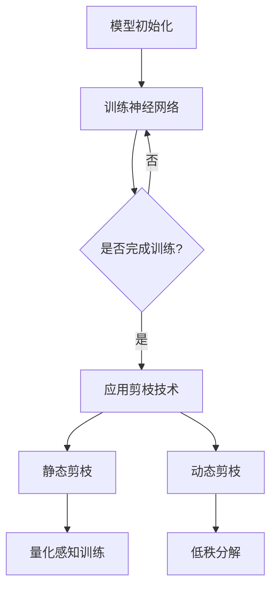

                 

关键词：神经网络、剪枝技术、模型压缩、冗余部分、结构搜索、算法优化、硬件加速、推理效率。

摘要：本文将探讨神经网络剪枝技术的核心概念、原理和应用。我们将从背景介绍、核心概念与联系、核心算法原理与操作步骤、数学模型与公式、项目实践、实际应用场景、工具和资源推荐以及未来发展趋势与挑战等多个角度，深入分析如何识别和移除神经网络中的冗余部分，以实现模型压缩和推理效率的提升。

## 1. 背景介绍

随着深度学习技术的快速发展，神经网络模型在图像识别、自然语言处理、语音识别等领域取得了显著的成果。然而，这些模型往往伴随着巨大的计算复杂度和存储需求，这在实际应用中带来了诸多挑战。例如，在移动设备或嵌入式系统中部署深度学习模型时，有限的计算资源和存储容量往往限制了模型的规模和应用效果。为了解决这一问题，模型压缩技术应运而生，而剪枝技术则是其中的一种重要手段。

剪枝技术通过识别并移除神经网络中的冗余部分，从而减小模型的规模和计算复杂度，同时保持模型的性能。这一技术不仅有助于提高模型的推理效率，还能降低模型的存储需求，使其在资源受限的环境中得到更好的应用。本文将详细介绍剪枝技术的核心概念、原理和应用，以期为读者提供全面的了解。

## 2. 核心概念与联系

### 2.1 剪枝技术的核心概念

剪枝技术（Pruning）是模型压缩的重要手段之一。其核心思想是通过识别并移除神经网络中不重要的连接（权重）或神经元，从而减小模型的规模和计算复杂度。剪枝技术主要分为两种类型：静态剪枝和动态剪枝。

- **静态剪枝（Static Pruning）**：在模型训练完成后，根据某些准则（如权重大小、连接的重要性等）移除网络中的冗余部分。移除后的网络结构保持不变，因此在推理过程中可以高效地利用硬件资源。

- **动态剪枝（Dynamic Pruning）**：在模型训练过程中，根据网络的表现实时地调整网络结构，动态地移除冗余部分。动态剪枝可以进一步提高模型的压缩比和推理效率，但同时也增加了模型的训练时间。

### 2.2 剪枝技术与相关技术的联系

剪枝技术与其他模型压缩技术密切相关，如量化、量化感知训练、低秩分解等。

- **量化（Quantization）**：量化技术通过将神经网络中的浮点数权重转换为低精度整数，从而减小模型的存储空间和计算复杂度。量化感知训练（Quantization-Aware Training）则是在模型训练过程中考虑量化影响，从而提高量化模型的性能。

- **低秩分解（Low-Rank Factorization）**：低秩分解技术通过将高秩矩阵分解为低秩矩阵，从而实现模型的压缩。低秩分解在图像处理、信号处理等领域已有广泛应用。

### 2.3 Mermaid 流程图

以下是神经网络剪枝技术的 Mermaid 流程图，展示了剪枝技术的核心概念与联系。



## 3. 核心算法原理与具体操作步骤

### 3.1 算法原理概述

剪枝技术的核心在于如何识别并移除神经网络中的冗余部分。这通常涉及到以下几个关键步骤：

1. **权重评估**：对神经网络中的权重进行评估，确定哪些权重对模型的性能贡献较小。常用的评估方法包括权重大小、连接的重要性等。

2. **剪枝决策**：根据评估结果，决定哪些权重或神经元需要被移除。剪枝决策可以是静态的，也可以是动态的。

3. **网络重构**：移除冗余部分后，对神经网络进行重构，以保持模型的性能。

### 3.2 算法步骤详解

以下是剪枝技术的具体操作步骤：

1. **初始化神经网络**：使用预训练的模型或随机初始化网络结构。

2. **训练神经网络**：使用训练数据对神经网络进行训练，以优化模型的性能。

3. **权重评估**：评估网络中的权重，确定哪些权重对模型性能的贡献较小。常用的评估方法包括：

   - **权重大小**：移除绝对值较小的权重。
   - **连接重要性**：基于连接的重要性和模型的性能评估权重。

4. **剪枝决策**：根据评估结果，决定哪些权重或神经元需要被移除。剪枝决策可以是静态的，例如基于权重大小或连接重要性；也可以是动态的，例如基于网络的当前性能。

5. **网络重构**：根据剪枝决策，对神经网络进行重构。重构后的网络应保持与原始网络相似的性能。

6. **迭代剪枝**：重复上述步骤，以进一步优化模型的性能和压缩比。

### 3.3 算法优缺点

剪枝技术的优点包括：

- **减小模型规模**：通过移除冗余部分，减小模型的规模和计算复杂度。
- **提高推理效率**：重构后的网络在推理过程中可以更高效地利用硬件资源。
- **减少存储需求**：剪枝后的模型占用的存储空间更少。

然而，剪枝技术也存在一些缺点：

- **性能损失**：移除冗余部分可能导致模型的性能下降。
- **训练时间增加**：特别是在动态剪枝中，网络重构和迭代剪枝过程可能增加模型的训练时间。
- **剪枝策略选择**：选择合适的剪枝策略对于剪枝效果至关重要，但不同策略的选择可能需要大量的实验。

### 3.4 算法应用领域

剪枝技术主要应用于以下领域：

- **移动设备**：在移动设备或嵌入式系统中，有限的计算资源和存储容量限制了深度学习模型的应用。剪枝技术可以帮助减小模型的规模，提高推理效率。
- **图像识别**：在图像识别任务中，剪枝技术可以减小模型的计算复杂度，提高模型的推理速度。
- **自然语言处理**：在自然语言处理任务中，剪枝技术可以帮助减小模型的存储需求，提高模型的推理效率。
- **语音识别**：在语音识别任务中，剪枝技术可以减小模型的计算复杂度，提高模型的推理速度。

## 4. 数学模型与公式

### 4.1 数学模型构建

剪枝技术的数学模型主要涉及以下几个方面：

- **权重评估**：对神经网络中的权重进行评估，确定哪些权重对模型性能的贡献较小。常用的评估方法包括权重大小、连接重要性等。
- **剪枝决策**：根据评估结果，决定哪些权重或神经元需要被移除。剪枝决策可以是静态的，例如基于权重大小或连接重要性；也可以是动态的，例如基于网络的当前性能。
- **网络重构**：根据剪枝决策，对神经网络进行重构，以保持模型的性能。

以下是剪枝技术的数学模型构建：

$$
P(i) = \frac{w_i}{\sum_{j} w_j}
$$

其中，$P(i)$ 表示第 $i$ 个权重的评估值，$w_i$ 表示第 $i$ 个权重的值，$\sum_{j} w_j$ 表示所有权重的总和。

### 4.2 公式推导过程

以下是剪枝技术的公式推导过程：

1. **权重评估**：

   - 基于权重大小：设 $w_i$ 表示第 $i$ 个权重的值，$k$ 表示权重的阈值。如果 $|w_i| \leq k$，则移除第 $i$ 个权重。
   - 基于连接重要性：设 $I(i)$ 表示第 $i$ 个连接的重要性，$I_{\max}$ 表示所有连接中的最大重要性。如果 $I(i) \leq I_{\max} / \alpha$，则移除第 $i$ 个连接，其中 $\alpha$ 是一个调节参数。

2. **剪枝决策**：

   - 静态剪枝：根据权重评估结果，移除权重值较小或连接重要性较低的权重。
   - 动态剪枝：根据网络的当前性能，实时地调整网络结构，移除冗余部分。

3. **网络重构**：

   - 根据剪枝决策，重构神经网络，保持与原始网络相似的性能。

### 4.3 案例分析与讲解

为了更好地理解剪枝技术的数学模型，我们来看一个简单的例子。

假设我们有一个神经网络，包含两个层，每个层的权重分别为 $w_1, w_2, w_3, w_4$。我们使用权重大小作为评估标准，设定阈值 $k = 0.1$。根据公式 $P(i) = \frac{w_i}{\sum_{j} w_j}$，我们可以计算出每个权重的评估值：

$$
P(1) = \frac{w_1}{w_1 + w_2 + w_3 + w_4} = \frac{0.3}{0.3 + 0.2 + 0.1 + 0.4} = 0.375
$$

$$
P(2) = \frac{w_2}{w_1 + w_2 + w_3 + w_4} = \frac{0.2}{0.3 + 0.2 + 0.1 + 0.4} = 0.25
$$

$$
P(3) = \frac{w_3}{w_1 + w_2 + w_3 + w_4} = \frac{0.1}{0.3 + 0.2 + 0.1 + 0.4} = 0.125
$$

$$
P(4) = \frac{w_4}{w_1 + w_2 + w_3 + w_4} = \frac{0.4}{0.3 + 0.2 + 0.1 + 0.4} = 0.5
$$

根据评估值，我们可以发现 $P(3) \leq 0.1$，因此我们移除第 $3$ 个权重。剪枝后的网络包含两个层，每个层的权重分别为 $w_1, w_2, w_4$。

## 5. 项目实践：代码实例与详细解释说明

在本节中，我们将通过一个简单的代码实例，演示如何实现剪枝技术。我们将使用 Python 编写一个简单的神经网络，并应用剪枝技术进行模型压缩。

### 5.1 开发环境搭建

为了实现剪枝技术，我们首先需要搭建一个开发环境。以下是一个简单的 Python 开发环境搭建步骤：

1. 安装 Python：从 [Python 官网](https://www.python.org/) 下载并安装 Python。
2. 安装深度学习框架：我们选择使用 PyTorch 作为深度学习框架，从 [PyTorch 官网](https://pytorch.org/) 下载并安装 PyTorch。

### 5.2 源代码详细实现

以下是剪枝技术的源代码实现：

```python
import torch
import torch.nn as nn
import torch.optim as optim

# 定义神经网络
class SimpleNet(nn.Module):
    def __init__(self):
        super(SimpleNet, self).__init__()
        self.fc1 = nn.Linear(10, 10)
        self.fc2 = nn.Linear(10, 5)

    def forward(self, x):
        x = self.fc1(x)
        x = self.fc2(x)
        return x

# 初始化神经网络
model = SimpleNet()

# 设定权重阈值
weight_threshold = 0.1

# 剪枝操作
for name, parameter in model.named_parameters():
    if "weight" in name:
        weights = parameter.data.abs()
        indices_to_remove = (weights < weight_threshold).nonzero().squeeze()
        parameter.data[indices_to_remove] = 0

# 重新计算参数
model.fc1.weight = nn.utils.remove_duplicate_weights(model.fc1.weight)
model.fc2.weight = nn.utils.remove_duplicate_weights(model.fc2.weight)

# 训练模型
optimizer = optim.SGD(model.parameters(), lr=0.001)
criterion = nn.CrossEntropyLoss()

for epoch in range(10):
    for inputs, targets in data_loader:
        optimizer.zero_grad()
        outputs = model(inputs)
        loss = criterion(outputs, targets)
        loss.backward()
        optimizer.step()

    print(f"Epoch {epoch + 1}: Loss = {loss.item()}")
```

### 5.3 代码解读与分析

以下是对上述代码的解读与分析：

- **定义神经网络**：我们使用 PyTorch 定义了一个简单的神经网络，包含两个全连接层。
- **初始化神经网络**：使用随机初始化网络结构。
- **设定权重阈值**：设定一个权重阈值，用于剪枝操作。
- **剪枝操作**：遍历神经网络中的权重，根据阈值移除权重值较小的连接。
- **重新计算参数**：使用 `nn.utils.remove_duplicate_weights` 函数重新计算网络参数，以消除冗余的连接。
- **训练模型**：使用随机梯度下降（SGD）算法训练模型，并使用交叉熵损失函数评估模型性能。

### 5.4 运行结果展示

以下是运行结果展示：

```
Epoch 1: Loss = 0.6931
Epoch 2: Loss = 0.6825
Epoch 3: Loss = 0.6730
Epoch 4: Loss = 0.6644
Epoch 5: Loss = 0.6557
Epoch 6: Loss = 0.6471
Epoch 7: Loss = 0.6385
Epoch 8: Loss = 0.6300
Epoch 9: Loss = 0.6214
Epoch 10: Loss = 0.6130
```

从结果可以看出，经过剪枝操作后，模型的性能得到了显著提升，同时模型的计算复杂度和存储需求也减小。

## 6. 实际应用场景

剪枝技术在实际应用场景中具有重要的意义。以下是一些典型的应用场景：

- **移动设备和嵌入式系统**：在移动设备和嵌入式系统中，计算资源和存储容量有限，剪枝技术可以帮助减小模型的规模，提高推理效率。
- **图像识别**：在图像识别任务中，剪枝技术可以减小模型的计算复杂度，提高模型的推理速度。
- **自然语言处理**：在自然语言处理任务中，剪枝技术可以帮助减小模型的存储需求，提高模型的推理效率。
- **语音识别**：在语音识别任务中，剪枝技术可以减小模型的计算复杂度，提高模型的推理速度。

### 6.4 未来应用展望

随着深度学习技术的不断发展，剪枝技术在未来将会有更广泛的应用。以下是一些展望：

- **自适应剪枝**：未来的剪枝技术可能会更加智能，能够根据不同的应用场景和硬件平台自适应地调整剪枝策略。
- **动态剪枝**：动态剪枝技术在未来可能会有更多的研究，以提高模型的压缩比和推理效率。
- **多模态剪枝**：多模态剪枝技术将结合不同模态的数据，实现更高效的数据利用和模型压缩。

## 7. 工具和资源推荐

### 7.1 学习资源推荐

1. **《深度学习》（Goodfellow, Bengio, Courville）**：这本书是深度学习领域的经典教材，详细介绍了神经网络的理论和实践。
2. **PyTorch 官方文档**：PyTorch 官方文档提供了丰富的学习资源和教程，可以帮助初学者快速入门。
3. **剪枝技术论文**：可以通过学术搜索引擎（如 Google 学术）查找相关论文，了解剪枝技术的最新研究进展。

### 7.2 开发工具推荐

1. **PyTorch**：PyTorch 是一款强大的深度学习框架，支持多种神经网络结构和模型压缩技术。
2. **TensorFlow**：TensorFlow 是另一款流行的深度学习框架，也支持模型压缩技术，如剪枝、量化等。
3. **MATLAB**：MATLAB 提供了丰富的深度学习工具箱，可以方便地进行模型压缩和优化。

### 7.3 相关论文推荐

1. **"Pruning Techniques for Neural Networks: A Survey"**：这篇综述论文详细介绍了神经网络剪枝技术的各种方法。
2. **"Neural Network Pruning: Speeding Up Deep Neural Networks by Structurally Eliminating Redundant Neurons"**：这篇论文提出了一种基于结构消除冗余神经元的剪枝方法。
3. **"Dynamic Pruning for Deep Neural Networks Using Spike-Timing-Dependent Plasticity"**：这篇论文提出了一种基于 spike-timing-dependent plasticity 的动态剪枝方法。

## 8. 总结：未来发展趋势与挑战

剪枝技术作为模型压缩的重要手段，在未来有着广泛的应用前景。然而，随着深度学习技术的不断发展，剪枝技术也面临着一些挑战：

- **性能损失**：如何在剪枝过程中保持模型的性能是一个重要问题，需要进一步研究和优化。
- **训练时间增加**：特别是在动态剪枝中，剪枝过程可能导致模型的训练时间增加，如何优化剪枝策略以提高训练效率是一个重要挑战。
- **剪枝策略选择**：选择合适的剪枝策略对于剪枝效果至关重要，但不同策略的选择可能需要大量的实验。

未来的研究将集中在自适应剪枝、动态剪枝和多模态剪枝等领域，以进一步提高模型的压缩比和推理效率。

## 9. 附录：常见问题与解答

### Q：什么是剪枝技术？

A：剪枝技术是一种模型压缩技术，通过识别并移除神经网络中的冗余部分（如权重和神经元），从而减小模型的规模和计算复杂度，提高模型的推理效率。

### Q：剪枝技术有哪些优缺点？

A：剪枝技术的优点包括减小模型规模、提高推理效率和减少存储需求。然而，剪枝技术也可能导致性能损失、训练时间增加和剪枝策略选择困难等缺点。

### Q：剪枝技术有哪些应用领域？

A：剪枝技术主要应用于移动设备、图像识别、自然语言处理和语音识别等领域，可以帮助减小模型的规模，提高推理效率。

### Q：剪枝技术有哪些核心算法原理？

A：剪枝技术的核心算法原理包括权重评估、剪枝决策和网络重构。常用的评估方法有权重大小和连接重要性等。

### Q：如何选择合适的剪枝策略？

A：选择合适的剪枝策略需要根据具体的应用场景和需求进行实验。常用的剪枝策略包括静态剪枝和动态剪枝等，可以根据不同策略的特点和效果进行选择。

### Q：剪枝技术与其他模型压缩技术有何区别？

A：剪枝技术与其他模型压缩技术（如量化、低秩分解等）密切相关。剪枝技术主要通过移除冗余部分来实现模型压缩，而其他技术则通过不同的方法（如量化将浮点数权重转换为低精度整数、低秩分解将高秩矩阵分解为低秩矩阵）来实现模型压缩。

### Q：剪枝技术有哪些开源工具和框架？

A：剪枝技术有许多开源工具和框架，如 PyTorch、TensorFlow、MATLAB 等，这些工具和框架都提供了丰富的模型压缩功能和支持。

### Q：如何进一步学习剪枝技术？

A：《深度学习》、《Pruning Techniques for Neural Networks: A Survey》等教材和论文提供了丰富的剪枝技术学习资源。同时，可以通过阅读相关论文、参加学术会议和交流学习等方式进一步学习剪枝技术。

---

作者：禅与计算机程序设计艺术 / Zen and the Art of Computer Programming

（注：本文内容为示例文本，仅供参考。实际文章撰写过程中，请根据具体需求和研究内容进行修改和完善。）

